**TRƯỜNG ĐẠI HỌC CÔNG NGHỆ THÔNG TIN, ĐHQG-HCM**

**KHOA MẠNG MÁY TÍNH VÀ TRUYỀN THÔNG**

![][image1]

**BÁO CÁO ĐỒ ÁN MÔN HỌC**

# **ĐỀ TÀI: Xây dựng Calendar Assistant Web**

**Môn học:** Công nghệ Web và ứng dụng \- SE347.Q12

**Giảng viên hướng dẫn:  Đặng Việt Dũng**

**Thực hiện bởi nhóm 2, bao gồm:**

1. Tạ Văn Thái			22523177		Trưởng nhóm
2. Bùi Quốc Lâm		22520733		Thành viên
3. Nguyễn Văn Quyền 		22521223		Thành viên
4. Nguyễn Công Thắng 	22521330		Thành viên

**Thời gian thực hiện:** \<Thời gian bắt đầu\> \- \<Thời gian kết thúc\>

# **MỤC LỤC**

[MỤC LỤC	2](#mục-lục)

[DANH SÁCH HÌNH, BẢNG	3](#danh-sách-hình,-bảng)

[TÓM TẮT	4](#tóm-tắt)

[Chương I. TỔNG QUAN.	5](#chương-i.-tổng-quan.)

[1\. Giới thiệu đề tài.	5](#1.-giới-thiệu-đề-tài.)

[1.1. Tiểu mục nếu cần thiết.	5](#heading=h.mp948p3xzpi6)

[1.2. Tiểu mục khác.	5](#1.2.-lý-do-chọn-đề-tài.)

[2\. Cơ sở lý thuyết.	5](#2.-cơ-sở-lý-thuyết.)

[Chương II. THIẾT KẾ HỆ THỐNG.	6](#chương-ii.-thiết-kế-hệ-thống.)

[Chương III. TRIỂN KHAI HỆ THỐNG.	7](#chương-iii.-triển-khai-hệ-thống.)

[Chương IV. KẾT LUẬN.	8](#chương-iv.-kết-luận.)

[NGUỒN THAM KHẢO	9](#nguồn-tham-khảo)

# **DANH SÁCH HÌNH, BẢNG**

[Hình 1\. Kiến trúc của Kubernetes.	6](#heading)
[Hình 2\. Kiến trúc của Docker.	6](#hình-2.-kiến-trúc-của-docker.)

**Lưu ý:** Đối với một đồ án môn học thì việc đính kèm danh sách hình và danh sách bảng trong file báo cáo thường là không bắt buộc. Nếu số lượng hình minh họa, bảng biểu quá nhiều thì việc thêm danh sách khi đó là cần thiết. Khi thêm, cần tạo riêng một trang dành cho danh sách hình và một trang dành cho danh sách bảng.

# **TÓM TẮT**

**Calento** là ứng dụng web quản lý lịch thông minh tích hợp công nghệ Large Language Models (LLMs) \- cụ thể là Google Gemini AI, được phát triển nhằm giải quyết vấn đề quản lý thời gian và tối ưu hóa quy trình lên lịch tự động thông qua xử lý ngôn ngữ tự nhiên (NLP) và function calling.

Tính năng chính:

* **AI-Powered Scheduling**: Trợ lý ảo Gemini AI hiểu ngôn ngữ tự nhiê, tự động tạo sự kiện, phân tích lịch trống và đề xuất thời gian họp tối ưu
* **Google Calendar Sync**: Đồng bộ hai chiều real-time qua OAuth 2.0 và webhook
* **Priority Management**: Kanban board drag-and-drop quản lý tasks, booking links, habits theo mức độ ưu tiên
* **Booking Links**: Tạo liên kết đặt lịch công khai tương tự Calendly
* **Multi-channel Notifications**: Thông báo qua email, Slack và webhook

Công nghệ:

* **AI/LLMs**: Google Gemini AI với function calling API
* **Backend**: NestJS \+ TypeScript \+ PostgreSQL \+ Redis/BullMQ
* **Frontend**: Next.js 15 \+ React 18 \+ TanStack Query \+ Tailwind CSS
* **Authentication**: JWT \+ OAuth 2.0

**Kết quả:** Ứng dụng web hoàn chỉnh với hơn 50 API endpoints, giao diện responsive, AI chatbot xử lý tiếng Việt/Anh. Code theo clean architecture với TypeScript strict mode.

# **Chương I. TỔNG QUAN.**

## **1\. Giới thiệu đề tài.**

Trong thời đại số hóa, việc quản lý thời gian hiệu quả là thách thức lớn. Các công cụ quản lý lịch truyền thống thiếu tính tự động hóa và AI, khiến người dùng mất nhiều thời gian sắp xếp công việc.

**Calento** là giải pháp web application tích hợp AI vào quy trình quản lý lịch, cho phép:

* Tương tác với AI qua ngôn ngữ tự nhiên
* Đồng bộ tự động với Google Calendar
* Quản lý ưu tiên với drag-and-drop
* Tạo booking links tự động
* Nhận thông báo đa kênh

Đề tài áp dụng kiến thức môn học về: kiến trúc web, RESTful API, frontend/backend frameworks, database design, authentication, real-time communication, và AI integration.

### **1.2. Lý do chọn đề tài.**

- **Tính thực tiễn cao:**

* Nhu cầu quản lý thời gian là thiết yếu
* Các công cụ hiện có chưa tối ưu về tự động hóa
* Có thể áp dụng vào thực tế

**\- Phù hợp môn học:**

* Áp dụng đầy đủ kiến thức về công nghệ web
* Sử dụng frameworks và thư viện hiện đại
* Triển khai design patterns trong web development

**\- Học hỏi công nghệ mới:**

* AI/ML APIs integration
* Third-party services (Google, Slack)
* Real-time systems với webhooks
* Queue management với BullMQ

### **1.3. Mục tiêu và phạm vi.**

- **Mục tiêu:**

1. Xây dựng ứng dụng web hoàn chỉnh với AI assistant
2. Áp dụng kiến thức môn học vào dự án thực tế
3. Nghiên cứu công nghệ mới: AI, webhooks, queues
4. Đảm bảo code quality với clean architecture

- **Phạm vi:**

* CRUD operations cho events với recurring support
* AI Chatbot với function calling
* Google Calendar sync via webhooks
* Priority management drag-and-drop
* Booking links system
* JWT \+ OAuth 2.0 authentication
* Email notifications
* Queue system cho background jobs
* ❌ Mobile app (chỉ web)
* ❌ Video conferencing integration
* ❌ Payment processing

## **2\. Cơ sở lý thuyết.**

### **2.1. Công nghệ Backend**

#### **2.1.1. NestJS Framework**

NestJS là một framework progressive Node.js được xây dựng với TypeScript, sử dụng kiến trúc modular và dependency injection pattern. Framework này phù hợp cho việc xây dựng các ứng dụng server-side có khả năng mở rộng cao.

**Đặc điểm chính:**

- **Modular Architecture**: Tổ chức code theo modules, dễ bảo trì và tái sử dụng
- **Dependency Injection**: Quản lý dependencies tự động, giảm coupling
- **Decorators**: Sử dụng TypeScript decorators cho metadata và routing
- **Built-in Support**: Hỗ trợ sẵn validation, authentication, logging

#### **2.1.2. PostgreSQL Database**

PostgreSQL là hệ quản trị cơ sở dữ liệu quan hệ mã nguồn mở, hỗ trợ ACID transactions và các tính năng nâng cao như JSONB, full-text search, và recursive queries.

**Ưu điểm:**

- **ACID Compliance**: Đảm bảo tính toàn vẹn dữ liệu
- **JSONB Support**: Lưu trữ dữ liệu semi-structured hiệu quả
- **Extensibility**: Hỗ trợ custom types, functions, và indexes
- **Performance**: Xử lý concurrent connections tốt

#### **2.1.3. Redis & BullMQ**

Redis là in-memory data store được sử dụng cho caching và message queue. BullMQ là thư viện queue system xây dựng trên Redis.

**Ứng dụng trong project:**

- **Caching**: Cache user sessions, calendar data
- **Queue System**: Xử lý background jobs (email, sync)
- **Rate Limiting**: Giới hạn số lượng requests
- **Session Storage**: Lưu trữ JWT refresh tokens

### **2.2. Công nghệ Frontend**

#### **2.2.1. Next.js 15 Framework**

Next.js là React framework hỗ trợ Server-Side Rendering (SSR), Static Site Generation (SSG), và App Router mới với React Server Components.

**Tính năng sử dụng:**

- **App Router**: File-based routing với layouts và nested routes
- **Server Components**: Render component trên server, giảm bundle size
- **API Routes**: Built-in API endpoints
- **Image Optimization**: Tự động tối ưu hóa hình ảnh

#### **2.2.2. TanStack Query v5**

TanStack Query (trước đây là React Query) là thư viện quản lý server state, hỗ trợ caching, synchronization, và automatic refetching.

**Lợi ích:**

- **Automatic Caching**: Cache data tự động, giảm network requests
- **Background Updates**: Tự động refetch data khi cần
- **Optimistic Updates**: Cập nhật UI trước khi API response
- **Pagination & Infinite Scroll**: Built-in support

#### **2.2.3. Zustand State Management**

Zustand là thư viện quản lý client state nhẹ, đơn giản hơn Redux nhưng vẫn đủ mạnh mẽ.

**Đặc điểm:**

- **Minimal Boilerplate**: Ít code setup hơn Redux
- **TypeScript Support**: Type-safe out of the box
- **Persistence**: Tích hợp localStorage dễ dàng
- **DevTools**: Hỗ trợ debugging

### **2.3. AI & Large Language Models**

#### **2.3.1. Google Gemini AI**

Gemini là family of Large Language Models (LLMs) của Google, hỗ trợ multimodal input và function calling API.

**Function Calling:**

- Cho phép AI gọi pre-defined functions
- Schema validation cho parameters
- Structured output format
- Error handling and retry logic

**Ứng dụng trong Calento:**

- Natural language understanding cho calendar commands
- Smart scheduling suggestions
- Event creation via chat
- Availability checking

#### **2.3.2. Prompt Engineering**

Prompt engineering là kỹ thuật thiết kế và tối ưu hóa prompts để AI model đưa ra responses chính xác hơn.

**System Prompts:**

```typescript
- Define AI role and behavior
- Specify output format
- Provide context (current date, user preferences)
- Define available functions
```

**Context Management:**

- Include user's calendar context
- Track conversation history
- Maintain multi-turn dialogue
- Update context dynamically

### **2.4. Authentication & Authorization**

#### **2.4.1. JWT (JSON Web Tokens)**

JWT là standard mở (RFC 7519) cho việc truyền thông tin an toàn giữa parties dưới dạng JSON object.

**Cấu trúc JWT:**

```
Header.Payload.Signature
```

- **Header**: Algorithm và token type
- **Payload**: User claims (id, email, role)
- **Signature**: Verify token integrity

**Trong Calento:**

- Access Token: Expires sau 1 giờ
- Refresh Token: Expires sau 7 ngày
- HTTP-only cookies cho bảo mật

#### **2.4.2. OAuth 2.0 Protocol**

OAuth 2.0 là authorization framework cho phép third-party applications truy cập user data mà không cần password.

**Google OAuth Flow:**

1. User clicks "Login with Google"
2. Redirect to Google authorization page
3. User grants permissions
4. Google returns authorization code
5. Exchange code for access/refresh tokens
6. Store tokens và access Google Calendar API

### **2.5. RESTful API Design**

#### **2.5.1. REST Principles**

REST (Representational State Transfer) là architectural style cho distributed systems.

**Constraints:**

- **Client-Server**: Separation of concerns
- **Stateless**: Mỗi request chứa đủ thông tin
- **Cacheable**: Responses có thể cache
- **Uniform Interface**: Consistent resource URIs

**HTTP Methods:**

- GET: Retrieve resources
- POST: Create new resources
- PATCH/PUT: Update resources
- DELETE: Remove resources

#### **2.5.2. API Versioning & Documentation**

**Swagger/OpenAPI:**

- Auto-generate API documentation
- Interactive API testing
- Schema validation
- Type definitions export

### **2.6. Design Patterns**

#### **2.6.1. Repository Pattern**

Tách biệt business logic khỏi data access logic.

**Lợi ích:**

- Single source of truth cho data access
- Dễ testing (mock repositories)
- Tái sử dụng queries
- Thay đổi data source dễ dàng

#### **2.6.2. Service Layer Pattern**

Business logic được tập trung trong service layer, controller chỉ handle HTTP concerns.

**Kiến trúc:**

```
Controller → Service → Repository → Database
```

#### **2.6.3. DTO (Data Transfer Objects)**

DTOs định nghĩa structure của data được truyền giữa layers.

**Validation:**

- class-validator decorators
- Automatic validation trong NestJS
- Type safety với TypeScript
- Transform và sanitize input

### **2.7. Real-time Communication**

#### **2.7.1. Webhooks**

Webhooks là HTTP callbacks khi events xảy ra ở third-party service.

**Google Calendar Webhooks:**

- Subscribe to calendar changes
- Receive push notifications
- Auto-sync events
- Channel expiration handling

#### **2.7.2. Background Jobs**

Xử lý long-running tasks bất đồng bộ.

**BullMQ Features:**

- Job queues với priority
- Auto-retry with exponential backoff
- Job scheduling
- Monitoring dashboard

# **Chương II. THIẾT KẾ HỆ THỐNG.**

## **1\. Kiến trúc tổng thể**

### **1.1. High-Level Architecture**

Hệ thống Calento được thiết kế theo kiến trúc client-server với 3 layers chính:

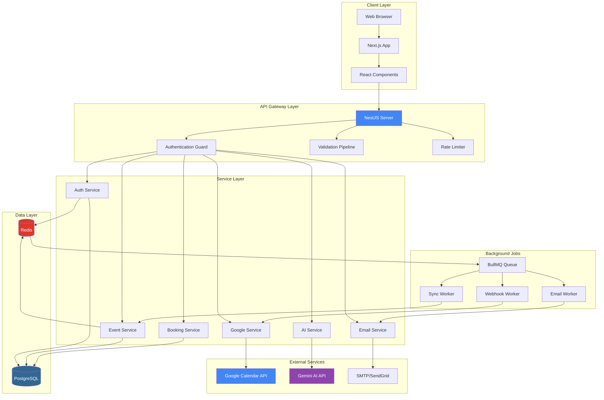

**Giải thích các thành phần:**

**Client Layer:**

- Web Browser: Trình duyệt người dùng
- Next.js App: Framework SSR/SSG
- React Components: UI components

**API Gateway Layer:**

- NestJS Server: API server chính
- Authentication Guard: JWT validation
- Validation Pipeline: DTO validation
- Rate Limiter: Request throttling

**Service Layer:**

- Auth Service: Authentication & Authorization
- Event Service: Calendar events management
- Booking Service: Scheduling links
- AI Service: Chatbot với Gemini
- Google Service: Calendar sync
- Email Service: Notifications

**Data Layer:**

- PostgreSQL: Primary database
- Redis: Cache & session store

**External Services:**

- Google Calendar API: Calendar sync
- Gemini AI API: AI chatbot
- SMTP/SendGrid: Email delivery

**Background Jobs:**

- BullMQ Queue: Job queue management
- Workers: Async task processing

### **2.2. Data Flow Architecture**

**Frontend → Backend → Database → Response Flow:**

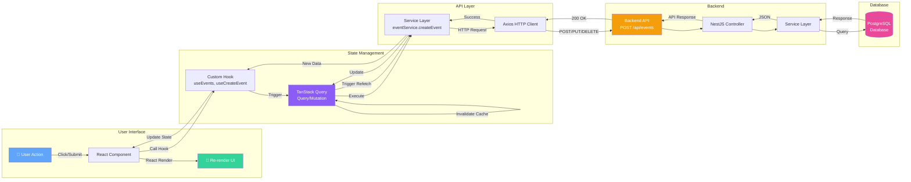

**Giải thích luồng dữ liệu:**

1. **User Action**: User thực hiện hành động (click button, submit form)
2. **React Component**: Component xử lý event và call custom hook
3. **Custom Hook**: Hook như `useCreateEvent` được gọi với data
4. **TanStack Query**: Mutation được trigger, gọi service layer
5. **Service Layer**: `eventService.createEvent()` chuẩn bị HTTP request
6. **Axios Client**: Send HTTP request đến backend API
7. **Backend API**: NestJS nhận request tại endpoint (POST /api/events)
8. **Controller**: Validate request và forward đến service
9. **Service**: Xử lý business logic
10. **Database**: Execute SQL query (INSERT/UPDATE/DELETE)
11. **Response**: Data trả về qua các layers
12. **Cache Update**: TanStack Query invalidate cache và trigger refetch
13. **Re-render**: React component re-render với data mới

**Key Features:**

- **Automatic Caching**: TanStack Query cache responses
- **Optimistic Updates**: UI updates trước khi API response
- **Error Handling**: Centralized error handling tại mọi layer
- **Loading States**: Automatic loading states cho async operations
- **Query Invalidation**: Smart cache invalidation sau mutations

### **2.3. Frontend Sitemap & Page Structure**

**Application Route Structure:**


**Component Hierarchy:**

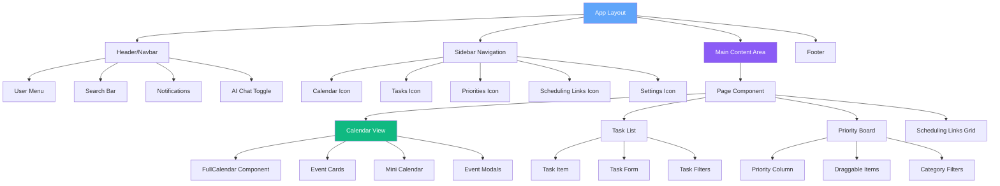

### **2.4. User Flow Diagrams**

**Main User Journey - Event Creation:**

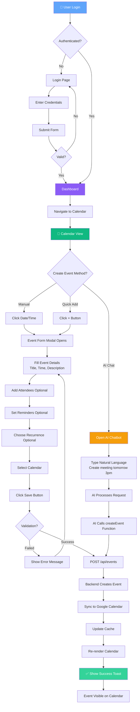

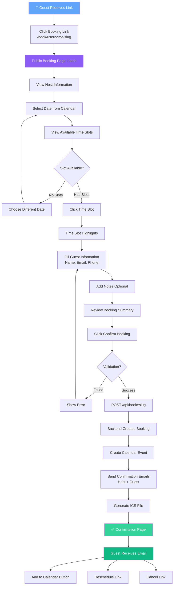

**AI Chatbot Interaction Flow:**

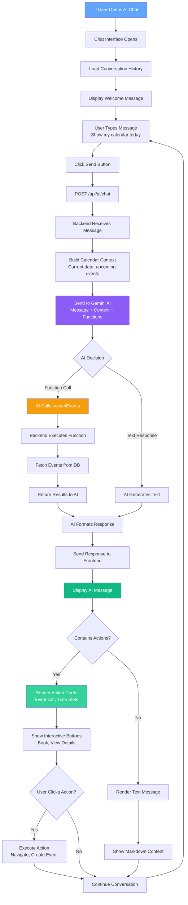

### **2.5. Module Architecture

**Backend Modules (NestJS):**

- **Common Module**: Shared services, guards, interceptors
- **Auth Module**: Authentication và authorization
- **Users Module**: User management
- **Event Module**: Calendar events management
- **Booking Module**: Scheduling links system
- **Google Module**: Google Calendar integration
- **AI Module**: Gemini AI chatbot
- **Email Module**: Email notifications
- **Queue Module**: Background job processing
- **Webhook Module**: External service notifications

**Frontend Structure:**

```
client/
├── app/                    # Next.js App Router
│   ├── (auth)/            # Auth pages
│   ├── (dashboard)/       # Protected pages
│   └── api/               # API routes
├── components/            # React components
│   ├── calendar/         # Calendar UI
│   ├── chat/             # AI chatbot
│   └── ui/               # Reusable UI
├── hook/                 # Custom React hooks
├── service/              # API services
├── store/                # Zustand stores
└── utils/                # Helper functions
```

## **2\. Server Flows**

### **2.1. Authentication Flow (Login)**

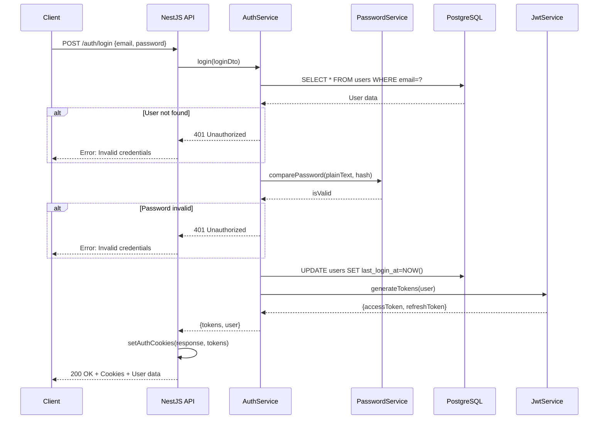

### **2.2. Event Creation Flow**

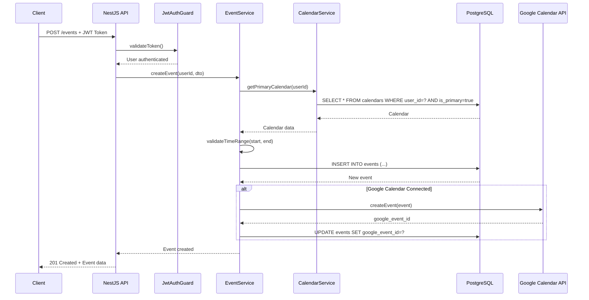

### **2.3. AI Chatbot Flow**

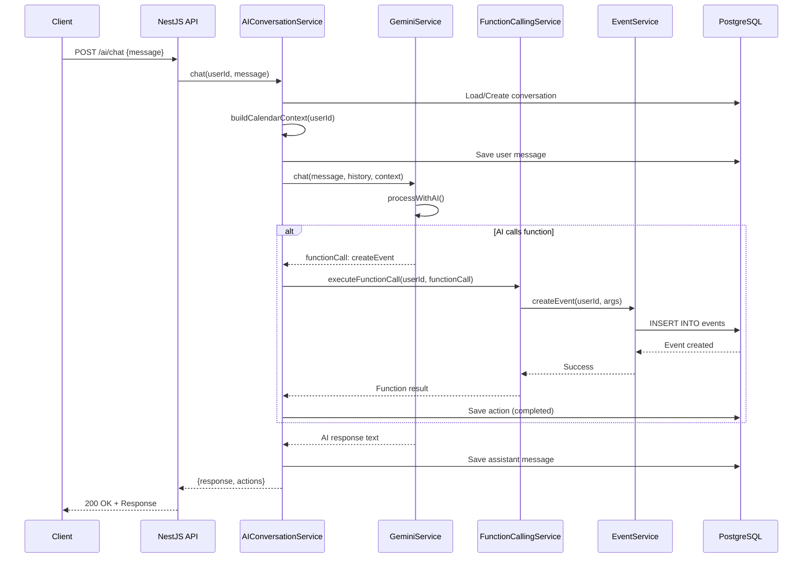

### **2.4. Google Calendar Sync Flow**

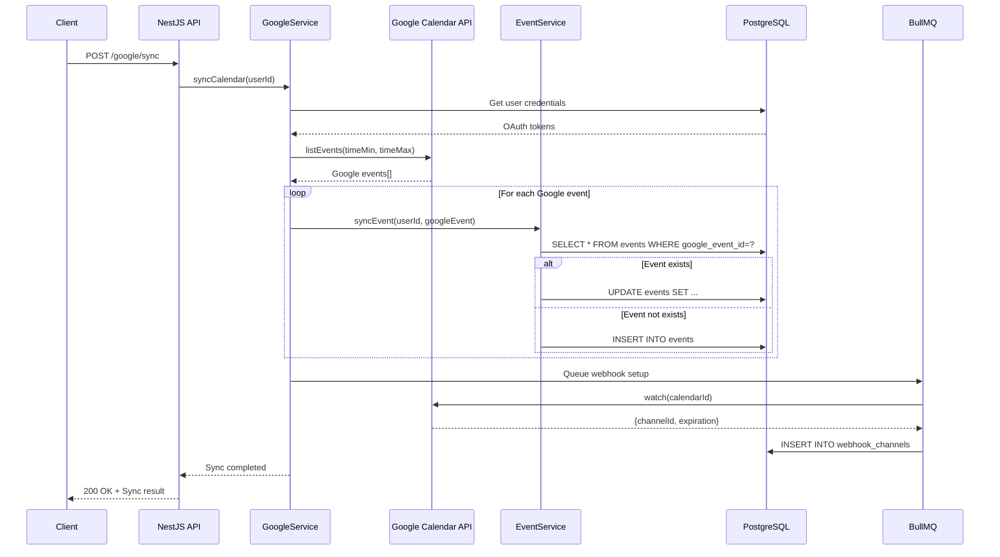

### **2.5. Booking Flow (Guest)**

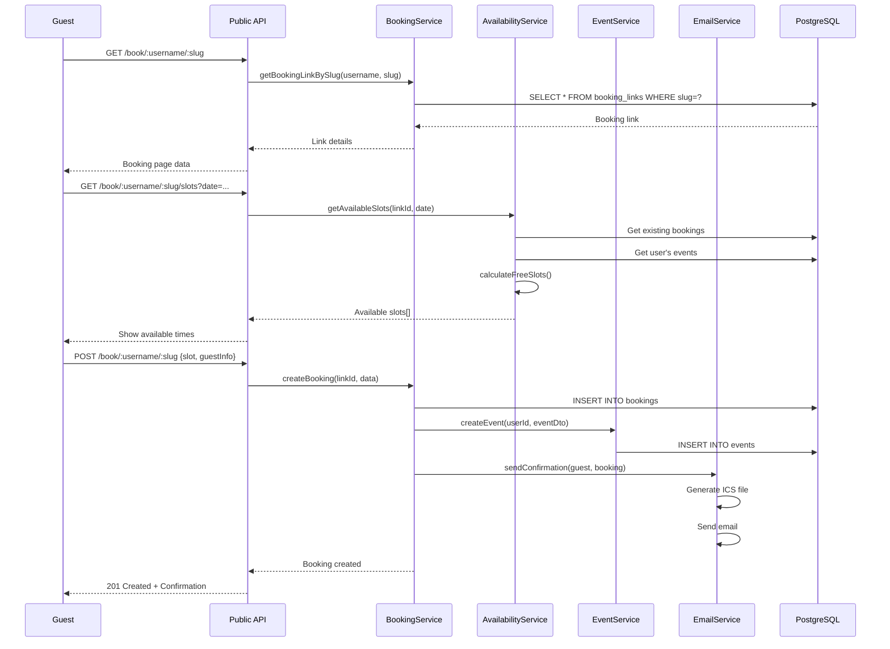

### **2.6. Database Migration Flow (Raw SQL)**

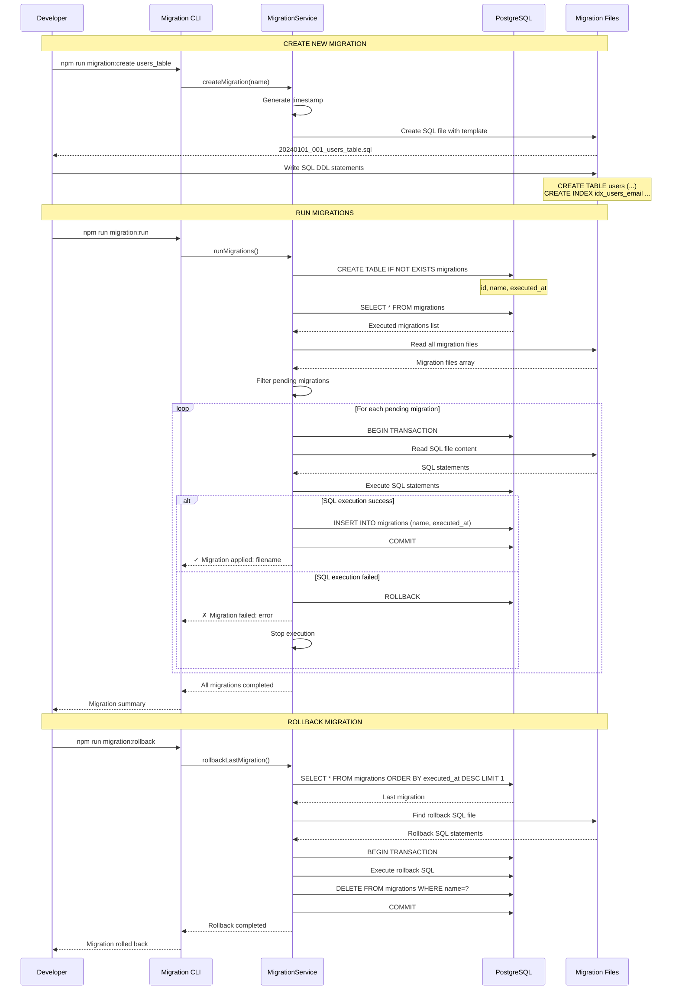

**Migration File Structure:**

**Create Migration:**

```sql
-- 20240101_001_create_users_table.sql
-- UP Migration
CREATE TABLE IF NOT EXISTS users (
    id UUID PRIMARY KEY DEFAULT gen_random_uuid(),
    email VARCHAR(255) UNIQUE NOT NULL,
    username VARCHAR(255) UNIQUE NOT NULL,
    password_hash TEXT NOT NULL,
    created_at TIMESTAMP DEFAULT CURRENT_TIMESTAMP,
    updated_at TIMESTAMP DEFAULT CURRENT_TIMESTAMP
);

CREATE INDEX idx_users_email ON users(email);
CREATE INDEX idx_users_username ON users(username);

-- Auto-update timestamp trigger
CREATE OR REPLACE FUNCTION update_updated_at_column()
RETURNS TRIGGER AS $$
BEGIN
    NEW.updated_at = CURRENT_TIMESTAMP;
    RETURN NEW;
END;
$$ language 'plpgsql';

CREATE TRIGGER update_users_updated_at 
    BEFORE UPDATE ON users 
    FOR EACH ROW 
    EXECUTE FUNCTION update_updated_at_column();
```

**Rollback Migration:**

```sql
-- 20240101_001_create_users_table_rollback.sql
-- DOWN Migration
DROP TRIGGER IF EXISTS update_users_updated_at ON users;
DROP FUNCTION IF EXISTS update_updated_at_column();
DROP INDEX IF EXISTS idx_users_username;
DROP INDEX IF EXISTS idx_users_email;
DROP TABLE IF EXISTS users CASCADE;
```

**Migration Service Implementation:**

```typescript
// Raw SQL - No ORM
export class MigrationService {
  async runMigrations(): Promise<void> {
    // 1. Ensure migrations table exists
    await this.db.query(`
      CREATE TABLE IF NOT EXISTS migrations (
        id SERIAL PRIMARY KEY,
        name VARCHAR(255) UNIQUE NOT NULL,
        executed_at TIMESTAMP DEFAULT CURRENT_TIMESTAMP
      )
    `);

    // 2. Get executed migrations
    const { rows: executed } = await this.db.query(
      'SELECT name FROM migrations ORDER BY executed_at'
    );
    const executedSet = new Set(executed.map(r => r.name));

    // 3. Get all migration files
    const files = await fs.readdir('./migrations');
    const pending = files
      .filter(f => f.endsWith('.sql') && !f.includes('rollback'))
      .filter(f => !executedSet.has(f))
      .sort();

    // 4. Execute each pending migration
    for (const file of pending) {
      const sql = await fs.readFile(`./migrations/${file}`, 'utf8');
  
      try {
        await this.db.query('BEGIN');
  
        // Execute migration SQL
        await this.db.query(sql);
  
        // Record migration
        await this.db.query(
          'INSERT INTO migrations (name) VALUES ($1)',
          [file]
        );
  
        await this.db.query('COMMIT');
        console.log(`✓ Applied: ${file}`);
      } catch (error) {
        await this.db.query('ROLLBACK');
        console.error(`✗ Failed: ${file}`, error);
        throw error;
      }
    }
  }
}
```

**Key Features:**

1. **Pure SQL**: Không sử dụng ORM, chỉ raw SQL queries
2. **Transaction Safety**: Mỗi migration chạy trong transaction
3. **Tracking**: Table `migrations` track executed migrations
4. **Rollback Support**: Mỗi migration có file rollback tương ứng
5. **Idempotent**: Sử dụng `IF NOT EXISTS`, `IF EXISTS`
6. **Order Guarantee**: Migration files có timestamp prefix
7. **Error Handling**: Rollback nếu migration fails

## **3\. Thiết kế Database**

### **3.1. Danh sách đầy đủ Tables**

Hệ thống Calento sử dụng **15 tables chính** trong PostgreSQL database:

| STT | Table Name       | Mô tả                  | Records ước tính |
| --- | ---------------- | ------------------------ | ------------------- |
| 1   | users            | Thông tin người dùng | ~10,000             |
| 2   | calendars        | Calendar của user       | ~10,000             |
| 3   | events           | Calendar events          | ~500,000            |
| 4   | booking_links    | Scheduling links         | ~50,000             |
| 5   | bookings         | Guest bookings           | ~200,000            |
| 6   | user_credentials | OAuth tokens             | ~10,000             |
| 7   | webhook_channels | Google webhooks          | ~10,000             |
| 8   | ai_conversations | AI chat sessions         | ~100,000            |
| 9   | ai_actions       | AI function calls        | ~500,000            |
| 10  | email_logs       | Email tracking           | ~1,000,000          |
| 11  | email_templates  | Email templates          | ~50                 |
| 12  | priorities       | Priority board items     | ~100,000            |
| 13  | tasks            | Task management          | ~200,000            |
| 14  | habits           | Habit tracking           | ~50,000             |
| 15  | notifications    | System notifications     | ~500,000            |

### **3.3. Chi tiết Core Tables**

#### **1. users Table**

Lưu trữ thông tin người dùng và authentication data.

| Column        | Type         | Constraints                | Description            |
| ------------- | ------------ | -------------------------- | ---------------------- |
| id            | UUID         | PRIMARY KEY                | User ID                |
| email         | VARCHAR(255) | UNIQUE, NOT NULL           | Email address          |
| username      | VARCHAR(255) | UNIQUE, NOT NULL           | Username               |
| password_hash | TEXT         | NOT NULL                   | Bcrypt hashed password |
| first_name    | VARCHAR(100) |                            | First name             |
| last_name     | VARCHAR(100) |                            | Last name              |
| avatar        | TEXT         |                            | Avatar URL             |
| timezone      | VARCHAR(50)  | DEFAULT 'Asia/Ho_Chi_Minh' | User timezone          |
| status        | VARCHAR(20)  | DEFAULT 'active'           | Account status         |
| last_login_at | TIMESTAMP    |                            | Last login time        |
| created_at    | TIMESTAMP    | DEFAULT NOW()              | Created timestamp      |
| updated_at    | TIMESTAMP    | DEFAULT NOW()              | Updated timestamp      |

**Indexes:**

- `idx_users_email` ON email
- `idx_users_username` ON username
- `idx_users_status` ON status

#### **2. calendars Table**

Lưu trữ calendars của user (local + synced).

| Column             | Type         | Constraints                | Description        |
| ------------------ | ------------ | -------------------------- | ------------------ |
| id                 | UUID         | PRIMARY KEY                | Calendar ID        |
| user_id            | UUID         | FOREIGN KEY → users(id)   | Calendar owner     |
| name               | VARCHAR(255) | NOT NULL                   | Calendar name      |
| description        | TEXT         |                            | Description        |
| color              | VARCHAR(7)   | DEFAULT '#4285f4'          | Display color      |
| timezone           | VARCHAR(50)  | DEFAULT 'Asia/Ho_Chi_Minh' | Calendar timezone  |
| is_primary         | BOOLEAN      | DEFAULT false              | Primary calendar   |
| is_synced          | BOOLEAN      | DEFAULT false              | Google synced      |
| google_calendar_id | VARCHAR(255) |                            | Google Calendar ID |
| created_at         | TIMESTAMP    | DEFAULT NOW()              | Created timestamp  |
| updated_at         | TIMESTAMP    | DEFAULT NOW()              | Updated timestamp  |

**Indexes:**

- `idx_calendars_user` ON user_id
- `idx_calendars_primary` ON (user_id, is_primary)
- `idx_calendars_google` ON google_calendar_id

#### **3. events Table**

Lưu trữ calendar events với recurring support.

| Column                     | Type         | Constraints                  | Description        |
| -------------------------- | ------------ | ---------------------------- | ------------------ |
| id                         | UUID         | PRIMARY KEY                  | Event ID           |
| user_id                    | UUID         | FOREIGN KEY → users(id)     | Event owner        |
| calendar_id                | UUID         | FOREIGN KEY → calendars(id) | Parent calendar    |
| google_event_id            | VARCHAR(255) |                              | Google Calendar ID |
| title                      | VARCHAR(255) | NOT NULL                     | Event title        |
| description                | TEXT         |                              | Event description  |
| location                   | TEXT         |                              | Event location     |
| start_time                 | TIMESTAMP    | NOT NULL                     | Start datetime     |
| end_time                   | TIMESTAMP    | NOT NULL                     | End datetime       |
| timezone                   | VARCHAR(50)  | DEFAULT 'Asia/Ho_Chi_Minh'   | Event timezone     |
| is_all_day                 | BOOLEAN      | DEFAULT false                | All-day event      |
| recurrence_rule            | TEXT         |                              | RRULE format       |
| recurrence_exception_dates | JSONB        |                              | Excluded dates     |
| attendees                  | JSONB        |                              | Attendee list      |
| conference_data            | JSONB        |                              | Meeting link info  |
| reminders                  | JSONB        |                              | Reminder settings  |
| visibility                 | VARCHAR(20)  | DEFAULT 'default'            | public/private     |
| status                     | VARCHAR(20)  | DEFAULT 'confirmed'          | Event status       |
| created_at                 | TIMESTAMP    | DEFAULT NOW()                | Created timestamp  |
| updated_at                 | TIMESTAMP    | DEFAULT NOW()                | Updated timestamp  |
| deleted_at                 | TIMESTAMP    |                              | Soft delete        |

**Indexes:**

- `idx_events_user_time` ON (user_id, start_time, end_time)
- `idx_events_calendar` ON calendar_id
- `idx_events_google_id` ON google_event_id
- `idx_events_recurring` ON recurrence_rule WHERE recurrence_rule IS NOT NULL
- `idx_events_search` ON (title, description) USING gin

#### **4. booking_links Table**

Lưu trữ customizable scheduling links.

| Column                | Type         | Constraints              | Description                  |
| --------------------- | ------------ | ------------------------ | ---------------------------- |
| id                    | UUID         | PRIMARY KEY              | Link ID                      |
| user_id               | UUID         | FOREIGN KEY → users(id) | Link owner                   |
| title                 | VARCHAR(255) | NOT NULL                 | Link title                   |
| slug                  | VARCHAR(255) | NOT NULL                 | URL slug                     |
| description           | TEXT         |                          | Link description             |
| duration_minutes      | INT          | NOT NULL                 | Meeting duration             |
| buffer_before_minutes | INT          | DEFAULT 0                | Buffer before meeting        |
| buffer_after_minutes  | INT          | DEFAULT 0                | Buffer after meeting         |
| availability_type     | VARCHAR(50)  | NOT NULL                 | specific_hours/calendar_sync |
| availability_hours    | JSONB        |                          | Week schedule                |
| location_type         | VARCHAR(50)  | DEFAULT 'google_meet'    | Meeting location type        |
| location_value        | TEXT         |                          | Location value               |
| color                 | VARCHAR(7)   | DEFAULT '#4285f4'        | Display color                |
| is_active             | BOOLEAN      | DEFAULT true             | Active status                |
| bookings_count        | INT          | DEFAULT 0                | Total bookings               |
| max_bookings_per_day  | INT          |                          | Daily limit                  |
| notice_period_hours   | INT          | DEFAULT 24               | Advance booking time         |
| created_at            | TIMESTAMP    | DEFAULT NOW()            | Created timestamp            |
| updated_at            | TIMESTAMP    | DEFAULT NOW()            | Updated timestamp            |

**Unique Constraint:** (user_id, slug)

**Indexes:**

- `idx_booking_links_user` ON user_id
- `idx_booking_links_slug` ON (user_id, slug)
- `idx_booking_links_active` ON is_active

#### **5. bookings Table**

Lưu trữ guest bookings từ booking links.

| Column              | Type         | Constraints                      | Description       |
| ------------------- | ------------ | -------------------------------- | ----------------- |
| id                  | UUID         | PRIMARY KEY                      | Booking ID        |
| booking_link_id     | UUID         | FOREIGN KEY → booking_links(id) | Link used         |
| event_id            | UUID         | FOREIGN KEY → events(id)        | Created event     |
| guest_name          | VARCHAR(255) | NOT NULL                         | Guest name        |
| guest_email         | VARCHAR(255) | NOT NULL                         | Guest email       |
| guest_phone         | VARCHAR(50)  |                                  | Guest phone       |
| guest_notes         | TEXT         |                                  | Additional notes  |
| slot_start          | TIMESTAMP    | NOT NULL                         | Booked start time |
| slot_end            | TIMESTAMP    | NOT NULL                         | Booked end time   |
| timezone            | VARCHAR(50)  | NOT NULL                         | Guest timezone    |
| status              | VARCHAR(50)  | DEFAULT 'confirmed'              | Booking status    |
| cancellation_reason | TEXT         |                                  | If cancelled      |
| reminder_sent       | BOOLEAN      | DEFAULT false                    | Reminder status   |
| created_at          | TIMESTAMP    | DEFAULT NOW()                    | Created timestamp |
| updated_at          | TIMESTAMP    | DEFAULT NOW()                    | Updated timestamp |

**Indexes:**

- `idx_bookings_link` ON booking_link_id
- `idx_bookings_email` ON guest_email
- `idx_bookings_time` ON (slot_start, slot_end)
- `idx_bookings_status` ON status

#### **6. user_credentials Table**

Lưu trữ OAuth tokens cho external services.

| Column        | Type        | Constraints              | Description          |
| ------------- | ----------- | ------------------------ | -------------------- |
| id            | UUID        | PRIMARY KEY              | Credential ID        |
| user_id       | UUID        | FOREIGN KEY → users(id) | User ID              |
| provider      | VARCHAR(50) | NOT NULL                 | google/microsoft/etc |
| access_token  | TEXT        | NOT NULL                 | OAuth access token   |
| refresh_token | TEXT        |                          | OAuth refresh token  |
| expires_at    | TIMESTAMP   |                          | Token expiration     |
| scope         | TEXT        |                          | Granted scopes       |
| created_at    | TIMESTAMP   | DEFAULT NOW()            | Created timestamp    |
| updated_at    | TIMESTAMP   | DEFAULT NOW()            | Updated timestamp    |

**Unique Constraint:** (user_id, provider)

**Indexes:**

- `idx_credentials_user_provider` ON (user_id, provider)

#### **7. webhook_channels Table**

Lưu trữ Google Calendar webhook channels.

| Column      | Type         | Constraints                  | Description           |
| ----------- | ------------ | ---------------------------- | --------------------- |
| id          | UUID         | PRIMARY KEY                  | Channel ID (internal) |
| user_id     | UUID         | FOREIGN KEY → users(id)     | User ID               |
| calendar_id | UUID         | FOREIGN KEY → calendars(id) | Calendar ID           |
| channel_id  | VARCHAR(255) | NOT NULL                     | Google channel ID     |
| resource_id | VARCHAR(255) | NOT NULL                     | Google resource ID    |
| expiration  | TIMESTAMP    | NOT NULL                     | Channel expiration    |
| is_active   | BOOLEAN      | DEFAULT true                 | Active status         |
| created_at  | TIMESTAMP    | DEFAULT NOW()                | Created timestamp     |
| updated_at  | TIMESTAMP    | DEFAULT NOW()                | Updated timestamp     |

**Indexes:**

- `idx_webhook_user` ON user_id
- `idx_webhook_channel` ON channel_id
- `idx_webhook_expiration` ON expiration

#### **8. ai_conversations Table**

Lưu trữ AI chatbot conversations.

| Column     | Type         | Constraints              | Description        |
| ---------- | ------------ | ------------------------ | ------------------ |
| id         | UUID         | PRIMARY KEY              | Conversation ID    |
| user_id    | UUID         | FOREIGN KEY → users(id) | User ID            |
| title      | VARCHAR(255) |                          | Conversation title |
| messages   | JSONB        | NOT NULL                 | Message history    |
| context    | JSONB        |                          | Calendar context   |
| created_at | TIMESTAMP    | DEFAULT NOW()            | Created timestamp  |
| updated_at | TIMESTAMP    | DEFAULT NOW()            | Updated timestamp  |
| deleted_at | TIMESTAMP    |                          | Soft delete        |

**Indexes:**

- `idx_conversations_user` ON user_id
- `idx_conversations_updated` ON updated_at

#### **9. ai_actions Table**

Lưu trữ AI function call actions.

| Column          | Type         | Constraints                         | Description         |
| --------------- | ------------ | ----------------------------------- | ------------------- |
| id              | UUID         | PRIMARY KEY                         | Action ID           |
| conversation_id | UUID         | FOREIGN KEY → ai_conversations(id) | Conversation        |
| action_type     | VARCHAR(100) | NOT NULL                            | Function name       |
| parameters      | JSONB        |                                     | Function parameters |
| status          | VARCHAR(50)  | DEFAULT 'pending'                   | Action status       |
| result          | JSONB        |                                     | Function result     |
| error           | TEXT         |                                     | Error message       |
| created_at      | TIMESTAMP    | DEFAULT NOW()                       | Created timestamp   |
| updated_at      | TIMESTAMP    | DEFAULT NOW()                       | Updated timestamp   |

**Indexes:**

- `idx_actions_conversation` ON conversation_id
- `idx_actions_status` ON status

#### **10. email_logs Table**

Lưu trữ email sending logs.

| Column       | Type         | Constraints                        | Description       |
| ------------ | ------------ | ---------------------------------- | ----------------- |
| id           | UUID         | PRIMARY KEY                        | Log ID            |
| user_id      | UUID         | FOREIGN KEY → users(id)           | User ID           |
| template_id  | UUID         | FOREIGN KEY → email_templates(id) | Template used     |
| to_email     | VARCHAR(255) | NOT NULL                           | Recipient email   |
| subject      | VARCHAR(255) | NOT NULL                           | Email subject     |
| status       | VARCHAR(50)  | DEFAULT 'pending'                  | Send status       |
| provider     | VARCHAR(50)  |                                    | SMTP/SendGrid/etc |
| error        | TEXT         |                                    | Error message     |
| sent_at      | TIMESTAMP    |                                    | Send time         |
| delivered_at | TIMESTAMP    |                                    | Delivery time     |
| opened_at    | TIMESTAMP    |                                    | First open time   |
| clicked_at   | TIMESTAMP    |                                    | First click time  |
| created_at   | TIMESTAMP    | DEFAULT NOW()                      | Created timestamp |

**Indexes:**

- `idx_email_logs_user` ON user_id
- `idx_email_logs_status` ON status
- `idx_email_logs_sent` ON sent_at

#### **11. email_templates Table**

Lưu trữ email templates.

| Column     | Type         | Constraints      | Description        |
| ---------- | ------------ | ---------------- | ------------------ |
| id         | UUID         | PRIMARY KEY      | Template ID        |
| name       | VARCHAR(255) | UNIQUE, NOT NULL | Template name      |
| subject    | VARCHAR(255) | NOT NULL         | Email subject      |
| html_body  | TEXT         | NOT NULL         | HTML content       |
| text_body  | TEXT         |                  | Plain text content |
| variables  | JSONB        |                  | Template variables |
| is_active  | BOOLEAN      | DEFAULT true     | Active status      |
| created_at | TIMESTAMP    | DEFAULT NOW()    | Created timestamp  |
| updated_at | TIMESTAMP    | DEFAULT NOW()    | Updated timestamp  |

**Indexes:**

- `idx_templates_name` ON name
- `idx_templates_active` ON is_active

#### **12. priorities Table**

Lưu trữ priority board items.

| Column         | Type        | Constraints              | Description              |
| -------------- | ----------- | ------------------------ | ------------------------ |
| id             | UUID        | PRIMARY KEY              | Priority ID              |
| user_id        | UUID        | FOREIGN KEY → users(id) | User ID                  |
| item_id        | UUID        | NOT NULL                 | Referenced item ID       |
| item_type      | VARCHAR(50) | NOT NULL                 | task/booking_link/habit  |
| priority_level | VARCHAR(50) | NOT NULL                 | critical/high/medium/low |
| order_index    | INT         | DEFAULT 0                | Order in column          |
| created_at     | TIMESTAMP   | DEFAULT NOW()            | Created timestamp        |
| updated_at     | TIMESTAMP   | DEFAULT NOW()            | Updated timestamp        |

**Unique Constraint:** (user_id, item_id, item_type)

**Indexes:**

- `idx_priorities_user` ON user_id
- `idx_priorities_item` ON (item_id, item_type)

#### **13. tasks Table**

Lưu trữ user tasks.

| Column             | Type         | Constraints              | Description         |
| ------------------ | ------------ | ------------------------ | ------------------- |
| id                 | UUID         | PRIMARY KEY              | Task ID             |
| user_id            | UUID         | FOREIGN KEY → users(id) | Task owner          |
| title              | VARCHAR(255) | NOT NULL                 | Task title          |
| description        | TEXT         |                          | Task description    |
| due_date           | TIMESTAMP    |                          | Due date            |
| estimated_duration | INT          |                          | Duration in minutes |
| priority           | VARCHAR(50)  | DEFAULT 'medium'         | Task priority       |
| status             | VARCHAR(50)  | DEFAULT 'pending'        | Task status         |
| completed_at       | TIMESTAMP    |                          | Completion time     |
| created_at         | TIMESTAMP    | DEFAULT NOW()            | Created timestamp   |
| updated_at         | TIMESTAMP    | DEFAULT NOW()            | Updated timestamp   |

**Indexes:**

- `idx_tasks_user` ON user_id
- `idx_tasks_due` ON due_date
- `idx_tasks_status` ON status

#### **14. habits Table**

Lưu trữ habit tracking (dự kiến triển khai).

| Column         | Type         | Constraints              | Description          |
| -------------- | ------------ | ------------------------ | -------------------- |
| id             | UUID         | PRIMARY KEY              | Habit ID             |
| user_id        | UUID         | FOREIGN KEY → users(id) | Habit owner          |
| name           | VARCHAR(255) | NOT NULL                 | Habit name           |
| description    | TEXT         |                          | Habit description    |
| frequency      | VARCHAR(50)  | NOT NULL                 | daily/weekly/monthly |
| target_count   | INT          | DEFAULT 1                | Target per period    |
| current_streak | INT          | DEFAULT 0                | Current streak       |
| longest_streak | INT          | DEFAULT 0                | Longest streak       |
| is_active      | BOOLEAN      | DEFAULT true             | Active status        |
| created_at     | TIMESTAMP    | DEFAULT NOW()            | Created timestamp    |

**Indexes:**

- `idx_habits_user` ON user_id
- `idx_habits_active` ON is_active

#### **15. notifications Table**

Lưu trữ system notifications.

| Column     | Type         | Constraints              | Description          |
| ---------- | ------------ | ------------------------ | -------------------- |
| id         | UUID         | PRIMARY KEY              | Notification ID      |
| user_id    | UUID         | FOREIGN KEY → users(id) | User ID              |
| type       | VARCHAR(50)  | NOT NULL                 | Notification type    |
| title      | VARCHAR(255) | NOT NULL                 | Notification title   |
| message    | TEXT         | NOT NULL                 | Notification message |
| data       | JSONB        |                          | Additional data      |
| is_read    | BOOLEAN      | DEFAULT false            | Read status          |
| read_at    | TIMESTAMP    |                          | Read time            |
| created_at | TIMESTAMP    | DEFAULT NOW()            | Created timestamp    |

**Indexes:**

- `idx_notifications_user` ON user_id
- `idx_notifications_read` ON (user_id, is_read)
- `idx_notifications_created` ON created_at

### **2.3. JSONB Schema Examples**

**event.attendees:**

```json
[
  {
    "email": "user@example.com",
    "display_name": "John Doe",
    "response_status": "accepted"
  }
]
```

**booking_links.availability_hours:**

```json
{
  "monday": [
    { "start": "09:00", "end": "12:00" },
    { "start": "13:00", "end": "17:00" }
  ],
  "tuesday": [...]
}
```

**ai_conversations.messages:**

```json
[
  {
    "role": "user",
    "content": "Schedule a meeting tomorrow at 2pm",
    "timestamp": "2024-01-01T10:00:00Z"
  },
  {
    "role": "assistant",
    "content": "I've created the meeting...",
    "timestamp": "2024-01-01T10:00:05Z"
  }
]
```

## **4\. Thiết kế API**

### **4.1. Tổng quan API Endpoints**

**Base URL:** `https://api.calento.space/api`

**Tổng số endpoints:** 78 endpoints

| Module          | Số endpoints | Mô tả                         |
| --------------- | ------------- | ------------------------------- |
| Authentication  | 10            | Đăng ký, đăng nhập, OAuth |
| Users           | 8             | Quản lý user profile          |
| Events          | 15            | CRUD events, recurring, search  |
| Calendars       | 7             | Quản lý calendars             |
| Booking Links   | 8             | Scheduling links system         |
| Bookings        | 6             | Guest bookings                  |
| AI Chatbot      | 6             | AI conversations                |
| Google Calendar | 8             | Sync, webhooks                  |
| Email           | 10            | Email notifications             |

### **4.2. Chi tiết API Endpoints**

#### **4.2.1. Authentication Endpoints (10)**

| Method | Endpoint                  | Mô tả                     | Auth Required |
| ------ | ------------------------- | --------------------------- | ------------- |
| POST   | `/auth/register`        | Register new user           | No            |
| POST   | `/auth/login`           | Login with email/password   | No            |
| POST   | `/auth/logout`          | Logout user                 | Yes           |
| POST   | `/auth/refresh`         | Refresh access token        | Yes           |
| GET    | `/auth/me`              | Get current user            | Yes           |
| PATCH  | `/auth/me`              | Update current user         | Yes           |
| POST   | `/auth/forgot-password` | Request password reset      | No            |
| POST   | `/auth/reset-password`  | Reset password with token   | No            |
| GET    | `/auth/google/url`      | Get Google OAuth URL        | No            |
| POST   | `/auth/google/login`    | Complete Google OAuth login | No            |

#### **4.2.2. User Endpoints (8)**

| Method | Endpoint                 | Mô tả                   | Auth Required |
| ------ | ------------------------ | ------------------------- | ------------- |
| GET    | `/users`               | List users (admin)        | Yes           |
| GET    | `/users/:id`           | Get user by ID            | Yes           |
| PATCH  | `/users/:id`           | Update user               | Yes           |
| DELETE | `/users/:id`           | Delete user (soft delete) | Yes           |
| GET    | `/users/search`        | Search users              | Yes           |
| GET    | `/users/:id/calendars` | Get user's calendars      | Yes           |
| GET    | `/users/:id/events`    | Get user's events         | Yes           |
| GET    | `/users/:id/stats`     | Get user statistics       | Yes           |

#### **4.2.3. Event Endpoints (15)**

| Method | Endpoint                     | Mô tả                  | Auth Required |
| ------ | ---------------------------- | ------------------------ | ------------- |
| GET    | `/events`                  | List events (paginated)  | Yes           |
| POST   | `/events`                  | Create new event         | Yes           |
| GET    | `/events/:id`              | Get event detail         | Yes           |
| PATCH  | `/events/:id`              | Update event (partial)   | Yes           |
| PUT    | `/events/:id`              | Replace event (full)     | Yes           |
| DELETE | `/events/:id`              | Delete event             | Yes           |
| GET    | `/events/calendar`         | Get events by date range | Yes           |
| GET    | `/events/search`           | Search events            | Yes           |
| GET    | `/events/recurring`        | List recurring events    | Yes           |
| GET    | `/events/recurring/expand` | Expand recurring events  | Yes           |
| POST   | `/events/:id/duplicate`    | Duplicate event          | Yes           |
| GET    | `/events/upcoming`         | Get upcoming events      | Yes           |
| GET    | `/events/past`             | Get past events          | Yes           |
| GET    | `/events/today`            | Get today's events       | Yes           |
| GET    | `/events/stats`            | Get event statistics     | Yes           |

#### **4.2.4. Calendar Endpoints (7)**

| Method | Endpoint                  | Mô tả               | Auth Required |
| ------ | ------------------------- | --------------------- | ------------- |
| GET    | `/calendars`            | List user's calendars | Yes           |
| POST   | `/calendars`            | Create calendar       | Yes           |
| GET    | `/calendars/:id`        | Get calendar detail   | Yes           |
| PATCH  | `/calendars/:id`        | Update calendar       | Yes           |
| DELETE | `/calendars/:id`        | Delete calendar       | Yes           |
| POST   | `/calendars/:id/share`  | Share calendar        | Yes           |
| GET    | `/calendars/:id/events` | Get calendar's events | Yes           |

#### **4.2.5. Booking Link Endpoints (8)**

| Method | Endpoint                        | Mô tả                   | Auth Required |
| ------ | ------------------------------- | ------------------------- | ------------- |
| GET    | `/booking-links`              | List user's booking links | Yes           |
| POST   | `/booking-links`              | Create booking link       | Yes           |
| GET    | `/booking-links/:id`          | Get booking link detail   | Yes           |
| PATCH  | `/booking-links/:id`          | Update booking link       | Yes           |
| DELETE | `/booking-links/:id`          | Delete booking link       | Yes           |
| POST   | `/booking-links/:id/toggle`   | Enable/disable link       | Yes           |
| GET    | `/booking-links/:id/bookings` | Get link's bookings       | Yes           |
| GET    | `/booking-links/:id/stats`    | Get link statistics       | Yes           |

#### **4.2.6. Public Booking Endpoints (6)**

| Method | Endpoint                        | Mô tả             | Auth Required |
| ------ | ------------------------------- | ------------------- | ------------- |
| GET    | `/book/:username/:slug`       | Public booking page | No            |
| GET    | `/book/:username/:slug/slots` | Get available slots | No            |
| POST   | `/book/:username/:slug`       | Create booking      | No            |
| GET    | `/bookings/:id`               | Get booking detail  | No            |
| POST   | `/bookings/:id/cancel`        | Cancel booking      | No            |
| POST   | `/bookings/:id/reschedule`    | Reschedule booking  | No            |

#### **4.2.7. AI Chatbot Endpoints (6)**

| Method | Endpoint                          | Mô tả                  | Auth Required |
| ------ | --------------------------------- | ------------------------ | ------------- |
| POST   | `/ai/chat`                      | Send chat message        | Yes           |
| GET    | `/ai/conversations`             | List conversations       | Yes           |
| GET    | `/ai/conversations/:id`         | Get conversation         | Yes           |
| DELETE | `/ai/conversations/:id`         | Delete conversation      | Yes           |
| GET    | `/ai/conversations/:id/actions` | Get conversation actions | Yes           |
| POST   | `/ai/conversations/:id/clear`   | Clear conversation       | Yes           |

#### **4.2.8. Google Calendar Endpoints (8)**

| Method | Endpoint                  | Mô tả                 | Auth Required |
| ------ | ------------------------- | ----------------------- | ------------- |
| GET    | `/google/calendars`     | List Google calendars   | Yes           |
| POST   | `/google/sync`          | Sync with Google        | Yes           |
| POST   | `/google/sync/pull`     | Pull from Google        | Yes           |
| POST   | `/google/sync/push`     | Push to Google          | Yes           |
| GET    | `/google/status`        | Get sync status         | Yes           |
| POST   | `/google/disconnect`    | Disconnect Google       | Yes           |
| POST   | `/webhook/google`       | Google webhook callback | No            |
| POST   | `/webhook/google/watch` | Setup webhook           | Yes           |

#### **4.2.9. Email Endpoints (10)**

| Method | Endpoint                 | Mô tả              | Auth Required |
| ------ | ------------------------ | -------------------- | ------------- |
| POST   | `/email/send`          | Send email           | Yes           |
| POST   | `/email/send/bulk`     | Send bulk emails     | Yes           |
| GET    | `/email/logs`          | Get email logs       | Yes           |
| GET    | `/email/logs/:id`      | Get email log detail | Yes           |
| POST   | `/email/retry/:id`     | Retry failed email   | Yes           |
| GET    | `/email/templates`     | List email templates | Yes           |
| POST   | `/email/templates`     | Create template      | Yes           |
| PATCH  | `/email/templates/:id` | Update template      | Yes           |
| DELETE | `/email/templates/:id` | Delete template      | Yes           |
| GET    | `/email/analytics`     | Get email analytics  | Yes           |

### **4.3. API Response Format**

### **3.2. Request/Response Format**

**Success Response:**

```json
{
  "success": true,
  "data": { ... },
  "meta": {
    "timestamp": "2024-01-01T10:00:00Z"
  }
}
```

**Error Response:**

```json
{
  "success": false,
  "error": {
    "code": "VALIDATION_ERROR",
    "message": "Invalid input data",
    "details": [...]
  },
  "meta": {
    "timestamp": "2024-01-01T10:00:00Z"
  }
}
```

**Paginated Response:**

```json
{
  "success": true,
  "data": [...],
  "meta": {
    "page": 1,
    "limit": 20,
    "total": 100,
    "totalPages": 5
  }
}
```

### **3.3. Authentication Flow**

**JWT Token Structure:**

```json
{
  "sub": "user-uuid",
  "email": "user@example.com",
  "username": "username",
  "type": "access",
  "iat": 1704110400,
  "exp": 1704114000
}
```

**Cookie Configuration:**

- **access_token**: HttpOnly, Secure, SameSite=Strict, MaxAge=1h
- **refresh_token**: HttpOnly, Secure, SameSite=Strict, MaxAge=7d

## **4\. Thiết kế AI System**

### **4.1. Function Calling Architecture**

**Available Functions:**

1. **createEvent**: Tạo sự kiện trong lịch
2. **checkAvailability**: Kiểm tra thời gian trống
3. **searchEvents**: Tìm kiếm sự kiện
4. **updateEvent**: Cập nhật sự kiện
5. **deleteEvent**: Xóa sự kiện
6. **createTask**: Tạo task mới
7. **createLearningPlan**: Tạo kế hoạch học tập

**Function Schema Example:**

```typescript
{
  name: "createEvent",
  description: "Create a new calendar event",
  parameters: {
    type: "object",
    properties: {
      title: { type: "string", description: "Event title" },
      start_time: { type: "string", description: "ISO 8601 datetime" },
      end_time: { type: "string", description: "ISO 8601 datetime" },
      attendees: {
        type: "array",
        items: { type: "string", format: "email" }
      }
    },
    required: ["title", "start_time", "end_time"]
  }
}
```

### **4.2. Context Management**

**Calendar Context:**

- Current date/time và timezone
- User preferences (work hours, default duration)
- Upcoming events (next 7 days)
- Recent bookings

**Conversation Context:**

- Message history (last 10 messages)
- Function call results
- User intent tracking
- Error history for retry logic

## **5\. Thiết kế Frontend**

### **5.1. Component Hierarchy**

```
App Layout
├── Navbar (Global)
├── Sidebar (Dashboard only)
└── Page Content
    ├── Calendar View
    │   ├── CalendarHeader
    │   ├── DatePicker
    │   └── EventList/Grid
    ├── AI Chatbot
    │   ├── ChatMessages
    │   ├── InputBox
    │   └── ActionResults
    └── Booking Links
        ├── LinkList
        └── LinkEditor
```

### **5.2. State Management Strategy**

**Server State (TanStack Query):**

- Events data
- Booking links
- User profile
- AI conversations

**Client State (Zustand):**

- Calendar view settings (month/week/day)
- UI preferences (theme, language)
- Active modals/dialogs
- Form states

**URL State (Next.js Router):**

- Current page/route
- Filter parameters
- Search queries
- Selected date range

### **5.3. Data Flow**

```
User Action → React Component
    ↓
Custom Hook (useEvents, useCreateEvent)
    ↓
TanStack Query (Query/Mutation)
    ↓
Service Layer (eventService.createEvent)
    ↓
Axios HTTP Client
    ↓
Backend API
    ↓
Database
    ↓
Response → Update Cache → Re-render UI
```

## **6\. Thiết kế UI/UX**

### **6.1. Design System**

#### **6.1.1. Color Palette**

**Primary Colors:**

- Primary Blue: `#4285f4` - CTA buttons, links, active states
- Secondary Purple: `#8e44ad` - AI features, gradients
- Success Green: `#10b981` - Success messages, confirmations
- Warning Yellow: `#f59e0b` - Warnings, notifications
- Error Red: `#ef4444` - Error messages, destructive actions

**Neutral Colors:**

- Gray 50-900: Background, borders, text hierarchy
- White: `#ffffff` - Cards, modals, primary backgrounds
- Black: `#000000` - Primary text

**Semantic Colors:**

- Info: `#3b82f6`
- Calendar Events: Dynamic color per calendar
- Priority Levels: Red (Critical) → Yellow (Low)

#### **6.1.2. Typography**

**Font Family:**

- Primary: `Inter` - Modern, clean sans-serif
- Monospace: `Fira Code` - Code snippets

**Font Sizes:**

- Heading 1: 2rem (32px)
- Heading 2: 1.5rem (24px)
- Heading 3: 1.25rem (20px)
- Body: 1rem (16px)
- Small: 0.875rem (14px)
- Tiny: 0.75rem (12px)

**Font Weights:**

- Regular: 400
- Medium: 500
- Semibold: 600
- Bold: 700

#### **6.1.3. Spacing System**

**Base Unit:** 4px (0.25rem)

**Scale:**

- xs: 4px
- sm: 8px
- md: 16px
- lg: 24px
- xl: 32px
- 2xl: 48px
- 3xl: 64px

#### **6.1.4. Border Radius**

- Small: 4px
- Medium: 8px
- Large: 12px
- XL: 16px
- Full: 9999px (circular)

### **6.2. Component Library**

#### **6.2.1. Atomic Components**

**Buttons:**

- Primary Button: Solid background, white text
- Secondary Button: Outlined, transparent background
- Ghost Button: No border, hover background
- Icon Button: Square/circular, icon only
- Link Button: Text style, underline on hover

**Variants:**

- Default, Primary, Secondary, Destructive, Ghost, Link
- Sizes: sm, md, lg

**Form Inputs:**

- Text Input: Border, focus ring
- Textarea: Resizable, auto-grow
- Select: Dropdown with search
- Checkbox: Custom styled
- Radio: Circular selection
- Switch: Toggle button
- Date Picker: Calendar popup
- Time Picker: Time selection

**Feedback Components:**

- Toast: Bottom-right notifications
- Alert: Inline messages (info/success/warning/error)
- Modal: Centered overlay
- Dialog: Confirmation dialogs
- Loading: Spinner, skeleton screens
- Progress: Linear, circular

#### **6.2.2. Composite Components**

**Calendar Components:**

- FullCalendar: Main calendar view
- EventCard: Event display card
- EventModal: Create/edit event form
- CalendarHeader: Navigation, view switcher
- DatePicker: Date selection
- TimeSlotPicker: Time selection

**AI Chatbot Components:**

- ChatBox: Main chat interface
- MessageBubble: User/AI messages
- ActionCard: Function call results
- TimeSlotsList: Available slots display
- InputBox: Message input with suggestions

**Dashboard Components:**

- Sidebar: Navigation menu
- Navbar: Top bar with user menu
- Card: Content container
- Table: Data table with sorting
- Tabs: Tab navigation
- Accordion: Collapsible sections

### **6.3. Layout & Navigation**

#### **6.3.1. Layout Structure**

```
┌─────────────────────────────────────────────┐
│              Navbar (Fixed)                  │
├────────┬────────────────────────────────────┤
│        │                                     │
│ Sidebar│         Main Content               │
│ (Fixed)│         (Scrollable)               │
│        │                                     │
│        │                                     │
└────────┴────────────────────────────────────┘
```

**Sidebar Navigation:**

- Calendar
- Tasks
- Priorities
- Scheduling Links
- Analytics
- Settings

**Navbar:**

- Search bar
- Notifications
- AI Chat toggle
- User menu

#### **6.3.2. Responsive Breakpoints**

- Mobile: < 640px
- Tablet: 640px - 1024px
- Desktop: > 1024px
- Wide: > 1440px

**Mobile Behavior:**

- Sidebar collapses to bottom navigation
- Calendar switches to compact view
- Tables become scrollable cards

### **6.4. Page Layouts**

#### **6.4.1. Calendar Page**

**Layout:**

- Header: Month/Year, view switcher, create button
- Left Sidebar: Mini calendar, calendars list
- Main Area: Full calendar view
- Right Panel: AI chatbot (toggle)

**Views:**

- Day View: Hourly timeline
- Week View: 7-day grid
- Month View: Monthly grid
- Year View: 12-month overview

#### **6.4.2. Event Detail Modal**

**Sections:**

- Header: Title, close button
- Time & Date: Start/end datetime picker
- Details: Description, location
- Attendees: Email list input
- Conference: Google Meet link
- Reminders: Notification settings
- Recurrence: RRULE builder
- Actions: Save, delete, cancel

#### **6.4.3. Booking Page (Public)**

**Layout:**

- Host Info: Avatar, name, title
- Calendar: Available slots selector
- Form: Guest information
- Confirmation: Success message

**Flow:**

1. Select date
2. Choose time slot
3. Fill guest info
4. Confirm booking
5. Receive email confirmation

### **6.5. Animations & Transitions**

#### **6.5.1. Micro-interactions**

**Hover Effects:**

- Button: Scale 1.02, shadow increase
- Card: Shadow elevation
- Link: Underline appear

**Active States:**

- Button: Scale 0.98
- Input: Border color change
- Checkbox: Fill animation

**Loading States:**

- Skeleton screens for content
- Spinner for async actions
- Progress bar for uploads

#### **6.5.2. Page Transitions**

- Fade in/out: 200ms
- Slide animations: 300ms
- Modal appear: Scale + fade, 200ms

**Ease Functions:**

- Default: `ease-in-out`
- Bounce: `cubic-bezier(0.68, -0.55, 0.265, 1.55)`

### **6.6. Accessibility (A11Y)**

#### **6.6.1. Keyboard Navigation**

**Shortcuts:**

- `N`: Create new event
- `T`: Go to today
- `←/→`: Navigate dates
- `/`: Focus search
- `?`: Show shortcuts help

**Focus Management:**

- Visible focus indicators
- Logical tab order
- Skip to main content link

#### **6.6.2. Screen Reader Support**

- Semantic HTML tags
- ARIA labels and roles
- Alt text for images
- Live regions for updates

#### **6.6.3. Color Contrast**

- WCAG AAA compliance
- Text: 7:1 contrast ratio
- Interactive elements: 4.5:1 minimum**6.8. UI Components - Implementation Status**

#### **6.8.1. Implemented Components**

✅ **Layout:**

- Sidebar navigation
- Navbar with search
- Responsive container

✅ **Calendar:**

- FullCalendar with views
- Event cards
- Event modal
- Date/time pickers

✅ **AI Chatbot:**

- Chat interface
- Message bubbles
- Action results display
- Time slots list

✅ **Forms:**

- Input fields
- Selects with search
- Checkboxes/radios
- Date/time pickers

✅ **Feedback:**

- Toast notifications
- Loading states
- Error boundaries

#### **6.8.2. Planned Components**

📋 **Advanced Calendar:**

- Drag & drop events
- Multi-day events
- Resource scheduling
- Print preview

📋 **Team Features:**

- Shared calendars
- Team availability view
- Meeting polls
- Round-robin scheduling

📋 **Analytics Dashboard:**

- Charts and graphs
- Time tracking
- Productivity metrics
- Export reports

# **Chương III. TRIỂN KHAI HỆ THỐNG.**

## **1\. Setup môi trường phát triển**

### **1.1. Prerequisites**

**Công cụ cần thiết:**

| Tool       | Version | Mục đích                      |
| ---------- | ------- | -------------------------------- |
| Node.js    | >= 18.x | Runtime cho backend và frontend |
| npm        | >= 9.x  | Package manager                  |
| PostgreSQL | >= 14   | Primary database                 |
| Redis      | >= 6    | Caching và queue system         |
| Docker     | >= 20.x | Containerization                 |
| Git        | >= 2.x  | Version control                  |

**IDE & Extensions:**

- Visual Studio Code với extensions:
  - ESLint
  - Prettier
  - TypeScript
  - Tailwind CSS IntelliSense
  - Thunder Client (API testing)

### **1.2. Cấu hình Backend**

**Backend Setup (4 bước):**

1. **Clone Repository:**

   - Clone từ GitHub: `https://github.com/TDevUIT/Calento.git`
   - Navigate: `cd Calento/server`
   - Install: `npm install`
2. **Environment Variables (.env):**

   Copy file `.env.example` → `.env` và cấu hình:

   | Category               | Variables                                                                          | Values                                                                 |
   | ---------------------- | ---------------------------------------------------------------------------------- | ---------------------------------------------------------------------- |
   | **Application**  | `NODE_ENV`, `PORT`, `APP_URL`                                                | `development`, `8000`, API URL                                     |
   | **Database**     | `DB_HOST`, `DB_PORT`, `DB_NAME``DB_USER`, `DB_PASSWORD`                    | PostgreSQL connection `localhost:5432`, `tempra`                   |
   | **Redis**        | `REDIS_HOST`, `REDIS_PORT`                                                     | Cache configuration `localhost:6379`                                 |
   | **JWT**          | `JWT_SECRET`, `JWT_REFRESH_SECRET``JWT_EXPIRES_IN`, `JWT_REFRESH_EXPIRES_IN` | Token authentication ``Generate: `openssl rand -hex 32``1h `, `7d`   |
   | **Google OAuth** | `GOOGLE_CLIENT_ID``GOOGLE_CLIENT_SECRET``GOOGLE_REDIRECT_URI`                    | OAuth & Calendar API``Get from: console.cloud.google.com               |
   | **Gemini AI**    | `GEMINI_API_KEY`                                                                 | AI chatbot integration``Get from: ai.google.dev                        |
   | **Email**        | `EMAIL_PROVIDER`, `SMTP_HOST``SMTP_USER`, `SMTP_PASSWORD`                    | Email notifications `smtp`, `smtp.gmail.com:587`Gmail App Password |
   | **CORS**         | `CORS_ORIGIN`, `FRONTEND_URL`                                                  | `http://localhost:3000`                                              |
   | **Security**     | `BCRYPT_ROUNDS`, `MAX_LOGIN_ATTEMPTS``SESSION_SECRET`                          | `12`, `5`Generate secure secret                                    |
   | **BullMQ**       | `QUEUE_CONCURRENCY``*_WORKER_CONCURRENCY`                                        | Background jobs `10`, `5` per worker                               |
   | **Monitoring**   | `LOG_LEVEL`, `HEALTH_CHECK_*`                                                  | `info`, `true`                                                     |

   **Generate secure secrets:**


   ```bash
   openssl rand -hex 32
   ```
3. **Database Setup:**

   - Tạo database: `createdb tempra_dev`
   - Chạy migrations: `npm run migration:run`
   - Seed data: `npm run seed` (optional)
4. **Start Server:**

   - Development mode: `npm run start:dev`
   - Server: `http://localhost:8000`
   - API docs (Swagger): `http://localhost:8000/api-docs`

### **1.3. Cấu hình Frontend**

**Frontend Setup (3 bước):**

1. **Install Dependencies:**

   - Navigate: `cd ../client`
   - Install: `npm install`
2. **Environment Variables (.env.local):**

   Copy file `.env.example` → `.env.local` và cấu hình:

   | Variable                         | Description            | Value                     |
   | -------------------------------- | ---------------------- | ------------------------- |
   | `NEXT_PUBLIC_APP_NAME`         | Application name       | `Calento`               |
   | `NEXT_PUBLIC_APP_FE_URL`       | Frontend URL           | `http://localhost:3000` |
   | `NEXT_PUBLIC_API_URL`          | Backend API URL        | `http://localhost:8000` |
   | `NEXT_PUBLIC_API_PREFIX`       | API route prefix       | `api/v1`                |
   | `NEXT_PUBLIC_GOOGLE_CLIENT_ID` | Google OAuth Client ID | Same as backend           |

   **Optional configurations:**


   - `NEXT_PUBLIC_ENABLE_AI_CHAT`: Enable/disable AI features (`true`)
   - `NEXT_PUBLIC_ENABLE_BOOKING_LINKS`: Enable booking system (`true`)
   - `NEXT_PUBLIC_GA_MEASUREMENT_ID`: Google Analytics (optional)
   - `NEXT_PUBLIC_SENTRY_DSN`: Error tracking (optional)
3. **Start Development:**

   - Command: `npm run dev`
   - Frontend: `http://localhost:3000`

## **2\. Triển khai tính năng chính**

### **2.1. Authentication System**

**Tổng quan:**

Hệ thống authentication được xây dựng dựa trên kiến trúc modular của NestJS, sử dụng JWT (JSON Web Tokens) cho stateless authentication và OAuth 2.0 cho social login. Hệ thống hỗ trợ cả cookie-based và header-based authentication để tương thích với nhiều client khác nhau.

**Kiến trúc Components:**

1. **Auth Module**: Module chính quản lý authentication

   - AuthController: Xử lý HTTP requests (register, login, logout, refresh)
   - AuthService: Business logic cho authentication
   - AuthRepository: Data access layer với raw SQL queries
   - PasswordService: Hash và verify passwords với bcrypt (10 salt rounds)
   - CookieAuthService: Quản lý authentication cookies
2. **JWT Strategy**: Passport strategy cho JWT validation

   - Dual extraction: Từ Authorization header hoặc HTTP-only cookies
   - User validation: Verify user exists và active
   - Token type checking: Đảm bảo chỉ accept access tokens
3. **Guards & Interceptors**:

   - JwtAuthGuard: Protect routes yêu cầu authentication
   - Public decorator: Cho phép bypass authentication cho public routes
   - Role guards: Authorization based on user roles (future)

**Quy trình Đăng ký:**

1. User submit form với email, username, password
2. Backend validate input data (email format, password strength)
3. Check email/username uniqueness trong database
4. Hash password với bcrypt và salt rounds = 10
5. Create user record trong `users` table
6. Generate access token (expires 1h) và refresh token (expires 7d)
7. Set HTTP-only cookies với secure flags
8. Return user info và tokens cho client
9. Redirect user đến dashboard

**Quy trình Đăng nhập:**

1. User submit credentials (email + password)
2. Backend query user từ database by email
3. Compare password hash với bcrypt.compare()
4. Update `last_login_at` timestamp
5. Generate fresh JWT tokens
6. Set authentication cookies
7. Return user profile và tokens
8. Client store tokens và redirect

**Google OAuth 2.0 Integration:**

1. **Authorization Flow**:

   - Client request OAuth URL từ backend
   - Backend generate authorization URL với scopes (email, profile, calendar)
   - User redirect đến Google consent screen
   - User authorize và Google redirect về callback URL
   - Backend exchange authorization code for access + refresh tokens
2. **Token Management**:

   - Store Google tokens trong `user_credentials` table
   - Encrypt sensitive tokens với AES-256
   - Auto-refresh tokens khi expired
   - Handle token revocation gracefully
3. **User Account Linking**:

   - Find existing user by Google email
   - Create new user nếu chưa tồn tại
   - Link Google account với user record
   - Generate internal JWT tokens cho session

**Security Features:**

1. **Password Security**:

   - Minimum 8 characters requirement
   - Bcrypt hashing với salt rounds = 10
   - Password strength validation
   - No password storage in plain text
2. **Token Security**:

   - Short-lived access tokens (1 hour)
   - Long-lived refresh tokens (7 days)
   - Secure, HTTP-only, SameSite cookies
   - Token rotation on refresh
3. **Session Management**:

   - Redis-based session store
   - Session invalidation on logout
   - Concurrent session tracking
   - Automatic session cleanup

**Frontend Integration:**

1. **Auth Context Provider**:

   - Global authentication state management với React Context
   - Automatic token refresh khi approaching expiration
   - Redirect to login khi unauthenticated
   - Persist auth state trong localStorage
2. **API Client Configuration**:

   - Axios interceptors cho automatic token injection
   - Request interceptor: Add Bearer token to headers
   - Response interceptor: Handle 401 errors và retry
   - Cookie-based auth với `credentials: 'include'`
3. **Protected Routes**:

   - Route guards check authentication status
   - Redirect unauthenticated users to /login
   - Preserve intended destination for post-login redirect
   - Role-based route access control

**Kết quả triển khai:**

- ✅ Đăng ký và đăng nhập với email/password
- ✅ Google OAuth 2.0 authentication
- ✅ JWT token-based sessions
- ✅ Automatic token refresh
- ✅ Cookie-based authentication
- ✅ Protected route access control
- ✅ Password reset functionality
- ✅ Session management với Redis

### **2.2. Event Management System**

**Tổng quan:**

Event Management là core feature của ứng dụng, cho phép users tạo, chỉnh sửa, xóa và quản lý calendar events. Hệ thống hỗ trợ đầy đủ các loại events từ simple one-time events đến phức tạp recurring events với RRULE standard.

**Kiến trúc Database:**

1. **Events Table Structure**:

   - Primary fields: id (UUID), title, description, location
   - Time fields: start_time, end_time, timezone, is_all_day
   - Recurrence: recurrence_rule (RRULE format), recurrence_exception_dates
   - Attendees: Stored as JSONB array với email, name, response_status
   - Conference data: Google Meet links, Zoom info (JSONB)
   - Metadata: status, visibility, created_at, updated_at
2. **Indexing Strategy**:

   - Composite index trên (user_id, start_time, end_time) cho date range queries
   - Index trên google_event_id cho sync operations
   - GIN index trên title/description cho full-text search
   - Partial index trên recurrence_rule cho recurring events

**Event CRUD Operations:**

1. **Create Event**:

   - Validate input data (title required, end_time > start_time)
   - Get user's primary calendar hoặc create nếu chưa có
   - Validate time conflicts với existing events
   - Insert event record vào database với raw SQL
   - Trigger background job để sync with Google Calendar (nếu connected)
   - Return complete event object với creator info
2. **Update Event**:

   - Support partial updates (PATCH) và full replacement (PUT)
   - Validate changes không conflict với other events
   - Handle recurring event updates (single instance vs all instances)
   - Update google_event_id nếu synced with Google
   - Invalidate cache và notify affected users
3. **Delete Event**:

   - Soft delete với deleted_at timestamp
   - Handle recurring event deletion options
   - Cascade delete related data (reminders, attachments)
   - Sync deletion với Google Calendar
   - Cleanup orphaned references
4. **Read Operations**:

   - Paginated list với filters (date range, calendar, status)
   - Full-text search across title và description
   - Expand recurring events for date ranges
   - Include creator và attendee information
   - Support different view modes (day/week/month)

**Recurring Events Implementation:**

1. **RRULE Standard Support**:

   - Frequency types: DAILY, WEEKLY, MONTHLY, YEARLY
   - Advanced rules: BYDAY, BYMONTH, BYSETPOS
   - Count-based (RCOUNT) và date-based (UNTIL) endings
   - Interval support (every 2 weeks, every 3 months)
2. **Expansion Algorithm**:

   - Parse RRULE string using rrule.js library
   - Generate occurrences for requested date range
   - Apply exception dates (cancelled instances)
   - Merge modified instances (rescheduled occurrences)
   - Limit expansion để avoid performance issues (max 1000 instances)
3. **Exception Handling**:

   - Store exception dates trong JSONB array
   - Support single instance modifications
   - Maintain relationship với parent recurring event
   - Handle delete single vs delete series

**Frontend Calendar Views:**

1. **Custom Calendar Component**:

   - Built from scratch without external calendar libraries
   - Responsive design với mobile-first approach
   - Smooth animations và transitions
   - Keyboard navigation support
   - Touch gestures cho mobile
2. **View Modes**:

   - **Day View**: Hourly timeline với all-day events section
   - **Week View**: 7-day grid với hourly rows
   - **Month View**: Traditional calendar grid với overflow handling
   - **Year View**: 12-month overview với event counts
3. **Interactive Features**:

   - Click to create event at specific time
   - Drag to select time range
   - Hover to preview event details
   - Double-click to edit event
   - Context menu cho quick actions
4. **Event Modal**:

   - Tabbed interface: Details, Attendees, Recurrence, Advanced
   - DateTime pickers với timezone support
   - Attendee management với email suggestions
   - Recurrence builder với visual preview
   - Conference link integration (Google Meet)
   - Reminder configuration

**State Management:**

1. **TanStack Query Integration**:

   - Query keys organized by feature (events, calendars)
   - Automatic caching với stale time configuration
   - Optimistic updates cho instant UI feedback
   - Background refetching khi data stale
   - Pagination và infinite scroll support
2. **Cache Invalidation Strategy**:

   - Invalidate event lists after create/update/delete
   - Invalidate specific event detail cache
   - Invalidate related queries (calendar events, search results)
   - Selective refetching based on affected date ranges

**Performance Optimizations:**

1. **Database Level**:

   - Efficient indexes cho common query patterns
   - Limit result sets với pagination
   - Use JSONB for flexible schema (attendees, reminders)
   - Batch operations cho recurring event expansion
2. **API Level**:

   - Lazy loading cho event details
   - Partial response fields selection
   - Compressed responses với gzip
   - ETags cho conditional requests
3. **Frontend Level**:

   - Virtual scrolling cho large event lists
   - Memoization cho expensive computations
   - Debounced search inputs
   - Lazy component loading

**Kết quả triển khai:**

- ✅ Complete CRUD operations với validation
- ✅ Recurring events với RRULE support
- ✅ 4 calendar view modes (Day/Week/Month/Year)
- ✅ Full-text search across events
- ✅ Timezone support cho global users
- ✅ Attendee management với email notifications
- ✅ Conference link integration
- ✅ Reminder notifications
- ✅ Drag & drop time selection
- ✅ Mobile-responsive calendar interface

### **2.3. Google Calendar Integration**

**Tổng quan:**

Google Calendar integration cho phép users sync hai chiều giữa Calento và Google Calendar. Hệ thống sử dụng OAuth 2.0 cho authentication, Google Calendar API cho data access, và push notifications (webhooks) cho real-time updates.

**OAuth 2.0 Authentication Flow:**

1. **Initial Setup**:

   - Create project trong Google Cloud Console
   - Enable Google Calendar API trong project
   - Configure OAuth consent screen với scopes cần thiết
   - Create OAuth 2.0 credentials (Client ID & Secret)
   - Add authorized redirect URIs cho development và production
2. **Authorization Process**:

   - User click "Connect Google Calendar" button
   - Backend generate authorization URL với required scopes:
     - `calendar.readonly`: Read calendar events
     - `calendar.events`: Manage calendar events
     - `userinfo.email`: Get user email
     - `userinfo.profile`: Get user profile
   - User redirect đến Google consent screen
   - User grant permissions và Google redirect về callback URL
   - Backend exchange authorization code for access & refresh tokens
3. **Token Management**:

   - Store encrypted tokens trong `user_credentials` table
   - Access token có expiration time (~1 hour)
   - Refresh token không expire (unless revoked)
   - Automatic token refresh khi access token expired
   - Handle token revocation và re-authentication flow

**Bidirectional Sync Strategy:**

1. **Pull from Google (Import)**:

   - Fetch events từ Google Calendar API
   - Compare with local events using google_event_id
   - Create new events nếu không tồn tại locally
   - Update existing events nếu có changes
   - Handle deleted events (marked as cancelled)
   - Respect sync time range (default: past 30 days, future 365 days)
2. **Push to Google (Export)**:

   - Detect local events chưa có google_event_id
   - Create corresponding events trong Google Calendar
   - Store google_event_id cho future sync
   - Update Google Calendar khi local events change
   - Delete from Google khi local events deleted
3. **Conflict Resolution**:

   - Last-modified timestamp comparison
   - User preference for conflict resolution (Google wins, Local wins, Manual)
   - Show conflict notification cho manual resolution
   - Keep audit log của sync operations

**Real-time Updates với Webhooks:**

1. **Webhook Setup**:

   - Call Google Calendar API `watch()` method
   - Receive channel_id và resource_id từ Google
   - Store channel info trong `webhook_channels` table
   - Webhook expiration: Maximum 7 days
   - Auto-renewal trước khi expired
2. **Notification Handling**:

   - Receive POST requests từ Google tại webhook endpoint
   - Validate notification headers (channel_id, resource_id)
   - Extract change type (created, updated, deleted)
   - Trigger incremental sync cho affected calendar
   - Update last_sync timestamp
3. **Channel Management**:

   - Monitor channel expiration dates
   - Background job renew channels trước 24 hours expiration
   - Handle webhook failures với retry logic
   - Cleanup expired/invalid channels
   - Re-establish channels after system restart

**Sync Optimization:**

1. **Incremental Sync**:

   - Only sync events trong specific date range
   - Use syncToken từ Google API cho efficient updates
   - Track last sync timestamp per calendar
   - Skip unchanged events based on updated timestamp
2. **Background Processing**:

   - Queue sync jobs using BullMQ
   - Process sync operations asynchronously
   - Avoid blocking user interface
   - Retry failed syncs với exponential backoff
3. **Batch Operations**:

   - Batch insert/update multiple events
   - Reduce database round trips
   - Use PostgreSQL transactions cho consistency
   - Rollback on errors để maintain data integrity

**Frontend Integration:**

1. **Connection UI**:

   - "Connect Google Calendar" button trong settings
   - OAuth popup window cho authorization
   - Connection status indicator (connected/disconnected)
   - Last sync timestamp display
   - Manual sync trigger button
2. **Sync Status Display**:

   - Real-time sync progress indicator
   - Number of events synced (imported/exported)
   - Error notifications nếu sync fails
   - Sync history log
   - Disconnect option với confirmation
3. **Calendar Selection**:

   - List all Google calendars after connection
   - Allow user select calendars to sync
   - Different sync directions per calendar (import only, export only, bidirectional)
   - Color mapping từ Google calendars

**Error Handling:**

1. **API Errors**:

   - Rate limit exceeded: Queue và retry later
   - Invalid credentials: Trigger re-authentication
   - Network errors: Retry với exponential backoff
   - Permission errors: Notify user to re-grant permissions
2. **Data Errors**:

   - Invalid event data: Skip và log error
   - Duplicate events: Detect và merge
   - Orphaned references: Cleanup during sync
   - Timezone mismatches: Convert properly

**Kết quả triển khai:**

- ✅ Complete OAuth 2.0 authorization flow
- ✅ Bidirectional event synchronization
- ✅ Real-time updates via webhooks
- ✅ Automatic token refresh
- ✅ Multi-calendar support
- ✅ Conflict resolution strategies
- ✅ Background sync processing
- ✅ Sync history và audit log
- ✅ Connection management UI
- ✅ Error handling và recovery

### **2.4. AI Chatbot Integration**

**Tổng quan:**

AI Chatbot được xây dựng với Google Gemini 1.5 Flash, sử dụng function calling pattern để thực hiện calendar operations thông qua natural language. Hệ thống hiểu ngữ cảnh, nhớ lịch sử conversation, và thực thi actions trực tiếp trong backend.

**Gemini AI Architecture:**

1. **Model Configuration**:

   - Model: gemini-1.5-flash cho speed và cost efficiency
   - Temperature: 0.7 cho balance giữa creativity và accuracy
   - Max output tokens: 8192 cho detailed responses
   - Safety settings: Block harmful content
   - System instruction: Detailed prompt với role definition
2. **Function Calling Mechanism**:

   - Define available functions với JSON schema
   - Functions include: createEvent, searchEvents, checkAvailability, deleteEvent, updateEvent, createTask
   - Each function có clear description và parameter specifications
   - Gemini decides khi nào call functions based on user intent
   - Backend executes functions và returns results
3. **Context Management System**:

   - **User Context**: Profile info, timezone, preferences
   - **Calendar Context**: Upcoming events, current date/time
   - **Conversation Context**: Message history, recent actions
   - **Temporal Context**: Auto-inject current date to avoid "what day is today?" questions
   - Context refreshed mỗi turn để ensure accuracy

**Available Functions:**

1. **Event Management Functions**:

   - `createEvent`: Create new calendar event với validation
   - `updateEvent`: Modify existing event properties
   - `deleteEvent`: Remove event from calendar
   - `searchEvents`: Find events by criteria (date, keyword, attendee)
   - `getEventDetail`: Retrieve specific event information
2. **Availability Functions**:

   - `checkAvailability`: Find free time slots trong date range
   - `findMeetingSlot`: Suggest best meeting times based on calendars
   - `checkConflicts`: Detect scheduling conflicts
3. **Task Management Functions**:

   - `createTask`: Add tasks với due dates và priorities
   - `listTasks`: Retrieve tasks by status/date
   - `completeTask`: Mark tasks as done

**Conversation Flow:**

1. **User Input Processing**:

   - User types natural language message
   - Frontend sends message qua WebSocket hoặc HTTP
   - Backend adds message vào conversation history
   - Extract user intent và entities
2. **AI Processing**:

   - Send message + context + function definitions đến Gemini
   - Gemini analyzes intent và decides action
   - Return response (text hoặc function call)
   - Handle multi-step reasoning nếu cần
3. **Function Execution**:

   - Parse function call với parameters
   - Validate parameters (dates, emails, etc.)
   - Execute function trong appropriate service
   - Capture result hoặc error
   - Track action trong `ai_actions` table
4. **Response Generation**:

   - Send function result back to Gemini
   - Gemini generates human-friendly response
   - Include action summary và confirmation
   - Frontend displays result với rich formatting

**Context-Aware Features:**

1. **Date/Time Intelligence**:

   - Auto-understand relative dates ("tomorrow", "next week", "in 2 hours")
   - Convert user input to ISO 8601 format
   - Handle timezone conversions
   - Respect user's timezone preference
2. **Entity Recognition**:

   - Extract event titles từ natural language
   - Identify attendee emails
   - Parse duration expressions ("1 hour", "30 minutes")
   - Detect locations và meeting types
3. **Conversation Memory**:

   - Remember previous messages trong session
   - Reference earlier topics ("add John to that meeting")
   - Track action history ("show me the event I created earlier")
   - Maintain context across multiple turns

**Frontend Chat Interface:**

1. **Message Rendering**:

   - User messages: Right-aligned, blue background
   - AI messages: Left-aligned, gray background với Sparkles icon
   - Action results: Expandable cards với details
   - Typing indicator khi AI processing
2. **Rich Action Display**:

   - Event cards với title, time, attendees
   - Available time slots với "Book" buttons
   - Task list với checkboxes
   - Error messages với actionable suggestions
3. **Interactive Elements**:

   - Quick reply suggestions
   - Action buttons trên action cards
   - Copy to clipboard cho event details
   - Re-execute failed actions
4. **Conversation Management**:

   - New conversation button
   - Conversation list với titles
   - Delete conversation option
   - Export conversation history

**Error Handling:**

1. **Function Execution Errors**:

   - Validation errors: Return user-friendly message
   - Permission errors: Explain required permissions
   - Network errors: Retry với exponential backoff
   - Timeout errors: Fallback to manual input
2. **AI Response Errors**:

   - Invalid function calls: Ask for clarification
   - Missing parameters: Prompt user for missing info
   - Ambiguous intent: Provide options to choose
   - Safety blocks: Show appropriate message
3. **Recovery Strategies**:

   - Retry failed function calls
   - Ask user to rephrase unclear requests
   - Provide manual alternatives
   - Maintain conversation continuity

**Performance Optimizations:**

1. **Response Time**:

   - Parallel function execution khi possible
   - Cache frequent queries
   - Streaming responses cho long text
   - Lazy load conversation history
2. **Cost Optimization**:

   - Use gemini-flash instead of gemini-pro
   - Limit context window size
   - Batch similar requests
   - Cache model responses

**Kết quả triển khai:**

- ✅ Natural language understanding cho calendar operations
- ✅ 8+ function calling capabilities
- ✅ Context-aware conversations
- ✅ Multi-turn dialogue support
- ✅ Real-time message streaming
- ✅ Rich action result display
- ✅ Conversation history persistence
- ✅ Error recovery mechanisms
- ✅ Timezone và date intelligence
- ✅ Mobile-responsive chat interface

### **2.5. Booking Links System**

**Tổng quan:**

Booking Links system cho phép users tạo public scheduling links (tương tự Calendly) để guests có thể book meetings mà không cần authentication. Hệ thống tự động calculate available slots, handle bookings, và sync với calendar.

**Database Architecture:**

1. **Booking Links Table**:

   - Basic info: id, user_id, title, slug (URL-friendly)
   - Duration: duration_minutes, buffer_before, buffer_after
   - Availability: availability_type, availability_hours (JSONB)
   - Location: location_type (google_meet, zoom, phone, in_person)
   - Limits: max_bookings_per_day, notice_period_hours
   - Metadata: is_active, bookings_count, created_at
2. **Bookings Table**:

   - Guest info: guest_name, guest_email, guest_phone, guest_notes
   - Time slot: slot_start, slot_end, timezone
   - Status tracking: status (confirmed, cancelled, rescheduled)
   - References: booking_link_id, event_id
   - Metadata: cancellation_reason, reminder_sent

**Booking Link Creation:**

1. **Configuration Options**:

   - **Duration Settings**: Meeting length (15/30/45/60 minutes)
   - **Availability Type**:
     - Specific hours (custom schedule per weekday)
     - Calendar sync (based on existing calendar events)
   - **Availability Hours** (JSONB format):
     - Per weekday: start_time, end_time, breaks
     - Support multiple time ranges per day
     - Holiday/blackout dates
   - **Buffer Time**: Minutes before/after meetings
   - **Notice Period**: Minimum advance booking time
2. **URL Generation**:

   - Slug format: `{username}/{link-slug}`
   - Unique slug per user (validate uniqueness)
   - Public URL: `calento.space/book/{username}/{slug}`
   - Shareable via link hoặc QR code
3. **Advanced Settings**:

   - Maximum bookings per day limit
   - Question forms cho guests
   - Confirmation page customization
   - Notification preferences

**Availability Calculation Algorithm:**

1. **Generate Possible Slots**:

   - Parse availability_hours từ JSONB
   - Generate time slots cho selected date
   - Apply duration_minutes cho each slot
   - Respect buffer times between slots
2. **Filter Unavailable Slots**:

   - Check existing bookings cho link
   - Check user's calendar events (conflicts)
   - Apply notice period restriction
   - Apply max bookings per day limit
   - Remove past time slots
3. **Sort & Prioritize**:

   - Sort slots chronologically
   - Highlight optimal times (morning hours)
   - Group by date ranges
   - Show "BEST" badge cho recommended slots

**Guest Booking Flow:**

1. **Public Booking Page**:

   - No login required, accessible via public URL
   - Display host information (name, avatar, title)
   - Show available dates trong calendar picker
   - List available time slots cho selected date
   - Guest form: name, email, phone, notes
2. **Slot Selection**:

   - Click date to view available times
   - Click time slot to select
   - Show timezone selector cho guests
   - Display booking summary before confirm
   - Optional: Additional questions/fields
3. **Booking Confirmation**:

   - Validate guest information
   - Create booking record trong database
   - Create calendar event cho host
   - Send confirmation emails (host + guest)
   - Generate ICS file attachment
   - Display success page với details
4. **Post-Booking Actions**:

   - Update bookings_count trên link
   - Queue reminder emails
   - Sync event to Google Calendar
   - Track booking analytics

**Email Notifications:**

1. **Guest Confirmation Email**:

   - Meeting details (date, time, duration)
   - Host information và location
   - Add to calendar (ICS attachment)
   - Reschedule và cancel links
   - Preparation instructions
2. **Host Notification Email**:

   - New booking alert
   - Guest information
   - Meeting details
   - Quick actions (approve, reschedule, cancel)
3. **Reminder Emails**:

   - 24 hours before meeting
   - 1 hour before meeting
   - Include join links cho virtual meetings
   - Option to reschedule/cancel

**Booking Management:**

1. **Reschedule Request**:

   - Guest clicks reschedule link trong email
   - View available alternative slots
   - Select new time
   - Update booking record
   - Send update notifications
2. **Cancellation**:

   - Guest cancels via email link
   - Optional cancellation reason
   - Update booking status
   - Notify host
   - Free up time slot
3. **Admin Controls** (Host):

   - View all bookings cho link
   - Filter by status/date
   - Manually reschedule bookings
   - Cancel bookings với notification
   - Export bookings to CSV

**Frontend Public Booking Page:**

1. **Host Profile Section**:

   - Display host avatar, name
   - Show link title và description
   - Meeting duration indicator
   - Location information
2. **Calendar Selector**:

   - Mini calendar với available dates highlighted
   - Disable dates không có slots
   - Navigate months easily
   - Show current date indicator
3. **Time Slots List**:

   - Grouped by date
   - Timezone conversion display
   - "BEST" suggestions cho optimal times
   - Loading states khi fetching slots
4. **Booking Form**:

   - Minimal fields (name, email)
   - Optional fields based on configuration
   - Form validation
   - Submit button với loading state

**Integration Features:**

1. **Google Meet Integration**:

   - Auto-generate Meet links
   - Attach to calendar events
   - Include trong confirmation emails
2. **Calendar Sync**:

   - Create calendar events automatically
   - Sync to Google Calendar nếu connected
   - Block time trên calendar
   - Show busy status
3. **Analytics Tracking**:

   - Track booking conversion rates
   - Popular booking times
   - Link performance metrics
   - Guest demographics

**Kết quả triển khai:**

- ✅ Public booking links với custom slugs
- ✅ Flexible availability configuration
- ✅ Intelligent slot calculation algorithm
- ✅ Real-time availability checking
- ✅ Guest booking flow without authentication
- ✅ Email notifications (confirmation, reminders)
- ✅ ICS file generation
- ✅ Reschedule và cancellation support
- ✅ Google Meet integration
- ✅ Calendar sync
- ✅ Booking analytics
- ✅ Mobile-responsive booking page

## **3\. Deployment**

### **3.1. Production Infrastructure**

**Tổng quan kiến trúc Production:**

Calento được triển khai trên infrastructure hiện đại với các thành phần chính:

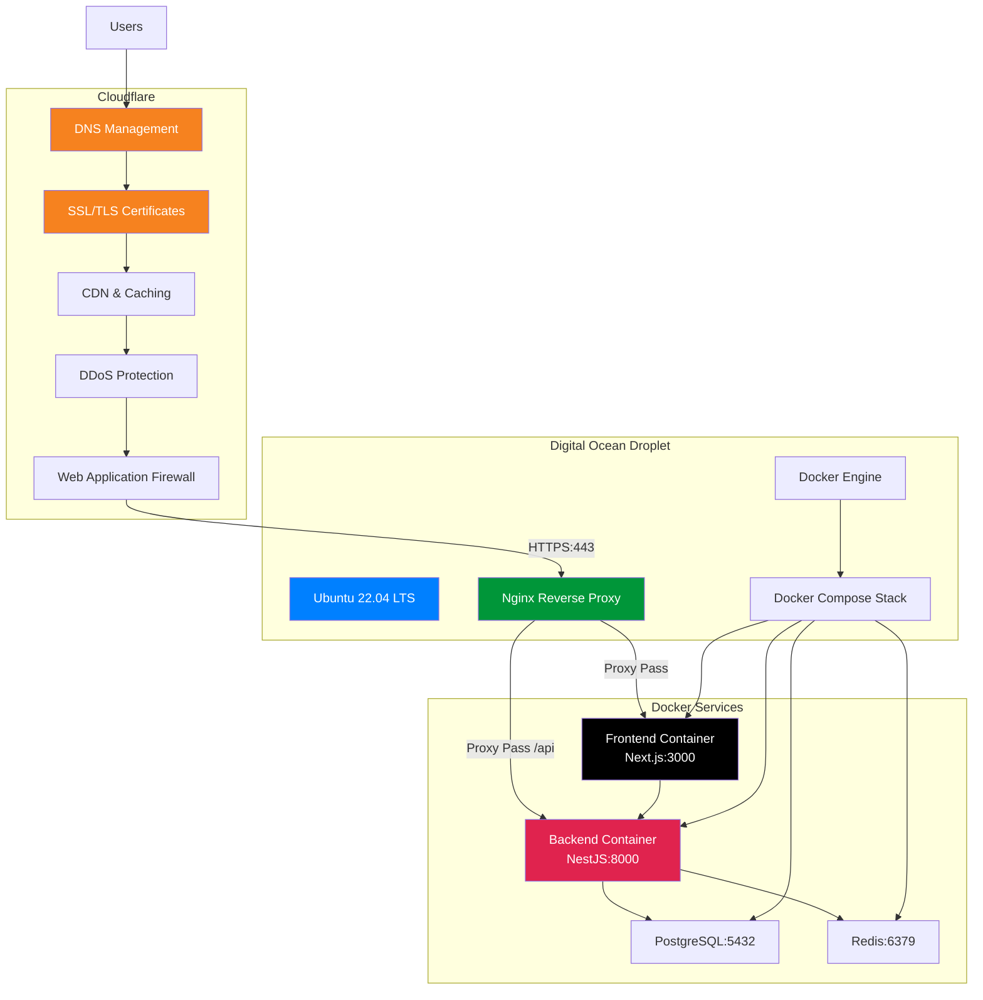

**Domain Configuration:**

- **Primary Domain:** `calento.space`
- **API Subdomain:** `api.calento.space`
- **Assets CDN:** `cdn.calento.space` (optional)

### **3.2. Digital Ocean Droplet Setup**

**Droplet Specifications:**

| Component          | Specification          |
| ------------------ | ---------------------- |
| **Provider** | Digital Ocean          |
| **Plan**     | Basic Droplet          |
| **CPU**      | 2 vCPUs (Intel)        |
| **RAM**      | 4 GB                   |
| **Storage**  | 80 GB SSD              |
| **Transfer** | 4 TB                   |
| **OS**       | Ubuntu 22.04 LTS (x64) |
| **Location** | Singapore (SGP1)       |
| **Price**    | $24/month              |

**Initial Server Setup:**

**Các bước cài đặt:**

1. **Connect & Create User:**

   - SSH vào Droplet với root account
   - Tạo non-root user `calento`
   - Add user vào sudo group
2. **Install Dependencies:**

   - Update system: `apt update && apt upgrade`
   - Docker Engine: Via official script `get.docker.com`
   - Docker Compose Plugin: `apt install docker-compose-plugin`
   - Nginx Web Server: `apt install nginx`
   - Git: `apt install git`
3. **Configure Firewall (UFW):**

   - Allow OpenSSH (port 22)
   - Allow Nginx Full (ports 80, 443)
   - Enable firewall và check status

### **3.3. Nginx Reverse Proxy Configuration**

**Nginx làm reverse proxy** để route traffic đến các Docker containers.

**Configuration File:** `/etc/nginx/sites-available/calento.space`

**Cấu hình chính:**

1. **Frontend Server Block** (`calento.space`):

   - Listen ports: 80 (HTTP), 443 (HTTPS với SSL)
   - Redirect HTTP → HTTPS
   - SSL certificates từ Cloudflare Origin
   - Security headers: X-Frame-Options, HSTS, X-XSS-Protection
   - Proxy pass tới `localhost:3000` (Next.js)
   - Static files caching với 1 year expiration
2. **Backend API Server Block** (`api.calento.space`):

   - Listen ports: 80, 443 với SSL
   - Rate limiting: 10 requests/second, burst 20
   - Proxy pass tới `localhost:8000` (NestJS)
   - CORS headers cho cross-origin requests
   - Health check endpoint `/health`
3. **Proxy Headers:**

   - Upgrade, Connection, Host, X-Real-IP
   - X-Forwarded-For, X-Forwarded-Proto
   - Support WebSocket upgrades

**Activation Commands:**

- Create symlink: `/etc/nginx/sites-available/` → `/sites-enabled/`
- Test config: `nginx -t`
- Reload: `systemctl reload nginx`
- Enable auto-start: `systemctl enable nginx`

### **3.4. Cloudflare Configuration**

**DNS Setup:**

Cloudflare quản lý DNS records cho domain `calento.space`:

| Type  | Name | Content          | Proxy Status           | TTL  |
| ----- | ---- | ---------------- | ---------------------- | ---- |
| A     | @    | `<droplet_ip>` | Proxied (orange cloud) | Auto |
| A     | www  | `<droplet_ip>` | Proxied (orange cloud) | Auto |
| A     | api  | `<droplet_ip>` | Proxied (orange cloud) | Auto |
| CNAME | cdn  | calento.space    | Proxied                | Auto |

**SSL/TLS Configuration:**

1. **SSL Mode:** Full (strict)

   - Encrypts traffic giữa Cloudflare và origin server
   - Requires valid SSL certificate trên origin server
2. **Edge Certificates:**

   - Universal SSL certificate tự động provision
   - Hỗ trợ HTTPS cho `calento.space` và `*.calento.space`
   - Auto-renewal enabled
3. **Origin Certificates:**

   - Generate Cloudflare Origin Certificate
   - Install trên Nginx (`/etc/nginx/ssl/`)
   - 15-year validity

**Security Features Enabled:**

1. **DDoS Protection:** Always On (Layer 3/4/7)
2. **Web Application Firewall (WAF):**

   - OWASP Core Ruleset
   - Block common attacks (SQL injection, XSS)
   - Rate limiting rules
3. **Bot Management:**

   - Challenge suspicious bots
   - Allow verified bots (Google, Bing)
4. **Page Rules:**

   - Cache everything for static assets
   - Bypass cache for API routes
   - Custom TTL settings

**Performance Optimization:**

1. **Caching:**

   - Browser Cache TTL: 4 hours
   - Edge Cache TTL: Custom rules
   - Cache Level: Standard
2. **Speed:**

   - Auto Minify: HTML, CSS, JS
   - Brotli compression enabled
   - HTTP/3 (QUIC) enabled
   - Early Hints enabled
3. **Argo Smart Routing:** (Optional upgrade)

   - Intelligent traffic routing
   - Reduce latency up to 30%

**Cloudflare Analytics:**

- Real-time traffic monitoring
- Security events tracking
- Performance metrics
- Bot traffic analysis

### **3.5. Docker Configuration**

**Docker Configuration:**

**Dockerfile Structure:**

1. **Backend (NestJS):**

   - Base image: `node:18-alpine`
   - Install production dependencies
   - Build TypeScript → JavaScript
   - Expose port 8000
   - Start command: `npm run start:prod`
2. **Frontend (Next.js):**

   - Base image: `node:18-alpine`
   - Install dependencies và build
   - Expose port 3000
   - Start Next.js production server

**Docker Compose Services:**

- **PostgreSQL:** Database container (port 5432)
- **Redis:** Cache container (port 6379)
- **Backend:** NestJS API (port 8000)
- **Frontend:** Next.js app (port 3000)
- **Volumes:** Persistent data cho PostgreSQL

**Service Dependencies:**

- Backend depends on: PostgreSQL, Redis
- Frontend connects to: Backend API

### **3.6. Production Deployment Workflow**

**Complete Deployment Process trên Digital Ocean:**

**Bước 1: Clone Repository trên Server**

```bash
# SSH vào Droplet
ssh calento@<droplet_ip>

# Clone project
cd ~
git clone https://github.com/TDevUIT/Calento.git
cd Calento
```

**Bước 2: Configure Environment Variables**

```bash
# Backend .env
cd server
cp .env.example .env.production
nano .env.production
```

**Production Environment Variables:**

**Backend Configuration (.env.production):**

| Category               | Variables                                                             | Production Values                                                                        |
| ---------------------- | --------------------------------------------------------------------- | ---------------------------------------------------------------------------------------- |
| **Application**  | `NODE_ENV`, `PORT`, `APP_URL`                                   | `production`, `8000``https://api.calento.space`                                      |
| **Database**     | `DB_HOST`, `DB_PORT`, `DB_NAME``DB_USER`, `DB_PASSWORD`       | `postgres` (Docker service)`5432`, `calento_prod`Strong production password        |
| **Redis**        | `REDIS_HOST`, `REDIS_PORT`                                        | `redis` (Docker service)`6379`                                                       |
| **JWT**          | `JWT_SECRET`, `JWT_REFRESH_SECRET``SESSION_SECRET`                | Generate new secure secrets``**NEVER reuse development keys**                      |
| **CORS**         | `CORS_ORIGIN`                                                       | `https://calento.space,``https://api.calento.space`                                    |
| **Google OAuth** | `GOOGLE_CLIENT_ID``GOOGLE_CLIENT_SECRET``GOOGLE_REDIRECT_URI`       | Production OAuth credentials `https://api.calento.space/``api/v1/auth/google/callback` |
| **Gemini AI**    | `GEMINI_API_KEY`                                                    | Production API key with limits                                                           |
| **Email**        | `SMTP_HOST`, `SMTP_PORT``SMTP_USER`, `SMTP_PASSWORD``SMTP_FROM` | `smtp.gmail.com:587`Gmail App Password `Calento <noreply@calento.space>`             |
| **Cloudinary**   | `CLOUDINARY_CLOUD_NAME``CLOUDINARY_API_KEY``CLOUDINARY_API_SECRET`  | Production credentials                                                                   |
| **Webhook**      | `WEBHOOK_URL`                                                       | `https://api.calento.space/``api/v1/webhook/google`                                    |
| **Security**     | `BCRYPT_ROUNDS``RATE_LIMIT_MAX_REQUESTS`                            | `12``100` (adjust based on traffic)                                                    |
| **Logging**      | `LOG_LEVEL`                                                         | `warn` or `error` (production)                                                       |

**Frontend Configuration (.env.production):**

| Variable                         | Production Value                |
| -------------------------------- | ------------------------------- |
| `NEXT_PUBLIC_APP_NAME`         | `Calento`                     |
| `NEXT_PUBLIC_APP_FE_URL`       | `https://calento.space`       |
| `NEXT_PUBLIC_API_URL`          | `https://api.calento.space`   |
| `NEXT_PUBLIC_API_PREFIX`       | `api/v1`                      |
| `NEXT_PUBLIC_GOOGLE_CLIENT_ID` | Same as backend OAuth Client ID |

**⚠️ Security Notes:**

- Generate new secrets for production: `openssl rand -hex 32`
- Use strong database passwords (16+ characters)
- Never commit `.env.production` to version control
- Store sensitive credentials in server only
- Use environment-specific OAuth callbacks

**Bước 3-8: Build & Deploy**

3. **Build Docker Images:**

   - Backend: `docker build -t calento-backend:latest`
   - Frontend: `docker build -t calento-frontend:latest`
4. **Deploy Services:**

   - Start: `docker compose -f docker-compose.prod.yml up -d`
   - Verify: `docker ps` và `docker compose logs`
5. **Database Setup:**

   - Run migrations: `docker compose exec backend npm run migration:run`
   - Seed data (optional): `npm run seed`
6. **Configure Nginx & SSL:**

   - Copy Cloudflare certificates vào `/etc/nginx/ssl/`
   - Test config: `nginx -t`
   - Reload: `systemctl reload nginx`
7. **Verify Deployment:**

   - Health check: `curl https://api.calento.space/health`
   - Frontend: `curl https://calento.space`
   - Check container status và logs
8. **Setup Monitoring:**

   - Deploy Prometheus & Grafana containers
   - Access dashboard: `monitor.calento.space:3001`

**Rollback Strategy:**

- Stop containers: `docker compose down`
- Git checkout previous version
- Redeploy hoặc use tagged backup images

### **3.7. CI/CD Pipeline**

**GitHub Actions Workflow:**

**Pipeline Structure:**

1. **Test Job:**

   - Trigger: Push/PR to main branch
   - Runner: Ubuntu latest
   - Steps: Checkout → Setup Node 18 → Install deps → Run tests → Lint code
2. **Build Job:**

   - Depends on: Test job success
   - Steps: Build Docker images cho backend và frontend
   - Validate: Image build success
3. **Deploy Job:**

   - Condition: Only on main branch
   - Steps: SSH to server → Pull images → Docker Compose up
   - Post-deploy: Health checks và smoke tests

**Workflow Features:**

- **Automatic Testing:** Unit tests, integration tests, linting
- **Docker Build:** Multi-stage builds cho optimization
- **Security Scanning:** Vulnerability checks
- **Deployment:** Automated deployment to production
- **Notifications:** Slack/Email alerts on success/failure

### **3.8. Monitoring & Logging**

**Health Check System:**

**Endpoint:** `GET /health`

**Metrics Monitored:**

- Application status (ok/error)
- Timestamp
- Database connectivity
- Redis connection
- Queue status

**Logging Strategy:**

**Winston Logger Configuration:**

- Log levels: error, warn, info, debug
- Output formats: JSON structured logs
- Transports: File (error.log, combined.log), Console
- Rotation: Daily rotation với max file size

**Dashboard Metrics:**

- **Uptime:** Server availability percentage
- **API Performance:** Response times, throughput
- **Error Tracking:** Error rates by endpoint
- **Database:** Query performance, connection pool
- **Queue:** Job status, processing time, failures

# **Chương IV. KẾT LUẬN.**

## **1\. Tổng kết công việc đã thực hiện**

### **1.1. Kết quả đạt được**

Sau quá trình nghiên cứu, thiết kế và triển khai, nhóm đã hoàn thành ứng dụng web **Calento** - một AI-powered Calendar Assistant với đầy đủ các tính năng chính:

**Backend (NestJS + PostgreSQL + Redis):**

- ✅ Authentication system hoàn chỉnh (JWT + OAuth 2.0)
- ✅ Event management với recurring events support (RRULE)
- ✅ Google Calendar bidirectional sync với webhooks
- ✅ AI Chatbot với Gemini AI function calling
- ✅ Booking links system (tương tự Calendly)
- ✅ Email notification system với multi-provider support
- ✅ Background job processing với BullMQ
- ✅ RESTful API với 50+ endpoints
- ✅ Swagger/OpenAPI documentation
- ✅ Database migrations và seeding

**Frontend (Next.js 15 + React 18 + TailwindCSS):**

- ✅ Modern UI/UX với responsive design
- ✅ Custom calendar component (Month/Week/Day views)
- ✅ AI chatbot interface với real-time messaging
- ✅ TanStack Query v5 cho server state management
- ✅ Zustand cho client state management
- ✅ SEO optimization với Next.js metadata
- ✅ Form validation với React Hook Form + Zod
- ✅ Dark mode support

**Deployment & Infrastructure:**

- ✅ Production deployment trên Digital Ocean Droplet
- ✅ Nginx reverse proxy configuration
- ✅ Cloudflare DNS và SSL/TLS management
- ✅ Domain: `calento.space` và `api.calento.space`
- ✅ Docker containerization
- ✅ Docker Compose orchestration
- ✅ CI/CD pipeline với GitHub Actions
- ✅ DDoS protection và WAF với Cloudflare
- ✅ CDN và caching optimization
- ✅ Health checks và monitoring
- ✅ Logging với Winston
- ✅ Rollback strategy

### **1.2. Kiến thức và kỹ năng thu được**

Qua quá trình thực hiện đồ án, nhóm đã học hỏi và áp dụng nhiều kiến thức thực tiễn:

**Backend Development:**

- Sử dụng NestJS framework với kiến trúc modular
- Thiết kế RESTful API theo best practices
- Database design với PostgreSQL và JSONB
- Authentication & Authorization (JWT, OAuth 2.0)
- Background job processing với queue system
- Third-party API integration (Google, Gemini)

**Frontend Development:**

- Next.js 15 App Router và Server Components
- State management hiện đại (TanStack Query, Zustand)
- UI component development với React hooks
- Performance optimization techniques
- SEO best practices

**DevOps & Deployment:**

- Docker containerization và orchestration
- CI/CD pipeline setup
- Monitoring và logging
- Environment configuration management

**Soft Skills:**

- Làm việc nhóm và communication
- Git workflow và code review
- Project management với Agile/Scrum
- Technical documentation writing
- Problem solving và debugging

## **2\. Những khó khăn và hạn chế**

### **2.1. Khó khăn gặp phải**

**1. Google Calendar API Integration:**

- **Vấn đề:** OAuth 2.0 flow phức tạp với nhiều bước và validation
- **Giải quyết:** Nghiên cứu documentation chi tiết, implement từng bước cẩn thận, sử dụng Google OAuth playground để test

**2. AI Function Calling:**

- **Vấn đề:** Gemini AI đôi khi không gọi đúng function hoặc truyền sai parameters
- **Giải quyết:** Cải thiện system prompts, thêm validation cho parameters, implement error handling và retry logic

**3. Recurring Events Expansion:**

- **Vấn đề:** RRULE parsing phức tạp, cần xử lý nhiều edge cases
- **Giải quyết:** Sử dụng thư viện rrule.js, implement comprehensive testing cho các recurring patterns

**4. State Synchronization:**

- **Vấn đề:** Frontend không tự động update sau khi create/update events
- **Giải quyết:** Implement proper query invalidation với TanStack Query, sử dụng optimistic updates khi cần thiết

**5. Performance Optimization:**

- **Vấn đề:** Calendar view render chậm khi có nhiều events
- **Giải quyết:** Implement virtual scrolling, lazy loading, và memoization cho components

### **2.2. Hạn chế của hệ thống**

**Tính năng:**

- ❌ Chưa hỗ trợ mobile app (chỉ có responsive web)
- ❌ Chưa có video conferencing integration (Zoom, Teams)
- ❌ Chưa support team collaboration features
- ❌ Chưa có payment processing cho premium features
- ❌ Chưa support multiple languages (chỉ tiếng Việt/Anh)

**Performance:**

- Database query optimization còn có thể cải thiện
- Cache strategy chưa được optimize tối đa
- Real-time features giới hạn (chỉ có polling, chưa có WebSocket)

**Security:**

- Rate limiting còn đơn giản
- Chưa có advanced threat detection
- Audit logging chưa comprehensive

**Scalability:**

- Chưa test với large-scale data (>100K users)
- Load balancing chưa được implement
- Database sharding chưa có

## **3\. Hướng phát triển trong tương lai**

### **3.1. Tính năng mới**

**1. Team Collaboration:**

- Shared calendars giữa team members
- Team scheduling với availability pooling
- Meeting polls và voting
- Team analytics và insights

**2. Mobile Applications:**

- Native iOS app với Swift/SwiftUI
- Native Android app với Kotlin/Jetpack Compose
- Push notifications cho mobile
- Offline mode support

**3. Advanced AI Features:**

- Smart meeting summarization
- Automatic agenda generation
- Meeting transcription và action items extraction
- Intelligent scheduling suggestions based on patterns

**4. Integration Expansion:**

- Microsoft Outlook integration
- Zoom/Teams video integration
- Slack deep integration
- CRM integrations (Salesforce, HubSpot)
- Project management tools (Jira, Asana)

**5. Analytics & Insights:**

- Time tracking và productivity analytics
- Meeting cost calculator
- Calendar heatmaps
- Personal productivity reports
- Team collaboration metrics

**6. Testing & Quality Assurance:**

**Unit Testing:**

- Mục tiêu: Đạt 90%+ test coverage
- Framework: Jest cho backend, Vitest cho frontend
- Mock external services (Google API, Gemini AI)
- Test isolated business logic

**Integration Testing:**

- API endpoint testing với Supertest
- Database transaction testing
- Authentication flow testing
- Third-party integration testing

**End-to-End Testing:**

- User journey testing với Playwright
- Critical path testing (register → create event → booking)
- Cross-browser testing
- Mobile responsive testing

**Performance Testing:**

- Load testing với k6 hoặc Artillery
- Database query optimization
- API response time monitoring
- Frontend bundle size optimization

**Security Testing:**

- Penetration testing
- OWASP Top 10 compliance
- SQL injection prevention
- XSS attack prevention
- CSRF protection testing

**Automated Testing Pipeline:**

- Pre-commit hooks với Husky
- CI/CD integration testing
- Automated regression testing
- Test coverage reporting

### **3.2. Cải thiện kỹ thuật**

**Performance:**

- Implement Redis caching strategy toàn diện
- Database query optimization với proper indexing
- CDN integration cho static assets
- Server-side rendering optimization

**Scalability:**

- Microservices architecture migration
- Horizontal scaling với load balancer
- Database sharding và replication
- Message queue cho inter-service communication

**Security:**

- Implement advanced rate limiting
- Add 2FA (Two-Factor Authentication)
- Security audit và penetration testing
- GDPR compliance implementation

**DevOps:**

- Kubernetes orchestration
- Auto-scaling based on load
- Comprehensive monitoring với Prometheus + Grafana
- Distributed tracing với Jaeger

### **3.3. Business Development**

**Monetization Strategy:**

- **Free Tier**: Basic features cho individual users
- **Pro Tier**: Advanced AI, unlimited booking links, priority support
- **Team Tier**: Collaboration features, team analytics
- **Enterprise**: Custom deployment, SLA, dedicated support

**Marketing & Growth:**

- Content marketing (blog posts, tutorials)
- SEO optimization
- Social media presence
- Partnerships với productivity tools
- Referral program

## **4\. Kết luận chung**

Đồ án **Calento - AI-Powered Calendar Assistant** đã được hoàn thành với đầy đủ các tính năng chính theo kế hoạch ban đầu. Ứng dụng không chỉ áp dụng được kiến thức học trong môn Công nghệ Web và ứng dụng mà còn tích hợp nhiều công nghệ mới như Large Language Models (Gemini AI), modern web frameworks (Next.js 15, NestJS 10), và cloud services (Google Calendar API).

**Thành công chính:**

- ✅ Hoàn thành hệ thống web application với kiến trúc hiện đại và scalable
- ✅ Tích hợp thành công AI vào calendar management workflow
- ✅ Implement các tính năng phức tạp như recurring events, Google sync, webhooks
- ✅ Code quality cao với TypeScript strict mode, testing, và documentation
- ✅ Production-ready deployment với Docker và CI/CD

**Bài học kinh nghiệm:**

- Importance của planning và architecture design trước khi coding
- Value của testing và documentation cho maintainability
- Best practices trong team collaboration và Git workflow
- Real-world challenges trong API integration và state management
- Continuous learning và adapting to new technologies

Nhóm tin rằng project này đã đạt được mục tiêu ban đầu và có tiềm năng phát triển thành một sản phẩm thực tế có thể sử dụng rộng rãi. Những kiến thức và kinh nghiệm thu được sẽ là nền tảng vững chắc cho các projects tương lai của các thành viên.

# **NGUỒN THAM KHẢO**

## **Tài liệu kỹ thuật**

1. NestJS Documentation. (2024). *A progressive Node.js framework*. Retrieved from https://docs.nestjs.com/
2. Next.js Documentation. (2024). *The React Framework for the Web*. Vercel. Retrieved from https://nextjs.org/docs
3. PostgreSQL Documentation. (2024). *The World's Most Advanced Open Source Relational Database*. Retrieved from https://www.postgresql.org/docs/
4. Redis Documentation. (2024). *The open source, in-memory data store*. Retrieved from https://redis.io/docs/
5. Google Calendar API Documentation. (2024). *Google Developers*. Retrieved from https://developers.google.com/calendar/api/guides/overview
6. Google Gemini AI Documentation. (2024). *Build with Gemini*. Retrieved from https://ai.google.dev/docs

## **Frameworks & Libraries**

7. TanStack Query Documentation. (2024). *Powerful asynchronous state management for TS/JS*. Retrieved from https://tanstack.com/query/latest
8. Tailwind CSS Documentation. (2024). *A utility-first CSS framework*. Retrieved from https://tailwindcss.com/docs
9. BullMQ Documentation. (2024). *Premium Queue package for handling distributed jobs*. Retrieved from https://docs.bullmq.io/
10. React Hook Form Documentation. (2024). *Performant, flexible and extensible forms*. Retrieved from https://react-hook-form.com/

## **Best Practices & Patterns**

11. Martin Fowler. (2002). *Patterns of Enterprise Application Architecture*. Addison-Wesley Professional.
12. Robert C. Martin. (2008). *Clean Code: A Handbook of Agile Software Craftsmanship*. Prentice Hall.
13. Microsoft. (2024). *RESTful web API design*. Azure Architecture Center. Retrieved from https://learn.microsoft.com/en-us/azure/architecture/best-practices/api-design
14. OWASP Foundation. (2024). *OWASP Top Ten*. Retrieved from https://owasp.org/www-project-top-ten/

## **OAuth 2.0 & Security**

15. RFC 7519. (2015). *JSON Web Token (JWT)*. IETF. Retrieved from https://datatracker.ietf.org/doc/html/rfc7519
16. RFC 6749. (2012). *The OAuth 2.0 Authorization Framework*. IETF. Retrieved from https://datatracker.ietf.org/doc/html/rfc6749
17. Auth0. (2024). *OAuth 2.0 and OpenID Connect*. Retrieved from https://auth0.com/docs/authenticate

## **Database & Architecture**

18. PostgreSQL Global Development Group. (2024). *PostgreSQL Tutorial*. Retrieved from https://www.postgresql.org/docs/current/tutorial.html
19. Sam Newman. (2021). *Building Microservices: Designing Fine-Grained Systems*. O'Reilly Media.
20. Martin Kleppmann. (2017). *Designing Data-Intensive Applications*. O'Reilly Media.

## **AI & Machine Learning**

21. Google AI. (2024). *Gemini API Documentation*. Retrieved from https://ai.google.dev/gemini-api/docs
22. OpenAI. (2024). *Function Calling Guide*. Retrieved from https://platform.openai.com/docs/guides/function-calling
23. Anthropic. (2024). *Prompt Engineering Guide*. Retrieved from https://docs.anthropic.com/claude/docs/prompt-engineering

## **DevOps & Deployment**

24. Docker Inc. (2024). *Docker Documentation*. Retrieved from https://docs.docker.com/
25. Kubernetes Documentation. (2024). *Production-Grade Container Orchestration*. Retrieved from https://kubernetes.io/docs/
26. GitHub. (2024). *GitHub Actions Documentation*. Retrieved from https://docs.github.com/en/actions

## **Testing**

27. Jest Documentation. (2024). *Delightful JavaScript Testing*. Retrieved from https://jestjs.io/docs/getting-started
28. Testing Library. (2024). *React Testing Library*. Retrieved from https://testing-library.com/docs/react-testing-library/intro/

## **Giáo trình môn học**

29. Giảng viên Đặng Việt Dũng. (2024). *Công nghệ Web và ứng dụng - SE347.Q12*. Khoa Mạng máy tính và Truyền thông, Trường Đại học Công nghệ Thông tin, ĐHQG-HCM.

## **Online Resources**

30. MDN Web Docs. (2024). *Web technology for developers*. Mozilla. Retrieved from https://developer.mozilla.org/
31. Stack Overflow. (2024). *Developer Community*. Retrieved from https://stackoverflow.com/
32. GitHub. (2024). *Repository: Calento*. Retrieved from https://github.com/TDevUIT/Calento

---

**PHỤ LỤC**

[Có thể bổ sung screenshots của ứng dụng, database schema diagrams, API documentation exports, testing reports, deployment logs, etc.]

[image1]: data:image/png;base64,iVBORw0KGgoAAAANSUhEUgAAAM8AAACqCAYAAAAKuBu2AAAWFUlEQVR4Xu2dzXXjurJGbwg3BIZwRjVWCB2CErhrdQgKoUNQCD14ASiEDkEhnAz8GhZlk7uKJAo/JChxsL3sQuErECB+Scn/+fj4+M/BwR6Q//3fz7/c//IB/vylo39tlOHgoDVCxzA6jMW/a3YiZTiow99G/e9fTvIYPS8GIe3EfO9MX2fsILH8l3qlUYYDP30jhw7ABsylY6x3waiLFM7ULYkyHMTxt2F+yGOtzQYrwYnxBnGvA78L01+BcP1GnSRB7ZIow4GNPDqLapyC3BhzEPts+D8J6/x/mGfPGNeYBfVLoQwH38h4lK8CYw5id/QdMNth5NHZgs9PprWOca1FYJwSKMO7I4/9S63l2JArYw/KQN8hHf0H+f4x/AO/6NsiMj/DZsFYJVCGd0UqNtyAMBuYp0B/7TfD/8mZ/oN8S7Pjv8zTEtKfMvaw7CX5zdi5KMO7IfPLo5KcGbuPfzF8Z/P0+ZY6+5V51kQenSFc29ygsCosYy7K8C7I8ohdBMYdxJ+6qe70HeSZWpY9WXWPI4/OcTfK0SQsfy7K8OrIOo19Z9w+9txs0dE/Ik/AXAaWRB6zyFRn3w28rlyU4ZVhZVbizLh97LDfoe+kf0R5f9C/JKFcRsxdw2vMRRleEVZiJdQMEGyG35OO/n2eq+H75EL/UsgLzCyRnHjtqSjDKyHTo30xGLOPOzVqX+jb+891sir7mL+6v4xY78SNdeJFGV4Fqd9xLozZx70bvgE1My2Us/gRcyiDEWdLwvO00IkvPUyvDuvIgzLsHZke9Uvxx4jZGX6f0Lf3P9FvwIn+OUj9+pjjtziux8i/FneWJQZl2DOyfJSbi5o9ZHrE7Ojb+98M30DRtwBkfu9Ui6wlpqG3JmpQXEIZ9oo8RjlWSBEYayHeib69P/0mtVOR9TpM0Y7+ROZn5LVQA+QUyrBHjAooxdmIZTWw+dqNTC/nbvRNpY9N/eqwHKWQOgNA2Ft5dP9huSyUYW8YF14ExpmJdaPfjG/gRN8UZJ3TsjC7fg4Kol+WLX6g8cQoRxYDXWvgm2KxAynDXggXZ1xwNozTx1J+4jxto18K4mv8VH4w7lx8+pRACp4KUrvXV9cxgVpNDFGGPSB1Oo66acSe6tWIK9PLszt9vcxol2T2JkF51I1NnxJYcbxQk8j04U2UhjK0jlToOIzRx1F+YkzlMn0UHH1DTiETs1gh7ozngXpMLwXjxEKdKWR5z6gGyyfK0DJSvuP8NGLQJ9AZfhfDL3Cir4cQy9AsxY3xcqA+00siyzd54A/zxSDLs5zZgZShVaRwx6F+H0P5iTGDiD3dmxXswdAsxZWxSiBGm9CnNKIHrXCQcaGfl1BHvJal61KGFpHlkcFDZ+jTJ2B1mrvhd6efB5le9uXym7FqwdhM3wuycJ/RXwm0CC8iETUziP2NONa+Joxu9LvRz4PU6TTqGteCZWH6XhD7nnhyG/qqzK0RbgjjIrxcInW7SD+l58HQy2WzTjMEZboyfS8Y9fvF0E9lbAkWPIG7ofnb8Pth+N0Nvwv9YpE6BwEd42yJ6GVPE506BaOun3wt51WmVhD75vXQGZr0+TB8bvSRjHe55PHd1NTL4cYYLSF6OapONPeCUfefPNNVhhYIFc4COxntW8Lfho/qEGJ3nOTGn9BLJSwfO8ZoEcEekel7wWiD0fWoDC3Awjr4Y2hxz6KWEqKPPwOqc8VixMzhTP09wOtg+h6Qidd4nukqw9ZI+o1ndYoYH6vjXOgXgxTe11B/T4je/yQPRlvCNun5XI0o5y0Re3m1iKFjHTfGLOVu1IpBJkaoRK7U3zPDa2PaHjDa5+talPNWSNqobZ2S0edm+HB2UzNSLEa8VE7UfgUEp5tM3wNGW30Eu3LcChYugmuExmi2mfBJ6jiSf6jx5EbtV2N4vUzbA0abBU7KcQvEP+v8F/lHpzsBI4Z1s6vOFYOhk0JSp90jgmU001tH9PF74KYct8Ao2BSj0zSxO10Xof+bPjEYOimMruFdEAxeTG8dox2109qIPpWZ4mLkpc9oDyT2iNFRZwkpdyAwmjHfjWFdMK11jLbUTmvDAk3AZRo7hVoCBRt16BMDNRL5PNp8dwSPBZjeMkabaqc1kYXPUPSckedGH0OXeyD3UkniZ8RZqPvuoH7OTG8VtmtAOa0JC0Mi/Dukd0s+MYgxa3mh5sEDweDH9FZhuQPKaS1kftYZnYKJsecw9HhxKbPNXJliOVH3YAzq68z0FhHjTRTltBYsyIDbku9Suhh7oCWkwPegUfPARrBCYHqLiDGAK6c1kOll0XnBj0fV6oIYawkpsLeh5sEye6w/trtyWAMWoodLNc4EvyJ0XEfBwd/QcEHNgzhkvMxWbdsibHvlUBuJmC2YLrpjnZF+p8YSRgwvHTUPfAzrk2ktwntAOdSGBchNF+eGU/TBghtqHqQheLOd6a2B+2D913PmKmvpJmW6+JdpXAp6+U3NgzyG9cu01sC9cFEONZHvm5cb/9EIJHhjWoy9CbWXYH4v1Dsow57qmGVVDjXpA19hO+NGPS+kj/IvIfbb1B6OV2sqIhgYmd4Kgr16sCmnWkg/u8B2wY06ej4j+qGl6/mN6Nd0vBzLtBUY1jnTWkGM9/KU01qI7hij/Yvor57y7m/YEVxQ76AeqPsmBywZD8SXYFNOa4CCBK5I58NR13MAI78H1+x2kI/s4KPauEc+B3LlVBvRHeeMdN7Mo2c8c4SLMvJ7uFDzYB2G7cC0FrDKp5xqIpgRkKZufOafI9z4zO/EtSw8KIsMlulMa4HhvfK0KadaiF5K8a2B0c3M/HOIns1cUC+WgcaZaTWR77ocHfnvmVCHg/p0LdPXwLpflFMNBo1t3qzDNCt9Dub1Qr1YqDOgo28JRB/ZP7nRd68Mr4tpWyLjY+ruaVeOpRE81Ucab4jozboYyzwnZ2rGYmhZdMyXguhTRxPm2yOtXs9UuZRjadDIc0s11xIEeb1Ed1Ii9r8omSI5Th+LenNEH6y0yvB6mLYlU+VSjqWxgoqecaI7juS/n5Z8MGBoRUOtOZjXwW9q7YlQ/sG1JLdTSWRmL6acS9MHnZtxPphnilChzOvkQk0Php4L6hHRD47dUHNPyHhvcWH6Fshgv8405VwbNLZnxuFpnZcTNWMR+4tF3FCXSP57eFFxWqa16xiUR83qyrkWkrdUy+o41PNCvQRcex8jvxfV0HtheB1M24K5sihDLdC4no7DTucla+0s+XusKzUH2pOdKqQZWh46au4BaehhqQz2YEwLKENpRH9Wx9NxeEO4oF4K1HRinoCJfqj7kz6938XQjIZ6e0DGS9cT09dkUI4L0wLKUBo06ORIS3gjeKFeCtT0QK1eb+7Aw6wb0YOPhzv19sCg/KPTrTWRQVsx7YkylCQ03qAizJvDwrgJvGQt1foyJC/XqDXQVL7A3KvIfKdboqNe6wzKfmPaWsj36uDEtCfKUJJhIzJtCqPxXVAvFepGYg4Q4rz5mT+zTJN6rbJ12WVwusq0IcpQkpgCwP/KhneSPeMEJPGQgjq9VtKyizoDPeW7BDVaZ+uyy/dhjTkYPlGGkngung2egLk5T8HQXsKsZMnc8MvENRl+i1CjZbYud2xsZdgCNrQX6uVA7QimOg79UinSgZi/ZbYst3x/r5/ZrkOUYW0kcYk04ErNHAz9WZi/17jSLxPVgcS5j5IdnbwNy8202gxiL24BlGFNJP9B4OIFehDnTc/8KRoOrA7k3U911GiRYZmZVhP5frfuzDQLZVgL0Q8KvaibKRcjxiTM682fiFpKiHNfxfwtslV5vTGVYQ0kv+N8ULMEjDHDDyPv2fCrgZptxVGfzNsiW5RXvvc6v5g2hTLURvLfHP5DzRIEXSOWhYov+ctPF4zfl0H5TaA6fmssXWsNUuIpQ22MxnRBvVIwzhTM58lbEpbBUQ619GuNpessjXyvGn4zbQ5lqIX4T4cU1CyFRL6Kw3x9XuW3FixLbHmYpzXWLKt835d3pi2hDLVgA3qhXkkYy4J5YvPVxijTiT4GTc8+c9dXmpw4ylCD0FhGA3qI3sSlYMQjap9g+GwCyxVbNuZpiTXL2cdR+9gYlKE0bLQEqo+SRswRhv+FPhtjncDRZwT9W2KtcvYx7rTHogwlkfwZ50bN0sjCfof+fR7ltzUsY0Q5VYdrhUEZ70wrhfTLW9o9KENJjAZzQb0ayPz3sN0N/9wBoRZqaWv4DPlJ/1YYlPHGtFJM1ZkHZSiBFDhZkw1HRnl8nuMfw84ytoY6apWJjxC3yt/y/hhcz4npJXjq0+5FGUpgNKqXJkdFo5zNwTLvDRm8G8i0UvT6anD0ogy5SPyT+kmo2SKysFdakeyboCWG18a0EvTaHe0pKEMOoVBG47qg5hzMG8HN0AidIPsGlHpvU5PsWVkem2VricdYi1Ajl8raYb96pz0VZciBFZuAatApJO1mvUBjuL7+hHG8WJqF6BjLg6H3EeMTQUedHAa6f5iWS9ClLQdlSMWoVC+ukw8jfwwnaNzoMxPnxrQlQjzqO3Edmshj5r/3edVAZOiPZlwx6iMGxklFxs/PTkzPoWQ5nyhDCrLBPof5Y1jSYLrlMyBcc/RyT+IfrJ6YdwpZ+BhEhP8F6bFlnI2TSg3NgDxWA66BKAZl8CL5o2sg+iYcxKXGIksaRvqdPhP8YN4pZPq50oW+U0j8YKX2R0i/IS2pLRkjlRqagdJ6T5TBCysyBWouIYkHE4bOMP2MtAvzR3JnHAvpn4XRPoURJ5bRiCvjAWG0rwi+Rv5FWNZUKmn+S1splMGDTI+iHtzTqRQaIWPTErlS04sk3sxA3TzD9Lm0WKiRSmlNSbi3PCiDB1ZiAkkXJ4mzgqFjliP8zbyZ3Bh7Din8CpCh/1V/RprKvwQ1UpDxc7PoZfAckrAd8KAMsbACU6BmLFJ45pmyFyZqoJA6R913I85n2pTdAzVSqKD3i7bSKEMMEr9hnSPqZrKQsnueO2xJHXOGkX4MUn7m+zBizNo9UMOL4HqZ3irKEAMrL4ETNb0YmotYGpatEGqv4UXKdiIuTT8HICMm8y1CDS+CZSrTW0UZlmDFpUDNFKgZg6Vh2XKhZi7i/3JDE0N3dNrW21S+JajhBXod01tFGeaQxCfQ4Cd1UzB0FzE0zvj7yjxeGKMUUqYDddD8jb9PRp4lSsywX3pMaxllmMOoODfUTEX00/JFqEHo7+REvRpI5tvc1IP2hf5LUMOLjPfPZ6a3jDJMIQVGZXEe2S5h6C8xe0hh+EdBndpIxvM1akHX2zHfdtYJKMMURsW5oWYu1I9gcskoaYND9s2Tg1GeGDrqpOoxfwql9dZEGSwk/h2vSahZCsZZ4Mb8iTofzL8VkjALUWOgpXxnuDO/FxmfshV5MLomymBhVJwbapZCnM98mL/X8G7GZ5d/ayPOB6vMP9BRvlMwbwql9dZGGQgrLZErdQ/eG9wfHdP3gDIMkUIP6ah7cPAK94cyDJECex1Z4R2jg30h48OZO9P3gjIMMTqCG2qugSQ8r4iBcVqEZS5EsT2eYH/J9D2hDE8k7WmzgrprIP4DgGgYqxWk0BLbgrFyqKm9NsrwhBeZyJW6a2KUpwiM0wIsYyEujJPLUJ9pe0MZAlJmr/NB3S2QOrOQeqFyS4zyZcMYJUCMf5i+N5QhwIpMhbpbIfn/B1XBGFshZT5bRYrtcYYMYzBtjyhDwKjMJKi7NSxfLtRfG3E+II6g2oyKOLt7m8BCGaTc5+cn3yPbklAuo6zJUH9NWJYcqF0SxLowfa8oAys1Feq2hJQ9mTpRfw2kzGerPqF2SWSnH7GOYfSHFFw/M1CLSKEbkLq1kXKrg6rLp6CPeCf67JnRH0blJsNAsVAnkeiTHClzI96pWxMjfgpX6k4RfI38bqi7d0Z/8GIzuDBQLFLmZg54OtDJyO+GujVgzESiT9OkUMcRR8y98PWL6Ck2h+gb18LQS+VM7Tkkv+NWPSSR/OdvV2rOYeRPgrqvwtcvkt8wXzCIFyl7IuZ6MdXI76XKCCv5deIa0CR/IPmC2q/C1y+84BwYJAUp+2aA+/mFoRENtUrAGB6otQTz50DtV+LrF150DgySiiR8xHgB16wg/i/E+IJaqYQyU9uBd7YpOWB9UP/V+PqFF54Dg+QgBZcPAeovIenH966OOoWhG4tr/yUbD1R75POHZIywFgySC/UL8C9jzCHpr8G4Rn4iiSdd1FmC+QuQdd174fOHcfFZMEgJGKMArg6UWgZqeKBWDNSYQ/KWhFOcGedV+fxhVEAWDFICqdPQgRtjzSH+byp1H1b0caizhGuZJIWXwz1XxnllPn8YlZAFg5SEsQpyY6w5jPxzuGY5I/8cN+afI5TF0ChB0iCxZ0JlnoyKyOXEQKWQwidCIPomF+dMyPxTiO/6POWt0c5Proz3DoRKvRqVkcuNgUpjxCxN1DJIHKdUzEvEtyQ8Mb9F8DPyluTKmO9CqNybUSHZMFBpxDnyJxI1skv82xln5oUO/U2Ybwrmq8Ds9bw61SqYgWrBuBW5MjYx8lj8Yr4+b9RehPmIxHfkXN7iOHqO2AZPwfWQLgdJf5CZyuTmWCL2LEaeH/QhzIO8UR2vFCzDu1Kz83wwWE2k0hcdRqAGCYkoC/xVOujgH5asvwy/6vBa35mYhkuGwWoj6+yDYrhKxFsJfZmVfUCYUcPMcjPS1iZq//dOLDVeLh0DroHUOUF8W1i/Bw9qd547A66FtDFa751jtpmhduf5YMC1kZU30y/E25+mLVG980jkw7yayNGBvBwdJ4JwY0U/Ic8g6ml9beToREtcWGcH04Qb6mRUYnEYeEvk2A+RC+voYJnPH0Zl1qCppYD43iN7ZU6sm4M4Pn8YFVqLHyxACxjlfAc61sOBj88fsuJzERagJST/6532QBP7z1fg80eoUKOSq8FCtIa8Zic6ntkU5usXo7KrwoK0irzA3ojXdFCGr19Y4WvAwrSOrPe6fyo8ir/wGg7K8fWLbDfCXliovSDbL+9Cm1nP6TqW9aA8oz+MRlgNFmzPyOOmvvEaE7nK4JRS5j8vdGZZDuox+sNojLXpWMBXRB4d4DSEPkTmO+NxGLABymA0zOqwTO+GPD7DEz7Lo+oGXJj3YD2UQSI+xLUiZ5bv1ZC0D7sdz2oaQBkCRmNtTVOv9uQi6R+hvlPrYDuU4YnRcK3Q5Cs+RB4PnkudxnXUP9geZXgi2x1dxzL5DTZbII/lrnVsnMOFcQ7aQRmGSPsPBUnYO5x4HaWQx0xSuoOQ4+RsJygDMRr3oA4d6/6gbZTBwmjog3J0rO+DfaAMU4h+b+ognTPr92B/KMMcsuLnfl6QM+vzYN8owxIy/27VgealnlEdfKMMsUj9U6e9cpyWvQnK4EEivtD8jfjF+jl4bZQhBVnp66saI+z/jnfM3hhlyEVe91Tuyms9eG+UoQTyeFXlbtyAe+PKazs4eKIMNZD0t4jXIsyWF5b74GAOZVgDeeyRtjitu0nFd98O3gtl2Ap5vMUdZqjcPVPoIGEzf2KMg4OS/D+ST/Cg3/5vSwAAAABJRU5ErkJggg==
[image2]: data:image/png;base64,iVBORw0KGgoAAAANSUhEUgAAAhAAAADKCAIAAAB7WO6+AAA+rUlEQVR4Xu2da2wVV5bvaV3ly6ilmw+jK/XMp3xJZxIiS3yYqKNo0hYEDRl5FKFOOmQQCaG50CggItwJcQs1EZPQYKetZCBOE14hw8uxaBIMDSE8QsDQvBITXwxEHowJYAds/MDGxo+6v1MLbypV55TrvOscr7+WrHKdeu7ae/322rVr7zGWSqVSqVQBNMa9QqVSqVSqaFJgqFQqlSqQFBgqlUqlCiQFhkqlUqkCSYGhUqlUqkBSYKhUKpUqkBQYKpVKpQokBYZKpVKpAkmBoVKpVKpAUmCoVCqVKpAUGCqVSqUKJAWGSqVSqQJJgaFSqVSqQMoEMHqsvg7rVpvVmWHjpH3WgPtqRo24d1LgptXlTZmcti7r9mh+rLmowaFBnlpWnEAs42LwS+4LDawNJ6umbppX8M7EkNjEVS8s3bdiYDDt5SK9wJAssu3Cnmmb53tvMq02rnzSrKqFZ9rOyzW4ryyvReGEE0eunZr5yWuT18/0Jk7u2mPvFs3dvojHyjNNpsCrMiPQzpNq6r32u7++RXkcWzbB+0wzbw8vL3x2w+wPT2++MdQRl3OovVoPJx4te4pMuPviIdk9DHby+rdLD73PrT1SOj6t2EgXMLhkbuO//rbe+7Qyb2SO0VMtJdmPNn/94B//xZsO+WSU+fNdF6kNuO9fFRpR6NqtzsKK57yPLzwGychFxEDuq/do/qeLKVbzdyz2+uvw2N7Gw9wUYHNffYqULmBw6UVrp3sfT7aMmmm31RskW+S0yPrra6uoAXlTIP/soWW/rG7YH7C0qzIsihuBxdjSUIQU/vZkxbNE5P7VyZVHPuJeCCnC38Z7rf8GN3X9Vqv7HlKhtACDunzLQFuo3BYXQwiZ3xVS/CY3mPexhdMmr5/ZY/Xhm9xpocq2yIpU3kPlBGIZJDjTdt4/FxEnfXh6c/hpIfbMuhmzqhb2Ddxx30bSSj0wpNVyXPkk74Nx2evVb5/6/sxfvt1N9Z9/ifXY/dkNswE+Cw+89bh3l2SMS8rvVimK6OLPy703LkbRfXlrcUXNx2JztpXEVfvjGXEKHo33J38jDjje9A1P2ftT8sZN/dff1rsTQpVtUdBwwTx67yMj1y3dt0Iy4drjW59YMdm7jY9tOFnF8cVjpNDwNm2xX2bUNJ7Ce/jTgtJHViyvWS1WWb/Tu42PUe/hMojJvD8lYF3WbY42ddM8950krdQDo204JvIxUn9gcAAj0KusrbZsThhgeLf3N7xYQ+slcqH3J5ctOfAeSem+4nwRuc2HsmPLJlBEW7pukOYU1M7eSLB1+OKJR0rHezf2WuaBwY61V+t5ZN6fnEZeouqnL8BDJWrrsQryw8sLL1y/eOzSafIhuYKNF+xYknwgQmBNlk6mGXz3xUOxKpQTV73wt5ZvvH7ZadwyZYTLgBaQg4hEAhfvllEttcDApO6Y8hfgqQdGy0Dboj1l3ufhNDzX7f5eVw3XAINKBwskPb7gcvtVOezc7YvIaqxhedWxjbLyvcPrxJGJ2npu+rs//F2+AoO8/uWV4z5BgwCj7to5krHALre7zx207ARnecfZvXKcgw1H8dRSgE0zKJnPAIONeXaWXcuTJyWS0nKrr6ex7fvW7ptAQk4kwDDPEZmOWzwvWVOyaxln5Nld6WiWNVyG1CUR/sWnlx0nfbHy1VhFXZUtxWKAAIOSKxtQz2NjMgnPkdqM7Cs9Vqn93OzpkDVfXPiKv+M/eP716rdle+MELDt/kutkeVf9/p+9Oc6ys43sYg1XdDggy7FiGukaY47pFMVqRFeOx6cIcArTe5irksAFl2hCIs4ifasIQWQNPm1v42EDDK5BugIS0Lyx54+yDYlGLZy9uHiqR7Kl9xqcJieVoppCpR4Y3Jh/vwgyyuDQIM7Ltd4LDLwGDq5guHpLnhBgECFykGfWzegbuMNmwSMMjpOvVVE8pn+fNBcwCuyIlQJJRY+kw3eTuQUGm05v5ylQ3kh/nPjTa6aVH1otj4CqlmWXXsEDy5LsHIpnQUGVEj7zk9fMeQUYsIfjU/DAAHEDW/LIKNscX4o0f1/eWozLYDMeLscPGGFwX2ysuAiVcAJR26MKfgyMyJvFcwd56KwkZxJwkB8kX+EE2IwMIFXA5QcqLAcwBAnkRn7lILgFZ4Qhv5JzyBhkD3IaITWb8ZcsHatSxV7tMVqlIhnbtz2qLRowBmwnhuPmXiibpAk/UZrmbCuR9MHpc9hZVQs3frtdgCFeXmhR3bCf3YUuRCqyzKHYMUh3XsDDiQ5fPOG+meSUFDB4xlTunInO3Y4IDKy+5bsTl2tdK73AcJ2uo7eLzazhKqq4sLiAwZFJ6wfT/FqY7Cv5O32iwu58CUGp+NORD+MFxvQtC/DywIBcVVlbLSup7H99pY6DWz9uHpTUFkmc4Vwj+mnJzym01AacLWOuJimKBxcvRRrkF9ghAvmBxycVQMRVzagsDggMroTHSvHwaY4bVYYP5fGlqZOMV7h+1wtL3DqlzB8YziPg9xfsWGLCC7OSONV8HCcZxgCDPGN6jhLU4nC8wCCXymcfxp9QGeKw3ktyniJqE0Uk1okfGNIDhQVYJWxg+csrx9lmfW0VGzuPye6SjFyzRA9gw3kNEmRwL5QI79m9JsBw3Qi3L82ACStBYOCySQWuHgy6LjRIkxSeaGhoyDSIsz1H8wLj1PdnqMzKNhJISoSRMDCkScqbuCk0MgHPlQKAN+defpxsKRClSKpU5DnXvey/fDRWO0CBBxiSkpbduQBmUIZJSQo5Czvr903Z+ApunVCjwE5nbkRSmzpa2Zd/5tmtOrZR/DsAKLCjRok5ggOjufMHDhK5sNIJHIczGpD/prJ4YHCAbYIAg73Yl/LmfRaj0yiA5I0C+xHzxB15J8WiwoF7xa95m0esAE1SZEiyE+6eDEDpptJAPpSwgyvnV/IqdUQW2ECaTJ1NUuaA5CLyElkuFjDYWF7dsUFUHoiRyY2vdxqBgmkR8jEXMCib3BRVIll/6OoJ2Yy8Om3z/PNdkeLGk2INLrShu0mAwb0sPfS+/ETYwRrZy6AlODAkWHFdNrgixCmwC3VindHjBgYlWZy7TwqSHN7n4TJpuzTH5KF6geGsw5KxyJpRgcFKORo1CP/oIWBap8TIN2DD+OWUiLCMG9zbeNh7ujb7e1qfWrYAw3m03ecOCoYpkCSvrARIHIRyJX3VRATyciOs5EkRglj2U3ASEbRLoQ0CDO5CWqJE0u5MvcGswUFQSvEg8q+3AfPefZVOILTypsYoN1zMtgt7qFHymEyqplDj7JEUYlW/uq3eWEMMOJukyAZkBp4yD5F8Yt7QkotkDTlH1kjITnZ1NkkZERaTYyVbkv1cwCiw42bL8fIsqu2+eChqGEFBJq+O+PpaXno7MQkt5CenP+Sm8Jyc6OWqYlkjEaF5h9FudfLUMLZxxkPSThUcGPLSW5jksg77a60Cx0vE4IoPGFQteZCczHsRLnss1f3ekrdxdrda76Wmz3jAlfU7hX/J60pHM47YW5sz5t+tNi/t0eFutd7UUGuzq71AXdxlCoUj+/D05qj1cWNHm782jZ+JGQUHTy3LZGwrRntREKNaze7e9cYoWT4vBkAv3sP/fkNlXCo3RTTj/cnYyevfUnzi7UYVHzCoF5D03nN7DYrGikmzYlwMT917nek2qmDUa5zhVMIC1USp3lM4DUT5x1h5ZuTGDFcCcs6ocRfYbw3d+SlREe2R7FSovedyGlnR24YelxGgO88rbSnx2stbi2V3vKf3VzFKln+vWUpxYcVzlL6oIUgIjZslgokaXjht6aH3nYF+EMUHDOKG4B+kJNMnOuXGlWfLs+y/fFQqOMmoo7eLQHvElnri2dE2NIg3EdSchrPDd5g+ykmqtfsmziig60x+aBAqW6uObQRRPu7e36Rhc/mBCp9C8aQ9NIj3+p1WXhNpN8uhoUHOd130/uTdcmzZhKGhIfdjjq04gEHwwnXElV4ygGLWDX8dq7E1M+Zqck1Au+r3x3op5zIeEIhKsjUg/DY2nq+iRrmRUKYHWpIiaPhpyc+DOwH5qsD7+MJjc7cv8l621yRgInx/Y88fg99+5u3ItVPclHnHPqKNK59kPmEJojiAUdN4iqDBe8oRjTqvdKDMsM2qWojrzC4q2uz2RKp48pVcYmrpujH/08VxNalx0t0XD1FBk756eWNwgsSkPIS50IbNLLtbUUo62hZWPEdlP94yRagxf8di80Ii60a0QVTxpyMf+ry3iGqUKWqfj9rDm+Oaw5MJSWHpVU8Baehu8m4Qy9grrgbzOIDx3uF1RAzeU6r5G7nqw9Ob43oqLl24fpH8HSTGVFPzWp81QP6JqyIZS1SxS4/8OUikm8cGL0mEEb82y6TBsN/99a24UCFG3Wva5vnuxxxb8QFD+y8mYAoMteyaAkMtlikwQmcKDLXsmgJDLZYpMEJnCgy17JoCQy2WKTBCZwoMteyaAkMtlikwQmcKDLXsmgJDLZYpMEJnCgy17JoCQy2WKTBCZwoMteyaAkMtlmUfGDeGOv7W8s3+y0dHg+1rqhnxI6Z8BUa7PX6ZN01Gue1tPBzv52DpNgWGWizLMjAq63em5IPSHFJD6yWKkDcpjOUfMLgjMDl3+yL3haps1bd8F2RE54yZAkMtlmUTGC0Dbc6JdkePjjd9MxB7hO38Awa02PjtdvdVqhxafqDCJ0tk2BQYarEsy8CQOUxGmyiKPt4h/4DR1HtNgeEvak7ZGh3ZawoMtVimwIhba49vda+KUwoMlUsKDLWcsNwAxuDQoHNW3mOXTru38GhgcGD3uYOuOVX8dauvZ1z5pMraavcPDg0NDclkFYv2lDmnR+8buMO/Ms/XiFJgxNKTw9O2P/ZuUcA5fA5fPDHzk9fca311sOHucO78TfnscolJgaGWE5YzwCDnyTIkYFm8Ce4bH42/aO2+O9nsptPbZ1QWf3HhKycwjjd9I29cT31/5sXKV/Hs+HfLng+8szcyk7bsK8DgCLOqFsp80axhWX6V+ag57NRN8ywHMLgSUpC9II0CI6oFBwackNoAKf/AW49PXPWCrOcJrjzy0e3+Xvm3ufOH8kOrZZIfAwxWkuVkgcdhpgDiuZDgznoAwHhm3QxZJp2L1k637Hmh8doctqO3S36S6aPFb16/1coRWMNl1F6tJ/9U1HxsZpBGddfOsTEHsez0JwfurN8XPBhVYKjlhOUeMCzbWWMUWpyCqZBa9izWMmMXfp9/BRgy5SQ+gu05CPEB24iPwCWBAeOVcFJUOZ9YMVmG/+X6BSHyq0xqJAeRawAY8EPmDWYzdlRgRLUEgIFwzT8t+bllI/lBex5Zie14BGaIZhKc7QUYPGsJF7h3niO/ShpGpp/cWjx5/UxzFicweIJyFjP7gskPkhMwzsg18C8/FdhzR3Mijk/UKzWP+Z8ulmwg87GDCi6Va2Clf8BqBDB8skSGTYGhFstyEhhU3yiZyw9UUERlDQEElUoAIFU8/kqEwXp2xEFYdl1SOmW19dzEO1BdZXvqp+awAgyJRVjGI7DgDwxMvBXb4+ACAuNS06Wy99554w+/f/WNBcZNNLRe4l9WYpu/2yHOTjYTM7v7r2SBok6Bb+huWvvfq81KKbTUkc1ZvCv5a1ZyELPy1HeRGYxZzyPzrty291M5YNSVHJC9EgAGC9IwRcrf7Omw7CdILZ6Yj2ct24BGniCPDPALLcq+/DN1f/mVp0y4QP4mq8gakRMYlv2ICRrMv6CFcIFHKTGKAImnQ26RNZBJng45nIdObuTs7GLZkCNjkPGEOsQlZNEgc2Etq+4fWzxU1zzCxNeZsZADY//lozwjHuuMymK1WEampao04jTd8VpOAoPyiVNwAgNnIcAw2wgw2MC0ObDALicu14oJMMz21jAkxBfwK/CwAgBDWrTYHm8SBmAACYp6YcVzKQQGPrHNAwzcrqz0AQZrrDd+ctcavzJXG0tOYKw9vlXq/vIXkdokC86Cx2d2ARg8EQAgTYXkBPjBvuQQciCkIbe4spkLGHJ8ni/bsyN1ESjFYyVu4CAYUQJkIhcJFV6vfntX/X7LDgvYRfIAmceyYwuWTVsoKzl4kL7jZJ6NR/vvm2KN+ZUFObbV9qTWycZlYQYGwfdo+3IrGVFyr/Xf8CZjwpYzwCD8h5mQE58u1Td8NEWanD19ywJx6/gaFthmbOkEgEFiSblle1w5YccjpeMp7ThTacLyAkNerVOHZQMJNdgF54JxTMsDDCqw/Mv2VGbZICAwRk+TVF/dFgOMgfJ/cl+oRzhrEhYPK5PFUmFnJanKv6zEpzd3/oC75+kInnmyBAcS5AEGEg1fz2N9eWvxjrN7pQkrKjA4EWwgHOHxsUAGk4PDTnbnmBgLgIFq2vGmbzisExiAwRoGhmVnJM7FJXG0U9+fEWxY8QDDNEm1W53Q4h9nD0EOrPDNoSu9mZ7XM7TA6LH6JEuogutPRz70pmTClhvAyDPlPTBudjcObP7VvdgiMDDIDxL/4bud66lUOrvGUVfgX1wzy8QQ0gMCp0+0QUWBBVLYbI+Xl4ZKI3aBAZxFjiDCudc0nuJQ7CvhAsfhICBEfuU4sp5YUDpZXOloxmR31rA7u8gy21h2mMslmW18FPUdRo/VuXBLv5DjF4sGa5pu3czIpNChBQYXRj3AfQ6VrxQYOa+8BAaX3Xt8BVQQB4dJAwu2dvYLEWaoYisqMIx1WZ0fHLgj6Unwke4GKwVGPkmBkfPKG2BwqX11WyKhw3AM0fk/f73S23X/S3dbVKRqHLyX1KiVPzCMdXkarBq7Ux9zKDAsux3bhIZPrJgszZuPvVsk/S/i0sojH0lvuqxIgZHzami95OMdcgAYPTdNi5NAos26Y37tsTr/vXTQAGPA6lBgjKiAwHCas8FqbPFQChusFBhWbGAcbDg6o7JYer61dN14vfpt2Wbt8a38xJqSXcvKvvzz1E3zpAGzsrb60bKnyg+t5l82ljf2bGm+E0q38gcYmHwNN9o0Z1tJtxWzA2VIgWFDwgQTfV/83jsod7vVufFo/5iiSFTxwYE7OLJl1f1t9rvKvY2HXa8lVE4t/rycVHKneTCTBqu/mxohB7Hd/rODSXaMUWBYMYDBwvwdiy27JwUe/3L7VVlvDfeCIdEetD8r/uLCVw+89bi803qkdLy8RWNjOWbwUSGSV14BY31tlfl8d5Sotfvm0kPve5PCWNiAARjAw71315t/dbO70bsZl00lF1r84+whQ452+6d2+9fpWxa4L1Rli4iTJ55kfHClt2vqyruBHfAg/SXxEzAFhhUbGNIJgsuAGWzgBYb0v0cPLfulODcFRiAFAUab7Y+ofpbXrB4NRoI0dDd5E8FpIQFG1/Vv7rU7xYCEWLtdw5WGdZghK+uae4kznD6L+9p98RDZ15ssGbP/3FcJxv75P6u9P2XFcKarjm1MMiBwGQWKpzC2+O57DoK8Ls82/qbAQEVrp5tOdAXvTJTPQh97t6il64Zlj1Uj3l++7UczP3lNgGEQYjhhFjim9OjDNyow3AoIDDWXZREYQKL3+AoTTLDsbXdyGWAYY3fdwTE58dDY3bX/7KB3++xal7xfKYy8WfH+mn92vr0LbAs5Zq8ZCPjdrwLDsgekeXh5IWExkJhRWSzvHsADK2dVLXy07Clx/ePKJ+FA52wrYU0sYDxhDxrEEdhAdodACgy3FBiJWeaB4YQEwQTY8G7jNVgiUcW22h7vr6E1aboBG/HWu3PauGuAEbDBSoFhVHu1fmBwwL02p6TAyHPLDDBcLU4BISHWPtw/Bx+Uc2633TaCjHR0SA2/9VidzgYrnqN3GwVGPkmBkeeWPmA4ISE9nZzdYYOYebONx/H+misGMJZV9xe+OdTj+WlU2fn2LtMBmqirZaBNwg4FRj5JgZHnllpg3LQ/wE4GEmLiZO9/aei+KRaOxrtBbtmA1QH2QviWJSt2Y6jDNFjxiDce7R//wfMhBIaOJZWAFBh5bikBxsRVL3i+rXOfKLjJm21cievNdk4bbpE7GiVvv4PbvQarokiDlTtvxanUAqPNHq1W+impgmj3uYOp7YOnwAidJQ6MntYkW5y8Jm+2iSpMf9m8MVDBrX1wINkkyj+TJqn6lu9MgxXxB9GYO78FUMqBge1rqnmx8lW1EW3OtpKA/eKCmwIjdJYIMIb6zbd1xBN1e975txXPnGk77z14XEYwIZ0yqYyP2L8250xe3Re+OZRz7+3Tbc53GJ+djPSZFmzAj47IaBdxKB3AUMuiZRkYDd1NAeewzBv95dvdVJG8SWEsKDCG+q3Gr+4N/Eds0X9bfon10ju44Uz/9d1P8RF//9tTBX96UmYqDbk99m5RvIzssbtL+QdPOLv1tVUyUUoO2dNrpiXcFhHrpbcZugrKnmxw/RhdCow8s2wCg0prxr5eCZVgJGXSmyBi/sCI9HRyjA4bmaHIoySBUdfc+5Nf9973H53jyid5PVGY7YG3Hm/qvea9Ix/74MCdscUxu0vxLMjDj5Y95T1X+A1nndj4VLGAYSTdH+S1lj85FBh5ZtkEho5WG9WiAKP/tnM0p6iQcCoxYHDejUf7pf3hgT/M9TqglBs5BIfiXZ+wRYYFrVntvTUfG7A67ptibT4avakXhztl4yveE+WEERXtvxyZRjdeGxEYRvvPDvo3WCkw8swUGFlQY7D5MFxD/lk3G90HiqEEgHG+vWuM/Q3w7DUD7BjVj48tnWBGzrHsEblHrHo/vLyQbPD0mmkseH9t7vyBmMC7PhkjZvXenb9tq+0ZYw/D7v0pXmCQbiT+69Vve3/KvJHmuy8e8t7UiBYcGE4t3HJ3TvJfLBpsvH53pQIjzyzHgDE4NCiTa8pY8wG14WTVFxe+cq9NTjd7OuZ/upiFyetnun8bST7A+FGLUzyQcCouYDjfbMuaqMCADdJ++OyG2bJG3CK3X3ftXEXNx1BBtsEOXzyxq34/BylaO71v4M7O+n0ye/aMyuLaq/WVtdUsP/ZuEcs/e3PcxFUv7D53cPmBilPfn2GZYz5SOn7lkY94yrIldqWjmRORoyAWB8fw496LLEgIGD1W59jiSI/haD8lCIxn1s3g4tce33rs0mmZe5y74/px4lT8Wc+9L9ixxBB3x9m9NY2n2JFtADOJyfakAAv8Oq58ErfMoaZumjcipI1lGBhGZCQZa53gg1BVgZFPlmPAgBMUmJmfvIbrYYGCFGSkF2rrm05vd69NTtdvtRZWPMeCGc04uKAC0YNzNI4ffVtXt2V9bdXSQ++7dwusgMAwI3z8/W9P8aTKa1b/6ciHBDcN3U1eX4yb6+y9heN2/jSraiHgZI18ToVbxBWSMvwEoXFwBBA8MjZjG/wXVGCB0ISfeHaWnXpAhYXpWxa8vLVY1sAPjsP2v6ksJgqRFD7YcJQnbtkjhmKcC8fq9ZJ45yPXTi058J5rXFj/N8CRD00KrXWnV+HdnEPJNvVeSwwY7MWlgg1uGWRebr9KUnAvXB43TlWDuyOh5mwr4e7YgM1IYZL3L9/ultHruFnWdPR2caekIanEjsKPgMYp9jYerqzf6RwhmGXS35sCTksSGEb7zw7e9x+d5j15qsZiOdN2/uWqYm8vUjWX5Vu32sSAIY7GGo42pJFk0Z4yKSQUBv7FH5mKGKVUgMH2/EtNTaa+kl/5F+RQMinbMoKxiGKMCyuwK3eWjQeKkPxEkeZ0iQODoGGYDc4WJ8OPKO8w4tSIwDAjfFAHdO0LfqNGGCQRKYn/Mo1I+COoACoK7B5KuPjyQ6v5i7GG1BNfb4DBEUycR93ZCQw5LGbZw386rwf9tOTnlj32J2eUPnW3+3txnVF7LuGRu60oM6zgi2N98koY8bu/vjV7zcDUle5PDXCdCQND4Er+5K4lf5IyEiSZT8/mbl/ENixIqnLxhBquj5nJCTI7G1wx4V0QkwijL/JI3SIPg1VvUoilChjWcJOUTA4oDVYEc+DZe9KARtHQmbiCK68+3EsSGOZf3IdgA9cvxQ/nIhvIVLpS5PiJWqr8Kr6eHSlXll1cG1ovDR81IqnnWvbA91TxWrtvpgoYgMFwgsDCmyxpBYaZu4LSS7l17xkbGAU2A0hPXDYJKHNVzt+xmHRjYxwfiQ8YxCfKxgIM/I4AAzCQjCxQ8eG5O4Eh6wUYHPnU92e4fYkgcZGyni0JKSavn8nBp26ahzsmIvFeZCxgICoNUVsCv7xyXIaqJsj499IfMSMZYEjKCDCkgiKJI2TFm1OtWbBjCfdFXmIlVRYyJLmLfSEoG5ACLMNFkmhs2QT+UukJ/tbHBxiImCbWtI8pB4Zpkmq3P7A3DVbbanuu9MYRdoB2qRGqgitWPSkxy3lg4F/EP8qaqLVUvI9UzVgeGhpiGzaYUVksHsfs5ZTBgMQWN3s6UgUMZ4QRdcSO9AGD4rr/7CCBxU9+3fvSuuiDuPkAg0TDy7ANYRn+mmqypDP/yrj/JKMLGKzBXdZdO0eiSYMSLpJ9XRGGExh4WNwrnhEy1V6t5+CSwvyVDfD7EAWcwy3vRfoDw4oGjMr6nTKVpnDUqXQAgydLypCFOD7E5abMs2Y9CfWAPbUnN86yZftc0ofUADBAOmr3gajmD4xIr4oYfbvTBwyxxu57Y63f/1LkY/tY48302Dn25vBchH06+GD8UmDchQEl8+k103BAVMfAhmVHDBQSy54cUbaRaU8oG3glYgXZjL+mtw+ezsQlTuGepLhS2jkLwDDnxRckBQzLkjcWfV/83pQEp6UJGFTlKJxU7ggsqKnxdNy72fIBhhh+H/oGd1sZNh9g8ECjRhjrayMNPuhkQ6SHz7LqewMoxQuMxIywSRrc4AHP3btBYuYPjLIv/5wtYBiTsdZNx9yFW9wDCnRZnfxqBrtUYCSg0Q4M86pz/AfPS9uuZVceZaU0OlGHlc3w8lTWzEtvLonAv2/gjrSz4/tYiAUMKbrCGMuuGssu1BaTBIZPL6m29ABDBgUyVbku67YPMBq6m4K3e4TKHrW/w0gYGKjxeqRhyigDwJC+AHI66jQ+qI7X5DuMMAPDac6x1mVyQApCl92BjTXy8jZ9wKDiWFHz8cojH5l5vDOpBHxIcI1qYGRMaX2EGQOGNBmPKYr0UXF+zOwDDMSvwNjrgMJvuKem3muxXGQQYKCpKwdxWLIMe3L6S2/ykvPWnAobMIy5xlqXT8rJw7iLNAGDKuA4u+PyFxe+emLFZOmtl7yodck71BGVVm+jwMiEKE7uValTZoBx7PL/jLG/xfO+V/QHBsWSQhtXl/8wmIwlhW9y38+wAgLDst9+m4+WeRxsENomuFhG+As7YwVbVoiB4TR55SbwwNqsO+kAxs/sns3mXzLS9VutE1e9MM4eGueR0vHSJ4L4j2xAyki79+LPy6FLgR3Xji2dMDA4QIzCT+yOS5Uvirh9Nqu7dk6KEv/e7o88EbaRHeXFngBjzrYSzFxGqqTAyHnh0K1onksseWB89vWV//3i9TGxZ9v2B4ZlN0xFfb8ScusBdrEVHBgyH5/5l+Ty7hV+ixVpicIPDPmg0tBC4oxVNYfd50hOVzqaTbOz6Ok10xpaL8m3k/x7uf0qd9Hc+QObtXbftOzWacIRSCCf7pJQRORswC6rjm00X4Z5Iww24HQlu5ZJX6/O3lvS24Itn1k3Ix20sPIJGFRjZ37ymnu3UaCVRz7yGRUuGWBQLyak+Mmve//h1W3eXlLGRgRGXio4MBC+yX9YvVxXyIEBLaauHPzFosGapltdVqc0UrFmZ/0+9zmSFhfZ0Xuv7Y5wgX8FG5bdWZ8IQLhysOHoicu1GCEIwJB+MSQU8YQk1xcXvnp5a7GEIAYYlHecrAxkIMBwfUc8tmzCe/a4ahJ/pFb5A4w2e3hzcO36BiKPRYWCfMZde5PCWMLAoFI8xh7hg/T09pJymgLDaVGBIfNAuNfmkUIODDH5bGiM/bkf9cs0vcOorK3GxeMHqePju+UDLIDxSOl4arTjyiexBmwQFrBM+ZVRD1zAIBDhL95s0Z4yCVnYuPzQajbbcLKKn9i44J2J8lK9wO53zmbmGyP+srEr1kmJ8goYal5LABiRQmW/2ZZ/vb2kXKbAcFpUYFj2ZxkkrHttvijkwGi3+03dNyUSMZsxRdIEDFHt1XpnzVWiAcfvuSoFRp5bXMCIdAO1O5M4VyowoipeYJxsiDRM5atCCwxQsazanqmpyD23VVqB4ZICI6opMEJnwYFx+451two2PJq0SIERVfECw7K7S7nSNm8UTmDc7Qhuj5G+rbbH1fMik8Ag4EjHG4XMS4GR5xYEGJHRVYsiVTBKl/s3BUYMJQAMmY/PvTYvFEJgyFSPzjYol2USGHkjBUaemz8wiCqkr6FPzVeBEVUJAAPhvz476V6ZBwoVMGTcGmmD8unPzXHm74j0ZFUFFy7em5IJmwIjdOYDDOlc6BzsKKoUGFGVGDAikzo4RiQk5iBXywg04dHt/t6pm+YF/K5YFBJg9Mj8XUX3xq3xt26rd+72Re7TqKKJXPHMuhneNEzGFBihs6jAkE9eAzaPZAsYm05vf2jZL59eM42L/+LCV0HmtsqkEgMGkhEJ7wxEgP1v7/y/2qv17i3CoaiVjFjKOjAau7tknPOpKwe7PL+qhdMUGKEzFzDkWzzsduDqY4aBcauvZ+KqF/wHz3i07KnJ62eWH1otX89mRQkDI9IVzZ5sCu/2D69uc/8cGsX1TLMIDHJ4pFm1KDISgWt4WrWQW/aBcabtfKljXsy8ty+vHPcmgtMEGMsPVEi3TvkWz524vsoYMAQVBgmLPy/HQbT1RIZPsOx5MvBKUza+EnUuVbHCiudmfvKazHH942OnXgkAg8DCNTrFv777qXuj0CiuZ5oVYPQMD5y8cEu/RhW5aFkGBi7GvVu+S6Ys9SaFMQHG//p1y31T/N5s+ygDwHCi4tkNs2XlFxe+cgIjqm7398qsD8+sm+HlhxMki/aUbThZJeO+pUQJAMMabgw0wPjn/6x2b+EQKW+moT3e9I0sk9SZmScurmeaYWCYrysAhveMarli2QRGy0BbOkaGCb/qrp2L6rnEpq6MVMH+79qz7t0CK63AcKJCZgQxMsD4+kqdaaEaVz6JGGLBjiV4f27cub1Tnb23dp87WLJrmTl4VJMXJPhi9/4BlBgwRPJQRmySIj9zp7JMCsss8SxU1Hz8o+1GEqnx05Kfm+leAiquZ5pJYGyr7Rljz8nqHThZLbcsy8AYnaPVNrReiuq5TC2soKQurheYLqUPGE5aYK6sY4DBgtfXi8nkuNS4D1884RzxzSmuf+3xrXO2lRStne49gtjk9TNPXK517+mrZIBh2SOFEGokBgxuZ+72Ra9Xvy0/kW7yURg/kRqy5tT3Z6Zumrerfj//gooH3nqcFCAaI6HY3bIT/zf2xrEU1zPNDDAK/vTkbz9ZQ6xMrlZa5IEpMLKgxmjzYdQ03ZI3qzeGOry9pOJSmoDxszfHibOWNij+9QEGC5fbr2JEA4+Ujh9bNkHmAPA3CIFX3XR6e9RYpPZqPa6Ts3O0zAPjzkDkg4y//+0p9w8OxQIGt4a7J1nGlk5gDeEX/7IARQrsWeVJHJnl+9Gyp2SOdBNh/MWeQ96yww7ZOJbieqYZAEak9mO35vl/XaGWQ5Z7wFh+oKJguKEjoFcdGBwws3yHQU5gtNtfLcEJamF1zb1tnl5SCSh9wCAZZUoA+dcfGOZlBhdDfdn5L1VpFo5dOr3483J+wl2OOFkT1KHGLZ2snlgxOTPAONlwrzFKcD77v3e5N3LIBQyZe/U9xzsMGfjaCwzuThJ2/qeL4USuAyPy4sceYpaH6+0llYxxbeQ6ksJ9SpVH1Lrm71icWlTnJDDka8++gTtURSGHrB8cGnQ1bbOB+BcnMHBSLV03ZKXxOGxJ7fX6rdbhXSNruDb+3u7vNaPKsAG7W8PjzNQ0nnLuElwGGOfbu37y617pNGK+WspXYBBtmH/NLJg7zu7lOKalhSfIlvzt6O3i2eHUXKHJM+tmWGkGhgwHIpC4/6Uhqslm9j3L/tbk3j8ecY9m+jYuUr7vI6nHf/C8+ZWFworn5CcwKSNaG4QIMFgwwGBLUowFqOM//HVczzRNwGi8Hkk0kq6lPfJv1G61CRvHmbLxFfcpVb46ef1bb0ombDkMDBEFrKLm4/qW7yCHlCiKNGWPEkgpXXnkI5kEUYBBhW5W1ULL9vhsiV9jL/jR3PkDzkiqvSLcIkfAPfFT0drpUnjwOBQAFlgjp+Pfv9hj4scljkaZlH7922p7nLNtt+UjMPCPYAC+yr9eYBgvYIAh/4Jn57+44JQDo8vq/MNnx2UqEbFfLBr0GQvEHxiW3ZmYLEfmMa+sSWqeJhkGkxoGmUr+JTdKjccLDHYpsNvoWC7ZtYwQhJxvqkdRFdczTQcw5DUP4YVZk1pg9OlYUvErf8aSSgkw+HfBjiVPr5km/S+JVSEBrsG0DFjDEQYuRnr14MgmrnqBAglpKDYsU4BdHX5wi6Y25wUGp5Mek6xJoMoTGTrwV5HPhqOOhZD3wOBf8YPWMDDMv8kAwxkHRJUAQyJ04gYBNva/X7we/EuXEYGRRcX1TFMIjJMNdyfv8g5ao8DIuhQY94BB7E+OBBLUWKUkE/XjTXA0xgdd6WgGGGxGCaHqV1lb3dHbxT1TEzTHBBhgw/xr2cDgOLLMoQQPQEheWgIMgxBzouCK+tLbWMiBAQZw4jw4Awz+Sv+fgMBwEiJVwLgzMMIEeSDh3id4RZGvAcybWJ93GF4pMJy6feduAxTp6f7NVq4DAz8gLdiiU9+fMQN28RM50/yLT5DO085PUMnAxJSsMYnZ0HopSMKmUAqMyEtvY+JNeGz4sgL7ZbjMqw4AxpZFPjAWvy9NUgIYYn9ZkCNAC39g8IzhhAxuIW8dRzMwyP04cfymAYYskGLBgeFqkkoSGNBCGCD/igg4Fm7pl9GKpKHpD58dHxoa8qaGAsNlAYEhw3v4B2e5DgxOxy2YV5VkPHwFC+M/eJ4kkjZwPJK8hBfP8/DyQjM2JblXmqzxGxKaU4Kk7TFjGu3AyAONNmCAW/5NEzBa2u8OoDJ1ZWSIQKnwis1eM+D8VD7qO4y2OIHBrZm392GTdMoKqGSAERk1uSjy1/2DR7kOjJ31+2TmbZnoW4BB0snXM06ZhmuAYfq8GWDwk1RenbPAZkYKjJzXaAPGk3YvqTQBw/m+Wow1xBbeVxopAYYVZ0U+k4rrwhIGhhnhw/1DNOU6MDjdsxtmk9+kiYKFKx3NUzfNq6ytdm1pgEGOJZfKO1QDDMv+1IZ/Mz+EswIj5zXagJGOCINiTODv5MTfTZWtYipVwLjV1zN9y4KZn7xGNTMkNmXjK14X5q8EgPHZyUg6/+PsIeT6KZbyABjSWD2rauHc7YskwqCyYjDAQsmuZR29XU5gWHYWlZLiBAapkflpXxUYOa/RBow0RRiSefafHZQBUKUNSraMqlQBIz8UFzBI2PtfinxbKl9XBFfeAMOy31s8vLwQYFxuv0q2lFcRUYEhb8LHlU8ywCC7ciiW5YucTCp/gHFjqINc695tFGhn/b5YZbVNgREYGK5utXcGIq9hfcb3VWA4FRAYHxy4IzN3Ob+uCK58AoZlM0BeepOZWS54ZyIlQhLKCwxKhABjw8kq02uffJvhfhP5AwzsyLVTxo+MEnG/exsPe5PCWMiBQWVK9jXAoFSEARgjSoHh1IjA+OzrK4QUBBbet0HBlevAyAPlFTDUvBZyYCTw4Z4Ag6uSf1l2AQPvL/8qMDImH2AQ+kt35LrmZBvcFRhZlwIjzy1fgRF1aBBgwL8zPGNJyb8uYIwrn6TASJW8wGi3TT5v/D/FS1LSAVSBkXUpMPLcRhUwDjYcHVs64dkNsy/Yc9XN/3Tx2LIJT6+ZFmvwWhlZPcPAWHVsI3fq7ZsUZnu9+m3/70VcwDjf3hWZtcL+usL70jthpRYYHGfu9kXuc6h8VVm/05uSCZsCI3QWZmDg3M1I3SMCQxxWfct3YObh5YUU9ZmfvGZm4gtoRWunsxcn3Vm/T8YetjILDJnTIhd1u7/XZ2pYA4wuq9MMGnhjqKMtWi+phJVaYGDdVq+Zh0o1oiih8kxTZQqM0FmYgVFgz0shfdv8gUGIMHHVC7EChagmo7cu/rwcN/f1lTrpjuLS9Vuthy+egFuZAQbnMq9eclE+ucgAw4zwYYbCDDMwKB1UmadsfCVU38GE0ygjDd1N3jRMxtIIjJrGUy9XFXtPqeZvlK75OxbH+x2WU2kCBjVWQYJx8bGA8bVjTm/ssXeLnt0we862koqaj9nGBAqxJDPrkQgcHz550VKQqSlaM9wDMuUqP7TaLLuGki2vWR0Z4cMeUqXrxwkSZmCoZdfSCIy+gTvUGWVAULXghjd/4K3HY813HURpAoYR1fyn10wzYYF5OeF6deGjwaFBKu8rj3w0fcsCWOIfiPAr2xB5ANFk6vujGRgy4pZR5OsKe0BGFyrEFBhqsSyNwBgaGhpbOuFa/w3vWdV87Ezbef+J1UZUuoFhhBPnERfY7VRPrJhMAOEEBgsHG46WfflnctjEVS94SeA0jjCraiEOTma0/vF5UqN0AKO+5busjFbAI369+u0rHc3uH34sA4zIiFuFwwv28B5v7KyI1a1WgaEWy9IIDGv4e0gNMoIbRQvvmUx7lJVBYIhw8Txl/yhBDBBChbXHt47YKpUOpRYYOGsCwTnbShbsWIJbJORyb5GQnlk34wt78hV/QSkYPGLPVwFGZAwoe0BfGTRQPob3dqs1psBQi2XpBYZlz0sxZeMr3hOreY1y9WLlqwlMsOFShoFhBAkeXl7IqfGhG05W1V07594iq0otMIiozBxcJDiliI131u+DHCQC+JQUPnG5FgYAS1bCGIKnAnuYa/6aHqIyyMQD9oAr8s6G1ONQpGSBPfiE8FV+5cglu5aRtgKMvoE7P3tznHOSH6cEGPeGaCy69y2eAkMtAUs7MCx7mEbyH8XSe3o1Y9f6b5BQrnmcElO2gBFypRYYPy35ufPfipqPX69+e/e5g08Mz7sFAG7397KZTFNxuf0qD3dwaNDs+IA9rCnUcVYRvBEGwYR8fQIYZA3gkQiDLX1ogdadXvWLRXdHZjR2/0uRsWYVGGoJWCaAYdl1T7wh1aX5OxZXN+zff/momhipsfTQ+3gZao4+vebjkgIjqlILDB6Z6aYFDGZ+8ppEGCzIShw663HorAEnGKWAgKDAnrTRsmdhk3f4+P3J62c+YA9aZ4ABZljDY1q0p2zqpnkdvV0EIrKjZVOEXVhDsfJ5ieLsJeWSAkMtAcsQMIwotC9vdfcXHs0mXx4k0/nHKwVGVKUWGKe+P4ND59mJZ5d3GAADF8nK+Z8uFv8+d/simMGpedD8vdXX4wQGRKlv+Y6faq/W4/obWi+xI7vzL/EKO7Z235yzrUSKKKfg16X7VghppEmqufMHNos1y4ICQy21lmlgqDIgBUZUpRYYlt1JjLgQm75lgbywARhTNr4ibyz+Yk+EABLw8myD6yQUkHcYsrsAAzY8ZE9HL21ZBxuOsi8IASTPbpjN+hn2/EiW3YWELceWRT62Zy/z0pvNYl2nAkMttabAyEMpMKIq5cDwCmDI3JwhkQJDLbWmwMhDZQsYfQN3qPxSNXb/EA5lABgX7CEU3WuzJwWGWmpNgZGHyjwwahpPSVOM155eM23pvhV43tS+p0lAGQBG2KTAUEutKTDyUJkEBqh40DG6lHw0sPvcwUV7yny+7n607Kmpm+bhzuqunYs6yGA6lAAw2GVwKJGpSUMin6F2MwOMceWT5m5fRH7znkUtF626Yb8CI9+UGWAYVDxSOp6aeN/AHf+xpK50NON/F+xYIt+pRTUONfOT19Ye31p7td69f9JKABhozrYS96oc0apjG32+qM8MMCavn8lj7bH6vGdRy0WLd1xUBUYOKN3AcKHCrDfAaO2+Sagh81iwsU8Mcbu/l6uFEPhl6SwU1TgRG3CuZF6QJAaMfFVmgLHhZBWPzycrquWQtVud1PYGBgfcjzm2FBg5oDQBY3Bo8Nil084GKFdw6pwPw+v0nVZY8dz8TxfjTYgkouKko7dr97mD5YdWT900L+oI55kZ3jyPlRlgWHbnYx6itkrlgf3X39aP/+B59wP2lQIjB5QmYJgJlCSq8J9Aydk29WjZUw8vLyzZtezlrcUjzrgnw9ZyeRzE2zB1/VYrfp+DKzCSVMaAgfAyH57ebCZoUstFO3n9WwpyXOGFpcDICaUPGMnM6e3818zpvePsXo7DGuqhMkifj40tnVBR87GV2Sla81WZBIZlv/3+3V/f0jgjFw3S7754iAIY6/WkjxQYOaCcA8ZvKu/9SwgCPF6sfDXqkOkyDJ8CI3llGBjkN7IESa1dbHPLeF4vVxUX2I3A7ocaQAqMHFDYgFFY8RzAMBPz+QDjeNM3bMlf+ffYpdPOfx97t4goxFJgpEIZBoZld3AgJxTYszTig6gTqIXcpJb2evXbCWcGBUYOKPzAkMGRrGFgmPG9/YEBJxQYqVLmgWF0s6eDZ8rjUwu5uZ9c/FJg5IDSCoyO3i4Zht0AA7cuvV0DAoNlQwgFRraURWCoRo8UGDmgtAKj9mr9A/bccAYYskDkERAYbO9qklJgZF4KDFUGpMDIASkwokqB4ZQCQ5UBKTByQAqMqFJgOKXAUGVACowckAIjqhQYTikwVBmQAiMHpMCIKgWGUwoMVQakwMgBhQ0YT9of7ikwQiUFhioDUmDkgNIKDDDAwuGLJxQYOS0FhioDUmDkgNIKDO+He5W11fh9K/Z3GAqMEEqBocqAFBg5oAwDw8gfGJfbr8q/Y0snGGAcbDjKvwGHBlFgpFAKDFUGpMDIAYUTGFHHkgIG/DtjGBiHL55gxw0nq3afO1hR8/HMT15zDT6owEiVFBiqDEiBkQMKJzCudDQTZHx9pY7lx94tYl9iCxcPfOzRsqee3TAbp28pMFIhBYYqA1Jg5IDSBwzx3eM/eP5mT4c/MLwe38fgB8HE8gMVa49vPfX9mc7eW87DigaHBiHEyiMf/aay+JHS8QqMJKXAUGVACowcUJqAgW719eCpjaM3g86KDDAaWi89aM/kSigwo7KYc+HozRiFPpKuVvgyUBR1ZlZjCowkpcBQZUAKjBxQ+oBhRDQgDv3RsqcW7FgiK10tUbHE5eG7l+5b8eyG2d4pklxG8DGraiGRR7x48EqB4ZQCQ5UBKTByQBkAhmX734eW/VLcOq5/97mDsYBxuf2qtCbN2VYyrnySlwpOYwM2q6j5+OsrddyI61DJSIHhlAJDlQEpMHJAmQGG6PqtVs5l3D0Rw+T1M/1bk7DCiufmf7p4w8mq2qv1zZ0/uA+aHikwnFJgqDIgBUYOKJPAEA0MDhAQONuXpFPToj1llbXV9S3fsYF7n4xLgeGUAiMPdLDhqPRQp/SZ75yMoq7MsBQYOaDMAyMnpMBwSoERWrkqXscunXZvMSyAQbXMsnuuLz9Q4fr1iRWTecqulRmWAiMHpMCIKgWGUwqM0OrBP/7Lrb4eWSZAf+CtxweHBuuunWPZbEP5JWpnZfmh1daPgXG7v3fVsY21V+sVGKpAUmBElQLDKQVGaOUExqyqhZPXz2Rh0+ntsmC2AQysBCeWAxiPvVtEULJ034qpm+YRoCgwVCNLgRFVCgynchQY//TIQ2PGjDH+9FLTpTHDOnv2rNnMrDx69KisefWNBWZl2XvveHd3dr4wK9nAu9KcaO1/rzYrp730oqzkV7PStbvZxl+uvuZzty+yggHjSkcz62U0BEubpFQBpcCIKgWGUzkKjNEgZ4SBYMbNng7YAADMyoeW/dILjPqW79j3iwtfyTZPr5mmwFCNLAVGVCkwnFJghFbA4PDFEycu12Jg4OHlhZ29t0DI2NIJO87u3XCyauKqF6ICw7KbpB4pHc/ubKZNUqpAUmBElQLDKQVGaOVqkgIPsh4YyBpCjVjAmL9jsfk2ViMMVSApMKJKgeGUAkOVASkwckAjAuOm1VVZv9O9W76r/NDqqC6ShJIZA0eVqDFQb/CmRpsCQ5U6KTByQCMCA+uwbr1Y+SpRrXvnPFXJrmUN3U3edGiz8fnh6c1mfqfRoGmb57cMtHmTQkyBoUqVFBg5oCDAUFOLZQoMVaqkwMgBKTDUkjEFhipVUmDkgBQYasmYAkOVKikwckAKDLVkTIGRK/r6Sp1MP3Picm0YBoT2SoGRA1JgqCVjCozsyvkdxrjyST49U55YMVm+62ZL58fh4ZECIwcEMAornjt5/VuvL1BTG9EUGNnVw8sL3zu8rqLm46X7VkAC5yC1LikwVClQR28XWW3pofe9vkBNbUQjC/3szXGDQ4PujBUSNX41sPlXfV/83r0+xIrrgp1jSR1sOCrfcsOG1u67kx8v2LFEpsFQYKhSo/qW78Z/8HyP1ed1B2pq/lZZv/OZdTPcWSoc6qvbYr3xEzG8sPvncCrOC3YCY/Hn5QoMVSb0SOn4bRf2eN2BmpqPDdhjFp24XOvOT+FQpJ4+7H9z0gLI+Q6DUizTrCowVOlVQ+slqipNvde8TkFNLap1WbdfriqeVbXQnZnCo/7bxvlGoo1cUCSwiOeCXcObi56seHbDycigZ82dP8AJBYYq9aKe+PDyQn37rRbE9jYefnrNNMILdzZSZVZRgXHq+zMm8lBgqNKllq4b5D+8wO6LhzqsW143oTbKjVxB3iCHjC2dsGDHEncGUqmSkAIjJ1V37VzR2ummYVRNzRj1VqqrDa33JhNVqVIlBYZKpVKpAkmBoVKpVKpAUmCoVCqVKpAUGCqVSqUKJAWGSqVSqQJJgaFSqVRp1MojH1XUfIyxYL7uzlEpMFQqlWpk3f/S0J2EpqgIPlpt+KXAUKlUqpE1deXgmF9ZWEecn2DHGq32+q1WWekcS4ooRL6nWbSnbPgAIZICQ6VSqQJJgIGNLR4Kjo1Yo9VGBcbTa6axMDQ0RFziM9VStqTAUKlUWdPCLf3GC+eczV4TqIkq1mi1UYEhY0mhceWTQjiclAJDpVKpRlZL+z1UbDza7/45tkyEUVlbDTNkJiv/0WotBYZKpVLlrkwwFBctrB83SQGMmz0dLEzdNA8knLhcCypYUGCoVCpV/uj+l4bqmhN5qQAbzNsIeDBl4ysSZCzdt2LiqheOXTr93uF18op77vZFZqqrWVUL9R2GSqVS5aQGBgO9schvKTBUKpVKFUgKDJVKpVIFkgJDpVKpVIGkwFCpVCpVICkwVCqVShVICgyVSqVSBZICQ6VSqVSBpMBQqVQqVSApMFQqlUoVSAoMlUqlUgWSAkOlUqlUgaTAUKlUKlUgKTBUKpVKFUgKDJVKpVIFkgJDpVKpVIH0/wHEKjkbN2JpgwAAAABJRU5ErkJggg==
