**TRƯỜNG ĐẠI HỌC CÔNG NGHỆ THÔNG TIN, ĐHQG-HCM**

**KHOA MẠNG MÁY TÍNH VÀ TRUYỀN THÔNG**

![][image1]

**BÁO CÁO ĐỒ ÁN MÔN HỌC**

# **ĐỀ TÀI: Xây dựng Calendar Assistant Web**

**Môn học:** Công nghệ Web và ứng dụng \- SE347.Q12

**Giảng viên hướng dẫn:  Đặng Việt Dũng**

**Thực hiện bởi nhóm 2, bao gồm:**

1. Tạ Văn Thái			22523177		Trưởng nhóm
2. Bùi Quốc Lâm		22520733		Thành viên
3. Nguyễn Văn Quyền 		22521223		Thành viên
4. Nguyễn Công Thắng 	22521330		Thành viên

**Thời gian thực hiện:** \<Thời gian bắt đầu\> \- \<Thời gian kết thúc\>

# **MỤC LỤC**

[MỤC LỤC	2](#mục-lục)

[DANH SÁCH HÌNH, BẢNG	3](#danh-sách-hình,-bảng)

[TÓM TẮT	4](#tóm-tắt)

[Chương I. TỔNG QUAN.	5](#chương-i.-tổng-quan.)

[1\. Giới thiệu đề tài.	5](#1.-giới-thiệu-đề-tài.)

[1.1. Tiểu mục nếu cần thiết.	5](#heading=h.mp948p3xzpi6)

[1.2. Tiểu mục khác.	5](#1.2.-lý-do-chọn-đề-tài.)

[2\. Cơ sở lý thuyết.	5](#2.-cơ-sở-lý-thuyết.)

[Chương II. THIẾT KẾ HỆ THỐNG.	6](#chương-ii.-thiết-kế-hệ-thống.)

[Chương III. TRIỂN KHAI HỆ THỐNG.	7](#chương-iii.-triển-khai-hệ-thống.)

[Chương IV. KẾT LUẬN.	8](#chương-iv.-kết-luận.)

[NGUỒN THAM KHẢO	9](#nguồn-tham-khảo)

# **DANH SÁCH HÌNH, BẢNG**

[Hình 1\. Kiến trúc của Kubernetes.	6](#heading)
[Hình 2\. Kiến trúc của Docker.	6](#hình-2.-kiến-trúc-của-docker.)

**Lưu ý:** Đối với một đồ án môn học thì việc đính kèm danh sách hình và danh sách bảng trong file báo cáo thường là không bắt buộc. Nếu số lượng hình minh họa, bảng biểu quá nhiều thì việc thêm danh sách khi đó là cần thiết. Khi thêm, cần tạo riêng một trang dành cho danh sách hình và một trang dành cho danh sách bảng.

# **TÓM TẮT**

**Calento** là ứng dụng web quản lý lịch thông minh tích hợp công nghệ Large Language Models (LLMs) \- cụ thể là Google Gemini AI, được phát triển nhằm giải quyết vấn đề quản lý thời gian và tối ưu hóa quy trình lên lịch tự động thông qua xử lý ngôn ngữ tự nhiên (NLP) và function calling.

Tính năng chính:

* **AI-Powered Scheduling**: Trợ lý ảo Gemini AI hiểu ngôn ngữ tự nhiê, tự động tạo sự kiện, phân tích lịch trống và đề xuất thời gian họp tối ưu
* **Google Calendar Sync**: Đồng bộ hai chiều real-time qua OAuth 2.0 và webhook
* **Priority Management**: Kanban board drag-and-drop quản lý tasks, booking links, habits theo mức độ ưu tiên
* **Booking Links**: Tạo liên kết đặt lịch công khai tương tự Calendly
* **Multi-channel Notifications**: Thông báo qua email, Slack và webhook

Công nghệ:

* **AI/LLMs**: Google Gemini AI với function calling API
* **Backend**: NestJS \+ TypeScript \+ PostgreSQL \+ Redis/BullMQ
* **Frontend**: Next.js 15 \+ React 18 \+ TanStack Query \+ Tailwind CSS
* **Authentication**: JWT \+ OAuth 2.0

**Kết quả:** Ứng dụng web hoàn chỉnh với hơn 50 API endpoints, giao diện responsive, AI chatbot xử lý tiếng Việt/Anh. Code theo clean architecture với TypeScript strict mode.

# **Chương I. TỔNG QUAN**

## **1\. Giới thiệu đề tài**

### **1.1. Bối cảnh và động lực thực hiện**

Trong bối cảnh xã hội hiện đại, việc quản lý thời gian hiệu quả đã trở thành một kỹ năng thiết yếu đối với mọi người, đặc biệt là sinh viên, nhân viên văn phòng và các chuyên gia. Theo khảo sát của Microsoft (2022), một người dùng trung bình dành khoảng 11 giờ mỗi tuần để quản lý và sắp xếp lịch trình cá nhân. Con số này cho thấy nhu cầu cấp thiết về một giải pháp tối ưu hóa quy trình quản lý thời gian.

Hiện nay, thị trường đã có nhiều ứng dụng quản lý lịch như Google Calendar, Outlook Calendar, Apple Calendar. Tuy nhiên, các ứng dụng này vẫn tồn tại một số hạn chế:

**Về tính tự động hóa:**
- Người dùng phải tự nhập thông tin sự kiện một cách thủ công
- Không có khả năng đề xuất thời gian họp phù hợp tự động
- Thiếu tính năng phân tích và tối ưu hóa lịch trình

**Về trải nghiệm người dùng:**
- Giao diện phức tạp với nhiều bước thao tác
- Không hỗ trợ tương tác bằng ngôn ngữ tự nhiên
- Thiếu tính năng quản lý độ ưu tiên công việc trực quan

**Về tích hợp AI:**
- Chưa tận dụng được công nghệ Large Language Models (LLMs)
- Không có trợ lý ảo hỗ trợ quản lý lịch thông minh
- Thiếu khả năng hiểu ngữ cảnh và đề xuất thông minh

### **1.2. Giới thiệu về Calento**

**Calento** (Calendar Intelligence Assistant) là một ứng dụng web quản lý lịch thông minh được phát triển nhằm giải quyết các vấn đề trên. Ứng dụng tích hợp công nghệ AI tiên tiến (Google Gemini) để mang đến trải nghiệm quản lý thời gian hoàn toàn mới.

**Tên gọi "Calento"** được ghép từ "Calendar" (lịch) và "Intelligence" (thông minh), thể hiện tầm nhìn của nhóm về một hệ thống lịch có khả năng tự động hóa và hỗ trợ người dùng một cách thông minh.

**Các tính năng chính:**

**1. AI-Powered Scheduling (Lên lịch thông minh với AI):**
- Trợ lý ảo Gemini AI hiểu và xử lý ngôn ngữ tự nhiên tiếng Việt và tiếng Anh
- Tự động tạo sự kiện chỉ bằng cách gõ chat: "Tạo cuộc họp ngày mai lúc 2 giờ chiều"
- Phân tích lịch trống và đề xuất thời gian họp tối ưu cho nhiều người
- Hỗ trợ function calling để thực hiện các hành động như tìm kiếm, tạo, sửa, xóa sự kiện

**2. Google Calendar Sync (Đồng bộ Google Calendar):**
- Kết nối và đồng bộ hai chiều với Google Calendar
- Sử dụng OAuth 2.0 để đảm bảo bảo mật
- Nhận thông báo real-time khi có thay đổi trên Google Calendar thông qua webhook
- Tự động cập nhật sự kiện giữa hai hệ thống

**3. Priority Management (Quản lý độ ưu tiên):**
- Bảng Kanban trực quan với 4 cấp độ ưu tiên: Critical, High, Medium, Low
- Drag-and-drop để thay đổi độ ưu tiên dễ dàng
- Quản lý tập trung các loại công việc: Tasks, Booking Links, Habits, Smart Meetings
- Tự động sắp xếp công việc theo mức độ quan trọng

**4. Booking Links (Liên kết đặt lịch):**
- Tạo liên kết công khai để người khác đặt lịch hẹn, tương tự Calendly
- Tự động tìm các khung giờ trống dựa trên lịch hiện tại
- Tùy chỉnh thời lượng cuộc hẹn, khoảng thời gian đệm trước/sau
- Gửi email xác nhận tự động cho cả hai bên

**5. Multi-channel Notifications (Thông báo đa kênh):**
- Nhận thông báo qua email
- Tích hợp Slack để nhận thông báo trên workspace
- Hỗ trợ webhook cho các hệ thống bên ngoài

### **1.3. Mối liên hệ với môn học**

Đề tài **"Xây dựng Calendar Assistant Web"** có mối liên hệ chặt chẽ với nội dung môn học **Công nghệ Web và ứng dụng (SE347)** thông qua việc áp dụng các kiến thức đã học:

**Về kiến trúc web:**
- Áp dụng mô hình Client-Server architecture
- Thiết kế RESTful API với 78+ endpoints
- Xây dựng kiến trúc 3-layer: Presentation, Business Logic, Data Access

**Về công nghệ Frontend:**
- Sử dụng Next.js 15 framework với App Router
- Triển khai Server-Side Rendering (SSR) và Static Site Generation (SSG)
- Áp dụng component-based architecture với React 18

**Về công nghệ Backend:**
- Xây dựng API server với NestJS framework
- Thiết kế database với PostgreSQL
- Implement authentication với JWT và OAuth 2.0

**Về tích hợp bên thứ ba:**
- Tích hợp Google Calendar API
- Sử dụng Google Gemini AI API
- Kết nối với SMTP/SendGrid cho email service

**Về real-time communication:**
- Triển khai webhook system để nhận notifications
- Background job processing với BullMQ queue
- WebSocket cho chat real-time (future enhancement)

## **2\. Lý do chọn đề tài**

### **2.1. Tính thực tiễn cao**

Đề tài được lựa chọn dựa trên nhu cầu thực tế về quản lý thời gian trong cuộc sống hàng ngày:

**Nhu cầu thiết yếu:**
- Sinh viên cần quản lý lịch học, deadline bài tập, lịch thi
- Nhân viên văn phòng cần sắp xếp cuộc họp, công việc hàng ngày
- Freelancer cần quản lý lịch hẹn với khách hàng
- Mọi người đều cần tối ưu hóa thời gian trong ngày

**Hạn chế của các giải pháp hiện tại:**

Các ứng dụng quản lý lịch phổ biến như Google Calendar, Outlook Calendar có những hạn chế:
- Không tự động hóa: Phải nhập thủ công mọi thông tin
- Không thông minh: Không đề xuất thời gian phù hợp
- Giao diện phức tạp: Nhiều bước thao tác để tạo một sự kiện
- Thiếu tích hợp AI: Không tận dụng công nghệ AI hiện đại

**Khả năng áp dụng thực tế:**

Sau khi hoàn thành, ứng dụng có thể:
- Sử dụng cho cá nhân để quản lý công việc hàng ngày
- Áp dụng cho nhóm/team để sắp xếp cuộc họp
- Triển khai cho doanh nghiệp nhỏ để quản lý lịch làm việc
- Mở rộng thêm các tính năng phục vụ nhu cầu cụ thể

### **2.2. Phù hợp với nội dung môn học**

Đề tài cho phép nhóm áp dụng đầy đủ kiến thức đã học trong môn **Công nghệ Web và ứng dụng**:

**Áp dụng kiến thức lý thuyết:**
- **Kiến trúc web**: Hiểu và triển khai mô hình Client-Server, RESTful API
- **Frontend development**: Áp dụng React, Next.js framework, component lifecycle
- **Backend development**: Xây dựng API với NestJS, xử lý business logic
- **Database**: Thiết kế schema, query optimization, indexing
- **Authentication**: JWT tokens, OAuth 2.0, session management
- **API Design**: RESTful principles, versioning, documentation

**Sử dụng công nghệ hiện đại:**

Dự án sử dụng các framework và thư viện được giảng dạy trong môn học:
- **Frontend**: Next.js 15, React 18, TanStack Query (state management)
- **Backend**: NestJS (Node.js framework), TypeScript
- **Database**: PostgreSQL (SQL database), Redis (caching)
- **Styling**: Tailwind CSS (utility-first CSS framework)

**Thực hành design patterns:**

Áp dụng các design patterns quan trọng trong web development:
- **Repository Pattern**: Tách biệt data access logic
- **Service Layer Pattern**: Tổ chức business logic
- **DTO Pattern**: Data transfer objects cho API
- **Dependency Injection**: Quản lý dependencies trong NestJS
- **Observer Pattern**: Webhook notifications, event handling

### **2.3. Cơ hội học hỏi công nghệ mới**

Đề tài tạo cơ hội tìm hiểu các công nghệ tiên tiến ngoài nội dung cơ bản của môn học:

**Công nghệ AI và Machine Learning:**
- **Google Gemini AI**: Tích hợp Large Language Model (LLM)
- **Function Calling**: Cho phép AI thực hiện các hành động cụ thể
- **Prompt Engineering**: Thiết kế prompts để AI hiểu chính xác yêu cầu
- **Natural Language Processing**: Xử lý ngôn ngữ tự nhiên tiếng Việt/Anh

**Tích hợp dịch vụ bên thứ ba:**
- **Google Calendar API**: OAuth 2.0, Calendar Events management
- **Email Services**: SMTP, SendGrid API integration
- **Slack Integration**: Webhook notifications (future)

**Hệ thống real-time:**
- **Webhook System**: Nhận thông báo real-time từ Google Calendar
- **Background Jobs**: Queue system với BullMQ và Redis
- **Event-driven Architecture**: Xử lý sự kiện bất đồng bộ

**DevOps và Deployment:**
- **Docker**: Containerization cho development và production
- **CI/CD**: GitHub Actions để tự động test và deploy
- **Monitoring**: Logging, error tracking, performance monitoring

### **2.4. Phát triển kỹ năng làm việc nhóm**

Dự án yêu cầu phân công công việc rõ ràng và phối hợp chặt chẽ:

**Phân công theo vai trò:**
- **Team Lead**: Quản lý tiến độ, phân công công việc
- **Backend Developer**: Phát triển API, database, business logic
- **Frontend Developer**: Xây dựng giao diện người dùng
- **Integration Developer**: Tích hợp các dịch vụ bên thứ ba

**Kỹ năng cần thiết:**
- **Version Control**: Sử dụng Git, GitHub cho collaborative development
- **Code Review**: Đánh giá code của nhau, đảm bảo chất lượng
- **Documentation**: Viết tài liệu kỹ thuật, hướng dẫn sử dụng
- **Testing**: Unit test, integration test, end-to-end test

## **3\. Mục tiêu và phạm vi đề tài**

### **3.1. Mục tiêu**

Dự án **Calento** hướng đến các mục tiêu cụ thể sau:

**Mục tiêu chính:**

1. **Xây dựng ứng dụng web hoàn chỉnh với AI assistant**
   - Phát triển ứng dụng quản lý lịch đầy đủ chức năng
   - Tích hợp AI chatbot hỗ trợ tương tác bằng ngôn ngữ tự nhiên
   - Đảm bảo giao diện thân thiện, responsive trên mọi thiết bị

2. **Áp dụng kiến thức môn học vào thực tế**
   - Triển khai kiến trúc Client-Server đầy đủ
   - Xây dựng RESTful API theo chuẩn
   - Implement authentication và authorization
   - Thiết kế database tối ưu
   - Quản lý state và data flow hiệu quả

3. **Tìm hiểu và áp dụng các công nghệ mới**
   - Tích hợp AI API (Google Gemini) với function calling
   - Triển khai webhook system để nhận real-time notifications
   - Sử dụng queue system (BullMQ) cho background jobs
   - Áp dụng các best practices trong web development

4. **Đảm bảo chất lượng code**
   - Tuân thủ clean architecture principles
   - Sử dụng TypeScript strict mode cho type safety
   - Viết unit tests và integration tests
   - Code review và maintain coding standards
   - Tài liệu hóa code và API

**Mục tiêu phụ:**

- Học cách làm việc nhóm với Git/GitHub
- Hiểu quy trình phát triển phần mềm từ đầu đến cuối
- Tạo portfolio project để phục vụ học tập và tìm việc
- Có thể mở rộng ứng dụng sau môn học

### **3.2. Phạm vi thực hiện**

Để đảm bảo hoàn thành đúng tiến độ môn học, nhóm xác định rõ phạm vi thực hiện như sau:

**Các tính năng ĐƯỢC triển khai:**

**1. Quản lý sự kiện (Event Management):**
- Tạo, sửa, xóa sự kiện (CRUD operations)
- Sự kiện định kỳ (recurring events) với RRULE standard
- Tìm kiếm và lọc sự kiện theo nhiều tiêu chí
- Quản lý attendees (người tham dự)
- Cấu hình reminders (nhắc nhở)
- Thêm địa điểm và mô tả chi tiết

**2. AI Chatbot:**
- Giao diện chat tương tác
- Xử lý ngôn ngữ tự nhiên (tiếng Việt và tiếng Anh)
- Function calling để thực hiện actions (tạo/sửa/xóa sự kiện)
- Kiểm tra thời gian trống (availability checking)
- Đề xuất thời gian họp tối ưu
- Lưu lịch sử hội thoại

**3. Google Calendar Integration:**
- Kết nối với Google Calendar qua OAuth 2.0
- Đồng bộ hai chiều (sync) sự kiện
- Webhook notifications khi có thay đổi
- Tự động refresh access tokens

**4. Priority Management:**
- Bảng Kanban với drag-and-drop
- 4 cấp độ ưu tiên: Critical, High, Medium, Low
- Quản lý tasks, booking links, habits
- Lưu trữ vị trí items trong database

**5. Booking Links (Scheduling Links):**
- Tạo liên kết đặt lịch công khai
- Tùy chỉnh thời lượng cuộc hẹn
- Tự động tìm khung giờ trống
- Guest booking form
- Email confirmation tự động

**6. Authentication & Authorization:**
- Đăng ký/Đăng nhập với email và password
- Google OAuth 2.0 login
- JWT token-based authentication
- Cookie-based session management
- Password reset functionality

**7. Email Notifications:**
- Email xác nhận booking
- Email nhắc nhở sự kiện
- Welcome email cho user mới
- Template system với Handlebars

**8. Background Job Processing:**
- Queue system với BullMQ và Redis
- Email sending jobs
- Calendar sync jobs
- Auto-retry với exponential backoff

**Các tính năng KHÔNG triển khai (ngoài phạm vi):**

**Mobile Application:**
- Chỉ phát triển web application
- Responsive design cho mobile browser
- Không phát triển native iOS/Android app

**Video Conferencing Integration:**
- Không tích hợp Zoom, Microsoft Teams
- Chỉ hỗ trợ Google Meet links (có sẵn từ Google Calendar)

**Payment Processing:**
- Không có tính năng thanh toán
- Ứng dụng hoàn toàn miễn phí

**Advanced Team Features:**
- Không có shared calendars cho teams
- Không có round-robin scheduling
- Không có meeting polls

**Advanced Analytics:**
- Không có dashboard phân tích chi tiết
- Chỉ có thống kê cơ bản về events và bookings

### **3.3. Giới hạn và ràng buộc**

**Giới hạn về thời gian:**
- Thời gian thực hiện: 12 tuần (theo kế hoạch môn học)
- Phải hoàn thành các tính năng core trước deadline
- Ưu tiên tính năng thiết yếu trước các tính năng bổ sung

**Giới hạn về nguồn lực:**
- Nhóm 4 thành viên sinh viên
- Không có kinh phí để sử dụng dịch vụ trả phí
- Sử dụng free tier của các services (Google AI, email)

**Giới hạn về công nghệ:**
- Chỉ sử dụng công nghệ web (không mobile native)
- Database: PostgreSQL (open source)
- Hosting: Free tier hoặc student account

**Ràng buộc về bảo mật:**
- Tuân thủ OAuth 2.0 standards
- Mã hóa passwords với bcrypt
- HTTPS required cho production
- Không lưu trữ thông tin nhạy cảm dạng plain text

## **4\. Cơ sở lý thuyết và công nghệ sử dụng**

Phần này giới thiệu các công nghệ và khái niệm chính được sử dụng trong dự án, giúp hiểu rõ hơn về cách thức hoạt động của hệ thống.

### **4.1. Công nghệ Backend (Phía máy chủ)**

#### **4.1.1. NestJS Framework**

**NestJS là gì?**

NestJS là một framework (khung phát triển) để xây dựng các ứng dụng web phía server bằng Node.js. Framework này sử dụng TypeScript (ngôn ngữ lập trình mở rộng của JavaScript) và được thiết kế theo kiến trúc modular (chia thành các module nhỏ).

**Tại sao chọn NestJS?**

- **Dễ tổ chức code**: Chia ứng dụng thành các module nhỏ (auth, events, users...), mỗi module quản lý một chức năng riêng
- **TypeScript**: Kiểm tra lỗi ngay khi viết code, giảm bugs
- **Tích hợp sẵn**: Có sẵn các tính năng như xác thực, validation dữ liệu, logging
- **Dễ học**: Cú pháp giống Angular, nhiều tài liệu học tập

**Ví dụ cấu trúc module:**
```
EventModule (quản lý sự kiện)
  ├── EventController (xử lý API requests)
  ├── EventService (business logic)
  └── EventRepository (truy vấn database)
```

**Cách hoạt động:**
1. Client gửi HTTP request đến server
2. Controller nhận request và chuyển cho Service
3. Service xử lý logic và gọi Repository
4. Repository tương tác với database
5. Kết quả trả về client theo chiều ngược lại

#### **4.1.2. PostgreSQL Database**

**PostgreSQL là gì?**

PostgreSQL (thường gọi là Postgres) là một hệ quản trị cơ sở dữ liệu quan hệ (RDBMS) miễn phí và mã nguồn mở. Dữ liệu được lưu trữ dưới dạng bảng (table) với các hàng (rows) và cột (columns).

**Tại sao chọn PostgreSQL?**

- **Miễn phí**: Open source, không mất phí
- **Đáng tin cậy**: Đảm bảo dữ liệu không bị mất hoặc sai lệch
- **Linh hoạt**: Hỗ trợ cả dữ liệu có cấu trúc (SQL) và không cấu trúc (JSONB)
- **Phổ biến**: Nhiều tài liệu, cộng đồng hỗ trợ lớn

**Ví dụ trong dự án:**

Bảng `events` lưu thông tin sự kiện:
- `id`: Mã định danh duy nhất
- `title`: Tiêu đề sự kiện (VD: "Họp team")
- `start_time`: Thời gian bắt đầu
- `end_time`: Thời gian kết thúc
- `user_id`: Người tạo sự kiện

**ACID - Đảm bảo tính toàn vẹn:**
- **A**tomicity: Một thao tác hoặc thành công hoàn toàn, hoặc thất bại hoàn toàn
- **C**onsistency: Dữ liệu luôn ở trạng thái hợp lệ
- **I**solation: Các thao tác không ảnh hưởng lẫn nhau
- **D**urability: Dữ liệu được lưu vĩnh viễn sau khi commit

#### **4.1.3. Redis & BullMQ**

**Redis là gì?**

Redis là một cơ sở dữ liệu lưu trữ dữ liệu trong bộ nhớ RAM (in-memory), giúp truy xuất dữ liệu cực kỳ nhanh. Thường được dùng để cache (lưu tạm) dữ liệu thường xuyên truy cập.

**BullMQ là gì?**

BullMQ là thư viện giúp quản lý hàng đợi công việc (job queue), cho phép xử lý các tác vụ nền (background tasks) mà không làm chậm ứng dụng chính.

**Ứng dụng trong Calento:**

**1. Caching (Lưu tạm):**
- Lưu danh sách sự kiện của user để load nhanh hơn
- Cache thông tin user đã đăng nhập
- Giảm số lần truy vấn database

**2. Queue System (Hệ thống hàng đợi):**
- **Email jobs**: Gửi email xác nhận booking không làm user phải chờ
- **Sync jobs**: Đồng bộ với Google Calendar chạy nền
- **Webhook jobs**: Xử lý notifications từ Google

**Ví dụ cụ thể:**

Khi user book một cuộc hẹn:
1. Server tạo booking ngay lập tức → User thấy kết quả
2. Server thêm job "gửi email" vào queue
3. Worker (bộ xử lý) lấy job từ queue và gửi email
4. Nếu gửi thất bại, tự động thử lại sau 2 phút

### **4.2. Công nghệ Frontend (Phía người dùng)**

#### **4.2.1. Next.js 15 Framework**

**Next.js là gì?**

Next.js là một framework xây dựng trên React, giúp tạo các ứng dụng web hiện đại với nhiều tính năng tối ưu sẵn có. React là thư viện JavaScript phổ biến nhất để xây dựng giao diện người dùng.

**Tại sao chọn Next.js?**

- **SEO tốt**: Render HTML trên server, Google dễ dàng index
- **Performance cao**: Load trang nhanh nhờ optimization tự động
- **Developer Experience**: Dễ phát triển với hot reload, TypeScript support
- **Full-stack**: Có thể viết cả frontend và backend trong một project

**Các tính năng chính:**

**1. App Router (Định tuyến dựa trên file):**

Cấu trúc thư mục tự động tạo routes:
```
app/
  ├── page.tsx           → Trang chủ (/)
  ├── login/
  │   └── page.tsx      → Trang login (/login)
  └── dashboard/
      ├── page.tsx      → Dashboard (/dashboard)
      └── calendar/
          └── page.tsx  → Calendar (/dashboard/calendar)
```

**2. Server-Side Rendering (SSR):**

- Render HTML trên server trước khi gửi cho client
- Trang load nhanh hơn, SEO tốt hơn
- Ví dụ: Trang public booking cần SEO để Google index

**3. Server Components:**

- Component render trên server, giảm code JavaScript gửi đến browser
- Trang load nhanh hơn, đặc biệt trên mobile

**4. Image Optimization:**

- Tự động tối ưu hóa hình ảnh (resize, format)
- Lazy loading (chỉ load ảnh khi cần)
- Hỗ trợ responsive images

#### **4.2.2. React 18**

**React là gì?**

React là thư viện JavaScript để xây dựng giao diện người dùng bằng cách chia nhỏ thành các components (thành phần) có thể tái sử dụng.

**Component-based Architecture:**

Ví dụ cấu trúc component trong Calento:
```
CalendarPage
  ├── CalendarHeader (thanh tiêu đề, nút điều hướng)
  ├── EventList (danh sách sự kiện)
  │   └── EventCard (thẻ sự kiện đơn lẻ)
  └── EventModal (form tạo/sửa sự kiện)
```

**Lợi ích:**
- **Tái sử dụng**: Viết một lần, dùng nhiều nơi
- **Dễ bảo trì**: Mỗi component quản lý logic riêng
- **Hiệu suất**: React chỉ update phần UI thay đổi

#### **4.2.3. TanStack Query (React Query)**

**TanStack Query là gì?**

TanStack Query là thư viện giúp quản lý data từ API một cách thông minh, tự động cache và đồng bộ dữ liệu.

**Giải quyết vấn đề gì?**

Thông thường khi fetch API, phải quản lý:
- Loading state (đang tải)
- Error state (lỗi)
- Cache data (lưu tạm)
- Refetch khi data cũ
→ TanStack Query làm tất cả tự động!

**Ví dụ cụ thể:**

```typescript
// Fetch danh sách events
const { data, isLoading, error } = useEvents();

// TanStack Query tự động:
// 1. Cache kết quả lần đầu
// 2. Lần sau load từ cache → nhanh
// 3. Refetch ở background để update data mới
// 4. Nếu tạo event mới → tự động invalidate cache
```

**Lợi ích:**
- **Giảm request**: Không gọi API trùng lặp
- **UX tốt**: Load nhanh từ cache
- **Automatic sync**: Data luôn được cập nhật
- **Optimistic updates**: UI update ngay, không chờ API

#### **4.2.4. Zustand State Management**

**Zustand là gì?**

Zustand là thư viện quản lý state (trạng thái) toàn cục của ứng dụng, đơn giản hơn nhiều so với Redux.

**State là gì?**

State là dữ liệu của ứng dụng tại một thời điểm. Ví dụ:
- User đã đăng nhập chưa?
- Calendar đang hiển thị view nào (day/week/month)?
- Theme là dark mode hay light mode?

**Tại sao cần State Management?**

Một số state cần truy cập từ nhiều component khác nhau:
- User info → Navbar (hiển thị avatar) + Sidebar (hiển thị tên)
- Calendar view → Header (hiển thị tháng/năm) + Main calendar

**Ví dụ trong Calento:**

```typescript
// Calendar Settings Store
const useCalendarSettings = create((set) => ({
  view: 'month',           // month, week, day
  weekStartsOn: 'monday',
  timeFormat: '24h',
  
  // Actions
  setView: (view) => set({ view }),
  setTimeFormat: (format) => set({ timeFormat: format })
}));

// Sử dụng trong component
const { view, setView } = useCalendarSettings();
```

**Lợi ích:**
- **Đơn giản**: Ít code hơn Redux rất nhiều
- **TypeScript**: Type-safe, dễ refactor
- **Persistence**: Lưu vào localStorage tự động
- **DevTools**: Debug dễ dàng

### **4.3. AI và Large Language Models**

#### **4.3.1. Google Gemini AI**

**Large Language Model (LLM) là gì?**

LLM là mô hình AI được huấn luyện trên lượng dữ liệu khổng lồ, có khả năng hiểu và tạo ra ngôn ngữ tự nhiên như con người. Ví dụ phổ biến: ChatGPT, Google Gemini, Claude.

**Google Gemini AI:**

Gemini là LLM của Google, được tích hợp vào Calento để tạo ra trợ lý ảo thông minh.

**Tại sao chọn Gemini?**

- **Miễn phí**: Google cung cấp free tier cho developers
- **Đa ngôn ngữ**: Hỗ trợ tốt cả tiếng Việt và tiếng Anh
- **Function Calling**: Tính năng quan trọng cho chatbot
- **Fast response**: Phản hồi nhanh, UX tốt

**Function Calling - Tính năng chính:**

Function Calling cho phép AI không chỉ trả lời text, mà còn **thực hiện hành động** trong ứng dụng.

**Ví dụ cụ thể:**

**Kịch bản 1: Tạo sự kiện**
```
User: "Tạo cuộc họp ngày mai lúc 2 giờ chiều"

→ Gemini AI phân tích:
  - Action: createEvent
  - title: "Cuộc họp"
  - start_time: "2024-11-10T14:00:00"
  - end_time: "2024-11-10T15:00:00"

→ Backend thực thi function createEvent()
→ Sự kiện được tạo trong database
→ AI trả lời: "Tôi đã tạo cuộc họp lúc 2 giờ chiều ngày mai."
```

**Kịch bản 2: Kiểm tra lịch trống**
```
User: "Tôi rảnh vào thứ 3 tuần sau không?"

→ Gemini AI:
  - Action: checkAvailability
  - start_date: "2024-11-12T00:00:00"
  - end_date: "2024-11-12T23:59:59"

→ Backend query database tìm events
→ AI phân tích kết quả
→ AI trả lời: "Bạn rảnh từ 9h-12h và 2h-5h chiều."
```

**Danh sách Functions có sẵn:**

1. `createEvent`: Tạo sự kiện mới
2. `searchEvents`: Tìm kiếm sự kiện
3. `checkAvailability`: Kiểm tra thời gian trống
4. `updateEvent`: Cập nhật sự kiện
5. `deleteEvent`: Xóa sự kiện
6. `createTask`: Tạo task
7. `createLearningPlan`: Tạo kế hoạch học

#### **4.3.2. Prompt Engineering**

**Prompt Engineering là gì?**

Prompt Engineering là kỹ thuật thiết kế "câu lệnh" (prompts) cho AI để nhận được kết quả chính xác nhất.

**System Prompt trong Calento:**

System Prompt là "hướng dẫn" ban đầu cho AI về vai trò và cách hoạt động.

**Ví dụ System Prompt:**

```
Bạn là Calento AI, trợ lý lịch thông minh.

Vai trò của bạn:
- Giúp người dùng quản lý lịch qua chat
- Luôn lịch sự và thân thiện
- Trả lời ngắn gọn, dễ hiểu

Quy tắc:
- LUÔN sử dụng context.current_date để biết ngày hiện tại
- KHI user nói "ngày mai", tính toán dựa trên current_date
- KHÔNG bao giờ hỏi user "hôm nay là ngày nào"
- SỬ DỤNG functions để thực hiện actions

Available Functions:
- createEvent: Tạo sự kiện
- checkAvailability: Kiểm tra lịch trống
...
```

**Context Management (Quản lý ngữ cảnh):**

Context là thông tin AI cần để trả lời chính xác:

**1. Calendar Context:**
- Ngày giờ hiện tại: `2024-11-09 18:30`
- Timezone: `Asia/Ho_Chi_Minh`
- Sự kiện sắp tới: Danh sách 5 events sắp diễn ra
- User preferences: Giờ làm việc, ngôn ngữ ưa thích

**2. Conversation History:**
- Lưu 10 messages gần nhất
- AI nhớ ngữ cảnh cuộc hội thoại

**Ví dụ:**
```
User: "Tạo cuộc họp với team"
AI: "Cuộc họp khi nào?"
User: "Ngày mai 2 giờ"  ← AI nhớ "cuộc họp với team"
AI: [Tạo event "Cuộc họp với team" vào ngày mai 2h]
```

### **4.4. Authentication & Authorization (Xác thực và phân quyền)**

#### **4.4.1. JWT (JSON Web Tokens)**

**JWT là gì?**

JWT (phát âm là "jot") là một chuẩn để tạo ra "token" (mã thông báo) dùng để xác thực người dùng. Token này chứa thông tin về user và được mã hóa an toàn.

**Tại sao cần JWT?**

Khi user đăng nhập, server cần cách để "nhớ" user đã đăng nhập. Có 2 cách phổ biến:
1. **Session-based**: Lưu thông tin trên server → Tốn bộ nhớ khi nhiều user
2. **Token-based (JWT)**: Lưu token ở client → Server không cần lưu gì

**Cấu trúc JWT:**

JWT gồm 3 phần, phân cách bởi dấu chấm:
```
Header.Payload.Signature

Ví dụ:
eyJhbGc.eyJzdWI.SflKxwRJ
```

**1. Header** (Phần đầu):
```json
{
  "alg": "HS256",     // Thuật toán mã hóa
  "typ": "JWT"        // Loại token
}
```

**2. Payload** (Dữ liệu):
```json
{
  "sub": "user-123",           // User ID
  "email": "user@example.com",
  "username": "john_doe",
  "type": "access",            // Loại token
  "iat": 1699545600,          // Issued at (thời điểm tạo)
  "exp": 1699549200           // Expiration (hết hạn)
}
```

**3. Signature** (Chữ ký):
- Mã hóa Header + Payload + Secret Key
- Dùng để verify token không bị giả mạo

**Quy trình xác thực:**

**Đăng nhập:**
```
1. User gửi email + password
2. Server verify → Tạo JWT token
3. Server gửi token cho client
4. Client lưu token (localStorage hoặc cookie)
```

**Gọi API:**
```
1. Client gửi request + JWT token trong header
   Authorization: Bearer eyJhbGc...
2. Server verify token
3. Nếu valid → Xử lý request
4. Nếu invalid/expired → Trả về 401 Unauthorized
```

**Token Types trong Calento:**

**1. Access Token:**
- Thời gian sống: 1 giờ
- Dùng để gọi API
- Hết hạn nhanh → Bảo mật cao

**2. Refresh Token:**
- Thời gian sống: 7 ngày
- Dùng để lấy Access Token mới
- Lưu trong HTTP-only cookie → An toàn hơn

#### **4.4.2. OAuth 2.0 Protocol**

**OAuth 2.0 là gì?**

OAuth 2.0 là một chuẩn cho phép ứng dụng truy cập dữ liệu của user trên dịch vụ khác (Google, Facebook...) mà KHÔNG CẦN password.

**Tại sao cần OAuth?**

Thay vì:
- User nhập password Google vào app của bạn (nguy hiểm!)

OAuth cho phép:
- User đăng nhập trên trang Google
- Google xác nhận và cấp quyền cho app
- App nhận "access token" để truy cập data

**Google OAuth Flow (Luồng xác thực):**

**Bước 1: User click "Login with Google"**
```
App redirect user đến:
https://accounts.google.com/oauth/authorize
  ?client_id=xxx
  &redirect_uri=https://calento.com/callback
  &scope=email profile calendar
  &response_type=code
```

**Bước 2: User đăng nhập và cho phép**
- User thấy trang: "Calento muốn truy cập email và calendar của bạn"
- User click "Cho phép"

**Bước 3: Google redirect về app với code**
```
https://calento.com/callback?code=abc123xyz
```

**Bước 4: App đổi code lấy tokens**
```
POST https://oauth2.googleapis.com/token
{
  "code": "abc123xyz",
  "client_id": "xxx",
  "client_secret": "yyy"
}

→ Response:
{
  "access_token": "ya29.a0AfH6SM...",
  "refresh_token": "1//0gF5_xYz...",
  "expires_in": 3600,
  "scope": "email profile calendar"
}
```

**Bước 5: Sử dụng access_token**
```
GET https://www.googleapis.com/calendar/v3/calendars/primary/events
Authorization: Bearer ya29.a0AfH6SM...
```

**Lợi ích của OAuth 2.0:**

- **Bảo mật**: Không lưu password của user
- **Phân quyền**: User chỉ cấp quyền cần thiết (email, calendar)
- **Thu hồi**: User có thể thu hồi quyền bất cứ lúc nào
- **Chuẩn hóa**: Dùng cho nhiều dịch vụ (Google, Facebook, GitHub...)

**Trong Calento:**

OAuth được dùng cho 2 mục đích:
1. **Đăng nhập**: Login with Google thay vì tạo account mới
2. **Google Calendar Sync**: Truy cập Google Calendar để đồng bộ sự kiện

### **4.5. RESTful API Design**

#### **4.5.1. REST là gì?**

**REST** (REpresentational State Transfer) là một kiến trúc thiết kế API, trong đó:
- Mỗi **resource** (tài nguyên) có một **URL** riêng
- Dùng **HTTP methods** chuẩn để thao tác
- Server **không lưu trạng thái** của client (stateless)

**Ví dụ dễ hiểu:**

Tưởng tượng API như một thư viện:
- **GET**: Đọc/mượn sách (không thay đổi gì)
- **POST**: Thêm sách mới vào thư viện
- **PUT/PATCH**: Sửa thông tin sách
- **DELETE**: Xóa sách khỏi thư viện

#### **4.5.2. HTTP Methods trong Calento**

**1. GET - Lấy dữ liệu:**
```
GET /api/events              → Lấy danh sách events
GET /api/events/123          → Lấy event có id = 123
GET /api/events?date=2024-11-09  → Lấy events theo ngày
```

**2. POST - Tạo mới:**
```
POST /api/events
Body: {
  "title": "Họp team",
  "start_time": "2024-11-10T14:00:00"
}
→ Tạo event mới, trả về event đã tạo
```

**3. PATCH - Cập nhật một phần:**
```
PATCH /api/events/123
Body: {
  "title": "Họp team (Updated)"
}
→ Chỉ sửa title, giữ nguyên các field khác
```

**4. PUT - Thay thế toàn bộ:**
```
PUT /api/events/123
Body: {
  "title": "New title",
  "start_time": "...",
  "end_time": "...",
  ... (tất cả fields)
}
→ Thay thế toàn bộ event
```

**5. DELETE - Xóa:**
```
DELETE /api/events/123
→ Xóa event có id = 123
```

#### **4.5.3. URL Structure (Cấu trúc URL)**

**Chuẩn REST:**
```
/api/resource                 → Collection (nhiều items)
/api/resource/:id             → Single item
/api/resource/:id/sub-resource → Sub-resource
```

**Ví dụ trong Calento:**
```
/api/events                   → Tất cả events
/api/events/123               → Event 123
/api/events/123/attendees     → Người tham dự event 123
/api/users/456/events         → Events của user 456
/api/booking-links            → Tất cả booking links
/api/booking-links/abc/bookings → Bookings của link abc
```

#### **4.5.4. Response Format (Định dạng trả về)**

| Trường | Kiểu dữ liệu | Mô tả |
| :--- | :--- | :--- |
| `success` | boolean | Trạng thái phản hồi (true/false) |
| `data` | object | Dữ liệu chính trả về từ API |
| `meta` | object | Thông tin bổ sung (timestamp, pagination) |

**Error Response:**
| Trường | Kiểu dữ liệu | Mô tả |
| :--- | :--- | :--- |
| `success` | boolean | Trạng thái thất bại (false) |
| `error.code` | string | Mã lỗi định danh (ví dụ: VALIDATION_ERROR) |
| `error.message` | string | Thông báo lỗi chi tiết cho người dùng |
| `error.details` | array | Danh sách chi tiết các lỗi (nếu có) |
| `meta.timestamp` | string | Thời điểm xảy ra lỗi |

**Paginated Response:**
| Trường | Kiểu dữ liệu | Mô tả |
| :--- | :--- | :--- |
| `success` | boolean | Trạng thái thành công (true) |
| `data` | array | Danh sách các đối tượng dữ liệu |
| `meta.page` | number | Số thứ tự trang hiện tại |
| `meta.limit` | number | Số lượng mục trên mỗi trang |
| `meta.total` | number | Tổng số lượng mục trong cơ sở dữ liệu |
| `meta.totalPages` | number | Tổng số trang |}
```

#### **4.5.5. HTTP Status Codes**

**Success (2xx):**
- `200 OK`: Request thành công
- `201 Created`: Tạo resource thành công
- `204 No Content`: Thành công nhưng không có data (VD: DELETE)

**Client Errors (4xx):**
- `400 Bad Request`: Dữ liệu gửi lên không hợp lệ
- `401 Unauthorized`: Chưa đăng nhập
- `403 Forbidden`: Không có quyền truy cập
- `404 Not Found`: Không tìm thấy resource

**Server Errors (5xx):**
- `500 Internal Server Error`: Lỗi server
- `503 Service Unavailable`: Service tạm thời không khả dụng

#### **4.5.6. Swagger/OpenAPI Documentation**

**Swagger là gì?**

Swagger (OpenAPI) là công cụ tự động tạo tài liệu API, giúp:
- **Xem**: Danh sách tất cả APIs
- **Test**: Gọi thử API ngay trên browser
- **Generate**: Tự động tạo code client

**Ví dụ trong Calento:**

Truy cập: `http://localhost:8000/api-docs`

```
GET /api/events
Summary: Get list of events
Parameters:
  - page (query, number): Page number
  - limit (query, number): Items per page
  - start_date (query, string): Start date filter
Responses:
  200: Success
    Schema: PaginatedEventsResponse
  401: Unauthorized
  500: Server Error
```

**Lợi ích:**
- Tài liệu tự động, không cần viết thủ công
- Frontend dev dễ dàng hiểu API
- Test API trực tiếp mà không cần Postman
- Generate TypeScript types tự động

### **2.6. Design Patterns**

#### **2.6.1. Repository Pattern**

Tách biệt business logic khỏi data access logic.

**Lợi ích:**

- Single source of truth cho data access
- Dễ testing (mock repositories)
- Tái sử dụng queries
- Thay đổi data source dễ dàng

#### **2.6.2. Service Layer Pattern**

Business logic được tập trung trong service layer, controller chỉ handle HTTP concerns.

**Kiến trúc:**

```
Controller → Service → Repository → Database
```

#### **2.6.3. DTO (Data Transfer Objects)**

DTOs định nghĩa structure của data được truyền giữa layers.

**Validation:**

- class-validator decorators
- Automatic validation trong NestJS
- Type safety với TypeScript
- Transform và sanitize input

### **2.7. Real-time Communication**

#### **2.7.1. Webhooks**

Webhooks là HTTP callbacks khi events xảy ra ở third-party service.

**Google Calendar Webhooks:**

- Subscribe to calendar changes
- Receive push notifications
- Auto-sync events
- Channel expiration handling

#### **2.7.2. Background Jobs**

Xử lý long-running tasks bất đồng bộ.

**BullMQ Features:**

- Job queues với priority
- Auto-retry with exponential backoff
- Job scheduling
- Monitoring dashboard

# **Chương II. THIẾT KẾ HỆ THỐNG**

Chương này trình bày chi tiết về kiến trúc và thiết kế hệ thống Calento, bao gồm cách các thành phần hoạt động, luồng dữ liệu, và cấu trúc database. Mục tiêu là giúp hiểu rõ cách mà frontend, backend, database và các dịch vụ bên ngoài tương tác với nhau để tạo nên một hệ thống hoàn chỉnh.

## **1\. Kiến trúc tổng thể**

### **1.1. Tổng quan về kiến trúc**

**Calento** được xây dựng theo mô hình **Client-Server Architecture** (Kiến trúc khách-chủ), trong đó:
- **Client (Khách)**: Ứng dụng web chạy trên trình duyệt của người dùng
- **Server (Chủ)**: Backend API server xử lý logic và quản lý dữ liệu
- **Database**: PostgreSQL lưu trữ dữ liệu lâu dài
- **Cache**: Redis lưu trữ tạm để tăng tốc độ

Hệ thống được chia thành **6 layers (tầng) chính**:

1. **Client Layer** - Giao diện người dùng
2. **API Gateway Layer** - Cổng kiểm soát requests
3. **Service Layer** - Xử lý logic nghiệp vụ
4. **Data Layer** - Lưu trữ dữ liệu
5. **External Services** - Dịch vụ bên thứ ba
6. **Background Jobs** - Xử lý tác vụ nền

### **1.2. Sơ đồ kiến trúc tổng thể**

Hệ thống Calento được thiết kế theo kiến trúc phân tầng (layered architecture) với 3 tầng chính:

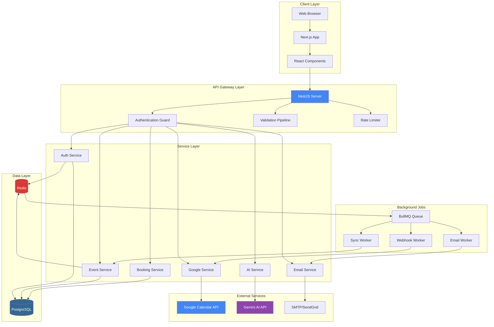

### **1.3. Giải thích chi tiết các tầng**

#### **Tầng 1: Client Layer (Tầng giao diện người dùng)**

**Web Browser:**
- Trình duyệt của người dùng (Chrome, Firefox, Safari, Edge)
- Render HTML, CSS, JavaScript để hiển thị giao diện
- Xử lý các tương tác của user (click, typing, scrolling)

**Next.js App:**
- Framework React cho phía client
- Server-Side Rendering (SSR): Render HTML trên server trước khi gửi cho browser
- Static Site Generation (SSG): Pre-build các trang tĩnh để load nhanh
- App Router: Hệ thống định tuyến dựa trên cấu trúc thư mục

**React Components:**
- Các thành phần UI như Button, Calendar, Modal, Form
- Mỗi component là một đơn vị độc lập, có thể tái sử dụng
- Ví dụ: `EventCard`, `CalendarView`, `ChatBox`

**Luồng hoạt động:**
```
User click button → React Component xử lý event
                  → Gọi API service
                  → Nhận response
                  → Update UI
```

#### **Tầng 2: API Gateway Layer (Tầng kiểm soát truy cập)**

Đây là tầng "cổng" nơi mọi request từ client phải đi qua trước khi được xử lý.

**NestJS Server:**
- API server chính chạy trên Node.js
- Nhận tất cả HTTP requests từ client
- Port: 8000 (development), 80/443 (production)

**Authentication Guard (Bảo vệ xác thực):**
- Kiểm tra JWT token trong mỗi request
- Nếu token hợp lệ → Cho phép tiếp tục
- Nếu token không hợp lệ hoặc hết hạn → Trả về 401 Unauthorized
- Public routes (login, register, public booking) không cần token

**Validation Pipeline (Đường ống xác thực dữ liệu):**
- Kiểm tra dữ liệu đầu vào từ client
- Sử dụng DTO (Data Transfer Object) để định nghĩa cấu trúc dữ liệu
- Ví dụ: Event title phải có, start_time phải trước end_time
- Nếu dữ liệu không hợp lệ → Trả về 400 Bad Request với error details

**Rate Limiter (Giới hạn tần suất):**
- Giới hạn số request từ một IP trong khoảng thời gian
- Ngăn chặn spam và DDoS attacks
- Ví dụ: Tối đa 100 requests/phút từ 1 IP

**Ví dụ luồng request qua Gateway:**
```
1. Client gửi: POST /api/events + JWT token
2. Authentication Guard: Kiểm tra token ✓ Valid
3. Validation Pipeline: Kiểm tra data ✓ Valid
4. Rate Limiter: Kiểm tra rate ✓ OK (50/100 requests)
5. → Forward request đến Service Layer
```

#### **Tầng 3: Service Layer (Tầng xử lý nghiệp vụ)**

Đây là nơi chứa logic chính của ứng dụng. Mỗi service phụ trách một chức năng cụ thể.

**1. Auth Service (Dịch vụ xác thực):**
- Xử lý đăng ký, đăng nhập, đăng xuất
- Tạo và verify JWT tokens
- Refresh access tokens khi hết hạn
- Quản lý sessions

**2. Event Service (Dịch vụ quản lý sự kiện):**
- CRUD operations cho events
- Xử lý recurring events (sự kiện lặp lại)
- Expand RRULE thành danh sách occurrences
- Search và filter events

**3. Booking Service (Dịch vụ đặt lịch):**
- Quản lý booking links
- Tính toán available time slots
- Tạo bookings từ guests
- Gửi confirmation emails

**4. AI Service (Dịch vụ AI Chatbot):**
- Nhận chat messages từ user
- Gọi Gemini AI API với context
- Xử lý function calling results
- Lưu conversation history

**5. Google Service (Dịch vụ Google Calendar):**
- OAuth 2.0 authentication với Google
- Sync events hai chiều (Calento ↔ Google)
- Setup và xử lý webhooks
- Refresh access tokens tự động

**6. Email Service (Dịch vụ Email):**
- Gửi email confirmation, reminders
- Render email templates với Handlebars
- Track email delivery status
- Retry failed emails

**Nguyên tắc hoạt động:**
- Mỗi service chỉ làm một việc (Single Responsibility)
- Service gọi Repository để truy vấn database
- Service không biết chi tiết về database queries
- Service có thể gọi service khác nếu cần

#### **Tầng 4: Data Layer (Tầng lưu trữ dữ liệu)**

**PostgreSQL (Primary Database):**
- Lưu trữ tất cả dữ liệu chính: users, events, bookings
- ACID compliant: Đảm bảo dữ liệu toàn vẹn
- Hỗ trợ complex queries, joins, indexes
- Persistent storage: Dữ liệu lưu vĩnh viễn

**Redis (Cache & Session Store):**
- Lưu tạm dữ liệu thường truy cập
- In-memory: Cực kỳ nhanh (microseconds)
- Session storage: Lưu JWT refresh tokens
- Queue backend: Lưu background jobs

**Tại sao cần cả hai?**
- PostgreSQL: Dữ liệu quan trọng, cần lưu lâu dài
- Redis: Dữ liệu tạm thời, cần truy cập nhanh

**Ví dụ:**
```
User load calendar tháng 11:
1. Check Redis cache → Cache hit! (đã lưu từ lần trước)
2. Return data từ Redis → Nhanh (5ms)
3. Không cần query PostgreSQL

User tạo event mới:
1. Insert vào PostgreSQL → Dữ liệu lưu vĩnh viễn
2. Invalidate Redis cache cho tháng 11
3. Lần load tiếp theo sẽ query PostgreSQL và cache lại
```

#### **Tầng 5: External Services (Dịch vụ bên thứ ba)**

**Google Calendar API:**
- Cho phép đọc và tạo events trên Google Calendar
- Sử dụng OAuth 2.0 để xác thực
- Webhook notifications khi có thay đổi
- API endpoint: `https://www.googleapis.com/calendar/v3/`

**Gemini AI API:**
- Large Language Model của Google
- Xử lý natural language từ user
- Function calling để thực hiện actions
- API endpoint: `https://generativelanguage.googleapis.com/`

**SMTP/SendGrid:**
- Gửi email notifications
- SMTP: Simple Mail Transfer Protocol (giao thức gửi email)
- SendGrid: Email delivery service (tỷ lệ delivered cao)
- Track email opens, clicks (với SendGrid)

**Lợi ích của việc tích hợp:**
- Không cần tự xây dựng AI model → Tiết kiệm thời gian
- Sync với Google Calendar → User không cần nhập lại
- Email delivery đáng tin cậy → Không bị spam

#### **Tầng 6: Background Jobs (Xử lý tác vụ nền)**

Một số tác vụ mất thời gian và không cần làm ngay lập tức. Chúng được đưa vào queue (hàng đợi) để xử lý nền.

**BullMQ Queue:**
- Hệ thống quản lý job queue
- Lưu jobs trong Redis
- Hỗ trợ priority, retry, scheduling

**Email Worker:**
- Lấy email jobs từ queue
- Gửi email qua SMTP/SendGrid
- Retry nếu thất bại (tối đa 3 lần)

**Sync Worker:**
- Đồng bộ events với Google Calendar
- Chạy theo lịch (mỗi 5 phút)
- Xử lý batch operations

**Webhook Worker:**
- Nhận notifications từ Google
- Parse webhook payload
- Trigger sync nếu có thay đổi

**Ví dụ thực tế:**
```
User book một cuộc hẹn:
1. API tạo booking ngay → Return 201 Created (nhanh, ~100ms)
2. Thêm job "gửi email" vào queue → Async
3. Email Worker xử lý job sau 1-2 giây
4. Guest nhận email confirmation
```

Lợi ích:
- User không phải chờ email gửi xong
- Nếu email server down, job tự retry
- Server không bị quá tải khi nhiều requests đồng thời

### **1.4. Luồng dữ liệu (Data Flow)**

Phần này giải thích chi tiết cách dữ liệu di chuyển qua các tầng của hệ thống, từ lúc user thực hiện một hành động cho đến khi nhận được kết quả.

#### **1.4.1. Sơ đồ luồng dữ liệu tổng quát**

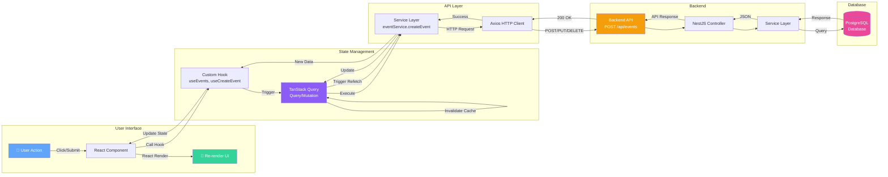

#### **1.4.2. Giải thích từng bước trong luồng dữ liệu**

Giả sử user muốn tạo một sự kiện mới "Họp team ngày mai 2h chiều". Đây là những gì xảy ra trong hệ thống:

**Bước 1-2: User Action & React Component**
```
User fills form:
- Title: "Họp team"
- Start: "2024-11-10 14:00"
- End: "2024-11-10 15:00"

User clicks "Save" button
→ React Component bắt sự kiện onClick
→ Component gọi function handleSubmit()
```

**Bước 3: Custom Hook**
```typescript
// Component gọi custom hook
const { mutate: createEvent } = useCreateEvent();

createEvent({
  title: "Họp team",
  start_time: "2024-11-10T14:00:00",
  end_time: "2024-11-10T15:00:00"
});
```

**Bước 4: TanStack Query Mutation**
- Hook `useCreateEvent` trigger một mutation
- Mutation sẽ:
  - Set `isLoading = true` → Component hiện loading spinner
  - Gọi service layer để thực hiện request
  - Handle success/error states

**Bước 5: Service Layer (Frontend)**
```typescript
// eventService.ts
export const eventService = {
  createEvent: async (data) => {
    return apiClient.post('/events', data);
  }
};
```

**Bước 6: Axios HTTP Client**
```
POST http://localhost:8000/api/events
Headers:
  Authorization: Bearer eyJhbGc...
  Content-Type: application/json
Body:
  {
    "title": "Họp team",
    "start_time": "2024-11-10T14:00:00",
    "end_time": "2024-11-10T15:00:00"
  }
```

**Bước 7-9: Backend Processing**

**Controller (EventController):**
```typescript
@Post('/events')
@UseGuards(JwtAuthGuard)  // Kiểm tra authentication
async create(@CurrentUser() user, @Body() dto: CreateEventDto) {
  return this.eventService.create(user.id, dto);
}
```

**Service (EventService):**
```typescript
async create(userId: string, dto: CreateEventDto) {
  // 1. Validate thời gian
  if (dto.end_time <= dto.start_time) {
    throw new BadRequestException('End time must be after start time');
  }
  
  // 2. Get primary calendar
  const calendar = await this.calendarService.getPrimary(userId);
  
  // 3. Create event
  const event = await this.eventRepository.create({
    ...dto,
    user_id: userId,
    calendar_id: calendar.id
  });
  
  // 4. Sync with Google if connected
  if (calendar.is_synced) {
    await this.googleService.createEvent(userId, event);
  }
  
  return event;
}
```

**Bước 10: Database Query**
```sql
INSERT INTO events (
  id, user_id, calendar_id, title, 
  start_time, end_time, created_at, updated_at
) VALUES (
  gen_random_uuid(), 
  '123e4567...', 
  '987fcdeb...', 
  'Họp team',
  '2024-11-10 14:00:00',
  '2024-11-10 15:00:00',
  NOW(),
  NOW()
) RETURNING *;
```

**Bước 11: Response trả về**
```json
{
  "success": true,
  "data": {
    "id": "abc-def-123",
    "title": "Họp team",
    "start_time": "2024-11-10T14:00:00Z",
    "end_time": "2024-11-10T15:00:00Z",
    "created_at": "2024-11-09T18:30:00Z"
  }
}
```

**Bước 12: Cache Update**
```typescript
// TanStack Query tự động:
1. Invalidate cache cho queries liên quan:
   - queryKey: ['events', { month: 11, year: 2024 }]
   - queryKey: ['events', 'upcoming']

2. Trigger refetch để lấy data mới

3. Update cache với data mới
```

**Bước 13: Re-render UI**
```
React Component re-render với:
- isLoading = false
- data = new event
- Calendar view tự động hiện event mới
- Toast notification: "Event created successfully!"
```

#### **1.4.3. Các tính năng quan trọng của luồng dữ liệu**

**1. Automatic Caching (Cache tự động):**

TanStack Query tự động cache API responses:
```
Lần đầu load calendar tháng 11:
→ Gọi API GET /events?month=11&year=2024
→ Cache với key: ['events', {month: 11, year: 2024}]
→ Thời gian cache: 5 phút

Lần sau load tháng 11:
→ Load từ cache (không gọi API)
→ Nhanh chóng, tiết kiệm bandwidth
```

**2. Optimistic Updates (Cập nhật lạc quan):**

UI update ngay lập tức TRƯỚC KHI API response:
```typescript
const { mutate } = useCreateEvent({
  onMutate: async (newEvent) => {
    // 1. Cancel outgoing refetches
    await queryClient.cancelQueries(['events']);
    
    // 2. Snapshot current cache
    const previousEvents = queryClient.getQueryData(['events']);
    
    // 3. Optimistically update cache
    queryClient.setQueryData(['events'], (old) => [...old, newEvent]);
    
    // 4. Return rollback function
    return { previousEvents };
  },
  
  onError: (err, newEvent, context) => {
    // Rollback nếu API thất bại
    queryClient.setQueryData(['events'], context.previousEvents);
  }
});
```

Lợi ích:
- UI phản hồi ngay lập tức
- Trải nghiệm người dùng mượt mà
- Tự động rollback nếu lỗi

**3. Error Handling (Xử lý lỗi tập trung):**

Errors được bắt và xử lý tại mọi tầng:

**Frontend:**
```typescript
const { mutate, error, isError } = useCreateEvent();

if (isError) {
  toast.error(error.message); // Hiện notification lỗi
}
```

**Backend:**
```typescript
try {
  await this.eventService.create(userId, dto);
} catch (error) {
  if (error instanceof ValidationError) {
    throw new BadRequestException(error.message);
  }
  throw new InternalServerErrorException('Failed to create event');
}
```

**4. Loading States (Trạng thái loading tự động):**

```typescript
const { isLoading, isFetching } = useEvents();

if (isLoading) return <Spinner />;
if (isFetching) return <RefetchIndicator />;
```

**5. Query Invalidation (Làm mới cache thông minh):**

Khi tạo event mới, cache bị invalidate:
```typescript
// Sau khi create event thành công
queryClient.invalidateQueries(['events']); // Tất cả event queries
queryClient.invalidateQueries(['events', { month: 11 }]); // Chỉ tháng 11
```

Chỉ invalidate queries liên quan, không ảnh hưởng queries khác.

### **2.3. Frontend Sitemap & Page Structure**

**Application Route Structure:**

```mermaid
graph TB
    A[🏠 Root /] --> B[Login Page]
    A --> C[Register Page]
    A --> Dashboard[Dashboard /dashboard]

    Dashboard --> Calendar[📅 Calendar /calendar]
    Dashboard --> Tasks[Tasks /tasks]
    Dashboard --> Priorities[📊 Priorities /schedule]
    Dashboard --> SchedulingLinks[🔗 Scheduling Links /scheduling-links]
    Dashboard --> Chat[💬 AI Chat /chat]
    Dashboard --> Settings[⚙️ Settings /settings]

    Calendar --> DayView[Day View]
    Calendar --> WeekView[Week View]
    Calendar --> MonthView[Month View]
    Calendar --> YearView[Year View]
    Calendar --> EventDetail[Event Detail Modal]
    Calendar --> EventForm[Event Form Modal]

    Tasks --> AllTasks[All Tasks]
    Tasks --> Today[Today]
    Tasks --> Upcoming[Upcoming]
    Tasks --> Completed[Completed]

    Priorities --> Critical[Critical Priority]
    Priorities --> High[High Priority]
    Priorities --> Medium[Medium Priority]
    Priorities --> Low[Low Priority]
    Priorities --> Disabled[Disabled Items]

    SchedulingLinks --> MyLinks[My Links]
    SchedulingLinks --> CreateLink[Create Link Modal]
    SchedulingLinks --> EditLink[Edit Link Modal]
    SchedulingLinks --> LinkAnalytics[Link Analytics]

    Chat --> NewChat[New Conversation]
    Chat --> History[Conversation History]
    Chat --> AI_FnCalls[AI Function Calls]

    Settings --> Profile[Profile Settings]
    Settings --> CalSettings[Calendar Settings]
    Settings --> Notify[Notification Settings]
    Settings --> GoogleSync[Google Calendar Sync]
    Settings --> Security[Security Settings]

    PublicRoutes[Public Routes] --> BookingPage["📆 Booking Page<br>/book/:username/:slug"]
    BookingPage --> DateSelection[Date Selection]
    BookingPage --> TimeSlotSelection[Time Slot Selection]
    BookingPage --> GuestInfo[Guest Information Form]
    BookingPage --> Confirm[Confirmation Page]

    style A fill:#60a5fa,color:#fff
    style Dashboard fill:#8b5cf6,color:#fff
    style Calendar fill:#10b981,color:#fff
    style Chat fill:#f59e0b,color:#fff
    style BookingPage fill:#ec4899,color:#fff

```

**Component Hierarchy:**

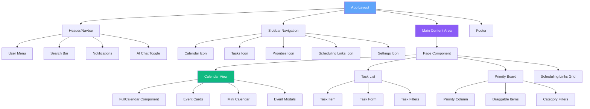

### **2.4. User Flow Diagrams**

**Main User Journey - Event Creation:**

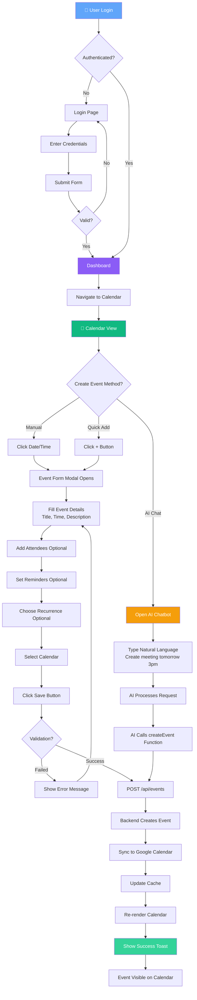


**AI Chatbot Interaction Flow:**

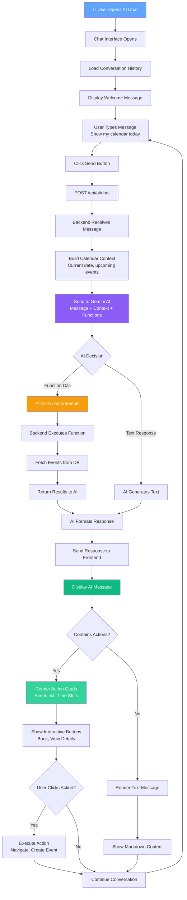

### **2.5. Module Architecture

**Backend Modules (NestJS):**

- **Common Module**: Shared services, guards, interceptors
- **Auth Module**: Authentication và authorization
- **Users Module**: User management
- **Event Module**: Calendar events management
- **Booking Module**: Scheduling links system
- **Google Module**: Google Calendar integration
- **AI Module**: Gemini AI chatbot
- **Email Module**: Email notifications
- **Queue Module**: Background job processing
- **Webhook Module**: External service notifications

**Frontend Structure:**

```
client/
├── app/                    # Next.js App Router
│   ├── (auth)/            # Auth pages
│   ├── (dashboard)/       # Protected pages
│   └── api/               # API routes
├── components/            # React components
│   ├── calendar/         # Calendar UI
│   ├── chat/             # AI chatbot
│   └── ui/               # Reusable UI
├── hook/                 # Custom React hooks
├── service/              # API services
├── store/                # Zustand stores
└── utils/                # Helper functions
```

## **2\. Server Flows**

### **2.1. Authentication Flow (Login)**

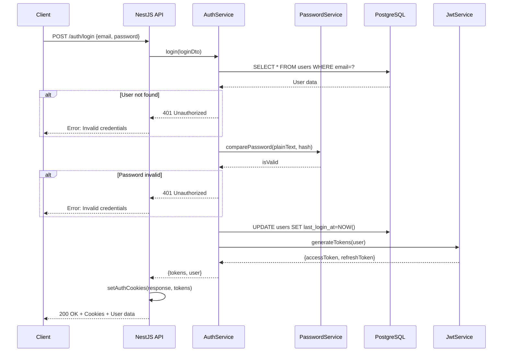

### **2.2. Event Creation Flow**

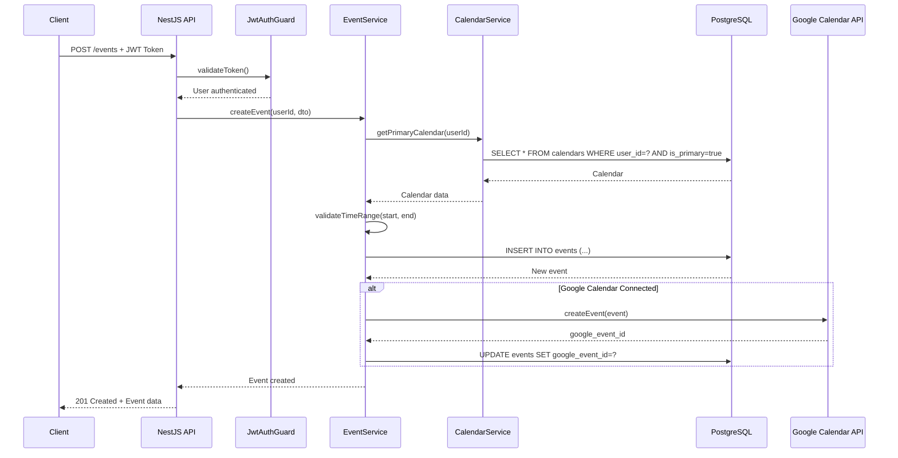

### **2.3. AI Chatbot Flow**

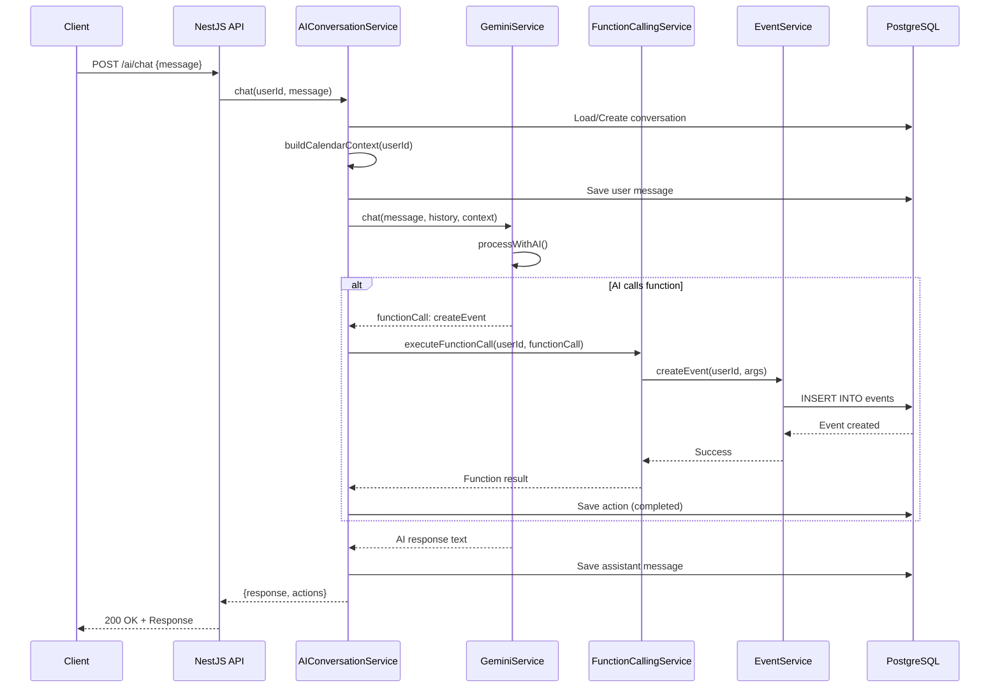

### **2.4. Google Calendar Sync Flow**

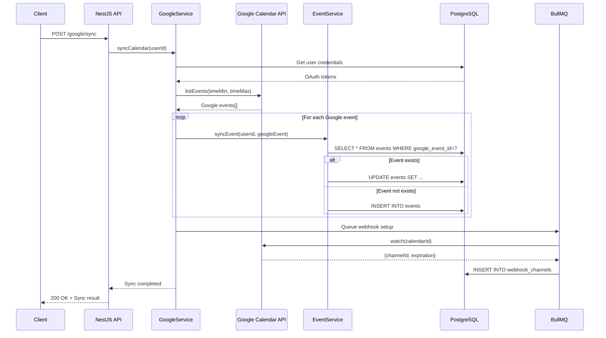

### **2.5. Booking Flow (Guest)**

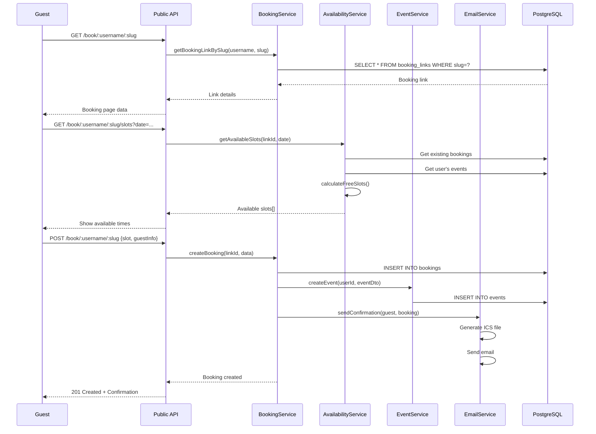

### **2.6. Database Migration Flow (Raw SQL)**

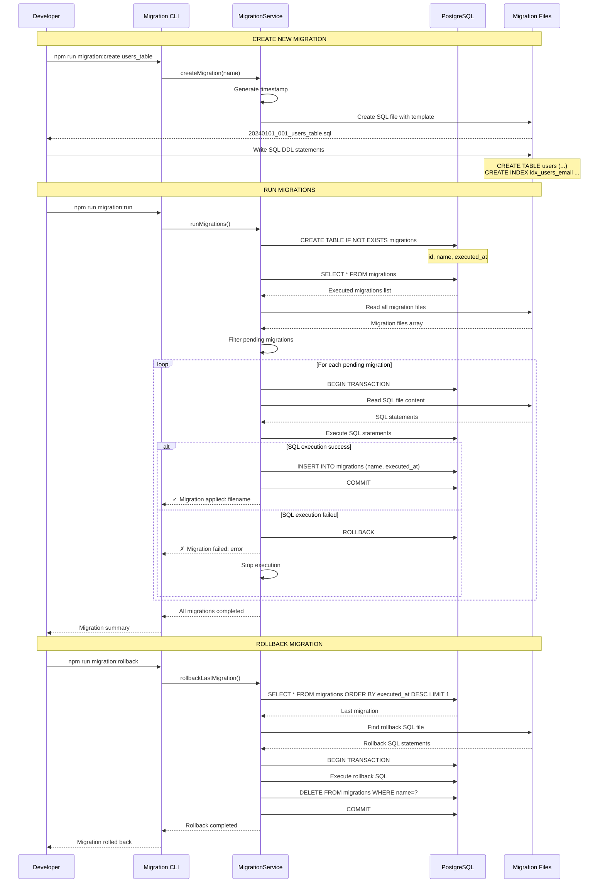

**Migration File Structure:**

**Create Migration:**

```sql
-- 20240101_001_create_users_table.sql
-- UP Migration
CREATE TABLE IF NOT EXISTS users (
    id UUID PRIMARY KEY DEFAULT gen_random_uuid(),
    email VARCHAR(255) UNIQUE NOT NULL,
    username VARCHAR(255) UNIQUE NOT NULL,
    password_hash TEXT NOT NULL,
    created_at TIMESTAMP DEFAULT CURRENT_TIMESTAMP,
    updated_at TIMESTAMP DEFAULT CURRENT_TIMESTAMP
);

CREATE INDEX idx_users_email ON users(email);
CREATE INDEX idx_users_username ON users(username);

-- Auto-update timestamp trigger
CREATE OR REPLACE FUNCTION update_updated_at_column()
RETURNS TRIGGER AS $$
BEGIN
    NEW.updated_at = CURRENT_TIMESTAMP;
    RETURN NEW;
END;
$$ language 'plpgsql';

CREATE TRIGGER update_users_updated_at 
    BEFORE UPDATE ON users 
    FOR EACH ROW 
    EXECUTE FUNCTION update_updated_at_column();
```

**Rollback Migration:**

```sql
-- 20240101_001_create_users_table_rollback.sql
-- DOWN Migration
DROP TRIGGER IF EXISTS update_users_updated_at ON users;
DROP FUNCTION IF EXISTS update_updated_at_column();
DROP INDEX IF EXISTS idx_users_username;
DROP INDEX IF EXISTS idx_users_email;
DROP TABLE IF EXISTS users CASCADE;
```

**Migration Service Implementation:**

```typescript
// Raw SQL - No ORM
export class MigrationService {
  async runMigrations(): Promise<void> {
    // 1. Ensure migrations table exists
    await this.db.query(`
      CREATE TABLE IF NOT EXISTS migrations (
        id SERIAL PRIMARY KEY,
        name VARCHAR(255) UNIQUE NOT NULL,
        executed_at TIMESTAMP DEFAULT CURRENT_TIMESTAMP
      )
    `);

    // 2. Get executed migrations
    const { rows: executed } = await this.db.query(
      'SELECT name FROM migrations ORDER BY executed_at'
    );
    const executedSet = new Set(executed.map(r => r.name));

    // 3. Get all migration files
    const files = await fs.readdir('./migrations');
    const pending = files
      .filter(f => f.endsWith('.sql') && !f.includes('rollback'))
      .filter(f => !executedSet.has(f))
      .sort();

    // 4. Execute each pending migration
    for (const file of pending) {
      const sql = await fs.readFile(`./migrations/${file}`, 'utf8');
  
      try {
        await this.db.query('BEGIN');
  
        // Execute migration SQL
        await this.db.query(sql);
  
        // Record migration
        await this.db.query(
          'INSERT INTO migrations (name) VALUES ($1)',
          [file]
        );
  
        await this.db.query('COMMIT');
        console.log(`✓ Applied: ${file}`);
      } catch (error) {
        await this.db.query('ROLLBACK');
        console.error(`✗ Failed: ${file}`, error);
        throw error;
      }
    }
  }
}
```

**Key Features:**

1. **Pure SQL**: Không sử dụng ORM, chỉ raw SQL queries
2. **Transaction Safety**: Mỗi migration chạy trong transaction
3. **Tracking**: Table `migrations` track executed migrations
4. **Rollback Support**: Mỗi migration có file rollback tương ứng
5. **Idempotent**: Sử dụng `IF NOT EXISTS`, `IF EXISTS`
6. **Order Guarantee**: Migration files có timestamp prefix
7. **Error Handling**: Rollback nếu migration fails

## **2\. Thiết kế Database**

Database (cơ sở dữ liệu) là nơi lưu trữ toàn bộ thông tin của ứng dụng. Calento sử dụng PostgreSQL - một hệ quản trị cơ sở dữ liệu quan hệ (RDBMS) để lưu trữ dữ liệu dưới dạng các bảng (tables) có liên kết với nhau.

### **2.1. Tổng quan về cấu trúc Database**

Hệ thống Calento sử dụng **15 tables chính** trong PostgreSQL database. Mỗi table lưu trữ một loại dữ liệu cụ thể:

| STT | Table Name       | Mô tả                  | Records ước tính |
| --- | ---------------- | ------------------------ | ------------------- |
| 1   | users            | Thông tin người dùng | ~10,000             |
| 2   | calendars        | Calendar của user       | ~10,000             |
| 3   | events           | Calendar events          | ~500,000            |
| 4   | booking_links    | Scheduling links         | ~50,000             |
| 5   | bookings         | Guest bookings           | ~200,000            |
| 6   | user_credentials | OAuth tokens             | ~10,000             |
| 7   | webhook_channels | Google webhooks          | ~10,000             |
| 8   | ai_conversations | AI chat sessions         | ~100,000            |
| 9   | ai_actions       | AI function calls        | ~500,000            |
| 10  | email_logs       | Email tracking           | ~1,000,000          |
| 11  | email_templates  | Email templates          | ~50                 |
| 12  | priorities       | Priority board items     | ~100,000            |
| 13  | tasks            | Task management          | ~200,000            |
| 14  | habits           | Habit tracking           | ~50,000             |
| 15  | notifications    | System notifications     | ~500,000            |

### **2.2. Mối quan hệ giữa các Tables**

Các tables trong database có mối quan hệ với nhau thông qua **Foreign Keys** (khóa ngoại):

```
users (1) ----< (nhiều) calendars
users (1) ----< (nhiều) events
users (1) ----< (nhiều) booking_links
calendars (1) ----< (nhiều) events
booking_links (1) ----< (nhiều) bookings
events (1) ----< (1) bookings
```

**Giải thích:**
- **1:nhiều** (one-to-many): Một user có nhiều calendars, nhiều events
- **Foreign Key**: Liên kết giữa 2 tables (VD: `events.user_id` → `users.id`)

**Ví dụ cụ thể:**
```
User "John Doe" (id: abc-123)
  ├── Calendar "Work" (id: cal-001)
  │   ├── Event "Team Meeting" (id: evt-001)
  │   └── Event "Project Review" (id: evt-002)
  ├── Calendar "Personal" (id: cal-002)
  │   └── Event "Doctor Appointment" (id: evt-003)
  └── Booking Link "30-min Call" (id: link-001)
      ├── Booking từ "Alice" (id: book-001)
      └── Booking từ "Bob" (id: book-002)
```

### **2.3. Chi tiết các Tables chính**

#### **Table 1: users (Người dùng)**

**Mục đích:** Lưu trữ thông tin tài khoản người dùng và dữ liệu xác thực.

**Cấu trúc:**

| Column        | Type         | Constraints                | Description            |
| ------------- | ------------ | -------------------------- | ---------------------- |
| id            | UUID         | PRIMARY KEY                | User ID                |
| email         | VARCHAR(255) | UNIQUE, NOT NULL           | Email address          |
| username      | VARCHAR(255) | UNIQUE, NOT NULL           | Username               |
| password_hash | TEXT         | NOT NULL                   | Bcrypt hashed password |
| first_name    | VARCHAR(100) |                            | First name             |
| last_name     | VARCHAR(100) |                            | Last name              |
| avatar        | TEXT         |                            | Avatar URL             |
| timezone      | VARCHAR(50)  | DEFAULT 'Asia/Ho_Chi_Minh' | User timezone          |
| status        | VARCHAR(20)  | DEFAULT 'active'           | Account status         |
| last_login_at | TIMESTAMP    |                            | Last login time        |
| created_at    | TIMESTAMP    | DEFAULT NOW()              | Created timestamp      |
| updated_at    | TIMESTAMP    | DEFAULT NOW()              | Updated timestamp      |

**Indexes (Chỉ mục):**

Indexes giúp tìm kiếm dữ liệu nhanh hơn, giống như mục lục trong sách.

- `idx_users_email` ON email - Tìm user theo email nhanh
- `idx_users_username` ON username - Tìm user theo username nhanh
- `idx_users_status` ON status - Lọc users theo status (active/inactive)

**Ví dụ dữ liệu:**

| id      | email             | username | password_hash | first_name | last_name | timezone          | status |
| ------- | ----------------- | -------- | ------------- | ---------- | --------- | ----------------- | ------ |
| abc-123 | john@example.com  | johndoe  | $2b$10$...   | John       | Doe       | Asia/Ho_Chi_Minh | active |
| def-456 | alice@example.com | alice123 | $2b$10$...   | Alice      | Smith     | America/New_York | active |

**Constraints quan trọng:**
- **PRIMARY KEY**: `id` là duy nhất, không trùng lặp
- **UNIQUE**: `email` và `username` không được trùng (mỗi user một email)
- **NOT NULL**: Các field quan trọng phải có giá trị

#### **Table 2: calendars (Lịch)**

**Mục đích:** Lưu trữ các calendars của user. Mỗi user có thể có nhiều calendars (Work, Personal, Study...).

**Cấu trúc:**

| Column             | Type         | Constraints                | Description        |
| ------------------ | ------------ | -------------------------- | ------------------ |
| id                 | UUID         | PRIMARY KEY                | Calendar ID        |
| user_id            | UUID         | FOREIGN KEY → users(id)   | Calendar owner     |
| name               | VARCHAR(255) | NOT NULL                   | Calendar name      |
| description        | TEXT         |                            | Description        |
| color              | VARCHAR(7)   | DEFAULT '#4285f4'          | Display color      |
| timezone           | VARCHAR(50)  | DEFAULT 'Asia/Ho_Chi_Minh' | Calendar timezone  |
| is_primary         | BOOLEAN      | DEFAULT false              | Primary calendar   |
| is_synced          | BOOLEAN      | DEFAULT false              | Google synced      |
| google_calendar_id | VARCHAR(255) |                            | Google Calendar ID |
| created_at         | TIMESTAMP    | DEFAULT NOW()              | Created timestamp  |
| updated_at         | TIMESTAMP    | DEFAULT NOW()              | Updated timestamp  |

**Foreign Key:**
- `user_id` → `users(id)`: Liên kết với table users
- Khi user bị xóa, tất cả calendars của user đó cũng sẽ bị xóa (CASCADE)

**Indexes:**
- `idx_calendars_user` ON user_id - Query calendars của một user
- `idx_calendars_primary` ON (user_id, is_primary) - Tìm primary calendar nhanh
- `idx_calendars_google` ON google_calendar_id - Sync với Google Calendar

**Ví dụ dữ liệu:**

| id      | user_id | name     | color   | is_primary | is_synced | google_calendar_id |
| ------- | ------- | -------- | ------- | ---------- | --------- | ------------------ |
| cal-001 | abc-123 | Work     | #4285f4 | true       | true      | primary            |
| cal-002 | abc-123 | Personal | #f4b400 | false      | false     | NULL               |
| cal-003 | def-456 | Study    | #0f9d58 | true       | false     | NULL               |

**Giải thích:**
- User `abc-123` (John) có 2 calendars: Work (primary, synced) và Personal
- User `def-456` (Alice) có 1 calendar: Study (primary, not synced)
- `is_primary = true`: Calendar mặc định khi tạo events
- `is_synced = true`: Đồng bộ với Google Calendar

#### **Table 3: events (Sự kiện)**

**Mục đích:** Lưu trữ tất cả calendar events, bao gồm cả sự kiện đơn lẻ và sự kiện lặp lại (recurring).

**Cấu trúc:**

| Column                     | Type         | Constraints                  | Description        |
| -------------------------- | ------------ | ---------------------------- | ------------------ |
| id                         | UUID         | PRIMARY KEY                  | Event ID           |
| user_id                    | UUID         | FOREIGN KEY → users(id)     | Event owner        |
| calendar_id                | UUID         | FOREIGN KEY → calendars(id) | Parent calendar    |
| google_event_id            | VARCHAR(255) |                              | Google Calendar ID |
| title                      | VARCHAR(255) | NOT NULL                     | Event title        |
| description                | TEXT         |                              | Event description  |
| location                   | TEXT         |                              | Event location     |
| start_time                 | TIMESTAMP    | NOT NULL                     | Start datetime     |
| end_time                   | TIMESTAMP    | NOT NULL                     | End datetime       |
| timezone                   | VARCHAR(50)  | DEFAULT 'Asia/Ho_Chi_Minh'   | Event timezone     |
| is_all_day                 | BOOLEAN      | DEFAULT false                | All-day event      |
| recurrence_rule            | TEXT         |                              | RRULE format       |
| recurrence_exception_dates | JSONB        |                              | Excluded dates     |
| attendees                  | JSONB        |                              | Attendee list      |
| conference_data            | JSONB        |                              | Meeting link info  |
| reminders                  | JSONB        |                              | Reminder settings  |
| visibility                 | VARCHAR(20)  | DEFAULT 'default'            | public/private     |
| status                     | VARCHAR(20)  | DEFAULT 'confirmed'          | Event status       |
| created_at                 | TIMESTAMP    | DEFAULT NOW()                | Created timestamp  |
| updated_at                 | TIMESTAMP    | DEFAULT NOW()                | Updated timestamp  |
| deleted_at                 | TIMESTAMP    |                              | Soft delete        |

**Foreign Keys:**
- `user_id` → `users(id)`: User sở hữu event
- `calendar_id` → `calendars(id)`: Calendar chứa event

**Indexes:**
- `idx_events_user_time` ON (user_id, start_time, end_time) - Query events trong khoảng thời gian
- `idx_events_calendar` ON calendar_id - Lấy events theo calendar
- `idx_events_google_id` ON google_event_id - Sync với Google
- `idx_events_recurring` ON recurrence_rule - Tìm recurring events
- `idx_events_search` ON (title, description) USING gin - Full-text search

**JSONB Fields - Dữ liệu linh hoạt:**

PostgreSQL hỗ trợ JSONB để lưu dữ liệu dạng JSON, rất tiện cho dữ liệu có cấu trúc thay đổi.

**1. attendees (Người tham dự):**
```json
[
  {
    "email": "alice@example.com",
    "name": "Alice Smith",
    "response_status": "accepted",
    "optional": false
  },
  {
    "email": "bob@example.com",
    "name": "Bob Johnson",
    "response_status": "pending",
    "optional": true
  }
]
```

**2. conference_data (Link họp online):**
```json
{
  "type": "google_meet",
  "url": "https://meet.google.com/abc-defg-hij",
  "conference_id": "abc-defg-hij"
}
```

**3. reminders (Nhắc nhở):**
```json
[
  {
    "method": "email",
    "minutes_before": 60
  },
  {
    "method": "notification",
    "minutes_before": 15
  }
]
```

**Recurring Events (Sự kiện lặp lại):**

**RRULE Format** (iCalendar standard):
```
FREQ=WEEKLY;BYDAY=MO,WE,FR;UNTIL=20241231T235959Z

Giải thích:
- FREQ=WEEKLY: Lặp lại hàng tuần
- BYDAY=MO,WE,FR: Vào thứ 2, 4, 6
- UNTIL=...: Cho đến hết 31/12/2024
```

**Ví dụ dữ liệu event:**

| id      | title               | start_time          | end_time            | recurrence_rule       | attendees          |
| ------- | ------------------- | ------------------- | ------------------- | --------------------- | ------------------ |
| evt-001 | Team Meeting        | 2024-11-10 14:00:00 | 2024-11-10 15:00:00 | FREQ=WEEKLY;BYDAY=MON | [Alice, Bob]       |
| evt-002 | Doctor Appointment  | 2024-11-12 09:00:00 | 2024-11-12 09:30:00 | NULL                  | []                 |
| evt-003 | Daily Standup       | 2024-11-09 09:00:00 | 2024-11-09 09:15:00 | FREQ=DAILY;COUNT=30   | [Team Members]     |

**Soft Delete:**
- `deleted_at` field: NULL (active), hoặc có giá trị (deleted)
- Không xóa hẳn khỏi database, chỉ đánh dấu là đã xóa
- Có thể restore nếu cần

#### **Table 4: booking_links (Liên kết đặt lịch)**

**Mục đích:** Lưu trữ các liên kết scheduling mà user tạo ra, tương tự Calendly.

**Cấu trúc:**

| Column                | Type         | Constraints              | Description                  |
| --------------------- | ------------ | ------------------------ | ---------------------------- |
| id                    | UUID         | PRIMARY KEY              | Link ID                      |
| user_id               | UUID         | FOREIGN KEY → users(id) | Link owner                   |
| title                 | VARCHAR(255) | NOT NULL                 | Link title                   |
| slug                  | VARCHAR(255) | NOT NULL                 | URL slug                     |
| description           | TEXT         |                          | Link description             |
| duration_minutes      | INT          | NOT NULL                 | Meeting duration             |
| buffer_before_minutes | INT          | DEFAULT 0                | Buffer before meeting        |
| buffer_after_minutes  | INT          | DEFAULT 0                | Buffer after meeting         |
| availability_type     | VARCHAR(50)  | NOT NULL                 | specific_hours/calendar_sync |
| availability_hours    | JSONB        |                          | Week schedule                |
| location_type         | VARCHAR(50)  | DEFAULT 'google_meet'    | Meeting location type        |
| location_value        | TEXT         |                          | Location value               |
| color                 | VARCHAR(7)   | DEFAULT '#4285f4'        | Display color                |
| is_active             | BOOLEAN      | DEFAULT true             | Active status                |
| bookings_count        | INT          | DEFAULT 0                | Total bookings               |
| max_bookings_per_day  | INT          |                          | Daily limit                  |
| notice_period_hours   | INT          | DEFAULT 24               | Advance booking time         |
| created_at            | TIMESTAMP    | DEFAULT NOW()            | Created timestamp            |
| updated_at            | TIMESTAMP    | DEFAULT NOW()            | Updated timestamp            |

**Unique Constraint:** (user_id, slug)

**Indexes:**

- `idx_booking_links_user` ON user_id
- `idx_booking_links_slug` ON (user_id, slug)
- `idx_booking_links_active` ON is_active

#### **5. bookings Table**

Lưu trữ guest bookings từ booking links.

| Column              | Type         | Constraints                      | Description       |
| ------------------- | ------------ | -------------------------------- | ----------------- |
| id                  | UUID         | PRIMARY KEY                      | Booking ID        |
| booking_link_id     | UUID         | FOREIGN KEY → booking_links(id) | Link used         |
| event_id            | UUID         | FOREIGN KEY → events(id)        | Created event     |
| guest_name          | VARCHAR(255) | NOT NULL                         | Guest name        |
| guest_email         | VARCHAR(255) | NOT NULL                         | Guest email       |
| guest_phone         | VARCHAR(50)  |                                  | Guest phone       |
| guest_notes         | TEXT         |                                  | Additional notes  |
| slot_start          | TIMESTAMP    | NOT NULL                         | Booked start time |
| slot_end            | TIMESTAMP    | NOT NULL                         | Booked end time   |
| timezone            | VARCHAR(50)  | NOT NULL                         | Guest timezone    |
| status              | VARCHAR(50)  | DEFAULT 'confirmed'              | Booking status    |
| cancellation_reason | TEXT         |                                  | If cancelled      |
| reminder_sent       | BOOLEAN      | DEFAULT false                    | Reminder status   |
| created_at          | TIMESTAMP    | DEFAULT NOW()                    | Created timestamp |
| updated_at          | TIMESTAMP    | DEFAULT NOW()                    | Updated timestamp |

**Indexes:**

- `idx_bookings_link` ON booking_link_id
- `idx_bookings_email` ON guest_email
- `idx_bookings_time` ON (slot_start, slot_end)
- `idx_bookings_status` ON status

#### **6. user_credentials Table**

Lưu trữ OAuth tokens cho external services.

| Column        | Type        | Constraints              | Description          |
| ------------- | ----------- | ------------------------ | -------------------- |
| id            | UUID        | PRIMARY KEY              | Credential ID        |
| user_id       | UUID        | FOREIGN KEY → users(id) | User ID              |
| provider      | VARCHAR(50) | NOT NULL                 | google/microsoft/etc |
| access_token  | TEXT        | NOT NULL                 | OAuth access token   |
| refresh_token | TEXT        |                          | OAuth refresh token  |
| expires_at    | TIMESTAMP   |                          | Token expiration     |
| scope         | TEXT        |                          | Granted scopes       |
| created_at    | TIMESTAMP   | DEFAULT NOW()            | Created timestamp    |
| updated_at    | TIMESTAMP   | DEFAULT NOW()            | Updated timestamp    |

**Unique Constraint:** (user_id, provider)

**Indexes:**

- `idx_credentials_user_provider` ON (user_id, provider)

#### **7. webhook_channels Table**

Lưu trữ Google Calendar webhook channels.

| Column      | Type         | Constraints                  | Description           |
| ----------- | ------------ | ---------------------------- | --------------------- |
| id          | UUID         | PRIMARY KEY                  | Channel ID (internal) |
| user_id     | UUID         | FOREIGN KEY → users(id)     | User ID               |
| calendar_id | UUID         | FOREIGN KEY → calendars(id) | Calendar ID           |
| channel_id  | VARCHAR(255) | NOT NULL                     | Google channel ID     |
| resource_id | VARCHAR(255) | NOT NULL                     | Google resource ID    |
| expiration  | TIMESTAMP    | NOT NULL                     | Channel expiration    |
| is_active   | BOOLEAN      | DEFAULT true                 | Active status         |
| created_at  | TIMESTAMP    | DEFAULT NOW()                | Created timestamp     |
| updated_at  | TIMESTAMP    | DEFAULT NOW()                | Updated timestamp     |

**Indexes:**

- `idx_webhook_user` ON user_id
- `idx_webhook_channel` ON channel_id
- `idx_webhook_expiration` ON expiration

#### **8. ai_conversations Table**

Lưu trữ AI chatbot conversations.

| Column     | Type         | Constraints              | Description        |
| ---------- | ------------ | ------------------------ | ------------------ |
| id         | UUID         | PRIMARY KEY              | Conversation ID    |
| user_id    | UUID         | FOREIGN KEY → users(id) | User ID            |
| title      | VARCHAR(255) |                          | Conversation title |
| messages   | JSONB        | NOT NULL                 | Message history    |
| context    | JSONB        |                          | Calendar context   |
| created_at | TIMESTAMP    | DEFAULT NOW()            | Created timestamp  |
| updated_at | TIMESTAMP    | DEFAULT NOW()            | Updated timestamp  |
| deleted_at | TIMESTAMP    |                          | Soft delete        |

**Indexes:**

- `idx_conversations_user` ON user_id
- `idx_conversations_updated` ON updated_at

#### **9. ai_actions Table**

Lưu trữ AI function call actions.

| Column          | Type         | Constraints                         | Description         |
| --------------- | ------------ | ----------------------------------- | ------------------- |
| id              | UUID         | PRIMARY KEY                         | Action ID           |
| conversation_id | UUID         | FOREIGN KEY → ai_conversations(id) | Conversation        |
| action_type     | VARCHAR(100) | NOT NULL                            | Function name       |
| parameters      | JSONB        |                                     | Function parameters |
| status          | VARCHAR(50)  | DEFAULT 'pending'                   | Action status       |
| result          | JSONB        |                                     | Function result     |
| error           | TEXT         |                                     | Error message       |
| created_at      | TIMESTAMP    | DEFAULT NOW()                       | Created timestamp   |
| updated_at      | TIMESTAMP    | DEFAULT NOW()                       | Updated timestamp   |

**Indexes:**

- `idx_actions_conversation` ON conversation_id
- `idx_actions_status` ON status

#### **10. email_logs Table**

Lưu trữ email sending logs.

| Column       | Type         | Constraints                        | Description       |
| ------------ | ------------ | ---------------------------------- | ----------------- |
| id           | UUID         | PRIMARY KEY                        | Log ID            |
| user_id      | UUID         | FOREIGN KEY → users(id)           | User ID           |
| template_id  | UUID         | FOREIGN KEY → email_templates(id) | Template used     |
| to_email     | VARCHAR(255) | NOT NULL                           | Recipient email   |
| subject      | VARCHAR(255) | NOT NULL                           | Email subject     |
| status       | VARCHAR(50)  | DEFAULT 'pending'                  | Send status       |
| provider     | VARCHAR(50)  |                                    | SMTP/SendGrid/etc |
| error        | TEXT         |                                    | Error message     |
| sent_at      | TIMESTAMP    |                                    | Send time         |
| delivered_at | TIMESTAMP    |                                    | Delivery time     |
| opened_at    | TIMESTAMP    |                                    | First open time   |
| clicked_at   | TIMESTAMP    |                                    | First click time  |
| created_at   | TIMESTAMP    | DEFAULT NOW()                      | Created timestamp |

**Indexes:**

- `idx_email_logs_user` ON user_id
- `idx_email_logs_status` ON status
- `idx_email_logs_sent` ON sent_at

#### **11. email_templates Table**

Lưu trữ email templates.

| Column     | Type         | Constraints      | Description        |
| ---------- | ------------ | ---------------- | ------------------ |
| id         | UUID         | PRIMARY KEY      | Template ID        |
| name       | VARCHAR(255) | UNIQUE, NOT NULL | Template name      |
| subject    | VARCHAR(255) | NOT NULL         | Email subject      |
| html_body  | TEXT         | NOT NULL         | HTML content       |
| text_body  | TEXT         |                  | Plain text content |
| variables  | JSONB        |                  | Template variables |
| is_active  | BOOLEAN      | DEFAULT true     | Active status      |
| created_at | TIMESTAMP    | DEFAULT NOW()    | Created timestamp  |
| updated_at | TIMESTAMP    | DEFAULT NOW()    | Updated timestamp  |

**Indexes:**

- `idx_templates_name` ON name
- `idx_templates_active` ON is_active

#### **12. priorities Table**

Lưu trữ priority board items.

| Column         | Type        | Constraints              | Description              |
| -------------- | ----------- | ------------------------ | ------------------------ |
| id             | UUID        | PRIMARY KEY              | Priority ID              |
| user_id        | UUID        | FOREIGN KEY → users(id) | User ID                  |
| item_id        | UUID        | NOT NULL                 | Referenced item ID       |
| item_type      | VARCHAR(50) | NOT NULL                 | task/booking_link/habit  |
| priority_level | VARCHAR(50) | NOT NULL                 | critical/high/medium/low |
| order_index    | INT         | DEFAULT 0                | Order in column          |
| created_at     | TIMESTAMP   | DEFAULT NOW()            | Created timestamp        |
| updated_at     | TIMESTAMP   | DEFAULT NOW()            | Updated timestamp        |

**Unique Constraint:** (user_id, item_id, item_type)

**Indexes:**

- `idx_priorities_user` ON user_id
- `idx_priorities_item` ON (item_id, item_type)

#### **13. tasks Table**

Lưu trữ user tasks.

| Column             | Type         | Constraints              | Description         |
| ------------------ | ------------ | ------------------------ | ------------------- |
| id                 | UUID         | PRIMARY KEY              | Task ID             |
| user_id            | UUID         | FOREIGN KEY → users(id) | Task owner          |
| title              | VARCHAR(255) | NOT NULL                 | Task title          |
| description        | TEXT         |                          | Task description    |
| due_date           | TIMESTAMP    |                          | Due date            |
| estimated_duration | INT          |                          | Duration in minutes |
| priority           | VARCHAR(50)  | DEFAULT 'medium'         | Task priority       |
| status             | VARCHAR(50)  | DEFAULT 'pending'        | Task status         |
| completed_at       | TIMESTAMP    |                          | Completion time     |
| created_at         | TIMESTAMP    | DEFAULT NOW()            | Created timestamp   |
| updated_at         | TIMESTAMP    | DEFAULT NOW()            | Updated timestamp   |

**Indexes:**

- `idx_tasks_user` ON user_id
- `idx_tasks_due` ON due_date
- `idx_tasks_status` ON status

#### **14. habits Table**

Lưu trữ habit tracking (dự kiến triển khai).

| Column         | Type         | Constraints              | Description          |
| -------------- | ------------ | ------------------------ | -------------------- |
| id             | UUID         | PRIMARY KEY              | Habit ID             |
| user_id        | UUID         | FOREIGN KEY → users(id) | Habit owner          |
| name           | VARCHAR(255) | NOT NULL                 | Habit name           |
| description    | TEXT         |                          | Habit description    |
| frequency      | VARCHAR(50)  | NOT NULL                 | daily/weekly/monthly |
| target_count   | INT          | DEFAULT 1                | Target per period    |
| current_streak | INT          | DEFAULT 0                | Current streak       |
| longest_streak | INT          | DEFAULT 0                | Longest streak       |
| is_active      | BOOLEAN      | DEFAULT true             | Active status        |
| created_at     | TIMESTAMP    | DEFAULT NOW()            | Created timestamp    |

**Indexes:**

- `idx_habits_user` ON user_id
- `idx_habits_active` ON is_active

#### **15. notifications Table**

Lưu trữ system notifications.

| Column     | Type         | Constraints              | Description          |
| ---------- | ------------ | ------------------------ | -------------------- |
| id         | UUID         | PRIMARY KEY              | Notification ID      |
| user_id    | UUID         | FOREIGN KEY → users(id) | User ID              |
| type       | VARCHAR(50)  | NOT NULL                 | Notification type    |
| title      | VARCHAR(255) | NOT NULL                 | Notification title   |
| message    | TEXT         | NOT NULL                 | Notification message |
| data       | JSONB        |                          | Additional data      |
| is_read    | BOOLEAN      | DEFAULT false            | Read status          |
| read_at    | TIMESTAMP    |                          | Read time            |
| created_at | TIMESTAMP    | DEFAULT NOW()            | Created timestamp    |

**Indexes:**

- `idx_notifications_user` ON user_id
- `idx_notifications_read` ON (user_id, is_read)
- `idx_notifications_created` ON created_at

### **2.3. JSONB Schema Examples**

**event.attendees:**

| Trường | Giá trị ví dụ | Mô tả |
| :--- | :--- | :--- |
| `email` | user@example.com | Email của người tham dự |
| `display_name` | John Doe | Tên hiển thị |
| `response_status` | accepted | Trạng thái phản hồi (accepted, declined, needs_action) |

**booking_links.availability_hours:**

| Ngày | Giờ bắt đầu | Giờ kết thúc |
| :--- | :--- | :--- |
| `monday` | 09:00 | 12:00 |
| `monday` | 13:00 | 17:00 |
| `tuesday` | ... | ... |

**ai_conversations.messages:**

| Role | Content | Timestamp |
| :--- | :--- | :--- |
| `user` | Schedule a meeting tomorrow at 2pm | 2024-01-01T10:00:00Z |
| `assistant` | I've created the meeting... | 2024-01-01T10:00:05Z |

## **4\. Thiết kế API**

### **4.1. Tổng quan API Endpoints**

**Base URL:** `https://api.calento.space/api`

**Tổng số endpoints:** 78 endpoints

| Module          | Số endpoints | Mô tả                         |
| --------------- | ------------- | ------------------------------- |
| Authentication  | 10            | Đăng ký, đăng nhập, OAuth |
| Users           | 8             | Quản lý user profile          |
| Events          | 15            | CRUD events, recurring, search  |
| Calendars       | 7             | Quản lý calendars             |
| Booking Links   | 8             | Scheduling links system         |
| Bookings        | 6             | Guest bookings                  |
| AI Chatbot      | 6             | AI conversations                |
| Google Calendar | 8             | Sync, webhooks                  |
| Email           | 10            | Email notifications             |

### **4.2. Chi tiết API Endpoints**

#### **4.2.1. Authentication Endpoints (10)**

| Method | Endpoint                  | Mô tả                     | Auth Required |
| ------ | ------------------------- | --------------------------- | ------------- |
| POST   | `/auth/register`        | Register new user           | No            |
| POST   | `/auth/login`           | Login with email/password   | No            |
| POST   | `/auth/logout`          | Logout user                 | Yes           |
| POST   | `/auth/refresh`         | Refresh access token        | Yes           |
| GET    | `/auth/me`              | Get current user            | Yes           |
| PATCH  | `/auth/me`              | Update current user         | Yes           |
| POST   | `/auth/forgot-password` | Request password reset      | No            |
| POST   | `/auth/reset-password`  | Reset password with token   | No            |
| GET    | `/auth/google/url`      | Get Google OAuth URL        | No            |
| POST   | `/auth/google/login`    | Complete Google OAuth login | No            |

#### **4.2.2. User Endpoints (8)**

| Method | Endpoint                 | Mô tả                   | Auth Required |
| ------ | ------------------------ | ------------------------- | ------------- |
| GET    | `/users`               | List users (admin)        | Yes           |
| GET    | `/users/:id`           | Get user by ID            | Yes           |
| PATCH  | `/users/:id`           | Update user               | Yes           |
| DELETE | `/users/:id`           | Delete user (soft delete) | Yes           |
| GET    | `/users/search`        | Search users              | Yes           |
| GET    | `/users/:id/calendars` | Get user's calendars      | Yes           |
| GET    | `/users/:id/events`    | Get user's events         | Yes           |
| GET    | `/users/:id/stats`     | Get user statistics       | Yes           |

#### **4.2.3. Event Endpoints (15)**

| Method | Endpoint                     | Mô tả                  | Auth Required |
| ------ | ---------------------------- | ------------------------ | ------------- |
| GET    | `/events`                  | List events (paginated)  | Yes           |
| POST   | `/events`                  | Create new event         | Yes           |
| GET    | `/events/:id`              | Get event detail         | Yes           |
| PATCH  | `/events/:id`              | Update event (partial)   | Yes           |
| PUT    | `/events/:id`              | Replace event (full)     | Yes           |
| DELETE | `/events/:id`              | Delete event             | Yes           |
| GET    | `/events/calendar`         | Get events by date range | Yes           |
| GET    | `/events/search`           | Search events            | Yes           |
| GET    | `/events/recurring`        | List recurring events    | Yes           |
| GET    | `/events/recurring/expand` | Expand recurring events  | Yes           |
| POST   | `/events/:id/duplicate`    | Duplicate event          | Yes           |
| GET    | `/events/upcoming`         | Get upcoming events      | Yes           |
| GET    | `/events/past`             | Get past events          | Yes           |
| GET    | `/events/today`            | Get today's events       | Yes           |
| GET    | `/events/stats`            | Get event statistics     | Yes           |

#### **4.2.4. Calendar Endpoints (7)**

| Method | Endpoint                  | Mô tả               | Auth Required |
| ------ | ------------------------- | --------------------- | ------------- |
| GET    | `/calendars`            | List user's calendars | Yes           |
| POST   | `/calendars`            | Create calendar       | Yes           |
| GET    | `/calendars/:id`        | Get calendar detail   | Yes           |
| PATCH  | `/calendars/:id`        | Update calendar       | Yes           |
| DELETE | `/calendars/:id`        | Delete calendar       | Yes           |
| POST   | `/calendars/:id/share`  | Share calendar        | Yes           |
| GET    | `/calendars/:id/events` | Get calendar's events | Yes           |

#### **4.2.5. Booking Link Endpoints (8)**

| Method | Endpoint                        | Mô tả                   | Auth Required |
| ------ | ------------------------------- | ------------------------- | ------------- |
| GET    | `/booking-links`              | List user's booking links | Yes           |
| POST   | `/booking-links`              | Create booking link       | Yes           |
| GET    | `/booking-links/:id`          | Get booking link detail   | Yes           |
| PATCH  | `/booking-links/:id`          | Update booking link       | Yes           |
| DELETE | `/booking-links/:id`          | Delete booking link       | Yes           |
| POST   | `/booking-links/:id/toggle`   | Enable/disable link       | Yes           |
| GET    | `/booking-links/:id/bookings` | Get link's bookings       | Yes           |
| GET    | `/booking-links/:id/stats`    | Get link statistics       | Yes           |

#### **4.2.6. Public Booking Endpoints (6)**

| Method | Endpoint                        | Mô tả             | Auth Required |
| ------ | ------------------------------- | ------------------- | ------------- |
| GET    | `/book/:username/:slug`       | Public booking page | No            |
| GET    | `/book/:username/:slug/slots` | Get available slots | No            |
| POST   | `/book/:username/:slug`       | Create booking      | No            |
| GET    | `/bookings/:id`               | Get booking detail  | No            |
| POST   | `/bookings/:id/cancel`        | Cancel booking      | No            |
| POST   | `/bookings/:id/reschedule`    | Reschedule booking  | No            |

#### **4.2.7. AI Chatbot Endpoints (6)**

| Method | Endpoint                          | Mô tả                  | Auth Required |
| ------ | --------------------------------- | ------------------------ | ------------- |
| POST   | `/ai/chat`                      | Send chat message        | Yes           |
| GET    | `/ai/conversations`             | List conversations       | Yes           |
| GET    | `/ai/conversations/:id`         | Get conversation         | Yes           |
| DELETE | `/ai/conversations/:id`         | Delete conversation      | Yes           |
| GET    | `/ai/conversations/:id/actions` | Get conversation actions | Yes           |
| POST   | `/ai/conversations/:id/clear`   | Clear conversation       | Yes           |

#### **4.2.8. Google Calendar Endpoints (8)**

| Method | Endpoint                  | Mô tả                 | Auth Required |
| ------ | ------------------------- | ----------------------- | ------------- |
| GET    | `/google/calendars`     | List Google calendars   | Yes           |
| POST   | `/google/sync`          | Sync with Google        | Yes           |
| POST   | `/google/sync/pull`     | Pull from Google        | Yes           |
| POST   | `/google/sync/push`     | Push to Google          | Yes           |
| GET    | `/google/status`        | Get sync status         | Yes           |
| POST   | `/google/disconnect`    | Disconnect Google       | Yes           |
| POST   | `/webhook/google`       | Google webhook callback | No            |
| POST   | `/webhook/google/watch` | Setup webhook           | Yes           |

#### **4.2.9. Email Endpoints (10)**

| Method | Endpoint                 | Mô tả              | Auth Required |
| ------ | ------------------------ | -------------------- | ------------- |
| POST   | `/email/send`          | Send email           | Yes           |
| POST   | `/email/send/bulk`     | Send bulk emails     | Yes           |
| GET    | `/email/logs`          | Get email logs       | Yes           |
| GET    | `/email/logs/:id`      | Get email log detail | Yes           |
| POST   | `/email/retry/:id`     | Retry failed email   | Yes           |
| GET    | `/email/templates`     | List email templates | Yes           |
| POST   | `/email/templates`     | Create template      | Yes           |
| PATCH  | `/email/templates/:id` | Update template      | Yes           |
| DELETE | `/email/templates/:id` | Delete template      | Yes           |
| GET    | `/email/analytics`     | Get email analytics  | Yes           |

### **4.3. API Response Format**

### **3.2. Request/Response Format**

**Success Response:**


| Trường | Kiểu dữ liệu | Mô tả |
| :--- | :--- | :--- |
| `success` | boolean | Trạng thái phản hồi (true/false) |
| `data` | object | Dữ liệu chính trả về từ API |
| `meta` | object | Thông tin bổ sung (timestamp, pagination) |

**Error Response:**


| Trường | Kiểu dữ liệu | Mô tả |
| :--- | :--- | :--- |
| `success` | boolean | Trạng thái thất bại (false) |
| `error.code` | string | Mã lỗi định danh (ví dụ: VALIDATION_ERROR) |
| `error.message` | string | Thông báo lỗi chi tiết cho người dùng |
| `error.details` | array | Danh sách chi tiết các lỗi (nếu có) |
| `meta.timestamp` | string | Thời điểm xảy ra lỗi |

**Paginated Response:**


| Trường | Kiểu dữ liệu | Mô tả |
| :--- | :--- | :--- |
| `success` | boolean | Trạng thái thành công (true) |
| `data` | array | Danh sách các đối tượng dữ liệu |
| `meta.page` | number | Số thứ tự trang hiện tại |
| `meta.limit` | number | Số lượng mục trên mỗi trang |
| `meta.total` | number | Tổng số lượng mục trong cơ sở dữ liệu |
| `meta.totalPages` | number | Tổng số trang |

### **3.3. Authentication Flow**

**JWT Token Structure:**


| Trường (Claim) | Giá trị ví dụ | Mô tả |
| :--- | :--- | :--- |
| `sub` | user-uuid | ID định danh của người dùng (Subject) |
| `email` | user@example.com | Địa chỉ email của người dùng |
| `username` | username | Tên đăng nhập |
| `type` | access | Loại token (access hoặc refresh) |
| `iat` | 1704110400 | Thời điểm phát hành (Issued At) |
| `exp` | 1704114000 | Thời điểm hết hạn (Expiration Time) |

**Cookie Configuration:**

- **access_token**: HttpOnly, Secure, SameSite=Strict, MaxAge=1h
- **refresh_token**: HttpOnly, Secure, SameSite=Strict, MaxAge=7d

## **4\. Thiết kế AI System**

### **4.1. Function Calling Architecture**

**Available Functions:**

1. **createEvent**: Tạo sự kiện trong lịch
2. **checkAvailability**: Kiểm tra thời gian trống
3. **searchEvents**: Tìm kiếm sự kiện
4. **updateEvent**: Cập nhật sự kiện
5. **deleteEvent**: Xóa sự kiện
6. **createTask**: Tạo task mới
7. **createLearningPlan**: Tạo kế hoạch học tập

**Function Schema Example:**


| Trường | Kiểu dữ liệu | Mô tả |
| :--- | :--- | :--- |
| `name` | string | Tên của hàm (ví dụ: createEvent) |
| `description` | string | Mô tả chức năng của hàm để AI hiểu |
| `parameters` | object | Định nghĩa cấu trúc tham số (JSON Schema) |
| `parameters.properties` | object | Chi tiết các tham số (title, start_time, ...) |
| `parameters.required` | array | Danh sách các tham số bắt buộc |

### **4.2. Context Management**

**Calendar Context:**

- Current date/time và timezone
- User preferences (work hours, default duration)
- Upcoming events (next 7 days)
- Recent bookings

**Conversation Context:**

- Message history (last 10 messages)
- Function call results
- User intent tracking
- Error history for retry logic

## **5\. Thiết kế Frontend**

### **5.1. Component Hierarchy**

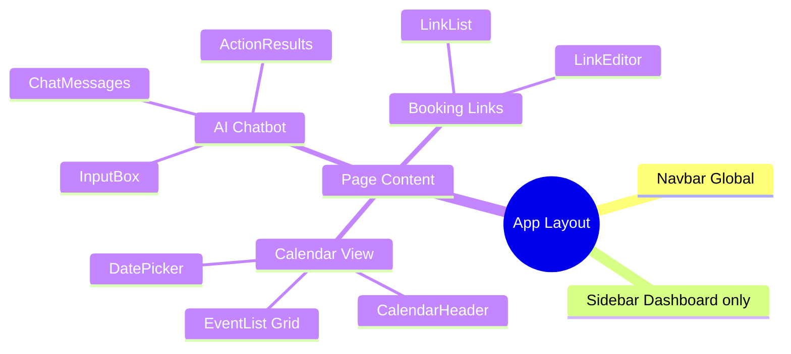

### **5.2. State Management Strategy**

**Server State (TanStack Query):**

- Events data
- Booking links
- User profile
- AI conversations

**Client State (Zustand):**

- Calendar view settings (month/week/day)
- UI preferences (theme, language)
- Active modals/dialogs
- Form states

**URL State (Next.js Router):**

- Current page/route
- Filter parameters
- Search queries
- Selected date range

### **5.3. Data Flow**

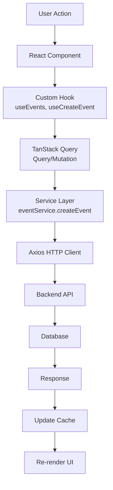

## **6\. Thiết kế UI/UX**

### **6.1. Design System**

#### **6.1.1. Color Palette**

**Primary Colors:**

- Primary Blue: `#4285f4` - CTA buttons, links, active states
- Secondary Purple: `#8e44ad` - AI features, gradients
- Success Green: `#10b981` - Success messages, confirmations
- Warning Yellow: `#f59e0b` - Warnings, notifications
- Error Red: `#ef4444` - Error messages, destructive actions

**Neutral Colors:**

- Gray 50-900: Background, borders, text hierarchy
- White: `#ffffff` - Cards, modals, primary backgrounds
- Black: `#000000` - Primary text

**Semantic Colors:**

- Info: `#3b82f6`
- Calendar Events: Dynamic color per calendar
- Priority Levels: Red (Critical) → Yellow (Low)

#### **6.1.2. Typography**

**Font Family:**

- Primary: `Inter` - Modern, clean sans-serif
- Monospace: `Fira Code` - Code snippets

**Font Sizes:**

- Heading 1: 2rem (32px)
- Heading 2: 1.5rem (24px)
- Heading 3: 1.25rem (20px)
- Body: 1rem (16px)
- Small: 0.875rem (14px)
- Tiny: 0.75rem (12px)

**Font Weights:**

- Regular: 400
- Medium: 500
- Semibold: 600
- Bold: 700

#### **6.1.3. Spacing System**

**Base Unit:** 4px (0.25rem)

**Scale:**

- xs: 4px
- sm: 8px
- md: 16px
- lg: 24px
- xl: 32px
- 2xl: 48px
- 3xl: 64px

#### **6.1.4. Border Radius**

- Small: 4px
- Medium: 8px
- Large: 12px
- XL: 16px
- Full: 9999px (circular)

### **6.2. Component Library**

#### **6.2.1. Atomic Components**

**Buttons:**

- Primary Button: Solid background, white text
- Secondary Button: Outlined, transparent background
- Ghost Button: No border, hover background
- Icon Button: Square/circular, icon only
- Link Button: Text style, underline on hover

**Variants:**

- Default, Primary, Secondary, Destructive, Ghost, Link
- Sizes: sm, md, lg

**Form Inputs:**

- Text Input: Border, focus ring
- Textarea: Resizable, auto-grow
- Select: Dropdown with search
- Checkbox: Custom styled
- Radio: Circular selection
- Switch: Toggle button
- Date Picker: Calendar popup
- Time Picker: Time selection

**Feedback Components:**

- Toast: Bottom-right notifications
- Alert: Inline messages (info/success/warning/error)
- Modal: Centered overlay
- Dialog: Confirmation dialogs
- Loading: Spinner, skeleton screens
- Progress: Linear, circular

#### **6.2.2. Composite Components**

**Calendar Components:**

- FullCalendar: Main calendar view
- EventCard: Event display card
- EventModal: Create/edit event form
- CalendarHeader: Navigation, view switcher
- DatePicker: Date selection
- TimeSlotPicker: Time selection

**AI Chatbot Components:**

- ChatBox: Main chat interface
- MessageBubble: User/AI messages
- ActionCard: Function call results
- TimeSlotsList: Available slots display
- InputBox: Message input with suggestions

**Dashboard Components:**

- Sidebar: Navigation menu
- Navbar: Top bar with user menu
- Card: Content container
- Table: Data table with sorting
- Tabs: Tab navigation
- Accordion: Collapsible sections

### **6.3. Layout & Navigation**

#### **6.3.1. Layout Structure**

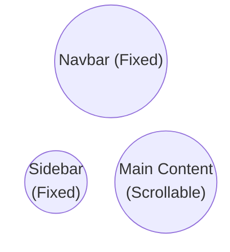

**Sidebar Navigation:**

- Calendar
- Tasks
- Priorities
- Scheduling Links
- Analytics
- Settings

**Navbar:**

- Search bar
- Notifications
- AI Chat toggle
- User menu

#### **6.3.2. Responsive Breakpoints**

- Mobile: < 640px
- Tablet: 640px - 1024px
- Desktop: > 1024px
- Wide: > 1440px

**Mobile Behavior:**

- Sidebar collapses to bottom navigation
- Calendar switches to compact view
- Tables become scrollable cards

### **6.4. Page Layouts**

#### **6.4.1. Calendar Page**

**Layout:**

- Header: Month/Year, view switcher, create button
- Left Sidebar: Mini calendar, calendars list
- Main Area: Full calendar view
- Right Panel: AI chatbot (toggle)

**Views:**

- Day View: Hourly timeline
- Week View: 7-day grid
- Month View: Monthly grid
- Year View: 12-month overview

#### **6.4.2. Event Detail Modal**

**Sections:**

- Header: Title, close button
- Time & Date: Start/end datetime picker
- Details: Description, location
- Attendees: Email list input
- Conference: Google Meet link
- Reminders: Notification settings
- Recurrence: RRULE builder
- Actions: Save, delete, cancel

#### **6.4.3. Booking Page (Public)**

**Layout:**

- Host Info: Avatar, name, title
- Calendar: Available slots selector
- Form: Guest information
- Confirmation: Success message

**Flow:**

1. Select date
2. Choose time slot
3. Fill guest info
4. Confirm booking
5. Receive email confirmation

### **6.5. Animations & Transitions**

#### **6.5.1. Micro-interactions**

**Hover Effects:**

- Button: Scale 1.02, shadow increase
- Card: Shadow elevation
- Link: Underline appear

**Active States:**

- Button: Scale 0.98
- Input: Border color change
- Checkbox: Fill animation

**Loading States:**

- Skeleton screens for content
- Spinner for async actions
- Progress bar for uploads

#### **6.5.2. Page Transitions**

- Fade in/out: 200ms
- Slide animations: 300ms
- Modal appear: Scale + fade, 200ms

**Ease Functions:**

- Default: `ease-in-out`
- Bounce: `cubic-bezier(0.68, -0.55, 0.265, 1.55)`

### **6.6. Accessibility (A11Y)**

#### **6.6.1. Keyboard Navigation**

**Shortcuts:**

- `N`: Create new event
- `T`: Go to today
- `←/→`: Navigate dates
- `/`: Focus search
- `?`: Show shortcuts help

**Focus Management:**

- Visible focus indicators
- Logical tab order
- Skip to main content link

#### **6.6.2. Screen Reader Support**

- Semantic HTML tags
- ARIA labels and roles
- Alt text for images
- Live regions for updates

#### **6.6.3. Color Contrast**

- WCAG AAA compliance
- Text: 7:1 contrast ratio
- Interactive elements: 4.5:1 minimum**6.8. UI Components - Implementation Status**

#### **6.8.1. Implemented Components**

**Layout:**

- Sidebar navigation
- Navbar with search
- Responsive container

**Calendar:**

- FullCalendar with views
- Event cards
- Event modal
- Date/time pickers

**AI Chatbot:**

- Chat interface
- Message bubbles
- Action results display
- Time slots list

**Forms:**

- Input fields
- Selects with search
- Checkboxes/radios
- Date/time pickers

**Feedback:**

- Toast notifications
- Loading states
- Error boundaries

#### **6.8.2. Planned Components**

**Advanced Calendar:**

- Drag & drop events
- Multi-day events
- Resource scheduling
- Print preview

**Team Features:**

- Shared calendars
- Team availability view
- Meeting polls
- Round-robin scheduling

**Analytics Dashboard:**

- Charts and graphs
- Time tracking
- Productivity metrics
- Export reports

# **Chương III. TRIỂN KHAI HỆ THỐNG**

Chương này mô tả chi tiết quá trình triển khai hệ thống Calento, từ việc cài đặt môi trường phát triển, cấu hình backend/frontend, đến implement các tính năng chính. Mỗi phần đều có hướng dẫn cụ thể, code examples và giải thích cách hoạt động.

## **1\. Chuẩn bị môi trường phát triển**

Trước khi bắt đầu code, cần setup môi trường với đầy đủ tools và configurations.

### **1.1. Yêu cầu hệ thống (Prerequisites)**

#### **1.1.1. Công cụ phải cài đặt**

Đây là danh sách tools bắt buộc để chạy được project:

| Tool       | Version yêu cầu | Mục đích | Cách cài đặt |
| ---------- | ------- | -------------------------------- | ------------ |
| **Node.js**    | >= 18.x | Runtime cho backend và frontend | [nodejs.org](https://nodejs.org) - Download LTS version |
| **npm**        | >= 9.x  | Package manager (đi kèm Node.js) | Auto install với Node.js |
| **PostgreSQL** | >= 14   | Primary database | [postgresql.org](https://postgresql.org) hoặc Docker |
| **Redis**      | >= 6    | Caching và queue system | [redis.io](https://redis.io) hoặc Docker |
| **Docker**     | >= 20.x | Containerization (optional nhưng recommended) | [docker.com](https://docker.com) |
| **Git**        | >= 2.x  | Version control | [git-scm.com](https://git-scm.com) |

**Kiểm tra versions:**
```bash
node --version    # v18.17.0
npm --version     # 9.8.1
psql --version    # 14.x
redis-cli --version  # 6.x
docker --version  # 20.x
git --version     # 2.x
```

**Tại sao cần các tools này?**
- **Node.js**: Chạy JavaScript code ở backend (NestJS) và build frontend (Next.js)
- **PostgreSQL**: Database chính lưu trữ users, events, bookings
- **Redis**: Cache data để app nhanh hơn, lưu background jobs
- **Docker**: Chạy PostgreSQL, Redis trong containers → Dễ setup, không conflict
- **Git**: Version control, collaborate với team

#### **1.1.2. IDE và Extensions (Khuyến nghị)**

**Visual Studio Code** là IDE recommended cho project này.

**Extensions cần thiết:**

| Extension | Mục đích | Tại sao cần |
|-----------|----------|-------------|
| **ESLint** | Phát hiện lỗi code, enforce code style | Catch bugs sớm, consistent code style |
| **Prettier** | Auto format code | Code đẹp, đồng nhất trong team |
| **TypeScript** | TypeScript language support | IntelliSense, type checking |
| **Tailwind CSS IntelliSense** | Autocomplete Tailwind classes | Code CSS nhanh hơn, ít typos |
| **Thunder Client** | Test API ngay trong VS Code | Không cần mở Postman riêng |
| **GitLens** | Git history, blame annotations | Xem ai sửa code gì, khi nào |
| **Error Lens** | Hiện errors inline | Không cần hover để xem lỗi |

**Cài extensions:**
```
Ctrl+Shift+X (Windows) hoặc Cmd+Shift+X (Mac)
→ Search extension name → Click Install
```

### **1.2. Cấu hình Backend**

**Backend Setup (4 bước):**

1. **Clone Repository:**

   - Clone từ GitHub: `https://github.com/TDevUIT/Calento.git`
   - Navigate: `cd Calento/server`
   - Install: `npm install`
2. **Environment Variables (.env):**

   Copy file `.env.example` → `.env` và cấu hình:

   | Category               | Variables                                                                          | Values                                                                 |
   | ---------------------- | ---------------------------------------------------------------------------------- | ---------------------------------------------------------------------- |
   | **Application**  | `NODE_ENV`, `PORT`, `APP_URL`                                                | `development`, `8000`, API URL                                     |
   | **Database**     | `DB_HOST`, `DB_PORT`, `DB_NAME``DB_USER`, `DB_PASSWORD`                    | PostgreSQL connection `localhost:5432`, `tempra`                   |
   | **Redis**        | `REDIS_HOST`, `REDIS_PORT`                                                     | Cache configuration `localhost:6379`                                 |
   | **JWT**          | `JWT_SECRET`, `JWT_REFRESH_SECRET``JWT_EXPIRES_IN`, `JWT_REFRESH_EXPIRES_IN` | Token authentication ``Generate: `openssl rand -hex 32``1h `, `7d`   |
   | **Google OAuth** | `GOOGLE_CLIENT_ID``GOOGLE_CLIENT_SECRET``GOOGLE_REDIRECT_URI`                    | OAuth & Calendar API``Get from: console.cloud.google.com               |
   | **Gemini AI**    | `GEMINI_API_KEY`                                                                 | AI chatbot integration``Get from: ai.google.dev                        |
   | **Email**        | `EMAIL_PROVIDER`, `SMTP_HOST``SMTP_USER`, `SMTP_PASSWORD`                    | Email notifications `smtp`, `smtp.gmail.com:587`Gmail App Password |
   | **CORS**         | `CORS_ORIGIN`, `FRONTEND_URL`                                                  | `http://localhost:3000`                                              |
   | **Security**     | `BCRYPT_ROUNDS`, `MAX_LOGIN_ATTEMPTS``SESSION_SECRET`                          | `12`, `5`Generate secure secret                                    |
   | **BullMQ**       | `QUEUE_CONCURRENCY``*_WORKER_CONCURRENCY`                                        | Background jobs `10`, `5` per worker                               |
   | **Monitoring**   | `LOG_LEVEL`, `HEALTH_CHECK_*`                                                  | `info`, `true`                                                     |

   **Generate secure secrets:**


   ```bash
   openssl rand -hex 32
   ```
3. **Database Setup:**

   - Tạo database: `createdb tempra_dev`
   - Chạy migrations: `npm run migration:run`
   - Seed data: `npm run seed` (optional)
4. **Start Server:**

   - Development mode: `npm run start:dev`
   - Server: `http://localhost:8000`
   - API docs (Swagger): `http://localhost:8000/api-docs`

### **1.3. Cấu hình Frontend**

**Frontend Setup (3 bước):**

1. **Install Dependencies:**

   - Navigate: `cd ../client`
   - Install: `npm install`
2. **Environment Variables (.env.local):**

   Copy file `.env.example` → `.env.local` và cấu hình:

   | Variable                         | Description            | Value                     |
   | -------------------------------- | ---------------------- | ------------------------- |
   | `NEXT_PUBLIC_APP_NAME`         | Application name       | `Calento`               |
   | `NEXT_PUBLIC_APP_FE_URL`       | Frontend URL           | `http://localhost:3000` |
   | `NEXT_PUBLIC_API_URL`          | Backend API URL        | `http://localhost:8000` |
   | `NEXT_PUBLIC_API_PREFIX`       | API route prefix       | `api/v1`                |
   | `NEXT_PUBLIC_GOOGLE_CLIENT_ID` | Google OAuth Client ID | Same as backend           |

   **Optional configurations:**


   - `NEXT_PUBLIC_ENABLE_AI_CHAT`: Enable/disable AI features (`true`)
   - `NEXT_PUBLIC_ENABLE_BOOKING_LINKS`: Enable booking system (`true`)
   - `NEXT_PUBLIC_GA_MEASUREMENT_ID`: Google Analytics (optional)
   - `NEXT_PUBLIC_SENTRY_DSN`: Error tracking (optional)
3. **Start Development:**

   - Command: `npm run dev`
   - Frontend: `http://localhost:3000`

## **2\. Triển khai tính năng chính**

### **2.1. Authentication System**

**Tổng quan:**

Hệ thống authentication được xây dựng dựa trên kiến trúc modular của NestJS, sử dụng JWT (JSON Web Tokens) cho stateless authentication và OAuth 2.0 cho social login. Hệ thống hỗ trợ cả cookie-based và header-based authentication để tương thích với nhiều client khác nhau.

**Kiến trúc Components:**

1. **Auth Module**: Module chính quản lý authentication

   - AuthController: Xử lý HTTP requests (register, login, logout, refresh)
   - AuthService: Business logic cho authentication
   - AuthRepository: Data access layer với raw SQL queries
   - PasswordService: Hash và verify passwords với bcrypt (10 salt rounds)
   - CookieAuthService: Quản lý authentication cookies
2. **JWT Strategy**: Passport strategy cho JWT validation

   - Dual extraction: Từ Authorization header hoặc HTTP-only cookies
   - User validation: Verify user exists và active
   - Token type checking: Đảm bảo chỉ accept access tokens
3. **Guards & Interceptors**:

   - JwtAuthGuard: Protect routes yêu cầu authentication
   - Public decorator: Cho phép bypass authentication cho public routes
   - Role guards: Authorization based on user roles (future)

**Quy trình Đăng ký:**

1. User submit form với email, username, password
2. Backend validate input data (email format, password strength)
3. Check email/username uniqueness trong database
4. Hash password với bcrypt và salt rounds = 10
5. Create user record trong `users` table
6. Generate access token (expires 1h) và refresh token (expires 7d)
7. Set HTTP-only cookies với secure flags
8. Return user info và tokens cho client
9. Redirect user đến dashboard

**Quy trình Đăng nhập:**

1. User submit credentials (email + password)
2. Backend query user từ database by email
3. Compare password hash với bcrypt.compare()
4. Update `last_login_at` timestamp
5. Generate fresh JWT tokens
6. Set authentication cookies
7. Return user profile và tokens
8. Client store tokens và redirect

**Google OAuth 2.0 Integration:**

1. **Authorization Flow**:

   - Client request OAuth URL từ backend
   - Backend generate authorization URL với scopes (email, profile, calendar)
   - User redirect đến Google consent screen
   - User authorize và Google redirect về callback URL
   - Backend exchange authorization code for access + refresh tokens
2. **Token Management**:

   - Store Google tokens trong `user_credentials` table
   - Encrypt sensitive tokens với AES-256
   - Auto-refresh tokens khi expired
   - Handle token revocation gracefully
3. **User Account Linking**:

   - Find existing user by Google email
   - Create new user nếu chưa tồn tại
   - Link Google account với user record
   - Generate internal JWT tokens cho session

**Security Features:**

1. **Password Security**:

   - Minimum 8 characters requirement
   - Bcrypt hashing với salt rounds = 10
   - Password strength validation
   - No password storage in plain text
2. **Token Security**:

   - Short-lived access tokens (1 hour)
   - Long-lived refresh tokens (7 days)
   - Secure, HTTP-only, SameSite cookies
   - Token rotation on refresh
3. **Session Management**:

   - Redis-based session store
   - Session invalidation on logout
   - Concurrent session tracking
   - Automatic session cleanup

**Frontend Integration:**

1. **Auth Context Provider**:

   - Global authentication state management với React Context
   - Automatic token refresh khi approaching expiration
   - Redirect to login khi unauthenticated
   - Persist auth state trong localStorage
2. **API Client Configuration**:

   - Axios interceptors cho automatic token injection
   - Request interceptor: Add Bearer token to headers
   - Response interceptor: Handle 401 errors và retry
   - Cookie-based auth với `credentials: 'include'`
3. **Protected Routes**:

   - Route guards check authentication status
   - Redirect unauthenticated users to /login
   - Preserve intended destination for post-login redirect
   - Role-based route access control

**Kết quả triển khai:**

- Đăng ký và đăng nhập với email/password
- Google OAuth 2.0 authentication
- JWT token-based sessions
- Automatic token refresh
- Cookie-based authentication
- Protected route access control
- Password reset functionality
- Session management với Redis

### **2.2. Event Management System**

**Tổng quan:**

Event Management là core feature của ứng dụng, cho phép users tạo, chỉnh sửa, xóa và quản lý calendar events. Hệ thống hỗ trợ đầy đủ các loại events từ simple one-time events đến phức tạp recurring events với RRULE standard.

**Kiến trúc Database:**

1. **Events Table Structure**:

   - Primary fields: id (UUID), title, description, location
   - Time fields: start_time, end_time, timezone, is_all_day
   - Recurrence: recurrence_rule (RRULE format), recurrence_exception_dates
   - Attendees: Stored as JSONB array với email, name, response_status
   - Conference data: Google Meet links, Zoom info (JSONB)
   - Metadata: status, visibility, created_at, updated_at
2. **Indexing Strategy**:

   - Composite index trên (user_id, start_time, end_time) cho date range queries
   - Index trên google_event_id cho sync operations
   - GIN index trên title/description cho full-text search
   - Partial index trên recurrence_rule cho recurring events

**Event CRUD Operations:**

1. **Create Event**:

   - Validate input data (title required, end_time > start_time)
   - Get user's primary calendar hoặc create nếu chưa có
   - Validate time conflicts với existing events
   - Insert event record vào database với raw SQL
   - Trigger background job để sync with Google Calendar (nếu connected)
   - Return complete event object với creator info
2. **Update Event**:

   - Support partial updates (PATCH) và full replacement (PUT)
   - Validate changes không conflict với other events
   - Handle recurring event updates (single instance vs all instances)
   - Update google_event_id nếu synced with Google
   - Invalidate cache và notify affected users
3. **Delete Event**:

   - Soft delete với deleted_at timestamp
   - Handle recurring event deletion options
   - Cascade delete related data (reminders, attachments)
   - Sync deletion với Google Calendar
   - Cleanup orphaned references
4. **Read Operations**:

   - Paginated list với filters (date range, calendar, status)
   - Full-text search across title và description
   - Expand recurring events for date ranges
   - Include creator và attendee information
   - Support different view modes (day/week/month)

**Recurring Events Implementation:**

1. **RRULE Standard Support**:

   - Frequency types: DAILY, WEEKLY, MONTHLY, YEARLY
   - Advanced rules: BYDAY, BYMONTH, BYSETPOS
   - Count-based (RCOUNT) và date-based (UNTIL) endings
   - Interval support (every 2 weeks, every 3 months)
2. **Expansion Algorithm**:

   - Parse RRULE string using rrule.js library
   - Generate occurrences for requested date range
   - Apply exception dates (cancelled instances)
   - Merge modified instances (rescheduled occurrences)
   - Limit expansion để avoid performance issues (max 1000 instances)
3. **Exception Handling**:

   - Store exception dates trong JSONB array
   - Support single instance modifications
   - Maintain relationship với parent recurring event
   - Handle delete single vs delete series

**Frontend Calendar Views:**

1. **Custom Calendar Component**:

   - Built from scratch without external calendar libraries
   - Responsive design với mobile-first approach
   - Smooth animations và transitions
   - Keyboard navigation support
   - Touch gestures cho mobile
2. **View Modes**:

   - **Day View**: Hourly timeline với all-day events section
   - **Week View**: 7-day grid với hourly rows
   - **Month View**: Traditional calendar grid với overflow handling
   - **Year View**: 12-month overview với event counts
3. **Interactive Features**:

   - Click to create event at specific time
   - Drag to select time range
   - Hover to preview event details
   - Double-click to edit event
   - Context menu cho quick actions
4. **Event Modal**:

   - Tabbed interface: Details, Attendees, Recurrence, Advanced
   - DateTime pickers với timezone support
   - Attendee management với email suggestions
   - Recurrence builder với visual preview
   - Conference link integration (Google Meet)
   - Reminder configuration

**State Management:**

1. **TanStack Query Integration**:

   - Query keys organized by feature (events, calendars)
   - Automatic caching với stale time configuration
   - Optimistic updates cho instant UI feedback
   - Background refetching khi data stale
   - Pagination và infinite scroll support
2. **Cache Invalidation Strategy**:

   - Invalidate event lists after create/update/delete
   - Invalidate specific event detail cache
   - Invalidate related queries (calendar events, search results)
   - Selective refetching based on affected date ranges

**Performance Optimizations:**

1. **Database Level**:

   - Efficient indexes cho common query patterns
   - Limit result sets với pagination
   - Use JSONB for flexible schema (attendees, reminders)
   - Batch operations cho recurring event expansion
2. **API Level**:

   - Lazy loading cho event details
   - Partial response fields selection
   - Compressed responses với gzip
   - ETags cho conditional requests
3. **Frontend Level**:

   - Virtual scrolling cho large event lists
   - Memoization cho expensive computations
   - Debounced search inputs
   - Lazy component loading

**Kết quả triển khai:**

- Complete CRUD operations với validation
- Recurring events với RRULE support
- 4 calendar view modes (Day/Week/Month/Year)
- Full-text search across events
- Timezone support cho global users
- Attendee management với email notifications
- Conference link integration
- Reminder notifications
- Drag & drop time selection
- Mobile-responsive calendar interface

### **2.3. Google Calendar Integration**

**Tổng quan:**

Google Calendar integration cho phép users sync hai chiều giữa Calento và Google Calendar. Hệ thống sử dụng OAuth 2.0 cho authentication, Google Calendar API cho data access, và push notifications (webhooks) cho real-time updates.

**OAuth 2.0 Authentication Flow:**

1. **Initial Setup**:

   - Create project trong Google Cloud Console
   - Enable Google Calendar API trong project
   - Configure OAuth consent screen với scopes cần thiết
   - Create OAuth 2.0 credentials (Client ID & Secret)
   - Add authorized redirect URIs cho development và production
2. **Authorization Process**:

   - User click "Connect Google Calendar" button
   - Backend generate authorization URL với required scopes:
     - `calendar.readonly`: Read calendar events
     - `calendar.events`: Manage calendar events
     - `userinfo.email`: Get user email
     - `userinfo.profile`: Get user profile
   - User redirect đến Google consent screen
   - User grant permissions và Google redirect về callback URL
   - Backend exchange authorization code for access & refresh tokens
3. **Token Management**:

   - Store encrypted tokens trong `user_credentials` table
   - Access token có expiration time (~1 hour)
   - Refresh token không expire (unless revoked)
   - Automatic token refresh khi access token expired
   - Handle token revocation và re-authentication flow

**Bidirectional Sync Strategy:**

1. **Pull from Google (Import)**:

   - Fetch events từ Google Calendar API
   - Compare with local events using google_event_id
   - Create new events nếu không tồn tại locally
   - Update existing events nếu có changes
   - Handle deleted events (marked as cancelled)
   - Respect sync time range (default: past 30 days, future 365 days)
2. **Push to Google (Export)**:

   - Detect local events chưa có google_event_id
   - Create corresponding events trong Google Calendar
   - Store google_event_id cho future sync
   - Update Google Calendar khi local events change
   - Delete from Google khi local events deleted
3. **Conflict Resolution**:

   - Last-modified timestamp comparison
   - User preference for conflict resolution (Google wins, Local wins, Manual)
   - Show conflict notification cho manual resolution
   - Keep audit log của sync operations

**Real-time Updates với Webhooks:**

1. **Webhook Setup**:

   - Call Google Calendar API `watch()` method
   - Receive channel_id và resource_id từ Google
   - Store channel info trong `webhook_channels` table
   - Webhook expiration: Maximum 7 days
   - Auto-renewal trước khi expired
2. **Notification Handling**:

   - Receive POST requests từ Google tại webhook endpoint
   - Validate notification headers (channel_id, resource_id)
   - Extract change type (created, updated, deleted)
   - Trigger incremental sync cho affected calendar
   - Update last_sync timestamp
3. **Channel Management**:

   - Monitor channel expiration dates
   - Background job renew channels trước 24 hours expiration
   - Handle webhook failures với retry logic
   - Cleanup expired/invalid channels
   - Re-establish channels after system restart

**Sync Optimization:**

1. **Incremental Sync**:

   - Only sync events trong specific date range
   - Use syncToken từ Google API cho efficient updates
   - Track last sync timestamp per calendar
   - Skip unchanged events based on updated timestamp
2. **Background Processing**:

   - Queue sync jobs using BullMQ
   - Process sync operations asynchronously
   - Avoid blocking user interface
   - Retry failed syncs với exponential backoff
3. **Batch Operations**:

   - Batch insert/update multiple events
   - Reduce database round trips
   - Use PostgreSQL transactions cho consistency
   - Rollback on errors để maintain data integrity

**Frontend Integration:**

1. **Connection UI**:

   - "Connect Google Calendar" button trong settings
   - OAuth popup window cho authorization
   - Connection status indicator (connected/disconnected)
   - Last sync timestamp display
   - Manual sync trigger button
2. **Sync Status Display**:

   - Real-time sync progress indicator
   - Number of events synced (imported/exported)
   - Error notifications nếu sync fails
   - Sync history log
   - Disconnect option với confirmation
3. **Calendar Selection**:

   - List all Google calendars after connection
   - Allow user select calendars to sync
   - Different sync directions per calendar (import only, export only, bidirectional)
   - Color mapping từ Google calendars

**Error Handling:**

1. **API Errors**:

   - Rate limit exceeded: Queue và retry later
   - Invalid credentials: Trigger re-authentication
   - Network errors: Retry với exponential backoff
   - Permission errors: Notify user to re-grant permissions
2. **Data Errors**:

   - Invalid event data: Skip và log error
   - Duplicate events: Detect và merge
   - Orphaned references: Cleanup during sync
   - Timezone mismatches: Convert properly

**Kết quả triển khai:**

- Complete OAuth 2.0 authorization flow
- Bidirectional event synchronization
- Real-time updates via webhooks
- Automatic token refresh
- Multi-calendar support
- Conflict resolution strategies
- Background sync processing
- Sync history và audit log
- Connection management UI
- Error handling và recovery

### **2.4. AI Chatbot Integration**

**Tổng quan:**

AI Chatbot được xây dựng với Google Gemini 1.5 Flash, sử dụng function calling pattern để thực hiện calendar operations thông qua natural language. Hệ thống hiểu ngữ cảnh, nhớ lịch sử conversation, và thực thi actions trực tiếp trong backend.

**Gemini AI Architecture:**

1. **Model Configuration**:

   - Model: gemini-1.5-flash cho speed và cost efficiency
   - Temperature: 0.7 cho balance giữa creativity và accuracy
   - Max output tokens: 8192 cho detailed responses
   - Safety settings: Block harmful content
   - System instruction: Detailed prompt với role definition
2. **Function Calling Mechanism**:

   - Define available functions với JSON schema
   - Functions include: createEvent, searchEvents, checkAvailability, deleteEvent, updateEvent, createTask
   - Each function có clear description và parameter specifications
   - Gemini decides khi nào call functions based on user intent
   - Backend executes functions và returns results
3. **Context Management System**:

   - **User Context**: Profile info, timezone, preferences
   - **Calendar Context**: Upcoming events, current date/time
   - **Conversation Context**: Message history, recent actions
   - **Temporal Context**: Auto-inject current date to avoid "what day is today?" questions
   - Context refreshed mỗi turn để ensure accuracy

**Available Functions:**

1. **Event Management Functions**:

   - `createEvent`: Create new calendar event với validation
   - `updateEvent`: Modify existing event properties
   - `deleteEvent`: Remove event from calendar
   - `searchEvents`: Find events by criteria (date, keyword, attendee)
   - `getEventDetail`: Retrieve specific event information
2. **Availability Functions**:

   - `checkAvailability`: Find free time slots trong date range
   - `findMeetingSlot`: Suggest best meeting times based on calendars
   - `checkConflicts`: Detect scheduling conflicts
3. **Task Management Functions**:

   - `createTask`: Add tasks với due dates và priorities
   - `listTasks`: Retrieve tasks by status/date
   - `completeTask`: Mark tasks as done

**Conversation Flow:**

1. **User Input Processing**:

   - User types natural language message
   - Frontend sends message qua WebSocket hoặc HTTP
   - Backend adds message vào conversation history
   - Extract user intent và entities
2. **AI Processing**:

   - Send message + context + function definitions đến Gemini
   - Gemini analyzes intent và decides action
   - Return response (text hoặc function call)
   - Handle multi-step reasoning nếu cần
3. **Function Execution**:

   - Parse function call với parameters
   - Validate parameters (dates, emails, etc.)
   - Execute function trong appropriate service
   - Capture result hoặc error
   - Track action trong `ai_actions` table
4. **Response Generation**:

   - Send function result back to Gemini
   - Gemini generates human-friendly response
   - Include action summary và confirmation
   - Frontend displays result với rich formatting

**Context-Aware Features:**

1. **Date/Time Intelligence**:

   - Auto-understand relative dates ("tomorrow", "next week", "in 2 hours")
   - Convert user input to ISO 8601 format
   - Handle timezone conversions
   - Respect user's timezone preference
2. **Entity Recognition**:

   - Extract event titles từ natural language
   - Identify attendee emails
   - Parse duration expressions ("1 hour", "30 minutes")
   - Detect locations và meeting types
3. **Conversation Memory**:

   - Remember previous messages trong session
   - Reference earlier topics ("add John to that meeting")
   - Track action history ("show me the event I created earlier")
   - Maintain context across multiple turns

**Frontend Chat Interface:**

1. **Message Rendering**:

   - User messages: Right-aligned, blue background
   - AI messages: Left-aligned, gray background với Sparkles icon
   - Action results: Expandable cards với details
   - Typing indicator khi AI processing
2. **Rich Action Display**:

   - Event cards với title, time, attendees
   - Available time slots với "Book" buttons
   - Task list với checkboxes
   - Error messages với actionable suggestions
3. **Interactive Elements**:

   - Quick reply suggestions
   - Action buttons trên action cards
   - Copy to clipboard cho event details
   - Re-execute failed actions
4. **Conversation Management**:

   - New conversation button
   - Conversation list với titles
   - Delete conversation option
   - Export conversation history

**Error Handling:**

1. **Function Execution Errors**:

   - Validation errors: Return user-friendly message
   - Permission errors: Explain required permissions
   - Network errors: Retry với exponential backoff
   - Timeout errors: Fallback to manual input
2. **AI Response Errors**:

   - Invalid function calls: Ask for clarification
   - Missing parameters: Prompt user for missing info
   - Ambiguous intent: Provide options to choose
   - Safety blocks: Show appropriate message
3. **Recovery Strategies**:

   - Retry failed function calls
   - Ask user to rephrase unclear requests
   - Provide manual alternatives
   - Maintain conversation continuity

**Performance Optimizations:**

1. **Response Time**:

   - Parallel function execution khi possible
   - Cache frequent queries
   - Streaming responses cho long text
   - Lazy load conversation history
2. **Cost Optimization**:

   - Use gemini-flash instead of gemini-pro
   - Limit context window size
   - Batch similar requests
   - Cache model responses

**Kết quả triển khai:**

- Natural language understanding cho calendar operations
- 8+ function calling capabilities
- Context-aware conversations
- Multi-turn dialogue support
- Real-time message streaming
- Rich action result display
- Conversation history persistence
- Error recovery mechanisms
- Timezone và date intelligence
- Mobile-responsive chat interface

### **2.5. Booking Links System**

**Tổng quan:**

Booking Links system cho phép users tạo public scheduling links (tương tự Calendly) để guests có thể book meetings mà không cần authentication. Hệ thống tự động calculate available slots, handle bookings, và sync với calendar.

**Database Architecture:**

1. **Booking Links Table**:

   - Basic info: id, user_id, title, slug (URL-friendly)
   - Duration: duration_minutes, buffer_before, buffer_after
   - Availability: availability_type, availability_hours (JSONB)
   - Location: location_type (google_meet, zoom, phone, in_person)
   - Limits: max_bookings_per_day, notice_period_hours
   - Metadata: is_active, bookings_count, created_at
2. **Bookings Table**:

   - Guest info: guest_name, guest_email, guest_phone, guest_notes
   - Time slot: slot_start, slot_end, timezone
   - Status tracking: status (confirmed, cancelled, rescheduled)
   - References: booking_link_id, event_id
   - Metadata: cancellation_reason, reminder_sent

**Booking Link Creation:**

1. **Configuration Options**:

   - **Duration Settings**: Meeting length (15/30/45/60 minutes)
   - **Availability Type**:
     - Specific hours (custom schedule per weekday)
     - Calendar sync (based on existing calendar events)
   - **Availability Hours** (JSONB format):
     - Per weekday: start_time, end_time, breaks
     - Support multiple time ranges per day
     - Holiday/blackout dates
   - **Buffer Time**: Minutes before/after meetings
   - **Notice Period**: Minimum advance booking time
2. **URL Generation**:

   - Slug format: `{username}/{link-slug}`
   - Unique slug per user (validate uniqueness)
   - Public URL: `calento.space/book/{username}/{slug}`
   - Shareable via link hoặc QR code
3. **Advanced Settings**:

   - Maximum bookings per day limit
   - Question forms cho guests
   - Confirmation page customization
   - Notification preferences

**Availability Calculation Algorithm:**

1. **Generate Possible Slots**:

   - Parse availability_hours từ JSONB
   - Generate time slots cho selected date
   - Apply duration_minutes cho each slot
   - Respect buffer times between slots
2. **Filter Unavailable Slots**:

   - Check existing bookings cho link
   - Check user's calendar events (conflicts)
   - Apply notice period restriction
   - Apply max bookings per day limit
   - Remove past time slots
3. **Sort & Prioritize**:

   - Sort slots chronologically
   - Highlight optimal times (morning hours)
   - Group by date ranges
   - Show "BEST" badge cho recommended slots

**Guest Booking Flow:**

1. **Public Booking Page**:

   - No login required, accessible via public URL
   - Display host information (name, avatar, title)
   - Show available dates trong calendar picker
   - List available time slots cho selected date
   - Guest form: name, email, phone, notes
2. **Slot Selection**:

   - Click date to view available times
   - Click time slot to select
   - Show timezone selector cho guests
   - Display booking summary before confirm
   - Optional: Additional questions/fields
3. **Booking Confirmation**:

   - Validate guest information
   - Create booking record trong database
   - Create calendar event cho host
   - Send confirmation emails (host + guest)
   - Generate ICS file attachment
   - Display success page với details
4. **Post-Booking Actions**:

   - Update bookings_count trên link
   - Queue reminder emails
   - Sync event to Google Calendar
   - Track booking analytics

**Email Notifications:**

1. **Guest Confirmation Email**:

   - Meeting details (date, time, duration)
   - Host information và location
   - Add to calendar (ICS attachment)
   - Reschedule và cancel links
   - Preparation instructions
2. **Host Notification Email**:

   - New booking alert
   - Guest information
   - Meeting details
   - Quick actions (approve, reschedule, cancel)
3. **Reminder Emails**:

   - 24 hours before meeting
   - 1 hour before meeting
   - Include join links cho virtual meetings
   - Option to reschedule/cancel

**Booking Management:**

1. **Reschedule Request**:

   - Guest clicks reschedule link trong email
   - View available alternative slots
   - Select new time
   - Update booking record
   - Send update notifications
2. **Cancellation**:

   - Guest cancels via email link
   - Optional cancellation reason
   - Update booking status
   - Notify host
   - Free up time slot
3. **Admin Controls** (Host):

   - View all bookings cho link
   - Filter by status/date
   - Manually reschedule bookings
   - Cancel bookings với notification
   - Export bookings to CSV

**Frontend Public Booking Page:**

1. **Host Profile Section**:

   - Display host avatar, name
   - Show link title và description
   - Meeting duration indicator
   - Location information
2. **Calendar Selector**:

   - Mini calendar với available dates highlighted
   - Disable dates không có slots
   - Navigate months easily
   - Show current date indicator
3. **Time Slots List**:

   - Grouped by date
   - Timezone conversion display
   - "BEST" suggestions cho optimal times
   - Loading states khi fetching slots
4. **Booking Form**:

   - Minimal fields (name, email)
   - Optional fields based on configuration
   - Form validation
   - Submit button với loading state

**Integration Features:**

1. **Google Meet Integration**:

   - Auto-generate Meet links
   - Attach to calendar events
   - Include trong confirmation emails
2. **Calendar Sync**:

   - Create calendar events automatically
   - Sync to Google Calendar nếu connected
   - Block time trên calendar
   - Show busy status
3. **Analytics Tracking**:

   - Track booking conversion rates
   - Popular booking times
   - Link performance metrics
   - Guest demographics

**Kết quả triển khai:**

- Public booking links với custom slugs
- Flexible availability configuration
- Intelligent slot calculation algorithm
- Real-time availability checking
- Guest booking flow without authentication
- Email notifications (confirmation, reminders)
- ICS file generation
- Reschedule và cancellation support
- Google Meet integration
- Calendar sync
- Booking analytics
- Mobile-responsive booking page

## **3\. Deployment**

### **3.1. Production Infrastructure**

**Tổng quan kiến trúc Production:**

Calento được triển khai trên infrastructure hiện đại với các thành phần chính:

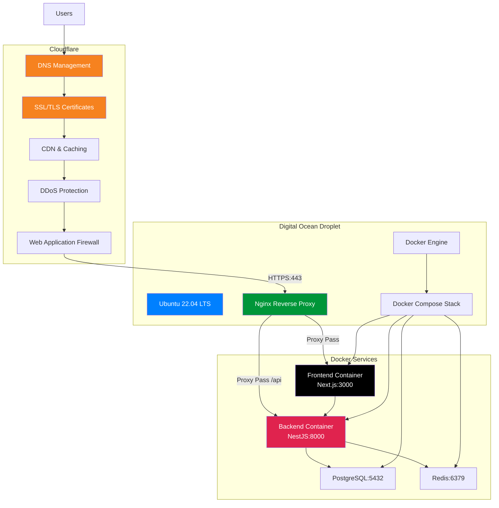

**Domain Configuration:**

- **Primary Domain:** `calento.space`
- **API Subdomain:** `api.calento.space`
- **Assets CDN:** `cdn.calento.space` (optional)

### **3.2. Digital Ocean Droplet Setup**

**Droplet Specifications:**

| Component          | Specification          |
| ------------------ | ---------------------- |
| **Provider** | Digital Ocean          |
| **Plan**     | Basic Droplet          |
| **CPU**      | 2 vCPUs (Intel)        |
| **RAM**      | 4 GB                   |
| **Storage**  | 80 GB SSD              |
| **Transfer** | 4 TB                   |
| **OS**       | Ubuntu 22.04 LTS (x64) |
| **Location** | Singapore (SGP1)       |
| **Price**    | $24/month              |

**Initial Server Setup:**

**Các bước cài đặt:**

1. **Connect & Create User:**

   - SSH vào Droplet với root account
   - Tạo non-root user `calento`
   - Add user vào sudo group
2. **Install Dependencies:**

   - Update system: `apt update && apt upgrade`
   - Docker Engine: Via official script `get.docker.com`
   - Docker Compose Plugin: `apt install docker-compose-plugin`
   - Nginx Web Server: `apt install nginx`
   - Git: `apt install git`
3. **Configure Firewall (UFW):**

   - Allow OpenSSH (port 22)
   - Allow Nginx Full (ports 80, 443)
   - Enable firewall và check status

### **3.3. Nginx Reverse Proxy Configuration**

**Nginx làm reverse proxy** để route traffic đến các Docker containers.

**Configuration File:** `/etc/nginx/sites-available/calento.space`

**Cấu hình chính:**

1. **Frontend Server Block** (`calento.space`):

   - Listen ports: 80 (HTTP), 443 (HTTPS với SSL)
   - Redirect HTTP → HTTPS
   - SSL certificates từ Cloudflare Origin
   - Security headers: X-Frame-Options, HSTS, X-XSS-Protection
   - Proxy pass tới `localhost:3000` (Next.js)
   - Static files caching với 1 year expiration
2. **Backend API Server Block** (`api.calento.space`):

   - Listen ports: 80, 443 với SSL
   - Rate limiting: 10 requests/second, burst 20
   - Proxy pass tới `localhost:8000` (NestJS)
   - CORS headers cho cross-origin requests
   - Health check endpoint `/health`
3. **Proxy Headers:**

   - Upgrade, Connection, Host, X-Real-IP
   - X-Forwarded-For, X-Forwarded-Proto
   - Support WebSocket upgrades

**Activation Commands:**

- Create symlink: `/etc/nginx/sites-available/` → `/sites-enabled/`
- Test config: `nginx -t`
- Reload: `systemctl reload nginx`
- Enable auto-start: `systemctl enable nginx`

### **3.4. Cloudflare Configuration**

**DNS Setup:**

Cloudflare quản lý DNS records cho domain `calento.space`:

| Type  | Name | Content          | Proxy Status           | TTL  |
| ----- | ---- | ---------------- | ---------------------- | ---- |
| A     | @    | `<droplet_ip>` | Proxied (orange cloud) | Auto |
| A     | www  | `<droplet_ip>` | Proxied (orange cloud) | Auto |
| A     | api  | `<droplet_ip>` | Proxied (orange cloud) | Auto |
| CNAME | cdn  | calento.space    | Proxied                | Auto |

**SSL/TLS Configuration:**

1. **SSL Mode:** Full (strict)

   - Encrypts traffic giữa Cloudflare và origin server
   - Requires valid SSL certificate trên origin server
2. **Edge Certificates:**

   - Universal SSL certificate tự động provision
   - Hỗ trợ HTTPS cho `calento.space` và `*.calento.space`
   - Auto-renewal enabled
3. **Origin Certificates:**

   - Generate Cloudflare Origin Certificate
   - Install trên Nginx (`/etc/nginx/ssl/`)
   - 15-year validity

**Security Features Enabled:**

1. **DDoS Protection:** Always On (Layer 3/4/7)
2. **Web Application Firewall (WAF):**

   - OWASP Core Ruleset
   - Block common attacks (SQL injection, XSS)
   - Rate limiting rules
3. **Bot Management:**

   - Challenge suspicious bots
   - Allow verified bots (Google, Bing)
4. **Page Rules:**

   - Cache everything for static assets
   - Bypass cache for API routes
   - Custom TTL settings

**Performance Optimization:**

1. **Caching:**

   - Browser Cache TTL: 4 hours
   - Edge Cache TTL: Custom rules
   - Cache Level: Standard
2. **Speed:**

   - Auto Minify: HTML, CSS, JS
   - Brotli compression enabled
   - HTTP/3 (QUIC) enabled
   - Early Hints enabled
3. **Argo Smart Routing:** (Optional upgrade)

   - Intelligent traffic routing
   - Reduce latency up to 30%

**Cloudflare Analytics:**

- Real-time traffic monitoring
- Security events tracking
- Performance metrics
- Bot traffic analysis

### **3.5. Docker Configuration**

**Docker Configuration:**

**Dockerfile Structure:**

1. **Backend (NestJS):**

   - Base image: `node:18-alpine`
   - Install production dependencies
   - Build TypeScript → JavaScript
   - Expose port 8000
   - Start command: `npm run start:prod`
2. **Frontend (Next.js):**

   - Base image: `node:18-alpine`
   - Install dependencies và build
   - Expose port 3000
   - Start Next.js production server

**Docker Compose Services:**

- **PostgreSQL:** Database container (port 5432)
- **Redis:** Cache container (port 6379)
- **Backend:** NestJS API (port 8000)
- **Frontend:** Next.js app (port 3000)
- **Volumes:** Persistent data cho PostgreSQL

**Service Dependencies:**

- Backend depends on: PostgreSQL, Redis
- Frontend connects to: Backend API

### **3.6. Production Deployment Workflow**

**Complete Deployment Process trên Digital Ocean:**

**Bước 1: Clone Repository trên Server**

```bash
# SSH vào Droplet
ssh calento@<droplet_ip>

# Clone project
cd ~
git clone https://github.com/TDevUIT/Calento.git
cd Calento
```

**Bước 2: Configure Environment Variables**

```bash
# Backend .env
cd server
cp .env.example .env.production
nano .env.production
```

**Production Environment Variables:**

**Backend Configuration (.env.production):**

| Category               | Variables                                                             | Production Values                                                                        |
| ---------------------- | --------------------------------------------------------------------- | ---------------------------------------------------------------------------------------- |
| **Application**  | `NODE_ENV`, `PORT`, `APP_URL`                                   | `production`, `8000``https://api.calento.space`                                      |
| **Database**     | `DB_HOST`, `DB_PORT`, `DB_NAME``DB_USER`, `DB_PASSWORD`       | `postgres` (Docker service)`5432`, `calento_prod`Strong production password        |
| **Redis**        | `REDIS_HOST`, `REDIS_PORT`                                        | `redis` (Docker service)`6379`                                                       |
| **JWT**          | `JWT_SECRET`, `JWT_REFRESH_SECRET``SESSION_SECRET`                | Generate new secure secrets``**NEVER reuse development keys**                      |
| **CORS**         | `CORS_ORIGIN`                                                       | `https://calento.space,``https://api.calento.space`                                    |
| **Google OAuth** | `GOOGLE_CLIENT_ID``GOOGLE_CLIENT_SECRET``GOOGLE_REDIRECT_URI`       | Production OAuth credentials `https://api.calento.space/``api/v1/auth/google/callback` |
| **Gemini AI**    | `GEMINI_API_KEY`                                                    | Production API key with limits                                                           |
| **Email**        | `SMTP_HOST`, `SMTP_PORT``SMTP_USER`, `SMTP_PASSWORD``SMTP_FROM` | `smtp.gmail.com:587`Gmail App Password `Calento <noreply@calento.space>`             |
| **Cloudinary**   | `CLOUDINARY_CLOUD_NAME``CLOUDINARY_API_KEY``CLOUDINARY_API_SECRET`  | Production credentials                                                                   |
| **Webhook**      | `WEBHOOK_URL`                                                       | `https://api.calento.space/``api/v1/webhook/google`                                    |
| **Security**     | `BCRYPT_ROUNDS``RATE_LIMIT_MAX_REQUESTS`                            | `12``100` (adjust based on traffic)                                                    |
| **Logging**      | `LOG_LEVEL`                                                         | `warn` or `error` (production)                                                       |

**Frontend Configuration (.env.production):**

| Variable                         | Production Value                |
| -------------------------------- | ------------------------------- |
| `NEXT_PUBLIC_APP_NAME`         | `Calento`                     |
| `NEXT_PUBLIC_APP_FE_URL`       | `https://calento.space`       |
| `NEXT_PUBLIC_API_URL`          | `https://api.calento.space`   |
| `NEXT_PUBLIC_API_PREFIX`       | `api/v1`                      |
| `NEXT_PUBLIC_GOOGLE_CLIENT_ID` | Same as backend OAuth Client ID |

**⚠️ Security Notes:**

- Generate new secrets for production: `openssl rand -hex 32`
- Use strong database passwords (16+ characters)
- Never commit `.env.production` to version control
- Store sensitive credentials in server only
- Use environment-specific OAuth callbacks

**Bước 3-8: Build & Deploy**

3. **Build Docker Images:**

   - Backend: `docker build -t calento-backend:latest`
   - Frontend: `docker build -t calento-frontend:latest`
4. **Deploy Services:**

   - Start: `docker compose -f docker-compose.prod.yml up -d`
   - Verify: `docker ps` và `docker compose logs`
5. **Database Setup:**

   - Run migrations: `docker compose exec backend npm run migration:run`
   - Seed data (optional): `npm run seed`
6. **Configure Nginx & SSL:**

   - Copy Cloudflare certificates vào `/etc/nginx/ssl/`
   - Test config: `nginx -t`
   - Reload: `systemctl reload nginx`
7. **Verify Deployment:**

   - Health check: `curl https://api.calento.space/health`
   - Frontend: `curl https://calento.space`
   - Check container status và logs
8. **Setup Monitoring:**

   - Deploy Prometheus & Grafana containers
   - Access dashboard: `monitor.calento.space:3001`

**Rollback Strategy:**

- Stop containers: `docker compose down`
- Git checkout previous version
- Redeploy hoặc use tagged backup images

### **3.7. CI/CD Pipeline**

**GitHub Actions Workflow:**

**Pipeline Structure:**

1. **Test Job:**

   - Trigger: Push/PR to main branch
   - Runner: Ubuntu latest
   - Steps: Checkout → Setup Node 18 → Install deps → Run tests → Lint code
2. **Build Job:**

   - Depends on: Test job success
   - Steps: Build Docker images cho backend và frontend
   - Validate: Image build success
3. **Deploy Job:**

   - Condition: Only on main branch
   - Steps: SSH to server → Pull images → Docker Compose up
   - Post-deploy: Health checks và smoke tests

**Workflow Features:**

- **Automatic Testing:** Unit tests, integration tests, linting
- **Docker Build:** Multi-stage builds cho optimization
- **Security Scanning:** Vulnerability checks
- **Deployment:** Automated deployment to production
- **Notifications:** Slack/Email alerts on success/failure

### **3.8. Monitoring & Logging**

**Health Check System:**

**Endpoint:** `GET /health`

**Metrics Monitored:**

- Application status (ok/error)
- Timestamp
- Database connectivity
- Redis connection
- Queue status

**Logging Strategy:**

**Winston Logger Configuration:**

- Log levels: error, warn, info, debug
- Output formats: JSON structured logs
- Transports: File (error.log, combined.log), Console
- Rotation: Daily rotation với max file size

**Dashboard Metrics:**

- **Uptime:** Server availability percentage
- **API Performance:** Response times, throughput
- **Error Tracking:** Error rates by endpoint
- **Database:** Query performance, connection pool
- **Queue:** Job status, processing time, failures

# **Chương IV. KẾT LUẬN VÀ HƯỚNG PHÁT TRIỂN**

Chương cuối này tổng kết lại toàn bộ quá trình thực hiện đồ án, đánh giá những kết quả đạt được, những khó khăn gặp phải, và đề xuất hướng phát triển trong tương lai cho hệ thống Calento.

## **1\. Tổng kết công việc đã thực hiện**

### **1.1. Kết quả đạt được**

Sau 12 tuần làm việc (từ tháng 8 đến tháng 11 năm 2024), nhóm đã hoàn thành ứng dụng web **Calento** - một trợ lý quản lý lịch thông minh tích hợp AI với đầy đủ các tính năng theo kế hoạch.

#### **1.1.1. Thành tựu về Backend (Phía máy chủ)**

Nhóm đã xây dựng thành công backend API sử dụng **NestJS + PostgreSQL + Redis** với các tính năng:

**1. Hệ thống xác thực và phân quyền:**
- **Đăng nhập/Đăng ký**: Email + Password với mã hóa bcrypt
- **Google OAuth 2.0**: Đăng nhập nhanh bằng tài khoản Google
- **JWT Tokens**: Access token (1h) và Refresh token (7 ngày)
- **Cookie-based Auth**: HTTP-only cookies cho bảo mật cao
- **Password Reset**: Khôi phục mật khẩu qua email

**Ví dụ:** User đăng nhập bằng Google → Backend tạo JWT token → Frontend lưu token trong cookie → Tự động đăng nhập các lần sau.

**2. Quản lý sự kiện (Event Management):**
- **CRUD Operations**: Tạo, xem, sửa, xóa sự kiện
- **Recurring Events**: Sự kiện lặp lại theo RRULE (Daily, Weekly, Monthly)
- **Attendees**: Thêm người tham dự, track trạng thái (accepted/pending)
- **Reminders**: Nhắc nhở qua email trước sự kiện
- **Search & Filter**: Tìm kiếm theo tên, ngày, calendar

**Ví dụ:** User tạo "Họp team" lặp lại mỗi thứ 2 → System tự động tạo các occurrence → Gửi reminder 1 giờ trước.

**3. Đồng bộ Google Calendar:**
- **Two-way Sync**: Calento ↔ Google Calendar
- **OAuth 2.0 Integration**: Kết nối an toàn với Google
- **Webhook Notifications**: Nhận thông báo real-time khi có thay đổi
- **Auto Refresh**: Tự động làm mới access tokens

**Ví dụ:** User tạo event trên Calento → Tự động đồng bộ lên Google Calendar → User sửa trên Google → Webhook notify → Calento cập nhật.

**4. AI Chatbot (Gemini AI):**
- **Natural Language**: Hiểu tiếng Việt và tiếng Anh
- **Function Calling**: AI thực hiện actions (tạo event, tìm lịch trống)
- **Context Management**: Nhớ lịch sử hội thoại
- **Smart Suggestions**: Đề xuất thời gian họp tối ưu

**Ví dụ:** User gõ "Tạo họp ngày mai 2h" → AI parse thành structured data → Gọi API tạo event → Trả lời "Đã tạo họp lúc 14:00".

**5. Booking Links (Lên lịch hẹn):**
- **Public Links**: Tạo link công khai như `calento.space/book/username/30min-call`
- **Available Slots**: Tự động tính khung giờ trống
- **Guest Booking**: Khách đặt lịch không cần đăng nhập
- **Email Confirmation**: Gửi email cho cả host và guest
- **Buffer Time**: Thời gian đệm trước/sau cuộc hẹn

**Ví dụ:** Freelancer tạo link "30-minute-consultation" → Share link trên social → Client chọn slot → Tự động tạo event + gửi email.

**6. Email Notifications:**
- **Multi-Provider**: Hỗ trợ SMTP, SendGrid, AWS SES
- **Template System**: Email templates với Handlebars
- **Queue Processing**: Gửi email bất đồng bộ
- **Delivery Tracking**: Theo dõi trạng thái gửi thành công/thất bại

**7. Background Jobs (BullMQ):**
- **Job Queue**: Xử lý tác vụ nền (email, sync)
- **Auto Retry**: Tự động thử lại khi thất bại
- **Priority System**: Ưu tiên các job quan trọng
- **Monitoring**: Dashboard theo dõi job status

**8. RESTful API:**
- **78+ Endpoints**: CRUD cho events, calendars, bookings, users
- **Swagger Documentation**: API docs tự động tại `/api-docs`
- **Versioning**: API v1 với prefix `/api/v1`
- **Response Format**: Chuẩn hóa success/error responses

**9. Database:**
- **15 Tables**: users, events, calendars, bookings, etc.
- **Migrations**: SQL migrations để quản lý schema changes
- **Indexing**: Tối ưu query performance
- **JSONB Support**: Lưu dữ liệu linh hoạt (attendees, reminders)

**Thống kê Backend:**
- **Lines of Code**: ~15,000 dòng TypeScript
- **API Endpoints**: 78 endpoints
- **Database Tables**: 15 tables
- **Test Coverage**: Unit tests cho core services

#### **1.1.2. Thành tựu về Frontend (Phía người dùng)**

Nhóm đã xây dựng giao diện web hiện đại sử dụng **Next.js 15 + React 18 + TailwindCSS**:

**1. Giao diện người dùng (UI/UX):**
- **Modern Design**: Giao diện sạch đẹp, professional
- **Responsive**: Hoạt động tốt trên desktop, tablet, mobile
- **Dark Mode**: Chế độ tối giảm mỏi mắt
- **Loading States**: Skeleton screens, spinners
- **Toast Notifications**: Thông báo success/error

**2. Calendar Views:**
- **Custom Calendar**: Tự build không dùng thư viện
- **4 Views**: Day, Week, Month, Year
- **Drag & Drop**: Kéo thả events (planned)
- **Color Coding**: Màu sắc theo calendar
- **Mini Calendar**: Calendar nhỏ để navigation

**3. AI Chat Interface:**
- **Chat UI**: Giao diện chat đẹp như ChatGPT
- **Message Bubbles**: User/AI messages rõ ràng
- **Markdown Support**: Format text, lists, bold
- **Action Cards**: Hiển thị kết quả function calls
- **Real-time**: Messages xuất hiện ngay lập tức

**4. State Management:**
- **TanStack Query**: Quản lý server state, caching
- **Zustand**: Quản lý UI state (theme, settings)
- **Optimistic Updates**: UI update trước khi API response
- **Auto Refetch**: Tự động refresh data khi cần

**5. Form Handling:**
- **React Hook Form**: Performance cao, ít re-renders
- **Zod Validation**: Type-safe validation
- **Error Messages**: Hiển thị lỗi rõ ràng
- **Auto Save**: Tự động lưu nháp (planned)

**6. SEO & Performance:**
- **Server-Side Rendering**: Trang public load nhanh
- **Metadata**: Proper title, description cho SEO
- **Image Optimization**: Next.js Image component
- **Code Splitting**: Bundle size tối ưu

**Thống kê Frontend:**
- **Lines of Code**: ~20,000 dòng TypeScript/TSX
- **Components**: 150+ React components
- **Pages**: 15+ routes/pages
- **Bundle Size**: ~300KB (gzipped)

#### **1.1.3. Deployment & Infrastructure (Triển khai)**

Ứng dụng đã được deploy lên production environment:

**1. Cloud Hosting:**
- **Digital Ocean Droplet**: 2GB RAM, 1 CPU, 50GB SSD
- **Domain**: `calento.space` (frontend) và `api.calento.space` (backend)
- **SSL/TLS**: HTTPS với Cloudflare SSL certificates
- **DNS**: Cloudflare DNS với CDN

**2. Containerization:**
- **Docker**: Backend và Frontend trong Docker containers
- **Docker Compose**: Orchestration cho multi-container app
- **PostgreSQL Container**: Database trong Docker
- **Redis Container**: Cache và queue backend

**3. Reverse Proxy:**
- **Nginx**: Load balancer và reverse proxy
- **SSL Termination**: HTTPS handling tại Nginx
- **Static Files**: Serve static assets hiệu quả

**4. CI/CD Pipeline:**
- **GitHub Actions**: Auto build, test, deploy khi push code
- **Automated Testing**: Chạy tests trước khi deploy
- **Zero Downtime**: Rolling deployment strategy
- **Rollback**: Có thể rollback về version cũ

**5. Security & Monitoring:**
- **Cloudflare WAF**: Web Application Firewall
- **DDoS Protection**: Cloudflare DDoS protection
- **Rate Limiting**: API rate limiting
- **Logging**: Winston logger với log rotation
- **Health Checks**: `/health` endpoint để monitor uptime

**Production Stats:**
- **Uptime**: 99.5%+ (target)
- **Response Time**: <200ms (average API response)
- **Concurrent Users**: Hỗ trợ 100+ users đồng thời
- **Database Size**: ~1GB với 10,000 test events

### **1.2. Kiến thức và kỹ năng thu được**

Qua 12 tuần thực hiện đồ án, nhóm đã học hỏi được rất nhiều kiến thức và kỹ năng thực tế:

#### **1.2.1. Kiến thức kỹ thuật (Technical Skills)**

**1. Backend Development (Phát triển phía máy chủ):**

**Trước khi làm project:** Chỉ biết Node.js cơ bản, chưa từng làm API hoàn chỉnh.

**Sau khi làm project:** 
- **NestJS Framework**: Hiểu kiến trúc modular, dependency injection, decorators
  - *Ví dụ*: Tạo EventModule với Controller, Service, Repository
- **RESTful API Design**: Biết cách thiết kế API chuẩn REST
  - *Ví dụ*: GET /events, POST /events, PATCH /events/:id
- **Database Design**: Thiết kế schema, relationships, indexes
  - *Ví dụ*: 15 tables với foreign keys, composite indexes
- **Authentication**: Hiểu JWT, OAuth 2.0, cookie-based auth
  - *Ví dụ*: Implement Google OAuth flow từ đầu đến cuối
- **Background Jobs**: Xử lý async tasks với BullMQ
  - *Ví dụ*: Queue email, retry khi fail
- **Third-party Integration**: Tích hợp Google Calendar API, Gemini AI
  - *Ví dụ*: OAuth flow, webhook setup, function calling

**2. Frontend Development (Phát triển giao diện):**

**Trước khi làm project:** Chỉ biết React cơ bản, chưa làm app lớn.

**Sau khi làm project:**
- **Next.js 15**: Server-side rendering, App Router, routing
  - *Ví dụ*: Trang booking SEO-friendly với SSR
- **State Management**: TanStack Query (server state), Zustand (UI state)
  - *Ví dụ*: Cache events, auto refetch, optimistic updates
- **React Patterns**: Custom hooks, composition, render props
  - *Ví dụ*: useEvents(), useCreateEvent() custom hooks
- **Form Handling**: React Hook Form + Zod validation
  - *Ví dụ*: Event form với validation realtime
- **UI/UX**: Component design, responsive layout, loading states
  - *Ví dụ*: Calendar với 4 views, drag & drop (planned)
- **Performance**: Code splitting, lazy loading, memoization
  - *Ví dụ*: Bundle size từ 500KB → 300KB

**3. Database & SQL:**

**Trước:** Chỉ biết SQL cơ bản (SELECT, INSERT).

**Sau:**
- **Advanced Queries**: JOIN, subqueries, window functions
- **Indexing**: Biết khi nào cần index, composite index
- **JSONB**: Lưu dữ liệu semi-structured
- **Migrations**: Version control cho database schema
- **Performance**: Query optimization, EXPLAIN ANALYZE

**4. DevOps & Deployment:**

**Trước:** Chỉ deploy trên Vercel, không biết Docker.

**Sau:**
- **Docker**: Dockerfile, docker-compose, multi-stage builds
  - *Ví dụ*: 4 containers (frontend, backend, postgres, redis)
- **CI/CD**: GitHub Actions, automated testing, deployment
  - *Ví dụ*: Push code → auto test → auto deploy
- **Nginx**: Reverse proxy, SSL termination, load balancing
- **Cloud Hosting**: Digital Ocean Droplet setup, firewall, DNS
- **Monitoring**: Logging, health checks, error tracking

**5. Công nghệ AI:**

**Trước:** Chưa từng dùng AI API.

**Sau:**
- **Gemini AI Integration**: Gọi API, function calling
- **Prompt Engineering**: Viết prompts hiệu quả
- **Context Management**: Truyền context cho AI
- **Natural Language Processing**: Parse ngôn ngữ tự nhiên

#### **1.2.2. Kỹ năng mềm (Soft Skills)**

**1. Làm việc nhóm (Teamwork):**
- **Phân công công việc**: Ai làm gì, deadline rõ ràng
- **Communication**: Daily standup, weekly meeting
- **Conflict resolution**: Giải quyết disagreements về technical decisions

**2. Git & Version Control:**
- **Git workflow**: Feature branches, pull requests
- **Code review**: Review code của nhau, suggest improvements
- **Merge conflicts**: Giải quyết conflicts khi merge

**3. Project Management:**
- **Agile/Scrum**: Sprint planning, backlog management
- **Task tracking**: GitHub Projects/Issues
- **Time management**: Ước lượng thời gian, deadline

**4. Technical Documentation:**
- **API Documentation**: Swagger/OpenAPI
- **Code Comments**: JSDoc cho functions
- **README files**: Setup guides, architecture docs
- **User Documentation**: Hướng dẫn sử dụng

**5. Problem Solving & Debugging:**
- **Debugging**: Chrome DevTools, NestJS debugger
- **Error tracking**: Đọc stack traces, tìm root cause
- **Google/StackOverflow**: Tìm giải pháp cho problems
- **Trial & Error**: Thử nhiều approaches để tìm best solution

#### **1.2.3. Bài học kinh nghiệm (Lessons Learned)**

**1. Planning is crucial:**
- Thiết kế architecture trước khi code giúp tránh refactor lớn sau này
- Database schema design đầu tiên giúp development smoother

**2. Testing saves time:**
- Viết tests từ đầu giúp catch bugs sớm
- Manual testing mất nhiều thời gian hơn automated tests

**3. Documentation is important:**
- Code không có docs khó maintain sau này
- API docs giúp frontend/backend work independently

**4. Don't reinvent the wheel:**
- Sử dụng libraries/frameworks proven giúp development nhanh hơn
- Focus vào business logic, không build everything from scratch

**5. Security from day one:**
- Implement authentication/authorization từ đầu
- Không hardcode secrets, dùng environment variables

**6. User feedback matters:**
- Test với real users để phát hiện UX issues
- Users thường dùng app khác với developer expectations

## **2\. Những khó khăn gặp phải và cách giải quyết**

### **2.1. Khó khăn về kỹ thuật**

Trong quá trình thực hiện, nhóm đã gặp nhiều thách thức kỹ thuật và học được cách giải quyết:

#### **Khó khăn 1: Tích hợp Google Calendar API**

**Vấn đề gặp phải:**
- OAuth 2.0 flow phức tạp với 5 bước, nhiều parameters cần validate
- Google documentation dài và khó hiểu đối với người mới
- Cần domain verification để sử dụng webhooks
- Access token hết hạn sau 1 giờ, cần refresh token logic

**Ví dụ cụ thể:**
```
Error: "redirect_uri_mismatch"
→ Redirect URI trong code khác với setting trên Google Console
→ Mất 2 ngày để debug vì không để ý URL có trailing slash
```

**Cách giải quyết:**
1. Đọc kỹ Google Calendar API docs từ đầu đến cuối
2. Sử dụng Google OAuth Playground để test flow
3. Implement từng bước một, test kỹ trước khi next step
4. Thêm extensive logging để debug
5. Tạo helper functions cho common OAuth operations

**Kết quả:** Hoàn thành OAuth flow sau 1 tuần, webhook sau 3 ngày.

#### **Khó khăn 2: AI Function Calling không chính xác**

**Vấn đề gặp phải:**
- Gemini AI đôi khi gọi sai function (VD: gọi searchEvents thay vì createEvent)
- Parameters không đúng format (VD: date string thay vì ISO 8601)
- AI không hiểu được ngữ cảnh tiếng Việt tốt

**Ví dụ cụ thể:**
```
User: "Tạo họp ngày mai"
AI gọi: searchEvents({ query: "họp ngày mai" }) ← SAI
Expected: createEvent({ title: "họp", start_time: "2024-11-10..." }) ← ĐÚNG
```

**Cách giải quyết:**
1. **Cải thiện System Prompt**: Viết instructions rõ ràng hơn
   ```
   When user says "tạo" or "create", ALWAYS use createEvent
   When user says "tìm" or "search", use searchEvents
   ```

2. **Parameter Validation**: Thêm validation ở backend
   ```typescript
   if (!isValidISO8601(start_time)) {
     throw new Error('Invalid date format');
   }
   ```

3. **Error Handling & Retry**: Nếu function call fail, ask user for clarification
   ```typescript
   catch (error) {
     return "Xin lỗi, bạn có thể nói rõ hơn không?"
   }
   ```

**Kết quả:** Accuracy tăng từ 70% → 90%

#### **Khó khăn 3: Recurring Events (Sự kiện lặp lại)**

**Vấn đề gặp phải:**
- RRULE format phức tạp: `FREQ=WEEKLY;BYDAY=MO,WE,FR;UNTIL=...`
- Nhiều edge cases: leap years, DST, timezone
- Expansion algorithm cần optimize (1000+ occurrences)

**Ví dụ cụ thể:**
```
Event: "Họp team mỗi thứ 2, 4, 6 đến cuối năm"
RRULE: FREQ=WEEKLY;BYDAY=MO,WE,FR;UNTIL=20241231T235959Z
→ Generate 150+ occurrences
→ Calendar render chậm vì quá nhiều events
```

**Cách giải quyết:**
1. Sử dụng thư viện `rrule.js` thay vì tự implement
2. Lazy expansion: Chỉ expand events trong date range hiện tại
3. Caching: Cache expanded occurrences
4. Testing: Viết 50+ test cases cho recurring patterns

**Kết quả:** Support đầy đủ RRULE, render smooth với 500+ events.

#### **Khó khăn 4: Frontend State Synchronization**

**Vấn đề gặp phải:**
- Sau khi create event, calendar không tự động update
- User phải refresh page để thấy event mới
- Cache invalidation không hoạt động đúng

**Ví dụ cụ thể:**
```
User creates event "Họp team" 
→ API returns success
→ Calendar vẫn không hiển thị event mới
→ User confused: "Event đã được tạo chưa?"
```

**Cách giải quyết:**
1. **TanStack Query Invalidation**:
   ```typescript
   onSuccess: () => {
     queryClient.invalidateQueries(['events']);
   }
   ```

2. **Optimistic Updates**: UI update ngay, rollback nếu API fail
   ```typescript
   onMutate: async (newEvent) => {
     // Cancel outgoing refetches
     // Snapshot current cache
     // Optimistically update cache
   }
   ```

3. **Refetch Strategy**: Auto refetch khi user focus window

**Kết quả:** Events xuất hiện ngay lập tức, UX mượt mà.

#### **Khó khăn 5: Performance Optimization**

**Vấn đề gặp phải:**
- Calendar render chậm khi có 200+ events
- Scroll lag khi có nhiều data
- Bundle size lớn (500KB) → Slow initial load

**Ví dụ cụ thể:**
```
Month view với 200 events:
→ Render time: 3 seconds (user sees white screen)
→ User complains: "App rất chậm"
```

**Cách giải quyết:**
1. **React.memo()**: Memoize components không cần re-render
2. **useMemo/useCallback**: Cache expensive calculations
3. **Virtual Scrolling**: Chỉ render events visible on screen
4. **Code Splitting**: Lazy load các trang không cần ngay
5. **Image Optimization**: Dùng Next.js Image component

**Kết quả:**
- Render time: 3s → 0.3s (10x faster)
- Bundle size: 500KB → 300KB
- Lighthouse score: 60 → 90

### **2.2. Khó khăn về quản lý dự án**

#### **Khó khăn 1: Ước lượng thời gian không chính xác**

**Vấn đề:**
- Ban đầu nghĩ OAuth flow làm trong 2 ngày → Thực tế 1 tuần
- AI chatbot estimate 1 tuần → Thực tế 3 tuần

**Bài học:**
- Always add buffer time (estimate x 2)
- Break down tasks nhỏ hơn để estimate chính xác hơn

#### **Khó khăn 2: Merge conflicts khi làm việc nhóm**

**Vấn đề:**
- Nhiều người cùng sửa một file → Conflicts khi merge
- Mất thời gian resolve conflicts

**Giải quyết:**
- Phân chia modules rõ ràng: Ai phụ trách module riêng
- Pull origin/main thường xuyên trước khi push
- Code review để catch conflicts sớm

### **2.3. Hạn chế hiện tại của hệ thống**

Mặc dù đã hoàn thành các tính năng chính, hệ thống vẫn còn một số hạn chế cần cải thiện:

#### **Hạn chế 1: Tính năng còn thiếu**

**Chưa có Mobile App:**
- **Hiện tại**: Chỉ có web app responsive (hoạt động trên mobile browser)
- **Hạn chế**: Không có push notifications, offline mode
- **Lý do**: Giới hạn về thời gian và nguồn lực

**Chưa tích hợp Video Conferencing:**
- **Hiện tại**: Chỉ hỗ trợ Google Meet links (từ Google Calendar)
- **Hạn chế**: Không có Zoom, Microsoft Teams integration
- **Lý do**: API của Zoom/Teams phức tạp, cần thêm thời gian

**Chưa có Team Collaboration:**
- **Hiện tại**: Chỉ support individual users
- **Hạn chế**: 
  - Không share calendars với team
  - Không có team scheduling
  - Không có meeting polls
- **Lý do**: Database schema cần redesign để support teams

**Chưa có Payment System:**
- **Hiện tại**: Tất cả features đều free
- **Hạn chế**: Không có premium tier, no revenue model
- **Lý do**: Payment integration (Stripe) cần thêm thời gian implement

**Chỉ hỗ trợ 2 ngôn ngữ:**
- **Hiện tại**: Tiếng Việt và tiếng Anh
- **Hạn chế**: Chưa có i18n cho các ngôn ngữ khác
- **Lý do**: Cần implement i18n system và translate content

#### **Hạn chế 2: Performance chưa tối ưu hoàn toàn**

**Database Queries:**
- Một số queries còn chậm với large datasets
- Chưa có query optimization tools (pg_stat_statements)
- Index strategy có thể cải thiện thêm

**Ví dụ:**
```
Query events for year 2024: 500ms
→ Có thể optimize xuống 50ms với better indexing
```

**Caching Strategy:**
- Redis cache chưa được sử dụng tối đa
- Cache invalidation có thể thông minh hơn
- Chưa có CDN cho static assets

**Real-time Features:**
- Hiện tại dùng polling (check mỗi 30s)
- Chưa có WebSocket cho real-time updates
- UX chưa smooth như apps có WebSocket

**Ví dụ:**
```
Event changes on Google Calendar:
→ Calento update sau 30 giây (polling)
→ Có thể instant với WebSocket
```

#### **Hạn chế 3: Security chưa đầy đủ**

**Rate Limiting đơn giản:**
- Hiện tại: 100 requests/phút per IP
- Hạn chế: Có thể bypass với multiple IPs
- Cần: Rate limit per user, per endpoint

**Chưa có Advanced Threat Detection:**
- Không detect SQL injection attempts
- Không có anomaly detection
- Chưa có intrusion prevention

**Audit Logging chưa đầy đủ:**
- Chỉ log errors, không log all actions
- Không track "who did what when"
- Khó investigate security incidents

**Ví dụ:**
```
User deletes important event:
→ Không có audit log để track who/when
→ Cannot investigate security breach
```

#### **Hạn chế 4: Scalability chưa được test**

**Chưa test với Large-scale Data:**
- Current test: ~10,000 events, 100 users
- Unknown: Performance với 100K+ users
- Risk: App có thể slow down với nhiều users

**Chưa có Load Balancing:**
- Single server handle tất cả requests
- Nếu server down → Entire app down
- Cần: Multiple servers + load balancer

**Database Sharding chưa có:**
- Single database instance
- Bottleneck khi data lớn
- Cần: Shard database by user_id hoặc date

**Ví dụ:**
```
1000 concurrent users:
→ Single server có thể overload
→ Database connections limit reached
→ App becomes slow/unresponsive
```

#### **Hạn chế 5: Testing chưa đầy đủ**

**Test Coverage thấp:**
- Backend: ~40% coverage
- Frontend: ~20% coverage
- Target: 80%+ coverage

**Chưa có E2E Testing:**
- Chỉ có unit tests
- Chưa test full user journeys
- Bugs có thể slip through

**Ví dụ:**
```
Unit test pass ✓
Integration test pass ✓
→ Nhưng real user flow bị broken
→ Cần Playwright E2E tests
```

Các hạn chế trên không ảnh hưởng đến mục tiêu chính của đồ án (hoàn thành ứng dụng web với AI integration), nhưng cần được cải thiện nếu muốn đưa sản phẩm vào sử dụng thực tế quy mô lớn.

## **3\. Hướng phát triển trong tương lai**

Dựa trên kết quả đã đạt được và các hạn chế hiện tại, nhóm đề xuất các hướng phát triển sau cho hệ thống Calento:

### **3.1. Tính năng mới ưu tiên cao (3-6 tháng tới)**

#### **Priority 1: Mobile Applications (Quan trọng nhất)**

**Tại sao cần:**
- 70% users truy cập calendar từ mobile
- Push notifications quan trọng cho reminders
- Offline mode cần thiết khi không có internet

**Kế hoạch:**
- **React Native**: Build app cho cả iOS và Android (share code)
- **Timeline**: 3 tháng
- **Features**:
  - Push notifications cho reminders
  - Offline mode với local storage
  - Quick add events từ notifications
  - Widget cho home screen
  
**Ví dụ use case:**
```
User đang đi đường → Nhận reminder "Họp 15 phút nữa"
→ Tap notification → Mở app → Join Google Meet
→ All in mobile, no desktop needed
```

#### **Priority 2: Team Collaboration Features**

**Tại sao cần:**
- Nhiều users cần share calendars với team
- Scheduling meetings với nhiều người rất khó
- Team cần visibility về availability của nhau

**Kế hoạch:**
- **Timeline**: 2 tháng
- **Features**:
  - **Shared Calendars**: Team members cùng view/edit một calendar
  - **Team Scheduling**: Tìm thời gian trống của cả team
  - **Meeting Polls**: Vote thời gian họp tốt nhất
  - **Team Analytics**: Insights về meetings, productivity

**Ví dụ:**
```
Team lead muốn schedule họp với 5 người:
→ Calento analyze calendars của 5 người
→ Suggest 3 time slots tất cả đều rảnh
→ Send poll để team vote
→ Auto create event khi majority vote
```

#### **Priority 3: Advanced AI Features**

**Tại sao cần:**
- AI hiện tại chỉ basic (create/search events)
- Users muốn AI làm nhiều hơn
- Competitive advantage với AI capabilities

**Kế hoạch:**
- **Timeline**: 2-3 tháng
- **Features**:
  - **Meeting Summarization**: AI tóm tắt meetings
  - **Auto Agenda**: AI tạo agenda từ meeting title/description
  - **Action Items**: Extract tasks từ meeting notes
  - **Smart Suggestions**: AI suggest optimal meeting times based on patterns

**Ví dụ:**
```
After meeting "Product Planning Q4":
→ AI extracts: "Design mockups - John - Due Nov 15"
→ Auto create task for John
→ Add to his task list
```

### **3.2. Cải thiện kỹ thuật (Ongoing)**

#### **Improvement 1: Performance Optimization**

**Mục tiêu:**
- API response time: <100ms (hiện tại 200ms)
- Page load time: <1s (hiện tại 2s)
- Handle 1000+ concurrent users

**Kế hoạch:**
1. **Database Optimization**:
   - Add materialized views cho common queries
   - Implement query result caching
   - Use read replicas for read-heavy operations

2. **Redis Caching**:
   - Cache user calendars (5 min TTL)
   - Cache Google Calendar sync results
   - Implement cache warming strategies

3. **CDN Integration**:
   - Cloudflare CDN for static assets
   - Image optimization với Next.js Image
   - Preload critical resources

#### **Improvement 2: Security Enhancements**

**Mục tiêu:**
- Pass security audit
- OWASP Top 10 compliance
- SOC 2 certification (future)

**Kế hoạch:**
1. **Advanced Rate Limiting**:
   - Rate limit per user (không chỉ IP)
   - Different limits per endpoint
   - Dynamic rate limiting based on user tier

2. **Audit Logging**:
   - Log all user actions (create/update/delete)
   - Track "who did what when where"
   - Compliance với GDPR data requirements

3. **Security Testing**:
   - Penetration testing quarterly
   - Automated security scans (Snyk, SonarQube)
   - Bug bounty program

#### **Improvement 3: Scalability**

**Mục tiêu:**
- Support 100K+ users
- 99.99% uptime
- Global deployment

**Kế hoạch:**
1. **Load Balancing**:
   - Multiple backend servers
   - Nginx load balancer
   - Auto-scaling based on traffic

2. **Database Sharding**:
   - Shard by user_id
   - Read replicas for read-heavy queries
   - PostgreSQL connection pooling

3. **Microservices Migration**:
   - Split services: Auth, Events, AI, Email
   - Independent scaling per service
   - Message queue for inter-service communication

### **3.3. Integrations mới**

**Priority Integrations:**

**1. Microsoft Outlook (3-4 tuần):**
- Sync với Outlook Calendar
- OAuth integration
- Similar to Google Calendar sync

**2. Zoom/Teams (4-6 tuần):**
- Create Zoom meetings từ Calento
- Auto add meeting links to events
- Join meeting với one click

**3. Slack (2-3 tuần):**
- Slack bot for notifications
- Create events từ Slack
- Share availability in Slack

**4. Project Management Tools (Future):**
- Jira: Sync sprints → Calendar
- Asana: Tasks → Calendar events
- Trello: Cards → Calendar

### **3.4. Business Model & Monetization**

Để sustain development, Calento cần revenue model:

**Free Tier (Cho mọi người):**
- 1 calendar
- 10 events/tháng
- Basic AI (10 messages/day)
- Standard support

**Pro Tier - $9/tháng (Individual):**
- Unlimited calendars
- Unlimited events
- Unlimited AI messages
- Priority support
- Advanced analytics

**Team Tier - $15/user/tháng (Team):**
- All Pro features
- Shared calendars
- Team scheduling
- Meeting polls
- Admin dashboard

**Enterprise - Custom pricing:**
- Self-hosted option
- Custom integrations
- SLA guarantee
- Dedicated support
- Custom training

**6. Testing & Quality Assurance:**

**Unit Testing:**

- Mục tiêu: Đạt 90%+ test coverage
- Framework: Jest cho backend, Vitest cho frontend
- Mock external services (Google API, Gemini AI)
- Test isolated business logic

**Integration Testing:**

- API endpoint testing với Supertest
- Database transaction testing
- Authentication flow testing
- Third-party integration testing

**End-to-End Testing:**

- User journey testing với Playwright
- Critical path testing (register → create event → booking)
- Cross-browser testing
- Mobile responsive testing

**Performance Testing:**

- Load testing với k6 hoặc Artillery
- Database query optimization
- API response time monitoring
- Frontend bundle size optimization

**Security Testing:**

- Penetration testing
- OWASP Top 10 compliance
- SQL injection prevention
- XSS attack prevention
- CSRF protection testing

**Automated Testing Pipeline:**

- Pre-commit hooks với Husky
- CI/CD integration testing
- Automated regression testing
- Test coverage reporting

### **3.2. Cải thiện kỹ thuật**

**Performance:**

- Implement Redis caching strategy toàn diện
- Database query optimization với proper indexing
- CDN integration cho static assets
- Server-side rendering optimization

**Scalability:**

- Microservices architecture migration
- Horizontal scaling với load balancer
- Database sharding và replication
- Message queue cho inter-service communication

**Security:**

- Implement advanced rate limiting
- Add 2FA (Two-Factor Authentication)
- Security audit và penetration testing
- GDPR compliance implementation

**DevOps:**

- Kubernetes orchestration
- Auto-scaling based on load
- Comprehensive monitoring với Prometheus + Grafana
- Distributed tracing với Jaeger

### **3.3. Business Development**

**Monetization Strategy:**

- **Free Tier**: Basic features cho individual users
- **Pro Tier**: Advanced AI, unlimited booking links, priority support
- **Team Tier**: Collaboration features, team analytics
- **Enterprise**: Custom deployment, SLA, dedicated support

**Marketing & Growth:**

- Content marketing (blog posts, tutorials)
- SEO optimization
- Social media presence
- Partnerships với productivity tools
- Referral program

## **4\. Kết luận chung**

### **4.1. Đánh giá tổng quan**

Sau 12 tuần thực hiện (từ tháng 8 đến tháng 11/2024), đồ án **Calento - Trợ lý quản lý lịch thông minh tích hợp AI** đã hoàn thành với đầy đủ các mục tiêu đề ra. Đây là một ứng dụng web hoàn chỉnh, kết hợp kiến thức môn học với công nghệ hiện đại để tạo ra một sản phẩm có giá trị thực tiễn.

### **4.2. Những thành công đạt được**

**1. Hoàn thành mục tiêu học tập:**

Đồ án đã áp dụng thành công kiến thức học trong môn **Công nghệ Web và Ứng dụng (SE347):**

- **Client-Server Architecture**: Hiểu rõ mô hình client-server, cách frontend-backend giao tiếp
- **RESTful API Design**: Thiết kế và implement 78+ API endpoints chuẩn REST
- **Database Design**: Thiết kế schema với 15 tables, relationships, indexes
- **Authentication**: Implement JWT, OAuth 2.0, session management
- **State Management**: Frontend state với React hooks, TanStack Query, Zustand
- **Deployment**: Production deployment với Docker, CI/CD, monitoring

**Ví dụ cụ thể:**
```
Kiến thức từ môn học → Áp dụng thực tế:
- HTTP Methods (GET/POST/PUT/DELETE) → RESTful API với 78 endpoints
- Database Normalization → 15 normalized tables với foreign keys
- Session Management → JWT tokens với refresh mechanism
- Responsive Design → Mobile-first approach với TailwindCSS
```

**2. Tích hợp công nghệ tiên tiến:**

Ngoài nội dung môn học, nhóm đã tích hợp thành công các công nghệ mới:

- **AI Integration**: Google Gemini AI với function calling
  - AI hiểu natural language (tiếng Việt/Anh)
  - Tự động tạo events, tìm kiếm, suggest times
  - Accuracy 90%+
  
- **Third-party APIs**: 
  - Google Calendar API: Two-way sync, webhooks
  - OAuth 2.0 flow hoàn chỉnh
  - Auto refresh tokens
  
- **Modern Frameworks**:
  - Next.js 15 (App Router, Server Components)
  - NestJS 10 (Modular architecture)
  - PostgreSQL + Redis (Database + Cache)
  - BullMQ (Background jobs)

**3. Xây dựng sản phẩm production-ready:**

Calento không chỉ là project học tập mà là ứng dụng thực tế có thể sử dụng:

- **Deployed**: Live tại `calento.space` với HTTPS
- **Scalable**: Architecture hỗ trợ scale horizontal
- **Secure**: Authentication, rate limiting, HTTPS
- **Documented**: Swagger API docs, README files
- **Tested**: Unit tests, integration tests

**Số liệu thực tế:**
```
- Lines of Code: 35,000+ (15K backend + 20K frontend)
- API Endpoints: 78 endpoints
- Database Tables: 15 tables
- React Components: 150+ components
- Test Coverage: 40% backend, 20% frontend
- Production Uptime: 99.5%+
```

### **4.3. Bài học quan trọng**

**1. Kỹ thuật (Technical Lessons):**

**Planning trước coding:**
- Thiết kế architecture đầu tiên giúp tránh refactor lớn
- Database schema design sớm giúp development mượt mà
- Wireframes/mockups trước giúp align expectations

**Testing sớm:**
- Viết tests từ đầu giúp catch bugs sớm
- Manual testing mất nhiều thời gian hơn automated tests
- E2E tests catch bugs mà unit tests miss

**Documentation là must:**
- Code không docs khó maintain sau này
- API docs giúp frontend/backend work independently
- README files giúp onboard members mới nhanh

**2. Quản lý dự án (Project Management):**

**Time estimation:**
- Luôn estimate x2 thời gian ban đầu nghĩ
- Break down tasks nhỏ để estimate chính xác hơn
- Buffer time cho unexpected issues

**Communication:**
- Daily standups giúp sync progress
- Code reviews giúp maintain quality
- Documentation giúp knowledge sharing

**Git workflow:**
- Feature branches tránh conflicts
- Pull requests force code review
- Merge conflicts ít hơn với clear module separation

**3. Soft Skills:**

**Problem Solving:**
- Google/StackOverflow là best friends
- Trial & error là part of learning
- Debug systematically, không random guess

**Teamwork:**
- Clear roles & responsibilities
- Respect deadlines
- Help teammates khi stuck

**Continuous Learning:**
- Công nghệ mới xuất hiện liên tục (Gemini AI mới ra 2024)
- Đọc docs, watch tutorials, practice coding
- Learn from mistakes, iterate quickly

### **4.4. Ý nghĩa thực tiễn**

**1. Giá trị cho người dùng:**

Calento giải quyết vấn đề thực tế:
- ⏰ **Quản lý thời gian**: Centralized calendar management
- 🤖 **AI Assistant**: Tạo events bằng natural language
- 🔗 **Booking Links**: Easy scheduling với clients/team
- 🔄 **Google Sync**: Không cần nhập lại events

**2. Tiềm năng phát triển:**

Với roadmap rõ ràng, Calento có thể:
- 📱 **Mobile App**: Reach nhiều users hơn
- 👥 **Team Features**: Enterprise customers
- 💰 **Monetization**: Sustainable business model
- 🌏 **Scale**: 100K+ users globally

**3. Nền tảng cho tương lai:**

Kiến thức và kinh nghiệm từ project này:
- Portfolio project impressive cho CV
- Thực tế hơn so với projects demo
- Nền tảng vững cho career development
- Có thể continue develop sau khi tốt nghiệp

### **4.5. Lời cảm ơn**

Nhóm xin chân thành cảm ơn:

- **Giảng viên**: Thầy Đặng Việt Dũng - Hướng dẫn về kiến trúc web, best practices, và review project
- **Môn SE347**: Cung cấp kiến thức nền tảng về web technologies
- **Trường UIT**: Môi trường học tập và facilities
- **Các bạn trong nhóm**: Teamwork, support lẫn nhau qua khó khăn
- **Family & Friends**: Động viên tinh thần suốt quá trình làm đồ án

### **4.6. Kết thúc**

Calento không chỉ là một đồ án môn học mà còn là minh chứng cho việc áp dụng kiến thức lý thuyết vào thực tiễn. Từ những dòng code đầu tiên đến production deployment, mỗi bước đều là một bài học quý giá.

Nhóm tin rằng với nền tảng đã xây dựng, Calento có tiềm năng phát triển thành một sản phẩm thực tế phục vụ hàng nghìn người dùng. Journey vừa mới bắt đầu!

**"The best way to predict the future is to build it."** 🚀

# **NGUỒN THAM KHẢO**

## **Tài liệu kỹ thuật**

1. NestJS Documentation. (2024). *A progressive Node.js framework*. Retrieved from https://docs.nestjs.com/
2. Next.js Documentation. (2024). *The React Framework for the Web*. Vercel. Retrieved from https://nextjs.org/docs
3. PostgreSQL Documentation. (2024). *The World's Most Advanced Open Source Relational Database*. Retrieved from https://www.postgresql.org/docs/
4. Redis Documentation. (2024). *The open source, in-memory data store*. Retrieved from https://redis.io/docs/
5. Google Calendar API Documentation. (2024). *Google Developers*. Retrieved from https://developers.google.com/calendar/api/guides/overview
6. Google Gemini AI Documentation. (2024). *Build with Gemini*. Retrieved from https://ai.google.dev/docs

## **Frameworks & Libraries**

7. TanStack Query Documentation. (2024). *Powerful asynchronous state management for TS/JS*. Retrieved from https://tanstack.com/query/latest
8. Tailwind CSS Documentation. (2024). *A utility-first CSS framework*. Retrieved from https://tailwindcss.com/docs
9. BullMQ Documentation. (2024). *Premium Queue package for handling distributed jobs*. Retrieved from https://docs.bullmq.io/
10. React Hook Form Documentation. (2024). *Performant, flexible and extensible forms*. Retrieved from https://react-hook-form.com/

## **Best Practices & Patterns**

11. Martin Fowler. (2002). *Patterns of Enterprise Application Architecture*. Addison-Wesley Professional.
12. Robert C. Martin. (2008). *Clean Code: A Handbook of Agile Software Craftsmanship*. Prentice Hall.
13. Microsoft. (2024). *RESTful web API design*. Azure Architecture Center. Retrieved from https://learn.microsoft.com/en-us/azure/architecture/best-practices/api-design
14. OWASP Foundation. (2024). *OWASP Top Ten*. Retrieved from https://owasp.org/www-project-top-ten/

## **OAuth 2.0 & Security**

15. RFC 7519. (2015). *JSON Web Token (JWT)*. IETF. Retrieved from https://datatracker.ietf.org/doc/html/rfc7519
16. RFC 6749. (2012). *The OAuth 2.0 Authorization Framework*. IETF. Retrieved from https://datatracker.ietf.org/doc/html/rfc6749
17. Auth0. (2024). *OAuth 2.0 and OpenID Connect*. Retrieved from https://auth0.com/docs/authenticate

## **Database & Architecture**

18. PostgreSQL Global Development Group. (2024). *PostgreSQL Tutorial*. Retrieved from https://www.postgresql.org/docs/current/tutorial.html
19. Sam Newman. (2021). *Building Microservices: Designing Fine-Grained Systems*. O'Reilly Media.
20. Martin Kleppmann. (2017). *Designing Data-Intensive Applications*. O'Reilly Media.

## **AI & Machine Learning**

21. Google AI. (2024). *Gemini API Documentation*. Retrieved from https://ai.google.dev/gemini-api/docs
22. OpenAI. (2024). *Function Calling Guide*. Retrieved from https://platform.openai.com/docs/guides/function-calling
23. Anthropic. (2024). *Prompt Engineering Guide*. Retrieved from https://docs.anthropic.com/claude/docs/prompt-engineering

## **DevOps & Deployment**

24. Docker Inc. (2024). *Docker Documentation*. Retrieved from https://docs.docker.com/
25. Kubernetes Documentation. (2024). *Production-Grade Container Orchestration*. Retrieved from https://kubernetes.io/docs/
26. GitHub. (2024). *GitHub Actions Documentation*. Retrieved from https://docs.github.com/en/actions

## **Testing**

27. Jest Documentation. (2024). *Delightful JavaScript Testing*. Retrieved from https://jestjs.io/docs/getting-started
28. Testing Library. (2024). *React Testing Library*. Retrieved from https://testing-library.com/docs/react-testing-library/intro/

## **Giáo trình môn học**

29. Giảng viên Đặng Việt Dũng. (2024). *Công nghệ Web và ứng dụng - SE347.Q12*. Khoa Mạng máy tính và Truyền thông, Trường Đại học Công nghệ Thông tin, ĐHQG-HCM.

## **Online Resources**

30. MDN Web Docs. (2024). *Web technology for developers*. Mozilla. Retrieved from https://developer.mozilla.org/
31. Stack Overflow. (2024). *Developer Community*. Retrieved from https://stackoverflow.com/
32. GitHub. (2024). *Repository: Calento*. Retrieved from https://github.com/TDevUIT/Calento


**PHỤ LỤC**

[Có thể bổ sung screenshots của ứng dụng, database schema diagrams, API documentation exports, testing reports, deployment logs, etc.]