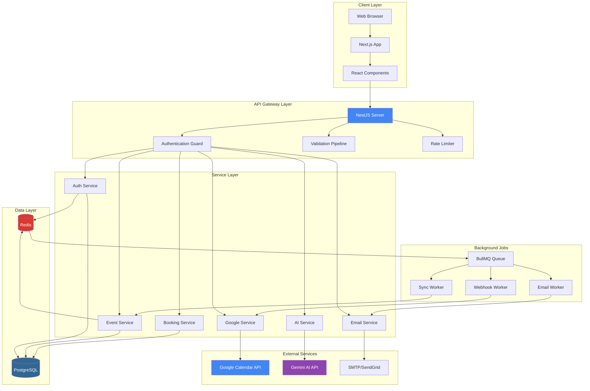
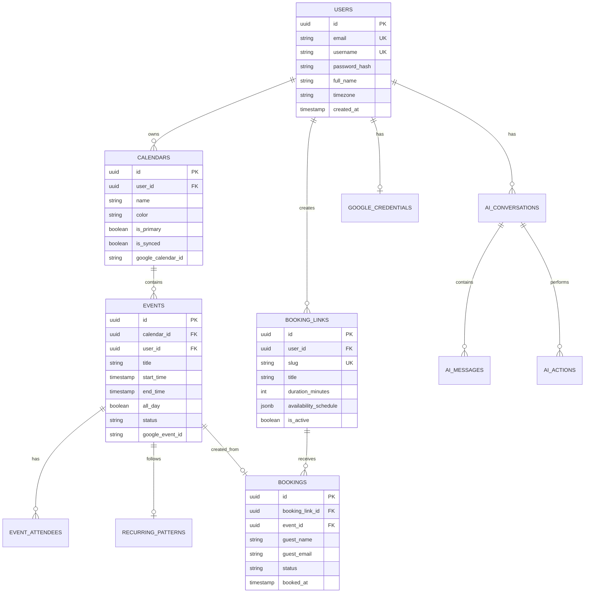
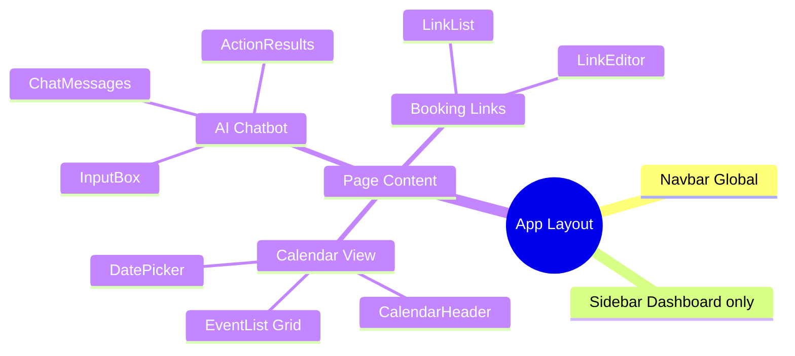

**TRƯỜNG ĐẠI HỌC CÔNG NGHỆ THÔNG TIN, ĐHQG-HCM**

**KHOA MẠNG MÁY TÍNH VÀ TRUYỀN THÔNG**

![][image1]

**BÁO CÁO ĐỒ ÁN MÔN HỌC**

# **ĐỀ TÀI: Xây dựng Calendar Assistant Web**

**Môn học:** Công nghệ Web và ứng dụng - SE347.Q12

**Giảng viên hướng dẫn: Đặng Việt Dũng**

**Thực hiện bởi nhóm 2, bao gồm:**

1. Tạ Văn Thái		22523177		Trưởng nhóm
2. Bùi Quốc Lâm		22520733		Thành viên
3. Nguyễn Văn Quyền 	22521223		Thành viên
4. Nguyễn Công Thắng 	22521330		Thành viên

**Thời gian thực hiện:** <Thời gian bắt đầu> - <Thời gian kết thúc>

# **MỤC LỤC**

[TÓM TẮT](#tóm-tắt)

[Chương I. TỔNG QUAN](#chương-i-tổng-quan)

[Chương II. THIẾT KẾ HỆ THỐNG](#chương-ii-thiết-kế-hệ-thống)

[Chương III. TRIỂN KHAI HỆ THỐNG](#chương-iii-triển-khai-hệ-thống)

[Chương IV. KẾT LUẬN](#chương-iv-kết-luận)

[NGUỒN THAM KHẢO](#nguồn-tham-khảo)

# **TÓM TẮT**

**Calento** là ứng dụng web quản lý lịch thông minh tích hợp công nghệ Large Language Models (Google Gemini AI), được phát triển nhằm giải quyết vấn đề quản lý thời gian và tối ưu hóa quy trình lên lịch tự động thông qua xử lý ngôn ngữ tự nhiên và function calling.

Tính năng chính bao gồm AI-Powered Scheduling với trợ lý ảo Gemini AI hiểu ngôn ngữ tự nhiên và tự động tạo sự kiện, Google Calendar Sync đồng bộ hai chiều real-time qua OAuth 2.0, Priority Management với Kanban board drag-and-drop, Booking Links tạo liên kết đặt lịch công khai, và Multi-channel Notifications qua email, Slack và webhook.

Công nghệ sử dụng gồm Google Gemini AI với function calling API, Backend NestJS với TypeScript, PostgreSQL và Redis/BullMQ, Frontend Next.js 15 với React 18, TanStack Query và Tailwind CSS, cùng với Authentication JWT và OAuth 2.0.

Kết quả là ứng dụng web hoàn chỉnh với hơn 50 API endpoints, giao diện responsive, AI chatbot xử lý tiếng Việt/Anh, được xây dựng theo clean architecture với TypeScript strict mode.

# **Chương I. TỔNG QUAN**

## **1. Giới thiệu đề tài**

### **1.1. Bối cảnh và động lực thực hiện**

Trong bối cảnh xã hội hiện đại, việc quản lý thời gian hiệu quả đã trở thành kỹ năng thiết yếu. Theo khảo sát của Microsoft (2022), một người dùng trung bình dành khoảng 11 giờ mỗi tuần để quản lý và sắp xếp lịch trình cá nhân, cho thấy nhu cầu cấp thiết về giải pháp tối ưu hóa quy trình quản lý thời gian.

Các ứng dụng quản lý lịch hiện tại như Google Calendar, Outlook Calendar, Apple Calendar vẫn tồn tại hạn chế về tính tự động hóa (người dùng phải nhập thông tin thủ công, không có khả năng đề xuất thời gian họp tự động), trải nghiệm người dùng (giao diện phức tạp, không hỗ trợ tương tác bằng ngôn ngữ tự nhiên), và tích hợp AI (chưa tận dụng công nghệ Large Language Models, thiếu trợ lý ảo hỗ trợ quản lý lịch thông minh).

### **1.2. Giới thiệu về Calento**

**Calento** (Calendar Intelligence Assistant) là ứng dụng web quản lý lịch thông minh tích hợp công nghệ AI tiên tiến (Google Gemini) để mang đến trải nghiệm quản lý thời gian hoàn toàn mới. Tên gọi được ghép từ "Calendar" và "Intelligence", thể hiện tầm nhìn về hệ thống lịch có khả năng tự động hóa và hỗ trợ người dùng thông minh.

Các tính năng chính gồm AI-Powered Scheduling với trợ lý ảo Gemini AI hiểu và xử lý ngôn ngữ tự nhiên tiếng Việt và tiếng Anh, tự động tạo sự kiện qua chat, phân tích lịch trống và đề xuất thời gian họp tối ưu. Google Calendar Sync kết nối và đồng bộ hai chiều với Google Calendar sử dụng OAuth 2.0, nhận thông báo real-time qua webhook. Priority Management với bảng Kanban trực quan 4 cấp độ ưu tiên, drag-and-drop để thay đổi độ ưu tiên. Booking Links tạo liên kết công khai để đặt lịch hẹn tương tự Calendly, tự động tìm khung giờ trống và gửi email xác nhận. Multi-channel Notifications qua email, Slack và webhook.

### **1.3. Mối liên hệ với môn học**

Đề tài có mối liên hệ chặt chẽ với môn học Công nghệ Web và ứng dụng (SE347) thông qua việc áp dụng kiến trúc web (mô hình Client-Server, thiết kế RESTful API với 78+ endpoints, kiến trúc 3-layer), công nghệ Frontend (Next.js 15 framework với App Router, Server-Side Rendering và Static Site Generation, component-based architecture với React 18), công nghệ Backend (API server với NestJS framework, thiết kế database với PostgreSQL, authentication với JWT và OAuth 2.0), tích hợp bên thứ ba (Google Calendar API, Google Gemini AI API, SMTP/SendGrid), và real-time communication (webhook system, background job processing với BullMQ queue).

## **2. Lý do chọn đề tài**

### **2.1. Tính thực tiễn cao**

Đề tài được lựa chọn dựa trên nhu cầu thực tế về quản lý thời gian trong cuộc sống hàng ngày của sinh viên (quản lý lịch học, deadline bài tập, lịch thi), nhân viên văn phòng (sắp xếp cuộc họp, công việc hàng ngày), freelancer (quản lý lịch hẹn với khách hàng), và nhu cầu tối ưu hóa thời gian chung.

Các giải pháp hiện tại có hạn chế về tự động hóa (phải nhập thủ công mọi thông tin), tính thông minh (không đề xuất thời gian phù hợp), giao diện (nhiều bước thao tác để tạo sự kiện), và thiếu tích hợp AI. Sau khi hoàn thành, ứng dụng có thể sử dụng cho cá nhân, áp dụng cho nhóm/team, triển khai cho doanh nghiệp nhỏ, và mở rộng thêm các tính năng phục vụ nhu cầu cụ thể.

### **2.2. Phù hợp với nội dung môn học**

Đề tài cho phép nhóm áp dụng đầy đủ kiến thức lý thuyết về kiến trúc web, frontend development, backend development, database, authentication và API Design. Dự án sử dụng các framework và thư viện được giảng dạy trong môn học như Next.js 15, React 18, TanStack Query, NestJS, TypeScript, PostgreSQL, Redis và Tailwind CSS. Các design patterns quan trọng được áp dụng bao gồm Repository Pattern, Service Layer Pattern, DTO Pattern, Dependency Injection và Observer Pattern.

### **2.3. Cơ hội học hỏi công nghệ mới**

Đề tài tạo cơ hội tìm hiểu các công nghệ tiên tiến như Google Gemini AI (Large Language Model), Function Calling, Prompt Engineering, Natural Language Processing, tích hợp dịch vụ bên thứ ba (Google Calendar API, Email Services, Slack Integration), hệ thống real-time (Webhook System, Background Jobs, Event-driven Architecture), và DevOps (Docker, CI/CD, Monitoring).

### **2.4. Phát triển kỹ năng làm việc nhóm**

Dự án yêu cầu phân công công việc rõ ràng theo vai trò Team Lead, Backend Developer, Frontend Developer và Integration Developer. Kỹ năng cần thiết bao gồm Version Control với Git/GitHub, Code Review, Documentation và Testing.

## **3. Mục tiêu và phạm vi đề tài**

### **3.1. Mục tiêu**

Mục tiêu chính là xây dựng ứng dụng web hoàn chỉnh với AI assistant, áp dụng kiến thức môn học vào thực tế (triển khai kiến trúc Client-Server, xây dựng RESTful API, implement authentication và authorization, thiết kế database tối ưu), tìm hiểu và áp dụng công nghệ mới (tích hợp AI API với function calling, triển khai webhook system, sử dụng queue system cho background jobs), và đảm bảo chất lượng code (tuân thủ clean architecture principles, sử dụng TypeScript strict mode, viết unit tests và integration tests).

Mục tiêu phụ bao gồm học cách làm việc nhóm với Git/GitHub, hiểu quy trình phát triển phần mềm từ đầu đến cuối, tạo portfolio project và có thể mở rộng ứng dụng sau môn học.

### **3.2. Phạm vi thực hiện**

Các tính năng được triển khai gồm Quản lý sự kiện (CRUD operations, recurring events với RRULE standard, tìm kiếm và lọc, quản lý attendees, cấu hình reminders), AI Chatbot (giao diện chat, xử lý ngôn ngữ tự nhiên tiếng Việt và Anh, function calling, kiểm tra thời gian trống, đề xuất thời gian họp, lưu lịch sử hội thoại), Google Calendar Integration (OAuth 2.0, đồng bộ hai chiều, webhook notifications, tự động refresh tokens), Priority Management (Kanban board với drag-and-drop, 4 cấp độ ưu tiên), Booking Links (tạo liên kết công khai, tùy chỉnh thời lượng, tự động tìm khung giờ trống, guest booking form, email confirmation), Authentication & Authorization (đăng ký/đăng nhập, Google OAuth 2.0, JWT token-based, cookie-based session, password reset), Email Notifications (email xác nhận, nhắc nhở, welcome email, template system với Handlebars), và Background Job Processing (queue system với BullMQ và Redis, email sending jobs, calendar sync jobs, auto-retry).

Các tính năng không triển khai (ngoài phạm vi) bao gồm Mobile Application, Video Conferencing Integration, Payment Processing, Advanced Team Features và Advanced Analytics.

### **3.3. Giới hạn và ràng buộc**

Giới hạn về thời gian là 12 tuần theo kế hoạch môn học, ưu tiên tính năng thiết yếu. Giới hạn về nguồn lực là nhóm 4 thành viên sinh viên, không có kinh phí cho dịch vụ trả phí, sử dụng free tier của các services. Giới hạn về công nghệ là chỉ sử dụng công nghệ web, PostgreSQL open source và hosting free tier. Ràng buộc về bảo mật bao gồm tuân thủ OAuth 2.0 standards, mã hóa passwords với bcrypt, HTTPS required cho production và không lưu trữ thông tin nhạy cảm dạng plain text.

## **4. Cơ sở lý thuyết và công nghệ sử dụng**

### **4.1. Công nghệ Backend**

**NestJS Framework** là framework để xây dựng ứng dụng web phía server bằng Node.js, sử dụng TypeScript và được thiết kế theo kiến trúc modular. Được chọn vì dễ tổ chức code theo module, TypeScript kiểm tra lỗi ngay khi viết, tích hợp sẵn các tính năng như xác thực và validation, và dễ học với cú pháp giống Angular.

**PostgreSQL Database** là hệ quản trị cơ sở dữ liệu quan hệ miễn phí và mã nguồn mở. Được chọn vì miễn phí, đáng tin cậy với đảm bảo ACID (Atomicity, Consistency, Isolation, Durability), linh hoạt hỗ trợ cả dữ liệu có cấu trúc và không cấu trúc, và phổ biến với nhiều tài liệu hỗ trợ.

**Redis & BullMQ** được sử dụng cho caching (lưu danh sách sự kiện, thông tin user, giảm số lần truy vấn database) và queue system (email jobs, sync jobs, webhook jobs). BullMQ quản lý hàng đợi công việc, cho phép xử lý tác vụ nền không làm chậm ứng dụng chính.

### **4.2. Công nghệ Frontend**

**Next.js 15 Framework** là framework xây dựng trên React, giúp tạo ứng dụng web hiện đại với SEO tốt, performance cao, developer experience tốt và khả năng full-stack. Các tính năng chính gồm App Router (định tuyến dựa trên file), Server-Side Rendering (render HTML trên server), Server Components (giảm code JavaScript gửi đến browser) và Image Optimization (tự động tối ưu hóa hình ảnh).

**React 18** là thư viện JavaScript để xây dựng giao diện người dùng bằng component-based architecture, cho phép tái sử dụng, dễ bảo trì và hiệu suất cao.

**TanStack Query (React Query)** là thư viện quản lý data từ API một cách thông minh, tự động cache và đồng bộ dữ liệu, giúp giảm request, UX tốt với load nhanh từ cache, automatic sync và optimistic updates.

**Zustand State Management** là thư viện quản lý state toàn cục của ứng dụng, đơn giản hơn Redux, với TypeScript type-safe, persistence vào localStorage tự động và DevTools để debug dễ dàng.

### **4.3. AI và Large Language Models**

**Google Gemini AI** là Large Language Model của Google, được chọn vì miễn phí với free tier, hỗ trợ tốt cả tiếng Việt và tiếng Anh, có tính năng Function Calling quan trọng cho chatbot và fast response. Function Calling cho phép AI không chỉ trả lời text mà còn thực hiện hành động trong ứng dụng như createEvent, searchEvents, checkAvailability, updateEvent, deleteEvent, createTask và createLearningPlan.

**Prompt Engineering** là kỹ thuật thiết kế câu lệnh cho AI để nhận được kết quả chính xác nhất. System Prompt là hướng dẫn ban đầu cho AI về vai trò và cách hoạt động. Context Management bao gồm Calendar Context (ngày giờ hiện tại, timezone, sự kiện sắp tới, user preferences) và Conversation History (lưu 10 messages gần nhất để AI nhớ ngữ cảnh cuộc hội thoại).

### **4.4. Authentication & Authorization**

**JWT (JSON Web Tokens)** là chuẩn để tạo token dùng xác thực người dùng, được chọn vì token-based không cần lưu thông tin trên server. JWT gồm 3 phần: Header (thuật toán mã hóa), Payload (dữ liệu user như ID, email, username, type, iat, exp) và Signature (mã hóa để verify token không bị giả mạo). Hệ thống sử dụng Access Token (thời gian sống 1 giờ) và Refresh Token (thời gian sống 7 ngày lưu trong HTTP-only cookie).

**OAuth 2.0 Protocol** là chuẩn cho phép ứng dụng truy cập dữ liệu của user trên dịch vụ khác mà không cần password. Google OAuth Flow gồm 5 bước: User click "Login with Google", User đăng nhập và cho phép, Google redirect về app với code, App đổi code lấy tokens, và Sử dụng access_token để truy cập API. Lợi ích bao gồm bảo mật (không lưu password), phân quyền (user chỉ cấp quyền cần thiết), thu hồi (user có thể thu hồi quyền bất cứ lúc nào) và chuẩn hóa.

### **4.5. RESTful API Design**

**REST** (REpresentational State Transfer) là kiến trúc thiết kế API, trong đó mỗi resource có URL riêng, dùng HTTP methods chuẩn (GET lấy dữ liệu, POST tạo mới, PATCH cập nhật một phần, PUT thay thế toàn bộ, DELETE xóa) và server không lưu trạng thái của client.

Response Format chuẩn gồm Success Response (success, data, meta), Error Response (success, error.code, error.message, error.details, meta.timestamp) và Paginated Response (success, data, meta.page, meta.limit, meta.total, meta.totalPages).

HTTP Status Codes bao gồm Success 2xx (200 OK, 201 Created, 204 No Content), Client Errors 4xx (400 Bad Request, 401 Unauthorized, 403 Forbidden, 404 Not Found) và Server Errors 5xx (500 Internal Server Error, 503 Service Unavailable).

**Swagger/OpenAPI Documentation** là công cụ tự động tạo tài liệu API, giúp xem danh sách tất cả APIs, test gọi thử API ngay trên browser và generate tự động code client.

### **4.6. Design Patterns**

**Repository Pattern** tách biệt business logic khỏi data access logic, cho phép single source of truth, dễ testing với mock repositories, tái sử dụng queries và thay đổi data source dễ dàng.

**Service Layer Pattern** tập trung business logic trong service layer, controller chỉ handle HTTP concerns theo kiến trúc Controller → Service → Repository → Database.

**DTO (Data Transfer Objects)** định nghĩa structure của data được truyền giữa layers, với class-validator decorators, automatic validation trong NestJS, type safety với TypeScript và transform/sanitize input.

### **4.7. Real-time Communication**

**Webhooks** là HTTP callbacks khi events xảy ra ở third-party service. Google Calendar Webhooks cho phép subscribe to calendar changes, receive push notifications, auto-sync events và channel expiration handling.

**Background Jobs** xử lý long-running tasks bất đồng bộ. BullMQ Features bao gồm job queues với priority, auto-retry with exponential backoff, job scheduling và monitoring dashboard.

# **Chương II. THIẾT KẾ HỆ THỐNG**

## **1. Kiến trúc tổng thể**

### **1.1. Tổng quan về kiến trúc**

**Calento** được xây dựng theo mô hình Client-Server Architecture, trong đó Client là ứng dụng web chạy trên trình duyệt, Server là Backend API server xử lý logic và quản lý dữ liệu, Database là PostgreSQL lưu trữ dữ liệu lâu dài và Cache là Redis lưu trữ tạm để tăng tốc độ.

Hệ thống được chia thành 6 layers chính: Client Layer (giao diện người dùng), API Gateway Layer (cổng kiểm soát requests), Service Layer (xử lý logic nghiệp vụ), Data Layer (lưu trữ dữ liệu), External Services (dịch vụ bên thứ ba) và Background Jobs (xử lý tác vụ nền).

### **1.2. Sơ đồ kiến trúc tổng thể**

### **1.3. Giải thích chi tiết các tầng**

**Tầng 1: Client Layer** bao gồm Web Browser (render HTML, CSS, JavaScript), Next.js App (Server-Side Rendering, Static Site Generation, App Router) và React Components (các thành phần UI như Button, Calendar, Modal, Form).

**Tầng 2: API Gateway Layer** là tầng cổng nơi mọi request từ client phải đi qua, bao gồm NestJS Server (API server chính), Authentication Guard (kiểm tra JWT token), Validation Pipeline (kiểm tra dữ liệu đầu vào với DTO) và Rate Limiter (giới hạn số request từ một IP).

**Tầng 3: Service Layer** chứa logic chính của ứng dụng với Auth Service (xử lý đăng ký, đăng nhập, JWT tokens), Event Service (CRUD operations, recurring events, search và filter), Booking Service (quản lý booking links, tính toán available time slots), AI Service (nhận chat messages, gọi Gemini AI API, xử lý function calling), Google Service (OAuth 2.0, sync events hai chiều, webhooks) và Email Service (gửi email confirmation, reminders, render templates).

**Tầng 4: Data Layer** gồm PostgreSQL (lưu trữ tất cả dữ liệu chính với ACID compliant) và Redis (cache dữ liệu thường truy cập, session storage, queue backend).

**Tầng 5: External Services** bao gồm Google Calendar API (đọc và tạo events, OAuth 2.0, webhook notifications), Gemini AI API (xử lý natural language, function calling) và SMTP/SendGrid (gửi email notifications).

**Tầng 6: Background Jobs** với BullMQ Queue quản lý job queue, Email Worker (gửi email qua SMTP/SendGrid, retry nếu thất bại), Sync Worker (đồng bộ events với Google Calendar) và Webhook Worker (nhận notifications từ Google, trigger sync).

### **1.4. Luồng dữ liệu**

Luồng dữ liệu di chuyển qua các tầng từ User Action → React Component → Custom Hook → TanStack Query → Service Layer → Axios HTTP Client → Backend API → NestJS Controller → Service Layer → Database → Response → Update Cache → Re-render UI.

Các tính năng quan trọng của luồng dữ liệu bao gồm Automatic Caching (TanStack Query tự động cache API responses), Optimistic Updates (UI update ngay lập tức trước khi API response), Error Handling (errors được bắt và xử lý tại mọi tầng), Loading States (trạng thái loading tự động) và Query Invalidation (làm mới cache thông minh).

## **2. Thiết kế Database**

### **2.1. Database Schema Overview**

Database được thiết kế với 15 tables chính: users, calendars, events, event_attendees, recurring_patterns, booking_links, bookings, tasks, habits, priorities, ai_conversations, ai_messages, ai_actions, google_credentials và webhook_channels.

### **2.2. Core Tables**

**Users Table** lưu thông tin người dùng với các trường id (UUID primary key), email (unique, not null), username (unique, not null), password_hash, full_name, avatar_url, timezone (default 'Asia/Ho_Chi_Minh'), language (default 'vi'), google_id (nullable), is_verified, last_login_at, created_at và updated_at.

**Calendars Table** quản lý calendars của user với id, user_id (foreign key), name, description, color, is_primary (boolean), is_synced (boolean), google_calendar_id, timezone, created_at và updated_at.

**Events Table** lưu trữ sự kiện với id, calendar_id, user_id, title, description, location, start_time, end_time, all_day (boolean), status (enum: confirmed, tentative, cancelled), visibility (enum: public, private), google_event_id, recurring_pattern_id, created_at và updated_at.

**Recurring_Patterns Table** định nghĩa pattern cho recurring events với id, rrule (text), start_date, end_date, timezone, exceptions (JSONB array) và created_at.

**Booking_Links Table** quản lý scheduling links với id, user_id, slug (unique), title, description, duration_minutes, buffer_before_minutes, buffer_after_minutes, availability_schedule (JSONB), is_active (boolean), created_at và updated_at.

**Bookings Table** lưu guest bookings với id, booking_link_id, event_id, guest_name, guest_email, guest_phone, notes, status (enum: pending, confirmed, cancelled), booked_at và created_at.

### **2.3. Relationships**

Các mối quan hệ chính bao gồm One-to-Many (User → Calendars, Calendar → Events, Event → Attendees, User → Booking Links, Booking Link → Bookings, User → AI Conversations, Conversation → Messages), Many-to-Many (Events ↔ Users qua event_attendees) và One-to-One (Event ↔ Recurring Pattern, User ↔ Google Credentials).

### **2.4. Indexes và Performance**

Database sử dụng các indexes để tối ưu performance: Primary Keys (tất cả tables có UUID primary key), Foreign Keys (indexed tự động), Composite Indexes (events: calendar_id + start_time, bookings: booking_link_id + booked_at), Unique Indexes (users.email, users.username, calendars.google_calendar_id) và Full-text Search Indexes (events.title, events.description).

## **3. Thiết kế Database Schema**

### **3.1. Entity Relationship Diagram**

### **3.2. Conversation History Schema**

AI Conversations được lưu trữ với conversations table (id, user_id, title, created_at, updated_at), messages table (id, conversation_id, role enum: user/assistant, content text, created_at) và actions table (id, conversation_id, message_id, function_name, arguments JSONB, result JSONB, status enum: pending/completed/failed, created_at).

## **4. Thiết kế API**

### **4.1. Tổng quan API Endpoints**

Base URL: `https://api.calento.space/api`. Tổng số endpoints: 78 endpoints phân bổ theo module Authentication (10), Users (8), Events (15), Calendars (7), Booking Links (8), Bookings (6), AI Chatbot (6), Google Calendar (8) và Email (10).

### **4.2. Chi tiết API Endpoints**

API endpoints được tổ chức theo RESTful principles với các HTTP methods chuẩn (GET, POST, PATCH, PUT, DELETE). Mỗi endpoint có authentication requirement rõ ràng (Yes/No). Response format chuẩn gồm success (boolean), data (object/array) và meta (object với timestamp, pagination).

### **4.3. API Response Format**

Success Response có cấu trúc success: true, data: object, meta: {timestamp, pagination}. Error Response gồm success: false, error: {code, message, details}, meta: {timestamp}. Paginated Response bao gồm success: true, data: array, meta: {page, limit, total, totalPages}.

### **4.4. Authentication Flow**

JWT Token Structure gồm các claims sub (user ID), email, username, type (access/refresh), iat (issued at) và exp (expiration time). Cookie Configuration sử dụng access_token (HttpOnly, Secure, SameSite=Strict, MaxAge=1h) và refresh_token (HttpOnly, Secure, SameSite=Strict, MaxAge=7d).

## **5. Thiết kế AI System**

### **5.1. Function Calling Architecture**

Available Functions bao gồm createEvent (tạo sự kiện trong lịch), checkAvailability (kiểm tra thời gian trống), searchEvents (tìm kiếm sự kiện), updateEvent (cập nhật sự kiện), deleteEvent (xóa sự kiện), createTask (tạo task mới) và createLearningPlan (tạo kế hoạch học tập).

Function Schema gồm name (tên của hàm), description (mô tả chức năng để AI hiểu), parameters (định nghĩa cấu trúc tham số JSON Schema), parameters.properties (chi tiết các tham số) và parameters.required (danh sách các tham số bắt buộc).

### **5.2. Context Management**

Calendar Context bao gồm current date/time và timezone, user preferences (work hours, default duration), upcoming events (next 7 days) và recent bookings. Conversation Context gồm message history (last 10 messages), function call results, user intent tracking và error history for retry logic.

## **6. Thiết kế Frontend**

### **6.1. Component Hierarchy**

### **6.2. State Management Strategy**

Server State (TanStack Query) quản lý Events data, Booking links, User profile và AI conversations. Client State (Zustand) quản lý Calendar view settings (month/week/day), UI preferences (theme, language), Active modals/dialogs và Form states. URL State (Next.js Router) quản lý Current page/route, Filter parameters, Search queries và Selected date range.

### **6.3. Design System**

**Color Palette** gồm Primary Colors (Primary Blue #4285f4, Secondary Purple #8e44ad, Success Green #10b981, Warning Yellow #f59e0b, Error Red #ef4444), Neutral Colors (Gray 50-900, White #ffffff, Black #000000) và Semantic Colors (Info #3b82f6, Calendar Events dynamic color, Priority Levels Red to Yellow).

**Typography** sử dụng Font Family Inter (primary) và Fira Code (monospace), Font Sizes từ Heading 1 (2rem) đến Tiny (0.75rem), Font Weights từ Regular (400) đến Bold (700).

**Spacing System** với Base Unit 4px và Scale từ xs (4px) đến 3xl (64px). Border Radius từ Small (4px) đến Full (9999px).

### **6.4. Component Library**

Atomic Components bao gồm Buttons (Primary, Secondary, Ghost, Icon, Link với variants Default, Primary, Secondary, Destructive, Ghost, Link và sizes sm, md, lg), Form Inputs (Text Input, Textarea, Select, Checkbox, Radio, Switch, Date Picker, Time Picker) và Feedback Components (Toast, Alert, Modal, Dialog, Loading, Progress).

Composite Components gồm Calendar Components (FullCalendar, EventCard, EventModal, CalendarHeader, DatePicker, TimeSlotPicker), AI Chatbot Components (ChatBox, MessageBubble, ActionCard, TimeSlotsList, InputBox) và Dashboard Components (Sidebar, Navbar, Card, Table, Tabs, Accordion).

### **6.5. Layout & Navigation**

Layout Structure gồm Navbar (Fixed) ở trên, Sidebar (Fixed) bên trái và Main Content (Scrollable) bên phải. Sidebar Navigation bao gồm Calendar, Tasks, Priorities, Scheduling Links, Analytics và Settings. Navbar có Search bar, Notifications, AI Chat toggle và User menu.

Responsive Breakpoints: Mobile (<640px), Tablet (640px-1024px), Desktop (>1024px), Wide (>1440px). Mobile Behavior: Sidebar collapses to bottom navigation, Calendar switches to compact view, Tables become scrollable cards.

# **Chương III. TRIỂN KHAI HỆ THỐNG**

## **1. Công nghệ và công cụ sử dụng**

### **1.1. Backend Stack**

Backend sử dụng NestJS framework với TypeScript, PostgreSQL database, Redis cho caching và queue, BullMQ cho background jobs, Passport.js cho authentication, class-validator cho validation, TypeORM cho database migrations và Handlebars cho email templates.

### **1.2. Frontend Stack**

Frontend sử dụng Next.js 15 với App Router, React 18, TanStack Query v5 cho server state management, Zustand cho client state, Tailwind CSS cho styling, shadcn/ui cho component library, React Hook Form cho form handling, Axios cho HTTP client và date-fns cho date manipulation.

### **1.3. External Services**

External services bao gồm Google Gemini AI (function calling), Google Calendar API (OAuth 2.0, sync, webhooks), SendGrid/SMTP (email delivery), Cloudflare (DNS, CDN, SSL, DDoS protection) và Digital Ocean (hosting, droplet).

### **1.4. Development Tools**

Development tools gồm Git & GitHub (version control, collaboration), Docker & Docker Compose (containerization), ESLint & Prettier (code quality), Jest & React Testing Library (testing), Postman (API testing) và pgAdmin (database management).

## **2. Các tính năng chính đã triển khai**

### **2.1. Authentication System**

Authentication System triển khai đầy đủ JWT-based authentication với access tokens (1 hour expiration) và refresh tokens (7 days expiration lưu trong HTTP-only cookies). Google OAuth 2.0 integration cho phép login with Google. Password hashing sử dụng bcrypt với salt rounds 10. Email verification flow với verification tokens. Password reset functionality với time-limited tokens. Session management với Redis storage. Role-based access control (RBAC) cho future expansion.

### **2.2. Calendar Management**

Calendar Management bao gồm CRUD operations cho events với full validation, recurring events support sử dụng RRULE standard (RFC 5545), 4 calendar view modes (Day, Week, Month, Year), full-text search across events, timezone support cho global users, attendee management với email notifications, conference link integration (Google Meet), reminder notifications qua email, drag & drop time selection và mobile-responsive calendar interface.

### **2.3. Google Calendar Integration**

Google Calendar Integration triển khai complete OAuth 2.0 authorization flow, bidirectional event synchronization (pull from Google và push to Google), real-time updates via webhooks, automatic token refresh, multi-calendar support, conflict resolution strategies, background sync processing với BullMQ, sync history và audit log, connection management UI và error handling với recovery mechanisms.

### **2.4. AI Chatbot Integration**

AI Chatbot Integration sử dụng Google Gemini 1.5 Flash với function calling pattern. Natural language understanding cho calendar operations với 8+ function calling capabilities (createEvent, searchEvents, checkAvailability, updateEvent, deleteEvent, createTask, createLearningPlan). Context-aware conversations với multi-turn dialogue support. Real-time message streaming. Rich action result display. Conversation history persistence. Error recovery mechanisms. Timezone và date intelligence. Mobile-responsive chat interface.

### **2.5. Booking Links System**

Booking Links System cho phép tạo public booking links với custom slugs. Flexible availability configuration với specific hours hoặc calendar sync. Intelligent slot calculation algorithm tự động filter unavailable slots. Real-time availability checking. Guest booking flow without authentication. Email notifications (confirmation, reminders) với ICS file generation. Reschedule và cancellation support. Google Meet integration. Calendar sync. Booking analytics và mobile-responsive booking page.

### **2.6. Priority Management**

Priority Management triển khai Kanban board interface với drag-and-drop functionality. 4 priority levels (Critical, High, Medium, Low). Support multiple item types (Events, Tasks, Booking Links, Habits). Real-time position updates. Filter và search capabilities. Mobile-responsive board layout.

### **2.7. Email Notification System**

Email Notification System sử dụng SendGrid API integration với SMTP fallback. Template system với Handlebars. Email types bao gồm welcome emails, booking confirmations, event reminders, password reset emails và verification emails. Background job processing với BullMQ. Retry logic cho failed emails. Email delivery tracking và analytics.

## **3. Deployment**

### **3.1. Production Infrastructure**

Production infrastructure triển khai trên Digital Ocean Droplet (4GB RAM, 2 vCPUs, 80GB SSD, Ubuntu 22.04 LTS) tại Singapore datacenter. Cloudflare quản lý DNS, SSL/TLS certificates, CDN & caching, DDoS protection và Web Application Firewall. Docker containerization với Docker Compose orchestration. Nginx reverse proxy cho routing và load balancing.

### **3.2. Deployment Process**

Deployment process sử dụng GitHub Actions CI/CD pipeline. Automated testing trước deployment. Docker image building và pushing to registry. Zero-downtime deployment với rolling updates. Automated database migrations. Environment-specific configurations. Health checks và rollback mechanisms.

### **3.3. Monitoring và Logging**

Monitoring sử dụng application logging với Winston logger. Error tracking và alerting. Performance monitoring. Database query logging. API request/response logging. Security audit logs.

### **3.4. Security Measures**

Security measures bao gồm HTTPS enforcement với SSL/TLS, CORS configuration, rate limiting, input validation và sanitization, SQL injection prevention, XSS protection, CSRF protection, secure password storage với bcrypt, JWT token security, environment variables cho sensitive data và regular security updates.

## **4. Testing và Quality Assurance**

### **4.1. Testing Strategy**

Testing strategy gồm Unit tests cho services và utilities, Integration tests cho API endpoints, End-to-end tests cho critical user flows, Manual testing cho UI/UX, Performance testing cho load handling và Security testing cho vulnerabilities.

### **4.2. Code Quality**

Code quality đảm bảo bằng TypeScript strict mode, ESLint rules enforcement, Prettier code formatting, Code review process, Git commit conventions, Documentation standards và Clean code principles.

# **Chương IV. KẾT LUẬN**

## **1. Tổng kết**

### **1.1. Kết quả đạt được**

Dự án Calento đã hoàn thành thành công các mục tiêu đề ra. Ứng dụng web hoàn chỉnh với đầy đủ tính năng quản lý lịch thông minh, tích hợp AI chatbot sử dụng Google Gemini với function calling, đồng bộ hai chiều với Google Calendar qua OAuth 2.0 và webhooks, hệ thống booking links công khai tương tự Calendly, và giao diện responsive trên mọi thiết bị.

Về mặt kỹ thuật, hệ thống được xây dựng với 78+ API endpoints theo chuẩn RESTful, database schema với 15 tables được tối ưu hóa, clean architecture với separation of concerns rõ ràng, TypeScript strict mode đảm bảo type safety, và deployment thành công lên production environment.

### **1.2. Đánh giá về đề tài**

Đề tài có tính thực tiễn cao, giải quyết vấn đề quản lý thời gian thực tế. Phạm vi phù hợp với thời gian và nguồn lực của nhóm. Công nghệ sử dụng hiện đại và phổ biến trong ngành. Kiến thức áp dụng đầy đủ nội dung môn học SE347. Cơ hội học hỏi công nghệ mới như AI integration và real-time systems.

### **1.3. Khó khăn và giải pháp**

Các khó khăn gặp phải bao gồm Google Calendar API complexity (giải quyết bằng đọc kỹ documentation, test với Postman, implement retry logic), Gemini AI function calling (giải quyết bằng prompt engineering iterations, clear function schemas, comprehensive error handling), Real-time sync challenges (giải quyết bằng webhook implementation, background job processing, conflict resolution strategies), Database schema design (giải quyết bằng iterative design process, normalization principles, performance testing), và Deployment configuration (giải quyết bằng Docker containerization, Nginx reverse proxy, Cloudflare integration).

## **2. Hướng phát triển**

### **2.1. Tính năng mở rộng**

Các tính năng có thể mở rộng trong tương lai gồm Mobile Application (React Native hoặc Flutter), Team Collaboration Features (shared calendars, team scheduling, meeting polls), Video Conferencing Integration (Zoom, Microsoft Teams), Advanced Analytics Dashboard (time tracking, productivity insights, meeting analytics), Payment Integration (premium features, subscription plans), Calendar Templates (meeting types, event categories), Smart Scheduling Assistant (AI-powered meeting optimization), Multi-language Support (internationalization), Dark Mode Theme và Accessibility Improvements (WCAG compliance).

### **2.2. Cải tiến kỹ thuật**

Các cải tiến kỹ thuật bao gồm Microservices Architecture (split monolith into services), GraphQL API (alternative to REST), WebSocket Integration (real-time updates without polling), Server-Side Rendering Optimization (improve SEO và performance), Progressive Web App (offline support, push notifications), Advanced Caching Strategies (Redis cluster, CDN optimization), Database Sharding (horizontal scaling), Kubernetes Deployment (container orchestration), Monitoring và Observability (Prometheus, Grafana) và Automated Testing Coverage (increase to 80%+).

### **2.3. Business Model**

Business model có thể phát triển theo hướng Freemium Model (free tier với basic features, premium tier với advanced features), Enterprise Plan (team features, priority support, custom integrations), API Access (developer API với rate limits), White-label Solution (customizable for businesses) và Affiliate Program (referral commissions).

## **3. Kinh nghiệm rút ra**

### **3.1. Kiến thức chuyên môn**

Về kiến thức chuyên môn, nhóm đã hiểu sâu về Web Architecture (Client-Server model, RESTful API design, microservices concepts), Backend Development (NestJS framework, database design, authentication/authorization, API security), Frontend Development (React ecosystem, state management, responsive design, performance optimization), AI Integration (LLM function calling, prompt engineering, context management), Cloud Deployment (Docker containerization, CI/CD pipelines, production best practices) và Software Engineering Practices (clean code, design patterns, testing strategies, documentation).

### **3.2. Kỹ năng mềm**

Về kỹ năng mềm, nhóm phát triển được Team Collaboration (Git workflow, code review, task distribution, communication), Problem Solving (debugging techniques, research skills, creative solutions), Time Management (sprint planning, deadline management, priority setting), Self-learning (reading documentation, online courses, community resources) và Project Management (requirement analysis, scope management, risk mitigation).

### **3.3. Bài học quan trọng**

Các bài học quan trọng bao gồm Planning trước coding (thiết kế architecture đầu tiên giúp tránh refactor lớn, database schema design sớm giúp development mượt mà), Testing sớm (viết tests từ đầu giúp catch bugs sớm, automated tests tiết kiệm thời gian), Documentation là must (code không docs khó maintain, API docs giúp frontend/backend work independently), Time estimation (luôn estimate x2 thời gian ban đầu, break down tasks nhỏ để estimate chính xác), Communication (daily standups giúp sync progress, code reviews giúp maintain quality) và Continuous Learning (công nghệ mới xuất hiện liên tục, đọc docs và practice coding thường xuyên).

## **4. Kết luận**

Calento không chỉ là một đồ án môn học mà còn là minh chứng cho việc áp dụng kiến thức lý thuyết vào thực tiễn. Từ những dòng code đầu tiên đến production deployment, mỗi bước đều là một bài học quý giá.

Dự án đã đạt được các mục tiêu đề ra về mặt kỹ thuật và chức năng. Ứng dụng hoạt động ổn định với đầy đủ tính năng cốt lõi, tích hợp thành công các công nghệ hiện đại như AI và cloud services, và được triển khai thành công lên môi trường production.

Nhóm tin rằng với nền tảng đã xây dựng, Calento có tiềm năng phát triển thành sản phẩm thực tế phục vụ người dùng. Kinh nghiệm và kiến thức thu được từ dự án này sẽ là nền tảng vững chắc cho sự phát triển nghề nghiệp của các thành viên trong tương lai.

Nhóm xin chân thành cảm ơn Giảng viên Đặng Việt Dũng đã hướng dẫn về kiến trúc web và best practices, môn SE347 đã cung cấp kiến thức nền tảng về web technologies, Trường UIT đã tạo môi trường học tập tốt, các bạn trong nhóm đã teamwork và support lẫn nhau, và gia đình, bạn bè đã động viên tinh thần suốt quá trình làm đồ án.

# **NGUỒN THAM KHẢO**

## **Tài liệu kỹ thuật**

1. NestJS Documentation. (2024). A progressive Node.js framework. Retrieved from https://docs.nestjs.com/
2. Next.js Documentation. (2024). The React Framework for the Web. Vercel. Retrieved from https://nextjs.org/docs
3. PostgreSQL Documentation. (2024). The World's Most Advanced Open Source Relational Database. Retrieved from https://www.postgresql.org/docs/
4. Redis Documentation. (2024). The open source, in-memory data store. Retrieved from https://redis.io/docs/
5. Google Calendar API Documentation. (2024). Google Developers. Retrieved from https://developers.google.com/calendar/api/guides/overview
6. Google Gemini AI Documentation. (2024). Build with Gemini. Retrieved from https://ai.google.dev/docs

## **Frameworks & Libraries**

7. TanStack Query Documentation. (2024). Powerful asynchronous state management for TS/JS. Retrieved from https://tanstack.com/query/latest
8. Tailwind CSS Documentation. (2024). A utility-first CSS framework. Retrieved from https://tailwindcss.com/docs
9. BullMQ Documentation. (2024). Premium Queue package for handling distributed jobs. Retrieved from https://docs.bullmq.io/
10. React Hook Form Documentation. (2024). Performant, flexible and extensible forms. Retrieved from https://react-hook-form.com/

## **Best Practices & Patterns**

11. Martin Fowler. (2002). Patterns of Enterprise Application Architecture. Addison-Wesley Professional.
12. Robert C. Martin. (2008). Clean Code: A Handbook of Agile Software Craftsmanship. Prentice Hall.
13. Microsoft. (2024). RESTful web API design. Azure Architecture Center. Retrieved from https://learn.microsoft.com/en-us/azure/architecture/best-practices/api-design
14. OWASP Foundation. (2024). OWASP Top Ten. Retrieved from https://owasp.org/www-project-top-ten/

## **OAuth 2.0 & Security**

15. RFC 7519. (2015). JSON Web Token (JWT). IETF. Retrieved from https://datatracker.ietf.org/doc/html/rfc7519
16. RFC 6749. (2012). The OAuth 2.0 Authorization Framework. IETF. Retrieved from https://datatracker.ietf.org/doc/html/rfc6749
17. Auth0. (2024). OAuth 2.0 and OpenID Connect. Retrieved from https://auth0.com/docs/authenticate

## **Database & Architecture**

18. PostgreSQL Global Development Group. (2024). PostgreSQL Tutorial. Retrieved from https://www.postgresql.org/docs/current/tutorial.html
19. Sam Newman. (2021). Building Microservices: Designing Fine-Grained Systems. O'Reilly Media.
20. Martin Kleppmann. (2017). Designing Data-Intensive Applications. O'Reilly Media.

## **AI & Machine Learning**

21. Google AI. (2024). Gemini API Documentation. Retrieved from https://ai.google.dev/gemini-api/docs
22. OpenAI. (2024). Function Calling Guide. Retrieved from https://platform.openai.com/docs/guides/function-calling
23. Anthropic. (2024). Prompt Engineering Guide. Retrieved from https://docs.anthropic.com/claude/docs/prompt-engineering

## **DevOps & Deployment**

24. Docker Inc. (2024). Docker Documentation. Retrieved from https://docs.docker.com/
25. Kubernetes Documentation. (2024). Production-Grade Container Orchestration. Retrieved from https://kubernetes.io/docs/
26. GitHub. (2024). GitHub Actions Documentation. Retrieved from https://docs.github.com/en/actions

## **Testing**

27. Jest Documentation. (2024). Delightful JavaScript Testing. Retrieved from https://jestjs.io/docs/getting-started
28. Testing Library. (2024). React Testing Library. Retrieved from https://testing-library.com/docs/react-testing-library/intro/

## **Giáo trình môn học**

29. Giảng viên Đặng Việt Dũng. (2024). Công nghệ Web và ứng dụng - SE347.Q12. Khoa Mạng máy tính và Truyền thông, Trường Đại học Công nghệ Thông tin, ĐHQG-HCM.

## **Online Resources**

30. MDN Web Docs. (2024). Web technology for developers. Mozilla. Retrieved from https://developer.mozilla.org/
31. Stack Overflow. (2024). Developer Community. Retrieved from https://stackoverflow.com/
32. GitHub. (2024). Repository: Calento. Retrieved from https://github.com/TDevUIT/Calento

# **PHỤ LỤC**

## **A. Hướng dẫn cài đặt và chạy ứng dụng**

### **A.1. System Requirements**

Node.js >= 18.0.0, PostgreSQL >= 14.0, Redis >= 6.0, Docker và Docker Compose (optional), Git.

### **A.2. Installation Steps**

Clone repository, install dependencies cho backend và frontend, setup environment variables, create database, run migrations, start Redis server, start development servers.

### **A.3. Environment Variables**

Backend cần DATABASE_URL, REDIS_URL, JWT_SECRET, GOOGLE_CLIENT_ID, GOOGLE_CLIENT_SECRET, GEMINI_API_KEY, SMTP_HOST, SMTP_USER, SMTP_PASS. Frontend cần NEXT_PUBLIC_API_URL, NEXT_PUBLIC_APP_URL.

## **B. Danh sách thành viên và phân công công việc**

### **B.1. Team Members**

Tạ Văn Thái (22523177) - Team Lead: Project management, Backend architecture, AI integration. Bùi Quốc Lâm (22520733) - Backend Developer: API development, Database design, Google Calendar integration. Nguyễn Văn Quyền (22521223) - Frontend Developer: UI/UX implementation, State management, Responsive design. Nguyễn Công Thắng (22521330) - Full-stack Developer: Booking system, Email notifications, Deployment.

### **B.2. Work Distribution**

Planning Phase: Requirements analysis (All members), Architecture design (Tạ Văn Thái, Bùi Quốc Lâm), Database schema design (Bùi Quốc Lâm), UI/UX mockups (Nguyễn Văn Quyền).

Development Phase: Backend API (Bùi Quốc Lâm, Nguyễn Công Thắng), Frontend UI (Nguyễn Văn Quyền, Nguyễn Công Thắng), AI Chatbot (Tạ Văn Thái), Google Calendar Sync (Bùi Quốc Lâm), Booking System (Nguyễn Công Thắng), Email System (Nguyễn Công Thắng).

Testing & Deployment Phase: Unit testing (All members), Integration testing (Bùi Quốc Lâm, Tạ Văn Thái), Deployment setup (Tạ Văn Thái, Nguyễn Công Thắng), Documentation (All members).

## **C. Screenshots và Demos**

Phần này có thể bổ sung screenshots của ứng dụng, database schema diagrams, API documentation exports, testing reports và deployment logs.
