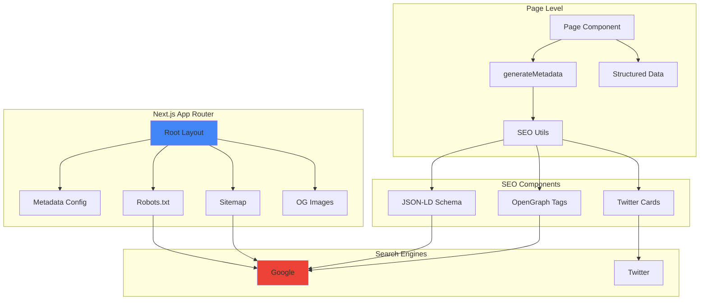

# 🔍 SEO Implementation Guide - Calento Client

## 📋 Tổng Quan

Tài liệu này mô tả chi tiết cách implement SEO (Search Engine Optimization) trong Calento client, sử dụng Next.js 14 App Router với các best practices.

## 🏗️ SEO Architecture



## 📂 File Structure

```
client/
├── app/
│   ├── layout.tsx                 # Root metadata
│   ├── sitemap.ts                 # Dynamic sitemap
│   ├── robots.ts                  # Robots.txt
│   ├── opengraph-image.tsx        # Default OG image
│   ├── twitter-image.tsx          # Default Twitter image
│   └── [pages]/
│       └── page.tsx               # Page-specific metadata
│
├── config/
│   └── metadata.config.ts         # Global metadata config
│
├── utils/
│   └── seo.ts                     # SEO utility functions
│
└── components/
    └── seo/
        ├── StructuredData.tsx     # JSON-LD schemas
        └── index.ts
```

---

## ⚙️ Configuration

### 1. Global Metadata Config

**File:** `config/metadata.config.ts`

**Purpose:** Central configuration cho toàn bộ site metadata

**Key Features:**
- Base URL configuration
- Default title template
- Global keywords
- Social media metadata
- Icons & manifest
- Google verification

**Example:**

```typescript
export const DEFAULT_METADATA: Metadata = {
  title: {
    default: 'Calento - AI Calendar Assistant',
    template: '%s | Calento'  // Page title sẽ là: "Features | Calento"
  },
  description: 'AI-powered calendar app for smart scheduling',
  keywords: [
    'AI calendar',
    'smart scheduling',
    'calendar sync',
    // ... more keywords
  ],
  openGraph: {
    type: 'website',
    siteName: 'Calento',
    images: [{ url: '/og-image.png', width: 1200, height: 630 }]
  },
  twitter: {
    card: 'summary_large_image',
    creator: '@calento'
  }
}
```

### 2. SEO Utility Functions

**File:** `utils/seo.ts`

**Functions:**

#### generateSEO()
Tạo complete metadata cho một page

**Usage:**
```typescript
export const metadata = generateSEO({
  title: 'Features',
  description: 'Discover powerful features...',
  path: '/features',
  keywords: ['features', 'ai scheduling'],
  image: '/og-features.png'
});
```

**Output:**
- Title với template
- Description
- Canonical URL
- OpenGraph tags
- Twitter cards
- Robots directives

#### generateBlogSEO()
Specialized metadata cho blog posts

**Usage:**
```typescript
export const metadata = generateBlogSEO({
  title: 'How to boost productivity',
  description: 'Learn tips...',
  author: 'John Doe',
  publishedAt: '2024-01-01',
  slug: 'boost-productivity',
  tags: ['productivity', 'tips']
});
```

**Features:**
- Article-specific OpenGraph type
- Author metadata
- Published/Modified dates
- Tags as keywords

#### Helper Functions
```typescript
// Truncate description to SEO-friendly length
truncateDescription(text, 160)

// Format & deduplicate keywords
formatKeywords(['AI', 'ai', 'Calendar'])

// Generate dynamic OG image URL
generateOGImageUrl('Page Title', 'Description')
```

---

## 🗺️ Sitemap Generation

**File:** `app/sitemap.ts`

### Dynamic Sitemap

**Features:**
- ✅ Static pages với priority & changeFrequency
- ✅ Dynamic blog posts từ API
- ✅ Auto-update lastModified dates
- ✅ Error handling (silent fail during build)

**Structure:**

```typescript
export default async function sitemap(): Promise<MetadataRoute.Sitemap> {
  const baseUrl = process.env.NEXT_PUBLIC_APP_URL;
  
  const staticPages = [
    {
      url: baseUrl,
      lastModified: new Date(),
      changeFrequency: 'daily',
      priority: 1.0,
    },
    {
      url: `${baseUrl}/features`,
      changeFrequency: 'weekly',
      priority: 0.9,
    },
    // ... more pages
  ];
  
  // Fetch dynamic content
  const blogPosts = await getBlogPosts();
  const blogPages = blogPosts.map(post => ({
    url: `${baseUrl}/blog/${post.slug}`,
    lastModified: post.updated_at,
    changeFrequency: 'weekly',
    priority: 0.7,
  }));
  
  return [...staticPages, ...blogPages];
}
```

**Priority Levels:**
- **1.0:** Homepage
- **0.9:** Main features, Pricing
- **0.8:** Feature pages, Featured blogs
- **0.7:** Regular blog posts, About
- **0.6:** Contact, Help
- **0.3:** Legal pages (Privacy, Terms)

**Change Frequency:**
- **daily:** Homepage, Blog index
- **weekly:** Features, Blog posts
- **monthly:** About, Help, Integrations
- **yearly:** Legal pages

---

## 🤖 Robots.txt

**File:** `app/robots.ts`

### Configuration

**Allowed:**
- All pages (`/`)

**Disallowed:**
- `/api/*` - API endpoints
- `/admin/*` - Admin dashboard
- `/_next/*` - Next.js internal
- `/private/*` - Private routes
- `/*.json$` - JSON files
- `/*?*` - Query parameters (avoid duplicate content)

**AI Bots:**
- ❌ GPTBot - Disallowed (prevent training)
- ❌ CCBot - Disallowed (Common Crawl)

**Output:**
```
User-agent: *
Allow: /
Disallow: /api/
Disallow: /admin/
Disallow: /_next/
...

User-agent: GPTBot
Disallow: /

Sitemap: https://calento.space/sitemap.xml
Host: https://calento.space
```

---

## 🖼️ Open Graph Images

### Default OG Image

**File:** `app/opengraph-image.tsx`

**Features:**
- ✅ Dynamic generation với Next.js ImageResponse
- ✅ Edge runtime (fast generation)
- ✅ 1200x630px (OpenGraph standard)
- ✅ Gradient background
- ✅ Brand-consistent design

### Dynamic OG Images per Page

**Option 1: Static file**
```typescript
// app/features/opengraph-image.png
// Place static image in route folder
```

**Option 2: Dynamic generation**
```typescript
// app/blog/[slug]/opengraph-image.tsx
export default async function Image({ params }) {
  const post = await getPost(params.slug);
  
  return new ImageResponse(
    <div style={{...}}>
      <h1>{post.title}</h1>
      <p>{post.excerpt}</p>
    </div>
  );
}
```

---

## 📊 Structured Data (JSON-LD)

**File:** `components/seo/StructuredData.tsx`

### Schema Types

#### 1. Organization Schema
```typescript
<StructuredData type="Organization" />
```

**Used for:** Homepage, About page

**Output:**
```json
{
  "@context": "https://schema.org",
  "@type": "Organization",
  "name": "Calento",
  "url": "https://calento.space",
  "logo": "https://calento.space/logo.svg",
  "sameAs": [
    "https://twitter.com/calento",
    "https://linkedin.com/company/calento"
  ],
  "contactPoint": {
    "@type": "ContactPoint",
    "email": "support@calento.space",
    "contactType": "Customer Support"
  }
}
```

#### 2. WebSite Schema
```typescript
<StructuredData type="WebSite" />
```

**Features:**
- Site search action
- Sitelinks search box in Google

#### 3. SoftwareApplication Schema
```typescript
<StructuredData type="SoftwareApplication" />
```

**Used for:** Product pages

**Features:**
- Rating & reviews
- Price information
- Feature list
- Screenshots

#### 4. BlogPosting Schema
```typescript
<BlogPostStructuredData post={post} />
```

**Features:**
- Author information
- Published/Modified dates
- Article section & keywords
- Featured image

#### 5. Breadcrumb Schema
```typescript
<BreadcrumbStructuredData 
  items={[
    { name: 'Home', url: '/' },
    { name: 'Blog', url: '/blog' },
    { name: 'Post Title', url: '/blog/post-slug' }
  ]} 
/>
```

#### 6. FAQ Schema
```typescript
<FAQStructuredData 
  faqs={[
    {
      question: 'What is Calento?',
      answer: 'Calento is an AI-powered calendar assistant...'
    }
  ]} 
/>
```

---

## 📄 Page-Level SEO

### Static Page

```typescript
// app/features/page.tsx
import { generateSEO } from '@/utils/seo';
import { StructuredData } from '@/components/seo';

export const metadata = generateSEO({
  title: 'Features',
  description: 'Discover powerful features of Calento',
  path: '/features',
  keywords: ['features', 'ai calendar', 'scheduling'],
});

export default function FeaturesPage() {
  return (
    <>
      <StructuredData type="WebSite" />
      {/* Page content */}
    </>
  );
}
```

### Dynamic Page

```typescript
// app/blog/[slug]/page.tsx
import { generateBlogSEO } from '@/utils/seo';

export async function generateMetadata({ params }) {
  const post = await getPost(params.slug);
  
  return generateBlogSEO({
    title: post.title,
    description: post.excerpt,
    author: post.author_name,
    publishedAt: post.published_at,
    slug: params.slug,
    tags: post.tags.map(t => t.name),
    image: post.featured_image,
  });
}

export default async function BlogPost({ params }) {
  const post = await getPost(params.slug);
  
  return (
    <>
      <BlogPostStructuredData post={post} />
      {/* Post content */}
    </>
  );
}
```

---

## 🔑 SEO Best Practices

### 1. Metadata Optimization

✅ **Title Tags:**
- Keep under 60 characters
- Include primary keyword
- Use template for consistency
- Avoid keyword stuffing

✅ **Meta Descriptions:**
- 150-160 characters optimal
- Include call-to-action
- Unique per page
- Natural language

✅ **Keywords:**
- 5-10 relevant keywords per page
- Include LSI keywords
- Avoid duplication

### 2. Content Optimization

✅ **Heading Structure:**
```html
<h1>Main Title (1 per page)</h1>
<h2>Section Heading</h2>
<h3>Subsection</h3>
```

✅ **Internal Linking:**
- Link to related pages
- Use descriptive anchor text
- Maintain link hierarchy

✅ **Image Optimization:**
- Alt text for all images
- Optimized file sizes
- WebP format
- Responsive images

### 3. Technical SEO

✅ **Page Speed:**
- Next.js automatic optimization
- Image optimization with next/image
- Code splitting
- Static generation where possible

✅ **Mobile-Friendly:**
- Responsive design
- Touch-friendly buttons
- Readable font sizes

✅ **HTTPS:**
- SSL certificate required
- Secure all pages

✅ **Structured Data:**
- Validate with Google Rich Results Test
- Include relevant schemas
- Keep data accurate

### 4. URL Structure

✅ **Clean URLs:**
```
✅ /blog/how-to-boost-productivity
❌ /blog?id=123&title=how-to-boost-productivity
```

✅ **Canonical URLs:**
```typescript
alternates: {
  canonical: 'https://calento.space/features'
}
```

---

## 🧪 Testing & Validation

### Tools

**1. Google Search Console**
- Submit sitemap: `https://calento.space/sitemap.xml`
- Monitor index status
- Check mobile usability
- Review performance

**2. Rich Results Test**
```
https://search.google.com/test/rich-results
```
- Test structured data
- Validate JSON-LD schemas

**3. PageSpeed Insights**
```
https://pagespeed.web.dev/
```
- Core Web Vitals
- Performance score
- Optimization suggestions

**4. OpenGraph Debugger**
```
https://www.opengraph.xyz/
https://cards-dev.twitter.com/validator
```
- Preview social cards
- Debug meta tags

### Validation Checklist

- [ ] All pages have unique titles
- [ ] Meta descriptions under 160 chars
- [ ] Images have alt text
- [ ] Sitemap accessible
- [ ] Robots.txt configured
- [ ] Canonical URLs set
- [ ] Structured data validates
- [ ] OG images generate correctly
- [ ] Mobile-friendly test passes
- [ ] Page speed > 90 score
- [ ] No broken links
- [ ] HTTPS enabled

---

## 📈 Monitoring & Analytics

### Key Metrics

**1. Google Search Console:**
- Impressions
- Click-through rate (CTR)
- Average position
- Index coverage

**2. Google Analytics:**
- Organic traffic
- Bounce rate
- Time on page
- Conversion rate

**3. Core Web Vitals:**
- LCP (Largest Contentful Paint) < 2.5s
- FID (First Input Delay) < 100ms
- CLS (Cumulative Layout Shift) < 0.1

### Tracking Setup

```typescript
// app/layout.tsx
import { GoogleAnalytics } from '@next/third-parties/google';

export default function RootLayout({ children }) {
  return (
    <html>
      <head>
        <GoogleAnalytics gaId="G-XXXXXXXXXX" />
      </head>
      <body>{children}</body>
    </html>
  );
}
```

---

## 🚀 Deployment Checklist

### Pre-Launch

- [ ] Configure production URLs in `.env`
- [ ] Generate SSL certificate
- [ ] Set up Google Search Console
- [ ] Set up Google Analytics
- [ ] Verify robots.txt
- [ ] Test sitemap generation
- [ ] Validate all structured data

### Post-Launch

- [ ] Submit sitemap to Google
- [ ] Request indexing for key pages
- [ ] Set up rank tracking
- [ ] Monitor Core Web Vitals
- [ ] Check for 404 errors
- [ ] Set up uptime monitoring

### Environment Variables

```env
# Production .env
NEXT_PUBLIC_APP_URL=https://calento.space
NEXT_PUBLIC_API_URL=https://api.calento.space
NEXT_PUBLIC_GOOGLE_SITE_VERIFICATION=xxxxxxxxxxxxx
```

---

## 🔄 Maintenance

### Regular Tasks

**Weekly:**
- Monitor Search Console for errors
- Check new blog posts in sitemap
- Review top-performing pages

**Monthly:**
- Update keywords based on performance
- Audit page speed scores
- Check broken links
- Update structured data if needed

**Quarterly:**
- Comprehensive SEO audit
- Competitor analysis
- Content refresh for top pages
- Update social media images

---

## 📚 Resources

### Official Documentation
- [Next.js Metadata](https://nextjs.org/docs/app/building-your-application/optimizing/metadata)
- [Google Search Central](https://developers.google.com/search/docs)
- [Schema.org](https://schema.org/)

### SEO Tools
- [Google Search Console](https://search.google.com/search-console)
- [Google Analytics](https://analytics.google.com/)
- [Ahrefs](https://ahrefs.com/)
- [SEMrush](https://www.semrush.com/)

### Validation Tools
- [Rich Results Test](https://search.google.com/test/rich-results)
- [PageSpeed Insights](https://pagespeed.web.dev/)
- [Mobile-Friendly Test](https://search.google.com/test/mobile-friendly)

---

## 🎯 Summary

**SEO Implementation trong Calento:**

✅ **Global Configuration** - Centralized metadata config  
✅ **Utility Functions** - Reusable SEO generators  
✅ **Dynamic Sitemap** - Auto-updated với blog posts  
✅ **Robots.txt** - Optimized crawling rules  
✅ **OG Images** - Dynamic social card generation  
✅ **Structured Data** - Rich snippets support  
✅ **Best Practices** - Following Google guidelines  
✅ **Monitoring** - Analytics & Search Console setup  

SEO của Calento được thiết kế để **maximize visibility**, **improve rankings**, và **drive organic traffic** một cách sustainable! 🚀
