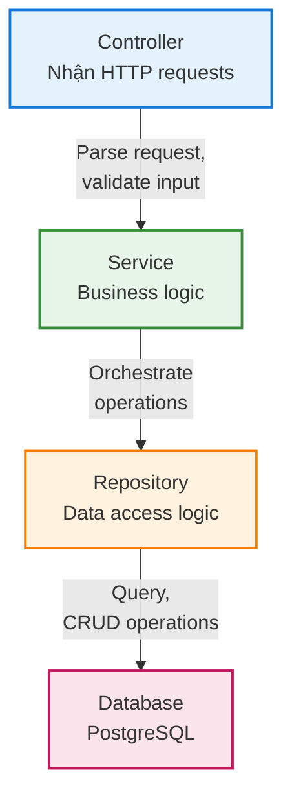
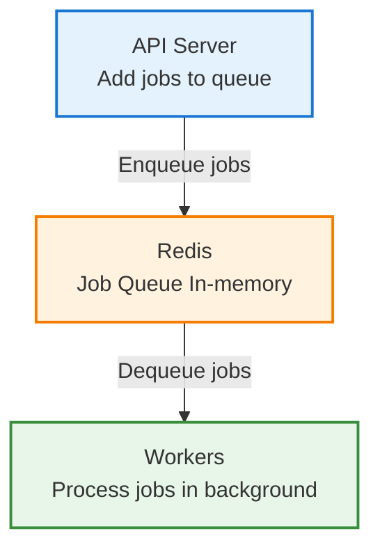

# **Chương I. TỔNG QUAN**

## **1\. Giới thiệu đề tài**

### **1.1. Bối cảnh và động lực thực hiện**

Trong bối cảnh xã hội hiện đại, việc quản lý thời gian hiệu quả đã trở thành một kỹ năng thiết yếu đối với mọi người, đặc biệt là sinh viên, nhân viên văn phòng và các chuyên gia. Theo khảo sát của Microsoft (2022), một người dùng trung bình dành khoảng 11 giờ mỗi tuần để quản lý và sắp xếp lịch trình cá nhân. Con số này cho thấy nhu cầu cấp thiết về một giải pháp tối ưu hóa quy trình quản lý thời gian.

Hiện nay, thị trường đã có nhiều ứng dụng quản lý lịch như Google Calendar, Outlook Calendar, Apple Calendar. Tuy nhiên, các ứng dụng này vẫn tồn tại một số hạn chế:

| Khía cạnh                           | Hạn chế                                                                                                                                                                                                      |
| :------------------------------------ | :------------------------------------------------------------------------------------------------------------------------------------------------------------------------------------------------------------- |
| **Tính tự động hóa**       | Người dùng phải tự nhập thông tin sự kiện một cách thủ công, không có khả năng đề xuất thời gian họp phù hợp tự động, thiếu tính năng phân tích và tối ưu hóa lịch trình |
| **Trải nghiệm người dùng** | Giao diện phức tạp với nhiều bước thao tác, không hỗ trợ tương tác bằng ngôn ngữ tự nhiên, thiếu tính năng quản lý độ ưu tiên công việc trực quan                               |
| **Tích hợp AI**               | Chưa tận dụng được công nghệ Large Language Models (LLMs), không có trợ lý ảo hỗ trợ quản lý lịch thông minh, thiếu khả năng hiểu ngữ cảnh và đề xuất thông minh                 |

### **1.2. Giới thiệu về Calento**

**Calento** (Calendar Intelligence Assistant) là một ứng dụng web quản lý lịch thông minh được phát triển nhằm giải quyết các vấn đề trên. Ứng dụng tích hợp công nghệ AI tiên tiến (Google Gemini) để mang đến trải nghiệm quản lý thời gian hoàn toàn mới.

**Tên gọi "Calento"** được ghép từ "Calendar" (lịch) và "Intelligence" (thông minh), thể hiện tầm nhìn của nhóm về một hệ thống lịch có khả năng tự động hóa và hỗ trợ người dùng một cách thông minh.

**Các tính năng chính:**

| Tính năng                           | Mô tả                                                                                                                                                                                                                                                                         |
| :------------------------------------ | :------------------------------------------------------------------------------------------------------------------------------------------------------------------------------------------------------------------------------------------------------------------------------ |
| **AI-Powered Scheduling**       | Trợ lý ảo Gemini AI hiểu và xử lý ngôn ngữ tự nhiên tiếng Việt và tiếng Anh, tự động tạo sự kiện chỉ bằng cách gõ chat, phân tích lịch trống và đề xuất thời gian họp tối ưu, hỗ trợ function calling để thực hiện các hành động |
| **Google Calendar Sync**        | Kết nối và đồng bộ hai chiều với Google Calendar, sử dụng OAuth 2.0 để đảm bảo bảo mật, nhận thông báo real-time khi có thay đổi thông qua webhook                                                                                                      |
| **Priority Management**         | Bảng Kanban trực quan với 4 cấp độ ưu tiên (Critical, High, Medium, Low), drag-and-drop để thay đổi độ ưu tiên, quản lý tập trung các loại công việc                                                                                                     |
| **Booking Links**               | Tạo liên kết công khai để đặt lịch hẹn, tự động tìm các khung giờ trống, tùy chỉnh thời lượng cuộc hẹn và khoảng thời gian đệm, gửi email xác nhận tự động                                                                                   |
| **Multi-channel Notifications** | Nhận thông báo qua email, tích hợp Slack để nhận thông báo trên workspace, hỗ trợ webhook cho các hệ thống bên ngoài                                                                                                                                          |

### **1.3. Mối liên hệ với môn học**

Đề tài **"Xây dựng Calendar Assistant Web"** có mối liên hệ chặt chẽ với nội dung môn học **Công nghệ Web và ứng dụng (SE347)** thông qua việc áp dụng các kiến thức đã học:

Về kiến trúc web, dự án áp dụng mô hình Client-Server architecture với thiết kế RESTful API bao gồm hơn 78 endpoints, được xây dựng theo kiến trúc 3 lớp gồm Presentation Layer, Business Logic Layer và Data Access Layer.

Về công nghệ Frontend, nhóm sử dụng Next.js 15 framework với App Router, triển khai các kỹ thuật Server-Side Rendering (SSR) và Static Site Generation (SSG), đồng thời áp dụng component-based architecture với React 18.

Về công nghệ Backend, hệ thống được xây dựng API server với NestJS framework, thiết kế database với PostgreSQL, và implement authentication sử dụng JWT cùng OAuth 2.0.

Về tích hợp bên thứ ba, dự án tích hợp Google Calendar API, sử dụng Google Gemini AI API, và kết nối với SMTP/SendGrid cho email service.

Về real-time communication, hệ thống triển khai webhook system để nhận notifications, background job processing với BullMQ queue, và dự kiến mở rộng WebSocket cho chat real-time trong tương lai.

## **2\. Lý do chọn đề tài**

### **2.1. Tính thực tiễn cao**

Đề tài được lựa chọn dựa trên nhu cầu thực tế về quản lý thời gian trong cuộc sống hàng ngày:

Nhu cầu quản lý thời gian hiệu quả là thiết yếu đối với nhiều đối tượng người dùng. Sinh viên cần quản lý lịch học, deadline bài tập và lịch thi một cách khoa học. Nhân viên văn phòng cần sắp xếp cuộc họp và công việc hàng ngày một cách hợp lý. Freelancer cần quản lý lịch hẹn với khách hàng chuyên nghiệp. Nhìn chung, mọi người đều có nhu cầu tối ưu hóa thời gian trong ngày để nâng cao hiệu suất làm việc.

**Hạn chế của các giải pháp hiện tại:**

Các ứng dụng quản lý lịch phổ biến như Google Calendar và Outlook Calendar vẫn còn những hạn chế đáng kể. Thứ nhất, các ứng dụng này không có tính tự động hóa cao, người dùng phải nhập thủ công mọi thông tin. Thứ hai, chúng thiếu tính thông minh trong việc đề xuất thời gian phù hợp cho các cuộc họp. Thứ ba, giao diện phức tạp với nhiều bước thao tác để tạo một sự kiện đơn giản. Cuối cùng, các ứng dụng này thiếu tích hợp AI và chưa tận dụng được công nghệ AI hiện đại.

**Khả năng áp dụng thực tế:**

Sau khi hoàn thành, ứng dụng có thể được sử dụng cho nhiều mục đích khác nhau. Cá nhân có thể sử dụng để quản lý công việc hàng ngày một cách hiệu quả. Các nhóm và team có thể áp dụng để sắp xếp cuộc họp một cách tối ưu. Doanh nghiệp nhỏ có thể triển khai để quản lý lịch làm việc tập trung. Hơn nữa, ứng dụng có thể được mở rộng thêm các tính năng để phục vụ nhu cầu cụ thể của từng đối tượng người dùng.

### **2.2. Phù hợp với nội dung môn học**

Đề tài cho phép nhóm áp dụng đầy đủ kiến thức đã học trong môn **Công nghệ Web và ứng dụng**:

Dự án cho phép nhóm áp dụng đầy đủ kiến thức lý thuyết về kiến trúc web, bao gồm việc hiểu và triển khai mô hình Client-Server cùng RESTful API. Trong phát triển Frontend, nhóm áp dụng React, Next.js framework và component lifecycle. Về Backend, nhóm xây dựng API với NestJS và xử lý business logic. Về Database, nhóm thiết kế schema, tối ưu hóa query và indexing. Ngoài ra, dự án còn áp dụng kiến thức về Authentication bao gồm JWT tokens, OAuth 2.0 và session management, cùng với API Design theo RESTful principles, versioning và documentation.

**Sử dụng công nghệ hiện đại:**

Dự án sử dụng các framework và thư viện hiện đại được giảng dạy trong môn học. Về Frontend, nhóm sử dụng Next.js 15, React 18 và TanStack Query cho state management. Về Backend, nhóm sử dụng NestJS (Node.js framework) với TypeScript. Về Database, hệ thống sử dụng PostgreSQL cho SQL database và Redis cho caching. Về Styling, nhóm áp dụng Tailwind CSS là utility-first CSS framework.

**Thực hành design patterns:**

Dự án áp dụng các design patterns quan trọng trong web development. Repository Pattern được sử dụng để tách biệt data access logic. Service Layer Pattern giúp tổ chức business logic một cách rõ ràng. DTO Pattern được áp dụng cho data transfer objects trong API. Dependency Injection được sử dụng để quản lý dependencies trong NestJS. Observer Pattern được triển khai cho webhook notifications và event handling.

### **2.3. Cơ hội học hỏi công nghệ mới**

Đề tài tạo cơ hội tìm hiểu các công nghệ tiên tiến ngoài nội dung cơ bản của môn học:

Về công nghệ AI, dự án tích hợp Google Gemini AI là Large Language Model (LLM), sử dụng Function Calling cho phép AI thực hiện các hành động cụ thể, áp dụng Prompt Engineering để thiết kế prompts giúp AI hiểu chính xác yêu cầu, và xử lý ngôn ngữ tự nhiên tiếng Việt và tiếng Anh.

Về tích hợp dịch vụ bên thứ ba, hệ thống kết nối với Google Calendar API sử dụng OAuth 2.0 cho Calendar Events management, tích hợp Email Services thông qua SMTP và SendGrid API, và dự kiến tích hợp Slack cho webhook notifications trong tương lai.

Về hệ thống real-time, dự án triển khai Webhook System để nhận thông báo real-time từ Google Calendar, Background Jobs sử dụng queue system với BullMQ và Redis, và Event-driven Architecture cho xử lý sự kiện bất đồng bộ.

Về DevOps và Deployment, dự án sử dụng Docker cho containerization trong cả development và production, CI/CD với GitHub Actions để tự động test và deploy, và các công cụ Monitoring cho logging, error tracking và performance monitoring.

Dự án **Calento** hướng đến các mục tiêu cụ thể sau:

**Mục tiêu chính:**

1. **Xây dựng ứng dụng web hoàn chỉnh với AI assistant**: Phát triển ứng dụng quản lý lịch đầy đủ chức năng, tích hợp AI chatbot hỗ trợ tương tác bằng ngôn ngữ tự nhiên, và đảm bảo giao diện thân thiện, responsive trên mọi thiết bị.
2. **Áp dụng kiến thức môn học vào thực tế**: Triển khai kiến trúc Client-Server đầy đủ, xây dựng RESTful API theo chuẩn, implement authentication và authorization, thiết kế database tối ưu, và quản lý state cùng data flow hiệu quả.
3. **Tìm hiểu và áp dụng các công nghệ mới**: Tích hợp AI API (Google Gemini) với function calling, triển khai webhook system để nhận real-time notifications, sử dụng queue system (BullMQ) cho background jobs, và áp dụng các best practices trong web development.
4. **Đảm bảo chất lượng code**: Tuân thủ clean architecture principles, sử dụng TypeScript strict mode cho type safety, viết unit tests và integration tests, code review và maintain coding standards, cùng với tài liệu hóa code và API.

**Mục tiêu phụ:**

Các mục tiêu phụ bao gồm học cách làm việc nhóm với Git và GitHub, hiểu quy trình phát triển phần mềm từ đầu đến cuối, tạo portfolio project để phục vụ học tập và tìm việc, và có thể mở rộng ứng dụng sau môn học.

### **3.2. Phạm vi thực hiện**

Để đảm bảo hoàn thành đúng tiến độ môn học, nhóm xác định rõ phạm vi thực hiện như sau:

**Các tính năng ĐƯỢC triển khai:**

**1. Quản lý sự kiện (Event Management):** Hệ thống hỗ trợ tạo, sửa, xóa sự kiện (CRUD operations), quản lý sự kiện định kỳ (recurring events) với RRULE standard, tìm kiếm và lọc sự kiện theo nhiều tiêu chí, quản lý attendees (người tham dự), cấu hình reminders (nhắc nhở), và thêm địa điểm cùng mô tả chi tiết.

**2. AI Chatbot:** Giao diện chat tương tác, xử lý ngôn ngữ tự nhiên (tiếng Việt và tiếng Anh), function calling để thực hiện actions (tạo/sửa/xóa sự kiện), kiểm tra thời gian trống (availability checking), đề xuất thời gian họp tối ưu, và lưu lịch sử hội thoại.

**3. Google Calendar Integration:** Kết nối với Google Calendar qua OAuth 2.0, đồng bộ hai chiều (sync) sự kiện, webhook notifications khi có thay đổi, và tự động refresh access tokens.

**4. Priority Management:** Bảng Kanban với drag-and-drop, 4 cấp độ ưu tiên (Critical, High, Medium, Low), quản lý tasks, booking links, habits, và lưu trữ vị trí items trong database.

**5. Booking Links (Scheduling Links):** Tạo liên kết đặt lịch công khai, tùy chỉnh thời lượng cuộc hẹn, tự động tìm khung giờ trống, guest booking form, và email confirmation tự động.

**6. Authentication & Authorization:** Đăng ký/Đăng nhập với email và password, Google OAuth 2.0 login, JWT token-based authentication, cookie-based session management, và password reset functionality.

**7. Email Notifications:** Email xác nhận booking, email nhắc nhở sự kiện, welcome email cho user mới, và template system với Handlebars.

**8. Background Job Processing:** Queue system với BullMQ và Redis, email sending jobs, calendar sync jobs, và auto-retry với exponential backoff.

**Các tính năng KHÔNG triển khai (ngoài phạm vi):**

Về Mobile Application, dự án chỉ phát triển web application với responsive design cho mobile browser, không phát triển native iOS/Android app. Về Video Conferencing Integration, không tích hợp Zoom hay Microsoft Teams, chỉ hỗ trợ Google Meet links có sẵn từ Google Calendar. Về Payment Processing, không có tính năng thanh toán và ứng dụng hoàn toàn miễn phí. Về Advanced Team Features, không có shared calendars cho teams, round-robin scheduling, hay meeting polls. Về Advanced Analytics, không có dashboard phân tích chi tiết, chỉ có thống kê cơ bản về events và bookings.

### **3.3. Giới hạn và ràng buộc**

Về thời gian, dự án có thời gian thực hiện 12 tuần theo kế hoạch môn học, phải hoàn thành các tính năng core trước deadline, và ưu tiên tính năng thiết yếu trước các tính năng bổ sung.

Về nguồn lực, nhóm gồm 4 thành viên sinh viên, không có kinh phí để sử dụng dịch vụ trả phí, và sử dụng free tier của các services (Google AI, email).

Về công nghệ, dự án chỉ sử dụng công nghệ web (không mobile native), database là PostgreSQL (open source), và hosting sử dụng free tier hoặc student account.

Về bảo mật, hệ thống tuân thủ OAuth 2.0 standards, mã hóa passwords với bcrypt, yêu cầu HTTPS cho production, và không lưu trữ thông tin nhạy cảm dạng plain text.

## **4\. Cơ sở lý thuyết và công nghệ sử dụng**

Phần này giới thiệu các công nghệ và khái niệm chính được sử dụng trong dự án, giúp hiểu rõ hơn về cách thức hoạt động của hệ thống.

### **4.1. Công nghệ Backend (Phía máy chủ)**

#### **4.1.1. NestJS Framework**

**NestJS là gì?**

NestJS là một framework (khung phát triển) để xây dựng các ứng dụng web phía server bằng Node.js. Framework này sử dụng TypeScript (ngôn ngữ lập trình mở rộng của JavaScript) và được thiết kế theo kiến trúc modular (chia thành các module nhỏ).

**Tại sao chọn NestJS?**

NestJS được chọn vì nhiều lý do. Thứ nhất, framework này dễ tổ chức code bằng cách chia ứng dụng thành các module nhỏ (auth, events, users...), mỗi module quản lý một chức năng riêng. Thứ hai, việc sử dụng TypeScript giúp kiểm tra lỗi ngay khi viết code và giảm bugs. Thứ ba, NestJS có sẵn các tính năng như xác thực, validation dữ liệu và logging. Cuối cùng, cú pháp giống Angular và có nhiều tài liệu học tập giúp dễ học.

**Ví dụ cấu trúc module:**

```
EventModule (quản lý sự kiện)
  ├── EventController (xử lý API requests)
  ├── EventService (business logic)
  └── EventRepository (truy vấn database)
```

**Cách hoạt động:**

1. Client gửi HTTP request đến server
2. Controller nhận request và chuyển cho Service
3. Service xử lý logic và gọi Repository
4. Repository tương tác với database
5. Kết quả trả về client theo chiều ngược lại

#### **4.1.2. PostgreSQL Database**

**PostgreSQL là gì?**

PostgreSQL (thường gọi là Postgres) là một hệ quản trị cơ sở dữ liệu quan hệ (RDBMS) miễn phí và mã nguồn mở. Dữ liệu được lưu trữ dưới dạng bảng (table) với các hàng (rows) và cột (columns).

**Tại sao chọn PostgreSQL?**

PostgreSQL được chọn vì nhiều ưu điểm. Đầu tiên, đây là hệ thống open source hoàn toàn miễn phí. Thứ hai, PostgreSQL rất đáng tin cậy trong việc đảm bảo dữ liệu không bị mất hoặc sai lệch. Thứ ba, hệ thống linh hoạt hỗ trợ cả dữ liệu có cấu trúc (SQL) và không cấu trúc (JSONB). Cuối cùng, PostgreSQL rất phổ biến với nhiều tài liệu và cộng đồng hỗ trợ lớn.

Trong dự án, bảng `events` lưu thông tin sự kiện bao gồm `id` (mã định danh duy nhất), `title` (tiêu đề sự kiện như "Họp team"), `start_time` (thời gian bắt đầu), `end_time` (thời gian kết thúc), và `user_id` (người tạo sự kiện).

PostgreSQL đảm bảo tính toàn vẹn thông qua ACID properties. Atomicity đảm bảo một thao tác hoặc thành công hoàn toàn, hoặc thất bại hoàn toàn. Consistency đảm bảo dữ liệu luôn ở trạng thái hợp lệ. Isolation đảm bảo các thao tác không ảnh hưởng lẫn nhau. Durability đảm bảo dữ liệu được lưu vĩnh viễn sau khi commit.

#### **4.1.3. Redis & BullMQ**

**Redis là gì?**

Redis là một cơ sở dữ liệu lưu trữ dữ liệu trong bộ nhớ RAM (in-memory), giúp truy xuất dữ liệu cực kỳ nhanh. Thường được dùng để cache (lưu tạm) dữ liệu thường xuyên truy cập.

**BullMQ là gì?**

BullMQ là thư viện giúp quản lý hàng đợi công việc (job queue), cho phép xử lý các tác vụ nền (background tasks) mà không làm chậm ứng dụng chính.

**Ứng dụng trong Calento:**

Trong Calento, Redis được sử dụng cho hai mục đích chính. Thứ nhất là Caching (lưu tạm) để lưu danh sách sự kiện của user giúp load nhanh hơn, cache thông tin user đã đăng nhập, và giảm số lần truy vấn database. Thứ hai là Queue System (hệ thống hàng đợi) với Email jobs để gửi email xác nhận booking mà không làm user phải chờ, Sync jobs để đồng bộ với Google Calendar chạy nền, và Webhook jobs để xử lý notifications từ Google.

**Ví dụ cụ thể:**

Khi user book một cuộc hẹn:

1. Server tạo booking ngay lập tức → User thấy kết quả
2. Server thêm job "gửi email" vào queue
3. Worker (bộ xử lý) lấy job từ queue và gửi email
4. Nếu gửi thất bại, tự động thử lại sau 2 phút

### **4.2. Công nghệ Frontend (Phía người dùng)**

#### **4.2.1. Next.js 15 Framework**

**Next.js là gì?**

Next.js là một framework xây dựng trên React, giúp tạo các ứng dụng web hiện đại với nhiều tính năng tối ưu sẵn có. React là thư viện JavaScript phổ biến nhất để xây dựng giao diện người dùng.

**Tại sao chọn Next.js?**

Next.js được chọn vì nhiều lý do. Thứ nhất, SEO tốt nhờ khả năng render HTML trên server giúp Google dễ dàng index. Thứ hai, performance cao với tốc độ load trang nhanh nhờ optimization tự động. Thứ ba, Developer Experience tốt với hot reload và TypeScript support giúp dễ phát triển. Cuối cùng, đây là framework full-stack có thể viết cả frontend và backend trong một project.

**Các tính năng chính:**

**1. App Router (Định tuyến dựa trên file):**

Cấu trúc thư mục tự động tạo routes:

| Đường dẫn file                  | Route tương ứng      | Mô tả                    |
| :---------------------------------- | :---------------------- | :------------------------- |
| `app/page.tsx`                    | `/`                   | Trang chủ của ứng dụng |
| `app/login/page.tsx`              | `/login`              | Trang đăng nhập         |
| `app/dashboard/page.tsx`          | `/dashboard`          | Trang dashboard chính     |
| `app/dashboard/calendar/page.tsx` | `/dashboard/calendar` | Trang quản lý lịch      |

**2. Server-Side Rendering (SSR):**

Server-Side Rendering (SSR) cho phép render HTML trên server trước khi gửi cho client, giúp trang load nhanh hơn và SEO tốt hơn. Ví dụ, trang public booking cần SEO để Google index.

**3. Server Components:**

Server Components cho phép component render trên server, giảm code JavaScript gửi đến browser, giúp trang load nhanh hơn đặc biệt trên mobile.

**4. Image Optimization:**

Image Optimization tự động tối ưu hóa hình ảnh (resize, format), hỗ trợ lazy loading (chỉ load ảnh khi cần), và hỗ trợ responsive images.

#### **4.2.2. React 18**

**React là gì?**

React là thư viện JavaScript để xây dựng giao diện người dùng bằng cách chia nhỏ thành các components (thành phần) có thể tái sử dụng.

**Component-based Architecture:**

Cấu trúc component trong Calento được tổ chức theo hierarchy:

| Component          | Vai trò                                            | Component con                         |
| :----------------- | :-------------------------------------------------- | :------------------------------------ |
| `CalendarPage`   | Component cha chứa toàn bộ trang lịch           | CalendarHeader, EventList, EventModal |
| `CalendarHeader` | Thanh tiêu đề với nút điều hướng           | -                                     |
| `EventList`      | Danh sách hiển thị các sự kiện                | EventCard                             |
| `EventCard`      | Thẻ hiển thị thông tin một sự kiện đơn lẻ | -                                     |
| `EventModal`     | Form modal để tạo hoặc chỉnh sửa sự kiện    | -                                     |

**Lợi ích:**
Component-based architecture mang lại nhiều lợi ích. Thứ nhất là tái sử dụng, viết một lần và dùng nhiều nơi. Thứ hai là dễ bảo trì vì mỗi component quản lý logic riêng. Thứ ba là hiệu suất cao vì React chỉ update phần UI thay đổi.

#### **4.2.3. TanStack Query (React Query)**

**TanStack Query là gì?**

TanStack Query là thư viện giúp quản lý data từ API một cách thông minh, tự động cache và đồng bộ dữ liệu.

**Giải quyết vấn đề gì?**

Thông thường khi fetch API, phải quản lý:
Thông thường khi fetch API, phải quản lý loading state (đang tải), error state (lỗi), cache data (lưu tạm), và refetch khi data cũ. TanStack Query làm tất cả tự động!

**Cơ chế hoạt động của TanStack Query:**

Khi sử dụng hook `useEvents()` để fetch danh sách sự kiện, TanStack Query tự động thực hiện các bước:

| Bước | Hành động                        | Lợi ích                                        |
| :----- | :---------------------------------- | :----------------------------------------------- |
| 1      | Cache kết quả lần đầu tiên    | Lưu trữ dữ liệu để sử dụng lại          |
| 2      | Load từ cache cho lần sau         | Tốc độ load nhanh, không cần chờ API       |
| 3      | Refetch ở background               | Cập nhật dữ liệu mới mà không blocking UI |
| 4      | Invalidate cache khi có thay đổi | Đảm bảo dữ liệu luôn đồng bộ            |

**Lợi ích:**
TanStack Query mang lại nhiều lợi ích. Thứ nhất là giảm request vì không gọi API trùng lặp. Thứ hai là UX tốt với tốc độ load nhanh từ cache. Thứ ba là automatic sync giúp data luôn được cập nhật. Cuối cùng là optimistic updates cho phép UI update ngay mà không chờ API.

#### **4.2.4. Zustand State Management**

**Zustand là gì?**

Zustand là thư viện quản lý state (trạng thái) toàn cục của ứng dụng, đơn giản hơn nhiều so với Redux.

**State là gì?**

State là dữ liệu của ứng dụng tại một thời điểm. Ví dụ:
State là dữ liệu của ứng dụng tại một thời điểm. Ví dụ như user đã đăng nhập chưa, calendar đang hiển thị view nào (day/week/month), hay theme là dark mode hay light mode.

**Tại sao cần State Management?**

Một số state cần truy cập từ nhiều component khác nhau:
Một số state cần truy cập từ nhiều component khác nhau. Ví dụ, user info cần hiển thị ở Navbar (hiển thị avatar) và Sidebar (hiển thị tên). Calendar view cần hiển thị ở Header (hiển thị tháng/năm) và Main calendar.

**Cấu trúc Calendar Settings Store trong Calento:**

Zustand store quản lý các cài đặt hiển thị lịch:

| State            | Giá trị mặc định | Mô tả                              |
| :--------------- | :-------------------- | :----------------------------------- |
| `view`         | 'month'               | Chế độ xem lịch (month/week/day) |
| `weekStartsOn` | 'monday'              | Ngày bắt đầu tuần               |
| `timeFormat`   | '24h'                 | Định dạng giờ (24h hoặc 12h)    |

**Actions (Hành động):**

| Action            | Tham số       | Chức năng                    |
| :---------------- | :------------- | :----------------------------- |
| `setView`       | view: string   | Thay đổi chế độ xem lịch |
| `setTimeFormat` | format: string | Thay đổi định dạng giờ   |

Các component có thể truy cập và cập nhật state này thông qua hook `useCalendarSettings()`.

**Lợi ích:**
Zustand mang lại nhiều lợi ích. Thứ nhất là đơn giản với ít code hơn Redux rất nhiều. Thứ hai là TypeScript type-safe giúp dễ refactor. Thứ ba là persistence cho phép lưu vào localStorage tự động. Cuối cùng là DevTools giúp debug dễ dàng.

### **4.3. AI và Large Language Models**

#### **4.3.1. Google Gemini AI**

**Large Language Model (LLM) là gì?**

LLM là mô hình AI được huấn luyện trên lượng dữ liệu khổng lồ, có khả năng hiểu và tạo ra ngôn ngữ tự nhiên như con người. Ví dụ phổ biến: ChatGPT, Google Gemini, Claude.

**Google Gemini AI:**

Gemini là LLM của Google, được tích hợp vào Calento để tạo ra trợ lý ảo thông minh.

**Tại sao chọn Gemini?**

Gemini được chọn vì nhiều lý do. Thứ nhất, Google cung cấp free tier miễn phí cho developers. Thứ hai, Gemini hỗ trợ đa ngôn ngữ tốt cả tiếng Việt và tiếng Anh. Thứ ba, Function Calling là tính năng quan trọng cho chatbot. Cuối cùng, Gemini có fast response phản hồi nhanh giúp UX tốt.

**Function Calling - Tính năng chính:**

Function Calling cho phép AI không chỉ trả lời text, mà còn **thực hiện hành động** trong ứng dụng.

**Ví dụ cụ thể:**

**Kịch bản 1: Tạo sự kiện**

```
User: "Tạo cuộc họp ngày mai lúc 2 giờ chiều"

→ Gemini AI phân tích:
  - Action: createEvent
  - title: "Cuộc họp"
  - start_time: "2024-11-10T14:00:00"
  - end_time: "2024-11-10T15:00:00"

→ Backend thực thi function createEvent()
→ Sự kiện được tạo trong database
→ AI trả lời: "Tôi đã tạo cuộc họp lúc 2 giờ chiều ngày mai."
```

**Kịch bản 2: Kiểm tra lịch trống**

```
User: "Tôi rảnh vào thứ 3 tuần sau không?"

→ Gemini AI:
  - Action: checkAvailability
  - start_date: "2024-11-12T00:00:00"
  - end_date: "2024-11-12T23:59:59"

→ Backend query database tìm events
→ AI phân tích kết quả
→ AI trả lời: "Bạn rảnh từ 9h-12h và 2h-5h chiều."
```

**Danh sách Functions có sẵn:**

1. `createEvent`: Tạo sự kiện mới
2. `searchEvents`: Tìm kiếm sự kiện
3. `checkAvailability`: Kiểm tra thời gian trống
4. `updateEvent`: Cập nhật sự kiện
5. `deleteEvent`: Xóa sự kiện
6. `createTask`: Tạo task
7. `createLearningPlan`: Tạo kế hoạch học

#### **4.3.2. Prompt Engineering**

**Prompt Engineering là gì?**

Prompt Engineering là kỹ thuật thiết kế "câu lệnh" (prompts) cho AI để nhận được kết quả chính xác nhất.

**System Prompt trong Calento:**

System Prompt là "hướng dẫn" ban đầu cho AI về vai trò và cách hoạt động.

**Ví dụ System Prompt:**

```
Bạn là Calento AI, trợ lý lịch thông minh.

Vai trò của bạn:
- Giúp người dùng quản lý lịch qua chat
- Luôn lịch sự và thân thiện
- Trả lời ngắn gọn, dễ hiểu

Quy tắc:
- LUÔN sử dụng context.current_date để biết ngày hiện tại
- KHI user nói "ngày mai", tính toán dựa trên current_date
- KHÔNG bao giờ hỏi user "hôm nay là ngày nào"
- SỬ DỤNG functions để thực hiện actions

Available Functions:
- createEvent: Tạo sự kiện
- checkAvailability: Kiểm tra lịch trống
...
```

**Context Management (Quản lý ngữ cảnh):**

Context là thông tin AI cần để trả lời chính xác:

**1. Calendar Context:**

- Ngày giờ hiện tại: `2024-11-09 18:30`
- Timezone: `Asia/Ho_Chi_Minh`
- Sự kiện sắp tới: Danh sách 5 events sắp diễn ra
- User preferences: Giờ làm việc, ngôn ngữ ưa thích

**2. Conversation History:**

- Lưu 10 messages gần nhất
- AI nhớ ngữ cảnh cuộc hội thoại

**Ví dụ:**

```
User: "Tạo cuộc họp với team"
AI: "Cuộc họp khi nào?"
User: "Ngày mai 2 giờ"  ← AI nhớ "cuộc họp với team"
AI: [Tạo event "Cuộc họp với team" vào ngày mai 2h]
```

### **4.4. Authentication & Authorization (Xác thực và phân quyền)**

#### **4.4.1. JWT (JSON Web Tokens)**

**JWT là gì?**

JWT (phát âm là "jot") là một chuẩn để tạo ra "token" (mã thông báo) dùng để xác thực người dùng. Token này chứa thông tin về user và được mã hóa an toàn.

**Tại sao cần JWT?**

Khi user đăng nhập, server cần cách để "nhớ" user đã đăng nhập. Có 2 cách phổ biến:

1. **Session-based**: Lưu thông tin trên server → Tốn bộ nhớ khi nhiều user
2. **Token-based (JWT)**: Lưu token ở client → Server không cần lưu gì

**Cấu trúc JWT:**

JWT gồm 3 phần, phân cách bởi dấu chấm:

```
Header.Payload.Signature

Ví dụ:
eyJhbGc.eyJzdWI.SflKxwRJ
```

**1. Header (Phần đầu):**

| Trường | Giá trị | Mô tả                         |
| :------- | :-------- | :------------------------------ |
| `alg`  | "HS256"   | Thuật toán mã hóa sử dụng |
| `typ`  | "JWT"     | Loại token                     |

**2. Payload (Dữ liệu):**

| Trường     | Giá trị ví dụ  | Mô tả                                              |
| :----------- | :----------------- | :--------------------------------------------------- |
| `sub`      | "user-123"         | User ID - định danh người dùng                  |
| `email`    | "user@example.com" | Email của người dùng                             |
| `username` | "john_doe"         | Tên đăng nhập                                    |
| `type`     | "access"           | Loại token (access hoặc refresh)                   |
| `iat`      | 1699545600         | Issued at - thời điểm tạo token (Unix timestamp) |
| `exp`      | 1699549200         | Expiration - thời điểm hết hạn (Unix timestamp) |

**3. Signature** (Chữ ký):

- Mã hóa Header + Payload + Secret Key
- Dùng để verify token không bị giả mạo

**Quy trình xác thực:**

**Quy trình đăng nhập:**

| Bước | Hành động          | Chi tiết                                             |
| :----- | :-------------------- | :---------------------------------------------------- |
| 1      | User gửi thông tin  | Email và password được gửi đến server          |
| 2      | Server xác thực     | Kiểm tra thông tin và tạo JWT token nếu hợp lệ |
| 3      | Server trả về token | JWT token được gửi về cho client                 |
| 4      | Client lưu token     | Token được lưu trong localStorage hoặc cookie    |

**Quy trình gọi API:**

| Bước | Hành động            | Chi tiết                                                     |
| :----- | :---------------------- | :------------------------------------------------------------ |
| 1      | Client gửi request     | Kèm JWT token trong header `Authorization: Bearer <token>` |
| 2      | Server xác thực token | Kiểm tra tính hợp lệ và thời hạn của token            |
| 3      | Token hợp lệ          | Server xử lý request và trả về dữ liệu                 |
| 4      | Token không hợp lệ   | Server trả về lỗi 401 Unauthorized                         |

**Token Types trong Calento:**

**1. Access Token:**

- Thời gian sống: 1 giờ
- Dùng để gọi API
- Hết hạn nhanh → Bảo mật cao

**2. Refresh Token:**

- Thời gian sống: 7 ngày
- Dùng để lấy Access Token mới
- Lưu trong HTTP-only cookie → An toàn hơn

#### **4.4.2. OAuth 2.0 Protocol**

**OAuth 2.0 là gì?**

OAuth 2.0 là một chuẩn cho phép ứng dụng truy cập dữ liệu của user trên dịch vụ khác (Google, Facebook...) mà KHÔNG CẦN password.

**Tại sao cần OAuth?**

Thay vì:

- User nhập password Google vào app của bạn (nguy hiểm!)

OAuth cho phép:

- User đăng nhập trên trang Google
- Google xác nhận và cấp quyền cho app
- App nhận "access token" để truy cập data

**Google OAuth Flow (Luồng xác thực):**

**Quy trình Google OAuth Flow:**

| Bước      | Hành động                      | Chi tiết                                                                                                                                                        |
| :---------- | :-------------------------------- | :--------------------------------------------------------------------------------------------------------------------------------------------------------------- |
| **1** | User click "Login with Google"    | App redirect user đến trang xác thực Google với các tham số:`client_id`, `redirect_uri`, `scope` (email, profile, calendar), `response_type=code` |
| **2** | User đăng nhập và cấp quyền | User thấy trang: "Calento muốn truy cập email và calendar của bạn" và click "Cho phép"                                                                   |
| **3** | Google redirect về app           | Google chuyển hướng về `https://calento.com/callback` kèm theo authorization code                                                                         |
| **4** | App đổi code lấy tokens        | App gửi POST request đến `https://oauth2.googleapis.com/token` với code, client_id, client_secret để nhận access_token và refresh_token                |
| **5** | Sử dụng access_token            | App sử dụng access_token trong header `Authorization: Bearer <token>` để gọi Google Calendar API                                                          |

**Dữ liệu nhận được từ Google (Bước 4):**

| Trường          | Ví dụ                  | Mô tả                                         |
| :---------------- | :----------------------- | :---------------------------------------------- |
| `access_token`  | "ya29.a0AfH6SM..."       | Token để truy cập API, có thời hạn ngắn  |
| `refresh_token` | "1//0gF5_xYz..."         | Token để lấy access_token mới khi hết hạn |
| `expires_in`    | 3600                     | Thời gian sống của access_token (giây)      |
| `scope`         | "email profile calendar" | Các quyền đã được cấp                   |

**Lợi ích của OAuth 2.0:**

- **Bảo mật**: Không lưu password của user
- **Phân quyền**: User chỉ cấp quyền cần thiết (email, calendar)
- **Thu hồi**: User có thể thu hồi quyền bất cứ lúc nào
- **Chuẩn hóa**: Dùng cho nhiều dịch vụ (Google, Facebook, GitHub...)

**Trong Calento:**

OAuth được dùng cho 2 mục đích:

1. **Đăng nhập**: Login with Google thay vì tạo account mới
2. **Google Calendar Sync**: Truy cập Google Calendar để đồng bộ sự kiện

### **4.5. RESTful API Design**

#### **4.5.1. REST là gì?**

**REST** (REpresentational State Transfer) là một kiến trúc thiết kế API, trong đó:

- Mỗi **resource** (tài nguyên) có một **URL** riêng
- Dùng **HTTP methods** chuẩn để thao tác
- Server **không lưu trạng thái** của client (stateless)

**Ví dụ dễ hiểu:**

Tưởng tượng API như một thư viện:

- **GET**: Đọc/mượn sách (không thay đổi gì)
- **POST**: Thêm sách mới vào thư viện
- **PUT/PATCH**: Sửa thông tin sách
- **DELETE**: Xóa sách khỏi thư viện

#### **4.5.2. HTTP Methods trong Calento**

| Method           | Mục đích           | Ví dụ                                                                                       | Kết quả                                                                           |
| :--------------- | :-------------------- | :-------------------------------------------------------------------------------------------- | :---------------------------------------------------------------------------------- |
| **GET**    | Lấy dữ liệu        | `GET /api/events<br>``GET /api/events/123<br>``GET /api/events?date=2024-11-09`         | Lấy danh sách events`<br>`Lấy event có id = 123`<br>`Lấy events theo ngày |
| **POST**   | Tạo mới             | `POST /api/events<br>`Body: `{"title": "Họp team", "start_time": "2024-11-10T14:00:00"}` | Tạo event mới, trả về event đã tạo                                           |
| **PATCH**  | Cập nhật một phần | `PATCH /api/events/123<br>`Body: `{"title": "Họp team (Updated)"}`                       | Chỉ sửa title, giữ nguyên các field khác                                      |
| **PUT**    | Thay thế toàn bộ   | `PUT /api/events/123<br>`Body: `{"title": "New title", "start_time": "...", ...}`         | Thay thế toàn bộ event với dữ liệu mới                                       |
| **DELETE** | Xóa                  | `DELETE /api/events/123`                                                                    | Xóa event có id = 123                                                             |

#### **4.5.3. URL Structure (Cấu trúc URL)**

**Chuẩn REST:**

```
/api/resource                 → Collection (nhiều items)
/api/resource/:id             → Single item
/api/resource/:id/sub-resource → Sub-resource
```

**Ví dụ trong Calento:**

```
/api/events                   → Tất cả events
/api/events/123               → Event 123
/api/events/123/attendees     → Người tham dự event 123
/api/users/456/events         → Events của user 456
/api/booking-links            → Tất cả booking links
/api/booking-links/abc/bookings → Bookings của link abc
```

#### **4.5.4. Response Format (Định dạng trả về)**

| Trường    | Kiểu dữ liệu | Mô tả                                     |
| :---------- | :-------------- | :------------------------------------------ |
| `success` | boolean         | Trạng thái phản hồi (true/false)        |
| `data`    | object          | Dữ liệu chính trả về từ API           |
| `meta`    | object          | Thông tin bổ sung (timestamp, pagination) |

**Error Response:**

| Trường           | Kiểu dữ liệu | Mô tả                                          |
| :----------------- | :-------------- | :----------------------------------------------- |
| `success`        | boolean         | Trạng thái thất bại (false)                  |
| `error.code`     | string          | Mã lỗi định danh (ví dụ: VALIDATION_ERROR) |
| `error.message`  | string          | Thông báo lỗi chi tiết cho người dùng     |
| `error.details`  | array           | Danh sách chi tiết các lỗi (nếu có)        |
| `meta.timestamp` | string          | Thời điểm xảy ra lỗi                        |

**Paginated Response:**

| Trường            | Kiểu dữ liệu | Mô tả                                        |
| :------------------ | :-------------- | :--------------------------------------------- |
| `success`         | boolean         | Trạng thái thành công (true)               |
| `data`            | array           | Danh sách các đối tượng dữ liệu        |
| `meta.page`       | number          | Số thứ tự trang hiện tại                  |
| `meta.limit`      | number          | Số lượng mục trên mỗi trang              |
| `meta.total`      | number          | Tổng số lượng mục trong cơ sở dữ liệu |
| `meta.totalPages` | number          | Tổng số trang                                |

```

#### **4.5.5. HTTP Status Codes**

| Loại | Mã | Tên | Mô tả |
| :--- | :--- | :--- | :--- |
| **Success (2xx)** | 200 | OK | Request thành công |
| | 201 | Created | Tạo resource thành công |
| | 204 | No Content | Thành công nhưng không có data (VD: DELETE) |
| **Client Errors (4xx)** | 400 | Bad Request | Dữ liệu gửi lên không hợp lệ |
| | 401 | Unauthorized | Chưa đăng nhập |
| | 403 | Forbidden | Không có quyền truy cập |
| | 404 | Not Found | Không tìm thấy resource |
| **Server Errors (5xx)** | 500 | Internal Server Error | Lỗi server |
| | 503 | Service Unavailable | Service tạm thời không khả dụng |

#### **4.5.6. Swagger/OpenAPI Documentation**

**Swagger là gì?**

Swagger (OpenAPI) là công cụ tự động tạo tài liệu API, giúp:
- **Xem**: Danh sách tất cả APIs
- **Test**: Gọi thử API ngay trên browser
- **Generate**: Tự động tạo code client

**Ví dụ API endpoint trong Calento:**

Swagger documentation có thể truy cập tại: `https://api.calento.space/docs` (production) hoặc `http://localhost:8000/api-docs` (development)

**Ví dụ endpoint `GET /api/events`:**

| Thuộc tính | Giá trị |
| :--- | :--- |
| **Method** | GET |
| **Path** | `/api/events` |
| **Mô tả** | Lấy danh sách sự kiện với phân trang |

**Parameters (Tham số):**

| Tên | Vị trí | Kiểu | Bắt buộc | Mô tả |
| :--- | :--- | :--- | :--- | :--- |
| `page` | query | number | Không | Số thứ tự trang (mặc định: 1) |
| `limit` | query | number | Không | Số lượng items mỗi trang (mặc định: 10) |
| `start_date` | query | string | Không | Lọc sự kiện từ ngày (ISO 8601 format) |

**Responses (Phản hồi):**

| Status Code | Tên | Mô tả | Schema |
| :--- | :--- | :--- | :--- |
| 200 | Success | Trả về danh sách sự kiện thành công | PaginatedEventsResponse |
| 401 | Unauthorized | Chưa đăng nhập hoặc token không hợp lệ | ErrorResponse |
| 500 | Server Error | Lỗi server nội bộ | ErrorResponse |

**Lợi ích:**
- Tài liệu tự động, không cần viết thủ công
- Frontend dev dễ dàng hiểu API
- Test API trực tiếp mà không cần Postman
- Generate TypeScript types tự động

### **4.6. Design Patterns (Mẫu thiết kế)**

Design Patterns là các giải pháp tái sử dụng cho các vấn đề phổ biến trong thiết kế phần mềm. Trong Calento, nhóm áp dụng các patterns quan trọng để đảm bảo code dễ bảo trì và mở rộng.

#### **4.6.1. Repository Pattern**

**Repository Pattern là gì?**

Repository Pattern là một design pattern tách biệt logic truy cập dữ liệu (data access logic) khỏi business logic. Repository hoạt động như một "trung gian" giữa business logic layer và data source (database).

**Tại sao cần Repository Pattern?**

Trong các ứng dụng truyền thống, việc business logic tương tác trực tiếp với cơ sở dữ liệu thường phát sinh nhiều hạn chế đáng kể. Điển hình là tình trạng lặp lại mã nguồn khi các truy vấn tương tự được thực hiện ở nhiều nơi, gây khó khăn cho quá trình kiểm thử do sự phụ thuộc chặt chẽ vào cơ sở dữ liệu thực tế. Ngoài ra, việc bảo trì và nâng cấp hệ thống cũng trở nên phức tạp vì các câu lệnh SQL phân tán, đồng thời vi phạm nguyên lý đơn nhiệm (Single Responsibility Principle) khi một thành phần phải đảm nhiệm cả xử lý nghiệp vụ lẫn truy xuất dữ liệu.

**Kiến trúc trong Calento:**



```

```

```

```

**Các phương thức chính trong EventRepository:**

| Phương thức      | Chức năng                          | Mô tả                                                                                                                      |
| :------------------ | :----------------------------------- | :--------------------------------------------------------------------------------------------------------------------------- |
| `findByUserId`    | Tìm tất cả events của user       | Truy vấn database để lấy danh sách sự kiện của một user cụ thể, sắp xếp theo thời gian bắt đầu              |
| `findByDateRange` | Tìm events trong khoảng thời gian | Sử dụng query builder để lọc sự kiện theo user ID và khoảng thời gian cụ thể                                     |
| `hasConflict`     | Kiểm tra trùng lịch               | Kiểm tra xem có sự kiện nào trùng với khoảng thời gian đã cho hay không, hỗ trợ loại trừ một event cụ thể |

**Lợi ích của Repository Pattern:**

Repository Pattern mang lại nhiều lợi ích quan trọng. Thứ nhất, Single Source of Truth đảm bảo tất cả queries liên quan đến Event đều ở một nơi. Thứ hai, Reusability cho phép tái sử dụng queries ở nhiều services khác nhau. Thứ ba, Testability giúp dễ dàng mock repository trong unit tests. Thứ tư, Maintainability giúp dễ sửa query vì chỉ cần sửa ở một chỗ. Cuối cùng, Flexibility cho phép dễ dàng thay đổi database hoặc ORM mà không ảnh hưởng business logic.

#### **4.6.2. Service Layer Pattern**

**Service Layer Pattern là gì?**

Service Layer Pattern tập trung toàn bộ business logic vào một layer riêng biệt (service layer), tách biệt khỏi presentation layer (controllers) và data access layer (repositories).

**Nguyên tắc hoạt động:**

Service Layer hoạt động theo nguyên tắc rõ ràng. Controller chỉ xử lý HTTP concerns như parse request, validate input, và format response. Service xử lý toàn bộ business logic như validate business rules, orchestrate operations, và gọi repositories. Repository chỉ xử lý data access như query database và map entities.

**Quy trình xử lý trong EventService:**

EventService đóng vai trò trung tâm trong việc xử lý business logic liên quan đến sự kiện. Khi tạo một sự kiện mới, service thực hiện các bước sau:

1. **Validate business rules**: Kiểm tra tính hợp lệ của dữ liệu đầu vào, đảm bảo thời gian kết thúc sau thời gian bắt đầu
2. **Check conflicts**: Gọi repository để kiểm tra xem có sự kiện nào trùng lịch hay không
3. **Create event**: Lưu sự kiện vào database thông qua repository
4. **Sync to Google Calendar**: Đồng bộ sự kiện lên Google Calendar nếu user đã kết nối
5. **Schedule reminder**: Thêm job gửi email nhắc nhở vào queue nếu có cấu hình

Đối với chức năng tìm khung giờ trống (`findAvailableSlots`), service thực hiện:

1. Lấy tất cả sự kiện trong ngày từ repository
2. Định nghĩa giờ làm việc (mặc định 9h-17h)
3. Duyệt qua từng khung giờ 30 phút, kiểm tra xem có trùng với sự kiện nào không
4. Trả về danh sách các khung giờ trống phù hợp

**Vai trò của Controller:**

EventController chỉ đảm nhận các nhiệm vụ liên quan đến HTTP như nhận request, parse parameters, gọi service để xử lý logic, và format response trả về client. Controller không chứa business logic, đảm bảo nguyên tắc separation of concerns.

**Lợi ích của Service Layer Pattern:**

Service Layer Pattern mang lại nhiều lợi ích. Thứ nhất, Separation of Concerns giúp mỗi layer có trách nhiệm rõ ràng. Thứ hai, Reusability cho phép service có thể được gọi từ nhiều controllers hoặc background jobs. Thứ ba, Testability giúp dễ test business logic độc lập. Thứ tư, Transaction Management giúp dễ quản lý database transactions. Cuối cùng, Orchestration cho phép phối hợp nhiều operations phức tạp.

#### **4.6.3. DTO (Data Transfer Objects)**

**DTO là gì?**

DTO (Data Transfer Object) là các class định nghĩa cấu trúc dữ liệu được truyền giữa các layers hoặc qua network. DTOs đóng vai trò như "hợp đồng" (contract) về format của data.

**Tại sao cần DTO?**

DTO giải quyết nhiều vấn đề quan trọng. Thứ nhất, Type Safety đảm bảo dữ liệu có đúng kiểu và cấu trúc. Thứ hai, Validation tự động kiểm tra dữ liệu hợp lệ trước khi xử lý. Thứ ba, Documentation giúp API documentation rõ ràng hơn. Thứ tư, Transformation cho phép chuyển đổi và sanitize input. Cuối cùng, Separation giúp tách biệt API schema khỏi database schema.

**Cấu trúc DTOs trong Calento:**

**CreateEventDto (Input DTO)** định nghĩa cấu trúc dữ liệu khi tạo sự kiện mới:

| Trường        | Kiểu  | Validation                                           | Mô tả                                   |
| :-------------- | :----- | :--------------------------------------------------- | :---------------------------------------- |
| `title`       | string | Bắt buộc, 1-200 ký tự                            | Tiêu đề sự kiện                      |
| `description` | string | Tùy chọn, tối đa 2000 ký tự                    | Mô tả chi tiết                         |
| `startTime`   | string | Bắt buộc, ISO 8601 format                          | Thời gian bắt đầu                     |
| `endTime`     | string | Bắt buộc, ISO 8601 format                          | Thời gian kết thúc                     |
| `location`    | string | Tùy chọn                                           | Địa điểm                              |
| `priority`    | enum   | Tùy chọn, giá trị: none/low/medium/high/critical | Độ ưu tiên                            |
| `attendees`   | array  | Tùy chọn, mảng email addresses                    | Danh sách người tham dự               |
| `recurrence`  | object | Tùy chọn                                           | Quy tắc lặp lại (daily/weekly/monthly) |

**EventResponseDto (Output DTO)** định nghĩa cấu trúc dữ liệu trả về cho client, bao gồm các trường cơ bản từ database và các computed fields như `duration` (thời lượng tính bằng phút), `isUpcoming` (sự kiện sắp diễn ra), và `isPast` (sự kiện đã qua).

**Validation Pipeline** được cấu hình toàn cục với các tính năng: tự động loại bỏ các properties không được định nghĩa trong DTO (whitelist), báo lỗi khi có extra properties, và tự động transform types.

**Ví dụ validation errors:**

Khi client gửi request với dữ liệu không hợp lệ đến endpoint `POST /api/events`, hệ thống validation sẽ tự động kiểm tra và trả về danh sách lỗi chi tiết:

**Dữ liệu đầu vào không hợp lệ:**

| Trường       | Giá trị gửi lên   | Vấn đề                                       |
| :------------- | :-------------------- | :---------------------------------------------- |
| `title`      | "" (chuỗi rỗng)     | Quá ngắn, yêu cầu tối thiểu 1 ký tự     |
| `startTime`  | "invalid-date"        | Không đúng định dạng ISO 8601             |
| `endTime`    | "2024-11-10T14:00:00" | Hợp lệ                                        |
| `priority`   | "super-high"          | Không thuộc enum cho phép                    |
| `extraField` | "value"               | Trường không được định nghĩa trong DTO |

**Response lỗi trả về:**

Hệ thống trả về response với `success: false` và danh sách chi tiết các lỗi:

| Trường lỗi  | Thông báo lỗi                                             |
| :------------- | :----------------------------------------------------------- |
| `title`      | "title must be longer than or equal to 1 characters"         |
| `startTime`  | "startTime must be a valid ISO 8601 date string"             |
| `priority`   | "priority must be one of: none, low, medium, high, critical" |
| `extraField` | "property extraField should not exist"                       |

Cơ chế validation này đảm bảo dữ liệu đầu vào luôn hợp lệ trước khi được xử lý bởi business logic, giúp tăng tính bảo mật và ổn định của hệ thống.

**Lợi ích của DTOs:**

DTOs mang lại nhiều lợi ích quan trọng. Thứ nhất, Type Safety đảm bảo compile-time type checking với TypeScript. Thứ hai, Auto Validation tự động validate input mà không cần code thủ công. Thứ ba, Clear API Contract giúp frontend developers biết chính xác format cần gửi. Thứ tư, Security giúp ngăn chặn mass assignment vulnerabilities. Cuối cùng, Documentation tự động generate Swagger docs từ DTOs.

### **4.7. Real-time Communication (Giao tiếp thời gian thực)**

#### **4.7.1. Webhooks**

**Webhook là gì?**

Webhook là một cơ chế cho phép ứng dụng nhận thông báo tự động khi có sự kiện xảy ra ở một dịch vụ bên thứ ba. Thay vì phải liên tục "hỏi" (polling) dịch vụ bên thứ ba xem có thay đổi không, webhook cho phép dịch vụ đó "thông báo" (push) cho ứng dụng khi có thay đổi.

**So sánh Polling vs Webhook:**

**Polling (Cách truyền thống):**

```
App → "Có thay đổi không?" → Google Calendar
      ← "Không" ←

[30 giây sau]
App → "Có thay đổi không?" → Google Calendar
      ← "Không" ←

[30 giây sau]
App → "Có thay đổi không?" → Google Calendar
      ← "Có! Event mới được tạo" ←
```

**Nhược điểm của Polling:**

- Lãng phí tài nguyên (gọi API liên tục dù không có thay đổi)
- Delay trong việc nhận thông báo (phụ thuộc vào polling interval)
- Tốn quota API calls

**Webhook (Cách hiện đại):**

```
App → "Hãy thông báo cho tôi khi có thay đổi" → Google Calendar
      ← "OK, đã đăng ký" ←

[Khi có thay đổi]
Google Calendar → "Event mới được tạo!" → App
```

**Lợi ích của Webhook:**

- Real-time: Nhận thông báo ngay lập tức
- Tiết kiệm tài nguyên: Chỉ nhận khi có thay đổi
- Hiệu quả: Không lãng phí API quota

**Google Calendar Webhooks trong Calento:**

**Quy trình triển khai Google Calendar Webhooks:**

**Bước 1: Đăng ký webhook (Subscribe)**

Hệ thống tạo một webhook channel với Google Calendar API, cung cấp URL endpoint để nhận thông báo. Channel có thời hạn 7 ngày và được lưu thông tin vào database để quản lý.

**Bước 2: Nhận webhook notifications**

Khi Google Calendar gửi thông báo về thay đổi, hệ thống:

- Xác thực tính hợp lệ của webhook thông qua channel ID
- Bỏ qua các sync notifications
- Thêm sync job vào queue để xử lý bất đồng bộ

**Bước 3: Xử lý đồng bộ trong background job**

Background worker thực hiện các bước:

1. Lấy danh sách events từ Google Calendar và database
2. So sánh và xác định các thay đổi (thêm mới, cập nhật, xóa)
3. Đồng bộ dữ liệu giữa hai nguồn

**Bước 4: Quản lý channel expiration**

Một cron job chạy hàng ngày để:

- Tìm các channels sắp hết hạn (trong vòng 24 giờ)
- Hủy channel cũ và tạo channel mới
- Xử lý lỗi nếu quá trình renew thất bại

**Lợi ích của Webhooks trong Calento:**

Webhooks mang lại nhiều lợi ích cho Calento. Thứ nhất, Real-time Sync giúp events được đồng bộ ngay lập tức khi có thay đổi trên Google Calendar. Thứ hai, Resource Efficient giúp không cần polling liên tục, tiết kiệm API quota. Thứ ba, Better UX cho phép user thấy thay đổi ngay lập tức mà không cần refresh. Cuối cùng, Scalable giúp dễ dàng scale khi có nhiều users.

#### **4.7.2. Background Jobs (Công việc chạy nền)**

**Background Jobs là gì?**

Background Jobs là các tác vụ được xử lý bất đồng bộ (asynchronously) trong nền, không làm chậm response time của API. Thay vì user phải chờ tác vụ hoàn thành, server trả về response ngay lập tức và xử lý tác vụ sau đó.

**Tại sao cần Background Jobs?**

Một số tác vụ mất nhiều thời gian và không nên làm user phải chờ. Ví dụ như gửi email có thể mất 2-5 giây, đồng bộ với Google Calendar có thể mất 10-30 giây, xử lý webhook notifications cần xử lý ngay nhưng không blocking, và generate reports có thể mất vài phút.

**BullMQ - Queue System:**

BullMQ là thư viện quản lý job queue mạnh mẽ, sử dụng Redis làm message broker.

**Kiến trúc BullMQ Queue System:**



**Các loại Background Jobs trong Calento:**

**1. Email Queue**

Email Queue quản lý các tác vụ gửi email với các tính năng:

| Loại Job                | Mục đích                     | Cấu hình                                                   |
| :----------------------- | :------------------------------ | :----------------------------------------------------------- |
| `booking-confirmation` | Gửi email xác nhận booking   | Retry 3 lần, exponential backoff (2s, 4s, 8s)               |
| `event-reminder`       | Gửi email nhắc nhở sự kiện | Scheduled job, delay theo thời gian sự kiện, retry 2 lần |

Worker xử lý email jobs thực hiện:

- Gửi email thông qua EmailService
- Cập nhật trạng thái đã gửi vào database
- Throw error để BullMQ tự động retry nếu thất bại

**2. Calendar Sync Queue**

Sync Queue quản lý đồng bộ với Google Calendar:

| Tính năng         | Mô tả                                                           |
| :------------------ | :---------------------------------------------------------------- |
| Priority Management | Hỗ trợ 10 mức độ ưu tiên (1 = cao nhất, 10 = thấp nhất) |
| Concurrency         | Xử lý 5 jobs đồng thời để tối ưu hiệu suất             |
| Progress Tracking   | Cập nhật tiến độ (10%, 50%, 100%) trong quá trình xử lý  |
| Bulk Sync           | Hỗ trợ đồng bộ hàng loạt users với priority thấp         |

**Monitoring Dashboard:**

BullMQ tích hợp Bull Board - Web UI tại `/admin/queues` cung cấp:

| Chức năng          | Mô tả                                                         |
| :------------------- | :-------------------------------------------------------------- |
| Job Statistics       | Hiển thị số lượng jobs: waiting, active, completed, failed |
| Job Details          | Xem chi tiết data, progress, logs, stacktrace của từng job   |
| Manual Control       | Retry failed jobs, clean old jobs, pause/resume queues          |
| Real-time Monitoring | Theo dõi trạng thái jobs theo thời gian thực               |

**Lợi ích của Background Jobs:**

Background Jobs mang lại nhiều lợi ích quan trọng. Thứ nhất, Fast Response Time giúp API trả về ngay lập tức, không làm user chờ. Thứ hai, Reliability với auto-retry khi thất bại và exponential backoff. Thứ ba, Scalability cho phép dễ dàng scale workers độc lập với API servers. Thứ tư, Priority Management giúp xử lý urgent jobs trước. Thứ năm, Scheduled Jobs cho phép chạy jobs vào thời điểm cụ thể. Cuối cùng, Monitoring giúp dễ dàng theo dõi và debug jobs qua dashboard.
