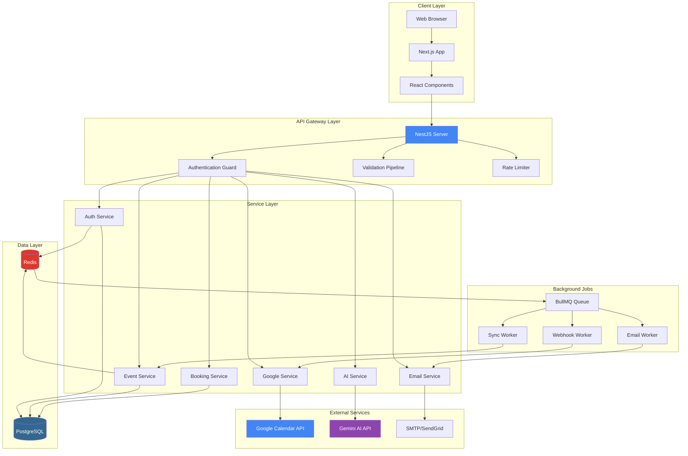

# **Chương II - Phần 1: KIẾN TRÚC HỆ THỐNG**

Phần này trình bày chi tiết về kiến trúc tổng thể của hệ thống Calento, bao gồm cách các thành phần hoạt động, luồng dữ liệu, và cấu trúc các tầng trong hệ thống.

## **1\. Kiến trúc tổng thể**

### **1.1. Tổng quan về kiến trúc**

Hệ thống **Calento** được xây dựng dựa trên mô hình **Client-Server Architecture** (Kiến trúc khách-chủ), trong đó phía Client là ứng dụng web chạy trên trình duyệt của người dùng, còn phía Server là Backend API server đảm nhận vai trò xử lý logic nghiệp vụ và quản lý dữ liệu. Để đảm bảo hiệu suất và khả năng mở rộng, hệ thống sử dụng PostgreSQL làm cơ sở dữ liệu chính để lưu trữ dữ liệu lâu dài, đồng thời tích hợp Redis như một lớp cache để lưu trữ tạm thời và tăng tốc độ truy xuất dữ liệu.

Kiến trúc tổng thể của Calento được phân chia thành sáu tầng chính, bao gồm: Client Layer phụ trách giao diện người dùng, API Gateway Layer đóng vai trò cổng kiểm soát các requests, Service Layer xử lý toàn bộ logic nghiệp vụ, Data Layer quản lý việc lưu trữ dữ liệu, External Services tích hợp các dịch vụ bên thứ ba, và cuối cùng là Background Jobs chịu trách nhiệm xử lý các tác vụ nền.

### **1.2. Sơ đồ kiến trúc tổng thể**

Hệ thống Calento được thiết kế theo kiến trúc phân tầng (layered architecture) với 3 tầng chính:

### **1.4. Giải thích chi tiết các tầng**

#### **Tầng 1: Client Layer (Giao diện người dùng)**

*   **Web Browser**: Render UI, xử lý tương tác người dùng.
*   **Next.js Framework**: React framework hỗ trợ SSR (Server-Side Rendering) và SSG (Static Site Generation) để tối ưu hiệu suất và SEO. Sử dụng App Router cho định tuyến.
*   **React Components**: Các thành phần UI tái sử dụng (Button, Calendar, Modal) xây dựng giao diện nhất quán.

#### **Tầng 2: API Gateway Layer (Kiểm soát truy cập)**

Đóng vai trò cổng vào cho mọi request đến hệ thống (NestJS Server).

*   **Authentication Guard**: Xác thực JWT token (Passport strategy). Chặn requests không hợp lệ (401 Unauthorized), ngoại trừ public routes.
*   **Validation Pipeline**: Kiểm tra dữ liệu đầu vào sử dụng `class-validator` và DTO. Trả về lỗi 400 Bad Request nếu dữ liệu không hợp lệ.

#### **Tầng 3: Service Layer (Tầng xử lý nghiệp vụ)**

Service Layer là tầng chứa toàn bộ logic nghiệp vụ chính của ứng dụng với 18 modules chuyên biệt, mỗi module được thiết kế theo nguyên tắc Single Responsibility. Các modules được tổ chức thành 7 nhóm chức năng chính:

Service Layer là tầng chứa toàn bộ logic nghiệp vụ chính của ứng dụng với 18 modules chuyên biệt, mỗi module được thiết kế theo nguyên tắc Single Responsibility. Các modules được tổ chức thành 7 nhóm chức năng chính:

**Tổng quan các Services chính:**

| Nhóm | Services | Chức năng chính |
|------|----------|-------------------|
| **Core** | Auth, User, Calendar, Event | Xác thực (JWT, OAuth), quản lý users/calendars/events, RRULE expansion |
| **Booking** | Booking, Availability | Tạo booking links, tính time slots, validate conflicts |
| **AI** | AI Conversation, Gemini, Function Calling, Analysis, Analytics | Chatbot, function calling (createEvent, searchEvents), insights, metrics |
| **Integration** | Google Calendar, Google Auth, Webhook, Cloudinary | Two-way sync, OAuth 2.0, webhooks, image CDN |
| **Communication** | Email, Contact | Nodemailer + Handlebars templates, ICS files, retry logic |
| **Productivity** | Task, Priority | To-do lists, priority algorithm, auto-rebalancing |
| **Team** | Team, Member, Availability, Ritual | Workspaces, roles, group scheduling, recurring meetings |
| **Content** | Blog | Posts, markdown, SEO |

Tất cả services tuân theo: dependency injection (NestJS), repository pattern, error handling với custom exceptions, logging (Winston), transaction management, và well-defined interfaces không có circular dependencies.

#### **Tầng 4: Data Layer (Lưu trữ dữ liệu)**

| Thành phần | Vai trò | Chức năng chính |
| :--- | :--- | :--- |
| **PostgreSQL** | Primary Database | Lưu trữ dữ liệu bền vững (Users, Events, Bookings). Đảm bảo tính toàn vẹn (ACID). |
| **Redis** | Cache & Session | Lưu trữ tạm thời (Cache, Sessions), Queue backend. Tốc độ truy xuất cao. |

**Cơ chế hoạt động:** Ưu tiên đọc từ Redis Cache. Nếu miss, đọc từ PostgreSQL và cache lại. Write-through hoặc invalidate cache khi có cập nhật dữ liệu.

#### **Tầng 5: External Services (Dịch vụ bên thứ ba)**

Tầng External Services tích hợp ba dịch vụ bên thứ ba quan trọng:

| Dịch vụ | Package | Chức năng | Đặc điểm |
|---------|---------|-----------|----------|
| **Google Calendar API** | `googleapis` | Two-way sync events | OAuth 2.0, webhooks, conflict resolution, endpoint: `https://www.googleapis.com/calendar/v3/` |
| **Gemini AI API** | `@google/generative-ai` | Natural language processing | Function calling (createEvent, searchEvents, checkAvailability), context management, streaming responses |
| **Email Service** | `nodemailer` | Gửi emails qua SMTP | Handlebars templates, ICS file generation (`ics` package), retry logic (max 3 lần) |

Lợi ích: Không cần tự xây dựng AI model, sync với Google Calendar giảm nhập liệu thủ công, email delivery đáng tin cậy.

#### **Tầng 6: Background Jobs (Xử lý tác vụ nền)**

Background Jobs Layer xử lý các tác vụ mất thời gian bằng BullMQ Queue (lưu trữ trong Redis) với 3 workers và 4 scheduled tasks:

**Workers:**

| Worker | File | Chức năng | Retry |
|--------|------|-----------|-------|
| Email Worker | `email.processor.ts` | Gửi emails qua Nodemailer (confirmations, reminders, invitations, notifications) | Max 3 lần |
| Event Sync Worker | `event-sync.processor.ts` | Đồng bộ với Google Calendar, batch operations, conflict resolution | Tự động |
| Webhook Worker | `webhook.processor.ts` | Xử lý notifications từ Google Calendar webhooks, trigger sync | Tự động |

**Scheduled Tasks (Cron Jobs):**

| Task | Schedule | Mục đích |
|------|----------|----------|
| Webhook Auto-Renewal | Mỗi 6 giờ (`'0 */6 * * *'`) | Renew webhooks sắp hết hạn trong 24h |
| Webhook Cleanup | Hàng ngày 2AM UTC (`'0 2 * * *'`) | Dọc dẹp expired webhooks |
| Webhook Health Check | Mỗi 12 giờ (`'0 */12 * * *'`) | Kiểm tra webhooks, validate credentials |
| Priority Update | Mỗi giờ (`EVERY_HOUR`) | Cập nhật priorities của events/tasks |

**Ví dụ luồng hoạt động:** User book cuộc hẹn → API tạo booking (100ms) → Return 201 Created → Thêm email job vào queue → Email Worker xử lý (1-2s) → Guest nhận email + ICS file.

Lợi ích: User không chờ email, tự động retry nếu lỗi, server không quá tải.

### **1.4. Luồng dữ liệu (Data Flow)**

Quy trình xử lý dữ liệu từ Client đến Database và ngược lại:

1.  **Client Action**: User tương tác (VD: Tạo sự kiện). React Component gọi API hook.
2.  **API Request**: Axios gửi HTTP Request kèm JWT token.
3.  **Gateway**: Auth Guard xác thực token, Validation Pipeline kiểm tra dữ liệu.
4.  **Service Processing**: Service thực hiện logic nghiệp vụ (validate logic, gọi external services).
5.  **Data Persistence**: Repository lưu/truy xuất dữ liệu từ PostgreSQL/Redis.
6.  **Response**: Server trả về JSON response (Success/Error).
7.  **UI Update**: Frontend (TanStack Query) update cache và re-render UI.

**Các tính năng tối ưu:**
*   **Automatic Caching**: TanStack Query cache responses để giảm tải server.
*   **Optimistic Updates**: Update UI ngay lập tức trước khi server phản hồi để tăng trải nghiệm mượt mà.
*   **Query Invalidation**: Tự động làm mới dữ liệu liên quan sau khi mutation thành công.

---

**Xem thêm:**
- [Phần 2: Thiết kế Database](./02_2_Thiet_Ke_Database.md)
- [Phần 3: Thiết kế API](./02_3_Thiet_Ke_API.md)
- [Phần 4: Thiết kế Frontend & UI/UX](./02_4_Thiet_Ke_Frontend_UIUX.md)
