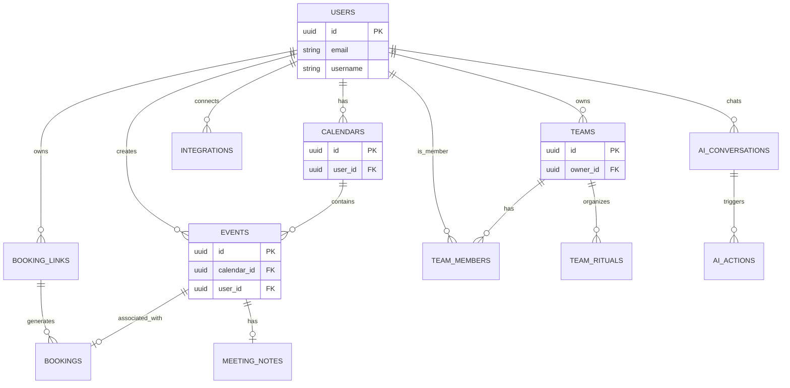
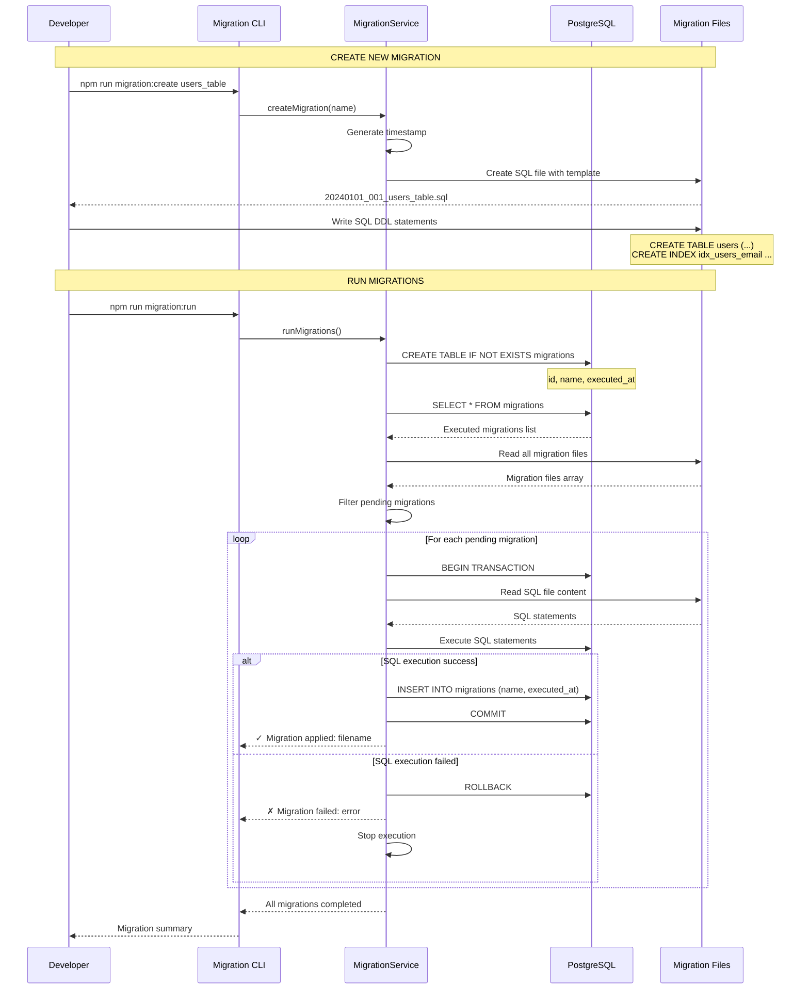

# **Chương II - Phần 2: THIẾT KẾ DATABASE**

Phần này trình bày chi tiết về cấu trúc database của hệ thống Calento, bao gồm các bảng dữ liệu, mối quan hệ giữa các bảng, và các luồng xử lý dữ liệu quan trọng.

## **1\. Tổng quan về cấu trúc Database**

Hệ thống Calento sử dụng **20 tables chính** trong PostgreSQL database. Mỗi table lưu trữ một loại dữ liệu cụ thể:

| STT | Table Name       | Mô tả                  | Records ước tính |
| --- | ---------------- | ------------------------ | ------------------- |
| 1   | users            | Thông tin người dùng | ~10,000             |
| 2   | calendars        | Calendar của user       | ~10,000             |
| 3   | events           | Calendar events          | ~500,000            |
| 4   | booking_links    | Scheduling links         | ~50,000             |
| 5   | bookings         | Guest bookings           | ~200,000            |
| 6   | teams            | Team management          | ~5,000              |
| 7   | team_members     | Team memberships         | ~20,000             |
| 8   | team_rituals     | Recurring team events    | ~10,000             |
| 9   | user_credentials | OAuth tokens             | ~10,000             |
| 10  | integrations     | 3rd party integrations   | ~10,000             |
| 11  | webhook_channels | Google webhooks          | ~10,000             |
| 12  | ai_conversations | AI chat sessions         | ~100,000            |
| 13  | ai_actions       | AI function calls        | ~500,000            |
| 14  | meeting_notes    | AI meeting summaries     | ~200,000            |
| 15  | email_logs       | Email tracking           | ~1,000,000          |
| 16  | email_templates  | Email templates          | ~50                 |
| 17  | priorities       | Priority board items     | ~100,000            |
| 18  | tasks            | Task management          | ~200,000            |
| 19  | habits           | Habit tracking           | ~50,000             |
| 20  | notifications    | System notifications     | ~500,000            |

## **2\. Mối quan hệ giữa các Tables**

Các tables trong database có mối quan hệ chặt chẽ với nhau, chủ yếu xoay quanh `users` và `events`.

### **2.1. Sơ đồ quan hệ (ER Diagram)**



### **2.2. Mô tả chi tiết**

- **User & Calendar System**: Một User có nhiều Calendars. Một Calendar chứa nhiều Events.
- **Booking System**: User tạo Booking Links. Khách (Guest) tạo Bookings thông qua Link. Mỗi Booking tạo ra một Event tương ứng.
- **Team System**: User có thể tạo Teams. Team có nhiều Members và Rituals (sự kiện nhóm).
- **AI System**: User có các cuộc hội thoại (AI Conversations). Mỗi hội thoại có thể kích hoạt nhiều hành động (AI Actions) như tạo lịch, gửi mail.

## **3\. Chi tiết các Tables chính**

### **3.1. Table: users (Người dùng)**

**Mục đích:** Lưu trữ thông tin tài khoản người dùng và dữ liệu xác thực.

**Cấu trúc:**

| Column        | Type         | Constraints                | Description            |
| ------------- | ------------ | -------------------------- | ---------------------- |
| id            | UUID         | PRIMARY KEY                | User ID                |
| email         | VARCHAR(255) | UNIQUE, NOT NULL           | Email address          |
| username      | VARCHAR(255) | UNIQUE, NOT NULL           | Username               |
| password_hash | TEXT         | NOT NULL                   | Bcrypt hashed password |
| first_name    | VARCHAR(100) |                            | First name             |
| last_name     | VARCHAR(100) |                            | Last name              |
| avatar        | TEXT         |                            | Avatar URL             |
| timezone      | VARCHAR(50)  | DEFAULT 'Asia/Ho_Chi_Minh' | User timezone          |
| status        | VARCHAR(20)  | DEFAULT 'active'           | Account status         |
| last_login_at | TIMESTAMP    |                            | Last login time        |
| created_at    | TIMESTAMP    | DEFAULT NOW()              | Created timestamp      |
| updated_at    | TIMESTAMP    | DEFAULT NOW()              | Updated timestamp      |

**Indexes (Chỉ mục):**

Indexes giúp tìm kiếm dữ liệu nhanh hơn, giống như mục lục trong sách.

- `idx_users_email` ON email - Tìm user theo email nhanh
- `idx_users_username` ON username - Tìm user theo username nhanh
- `idx_users_status` ON status - Lọc users theo status (active/inactive)

**Ví dụ dữ liệu:**

| id      | email             | username | password_hash | first_name | last_name | timezone          | status |
| ------- | ----------------- | -------- | ------------- | ---------- | --------- | ----------------- | ------ |
| abc-123 | john@example.com  | johndoe  | $2b$10$...   | John       | Doe       | Asia/Ho_Chi_Minh | active |
| def-456 | alice@example.com | alice123 | $2b$10$...   | Alice      | Smith     | America/New_York | active |

**Constraints quan trọng:**
- **PRIMARY KEY**: `id` là duy nhất, không trùng lặp
- **UNIQUE**: `email` và `username` không được trùng (mỗi user một email)
- **NOT NULL**: Các field quan trọng phải có giá trị

### **3.2. Table: calendars (Lịch)**

**Mục đích:** Lưu trữ các calendars của user. Mỗi user có thể có nhiều calendars (Work, Personal, Study...).

**Cấu trúc:**

| Column             | Type         | Constraints                | Description        |
| ------------------ | ------------ | -------------------------- | ------------------ |
| id                 | UUID         | PRIMARY KEY                | Calendar ID        |
| user_id            | UUID         | FOREIGN KEY → users(id)   | Calendar owner     |
| name               | VARCHAR(255) | NOT NULL                   | Calendar name      |
| description        | TEXT         |                            | Description        |
| color              | VARCHAR(7)   | DEFAULT '#4285f4'          | Display color      |
| timezone           | VARCHAR(50)  | DEFAULT 'Asia/Ho_Chi_Minh' | Calendar timezone  |
| is_primary         | BOOLEAN      | DEFAULT false              | Primary calendar   |
| is_synced          | BOOLEAN      | DEFAULT false              | Google synced      |
| google_calendar_id | VARCHAR(255) |                            | Google Calendar ID |
| created_at         | TIMESTAMP    | DEFAULT NOW()              | Created timestamp  |
| updated_at         | TIMESTAMP    | DEFAULT NOW()              | Updated timestamp  |

**Foreign Key:**
- `user_id` → `users(id)`: Liên kết với table users
- Khi user bị xóa, tất cả calendars của user đó cũng sẽ bị xóa (CASCADE)

**Indexes:**
- `idx_calendars_user` ON user_id - Query calendars của một user
- `idx_calendars_primary` ON (user_id, is_primary) - Tìm primary calendar nhanh
- `idx_calendars_google` ON google_calendar_id - Sync với Google Calendar

**Ví dụ dữ liệu:**

| id      | user_id | name     | color   | is_primary | is_synced | google_calendar_id |
| ------- | ------- | -------- | ------- | ---------- | --------- | ------------------ |
| cal-001 | abc-123 | Work     | #4285f4 | true       | true      | primary            |
| cal-002 | abc-123 | Personal | #f4b400 | false      | false     | NULL               |
| cal-003 | def-456 | Study    | #0f9d58 | true       | false     | NULL               |

**Giải thích:**
- User `abc-123` (John) có 2 calendars: Work (primary, synced) và Personal
- User `def-456` (Alice) có 1 calendar: Study (primary, not synced)
- `is_primary = true`: Calendar mặc định khi tạo events
- `is_synced = true`: Đồng bộ với Google Calendar

### **3.3. Table: events (Sự kiện)**

**Mục đích:** Lưu trữ tất cả calendar events, bao gồm cả sự kiện đơn lẻ và sự kiện lặp lại (recurring).

**Cấu trúc:**

| Column                     | Type         | Constraints                  | Description        |
| -------------------------- | ------------ | ---------------------------- | ------------------ |
| id                         | UUID         | PRIMARY KEY                  | Event ID           |
| user_id                    | UUID         | FOREIGN KEY → users(id)     | Event owner        |
| calendar_id                | UUID         | FOREIGN KEY → calendars(id) | Parent calendar    |
| google_event_id            | VARCHAR(255) |                              | Google Calendar ID |
| title                      | VARCHAR(255) | NOT NULL                     | Event title        |
| description                | TEXT         |                              | Event description  |
| location                   | TEXT         |                              | Event location     |
| start_time                 | TIMESTAMP    | NOT NULL                     | Start datetime     |
| end_time                   | TIMESTAMP    | NOT NULL                     | End datetime       |
| timezone                   | VARCHAR(50)  | DEFAULT 'Asia/Ho_Chi_Minh'   | Event timezone     |
| is_all_day                 | BOOLEAN      | DEFAULT false                | All-day event      |
| recurrence_rule            | TEXT         |                              | RRULE format       |
| recurrence_exception_dates | JSONB        |                              | Excluded dates     |
| attendees                  | JSONB        |                              | Attendee list      |
| conference_data            | JSONB        |                              | Meeting link info  |
| reminders                  | JSONB        |                              | Reminder settings  |
| visibility                 | VARCHAR(20)  | DEFAULT 'default'            | public/private     |
| status                     | VARCHAR(20)  | DEFAULT 'confirmed'          | Event status       |
| created_at                 | TIMESTAMP    | DEFAULT NOW()                | Created timestamp  |
| updated_at                 | TIMESTAMP    | DEFAULT NOW()                | Updated timestamp  |
| deleted_at                 | TIMESTAMP    |                              | Soft delete        |

**Foreign Keys:**
- `user_id` → `users(id)`: User sở hữu event
- `calendar_id` → `calendars(id)`: Calendar chứa event

**Indexes:**
- `idx_events_user_time` ON (user_id, start_time, end_time) - Query events trong khoảng thời gian
- `idx_events_calendar` ON calendar_id - Lấy events theo calendar
- `idx_events_google_id` ON google_event_id - Sync với Google
- `idx_events_recurring` ON recurrence_rule - Tìm recurring events
- `idx_events_search` ON (title, description) USING gin - Full-text search

**JSONB Fields - Dữ liệu linh hoạt:**

PostgreSQL hỗ trợ JSONB để lưu dữ liệu dạng JSON, rất tiện cho dữ liệu có cấu trúc thay đổi.

**1. attendees (Người tham dự):**
```json
[
  {
    "email": "alice@example.com",
    "name": "Alice Smith",
    "response_status": "accepted",
    "optional": false
  },
  {
    "email": "bob@example.com",
    "name": "Bob Johnson",
    "response_status": "pending",
    "optional": true
  }
]
```

**2. conference_data (Link họp online):**
```json
{
  "type": "google_meet",
  "url": "https://meet.google.com/abc-defg-hij",
  "conference_id": "abc-defg-hij"
}
```

**3. reminders (Nhắc nhở):**
```json
[
  {
    "method": "email",
    "minutes_before": 60
  },
  {
    "method": "notification",
    "minutes_before": 15
  }
]
```

**Recurring Events (Sự kiện lặp lại):**

**RRULE Format** (iCalendar standard):
```
FREQ=WEEKLY;BYDAY=MO,WE,FR;UNTIL=20241231T235959Z

Giải thích:
- FREQ=WEEKLY: Lặp lại hàng tuần
- BYDAY=MO,WE,FR: Vào thứ 2, 4, 6
- UNTIL=...: Cho đến hết 31/12/2024
```

**Ví dụ dữ liệu event:**

| id      | title               | start_time          | end_time            | recurrence_rule       | attendees          |
| ------- | ------------------- | ------------------- | ------------------- | --------------------- | ------------------ |
| evt-001 | Team Meeting        | 2024-11-10 14:00:00 | 2024-11-10 15:00:00 | FREQ=WEEKLY;BYDAY=MON | [Alice, Bob]       |
| evt-002 | Doctor Appointment  | 2024-11-12 09:00:00 | 2024-11-12 09:30:00 | NULL                  | []                 |
| evt-003 | Daily Standup       | 2024-11-09 09:00:00 | 2024-11-09 09:15:00 | FREQ=DAILY;COUNT=30   | [Team Members]     |

**Soft Delete:**
- `deleted_at` field: NULL (active), hoặc có giá trị (deleted)
- Không xóa hẳn khỏi database, chỉ đánh dấu là đã xóa
- Có thể restore nếu cần

### **3.4. Table: booking_links (Liên kết đặt lịch)**

**Mục đích:** Lưu trữ các liên kết scheduling mà user tạo ra, tương tự Calendly.

**Cấu trúc:**

| Column                | Type         | Constraints              | Description                  |
| --------------------- | ------------ | ------------------------ | ---------------------------- |
| id                    | UUID         | PRIMARY KEY              | Link ID                      |
| user_id               | UUID         | FOREIGN KEY → users(id) | Link owner                   |
| title                 | VARCHAR(255) | NOT NULL                 | Link title                   |
| slug                  | VARCHAR(255) | NOT NULL                 | URL slug                     |
| description           | TEXT         |                          | Link description             |
| duration_minutes      | INT          | NOT NULL                 | Meeting duration             |
| buffer_before_minutes | INT          | DEFAULT 0                | Buffer before meeting        |
| buffer_after_minutes  | INT          | DEFAULT 0                | Buffer after meeting         |
| availability_type     | VARCHAR(50)  | NOT NULL                 | specific_hours/calendar_sync |
| availability_hours    | JSONB        |                          | Week schedule                |
| location_type         | VARCHAR(50)  | DEFAULT 'google_meet'    | Meeting location type        |
| location_value        | TEXT         |                          | Location value               |
| color                 | VARCHAR(7)   | DEFAULT '#4285f4'        | Display color                |
| is_active             | BOOLEAN      | DEFAULT true             | Active status                |
| bookings_count        | INT          | DEFAULT 0                | Total bookings               |
| max_bookings_per_day  | INT          |                          | Daily limit                  |
| notice_period_hours   | INT          | DEFAULT 24               | Advance booking time         |
| created_at            | TIMESTAMP    | DEFAULT NOW()            | Created timestamp            |
| updated_at            | TIMESTAMP    | DEFAULT NOW()            | Updated timestamp            |

**Unique Constraint:** (user_id, slug)

**Indexes:**

- `idx_booking_links_user` ON user_id
- `idx_booking_links_slug` ON (user_id, slug)
- `idx_booking_links_active` ON is_active

### **3.5. Table: bookings**

Lưu trữ guest bookings từ booking links.

| Column              | Type         | Constraints                      | Description       |
| ------------------- | ------------ | -------------------------------- | ----------------- |
| id                  | UUID         | PRIMARY KEY                      | Booking ID        |
| booking_link_id     | UUID         | FOREIGN KEY → booking_links(id) | Link used         |
| event_id            | UUID         | FOREIGN KEY → events(id)        | Created event     |
| guest_name          | VARCHAR(255) | NOT NULL                         | Guest name        |
| guest_email         | VARCHAR(255) | NOT NULL                         | Guest email       |
| guest_phone         | VARCHAR(50)  |                                  | Guest phone       |
| guest_notes         | TEXT         |                                  | Additional notes  |
| slot_start          | TIMESTAMP    | NOT NULL                         | Booked start time |
| slot_end            | TIMESTAMP    | NOT NULL                         | Booked end time   |
| timezone            | VARCHAR(50)  | NOT NULL                         | Guest timezone    |
| status              | VARCHAR(50)  | DEFAULT 'confirmed'              | Booking status    |
| cancellation_reason | TEXT         |                                  | If cancelled      |
| reminder_sent       | BOOLEAN      | DEFAULT false                    | Reminder status   |
| created_at          | TIMESTAMP    | DEFAULT NOW()                    | Created timestamp |
| updated_at          | TIMESTAMP    | DEFAULT NOW()                    | Updated timestamp |

**Indexes:**

- `idx_bookings_link` ON booking_link_id
- `idx_bookings_email` ON guest_email
- `idx_bookings_time` ON (slot_start, slot_end)
- `idx_bookings_status` ON status

### **3.6. Table: teams (Nhóm)**

**Mục đích:** Quản lý thông tin nhóm và cài đặt chung.

| Column | Type | Constraints | Description |
| :--- | :--- | :--- | :--- |
| id | UUID | PRIMARY KEY | Team ID |
| name | VARCHAR(255) | NOT NULL | Tên nhóm |
| description | TEXT | | Mô tả nhóm |
| owner_id | UUID | FOREIGN KEY → users(id) | Trưởng nhóm |
| timezone | VARCHAR(100) | DEFAULT 'UTC' | Múi giờ mặc định |
| settings | JSONB | DEFAULT '{}' | Cài đặt nhóm |
| is_active | BOOLEAN | DEFAULT true | Trạng thái hoạt động |
| created_at | TIMESTAMP | DEFAULT NOW() | Thời điểm tạo |
| updated_at | TIMESTAMP | DEFAULT NOW() | Thời điểm cập nhật |

### **3.7. Table: team_members (Thành viên nhóm)**

**Mục đích:** Quản lý thành viên trong nhóm và vai trò.

| Column | Type | Constraints | Description |
| :--- | :--- | :--- | :--- |
| id | UUID | PRIMARY KEY | Member ID |
| team_id | UUID | FOREIGN KEY → teams(id) | ID nhóm |
| user_id | UUID | FOREIGN KEY → users(id) | ID thành viên |
| role | VARCHAR(50) | DEFAULT 'member' | Vai trò (owner, admin, member) |
| status | VARCHAR(50) | DEFAULT 'pending' | Trạng thái (pending, active) |
| joined_at | TIMESTAMP | | Thời điểm tham gia |

### **3.8. Table: team_rituals (Nghi thức nhóm)**

**Mục đích:** Quản lý các sự kiện định kỳ của nhóm (Daily Standup, Weekly Review).

| Column | Type | Constraints | Description |
| :--- | :--- | :--- | :--- |
| id | UUID | PRIMARY KEY | Ritual ID |
| team_id | UUID | FOREIGN KEY → teams(id) | ID nhóm |
| title | VARCHAR(255) | NOT NULL | Tên nghi thức |
| recurrence_rule | VARCHAR(500) | | Quy tắc lặp lại (RRULE) |
| duration_minutes | INTEGER | DEFAULT 30 | Thời lượng |
| rotation_type | VARCHAR(50) | DEFAULT 'none' | Kiểu xoay vòng (host, scribe) |
| rotation_order | JSONB | | Thứ tự xoay vòng |

### **3.9. Table: meeting_notes (Ghi chú cuộc họp)**

**Mục đích:** Lưu trữ ghi chú và tóm tắt AI cho các cuộc họp.

| Column | Type | Constraints | Description |
| :--- | :--- | :--- | :--- |
| id | UUID | PRIMARY KEY | Note ID |
| event_id | UUID | FOREIGN KEY → events(id) | ID sự kiện |
| content | TEXT | | Nội dung ghi chú |
| ai_summary | TEXT | | Tóm tắt bởi AI |
| created_at | TIMESTAMP | DEFAULT NOW() | Thời điểm tạo |

### **3.10. Table: integrations (Tích hợp)**

**Mục đích:** Lưu trữ thông tin kết nối với các dịch vụ bên thứ 3 (Slack, Zoom, etc.).

| Column | Type | Constraints | Description |
| :--- | :--- | :--- | :--- |
| id | UUID | PRIMARY KEY | Integration ID |
| user_id | UUID | FOREIGN KEY → users(id) | ID người dùng |
| provider | VARCHAR(50) | NOT NULL | Nhà cung cấp (slack, zoom) |
| access_token | VARCHAR(500) | NOT NULL | Token truy cập |
| refresh_token | VARCHAR(500) | NOT NULL | Token làm mới |
| workspace_id | VARCHAR(255) | | ID không gian làm việc |

### **3.11. Các Tables khác**

#### **user_credentials Table**
Lưu trữ OAuth tokens cho external services (Google, Microsoft).

#### **ai_conversations & ai_actions**
Lưu trữ lịch sử chat và các hành động thực thi bởi AI.

#### **notifications**
Lưu trữ cài đặt và lịch sử thông báo gửi đi.

## **4\. Database Migration System**

### **4.1. Migration Flow**



### **4.2. Migration File Examples**

**Create Migration:**

```sql
-- 20240101_001_create_users_table.sql
-- UP Migration
CREATE TABLE IF NOT EXISTS users (
    id UUID PRIMARY KEY DEFAULT gen_random_uuid(),
    email VARCHAR(255) UNIQUE NOT NULL,
    username VARCHAR(255) UNIQUE NOT NULL,
    password_hash TEXT NOT NULL,
    created_at TIMESTAMP DEFAULT CURRENT_TIMESTAMP,
    updated_at TIMESTAMP DEFAULT CURRENT_TIMESTAMP
);

CREATE INDEX idx_users_email ON users(email);
CREATE INDEX idx_users_username ON users(username);

-- Auto-update timestamp trigger
CREATE OR REPLACE FUNCTION update_updated_at_column()
RETURNS TRIGGER AS $$
BEGIN
    NEW.updated_at = CURRENT_TIMESTAMP;
    RETURN NEW;
END;
$$ language 'plpgsql';

CREATE TRIGGER update_users_updated_at 
    BEFORE UPDATE ON users 
    FOR EACH ROW 
    EXECUTE FUNCTION update_updated_at_column();
```

**Rollback Migration:**

```sql
-- 20240101_001_create_users_table_rollback.sql
-- DOWN Migration
DROP TRIGGER IF EXISTS update_users_updated_at ON users;
DROP FUNCTION IF EXISTS update_updated_at_column();
DROP INDEX IF EXISTS idx_users_username;
DROP INDEX IF EXISTS idx_users_email;
DROP TABLE IF EXISTS users CASCADE;
```

### **4.3. Key Features**

1. **Pure SQL**: Không sử dụng ORM, chỉ raw SQL queries
2. **Transaction Safety**: Mỗi migration chạy trong transaction
3. **Tracking**: Table `migrations` track executed migrations
4. **Rollback Support**: Mỗi migration có file rollback tương ứng
5. **Idempotent**: Sử dụng `IF NOT EXISTS`, `IF EXISTS`
6. **Order Guarantee**: Migration files có timestamp prefix
7. **Error Handling**: Rollback nếu migration fails

---

**Xem thêm:**
- [Phần 1: Kiến trúc hệ thống](./02_1_Kien_Truc_He_Thong.md)
- [Phần 3: Thiết kế API](./02_3_Thiet_Ke_API.md)
- [Phần 4: Thiết kế Frontend & UI/UX](./02_4_Thiet_Ke_Frontend_UIUX.md)
