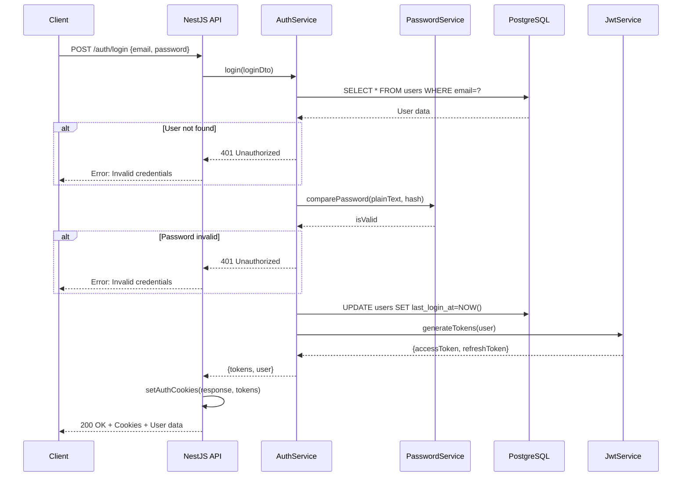
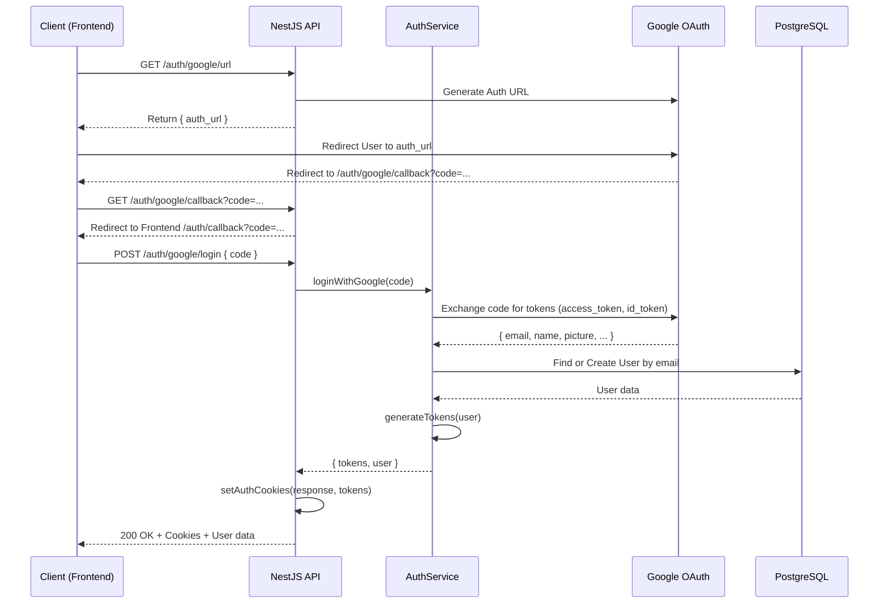
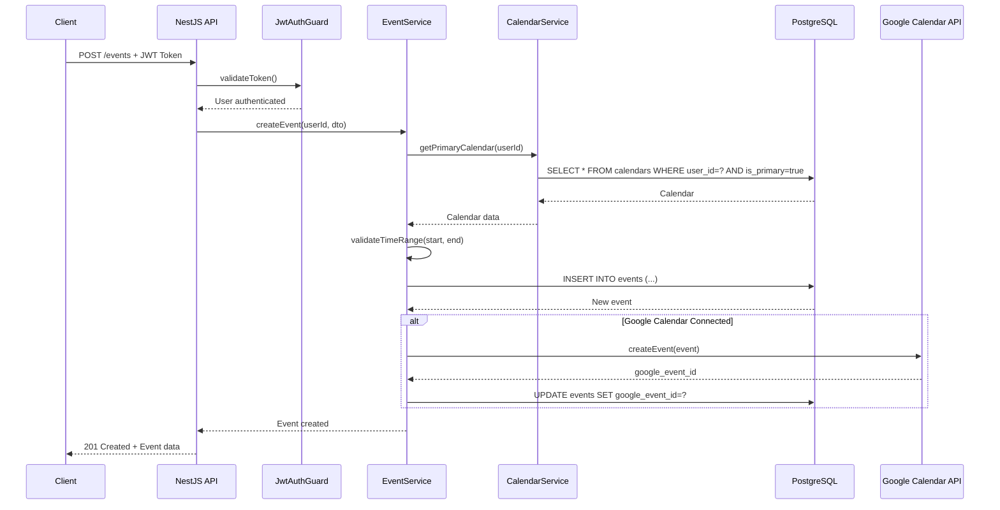
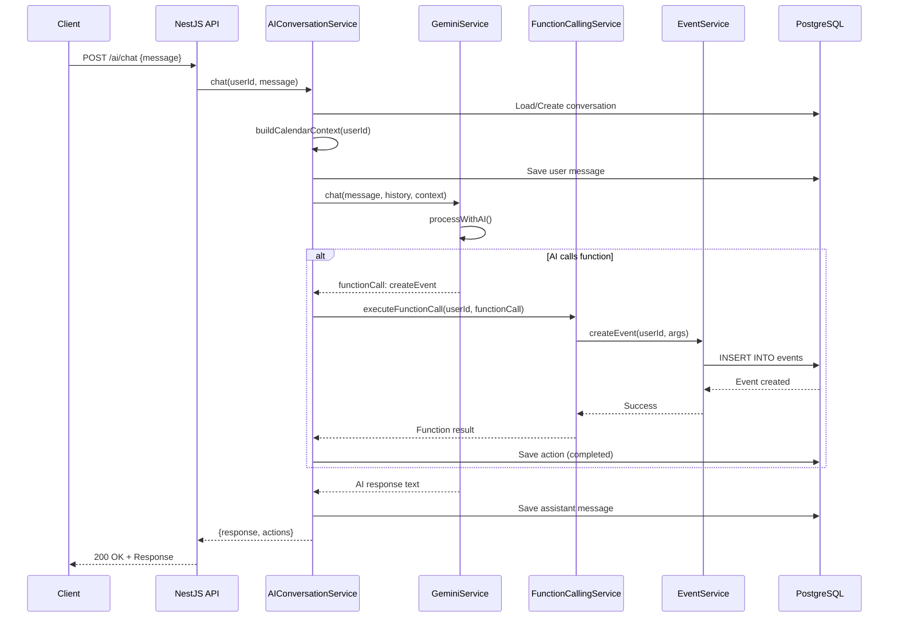
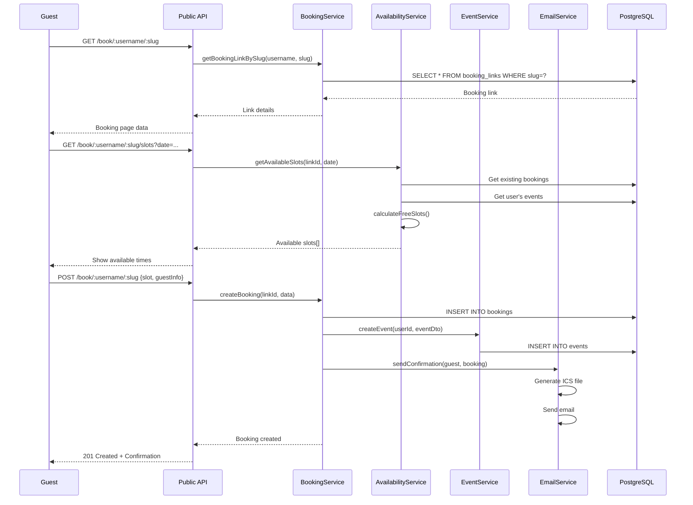
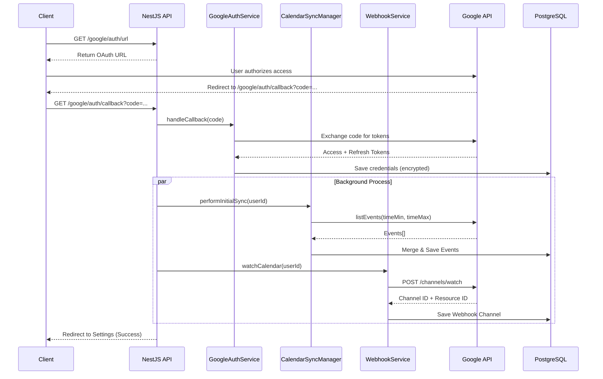
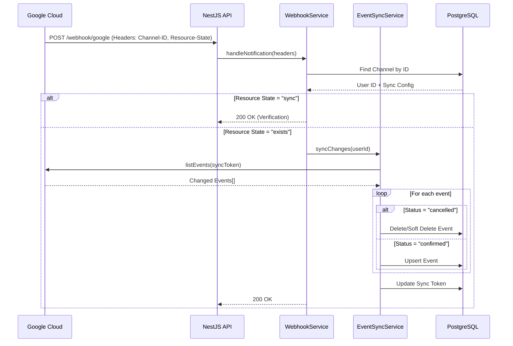

# **Chương II - Phần 3: THIẾT KẾ API**

Phần này trình bày chi tiết về thiết kế API của hệ thống Calento, bao gồm các endpoints, request/response format, authentication flow, và các best practices được áp dụng.

## **1\. Tổng quan API Endpoints**

**Base URL:** `https://api.calento.space/docs`

**Tổng số endpoints:** 78 endpoints

| Module          | Số endpoints | Mô tả                         |
| --------------- | ------------- | ------------------------------- |
| Authentication  | 10            | Đăng ký, đăng nhập, OAuth |
| Users           | 8             | Quản lý user profile          |
| Events          | 15            | CRUD events, recurring, search  |
| Calendars       | 7             | Quản lý calendars             |
| Booking Links   | 8             | Scheduling links system         |
| Bookings        | 6             | Guest bookings                  |
| AI Chatbot      | 6             | AI conversations                |
| Google Calendar | 8             | Sync, webhooks                  |
| Email           | 10            | Email notifications             |

## **2\. Chi tiết API Endpoints**

### **2.1. Authentication Endpoints (10)**

| Method | Endpoint                  | Mô tả                     | Auth Required |
| ------ | ------------------------- | --------------------------- | ------------- |
| POST   | `/auth/register`        | Register new user           | No            |
| POST   | `/auth/login`           | Login with email/password   | No            |
| POST   | `/auth/logout`          | Logout user                 | Yes           |
| POST   | `/auth/refresh`         | Refresh access token        | Yes           |
| GET    | `/auth/me`              | Get current user            | Yes           |
| PATCH  | `/auth/me`              | Update current user         | Yes           |
| POST   | `/auth/forgot-password` | Request password reset      | No            |
| POST   | `/auth/reset-password`  | Reset password with token   | No            |
| GET    | `/auth/google/url`      | Get Google OAuth URL        | No            |
| POST   | `/auth/google/login`    | Complete Google OAuth login | No            |

### **2.2. User Endpoints (8)**

| Method | Endpoint                 | Mô tả                   | Auth Required |
| ------ | ------------------------ | ------------------------- | ------------- |
| GET    | `/users`               | List users (admin)        | Yes           |
| GET    | `/users/:id`           | Get user by ID            | Yes           |
| PATCH  | `/users/:id`           | Update user               | Yes           |
| DELETE | `/users/:id`           | Delete user (soft delete) | Yes           |
| GET    | `/users/search`        | Search users              | Yes           |
| GET    | `/users/:id/calendars` | Get user's calendars      | Yes           |
| GET    | `/users/:id/events`    | Get user's events         | Yes           |
| GET    | `/users/:id/stats`     | Get user statistics       | Yes           |

### **2.3. Event Endpoints (15)**

| Method | Endpoint                     | Mô tả                  | Auth Required |
| ------ | ---------------------------- | ------------------------ | ------------- |
| GET    | `/events`                  | List events (paginated)  | Yes           |
| POST   | `/events`                  | Create new event         | Yes           |
| GET    | `/events/:id`              | Get event detail         | Yes           |
| PATCH  | `/events/:id`              | Update event (partial)   | Yes           |
| PUT    | `/events/:id`              | Replace event (full)     | Yes           |
| DELETE | `/events/:id`              | Delete event             | Yes           |
| GET    | `/events/calendar`         | Get events by date range | Yes           |
| GET    | `/events/search`           | Search events            | Yes           |
| GET    | `/events/recurring`        | List recurring events    | Yes           |
| GET    | `/events/recurring/expand` | Expand recurring events  | Yes           |
| POST   | `/events/:id/duplicate`    | Duplicate event          | Yes           |
| GET    | `/events/upcoming`         | Get upcoming events      | Yes           |
| GET    | `/events/past`             | Get past events          | Yes           |
| GET    | `/events/today`            | Get today's events       | Yes           |
| GET    | `/events/stats`            | Get event statistics     | Yes           |

### **2.4. Calendar Endpoints (7)**

| Method | Endpoint                  | Mô tả               | Auth Required |
| ------ | ------------------------- | --------------------- | ------------- |
| GET    | `/calendars`            | List user's calendars | Yes           |
| POST   | `/calendars`            | Create calendar       | Yes           |
| GET    | `/calendars/:id`        | Get calendar detail   | Yes           |
| PATCH  | `/calendars/:id`        | Update calendar       | Yes           |
| DELETE | `/calendars/:id`        | Delete calendar       | Yes           |
| POST   | `/calendars/:id/share`  | Share calendar        | Yes           |
| GET    | `/calendars/:id/events` | Get calendar's events | Yes           |

### **2.5. Booking Link Endpoints (8)**

| Method | Endpoint                        | Mô tả                   | Auth Required |
| ------ | ------------------------------- | ------------------------- | ------------- |
| GET    | `/booking-links`              | List user's booking links | Yes           |
| POST   | `/booking-links`              | Create booking link       | Yes           |
| GET    | `/booking-links/:id`          | Get booking link detail   | Yes           |
| PATCH  | `/booking-links/:id`          | Update booking link       | Yes           |
| DELETE | `/booking-links/:id`          | Delete booking link       | Yes           |
| POST   | `/booking-links/:id/toggle`   | Enable/disable link       | Yes           |
| GET    | `/booking-links/:id/bookings` | Get link's bookings       | Yes           |
| GET    | `/booking-links/:id/stats`    | Get link statistics       | Yes           |

### **2.6. Public Booking Endpoints (6)**

| Method | Endpoint                        | Mô tả             | Auth Required |
| ------ | ------------------------------- | ------------------- | ------------- |
| GET    | `/book/:username/:slug`       | Public booking page | No            |
| GET    | `/book/:username/:slug/slots` | Get available slots | No            |
| POST   | `/book/:username/:slug`       | Create booking      | No            |
| GET    | `/bookings/:id`               | Get booking detail  | No            |
| POST   | `/bookings/:id/cancel`        | Cancel booking      | No            |
| POST   | `/bookings/:id/reschedule`    | Reschedule booking  | No            |

### **2.7. AI Chatbot Endpoints (6)**

| Method | Endpoint                          | Mô tả                  | Auth Required |
| ------ | --------------------------------- | ------------------------ | ------------- |
| POST   | `/ai/chat`                      | Send chat message        | Yes           |
| GET    | `/ai/conversations`             | List conversations       | Yes           |
| GET    | `/ai/conversations/:id`         | Get conversation         | Yes           |
| DELETE | `/ai/conversations/:id`         | Delete conversation      | Yes           |
| GET    | `/ai/conversations/:id/actions` | Get conversation actions | Yes           |
| POST   | `/ai/conversations/:id/clear`   | Clear conversation       | Yes           |

### **2.8. Google Calendar Endpoints (8)**

| Method | Endpoint                  | Mô tả                 | Auth Required |
| ------ | ------------------------- | ----------------------- | ------------- |
| GET    | `/google/calendars`     | List Google calendars   | Yes           |
| POST   | `/google/sync`          | Sync with Google        | Yes           |
| POST   | `/google/sync/pull`     | Pull from Google        | Yes           |
| POST   | `/google/sync/push`     | Push to Google          | Yes           |
| GET    | `/google/status`        | Get sync status         | Yes           |
| POST   | `/google/disconnect`    | Disconnect Google       | Yes           |
| POST   | `/webhook/google`       | Google webhook callback | No            |
| POST   | `/webhook/google/watch` | Setup webhook           | Yes           |

### **2.9. Email Endpoints (10)**

| Method | Endpoint                 | Mô tả              | Auth Required |
| ------ | ------------------------ | -------------------- | ------------- |
| POST   | `/email/send`          | Send email           | Yes           |
| POST   | `/email/send/bulk`     | Send bulk emails     | Yes           |
| GET    | `/email/logs`          | Get email logs       | Yes           |
| GET    | `/email/logs/:id`      | Get email log detail | Yes           |
| POST   | `/email/retry/:id`     | Retry failed email   | Yes           |
| GET    | `/email/templates`     | List email templates | Yes           |
| POST   | `/email/templates`     | Create template      | Yes           |
| PATCH  | `/email/templates/:id` | Update template      | Yes           |
| DELETE | `/email/templates/:id` | Delete template      | Yes           |
| GET    | `/email/analytics`     | Get email analytics  | Yes           |

## **3\. API Response Format**

### **3.1. Success Response**

| Trường    | Kiểu dữ liệu | Mô tả                                     |
| :---------- | :-------------- | :------------------------------------------ |
| `success` | boolean         | Trạng thái phản hồi (true/false)        |
| `data`    | object          | Dữ liệu chính trả về từ API           |
| `meta`    | object          | Thông tin bổ sung (timestamp, pagination) |

**Ví dụ:**

```json
{
  "success": true,
  "data": {
    "id": "abc-123",
    "title": "Team Meeting",
    "start_time": "2024-11-10T14:00:00Z"
  },
  "meta": {
    "timestamp": "2024-11-09T18:30:00Z"
  }
}
```

### **3.2. Error Response**

| Trường           | Kiểu dữ liệu | Mô tả                                          |
| :----------------- | :-------------- | :----------------------------------------------- |
| `success`        | boolean         | Trạng thái thất bại (false)                  |
| `error.code`     | string          | Mã lỗi định danh (ví dụ: VALIDATION_ERROR) |
| `error.message`  | string          | Thông báo lỗi chi tiết cho người dùng     |
| `error.details`  | array           | Danh sách chi tiết các lỗi (nếu có)        |
| `meta.timestamp` | string          | Thời điểm xảy ra lỗi                        |

**Ví dụ:**

```json
{
  "success": false,
  "error": {
    "code": "VALIDATION_ERROR",
    "message": "Invalid event data",
    "details": [
      {
        "field": "start_time",
        "message": "Start time must be before end time"
      }
    ]
  },
  "meta": {
    "timestamp": "2024-11-09T18:30:00Z"
  }
}
```

### **3.3. Paginated Response**

| Trường            | Kiểu dữ liệu | Mô tả                                        |
| :------------------ | :-------------- | :--------------------------------------------- |
| `success`         | boolean         | Trạng thái thành công (true)               |
| `data`            | array           | Danh sách các đối tượng dữ liệu        |
| `meta.page`       | number          | Số thứ tự trang hiện tại                  |
| `meta.limit`      | number          | Số lượng mục trên mỗi trang              |
| `meta.total`      | number          | Tổng số lượng mục trong cơ sở dữ liệu |
| `meta.totalPages` | number          | Tổng số trang                                |

**Ví dụ:**

```json
{
  "success": true,
  "data": [
    { "id": "evt-1", "title": "Meeting 1" },
    { "id": "evt-2", "title": "Meeting 2" }
  ],
  "meta": {
    "page": 1,
    "limit": 20,
    "total": 150,
    "totalPages": 8
  }
}
```

## **4\. Authentication Flow**

### **4.1. JWT Token Structure**

| Trường (Claim) | Giá trị ví dụ | Mô tả                                     |
| :--------------- | :---------------- | :------------------------------------------ |
| `sub`          | user-uuid         | ID định danh của người dùng (Subject) |
| `email`        | user@example.com  | Địa chỉ email của người dùng         |
| `username`     | username          | Tên đăng nhập                           |
| `type`         | access            | Loại token (access hoặc refresh)          |
| `iat`          | 1704110400        | Thời điểm phát hành (Issued At)        |
| `exp`          | 1704114000        | Thời điểm hết hạn (Expiration Time)    |

**Ví dụ JWT Payload:**

```json
{
  "sub": "abc-123-def-456",
  "email": "user@example.com",
  "username": "johndoe",
  "type": "access",
  "iat": 1704110400,
  "exp": 1704114000
}
```

### **4.2. Cookie Configuration**

- **access_token**: HttpOnly, Secure, SameSite=Strict, MaxAge=1h
- **refresh_token**: HttpOnly, Secure, SameSite=Strict, MaxAge=7d

### **4.3. Authentication Sequence**



### **4.4. Google OAuth Authentication Flow**

Quy trình đăng nhập bằng Google (OAuth2).



## **5\. Server Flows**

### **5.1. Event Creation Flow**



### **5.2. AI Chatbot Flow**



### **5.3. Booking Flow (Guest)**



### **5.4. Google Calendar Sync Flow**

Quy trình kết nối và đồng bộ dữ liệu ban đầu với Google Calendar.



### **5.5. Webhook Processing Flow**

Quy trình xử lý thông báo thay đổi từ Google Calendar (Real-time Sync).



## **6. HTTP Status Codes**

| Code | Message               | Mô tả                           |
| :--- | :-------------------- | :------------------------------ |
| 200  | OK                    | Yêu cầu thành công              |
| 201  | Created               | Tài nguyên đã được tạo          |
| 400  | Bad Request           | Dữ liệu gửi lên không hợp lệ    |
| 401  | Unauthorized          | Chưa xác thực (Token thiếu/sai) |
| 403  | Forbidden             | Không có quyền truy cập         |
| 404  | Not Found             | Không tìm thấy tài nguyên       |
| 429  | Too Many Requests     | Gửi quá nhiều request           |
| 500  | Internal Server Error | Lỗi server không xác định       |
| 502  | Bad Gateway           | Lỗi từ upstream service         |
| 503  | Service Unavailable   | Service tạm thời không khả dụng |

---

**Xem thêm:**
- [Phần 1: Kiến trúc hệ thống](./02_1_Kien_Truc_He_Thong.md)
- [Phần 2: Thiết kế Database](./02_2_Thiet_Ke_Database.md)
- [Phần 4: Thiết kế Frontend & UI/UX](./02_4_Thiet_Ke_Frontend_UIUX.md)
