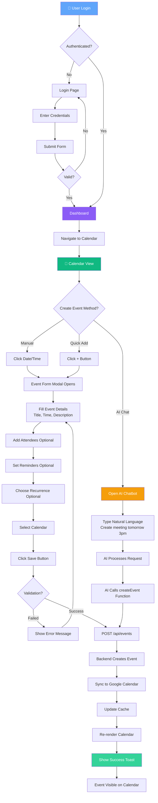
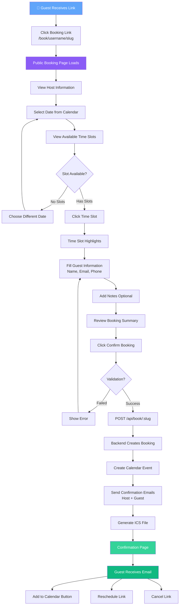
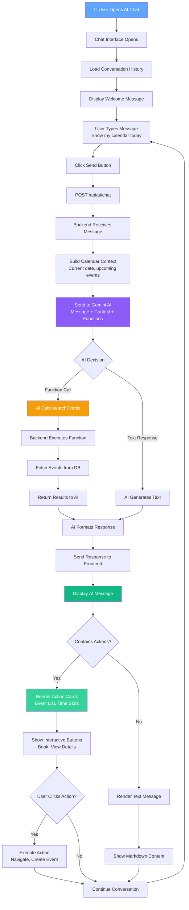
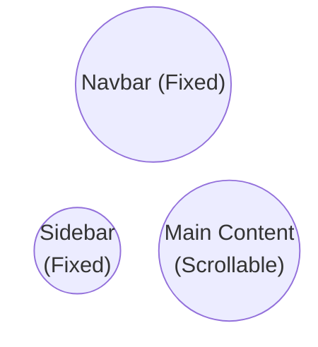

# **Chương II - Phần 4: THIẾT KẾ FRONTEND & UI/UX**

Phần này trình bày chi tiết về thiết kế giao diện người dùng (Frontend) và trải nghiệm người dùng (UI/UX) của hệ thống Calento, bao gồm component hierarchy, state management, design system, và accessibility.

## **1. Frontend Architecture**

### **1.1. Component Hierarchy (Cấu trúc Component)**

Hệ thống Frontend được tổ chức theo cấu trúc phân tầng rõ ràng, giúp quản lý code hiệu quả và dễ dàng bảo trì.

**Core Layouts**

Các layouts chính định hình khung sườn của ứng dụng. `RootLayout` là layout gốc bao bọc toàn bộ ứng dụng, chứa các cấu hình global như font chữ và theme. `DashboardLayout` dành cho phần quản trị sau khi đăng nhập, bao gồm Sidebar điều hướng và Header chứa thông tin user. `AuthLayout` được thiết kế riêng cho các trang xác thực như Login và Register với giao diện tập trung. `PublicBookingLayout` tối ưu hóa cho khách vãng lai đặt lịch. `MarketingLayout` dùng cho các trang giới thiệu sản phẩm (Landing, Blog, Contact).

**Page Components**

Các components cấp trang đại diện cho các màn hình chính. `DashboardPage` hiển thị tổng quan hoạt động và lịch trình sắp tới. `CalendarPage` là màn hình chính quản lý lịch với các chế độ xem ngày, tuần, tháng. `EventsPage` liệt kê và cho phép lọc, tìm kiếm sự kiện. `BookingPage` là giao diện cho khách chọn giờ và điền thông tin đặt lịch. `SettingsPage` cho phép người dùng cấu hình tài khoản và ứng dụng. `BlogPage` và `ContactPage` phục vụ nội dung tiếp thị và hỗ trợ.

**Feature Components**

Các components chức năng được chia nhỏ để tái sử dụng. Nhóm Calendar bao gồm `CalendarView` hiển thị lưới lịch, `EventCard` tóm tắt thông tin sự kiện, và `MiniCalendar` cho việc chọn ngày nhanh. Nhóm Booking chứa `TimeSlotPicker` để chọn giờ rảnh và `BookingForm` để điền thông tin. Nhóm AI tích hợp `ChatInterface` cho hội thoại và `ActionCard` hiển thị các đề xuất hành động từ AI.

**UI Foundation (Design System)**

Hệ thống sử dụng bộ UI components cơ bản được xây dựng nhất quán. `Button` có các biến thể primary, secondary, ghost. `Input` và `Form` components hỗ trợ validation tích hợp. `Modal` và `Dialog` dùng cho các tương tác overlay. `Toast` dùng để thông báo trạng thái hệ thống. `Card` và `Container` dùng để bố cục nội dung.

### **1.2. Frontend Sitemap & Page Structure**

**Application Route Structure:**

```mermaid
graph TB
    A[🏠 Root /] --> Auth[Auth Routes]
    A --> App[Dashboard Routes]
    A --> Marketing[Marketing Routes]
    A --> Public[Public Routes]

    Auth --> Login[Login /auth/login]
    Auth --> Register[Register /auth/register]
    Auth --> Forgot[Forgot Password]

    App --> Dashboard[Dashboard /dashboard]
    Dashboard --> Calendar[📅 Calendar /calendar]
    Dashboard --> Tasks[Tasks /tasks]
    Dashboard --> Priorities[📊 Priorities /schedule]
    Dashboard --> SchedulingLinks[🔗 Scheduling Links]
    Dashboard --> Chat[💬 AI Chat /chat]
    Dashboard --> Settings[⚙️ Settings]
    Dashboard --> Admin[Admin /admin]

    Marketing --> About[About /about]
    Marketing --> Pricing[Pricing /pricing]
    Marketing --> Blog[📝 Blog /blog]
    Marketing --> Contact[Contact /contact]
    Marketing --> Features[Features /features]

    Blog --> PostDetail[Post Detail /blog/:slug]
    Blog --> Category[Category /blog/category/:id]

    Public --> BookingPage["📆 Booking Page<br>/book/:username/:slug"]
    BookingPage --> DateSelection[Date Selection]
    BookingPage --> TimeSlotSelection[Time Slot Selection]
    BookingPage --> GuestInfo[Guest Information Form]
    BookingPage --> Confirm[Confirmation Page]

    style A fill:#60a5fa,color:#fff
    style Dashboard fill:#8b5cf6,color:#fff
    style Marketing fill:#f59e0b,color:#fff
    style BookingPage fill:#ec4899,color:#fff
```



### **1.3. Module Architecture**

**Frontend Structure:**

```
client/
├── app/                    # Next.js App Router
│   ├── (auth)/            # Auth pages
│   ├── (dashboard)/       # Protected pages (Dashboard, Calendar...)
│   ├── (admin)/           # Admin pages
│   ├── blog/              # Blog pages
│   ├── contact/           # Contact pages
│   ├── book/              # Public booking pages
│   └── api/               # API routes
├── components/            # React components
│   ├── calendar/         # Calendar UI
│   ├── chat/             # AI chatbot
│   ├── marketing/        # Landing page components
│   └── ui/               # Reusable UI
├── hook/                 # Custom React hooks
├── service/              # API services
├── store/                # Zustand stores
└── utils/                # Helper functions
```

## **2. State Management Strategy**

### **2.1. Server State (TanStack Query)**

TanStack Query được sử dụng để quản lý dữ liệu từ server, đóng vai trò quan trọng nhất trong ứng dụng. Thư viện này tự động xử lý việc caching API responses, giúp giảm tải cho server và tăng tốc độ hiển thị. Tính năng background fetching giữ cho dữ liệu luôn tươi mới mà không cần reload trang. Optimistic updates cho phép giao diện phản hồi ngay lập tức với hành động của người dùng (như tạo sự kiện) trước khi server trả về kết quả. Ngoài ra, nó còn quản lý loading và error states một cách tự động và nhất quán.

### **2.2. Client State (Zustand)**

Zustand quản lý các trạng thái toàn cục của ứng dụng ở phía client. `useAuthStore` lưu trữ thông tin user session và trạng thái xác thực. `useUIStore` quản lý trạng thái giao diện như theme (sáng/tối), trạng thái đóng mở sidebar, và các modals đang active. `useCalendarStore` lưu giữ các cấu hình hiển thị lịch như view mode (tháng/tuần/ngày) và ngày đang được chọn.

### **2.3. URL State (Next.js Router)**

Next.js Router quản lý trạng thái thông qua URL parameters, giúp chia sẻ trạng thái ứng dụng dễ dàng. Current page/route xác định màn hình hiện tại. Filter parameters lưu trữ các bộ lọc đang áp dụng. Search queries chứa từ khóa tìm kiếm. Selected date range lưu khoảng thời gian đang xem trên lịch.

## **3. User Flow Diagrams**

### **3.1. Event Creation Flow**



### **3.2. Booking Flow (Guest)**



### **3.3. AI Chatbot Interaction Flow**



## **4. Design System**

### **4.1. Color Palette**

| Loại | Mã màu | Sử dụng |
| :--- | :--- | :--- |
| **Primary** | `#2563EB` (Blue 600) | Brand color, buttons, links, active states |
| **Secondary** | `#4F46E5` (Indigo 600) | Accents, focus rings, secondary actions |
| **Success** | `#10B981` (Emerald 500) | Success messages, completed status, availability |
| **Warning** | `#F59E0B` (Amber 500) | Warnings, pending status |
| **Error** | `#EF4444` (Red 500) | Error messages, destructive actions, busy slots |
| **Neutral** | Slate 50-900 | Backgrounds, text, borders, dividers |

### **4.2. Typography**

Hệ thống sử dụng font chữ **Inter** từ Google Fonts, tối ưu cho giao diện web. Headings sử dụng các weight Bold (700) và Semibold (600) để tạo điểm nhấn. Body text dùng Regular (400) và Medium (500) để đảm bảo tính dễ đọc. Monospace font được dùng cho các đoạn code hoặc ID.

### **4.3. Spacing System**

Hệ thống spacing dựa trên base unit 4px (Tailwind scale). Scale bao gồm xs (4px), sm (8px), md (16px), lg (24px), xl (32px), 2xl (48px), và 3xl (64px).

### **4.4. Border Radius**

Các bo góc được chuẩn hóa để tạo cảm giác mềm mại. Small (4px) dùng cho inputs. Medium (8px) dùng cho cards. Large (12px) dùng cho modals. XL (16px) dùng cho containers lớn. Full (9999px) dùng cho buttons tròn hoặc avatars.

## **5. Component Library**

### **5.1. Atomic Components**

**Buttons** có các biến thể Primary (Solid), Secondary (Outlined), Ghost (No border), Icon (Square/circular), và Link (Text style).

**Form Inputs** bao gồm Text Input (Border, focus ring), Textarea (Resizable), Select (Dropdown with search), Checkbox (Custom styled), Radio (Circular), Switch (Toggle), Date Picker (Calendar popup), và Time Picker (Time selection).

**Feedback Components** cung cấp phản hồi cho người dùng. Toast hiển thị thông báo góc phải. Alert hiển thị tin nhắn inline. Modal hiển thị overlay trung tâm. Dialog dùng cho xác nhận. Loading hiển thị spinner hoặc skeleton. Progress hiển thị thanh tiến trình.

### **5.2. Composite Components**

**Calendar Components** quản lý hiển thị lịch. FullCalendar là view chính. EventCard hiển thị thông tin sự kiện. EventModal là form tạo/sửa. CalendarHeader điều hướng. DatePicker và TimeSlotPicker chọn thời gian.

**AI Chatbot Components** xây dựng giao diện chat. ChatBox là khung chat chính. MessageBubble hiển thị tin nhắn. ActionCard hiển thị kết quả function call. TimeSlotsList hiển thị giờ rảnh. InputBox nhập tin nhắn.

**Dashboard Components** tạo nên cấu trúc trang. Sidebar là menu điều hướng. Navbar là thanh công cụ trên cùng. Card chứa nội dung. Table hiển thị dữ liệu. Tabs chuyển đổi nội dung. Accordion thu gọn thông tin.

## **6. Layout & Navigation**

### **6.1. Layout Structure**



**Sidebar Navigation** bao gồm các mục Calendar, Tasks, Priorities, Scheduling Links, Analytics, và Settings.

**Navbar** chứa Search bar, Notifications, AI Chat toggle, và User menu.

### **6.2. Responsive Breakpoints**

Hệ thống hỗ trợ các breakpoints chuẩn: Mobile (< 640px), Tablet (640px - 1024px), Desktop (> 1024px), và Wide (> 1440px).

**Mobile Behavior**: Sidebar tự động thu gọn thành bottom navigation. Calendar chuyển sang chế độ xem gọn (compact view). Các bảng dữ liệu (Tables) chuyển thành dạng thẻ cuộn (scrollable cards) để tối ưu hiển thị.

## **7. Page Layouts**

### **7.1. Calendar Page**

**Layout** bao gồm Header (Month/Year, view switcher), Left Sidebar (Mini calendar, calendars list), Main Area (Full calendar view), và Right Panel (AI chatbot).

**Views** hỗ trợ Day View (Hourly timeline), Week View (7-day grid), Month View (Monthly grid), và Year View (12-month overview).

### **7.2. Event Detail Modal**

**Sections** bao gồm Header (Title, close button), Time & Date (Start/end picker), Details (Description, location), Attendees (Email list), Conference (Google Meet link), Reminders (Notification settings), Recurrence (RRULE builder), và Actions (Save, delete, cancel).

### **7.3. Booking Page (Public)**

**Layout** hiển thị Host Info (Avatar, name), Calendar (Available slots), Form (Guest info), và Confirmation (Success message).

**Flow** người dùng chọn ngày, chọn giờ, điền thông tin, xác nhận đặt lịch, và cuối cùng nhận email xác nhận.

### **7.4. Blog & Marketing Pages** (NEW)

**Blog Layout**: Dạng Grid Card Layout, hiển thị danh sách bài viết với Featured Post ở trên cùng. Sidebar bên phải chứa Categories, Popular Posts, và Newsletter form.

**Contact Page**: Layout 2 cột. Bên trái là thông tin liên hệ (Email, Social). Bên phải là Contact Form (Name, Email, Message) với validation.

## **8. Animations & Transitions**

### **8.1. Micro-interactions**

**Hover Effects**: Button scale lên 1.02 và tăng shadow. Card tăng độ cao shadow. Link hiện gạch chân.

**Active States**: Button scale xuống 0.98. Input đổi màu border. Checkbox có hiệu ứng fill.

**Loading States**: Sử dụng Skeleton screens cho nội dung đang tải, Spinner cho các hành động bất đồng bộ, và Progress bar cho việc upload.

### **8.2. Page Transitions**

Hệ thống sử dụng Fade in/out (200ms) khi chuyển trang. Slide animations (300ms) cho các thành phần trượt. Modal appear (Scale + fade, 200ms) khi mở hộp thoại. Ease function mặc định là `ease-in-out`.

## **9. Accessibility (A11Y)**

### **9.1. Keyboard Navigation**

**Shortcuts** hỗ trợ phím tắt như `N` (New event), `T` (Today), `←/→` (Navigate dates), `/` (Search), và `?` (Help).

**Focus Management** đảm bảo visible focus indicators, logical tab order, và skip to main content link.

### **9.2. Screen Reader Support**

Sử dụng Semantic HTML tags, ARIA labels và roles đầy đủ. Hình ảnh luôn có Alt text. Live regions được dùng để thông báo cập nhật động.

### **9.3. Color Contrast**

Tuân thủ chuẩn WCAG AAA với tỷ lệ tương phản Text là 7:1 và Interactive elements là 4.5:1.

## **10. AI System Design**

### **10.1. Function Calling Architecture**

**Available Functions**

| Function | Mô tả |
| :--- | :--- |
| `createEvent` | Tạo sự kiện trong lịch |
| `checkAvailability` | Kiểm tra thời gian trống |
| `searchEvents` | Tìm kiếm sự kiện |
| `updateEvent` | Cập nhật sự kiện |
| `deleteEvent` | Xóa sự kiện |
| `createTask` | Tạo task mới |
| `createLearningPlan` | Tạo kế hoạch học tập |

**Function Schema**

| Trường | Kiểu dữ liệu | Mô tả |
| :--- | :--- | :--- |
| `name` | string | Tên của hàm (ví dụ: createEvent) |
| `description` | string | Mô tả chức năng của hàm để AI hiểu |
| `parameters` | object | Định nghĩa cấu trúc tham số (JSON Schema) |

### **10.2. Context Management**

**Calendar Context** bao gồm Current date/time, User preferences, Upcoming events (7 ngày tới), và Recent bookings.

**Conversation Context** lưu trữ Message history (10 tin nhắn cuối), Function call results, User intent tracking, và Error history.

## **11. Implementation Status**

### **11.1. Implemented Components**

**Layout** đã hoàn thiện Sidebar navigation, Navbar, và Responsive container.

**Calendar** đã có FullCalendar, Event cards, Event modal, và Date/time pickers.

**AI Chatbot** đã tích hợp Chat interface, Message bubbles, Action results, và Time slots list.

**Forms** đã có đầy đủ Input fields, Selects, Checkboxes, và Date/time pickers.

**Feedback** đã triển khai Toast notifications, Loading states, và Error boundaries.

**Public Pages** đã hoàn thiện Booking page, Login/Register pages. Blog và Contact pages đang được phát triển.

### **11.2. Planned Components**

**Advanced Calendar** sẽ bổ sung Drag & drop, Multi-day events, Resource scheduling, và Print preview.

**Team Features** sẽ phát triển Shared calendars, Team availability view, Meeting polls, và Round-robin scheduling.

**Analytics Dashboard** sẽ thêm Charts, Time tracking, Productivity metrics, và Export reports.

---

**Xem thêm:**
- [Phần 1: Kiến trúc hệ thống](./02_1_Kien_Truc_He_Thong.md)
- [Phần 2: Thiết kế Database](./02_2_Thiet_Ke_Database.md)
- [Phần 3: Thiết kế API](./02_3_Thiet_Ke_API.md)
