# **Chương II. THIẾT KẾ HỆ THỐNG**

Chương này trình bày chi tiết về kiến trúc và thiết kế hệ thống Calento, bao gồm cách các thành phần hoạt động, luồng dữ liệu, và cấu trúc database. Mục tiêu là giúp hiểu rõ cách mà frontend, backend, database và các dịch vụ bên ngoài tương tác với nhau để tạo nên một hệ thống hoàn chỉnh.

## **1\. Kiến trúc tổng thể**

### **1.1. Tổng quan về kiến trúc**

**Calento** được xây dựng theo mô hình **Client-Server Architecture** (Kiến trúc khách-chủ), trong đó:
- **Client (Khách)**: Ứng dụng web chạy trên trình duyệt của người dùng
- **Server (Chủ)**: Backend API server xử lý logic và quản lý dữ liệu
- **Database**: PostgreSQL lưu trữ dữ liệu lâu dài
- **Cache**: Redis lưu trữ tạm để tăng tốc độ

Hệ thống được chia thành **6 layers (tầng) chính**:

1. **Client Layer** - Giao diện người dùng
2. **API Gateway Layer** - Cổng kiểm soát requests
3. **Service Layer** - Xử lý logic nghiệp vụ
4. **Data Layer** - Lưu trữ dữ liệu
5. **External Services** - Dịch vụ bên thứ ba
6. **Background Jobs** - Xử lý tác vụ nền

### **1.2. Sơ đồ kiến trúc tổng thể**

Hệ thống Calento được thiết kế theo kiến trúc phân tầng (layered architecture) với 3 tầng chính:

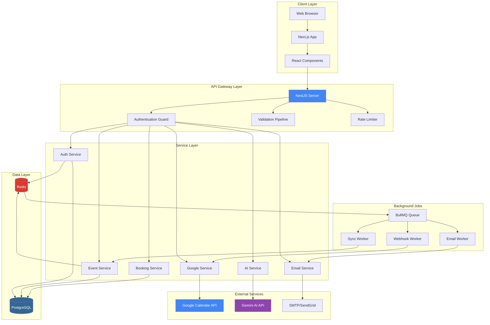

### **1.3. Giải thích chi tiết các tầng**

#### **Tầng 1: Client Layer (Tầng giao diện người dùng)**

**Web Browser:**
- Trình duyệt của người dùng (Chrome, Firefox, Safari, Edge)
- Render HTML, CSS, JavaScript để hiển thị giao diện
- Xử lý các tương tác của user (click, typing, scrolling)

**Next.js App:**
- Framework React cho phía client
- Server-Side Rendering (SSR): Render HTML trên server trước khi gửi cho browser
- Static Site Generation (SSG): Pre-build các trang tĩnh để load nhanh
- App Router: Hệ thống định tuyến dựa trên cấu trúc thư mục

**React Components:**
- Các thành phần UI như Button, Calendar, Modal, Form
- Mỗi component là một đơn vị độc lập, có thể tái sử dụng
- Ví dụ: `EventCard`, `CalendarView`, `ChatBox`

**Luồng hoạt động:**
```
User click button → React Component xử lý event
                  → Gọi API service
                  → Nhận response
                  → Update UI
```

#### **Tầng 2: API Gateway Layer (Tầng kiểm soát truy cập)**

Đây là tầng "cổng" nơi mọi request từ client phải đi qua trước khi được xử lý.

**NestJS Server:**
- API server chính chạy trên Node.js
- Nhận tất cả HTTP requests từ client
- Port: 8000 (development), 80/443 (production)

**Authentication Guard (Bảo vệ xác thực):**
- Kiểm tra JWT token trong mỗi request
- Nếu token hợp lệ → Cho phép tiếp tục
- Nếu token không hợp lệ hoặc hết hạn → Trả về 401 Unauthorized
- Public routes (login, register, public booking) không cần token

**Validation Pipeline (Đường ống xác thực dữ liệu):**
- Kiểm tra dữ liệu đầu vào từ client
- Sử dụng DTO (Data Transfer Object) để định nghĩa cấu trúc dữ liệu
- Ví dụ: Event title phải có, start_time phải trước end_time
- Nếu dữ liệu không hợp lệ → Trả về 400 Bad Request với error details

**Rate Limiter (Giới hạn tần suất):**
- Giới hạn số request từ một IP trong khoảng thời gian
- Ngăn chặn spam và DDoS attacks
- Ví dụ: Tối đa 100 requests/phút từ 1 IP

**Ví dụ luồng request qua Gateway:**
```
1. Client gửi: POST /api/events + JWT token
2. Authentication Guard: Kiểm tra token ✓ Valid
3. Validation Pipeline: Kiểm tra data ✓ Valid
4. Rate Limiter: Kiểm tra rate ✓ OK (50/100 requests)
5. → Forward request đến Service Layer
```

#### **Tầng 3: Service Layer (Tầng xử lý nghiệp vụ)**

Đây là nơi chứa logic chính của ứng dụng. Mỗi service phụ trách một chức năng cụ thể.

**1. Auth Service (Dịch vụ xác thực):**
- Xử lý đăng ký, đăng nhập, đăng xuất
- Tạo và verify JWT tokens
- Refresh access tokens khi hết hạn
- Quản lý sessions

**2. Event Service (Dịch vụ quản lý sự kiện):**
- CRUD operations cho events
- Xử lý recurring events (sự kiện lặp lại)
- Expand RRULE thành danh sách occurrences
- Search và filter events

**3. Booking Service (Dịch vụ đặt lịch):**
- Quản lý booking links
- Tính toán available time slots
- Tạo bookings từ guests
- Gửi confirmation emails

**4. AI Service (Dịch vụ AI Chatbot):**
- Nhận chat messages từ user
- Gọi Gemini AI API với context
- Xử lý function calling results
- Lưu conversation history

**5. Google Service (Dịch vụ Google Calendar):**
- OAuth 2.0 authentication với Google
- Sync events hai chiều (Calento ↔ Google)
- Setup và xử lý webhooks
- Refresh access tokens tự động

**6. Email Service (Dịch vụ Email):**
- Gửi email confirmation, reminders
- Render email templates với Handlebars
- Track email delivery status
- Retry failed emails

**Nguyên tắc hoạt động:**
- Mỗi service chỉ làm một việc (Single Responsibility)
- Service gọi Repository để truy vấn database
- Service không biết chi tiết về database queries
- Service có thể gọi service khác nếu cần

#### **Tầng 4: Data Layer (Tầng lưu trữ dữ liệu)**

**PostgreSQL (Primary Database):**
- Lưu trữ tất cả dữ liệu chính: users, events, bookings
- ACID compliant: Đảm bảo dữ liệu toàn vẹn
- Hỗ trợ complex queries, joins, indexes
- Persistent storage: Dữ liệu lưu vĩnh viễn

**Redis (Cache & Session Store):**
- Lưu tạm dữ liệu thường truy cập
- In-memory: Cực kỳ nhanh (microseconds)
- Session storage: Lưu JWT refresh tokens
- Queue backend: Lưu background jobs

**Tại sao cần cả hai?**
- PostgreSQL: Dữ liệu quan trọng, cần lưu lâu dài
- Redis: Dữ liệu tạm thời, cần truy cập nhanh

**Ví dụ:**
```
User load calendar tháng 11:
1. Check Redis cache → Cache hit! (đã lưu từ lần trước)
2. Return data từ Redis → Nhanh (5ms)
3. Không cần query PostgreSQL

User tạo event mới:
1. Insert vào PostgreSQL → Dữ liệu lưu vĩnh viễn
2. Invalidate Redis cache cho tháng 11
3. Lần load tiếp theo sẽ query PostgreSQL và cache lại
```

#### **Tầng 5: External Services (Dịch vụ bên thứ ba)**

**Google Calendar API:**
- Cho phép đọc và tạo events trên Google Calendar
- Sử dụng OAuth 2.0 để xác thực
- Webhook notifications khi có thay đổi
- API endpoint: `https://www.googleapis.com/calendar/v3/`

**Gemini AI API:**
- Large Language Model của Google
- Xử lý natural language từ user
- Function calling để thực hiện actions
- API endpoint: `https://generativelanguage.googleapis.com/`

**SMTP/SendGrid:**
- Gửi email notifications
- SMTP: Simple Mail Transfer Protocol (giao thức gửi email)
- SendGrid: Email delivery service (tỷ lệ delivered cao)
- Track email opens, clicks (với SendGrid)

**Lợi ích của việc tích hợp:**
- Không cần tự xây dựng AI model → Tiết kiệm thời gian
- Sync với Google Calendar → User không cần nhập lại
- Email delivery đáng tin cậy → Không bị spam

#### **Tầng 6: Background Jobs (Xử lý tác vụ nền)**

Một số tác vụ mất thời gian và không cần làm ngay lập tức. Chúng được đưa vào queue (hàng đợi) để xử lý nền.

**BullMQ Queue:**
- Hệ thống quản lý job queue
- Lưu jobs trong Redis
- Hỗ trợ priority, retry, scheduling

**Email Worker:**
- Lấy email jobs từ queue
- Gửi email qua SMTP/SendGrid
- Retry nếu thất bại (tối đa 3 lần)

**Sync Worker:**
- Đồng bộ events với Google Calendar
- Chạy theo lịch (mỗi 5 phút)
- Xử lý batch operations

**Webhook Worker:**
- Nhận notifications từ Google
- Parse webhook payload
- Trigger sync nếu có thay đổi

**Ví dụ thực tế:**
```
User book một cuộc hẹn:
1. API tạo booking ngay → Return 201 Created (nhanh, ~100ms)
2. Thêm job "gửi email" vào queue → Async
3. Email Worker xử lý job sau 1-2 giây
4. Guest nhận email confirmation
```

Lợi ích:
- User không phải chờ email gửi xong
- Nếu email server down, job tự retry
- Server không bị quá tải khi nhiều requests đồng thời

### **1.4. Luồng dữ liệu (Data Flow)**

Phần này giải thích chi tiết cách dữ liệu di chuyển qua các tầng của hệ thống, từ lúc user thực hiện một hành động cho đến khi nhận được kết quả.

#### **1.4.1. Sơ đồ luồng dữ liệu tổng quát**

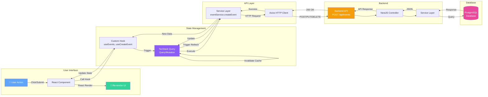

#### **1.4.2. Giải thích từng bước trong luồng dữ liệu**

Giả sử user muốn tạo một sự kiện mới "Họp team ngày mai 2h chiều". Đây là những gì xảy ra trong hệ thống:

**Bước 1-2: User Action & React Component**
```
User fills form:
- Title: "Họp team"
- Start: "2024-11-10 14:00"
- End: "2024-11-10 15:00"

User clicks "Save" button
→ React Component bắt sự kiện onClick
→ Component gọi function handleSubmit()
```

**Bước 3: Custom Hook**
```typescript
// Component gọi custom hook
const { mutate: createEvent } = useCreateEvent();

createEvent({
  title: "Họp team",
  start_time: "2024-11-10T14:00:00",
  end_time: "2024-11-10T15:00:00"
});
```

**Bước 4: TanStack Query Mutation**
- Hook `useCreateEvent` trigger một mutation
- Mutation sẽ:
  - Set `isLoading = true` → Component hiện loading spinner
  - Gọi service layer để thực hiện request
  - Handle success/error states

**Bước 5: Service Layer (Frontend)**
```typescript
// eventService.ts
export const eventService = {
  createEvent: async (data) => {
    return apiClient.post('/events', data);
  }
};
```

**Bước 6: Axios HTTP Client**
```
POST http://localhost:8000/api/events
Headers:
  Authorization: Bearer eyJhbGc...
  Content-Type: application/json
Body:
  {
    "title": "Họp team",
    "start_time": "2024-11-10T14:00:00",
    "end_time": "2024-11-10T15:00:00"
  }
```

**Bước 7-9: Backend Processing**

**Controller (EventController):**
```typescript
@Post('/events')
@UseGuards(JwtAuthGuard)  // Kiểm tra authentication
async create(@CurrentUser() user, @Body() dto: CreateEventDto) {
  return this.eventService.create(user.id, dto);
}
```

**Service (EventService):**
```typescript
async create(userId: string, dto: CreateEventDto) {
  // 1. Validate thời gian
  if (dto.end_time <= dto.start_time) {
    throw new BadRequestException('End time must be after start time');
  }
  
  // 2. Get primary calendar
  const calendar = await this.calendarService.getPrimary(userId);
  
  // 3. Create event
  const event = await this.eventRepository.create({
    ...dto,
    user_id: userId,
    calendar_id: calendar.id
  });
  
  // 4. Sync with Google if connected
  if (calendar.is_synced) {
    await this.googleService.createEvent(userId, event);
  }
  
  return event;
}
```

**Bước 10: Database Query**
```sql
INSERT INTO events (
  id, user_id, calendar_id, title, 
  start_time, end_time, created_at, updated_at
) VALUES (
  gen_random_uuid(), 
  '123e4567...', 
  '987fcdeb...', 
  'Họp team',
  '2024-11-10 14:00:00',
  '2024-11-10 15:00:00',
  NOW(),
  NOW()
) RETURNING *;
```

**Bước 11: Response trả về**
```json
{
  "success": true,
  "data": {
    "id": "abc-def-123",
    "title": "Họp team",
    "start_time": "2024-11-10T14:00:00Z",
    "end_time": "2024-11-10T15:00:00Z",
    "created_at": "2024-11-09T18:30:00Z"
  }
}
```

**Bước 12: Cache Update**
```typescript
// TanStack Query tự động:
1. Invalidate cache cho queries liên quan:
   - queryKey: ['events', { month: 11, year: 2024 }]
   - queryKey: ['events', 'upcoming']

2. Trigger refetch để lấy data mới

3. Update cache với data mới
```

**Bước 13: Re-render UI**
```
React Component re-render với:
- isLoading = false
- data = new event
- Calendar view tự động hiện event mới
- Toast notification: "Event created successfully!"
```

#### **1.4.3. Các tính năng quan trọng của luồng dữ liệu**

**1. Automatic Caching (Cache tự động):**

TanStack Query tự động cache API responses:
```
Lần đầu load calendar tháng 11:
→ Gọi API GET /events?month=11&year=2024
→ Cache với key: ['events', {month: 11, year: 2024}]
→ Thời gian cache: 5 phút

Lần sau load tháng 11:
→ Load từ cache (không gọi API)
→ Nhanh chóng, tiết kiệm bandwidth
```

**2. Optimistic Updates (Cập nhật lạc quan):**

UI update ngay lập tức TRƯỚC KHI API response:
```typescript
const { mutate } = useCreateEvent({
  onMutate: async (newEvent) => {
    // 1. Cancel outgoing refetches
    await queryClient.cancelQueries(['events']);
    
    // 2. Snapshot current cache
    const previousEvents = queryClient.getQueryData(['events']);
    
    // 3. Optimistically update cache
    queryClient.setQueryData(['events'], (old) => [...old, newEvent]);
    
    // 4. Return rollback function
    return { previousEvents };
  },
  
  onError: (err, newEvent, context) => {
    // Rollback nếu API thất bại
    queryClient.setQueryData(['events'], context.previousEvents);
  }
});
```

Lợi ích:
- UI phản hồi ngay lập tức
- Trải nghiệm người dùng mượt mà
- Tự động rollback nếu lỗi

**3. Error Handling (Xử lý lỗi tập trung):**

Errors được bắt và xử lý tại mọi tầng:

**Frontend:**
```typescript
const { mutate, error, isError } = useCreateEvent();

if (isError) {
  toast.error(error.message); // Hiện notification lỗi
}
```

**Backend:**
```typescript
try {
  await this.eventService.create(userId, dto);
} catch (error) {
  if (error instanceof ValidationError) {
    throw new BadRequestException(error.message);
  }
  throw new InternalServerErrorException('Failed to create event');
}
```

**4. Loading States (Trạng thái loading tự động):**

```typescript
const { isLoading, isFetching } = useEvents();

if (isLoading) return <Spinner />;
if (isFetching) return <RefetchIndicator />;
```

**5. Query Invalidation (Làm mới cache thông minh):**

Khi tạo event mới, cache bị invalidate:
```typescript
// Sau khi create event thành công
queryClient.invalidateQueries(['events']); // Tất cả event queries
queryClient.invalidateQueries(['events', { month: 11 }]); // Chỉ tháng 11
```

Chỉ invalidate queries liên quan, không ảnh hưởng queries khác.

### **2.3. Frontend Sitemap & Page Structure**

**Application Route Structure:**

```mermaid
graph TB
    A[🏠 Root /] --> B[Login Page]
    A --> C[Register Page]
    A --> Dashboard[Dashboard /dashboard]

    Dashboard --> Calendar[📅 Calendar /calendar]
    Dashboard --> Tasks[Tasks /tasks]
    Dashboard --> Priorities[📊 Priorities /schedule]
    Dashboard --> SchedulingLinks[🔗 Scheduling Links /scheduling-links]
    Dashboard --> Chat[💬 AI Chat /chat]
    Dashboard --> Settings[⚙️ Settings /settings]

    Calendar --> DayView[Day View]
    Calendar --> WeekView[Week View]
    Calendar --> MonthView[Month View]
    Calendar --> YearView[Year View]
    Calendar --> EventDetail[Event Detail Modal]
    Calendar --> EventForm[Event Form Modal]

    Tasks --> AllTasks[All Tasks]
    Tasks --> Today[Today]
    Tasks --> Upcoming[Upcoming]
    Tasks --> Completed[Completed]

    Priorities --> Critical[Critical Priority]
    Priorities --> High[High Priority]
    Priorities --> Medium[Medium Priority]
    Priorities --> Low[Low Priority]
    Priorities --> Disabled[Disabled Items]

    SchedulingLinks --> MyLinks[My Links]
    SchedulingLinks --> CreateLink[Create Link Modal]
    SchedulingLinks --> EditLink[Edit Link Modal]
    SchedulingLinks --> LinkAnalytics[Link Analytics]

    Chat --> NewChat[New Conversation]
    Chat --> History[Conversation History]
    Chat --> AI_FnCalls[AI Function Calls]

    Settings --> Profile[Profile Settings]
    Settings --> CalSettings[Calendar Settings]
    Settings --> Notify[Notification Settings]
    Settings --> GoogleSync[Google Calendar Sync]
    Settings --> Security[Security Settings]

    PublicRoutes[Public Routes] --> BookingPage["📆 Booking Page<br>/book/:username/:slug"]
    BookingPage --> DateSelection[Date Selection]
    BookingPage --> TimeSlotSelection[Time Slot Selection]
    BookingPage --> GuestInfo[Guest Information Form]
    BookingPage --> Confirm[Confirmation Page]

    style A fill:#60a5fa,color:#fff
    style Dashboard fill:#8b5cf6,color:#fff
    style Calendar fill:#10b981,color:#fff
    style Chat fill:#f59e0b,color:#fff
    style BookingPage fill:#ec4899,color:#fff

```

**Component Hierarchy:**

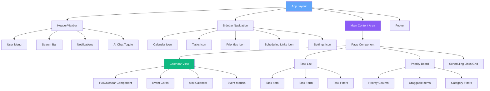

### **2.4. User Flow Diagrams**

**Main User Journey - Event Creation:**

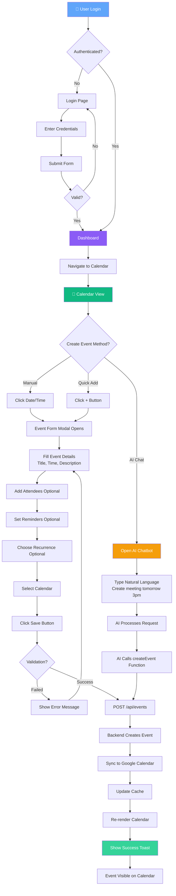

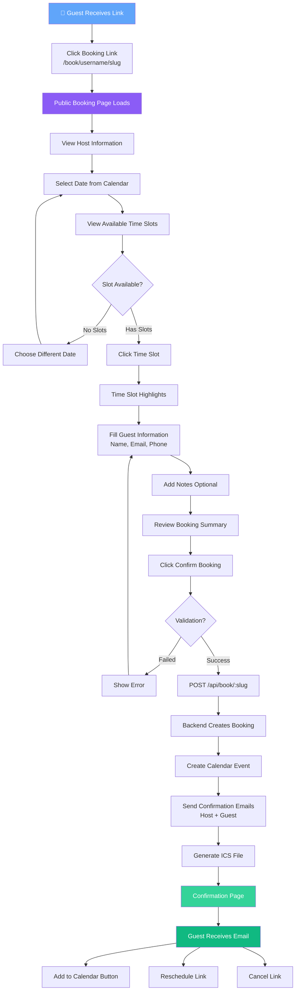

**AI Chatbot Interaction Flow:**

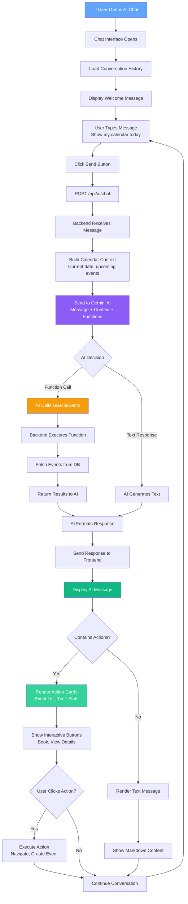

### **2.5. Module Architecture

**Backend Modules (NestJS):**

- **Common Module**: Shared services, guards, interceptors
- **Auth Module**: Authentication và authorization
- **Users Module**: User management
- **Event Module**: Calendar events management
- **Booking Module**: Scheduling links system
- **Google Module**: Google Calendar integration
- **AI Module**: Gemini AI chatbot
- **Email Module**: Email notifications
- **Queue Module**: Background job processing
- **Webhook Module**: External service notifications

**Frontend Structure:**

```
client/
├── app/                    # Next.js App Router
│   ├── (auth)/            # Auth pages
│   ├── (dashboard)/       # Protected pages
│   └── api/               # API routes
├── components/            # React components
│   ├── calendar/         # Calendar UI
│   ├── chat/             # AI chatbot
│   └── ui/               # Reusable UI
├── hook/                 # Custom React hooks
├── service/              # API services
├── store/                # Zustand stores
└── utils/                # Helper functions
```

## **2\. Server Flows**

### **2.1. Authentication Flow (Login)**

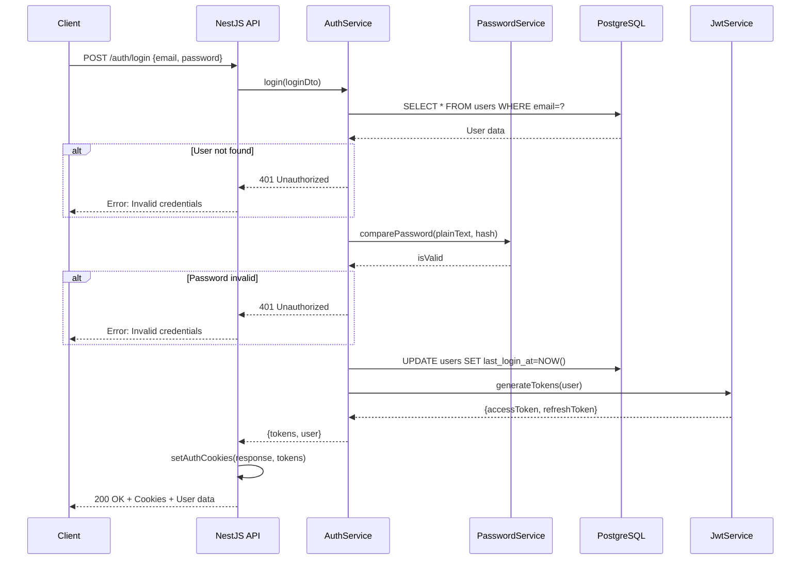

### **2.2. Event Creation Flow**

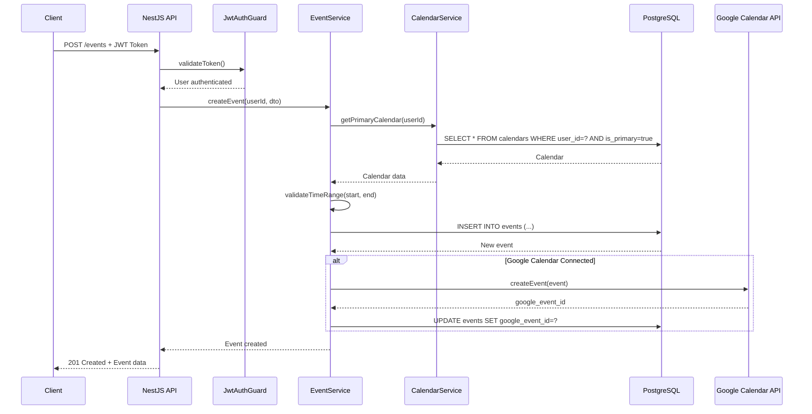

### **2.3. AI Chatbot Flow**

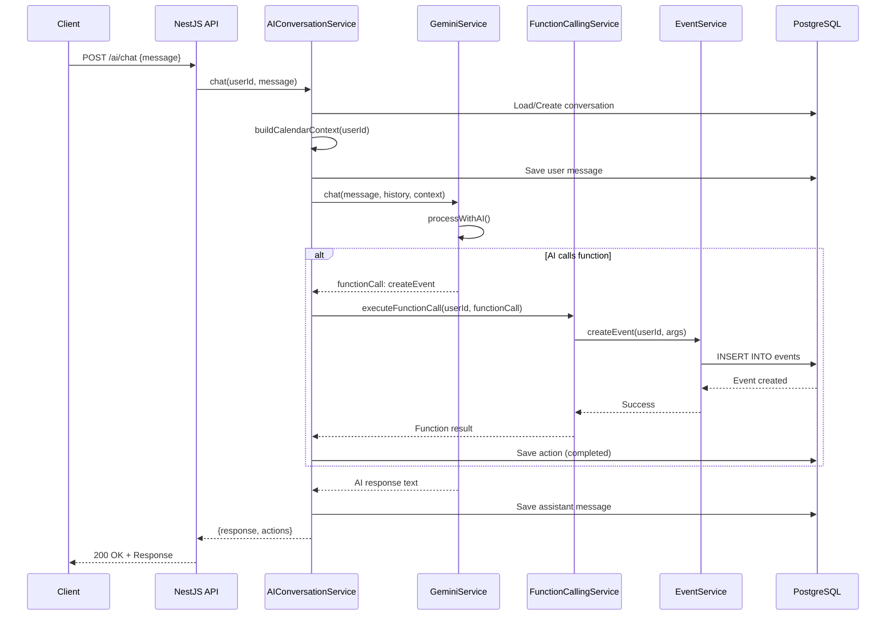

### **2.4. Google Calendar Sync Flow**

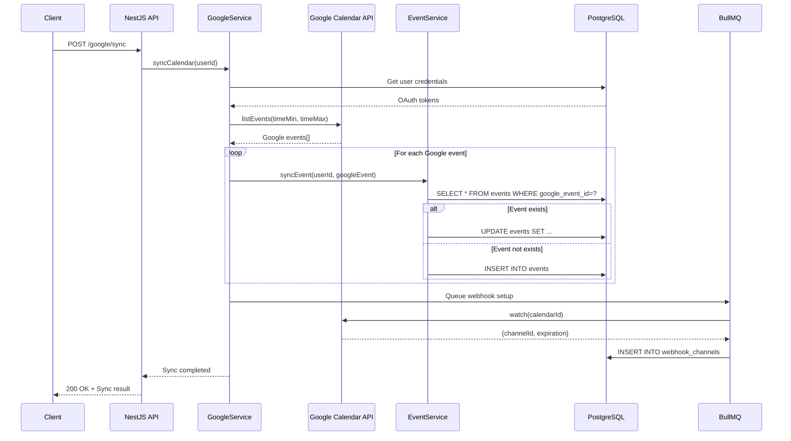

### **2.5. Booking Flow (Guest)**

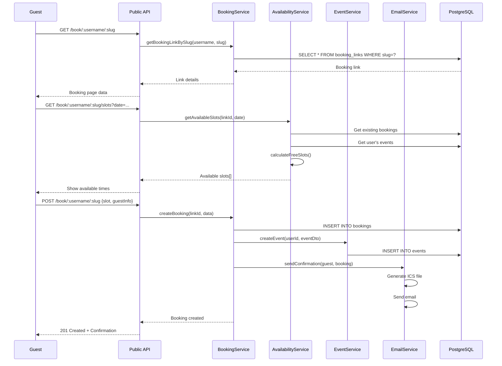

### **2.6. Database Migration Flow (Raw SQL)**

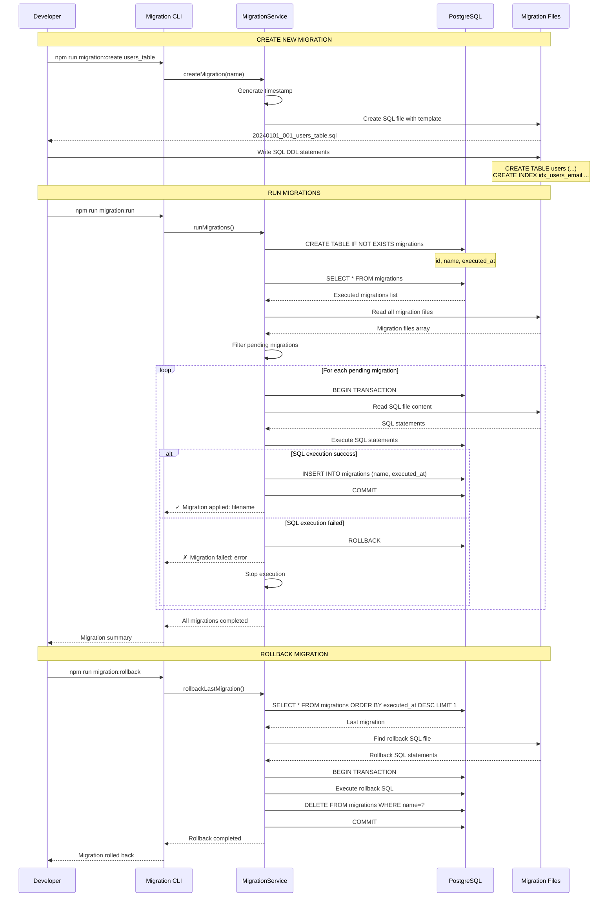

**Migration File Structure:**

**Create Migration:**

```sql
-- 20240101_001_create_users_table.sql
-- UP Migration
CREATE TABLE IF NOT EXISTS users (
    id UUID PRIMARY KEY DEFAULT gen_random_uuid(),
    email VARCHAR(255) UNIQUE NOT NULL,
    username VARCHAR(255) UNIQUE NOT NULL,
    password_hash TEXT NOT NULL,
    created_at TIMESTAMP DEFAULT CURRENT_TIMESTAMP,
    updated_at TIMESTAMP DEFAULT CURRENT_TIMESTAMP
);

CREATE INDEX idx_users_email ON users(email);
CREATE INDEX idx_users_username ON users(username);

-- Auto-update timestamp trigger
CREATE OR REPLACE FUNCTION update_updated_at_column()
RETURNS TRIGGER AS $$
BEGIN
    NEW.updated_at = CURRENT_TIMESTAMP;
    RETURN NEW;
END;
$$ language 'plpgsql';

CREATE TRIGGER update_users_updated_at 
    BEFORE UPDATE ON users 
    FOR EACH ROW 
    EXECUTE FUNCTION update_updated_at_column();
```

**Rollback Migration:**

```sql
-- 20240101_001_create_users_table_rollback.sql
-- DOWN Migration
DROP TRIGGER IF EXISTS update_users_updated_at ON users;
DROP FUNCTION IF EXISTS update_updated_at_column();
DROP INDEX IF EXISTS idx_users_username;
DROP INDEX IF EXISTS idx_users_email;
DROP TABLE IF EXISTS users CASCADE;
```

**Migration Service Implementation:**

```typescript
// Raw SQL - No ORM
export class MigrationService {
  async runMigrations(): Promise<void> {
    // 1. Ensure migrations table exists
    await this.db.query(`
      CREATE TABLE IF NOT EXISTS migrations (
        id SERIAL PRIMARY KEY,
        name VARCHAR(255) UNIQUE NOT NULL,
        executed_at TIMESTAMP DEFAULT CURRENT_TIMESTAMP
      )
    `);

    // 2. Get executed migrations
    const { rows: executed } = await this.db.query(
      'SELECT name FROM migrations ORDER BY executed_at'
    );
    const executedSet = new Set(executed.map(r => r.name));

    // 3. Get all migration files
    const files = await fs.readdir('./migrations');
    const pending = files
      .filter(f => f.endsWith('.sql') && !f.includes('rollback'))
      .filter(f => !executedSet.has(f))
      .sort();

    // 4. Execute each pending migration
    for (const file of pending) {
      const sql = await fs.readFile(`./migrations/${file}`, 'utf8');
  
      try {
        await this.db.query('BEGIN');
  
        // Execute migration SQL
        await this.db.query(sql);
  
        // Record migration
        await this.db.query(
          'INSERT INTO migrations (name) VALUES ($1)',
          [file]
        );
  
        await this.db.query('COMMIT');
        console.log(`✓ Applied: ${file}`);
      } catch (error) {
        await this.db.query('ROLLBACK');
        console.error(`✗ Failed: ${file}`, error);
        throw error;
      }
    }
  }
}
```

**Key Features:**

1. **Pure SQL**: Không sử dụng ORM, chỉ raw SQL queries
2. **Transaction Safety**: Mỗi migration chạy trong transaction
3. **Tracking**: Table `migrations` track executed migrations
4. **Rollback Support**: Mỗi migration có file rollback tương ứng
5. **Idempotent**: Sử dụng `IF NOT EXISTS`, `IF EXISTS`
6. **Order Guarantee**: Migration files có timestamp prefix
7. **Error Handling**: Rollback nếu migration fails

## **2\. Thiết kế Database**

Database (cơ sở dữ liệu) là nơi lưu trữ toàn bộ thông tin của ứng dụng. Calento sử dụng PostgreSQL - một hệ quản trị cơ sở dữ liệu quan hệ (RDBMS) để lưu trữ dữ liệu dưới dạng các bảng (tables) có liên kết với nhau.

### **2.1. Tổng quan về cấu trúc Database**

Hệ thống Calento sử dụng **15 tables chính** trong PostgreSQL database. Mỗi table lưu trữ một loại dữ liệu cụ thể:

| STT | Table Name       | Mô tả                  | Records ước tính |
| --- | ---------------- | ------------------------ | ------------------- |
| 1   | users            | Thông tin người dùng | ~10,000             |
| 2   | calendars        | Calendar của user       | ~10,000             |
| 3   | events           | Calendar events          | ~500,000            |
| 4   | booking_links    | Scheduling links         | ~50,000             |
| 5   | bookings         | Guest bookings           | ~200,000            |
| 6   | user_credentials | OAuth tokens             | ~10,000             |
| 7   | webhook_channels | Google webhooks          | ~10,000             |
| 8   | ai_conversations | AI chat sessions         | ~100,000            |
| 9   | ai_actions       | AI function calls        | ~500,000            |
| 10  | email_logs       | Email tracking           | ~1,000,000          |
| 11  | email_templates  | Email templates          | ~50                 |
| 12  | priorities       | Priority board items     | ~100,000            |
| 13  | tasks            | Task management          | ~200,000            |
| 14  | habits           | Habit tracking           | ~50,000             |
| 15  | notifications    | System notifications     | ~500,000            |

### **2.2. Mối quan hệ giữa các Tables**

Các tables trong database có mối quan hệ với nhau thông qua **Foreign Keys** (khóa ngoại):

```
users (1) ----< (nhiều) calendars
users (1) ----< (nhiều) events
users (1) ----< (nhiều) booking_links
calendars (1) ----< (nhiều) events
booking_links (1) ----< (nhiều) bookings
events (1) ----< (1) bookings
```

**Giải thích:**
- **1:nhiều** (one-to-many): Một user có nhiều calendars, nhiều events
- **Foreign Key**: Liên kết giữa 2 tables (VD: `events.user_id` → `users.id`)

**Ví dụ cụ thể:**
```
User "John Doe" (id: abc-123)
  ├── Calendar "Work" (id: cal-001)
  │   ├── Event "Team Meeting" (id: evt-001)
  │   └── Event "Project Review" (id: evt-002)
  ├── Calendar "Personal" (id: cal-002)
  │   └── Event "Doctor Appointment" (id: evt-003)
  └── Booking Link "30-min Call" (id: link-001)
      ├── Booking từ "Alice" (id: book-001)
      └── Booking từ "Bob" (id: book-002)
```

### **2.3. Chi tiết các Tables chính**

#### **Table 1: users (Người dùng)**

**Mục đích:** Lưu trữ thông tin tài khoản người dùng và dữ liệu xác thực.

**Cấu trúc:**

| Column        | Type         | Constraints                | Description            |
| ------------- | ------------ | -------------------------- | ---------------------- |
| id            | UUID         | PRIMARY KEY                | User ID                |
| email         | VARCHAR(255) | UNIQUE, NOT NULL           | Email address          |
| username      | VARCHAR(255) | UNIQUE, NOT NULL           | Username               |
| password_hash | TEXT         | NOT NULL                   | Bcrypt hashed password |
| first_name    | VARCHAR(100) |                            | First name             |
| last_name     | VARCHAR(100) |                            | Last name              |
| avatar        | TEXT         |                            | Avatar URL             |
| timezone      | VARCHAR(50)  | DEFAULT 'Asia/Ho_Chi_Minh' | User timezone          |
| status        | VARCHAR(20)  | DEFAULT 'active'           | Account status         |
| last_login_at | TIMESTAMP    |                            | Last login time        |
| created_at    | TIMESTAMP    | DEFAULT NOW()              | Created timestamp      |
| updated_at    | TIMESTAMP    | DEFAULT NOW()              | Updated timestamp      |

**Indexes (Chỉ mục):**

Indexes giúp tìm kiếm dữ liệu nhanh hơn, giống như mục lục trong sách.

- `idx_users_email` ON email - Tìm user theo email nhanh
- `idx_users_username` ON username - Tìm user theo username nhanh
- `idx_users_status` ON status - Lọc users theo status (active/inactive)

**Ví dụ dữ liệu:**

| id      | email             | username | password_hash | first_name | last_name | timezone          | status |
| ------- | ----------------- | -------- | ------------- | ---------- | --------- | ----------------- | ------ |
| abc-123 | john@example.com  | johndoe  | $2b$10$...   | John       | Doe       | Asia/Ho_Chi_Minh | active |
| def-456 | alice@example.com | alice123 | $2b$10$...   | Alice      | Smith     | America/New_York | active |

**Constraints quan trọng:**
- **PRIMARY KEY**: `id` là duy nhất, không trùng lặp
- **UNIQUE**: `email` và `username` không được trùng (mỗi user một email)
- **NOT NULL**: Các field quan trọng phải có giá trị

#### **Table 2: calendars (Lịch)**

**Mục đích:** Lưu trữ các calendars của user. Mỗi user có thể có nhiều calendars (Work, Personal, Study...).

**Cấu trúc:**

| Column             | Type         | Constraints                | Description        |
| ------------------ | ------------ | -------------------------- | ------------------ |
| id                 | UUID         | PRIMARY KEY                | Calendar ID        |
| user_id            | UUID         | FOREIGN KEY → users(id)   | Calendar owner     |
| name               | VARCHAR(255) | NOT NULL                   | Calendar name      |
| description        | TEXT         |                            | Description        |
| color              | VARCHAR(7)   | DEFAULT '#4285f4'          | Display color      |
| timezone           | VARCHAR(50)  | DEFAULT 'Asia/Ho_Chi_Minh' | Calendar timezone  |
| is_primary         | BOOLEAN      | DEFAULT false              | Primary calendar   |
| is_synced          | BOOLEAN      | DEFAULT false              | Google synced      |
| google_calendar_id | VARCHAR(255) |                            | Google Calendar ID |
| created_at         | TIMESTAMP    | DEFAULT NOW()              | Created timestamp  |
| updated_at         | TIMESTAMP    | DEFAULT NOW()              | Updated timestamp  |

**Foreign Key:**
- `user_id` → `users(id)`: Liên kết với table users
- Khi user bị xóa, tất cả calendars của user đó cũng sẽ bị xóa (CASCADE)

**Indexes:**
- `idx_calendars_user` ON user_id - Query calendars của một user
- `idx_calendars_primary` ON (user_id, is_primary) - Tìm primary calendar nhanh
- `idx_calendars_google` ON google_calendar_id - Sync với Google Calendar

**Ví dụ dữ liệu:**

| id      | user_id | name     | color   | is_primary | is_synced | google_calendar_id |
| ------- | ------- | -------- | ------- | ---------- | --------- | ------------------ |
| cal-001 | abc-123 | Work     | #4285f4 | true       | true      | primary            |
| cal-002 | abc-123 | Personal | #f4b400 | false      | false     | NULL               |
| cal-003 | def-456 | Study    | #0f9d58 | true       | false     | NULL               |

**Giải thích:**
- User `abc-123` (John) có 2 calendars: Work (primary, synced) và Personal
- User `def-456` (Alice) có 1 calendar: Study (primary, not synced)
- `is_primary = true`: Calendar mặc định khi tạo events
- `is_synced = true`: Đồng bộ với Google Calendar

#### **Table 3: events (Sự kiện)**

**Mục đích:** Lưu trữ tất cả calendar events, bao gồm cả sự kiện đơn lẻ và sự kiện lặp lại (recurring).

**Cấu trúc:**

| Column                     | Type         | Constraints                  | Description        |
| -------------------------- | ------------ | ---------------------------- | ------------------ |
| id                         | UUID         | PRIMARY KEY                  | Event ID           |
| user_id                    | UUID         | FOREIGN KEY → users(id)     | Event owner        |
| calendar_id                | UUID         | FOREIGN KEY → calendars(id) | Parent calendar    |
| google_event_id            | VARCHAR(255) |                              | Google Calendar ID |
| title                      | VARCHAR(255) | NOT NULL                     | Event title        |
| description                | TEXT         |                              | Event description  |
| location                   | TEXT         |                              | Event location     |
| start_time                 | TIMESTAMP    | NOT NULL                     | Start datetime     |
| end_time                   | TIMESTAMP    | NOT NULL                     | End datetime       |
| timezone                   | VARCHAR(50)  | DEFAULT 'Asia/Ho_Chi_Minh'   | Event timezone     |
| is_all_day                 | BOOLEAN      | DEFAULT false                | All-day event      |
| recurrence_rule            | TEXT         |                              | RRULE format       |
| recurrence_exception_dates | JSONB        |                              | Excluded dates     |
| attendees                  | JSONB        |                              | Attendee list      |
| conference_data            | JSONB        |                              | Meeting link info  |
| reminders                  | JSONB        |                              | Reminder settings  |
| visibility                 | VARCHAR(20)  | DEFAULT 'default'            | public/private     |
| status                     | VARCHAR(20)  | DEFAULT 'confirmed'          | Event status       |
| created_at                 | TIMESTAMP    | DEFAULT NOW()                | Created timestamp  |
| updated_at                 | TIMESTAMP    | DEFAULT NOW()                | Updated timestamp  |
| deleted_at                 | TIMESTAMP    |                              | Soft delete        |

**Foreign Keys:**
- `user_id` → `users(id)`: User sở hữu event
- `calendar_id` → `calendars(id)`: Calendar chứa event

**Indexes:**
- `idx_events_user_time` ON (user_id, start_time, end_time) - Query events trong khoảng thời gian
- `idx_events_calendar` ON calendar_id - Lấy events theo calendar
- `idx_events_google_id` ON google_event_id - Sync với Google
- `idx_events_recurring` ON recurrence_rule - Tìm recurring events
- `idx_events_search` ON (title, description) USING gin - Full-text search

**JSONB Fields - Dữ liệu linh hoạt:**

PostgreSQL hỗ trợ JSONB để lưu dữ liệu dạng JSON, rất tiện cho dữ liệu có cấu trúc thay đổi.

**1. attendees (Người tham dự):**
```json
[
  {
    "email": "alice@example.com",
    "name": "Alice Smith",
    "response_status": "accepted",
    "optional": false
  },
  {
    "email": "bob@example.com",
    "name": "Bob Johnson",
    "response_status": "pending",
    "optional": true
  }
]
```

**2. conference_data (Link họp online):**
```json
{
  "type": "google_meet",
  "url": "https://meet.google.com/abc-defg-hij",
  "conference_id": "abc-defg-hij"
}
```

**3. reminders (Nhắc nhở):**
```json
[
  {
    "method": "email",
    "minutes_before": 60
  },
  {
    "method": "notification",
    "minutes_before": 15
  }
]
```

**Recurring Events (Sự kiện lặp lại):**

**RRULE Format** (iCalendar standard):
```
FREQ=WEEKLY;BYDAY=MO,WE,FR;UNTIL=20241231T235959Z

Giải thích:
- FREQ=WEEKLY: Lặp lại hàng tuần
- BYDAY=MO,WE,FR: Vào thứ 2, 4, 6
- UNTIL=...: Cho đến hết 31/12/2024
```

**Ví dụ dữ liệu event:**

| id      | title               | start_time          | end_time            | recurrence_rule       | attendees          |
| ------- | ------------------- | ------------------- | ------------------- | --------------------- | ------------------ |
| evt-001 | Team Meeting        | 2024-11-10 14:00:00 | 2024-11-10 15:00:00 | FREQ=WEEKLY;BYDAY=MON | [Alice, Bob]       |
| evt-002 | Doctor Appointment  | 2024-11-12 09:00:00 | 2024-11-12 09:30:00 | NULL                  | []                 |
| evt-003 | Daily Standup       | 2024-11-09 09:00:00 | 2024-11-09 09:15:00 | FREQ=DAILY;COUNT=30   | [Team Members]     |

**Soft Delete:**
- `deleted_at` field: NULL (active), hoặc có giá trị (deleted)
- Không xóa hẳn khỏi database, chỉ đánh dấu là đã xóa
- Có thể restore nếu cần

#### **Table 4: booking_links (Liên kết đặt lịch)**

**Mục đích:** Lưu trữ các liên kết scheduling mà user tạo ra, tương tự Calendly.

**Cấu trúc:**

| Column                | Type         | Constraints              | Description                  |
| --------------------- | ------------ | ------------------------ | ---------------------------- |
| id                    | UUID         | PRIMARY KEY              | Link ID                      |
| user_id               | UUID         | FOREIGN KEY → users(id) | Link owner                   |
| title                 | VARCHAR(255) | NOT NULL                 | Link title                   |
| slug                  | VARCHAR(255) | NOT NULL                 | URL slug                     |
| description           | TEXT         |                          | Link description             |
| duration_minutes      | INT          | NOT NULL                 | Meeting duration             |
| buffer_before_minutes | INT          | DEFAULT 0                | Buffer before meeting        |
| buffer_after_minutes  | INT          | DEFAULT 0                | Buffer after meeting         |
| availability_type     | VARCHAR(50)  | NOT NULL                 | specific_hours/calendar_sync |
| availability_hours    | JSONB        |                          | Week schedule                |
| location_type         | VARCHAR(50)  | DEFAULT 'google_meet'    | Meeting location type        |
| location_value        | TEXT         |                          | Location value               |
| color                 | VARCHAR(7)   | DEFAULT '#4285f4'        | Display color                |
| is_active             | BOOLEAN      | DEFAULT true             | Active status                |
| bookings_count        | INT          | DEFAULT 0                | Total bookings               |
| max_bookings_per_day  | INT          |                          | Daily limit                  |
| notice_period_hours   | INT          | DEFAULT 24               | Advance booking time         |
| created_at            | TIMESTAMP    | DEFAULT NOW()            | Created timestamp            |
| updated_at            | TIMESTAMP    | DEFAULT NOW()            | Updated timestamp            |

**Unique Constraint:** (user_id, slug)

**Indexes:**

- `idx_booking_links_user` ON user_id
- `idx_booking_links_slug` ON (user_id, slug)
- `idx_booking_links_active` ON is_active

#### **5. bookings Table**

Lưu trữ guest bookings từ booking links.

| Column              | Type         | Constraints                      | Description       |
| ------------------- | ------------ | -------------------------------- | ----------------- |
| id                  | UUID         | PRIMARY KEY                      | Booking ID        |
| booking_link_id     | UUID         | FOREIGN KEY → booking_links(id) | Link used         |
| event_id            | UUID         | FOREIGN KEY → events(id)        | Created event     |
| guest_name          | VARCHAR(255) | NOT NULL                         | Guest name        |
| guest_email         | VARCHAR(255) | NOT NULL                         | Guest email       |
| guest_phone         | VARCHAR(50)  |                                  | Guest phone       |
| guest_notes         | TEXT         |                                  | Additional notes  |
| slot_start          | TIMESTAMP    | NOT NULL                         | Booked start time |
| slot_end            | TIMESTAMP    | NOT NULL                         | Booked end time   |
| timezone            | VARCHAR(50)  | NOT NULL                         | Guest timezone    |
| status              | VARCHAR(50)  | DEFAULT 'confirmed'              | Booking status    |
| cancellation_reason | TEXT         |                                  | If cancelled      |
| reminder_sent       | BOOLEAN      | DEFAULT false                    | Reminder status   |
| created_at          | TIMESTAMP    | DEFAULT NOW()                    | Created timestamp |
| updated_at          | TIMESTAMP    | DEFAULT NOW()                    | Updated timestamp |

**Indexes:**

- `idx_bookings_link` ON booking_link_id
- `idx_bookings_email` ON guest_email
- `idx_bookings_time` ON (slot_start, slot_end)
- `idx_bookings_status` ON status

#### **6. user_credentials Table**

Lưu trữ OAuth tokens cho external services.

| Column        | Type        | Constraints              | Description          |
| ------------- | ----------- | ------------------------ | -------------------- |
| id            | UUID        | PRIMARY KEY              | Credential ID        |
| user_id       | UUID        | FOREIGN KEY → users(id) | User ID              |
| provider      | VARCHAR(50) | NOT NULL                 | google/microsoft/etc |
| access_token  | TEXT        | NOT NULL                 | OAuth access token   |
| refresh_token | TEXT        |                          | OAuth refresh token  |
| expires_at    | TIMESTAMP   |                          | Token expiration     |
| scope         | TEXT        |                          | Granted scopes       |
| created_at    | TIMESTAMP   | DEFAULT NOW()            | Created timestamp    |
| updated_at    | TIMESTAMP   | DEFAULT NOW()            | Updated timestamp    |

**Unique Constraint:** (user_id, provider)

**Indexes:**

- `idx_credentials_user_provider` ON (user_id, provider)

#### **7. webhook_channels Table**

Lưu trữ Google Calendar webhook channels.

| Column      | Type         | Constraints                  | Description           |
| ----------- | ------------ | ---------------------------- | --------------------- |
| id          | UUID         | PRIMARY KEY                  | Channel ID (internal) |
| user_id     | UUID         | FOREIGN KEY → users(id)     | User ID               |
| calendar_id | UUID         | FOREIGN KEY → calendars(id) | Calendar ID           |
| channel_id  | VARCHAR(255) | NOT NULL                     | Google channel ID     |
| resource_id | VARCHAR(255) | NOT NULL                     | Google resource ID    |
| expiration  | TIMESTAMP    | NOT NULL                     | Channel expiration    |
| is_active   | BOOLEAN      | DEFAULT true                 | Active status         |
| created_at  | TIMESTAMP    | DEFAULT NOW()                | Created timestamp     |
| updated_at  | TIMESTAMP    | DEFAULT NOW()                | Updated timestamp     |

**Indexes:**

- `idx_webhook_user` ON user_id
- `idx_webhook_channel` ON channel_id
- `idx_webhook_expiration` ON expiration

#### **8. ai_conversations Table**

Lưu trữ AI chatbot conversations.

| Column     | Type         | Constraints              | Description        |
| ---------- | ------------ | ------------------------ | ------------------ |
| id         | UUID         | PRIMARY KEY              | Conversation ID    |
| user_id    | UUID         | FOREIGN KEY → users(id) | User ID            |
| title      | VARCHAR(255) |                          | Conversation title |
| messages   | JSONB        | NOT NULL                 | Message history    |
| context    | JSONB        |                          | Calendar context   |
| created_at | TIMESTAMP    | DEFAULT NOW()            | Created timestamp  |
| updated_at | TIMESTAMP    | DEFAULT NOW()            | Updated timestamp  |
| deleted_at | TIMESTAMP    |                          | Soft delete        |

**Indexes:**

- `idx_conversations_user` ON user_id
- `idx_conversations_updated` ON updated_at

#### **9. ai_actions Table**

Lưu trữ AI function call actions.

| Column          | Type         | Constraints                         | Description         |
| --------------- | ------------ | ----------------------------------- | ------------------- |
| id              | UUID         | PRIMARY KEY                         | Action ID           |
| conversation_id | UUID         | FOREIGN KEY → ai_conversations(id) | Conversation        |
| action_type     | VARCHAR(100) | NOT NULL                            | Function name       |
| parameters      | JSONB        |                                     | Function parameters |
| status          | VARCHAR(50)  | DEFAULT 'pending'                   | Action status       |
| result          | JSONB        |                                     | Function result     |
| error           | TEXT         |                                     | Error message       |
| created_at      | TIMESTAMP    | DEFAULT NOW()                       | Created timestamp   |
| updated_at      | TIMESTAMP    | DEFAULT NOW()                       | Updated timestamp   |

**Indexes:**

- `idx_actions_conversation` ON conversation_id
- `idx_actions_status` ON status

#### **10. email_logs Table**

Lưu trữ email sending logs.

| Column       | Type         | Constraints                        | Description       |
| ------------ | ------------ | ---------------------------------- | ----------------- |
| id           | UUID         | PRIMARY KEY                        | Log ID            |
| user_id      | UUID         | FOREIGN KEY → users(id)           | User ID           |
| template_id  | UUID         | FOREIGN KEY → email_templates(id) | Template used     |
| to_email     | VARCHAR(255) | NOT NULL                           | Recipient email   |
| subject      | VARCHAR(255) | NOT NULL                           | Email subject     |
| status       | VARCHAR(50)  | DEFAULT 'pending'                  | Send status       |
| provider     | VARCHAR(50)  |                                    | SMTP/SendGrid/etc |
| error        | TEXT         |                                    | Error message     |
| sent_at      | TIMESTAMP    |                                    | Send time         |
| delivered_at | TIMESTAMP    |                                    | Delivery time     |
| opened_at    | TIMESTAMP    |                                    | First open time   |
| clicked_at   | TIMESTAMP    |                                    | First click time  |
| created_at   | TIMESTAMP    | DEFAULT NOW()                      | Created timestamp |

**Indexes:**

- `idx_email_logs_user` ON user_id
- `idx_email_logs_status` ON status
- `idx_email_logs_sent` ON sent_at

#### **11. email_templates Table**

Lưu trữ email templates.

| Column     | Type         | Constraints      | Description        |
| ---------- | ------------ | ---------------- | ------------------ |
| id         | UUID         | PRIMARY KEY      | Template ID        |
| name       | VARCHAR(255) | UNIQUE, NOT NULL | Template name      |
| subject    | VARCHAR(255) | NOT NULL         | Email subject      |
| html_body  | TEXT         | NOT NULL         | HTML content       |
| text_body  | TEXT         |                  | Plain text content |
| variables  | JSONB        |                  | Template variables |
| is_active  | BOOLEAN      | DEFAULT true     | Active status      |
| created_at | TIMESTAMP    | DEFAULT NOW()    | Created timestamp  |
| updated_at | TIMESTAMP    | DEFAULT NOW()    | Updated timestamp  |

**Indexes:**

- `idx_templates_name` ON name
- `idx_templates_active` ON is_active

#### **12. priorities Table**

Lưu trữ priority board items.

| Column         | Type        | Constraints              | Description              |
| -------------- | ----------- | ------------------------ | ------------------------ |
| id             | UUID        | PRIMARY KEY              | Priority ID              |
| user_id        | UUID        | FOREIGN KEY → users(id) | User ID                  |
| item_id        | UUID        | NOT NULL                 | Referenced item ID       |
| item_type      | VARCHAR(50) | NOT NULL                 | task/booking_link/habit  |
| priority_level | VARCHAR(50) | NOT NULL                 | critical/high/medium/low |
| order_index    | INT         | DEFAULT 0                | Order in column          |
| created_at     | TIMESTAMP   | DEFAULT NOW()            | Created timestamp        |
| updated_at     | TIMESTAMP   | DEFAULT NOW()            | Updated timestamp        |

**Unique Constraint:** (user_id, item_id, item_type)

**Indexes:**

- `idx_priorities_user` ON user_id
- `idx_priorities_item` ON (item_id, item_type)

#### **13. tasks Table**

Lưu trữ user tasks.

| Column             | Type         | Constraints              | Description         |
| ------------------ | ------------ | ------------------------ | ------------------- |
| id                 | UUID         | PRIMARY KEY              | Task ID             |
| user_id            | UUID         | FOREIGN KEY → users(id) | Task owner          |
| title              | VARCHAR(255) | NOT NULL                 | Task title          |
| description        | TEXT         |                          | Task description    |
| due_date           | TIMESTAMP    |                          | Due date            |
| estimated_duration | INT          |                          | Duration in minutes |
| priority           | VARCHAR(50)  | DEFAULT 'medium'         | Task priority       |
| status             | VARCHAR(50)  | DEFAULT 'pending'        | Task status         |
| completed_at       | TIMESTAMP    |                          | Completion time     |
| created_at         | TIMESTAMP    | DEFAULT NOW()            | Created timestamp   |
| updated_at         | TIMESTAMP    | DEFAULT NOW()            | Updated timestamp   |

**Indexes:**

- `idx_tasks_user` ON user_id
- `idx_tasks_due` ON due_date
- `idx_tasks_status` ON status

#### **14. habits Table**

Lưu trữ habit tracking (dự kiến triển khai).

| Column         | Type         | Constraints              | Description          |
| -------------- | ------------ | ------------------------ | -------------------- |
| id             | UUID         | PRIMARY KEY              | Habit ID             |
| user_id        | UUID         | FOREIGN KEY → users(id) | Habit owner          |
| name           | VARCHAR(255) | NOT NULL                 | Habit name           |
| description    | TEXT         |                          | Habit description    |
| frequency      | VARCHAR(50)  | NOT NULL                 | daily/weekly/monthly |
| target_count   | INT          | DEFAULT 1                | Target per period    |
| current_streak | INT          | DEFAULT 0                | Current streak       |
| longest_streak | INT          | DEFAULT 0                | Longest streak       |
| is_active      | BOOLEAN      | DEFAULT true             | Active status        |
| created_at     | TIMESTAMP    | DEFAULT NOW()            | Created timestamp    |

**Indexes:**

- `idx_habits_user` ON user_id
- `idx_habits_active` ON is_active

#### **15. notifications Table**

Lưu trữ system notifications.

| Column     | Type         | Constraints              | Description          |
| ---------- | ------------ | ------------------------ | -------------------- |
| id         | UUID         | PRIMARY KEY              | Notification ID      |
| user_id    | UUID         | FOREIGN KEY → users(id) | User ID              |
| type       | VARCHAR(50)  | NOT NULL                 | Notification type    |
| title      | VARCHAR(255) | NOT NULL                 | Notification title   |
| message    | TEXT         | NOT NULL                 | Notification message |
| data       | JSONB        |                          | Additional data      |
| is_read    | BOOLEAN      | DEFAULT false            | Read status          |
| read_at    | TIMESTAMP    |                          | Read time            |
| created_at | TIMESTAMP    | DEFAULT NOW()            | Created timestamp    |

**Indexes:**

- `idx_notifications_user` ON user_id
- `idx_notifications_read` ON (user_id, is_read)
- `idx_notifications_created` ON created_at

### **2.3. JSONB Schema Examples**

**event.attendees:**

| Trường | Giá trị ví dụ | Mô tả |
| :--- | :--- | :--- |
| `email` | user@example.com | Email của người tham dự |
| `display_name` | John Doe | Tên hiển thị |
| `response_status` | accepted | Trạng thái phản hồi (accepted, declined, needs_action) |

**booking_links.availability_hours:**

| Ngày | Giờ bắt đầu | Giờ kết thúc |
| :--- | :--- | :--- |
| `monday` | 09:00 | 12:00 |
| `monday` | 13:00 | 17:00 |
| `tuesday` | ... | ... |

**ai_conversations.messages:**

| Role | Content | Timestamp |
| :--- | :--- | :--- |
| `user` | Schedule a meeting tomorrow at 2pm | 2024-01-01T10:00:00Z |
| `assistant` | I've created the meeting... | 2024-01-01T10:00:05Z |

## **4\. Thiết kế API**

### **4.1. Tổng quan API Endpoints**

**Base URL:** `https://api.calento.space/api`

**Tổng số endpoints:** 78 endpoints

| Module          | Số endpoints | Mô tả                         |
| --------------- | ------------- | ------------------------------- |
| Authentication  | 10            | Đăng ký, đăng nhập, OAuth |
| Users           | 8             | Quản lý user profile          |
| Events          | 15            | CRUD events, recurring, search  |
| Calendars       | 7             | Quản lý calendars             |
| Booking Links   | 8             | Scheduling links system         |
| Bookings        | 6             | Guest bookings                  |
| AI Chatbot      | 6             | AI conversations                |
| Google Calendar | 8             | Sync, webhooks                  |
| Email           | 10            | Email notifications             |

### **4.2. Chi tiết API Endpoints**

#### **4.2.1. Authentication Endpoints (10)**

| Method | Endpoint                  | Mô tả                     | Auth Required |
| ------ | ------------------------- | --------------------------- | ------------- |
| POST   | `/auth/register`        | Register new user           | No            |
| POST   | `/auth/login`           | Login with email/password   | No            |
| POST   | `/auth/logout`          | Logout user                 | Yes           |
| POST   | `/auth/refresh`         | Refresh access token        | Yes           |
| GET    | `/auth/me`              | Get current user            | Yes           |
| PATCH  | `/auth/me`              | Update current user         | Yes           |
| POST   | `/auth/forgot-password` | Request password reset      | No            |
| POST   | `/auth/reset-password`  | Reset password with token   | No            |
| GET    | `/auth/google/url`      | Get Google OAuth URL        | No            |
| POST   | `/auth/google/login`    | Complete Google OAuth login | No            |

#### **4.2.2. User Endpoints (8)**

| Method | Endpoint                 | Mô tả                   | Auth Required |
| ------ | ------------------------ | ------------------------- | ------------- |
| GET    | `/users`               | List users (admin)        | Yes           |
| GET    | `/users/:id`           | Get user by ID            | Yes           |
| PATCH  | `/users/:id`           | Update user               | Yes           |
| DELETE | `/users/:id`           | Delete user (soft delete) | Yes           |
| GET    | `/users/search`        | Search users              | Yes           |
| GET    | `/users/:id/calendars` | Get user's calendars      | Yes           |
| GET    | `/users/:id/events`    | Get user's events         | Yes           |
| GET    | `/users/:id/stats`     | Get user statistics       | Yes           |

#### **4.2.3. Event Endpoints (15)**

| Method | Endpoint                     | Mô tả                  | Auth Required |
| ------ | ---------------------------- | ------------------------ | ------------- |
| GET    | `/events`                  | List events (paginated)  | Yes           |
| POST   | `/events`                  | Create new event         | Yes           |
| GET    | `/events/:id`              | Get event detail         | Yes           |
| PATCH  | `/events/:id`              | Update event (partial)   | Yes           |
| PUT    | `/events/:id`              | Replace event (full)     | Yes           |
| DELETE | `/events/:id`              | Delete event             | Yes           |
| GET    | `/events/calendar`         | Get events by date range | Yes           |
| GET    | `/events/search`           | Search events            | Yes           |
| GET    | `/events/recurring`        | List recurring events    | Yes           |
| GET    | `/events/recurring/expand` | Expand recurring events  | Yes           |
| POST   | `/events/:id/duplicate`    | Duplicate event          | Yes           |
| GET    | `/events/upcoming`         | Get upcoming events      | Yes           |
| GET    | `/events/past`             | Get past events          | Yes           |
| GET    | `/events/today`            | Get today's events       | Yes           |
| GET    | `/events/stats`            | Get event statistics     | Yes           |

#### **4.2.4. Calendar Endpoints (7)**

| Method | Endpoint                  | Mô tả               | Auth Required |
| ------ | ------------------------- | --------------------- | ------------- |
| GET    | `/calendars`            | List user's calendars | Yes           |
| POST   | `/calendars`            | Create calendar       | Yes           |
| GET    | `/calendars/:id`        | Get calendar detail   | Yes           |
| PATCH  | `/calendars/:id`        | Update calendar       | Yes           |
| DELETE | `/calendars/:id`        | Delete calendar       | Yes           |
| POST   | `/calendars/:id/share`  | Share calendar        | Yes           |
| GET    | `/calendars/:id/events` | Get calendar's events | Yes           |

#### **4.2.5. Booking Link Endpoints (8)**

| Method | Endpoint                        | Mô tả                   | Auth Required |
| ------ | ------------------------------- | ------------------------- | ------------- |
| GET    | `/booking-links`              | List user's booking links | Yes           |
| POST   | `/booking-links`              | Create booking link       | Yes           |
| GET    | `/booking-links/:id`          | Get booking link detail   | Yes           |
| PATCH  | `/booking-links/:id`          | Update booking link       | Yes           |
| DELETE | `/booking-links/:id`          | Delete booking link       | Yes           |
| POST   | `/booking-links/:id/toggle`   | Enable/disable link       | Yes           |
| GET    | `/booking-links/:id/bookings` | Get link's bookings       | Yes           |
| GET    | `/booking-links/:id/stats`    | Get link statistics       | Yes           |

#### **4.2.6. Public Booking Endpoints (6)**

| Method | Endpoint                        | Mô tả             | Auth Required |
| ------ | ------------------------------- | ------------------- | ------------- |
| GET    | `/book/:username/:slug`       | Public booking page | No            |
| GET    | `/book/:username/:slug/slots` | Get available slots | No            |
| POST   | `/book/:username/:slug`       | Create booking      | No            |
| GET    | `/bookings/:id`               | Get booking detail  | No            |
| POST   | `/bookings/:id/cancel`        | Cancel booking      | No            |
| POST   | `/bookings/:id/reschedule`    | Reschedule booking  | No            |

#### **4.2.7. AI Chatbot Endpoints (6)**

| Method | Endpoint                          | Mô tả                  | Auth Required |
| ------ | --------------------------------- | ------------------------ | ------------- |
| POST   | `/ai/chat`                      | Send chat message        | Yes           |
| GET    | `/ai/conversations`             | List conversations       | Yes           |
| GET    | `/ai/conversations/:id`         | Get conversation         | Yes           |
| DELETE | `/ai/conversations/:id`         | Delete conversation      | Yes           |
| GET    | `/ai/conversations/:id/actions` | Get conversation actions | Yes           |
| POST   | `/ai/conversations/:id/clear`   | Clear conversation       | Yes           |

#### **4.2.8. Google Calendar Endpoints (8)**

| Method | Endpoint                  | Mô tả                 | Auth Required |
| ------ | ------------------------- | ----------------------- | ------------- |
| GET    | `/google/calendars`     | List Google calendars   | Yes           |
| POST   | `/google/sync`          | Sync with Google        | Yes           |
| POST   | `/google/sync/pull`     | Pull from Google        | Yes           |
| POST   | `/google/sync/push`     | Push to Google          | Yes           |
| GET    | `/google/status`        | Get sync status         | Yes           |
| POST   | `/google/disconnect`    | Disconnect Google       | Yes           |
| POST   | `/webhook/google`       | Google webhook callback | No            |
| POST   | `/webhook/google/watch` | Setup webhook           | Yes           |

#### **4.2.9. Email Endpoints (10)**

| Method | Endpoint                 | Mô tả              | Auth Required |
| ------ | ------------------------ | -------------------- | ------------- |
| POST   | `/email/send`          | Send email           | Yes           |
| POST   | `/email/send/bulk`     | Send bulk emails     | Yes           |
| GET    | `/email/logs`          | Get email logs       | Yes           |
| GET    | `/email/logs/:id`      | Get email log detail | Yes           |
| POST   | `/email/retry/:id`     | Retry failed email   | Yes           |
| GET    | `/email/templates`     | List email templates | Yes           |
| POST   | `/email/templates`     | Create template      | Yes           |
| PATCH  | `/email/templates/:id` | Update template      | Yes           |
| DELETE | `/email/templates/:id` | Delete template      | Yes           |
| GET    | `/email/analytics`     | Get email analytics  | Yes           |

### **4.3. API Response Format**

### **3.2. Request/Response Format**

**Success Response:**


| Trường | Kiểu dữ liệu | Mô tả |
| :--- | :--- | :--- |
| `success` | boolean | Trạng thái phản hồi (true/false) |
| `data` | object | Dữ liệu chính trả về từ API |
| `meta` | object | Thông tin bổ sung (timestamp, pagination) |

**Error Response:**


| Trường | Kiểu dữ liệu | Mô tả |
| :--- | :--- | :--- |
| `success` | boolean | Trạng thái thất bại (false) |
| `error.code` | string | Mã lỗi định danh (ví dụ: VALIDATION_ERROR) |
| `error.message` | string | Thông báo lỗi chi tiết cho người dùng |
| `error.details` | array | Danh sách chi tiết các lỗi (nếu có) |
| `meta.timestamp` | string | Thời điểm xảy ra lỗi |

**Paginated Response:**


| Trường | Kiểu dữ liệu | Mô tả |
| :--- | :--- | :--- |
| `success` | boolean | Trạng thái thành công (true) |
| `data` | array | Danh sách các đối tượng dữ liệu |
| `meta.page` | number | Số thứ tự trang hiện tại |
| `meta.limit` | number | Số lượng mục trên mỗi trang |
| `meta.total` | number | Tổng số lượng mục trong cơ sở dữ liệu |
| `meta.totalPages` | number | Tổng số trang |

### **3.3. Authentication Flow**

**JWT Token Structure:**


| Trường (Claim) | Giá trị ví dụ | Mô tả |
| :--- | :--- | :--- |
| `sub` | user-uuid | ID định danh của người dùng (Subject) |
| `email` | user@example.com | Địa chỉ email của người dùng |
| `username` | username | Tên đăng nhập |
| `type` | access | Loại token (access hoặc refresh) |
| `iat` | 1704110400 | Thời điểm phát hành (Issued At) |
| `exp` | 1704114000 | Thời điểm hết hạn (Expiration Time) |

**Cookie Configuration:**

- **access_token**: HttpOnly, Secure, SameSite=Strict, MaxAge=1h
- **refresh_token**: HttpOnly, Secure, SameSite=Strict, MaxAge=7d

## **4\. Thiết kế AI System**

### **4.1. Function Calling Architecture**

**Available Functions:**

1. **createEvent**: Tạo sự kiện trong lịch
2. **checkAvailability**: Kiểm tra thời gian trống
3. **searchEvents**: Tìm kiếm sự kiện
4. **updateEvent**: Cập nhật sự kiện
5. **deleteEvent**: Xóa sự kiện
6. **createTask**: Tạo task mới
7. **createLearningPlan**: Tạo kế hoạch học tập

**Function Schema Example:**


| Trường | Kiểu dữ liệu | Mô tả |
| :--- | :--- | :--- |
| `name` | string | Tên của hàm (ví dụ: createEvent) |
| `description` | string | Mô tả chức năng của hàm để AI hiểu |
| `parameters` | object | Định nghĩa cấu trúc tham số (JSON Schema) |
| `parameters.properties` | object | Chi tiết các tham số (title, start_time, ...) |
| `parameters.required` | array | Danh sách các tham số bắt buộc |

### **4.2. Context Management**

**Calendar Context:**

- Current date/time và timezone
- User preferences (work hours, default duration)
- Upcoming events (next 7 days)
- Recent bookings

**Conversation Context:**

- Message history (last 10 messages)
- Function call results
- User intent tracking
- Error history for retry logic

## **5\. Thiết kế Frontend**

### **5.1. Component Hierarchy**

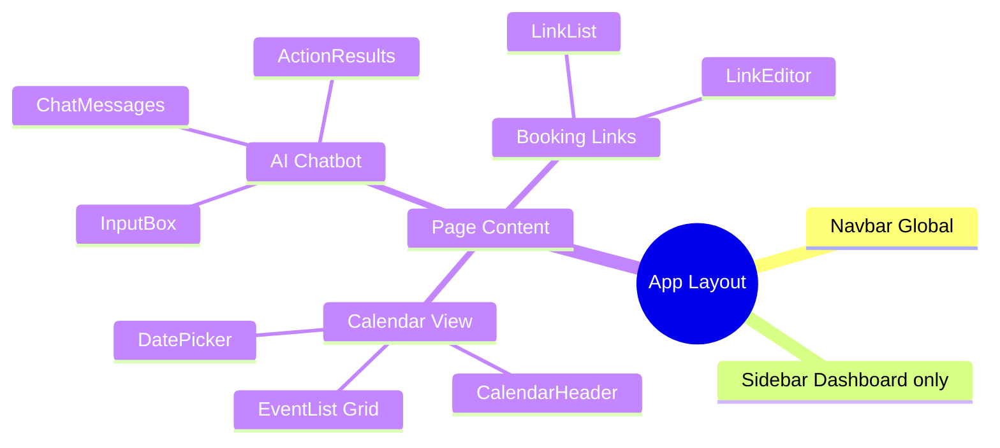

### **5.2. State Management Strategy**

**Server State (TanStack Query):**

- Events data
- Booking links
- User profile
- AI conversations

**Client State (Zustand):**

- Calendar view settings (month/week/day)
- UI preferences (theme, language)
- Active modals/dialogs
- Form states

**URL State (Next.js Router):**

- Current page/route
- Filter parameters
- Search queries
- Selected date range

### **5.3. Data Flow**

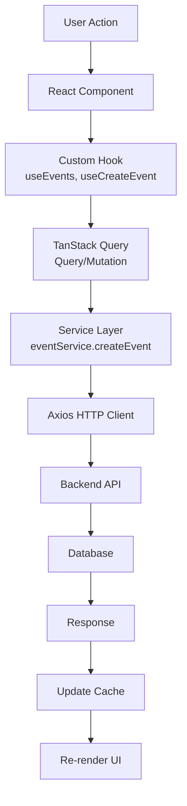

## **6\. Thiết kế UI/UX**

### **6.1. Design System**

#### **6.1.1. Color Palette**

**Primary Colors:**

- Primary Blue: `#4285f4` - CTA buttons, links, active states
- Secondary Purple: `#8e44ad` - AI features, gradients
- Success Green: `#10b981` - Success messages, confirmations
- Warning Yellow: `#f59e0b` - Warnings, notifications
- Error Red: `#ef4444` - Error messages, destructive actions

**Neutral Colors:**

- Gray 50-900: Background, borders, text hierarchy
- White: `#ffffff` - Cards, modals, primary backgrounds
- Black: `#000000` - Primary text

**Semantic Colors:**

- Info: `#3b82f6`
- Calendar Events: Dynamic color per calendar
- Priority Levels: Red (Critical) → Yellow (Low)

#### **6.1.2. Typography**

**Font Family:**

- Primary: `Inter` - Modern, clean sans-serif
- Monospace: `Fira Code` - Code snippets

**Font Sizes:**

- Heading 1: 2rem (32px)
- Heading 2: 1.5rem (24px)
- Heading 3: 1.25rem (20px)
- Body: 1rem (16px)
- Small: 0.875rem (14px)
- Tiny: 0.75rem (12px)

**Font Weights:**

- Regular: 400
- Medium: 500
- Semibold: 600
- Bold: 700

#### **6.1.3. Spacing System**

**Base Unit:** 4px (0.25rem)

**Scale:**

- xs: 4px
- sm: 8px
- md: 16px
- lg: 24px
- xl: 32px
- 2xl: 48px
- 3xl: 64px

#### **6.1.4. Border Radius**

- Small: 4px
- Medium: 8px
- Large: 12px
- XL: 16px
- Full: 9999px (circular)

### **6.2. Component Library**

#### **6.2.1. Atomic Components**

**Buttons:**

- Primary Button: Solid background, white text
- Secondary Button: Outlined, transparent background
- Ghost Button: No border, hover background
- Icon Button: Square/circular, icon only
- Link Button: Text style, underline on hover

**Variants:**

- Default, Primary, Secondary, Destructive, Ghost, Link
- Sizes: sm, md, lg

**Form Inputs:**

- Text Input: Border, focus ring
- Textarea: Resizable, auto-grow
- Select: Dropdown with search
- Checkbox: Custom styled
- Radio: Circular selection
- Switch: Toggle button
- Date Picker: Calendar popup
- Time Picker: Time selection

**Feedback Components:**

- Toast: Bottom-right notifications
- Alert: Inline messages (info/success/warning/error)
- Modal: Centered overlay
- Dialog: Confirmation dialogs
- Loading: Spinner, skeleton screens
- Progress: Linear, circular

#### **6.2.2. Composite Components**

**Calendar Components:**

- FullCalendar: Main calendar view
- EventCard: Event display card
- EventModal: Create/edit event form
- CalendarHeader: Navigation, view switcher
- DatePicker: Date selection
- TimeSlotPicker: Time selection

**AI Chatbot Components:**

- ChatBox: Main chat interface
- MessageBubble: User/AI messages
- ActionCard: Function call results
- TimeSlotsList: Available slots display
- InputBox: Message input with suggestions

**Dashboard Components:**

- Sidebar: Navigation menu
- Navbar: Top bar with user menu
- Card: Content container
- Table: Data table with sorting
- Tabs: Tab navigation
- Accordion: Collapsible sections

### **6.3. Layout & Navigation**

#### **6.3.1. Layout Structure**

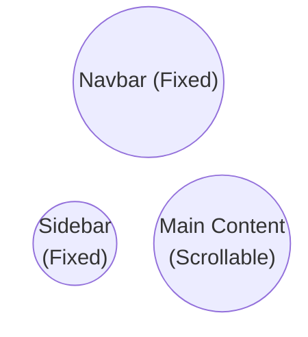

**Sidebar Navigation:**

- Calendar
- Tasks
- Priorities
- Scheduling Links
- Analytics
- Settings

**Navbar:**

- Search bar
- Notifications
- AI Chat toggle
- User menu

#### **6.3.2. Responsive Breakpoints**

- Mobile: < 640px
- Tablet: 640px - 1024px
- Desktop: > 1024px
- Wide: > 1440px

**Mobile Behavior:**

- Sidebar collapses to bottom navigation
- Calendar switches to compact view
- Tables become scrollable cards

### **6.4. Page Layouts**

#### **6.4.1. Calendar Page**

**Layout:**

- Header: Month/Year, view switcher, create button
- Left Sidebar: Mini calendar, calendars list
- Main Area: Full calendar view
- Right Panel: AI chatbot (toggle)

**Views:**

- Day View: Hourly timeline
- Week View: 7-day grid
- Month View: Monthly grid
- Year View: 12-month overview

#### **6.4.2. Event Detail Modal**

**Sections:**

- Header: Title, close button
- Time & Date: Start/end datetime picker
- Details: Description, location
- Attendees: Email list input
- Conference: Google Meet link
- Reminders: Notification settings
- Recurrence: RRULE builder
- Actions: Save, delete, cancel

#### **6.4.3. Booking Page (Public)**

**Layout:**

- Host Info: Avatar, name, title
- Calendar: Available slots selector
- Form: Guest information
- Confirmation: Success message

**Flow:**

1. Select date
2. Choose time slot
3. Fill guest info
4. Confirm booking
5. Receive email confirmation

### **6.5. Animations & Transitions**

#### **6.5.1. Micro-interactions**

**Hover Effects:**

- Button: Scale 1.02, shadow increase
- Card: Shadow elevation
- Link: Underline appear

**Active States:**

- Button: Scale 0.98
- Input: Border color change
- Checkbox: Fill animation

**Loading States:**

- Skeleton screens for content
- Spinner for async actions
- Progress bar for uploads

#### **6.5.2. Page Transitions**

- Fade in/out: 200ms
- Slide animations: 300ms
- Modal appear: Scale + fade, 200ms

**Ease Functions:**

- Default: `ease-in-out`
- Bounce: `cubic-bezier(0.68, -0.55, 0.265, 1.55)`

### **6.6. Accessibility (A11Y)**

#### **6.6.1. Keyboard Navigation**

**Shortcuts:**

- `N`: Create new event
- `T`: Go to today
- `←/→`: Navigate dates
- `/`: Focus search
- `?`: Show shortcuts help

**Focus Management:**

- Visible focus indicators
- Logical tab order
- Skip to main content link

#### **6.6.2. Screen Reader Support**

- Semantic HTML tags
- ARIA labels and roles
- Alt text for images
- Live regions for updates

#### **6.6.3. Color Contrast**

- WCAG AAA compliance
- Text: 7:1 contrast ratio
- Interactive elements: 4.5:1 minimum**6.8. UI Components - Implementation Status**

#### **6.8.1. Implemented Components**

**Layout:**

- Sidebar navigation
- Navbar with search
- Responsive container

**Calendar:**

- FullCalendar with views
- Event cards
- Event modal
- Date/time pickers

**AI Chatbot:**

- Chat interface
- Message bubbles
- Action results display
- Time slots list

**Forms:**

- Input fields
- Selects with search
- Checkboxes/radios
- Date/time pickers

**Feedback:**

- Toast notifications
- Loading states
- Error boundaries

#### **6.8.2. Planned Components**

**Advanced Calendar:**

- Drag & drop events
- Multi-day events
- Resource scheduling
- Print preview

**Team Features:**

- Shared calendars
- Team availability view
- Meeting polls
- Round-robin scheduling

**Analytics Dashboard:**

- Charts and graphs
- Time tracking
- Productivity metrics
- Export reports

