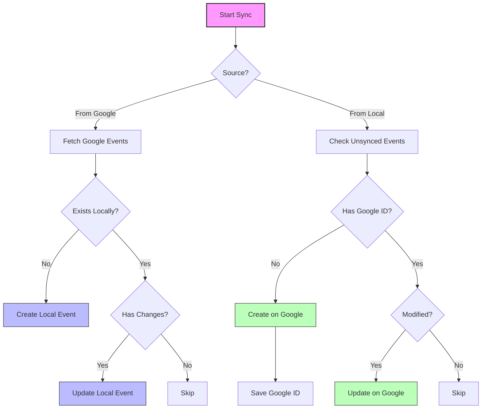
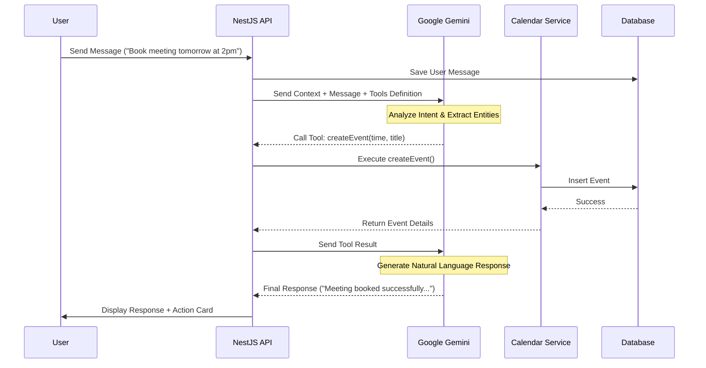

# **Chương III - Phần 2: TRIỂN KHAI BACKEND**

Phần này đi sâu vào chi tiết triển khai các tính năng cốt lõi của hệ thống Calento phía Backend, bao gồm xác thực, quản lý sự kiện, tích hợp Google Calendar, AI Chatbot và hệ thống đặt lịch.

## **1. Hệ thống Xác thực (Authentication System)**

### **1.1. Kiến trúc và Quy trình**

Hệ thống xác thực của Calento được xây dựng dựa trên kiến trúc modular của NestJS, kết hợp JWT (JSON Web Tokens) cho cơ chế xác thực không trạng thái (stateless) và OAuth 2.0 cho tính năng đăng nhập qua Google. Module `AuthModule` đóng vai trò trung tâm, quản lý toàn bộ logic xác thực thông qua `AuthService` và `AuthController`. Mật khẩu người dùng được mã hóa an toàn bằng thuật toán bcrypt với 10 vòng salt (salt rounds) trước khi lưu trữ. Để tăng cường bảo mật và tương thích đa nền tảng, hệ thống hỗ trợ cả xác thực qua HTTP-only cookies và Authorization header.

Quy trình đăng ký bắt đầu khi người dùng gửi thông tin (email, username, password). Backend sẽ kiểm tra tính duy nhất của email và username, sau đó mã hóa mật khẩu và tạo bản ghi mới trong cơ sở dữ liệu. Sau khi đăng ký thành công, hệ thống tự động tạo cặp Access Token (hết hạn sau 1 giờ) và Refresh Token (hết hạn sau 7 ngày), được lưu trữ trong cookies bảo mật. Đối với quy trình đăng nhập, hệ thống xác thực thông tin đăng nhập, cập nhật thời gian đăng nhập cuối cùng và cấp phát bộ token mới.

### **1.2. Tích hợp Google OAuth 2.0**

Tính năng đăng nhập bằng Google sử dụng quy trình OAuth 2.0 tiêu chuẩn. Khi người dùng yêu cầu đăng nhập, Backend tạo một URL ủy quyền chứa các scopes cần thiết (email, profile, calendar). Sau khi người dùng cấp quyền, Google chuyển hướng về callback URL với một mã ủy quyền (authorization code). Backend sử dụng mã này để trao đổi lấy Access Token và Refresh Token từ Google, sau đó mã hóa và lưu trữ chúng trong bảng `user_credentials`. Hệ thống cũng tự động liên kết tài khoản Google với tài khoản người dùng hiện có hoặc tạo mới nếu chưa tồn tại.

## **2. Hệ thống Quản lý Sự kiện (Event Management)**

### **2.1. Cấu trúc và Thao tác dữ liệu**

Quản lý sự kiện là tính năng cốt lõi, cho phép người dùng thao tác CRUD (Tạo, Đọc, Cập nhật, Xóa) trên các sự kiện lịch. Bảng `events` được thiết kế tối ưu với các chỉ mục phức hợp (composite indexes) trên `user_id` và thời gian để tăng tốc độ truy vấn theo khoảng thời gian. Dữ liệu linh động như danh sách người tham dự (`attendees`) hay thông tin họp trực tuyến (`conference_data`) được lưu trữ dưới dạng JSONB, mang lại sự linh hoạt cao mà không làm phá vỡ cấu trúc bảng.

Quy trình tạo sự kiện bao gồm nhiều bước kiểm tra nghiêm ngặt: xác thực dữ liệu đầu vào, kiểm tra xung đột thời gian với các sự kiện hiện có, và đồng bộ hóa với Google Calendar nếu tính năng này được kích hoạt. Các thao tác cập nhật hỗ trợ cả thay đổi một phần (PATCH) và thay thế toàn bộ (PUT), đồng thời xử lý logic phức tạp cho các sự kiện lặp lại. Khi xóa sự kiện, hệ thống sử dụng cơ chế xóa mềm (soft delete) để bảo toàn dữ liệu lịch sử.

### **2.2. Xử lý Sự kiện Lặp lại (Recurring Events)**

Hệ thống hỗ trợ chuẩn RRULE (iCalendar) cho các sự kiện lặp lại theo ngày, tuần, tháng hoặc năm. Thuật toán mở rộng (expansion algorithm) sử dụng thư viện `rrule.js` để tính toán các lần xuất hiện (occurrences) trong một khoảng thời gian cụ thể. Các ngoại lệ (exceptions) - ví dụ như một buổi họp định kỳ bị hủy hoặc dời lịch - được lưu trữ riêng biệt trong trường `recurrence_exception_dates` và được áp dụng đè lên quy tắc lặp lại gốc.

## **3. Tích hợp Google Calendar**

### **3.1. Đồng bộ Hai chiều (Bidirectional Sync)**

Cơ chế đồng bộ hai chiều đảm bảo dữ liệu giữa Calento và Google Calendar luôn nhất quán. Quy trình "Pull" (Import) lấy sự kiện từ Google về, so sánh với dữ liệu cục bộ dựa trên `google_event_id` và cập nhật nếu có thay đổi. Quy trình "Push" (Export) đẩy các sự kiện tạo trên Calento lên Google.

Trong trường hợp xung đột dữ liệu, hệ thống áp dụng chiến lược so sánh thời gian chỉnh sửa cuối cùng (last-modified timestamp) để quyết định phiên bản nào được ưu tiên, hoặc cho phép người dùng tự giải quyết.

### **3.2. Cập nhật Thời gian thực (Webhooks)**

Để đạt được khả năng cập nhật tức thì, hệ thống sử dụng Google Calendar Webhooks. Backend đăng ký một kênh (channel) để lắng nghe thay đổi từ Google. Khi có sự kiện được tạo, sửa hoặc xóa trên Google Calendar, Google sẽ gửi một POST request đến webhook endpoint của Calento. Hệ thống sau đó xác thực thông báo và kích hoạt quy trình đồng bộ gia tăng (incremental sync) chỉ cho lịch bị ảnh hưởng, giúp tiết kiệm tài nguyên và băng thông.

## **4. Tích hợp AI Chatbot**

### **4.1. Kiến trúc Function Calling**

AI Chatbot được xây dựng trên nền tảng Google Gemini 1.5 Flash, tận dụng tính năng Function Calling để thực hiện các tác vụ lịch thông qua ngôn ngữ tự nhiên. Backend định nghĩa một tập hợp các hàm (functions) như `createEvent`, `searchEvents`, `checkAvailability` với mô tả chi tiết và schema tham số rõ ràng.

Khi nhận được tin nhắn từ người dùng, Gemini phân tích ý định và quyết định gọi hàm phù hợp. Backend thực thi hàm đó và trả kết quả về cho AI để tổng hợp câu trả lời cuối cùng.

### **4.2. Quản lý Ngữ cảnh (Context Management)**

Để AI hiểu và phản hồi chính xác, hệ thống duy trì một ngữ cảnh phong phú bao gồm: thông tin người dùng, thời gian hiện tại, các sự kiện sắp tới và lịch sử hội thoại. Đặc biệt, ngữ cảnh thời gian (Temporal Context) được tự động thêm vào để AI hiểu các khái niệm tương đối như "ngày mai" hay "tuần sau" mà không cần người dùng giải thích thêm.

## **5. Hệ thống Booking Links**

### **5.1. Logic Tính toán Thời gian rảnh**

Hệ thống Booking Links cho phép tạo các đường dẫn đặt lịch công khai. Thuật toán tính toán thời gian rảnh (Availability Calculation Algorithm) hoạt động qua ba bước: đầu tiên tạo ra tất cả các khung giờ (slots) khả thi dựa trên cấu hình của người dùng; sau đó lọc bỏ các khung giờ đã có lịch bận hoặc vi phạm quy tắc (như thời gian đệm, số lượng booking tối đa trong ngày); cuối cùng sắp xếp và đề xuất các khung giờ tối ưu nhất.

### **5.2. Quy trình Đặt lịch của Khách**

Khi khách truy cập link đặt lịch, họ có thể xem các khung giờ trống và thực hiện đặt lịch mà không cần đăng nhập. Hệ thống sẽ xác thực thông tin khách, tạo bản ghi booking, đồng thời tạo sự kiện trên lịch của người chủ (host). Sau đó, email xác nhận kèm file ICS sẽ được gửi tự động cho cả hai bên. Các tác vụ hậu xử lý như gửi nhắc nhở (reminders) hay đồng bộ lên Google Calendar được đưa vào hàng đợi để xử lý nền.

---

**Xem thêm:**
- [Phần 1: Cài đặt Môi trường](./03_1_Cai_Dat_Moi_Truong.md)
- [Phần 3: Triển khai Frontend](./03_3_Trien_Khai_Frontend.md)
- [Phần 4: Triển khai Hạ tầng](./03_4_Trien_Khai_Ha_Tang.md)
