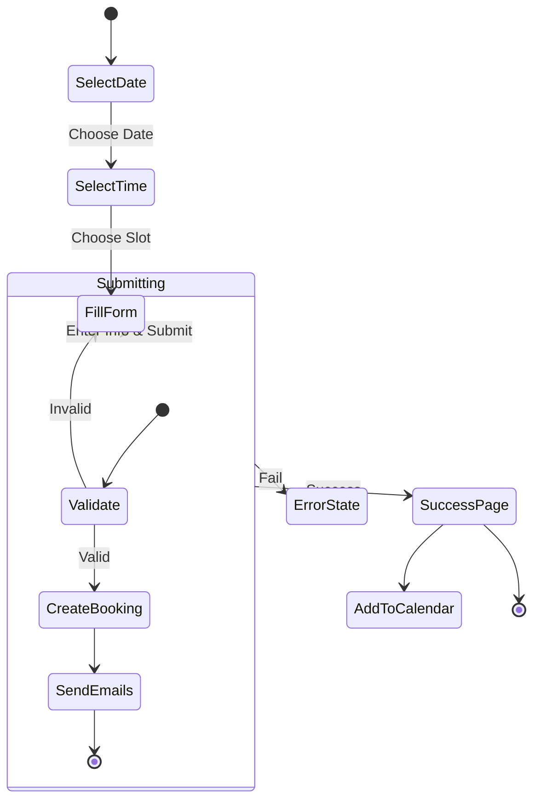

# **Chương III - Phần 3: TRIỂN KHAI FRONTEND**

Phần này trình bày chi tiết về việc triển khai giao diện người dùng và trải nghiệm người dùng (UI/UX) cho hệ thống Calento, bao gồm tích hợp xác thực, các thành phần lịch, giao diện chat AI và trang đặt lịch công khai.

## **1. Tích hợp Hệ thống Xác thực**

### **1.1. Quản lý Trạng thái Xác thực**

Phía Frontend sử dụng React Context (`AuthContext`) để quản lý trạng thái xác thực toàn cục. Context này cung cấp thông tin về người dùng hiện tại và trạng thái đăng nhập cho toàn bộ ứng dụng. Cơ chế tự động làm mới token (silent refresh) được cài đặt để đảm bảo phiên làm việc của người dùng không bị gián đoạn; khi Access Token sắp hết hạn, hệ thống sẽ tự động gửi yêu cầu lấy token mới mà không cần sự can thiệp của người dùng. Trạng thái xác thực cũng được lưu trữ bền vững (persist) để duy trì phiên đăng nhập khi người dùng tải lại trang.

### **1.2. Cấu hình API Client và Bảo vệ Route**

Thư viện Axios được cấu hình với các interceptors để tự động hóa việc xử lý token. Request interceptor sẽ tự động đính kèm Bearer token vào header của mọi yêu cầu gửi đi. Response interceptor chịu trách nhiệm xử lý các lỗi 401 (Unauthorized); nếu phát hiện token hết hạn, nó sẽ kích hoạt quy trình refresh token và thử lại yêu cầu thất bại. Đối với điều hướng, các Route Guards (bảo vệ định tuyến) kiểm tra trạng thái xác thực trước khi cho phép truy cập vào các trang nội bộ. Người dùng chưa đăng nhập sẽ bị chuyển hướng về trang đăng nhập, đồng thời hệ thống lưu lại địa chỉ trang đích để chuyển hướng lại sau khi đăng nhập thành công.

## **2. Triển khai Giao diện Lịch (Calendar Views)**

### **2.1. Component Lịch Tùy biến**

Thay vì phụ thuộc vào các thư viện lịch có sẵn nặng nề, nhóm phát triển đã xây dựng một component lịch tùy biến (Custom Calendar Component) từ đầu. Điều này cho phép kiểm soát hoàn toàn giao diện và tối ưu hóa hiệu năng. Component này hỗ trợ thiết kế đáp ứng (responsive), tự động điều chỉnh giao diện cho phù hợp với cả thiết bị di động và máy tính để bàn. Các thao tác tương tác như điều hướng bằng bàn phím và cử chỉ chạm (touch gestures) cũng được tích hợp để nâng cao trải nghiệm người dùng.

### **2.2. Các Chế độ Xem và Tương tác**

Hệ thống hỗ trợ bốn chế độ xem chính: Xem theo Ngày (Day View) với dòng thời gian chi tiết từng giờ; Xem theo Tuần (Week View) hiển thị lưới 7 ngày; Xem theo Tháng (Month View) cho cái nhìn tổng quan; và Xem theo Năm (Year View). Người dùng có thể tương tác trực tiếp với lịch thông qua các hành động như nhấp để tạo sự kiện tại khung giờ cụ thể, kéo thả để chọn khoảng thời gian, hoặc nhấp đúp để chỉnh sửa nhanh. Modal chi tiết sự kiện cung cấp giao diện tab trực quan để quản lý thông tin, người tham dự, và cấu hình lặp lại phức tạp.

### **2.3. Quản lý State với TanStack Query**

Để đảm bảo hiệu năng cao và trải nghiệm mượt mà, TanStack Query được sử dụng để quản lý trạng thái dữ liệu từ server (server state). Thư viện này tự động cache dữ liệu sự kiện, giúp giảm tải cho server và tăng tốc độ hiển thị khi người dùng chuyển đổi giữa các chế độ xem.

```mermaid
flowchart LR
    subgraph "Server State (TanStack Query)"
        A[API Response] --> B{Cache Exists?}
        B -- Yes --> C[Return Cached Data]
        B -- No --> D[Fetch from API]
        D --> E[Update Cache]
        E --> C
    end

    subgraph "UI Components"
        C --> F[Calendar View]
        C --> G[Event List]
        C --> H[Event Detail Modal]
    end

    I[User Action] --> J[Mutation (Create/Update)]
    J --> K[Optimistic Update UI]
    K --> L[Call API]
    L -- Success --> M[Invalidate Cache]
    L -- Error --> N[Rollback UI]
    M --> D

    style A fill:#f9f,stroke:#333
    style K fill:#bfb,stroke:#333
    style N fill:#fbb,stroke:#333
```

Cơ chế Optimistic Updates cho phép giao diện phản hồi tức thì với các hành động của người dùng (như tạo hoặc xóa sự kiện) trước khi server trả về kết quả chính thức, tạo cảm giác ứng dụng phản hồi nhanh nhạy.

## **3. Giao diện Chat AI Thông minh**

### **3.1. Hiển thị Tin nhắn và Markdown**

Giao diện chat được thiết kế hiện đại, tương tự như các ứng dụng nhắn tin phổ biến. Tin nhắn của người dùng và AI được phân biệt rõ ràng qua màu sắc và vị trí căn chỉnh. Hệ thống hỗ trợ định dạng Markdown, cho phép hiển thị văn bản đậm, danh sách, và các liên kết một cách rõ ràng. Trạng thái "đang nhập" (typing indicator) được hiển thị trong khi AI đang xử lý yêu cầu, giúp người dùng nắm bắt được trạng thái của hệ thống.

### **3.2. Action Cards và Tương tác**

Điểm đặc biệt của giao diện chat là khả năng hiển thị các Action Cards - các thẻ thông tin tương tác trả về từ kết quả gọi hàm của AI. Ví dụ, khi AI tìm thấy các sự kiện, nó sẽ hiển thị một danh sách các thẻ sự kiện với chi tiết về thời gian và tiêu đề. Người dùng có thể tương tác trực tiếp trên các thẻ này, ví dụ như nhấn nút "Đặt lịch" trên một khung giờ trống được đề xuất, hoặc "Xem chi tiết" một sự kiện vừa được tạo.

## **4. Trang Đặt lịch Công khai (Public Booking Page)**

### **4.1. Giao diện Cho Khách**

Trang đặt lịch công khai được thiết kế tối giản để tối ưu hóa tỷ lệ chuyển đổi. Phần thông tin Host hiển thị avatar, tên và mô tả ngắn gọn. Bộ chọn lịch (Calendar Selector) cho phép khách chọn ngày mong muốn, với các ngày không có lịch trống sẽ bị vô hiệu hóa. Danh sách khung giờ (Time Slots List) hiển thị các giờ rảnh trong ngày đã chọn, được nhóm theo buổi và tự động chuyển đổi theo múi giờ của khách.

### **4.2. Form Đặt lịch và Tích hợp**

Form đặt lịch yêu cầu các thông tin cơ bản như tên và email, với khả năng mở rộng thêm các câu hỏi tùy chỉnh. Sau khi đặt lịch thành công, trang xác nhận sẽ hiển thị chi tiết cuộc hẹn và cung cấp các tùy chọn để thêm vào lịch cá nhân (Google Calendar, Outlook) hoặc tải về file ICS.



Giao diện cũng tích hợp sẵn nút kết nối Google Meet nếu cuộc hẹn là trực tuyến, giúp khách dễ dàng tham gia cuộc họp khi đến giờ.

---

**Xem thêm:**
- [Phần 1: Cài đặt Môi trường](./03_1_Cai_Dat_Moi_Truong.md)
- [Phần 2: Triển khai Backend](./03_2_Trien_Khai_Backend.md)
- [Phần 4: Triển khai Hạ tầng](./03_4_Trien_Khai_Ha_Tang.md)
