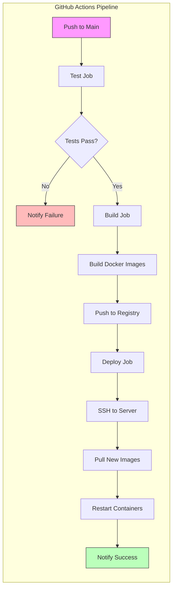

# **Chương III - Phần 4: TRIỂN KHAI HẠ TẦNG**

Phần này mô tả chi tiết kiến trúc hạ tầng production, quy trình triển khai, cấu hình bảo mật và hệ thống giám sát của Calento.

## **1. Kiến trúc Hạ tầng Production**

### **1.1. Tổng quan Kiến trúc**

Hệ thống Calento được triển khai trên nền tảng Digital Ocean Droplet, kết hợp với Cloudflare làm lớp bảo vệ và tăng tốc độ truy cập. Kiến trúc tổng thể bao gồm các thành phần chính: Cloudflare quản lý DNS và cung cấp chứng chỉ SSL/TLS; Digital Ocean Droplet chạy hệ điều hành Ubuntu 22.04 LTS đóng vai trò máy chủ vật lý; Docker Engine và Docker Compose quản lý các container dịch vụ; và Nginx đóng vai trò Reverse Proxy điều hướng traffic.

Các dịch vụ cốt lõi được container hóa bao gồm: Frontend (Next.js) chạy trên cổng 3000, Backend (NestJS) chạy trên cổng 8000, PostgreSQL database trên cổng 5432 và Redis cache trên cổng 6379. Nginx tiếp nhận các yêu cầu HTTPS từ cổng 443, thực hiện SSL termination và chuyển tiếp (proxy pass) đến các container tương ứng dựa trên tên miền (`calento.space` cho frontend và `api.calento.space` cho backend).

### **1.2. Cấu hình Máy chủ (Digital Ocean Droplet)**

Máy chủ được cấu hình với thông số kỹ thuật tối ưu cho giai đoạn khởi chạy, đảm bảo cân bằng giữa hiệu năng và chi phí.

**Bảng 3.5: Thông số kỹ thuật Droplet**

| Thành phần | Thông số kỹ thuật | Ghi chú |
| :--- | :--- | :--- |
| **Nhà cung cấp** | Digital Ocean | Basic Droplet Plan |
| **CPU** | 2 vCPUs (Intel) | Đủ khả năng xử lý các tác vụ đồng thời. |
| **RAM** | 4 GB | Đảm bảo đủ bộ nhớ cho Docker containers và cache. |
| **Lưu trữ** | 80 GB SSD | Tốc độ truy xuất cao cho Database. |
| **Hệ điều hành** | Ubuntu 22.04 LTS (x64) | Phiên bản ổn định, hỗ trợ lâu dài. |
| **Vị trí** | Singapore (SGP1) | Giảm độ trễ cho người dùng khu vực Đông Nam Á. |

## **2. Cấu hình Reverse Proxy và CDN**

### **2.1. Nginx Reverse Proxy**

Nginx được cấu hình làm cổng vào duy nhất cho mọi traffic HTTP/HTTPS. Cấu hình server block cho `calento.space` xử lý traffic frontend, tự động chuyển hướng HTTP sang HTTPS và áp dụng các headers bảo mật như HSTS và X-Frame-Options. Server block cho `api.calento.space` xử lý traffic backend, hỗ trợ CORS và WebSocket upgrades.

**Cấu hình chính:**
- **Frontend Block:** Proxy pass tới `localhost:3000`. Cache static files 1 năm.
- **Backend Block:** Proxy pass tới `localhost:8000`. Rate limiting 10 req/s.
- **Headers:** `X-Forwarded-For`, `X-Real-IP`, `Upgrade` (cho WebSocket).

### **2.2. Cloudflare CDN và Bảo mật**

Cloudflare quản lý DNS và cung cấp lớp bảo mật mạng.

**Bảng 3.6: Cấu hình DNS Records**

| Loại | Tên | Nội dung | Trạng thái Proxy |
| :--- | :--- | :--- | :--- |
| **A** | `@` | `<droplet_ip>` | Proxied (Đám mây cam) |
| **A** | `www` | `<droplet_ip>` | Proxied |
| **A** | `api` | `<droplet_ip>` | Proxied |
| **CNAME** | `cdn` | `calento.space` | Proxied |

**Tính năng bảo mật:**
- **SSL Mode:** Full (Strict) - Mã hóa toàn trình.
- **WAF:** Kích hoạt OWASP Core Ruleset để chặn tấn công phổ biến.
- **DDoS Protection:** Always On (Layer 3/4/7).

## **3. Quy trình Triển khai (Deployment Workflow)**

Quy trình triển khai lên môi trường Production được thực hiện theo các bước chuẩn hóa sau đây để đảm bảo tính ổn định và an toàn dữ liệu.

### **Bước 1: Chuẩn bị Server**
Kết nối SSH vào server và cài đặt các dependencies cần thiết:
```bash
ssh root@<droplet_ip>
# Tạo user deploy
adduser calento
usermod -aG sudo calento
# Cài đặt Docker & Nginx
apt update && apt install nginx git
curl -fsSL https://get.docker.com | sh
```

### **Bước 2: Clone Repository & Cấu hình**
Lấy mã nguồn mới nhất và thiết lập biến môi trường production:
```bash
git clone https://github.com/TDevUIT/Calento.git
cd Calento/server
cp .env.example .env.production
# Chỉnh sửa các biến môi trường cho production (DB password, Secrets...)
nano .env.production
```

### **Bước 3: Build Docker Images**
Xây dựng các images tối ưu cho production:
```bash
# Build Backend
docker build -t calento-backend:latest .
# Build Frontend
cd ../client
docker build -t calento-frontend:latest .
```

### **Bước 4: Khởi chạy Dịch vụ**
Sử dụng Docker Compose để khởi chạy toàn bộ stack:
```bash
docker compose -f docker-compose.prod.yml up -d
# Kiểm tra trạng thái containers
docker ps
```

### **Bước 5: Thiết lập Database & SSL**
Chạy migration để cập nhật cấu trúc database và cài đặt chứng chỉ SSL:
```bash
# Run migrations
docker compose exec backend npm run migration:run
# Cấu hình SSL cho Nginx (sử dụng chứng chỉ từ Cloudflare Origin)
nano /etc/nginx/ssl/calento.crt
nano /etc/nginx/ssl/calento.key
systemctl reload nginx
```

### **3.3. Quy trình CI/CD (GitHub Actions)**

Quy trình Tích hợp và Triển khai liên tục (CI/CD) được tự động hóa hoàn toàn thông qua GitHub Actions. Pipeline bao gồm ba giai đoạn chính: Test, Build và Deploy.



Giai đoạn Test chạy unit tests và linting mỗi khi có code mới được push lên nhánh chính. Giai đoạn Build tạo các Docker images và đẩy lên registry. Giai đoạn Deploy tự động SSH vào server, kéo images mới nhất về và khởi động lại các containers với thời gian downtime gần như bằng không (zero-downtime deployment).

## **4. Giám sát và Logging**

### **4.1. Hệ thống Health Check**

Endpoint `/health` được thiết lập để cung cấp thông tin trạng thái thời gian thực của hệ thống, bao gồm kết nối database, Redis và trạng thái hàng đợi. Các công cụ giám sát bên ngoài có thể gọi endpoint này định kỳ để phát hiện sự cố sớm.

### **4.2. Chiến lược Logging**

Hệ thống sử dụng thư viện Winston để ghi log có cấu trúc (structured logging) dưới định dạng JSON. Logs được phân cấp (error, warn, info) và lưu trữ vào các file riêng biệt với cơ chế xoay vòng (log rotation) theo ngày để quản lý dung lượng lưu trữ. Dashboard giám sát (sử dụng Prometheus và Grafana) trực quan hóa các chỉ số quan trọng như thời gian phản hồi API, tỷ lệ lỗi và tài nguyên hệ thống, giúp đội ngũ vận hành nhanh chóng nắm bắt và xử lý vấn đề.

---

**Xem thêm:**
- [Phần 1: Cài đặt Môi trường](./03_1_Cai_Dat_Moi_Truong.md)
- [Phần 2: Triển khai Backend](./03_2_Trien_Khai_Backend.md)
- [Phần 3: Triển khai Frontend](./03_3_Trien_Khai_Frontend.md)
