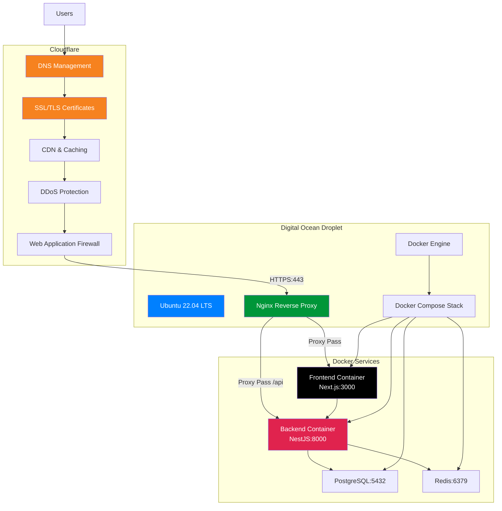

# **Chương III. TRIỂN KHAI HỆ THỐNG**

Chương này mô tả chi tiết quá trình triển khai hệ thống Calento, từ việc cài đặt môi trường phát triển, cấu hình backend/frontend, đến implement các tính năng chính. Mỗi phần đều có hướng dẫn cụ thể, code examples và giải thích cách hoạt động.

## **1\. Chuẩn bị môi trường phát triển**

Trước khi bắt đầu code, cần setup môi trường với đầy đủ tools và configurations.

### **1.1. Yêu cầu hệ thống (Prerequisites)**

#### **1.1.1. Công cụ phải cài đặt**

Đây là danh sách tools bắt buộc để chạy được project:

| Tool       | Version yêu cầu | Mục đích | Cách cài đặt |
| ---------- | ------- | -------------------------------- | ------------ |
| **Node.js**    | >= 18.x | Runtime cho backend và frontend | [nodejs.org](https://nodejs.org) - Download LTS version |
| **npm**        | >= 9.x  | Package manager (đi kèm Node.js) | Auto install với Node.js |
| **PostgreSQL** | >= 14   | Primary database | [postgresql.org](https://postgresql.org) hoặc Docker |
| **Redis**      | >= 6    | Caching và queue system | [redis.io](https://redis.io) hoặc Docker |
| **Docker**     | >= 20.x | Containerization (optional nhưng recommended) | [docker.com](https://docker.com) |
| **Git**        | >= 2.x  | Version control | [git-scm.com](https://git-scm.com) |

**Kiểm tra versions:**
```bash
node --version    # v18.17.0
npm --version     # 9.8.1
psql --version    # 14.x
redis-cli --version  # 6.x
docker --version  # 20.x
git --version     # 2.x
```

**Tại sao cần các tools này?**
- **Node.js**: Chạy JavaScript code ở backend (NestJS) và build frontend (Next.js)
- **PostgreSQL**: Database chính lưu trữ users, events, bookings
- **Redis**: Cache data để app nhanh hơn, lưu background jobs
- **Docker**: Chạy PostgreSQL, Redis trong containers → Dễ setup, không conflict
- **Git**: Version control, collaborate với team

#### **1.1.2. IDE và Extensions (Khuyến nghị)**

**Visual Studio Code** là IDE recommended cho project này.

**Extensions cần thiết:**

| Extension | Mục đích | Tại sao cần |
|-----------|----------|-------------|
| **ESLint** | Phát hiện lỗi code, enforce code style | Catch bugs sớm, consistent code style |
| **Prettier** | Auto format code | Code đẹp, đồng nhất trong team |
| **TypeScript** | TypeScript language support | IntelliSense, type checking |
| **Tailwind CSS IntelliSense** | Autocomplete Tailwind classes | Code CSS nhanh hơn, ít typos |
| **Thunder Client** | Test API ngay trong VS Code | Không cần mở Postman riêng |
| **GitLens** | Git history, blame annotations | Xem ai sửa code gì, khi nào |
| **Error Lens** | Hiện errors inline | Không cần hover để xem lỗi |

**Cài extensions:**
```
Ctrl+Shift+X (Windows) hoặc Cmd+Shift+X (Mac)
→ Search extension name → Click Install
```

### **1.2. Cấu hình Backend**

**Backend Setup (4 bước):**

1. **Clone Repository:**

   - Clone từ GitHub: `https://github.com/TDevUIT/Calento.git`
   - Navigate: `cd Calento/server`
   - Install: `npm install`
2. **Environment Variables (.env):**

   Copy file `.env.example` → `.env` và cấu hình:

   | Category               | Variables                                                                          | Values                                                                 |
   | ---------------------- | ---------------------------------------------------------------------------------- | ---------------------------------------------------------------------- |
   | **Application**  | `NODE_ENV`, `PORT`, `APP_URL`                                                | `development`, `8000`, API URL                                     |
   | **Database**     | `DB_HOST`, `DB_PORT`, `DB_NAME``DB_USER`, `DB_PASSWORD`                    | PostgreSQL connection `localhost:5432`, `tempra`                   |
   | **Redis**        | `REDIS_HOST`, `REDIS_PORT`                                                     | Cache configuration `localhost:6379`                                 |
   | **JWT**          | `JWT_SECRET`, `JWT_REFRESH_SECRET``JWT_EXPIRES_IN`, `JWT_REFRESH_EXPIRES_IN` | Token authentication ``Generate: `openssl rand -hex 32``1h `, `7d`   |
   | **Google OAuth** | `GOOGLE_CLIENT_ID``GOOGLE_CLIENT_SECRET``GOOGLE_REDIRECT_URI`                    | OAuth & Calendar API``Get from: console.cloud.google.com               |
   | **Gemini AI**    | `GEMINI_API_KEY`                                                                 | AI chatbot integration``Get from: ai.google.dev                        |
   | **Email**        | `EMAIL_PROVIDER`, `SMTP_HOST``SMTP_USER`, `SMTP_PASSWORD`                    | Email notifications `smtp`, `smtp.gmail.com:587`Gmail App Password |
   | **CORS**         | `CORS_ORIGIN`, `FRONTEND_URL`                                                  | `http://localhost:3000`                                              |
   | **Security**     | `BCRYPT_ROUNDS`, `MAX_LOGIN_ATTEMPTS``SESSION_SECRET`                          | `12`, `5`Generate secure secret                                    |
   | **BullMQ**       | `QUEUE_CONCURRENCY``*_WORKER_CONCURRENCY`                                        | Background jobs `10`, `5` per worker                               |
   | **Monitoring**   | `LOG_LEVEL`, `HEALTH_CHECK_*`                                                  | `info`, `true`                                                     |

   **Generate secure secrets:**


   ```bash
   openssl rand -hex 32
   ```
3. **Database Setup:**

   - Tạo database: `createdb tempra_dev`
   - Chạy migrations: `npm run migration:run`
   - Seed data: `npm run seed` (optional)
4. **Start Server:**

   - Development mode: `npm run start:dev`
   - Server: `http://localhost:8000`
   - API docs (Swagger): `http://localhost:8000/api-docs`

### **1.3. Cấu hình Frontend**

**Frontend Setup (3 bước):**

1. **Install Dependencies:**

   - Navigate: `cd ../client`
   - Install: `npm install`
2. **Environment Variables (.env.local):**

   Copy file `.env.example` → `.env.local` và cấu hình:

   | Variable                         | Description            | Value                     |
   | -------------------------------- | ---------------------- | ------------------------- |
   | `NEXT_PUBLIC_APP_NAME`         | Application name       | `Calento`               |
   | `NEXT_PUBLIC_APP_FE_URL`       | Frontend URL           | `http://localhost:3000` |
   | `NEXT_PUBLIC_API_URL`          | Backend API URL        | `http://localhost:8000` |
   | `NEXT_PUBLIC_API_PREFIX`       | API route prefix       | `api/v1`                |
   | `NEXT_PUBLIC_GOOGLE_CLIENT_ID` | Google OAuth Client ID | Same as backend           |

   **Optional configurations:**


   - `NEXT_PUBLIC_ENABLE_AI_CHAT`: Enable/disable AI features (`true`)
   - `NEXT_PUBLIC_ENABLE_BOOKING_LINKS`: Enable booking system (`true`)
   - `NEXT_PUBLIC_GA_MEASUREMENT_ID`: Google Analytics (optional)
   - `NEXT_PUBLIC_SENTRY_DSN`: Error tracking (optional)
3. **Start Development:**

   - Command: `npm run dev`
   - Frontend: `http://localhost:3000`

## **2\. Triển khai tính năng chính**

### **2.1. Authentication System**

**Tổng quan:**

Hệ thống authentication được xây dựng dựa trên kiến trúc modular của NestJS, sử dụng JWT (JSON Web Tokens) cho stateless authentication và OAuth 2.0 cho social login. Hệ thống hỗ trợ cả cookie-based và header-based authentication để tương thích với nhiều client khác nhau.

**Kiến trúc Components:**

1. **Auth Module**: Module chính quản lý authentication

   - AuthController: Xử lý HTTP requests (register, login, logout, refresh)
   - AuthService: Business logic cho authentication
   - AuthRepository: Data access layer với raw SQL queries
   - PasswordService: Hash và verify passwords với bcrypt (10 salt rounds)
   - CookieAuthService: Quản lý authentication cookies
2. **JWT Strategy**: Passport strategy cho JWT validation

   - Dual extraction: Từ Authorization header hoặc HTTP-only cookies
   - User validation: Verify user exists và active
   - Token type checking: Đảm bảo chỉ accept access tokens
3. **Guards & Interceptors**:

   - JwtAuthGuard: Protect routes yêu cầu authentication
   - Public decorator: Cho phép bypass authentication cho public routes
   - Role guards: Authorization based on user roles (future)

**Quy trình Đăng ký:**

1. User submit form với email, username, password
2. Backend validate input data (email format, password strength)
3. Check email/username uniqueness trong database
4. Hash password với bcrypt và salt rounds = 10
5. Create user record trong `users` table
6. Generate access token (expires 1h) và refresh token (expires 7d)
7. Set HTTP-only cookies với secure flags
8. Return user info và tokens cho client
9. Redirect user đến dashboard

**Quy trình Đăng nhập:**

1. User submit credentials (email + password)
2. Backend query user từ database by email
3. Compare password hash với bcrypt.compare()
4. Update `last_login_at` timestamp
5. Generate fresh JWT tokens
6. Set authentication cookies
7. Return user profile và tokens
8. Client store tokens và redirect

**Google OAuth 2.0 Integration:**

1. **Authorization Flow**:

   - Client request OAuth URL từ backend
   - Backend generate authorization URL với scopes (email, profile, calendar)
   - User redirect đến Google consent screen
   - User authorize và Google redirect về callback URL
   - Backend exchange authorization code for access + refresh tokens
2. **Token Management**:

   - Store Google tokens trong `user_credentials` table
   - Encrypt sensitive tokens với AES-256
   - Auto-refresh tokens khi expired
   - Handle token revocation gracefully
3. **User Account Linking**:

   - Find existing user by Google email
   - Create new user nếu chưa tồn tại
   - Link Google account với user record
   - Generate internal JWT tokens cho session

**Security Features:**

1. **Password Security**:

   - Minimum 8 characters requirement
   - Bcrypt hashing với salt rounds = 10
   - Password strength validation
   - No password storage in plain text
2. **Token Security**:

   - Short-lived access tokens (1 hour)
   - Long-lived refresh tokens (7 days)
   - Secure, HTTP-only, SameSite cookies
   - Token rotation on refresh
3. **Session Management**:

   - Redis-based session store
   - Session invalidation on logout
   - Concurrent session tracking
   - Automatic session cleanup

**Frontend Integration:**

1. **Auth Context Provider**:

   - Global authentication state management với React Context
   - Automatic token refresh khi approaching expiration
   - Redirect to login khi unauthenticated
   - Persist auth state trong localStorage
2. **API Client Configuration**:

   - Axios interceptors cho automatic token injection
   - Request interceptor: Add Bearer token to headers
   - Response interceptor: Handle 401 errors và retry
   - Cookie-based auth với `credentials: 'include'`
3. **Protected Routes**:

   - Route guards check authentication status
   - Redirect unauthenticated users to /login
   - Preserve intended destination for post-login redirect
   - Role-based route access control

**Kết quả triển khai:**

- Đăng ký và đăng nhập với email/password
- Google OAuth 2.0 authentication
- JWT token-based sessions
- Automatic token refresh
- Cookie-based authentication
- Protected route access control
- Password reset functionality
- Session management với Redis

### **2.2. Event Management System**

**Tổng quan:**

Event Management là core feature của ứng dụng, cho phép users tạo, chỉnh sửa, xóa và quản lý calendar events. Hệ thống hỗ trợ đầy đủ các loại events từ simple one-time events đến phức tạp recurring events với RRULE standard.

**Kiến trúc Database:**

1. **Events Table Structure**:

   - Primary fields: id (UUID), title, description, location
   - Time fields: start_time, end_time, timezone, is_all_day
   - Recurrence: recurrence_rule (RRULE format), recurrence_exception_dates
   - Attendees: Stored as JSONB array với email, name, response_status
   - Conference data: Google Meet links, Zoom info (JSONB)
   - Metadata: status, visibility, created_at, updated_at
2. **Indexing Strategy**:

   - Composite index trên (user_id, start_time, end_time) cho date range queries
   - Index trên google_event_id cho sync operations
   - GIN index trên title/description cho full-text search
   - Partial index trên recurrence_rule cho recurring events

**Event CRUD Operations:**

1. **Create Event**:

   - Validate input data (title required, end_time > start_time)
   - Get user's primary calendar hoặc create nếu chưa có
   - Validate time conflicts với existing events
   - Insert event record vào database với raw SQL
   - Trigger background job để sync with Google Calendar (nếu connected)
   - Return complete event object với creator info
2. **Update Event**:

   - Support partial updates (PATCH) và full replacement (PUT)
   - Validate changes không conflict với other events
   - Handle recurring event updates (single instance vs all instances)
   - Update google_event_id nếu synced with Google
   - Invalidate cache và notify affected users
3. **Delete Event**:

   - Soft delete với deleted_at timestamp
   - Handle recurring event deletion options
   - Cascade delete related data (reminders, attachments)
   - Sync deletion với Google Calendar
   - Cleanup orphaned references
4. **Read Operations**:

   - Paginated list với filters (date range, calendar, status)
   - Full-text search across title và description
   - Expand recurring events for date ranges
   - Include creator và attendee information
   - Support different view modes (day/week/month)

**Recurring Events Implementation:**

1. **RRULE Standard Support**:

   - Frequency types: DAILY, WEEKLY, MONTHLY, YEARLY
   - Advanced rules: BYDAY, BYMONTH, BYSETPOS
   - Count-based (RCOUNT) và date-based (UNTIL) endings
   - Interval support (every 2 weeks, every 3 months)
2. **Expansion Algorithm**:

   - Parse RRULE string using rrule.js library
   - Generate occurrences for requested date range
   - Apply exception dates (cancelled instances)
   - Merge modified instances (rescheduled occurrences)
   - Limit expansion để avoid performance issues (max 1000 instances)
3. **Exception Handling**:

   - Store exception dates trong JSONB array
   - Support single instance modifications
   - Maintain relationship với parent recurring event
   - Handle delete single vs delete series

**Frontend Calendar Views:**

1. **Custom Calendar Component**:

   - Built from scratch without external calendar libraries
   - Responsive design với mobile-first approach
   - Smooth animations và transitions
   - Keyboard navigation support
   - Touch gestures cho mobile
2. **View Modes**:

   - **Day View**: Hourly timeline với all-day events section
   - **Week View**: 7-day grid với hourly rows
   - **Month View**: Traditional calendar grid với overflow handling
   - **Year View**: 12-month overview với event counts
3. **Interactive Features**:

   - Click to create event at specific time
   - Drag to select time range
   - Hover to preview event details
   - Double-click to edit event
   - Context menu cho quick actions
4. **Event Modal**:

   - Tabbed interface: Details, Attendees, Recurrence, Advanced
   - DateTime pickers với timezone support
   - Attendee management với email suggestions
   - Recurrence builder với visual preview
   - Conference link integration (Google Meet)
   - Reminder configuration

**State Management:**

1. **TanStack Query Integration**:

   - Query keys organized by feature (events, calendars)
   - Automatic caching với stale time configuration
   - Optimistic updates cho instant UI feedback
   - Background refetching khi data stale
   - Pagination và infinite scroll support
2. **Cache Invalidation Strategy**:

   - Invalidate event lists after create/update/delete
   - Invalidate specific event detail cache
   - Invalidate related queries (calendar events, search results)
   - Selective refetching based on affected date ranges

**Performance Optimizations:**

1. **Database Level**:

   - Efficient indexes cho common query patterns
   - Limit result sets với pagination
   - Use JSONB for flexible schema (attendees, reminders)
   - Batch operations cho recurring event expansion
2. **API Level**:

   - Lazy loading cho event details
   - Partial response fields selection
   - Compressed responses với gzip
   - ETags cho conditional requests
3. **Frontend Level**:

   - Virtual scrolling cho large event lists
   - Memoization cho expensive computations
   - Debounced search inputs
   - Lazy component loading

**Kết quả triển khai:**

- Complete CRUD operations với validation
- Recurring events với RRULE support
- 4 calendar view modes (Day/Week/Month/Year)
- Full-text search across events
- Timezone support cho global users
- Attendee management với email notifications
- Conference link integration
- Reminder notifications
- Drag & drop time selection
- Mobile-responsive calendar interface

### **2.3. Google Calendar Integration**

**Tổng quan:**

Google Calendar integration cho phép users sync hai chiều giữa Calento và Google Calendar. Hệ thống sử dụng OAuth 2.0 cho authentication, Google Calendar API cho data access, và push notifications (webhooks) cho real-time updates.

**OAuth 2.0 Authentication Flow:**

1. **Initial Setup**:

   - Create project trong Google Cloud Console
   - Enable Google Calendar API trong project
   - Configure OAuth consent screen với scopes cần thiết
   - Create OAuth 2.0 credentials (Client ID & Secret)
   - Add authorized redirect URIs cho development và production
2. **Authorization Process**:

   - User click "Connect Google Calendar" button
   - Backend generate authorization URL với required scopes:
     - `calendar.readonly`: Read calendar events
     - `calendar.events`: Manage calendar events
     - `userinfo.email`: Get user email
     - `userinfo.profile`: Get user profile
   - User redirect đến Google consent screen
   - User grant permissions và Google redirect về callback URL
   - Backend exchange authorization code for access & refresh tokens
3. **Token Management**:

   - Store encrypted tokens trong `user_credentials` table
   - Access token có expiration time (~1 hour)
   - Refresh token không expire (unless revoked)
   - Automatic token refresh khi access token expired
   - Handle token revocation và re-authentication flow

**Bidirectional Sync Strategy:**

1. **Pull from Google (Import)**:

   - Fetch events từ Google Calendar API
   - Compare with local events using google_event_id
   - Create new events nếu không tồn tại locally
   - Update existing events nếu có changes
   - Handle deleted events (marked as cancelled)
   - Respect sync time range (default: past 30 days, future 365 days)
2. **Push to Google (Export)**:

   - Detect local events chưa có google_event_id
   - Create corresponding events trong Google Calendar
   - Store google_event_id cho future sync
   - Update Google Calendar khi local events change
   - Delete from Google khi local events deleted
3. **Conflict Resolution**:

   - Last-modified timestamp comparison
   - User preference for conflict resolution (Google wins, Local wins, Manual)
   - Show conflict notification cho manual resolution
   - Keep audit log của sync operations

**Real-time Updates với Webhooks:**

1. **Webhook Setup**:

   - Call Google Calendar API `watch()` method
   - Receive channel_id và resource_id từ Google
   - Store channel info trong `webhook_channels` table
   - Webhook expiration: Maximum 7 days
   - Auto-renewal trước khi expired
2. **Notification Handling**:

   - Receive POST requests từ Google tại webhook endpoint
   - Validate notification headers (channel_id, resource_id)
   - Extract change type (created, updated, deleted)
   - Trigger incremental sync cho affected calendar
   - Update last_sync timestamp
3. **Channel Management**:

   - Monitor channel expiration dates
   - Background job renew channels trước 24 hours expiration
   - Handle webhook failures với retry logic
   - Cleanup expired/invalid channels
   - Re-establish channels after system restart

**Sync Optimization:**

1. **Incremental Sync**:

   - Only sync events trong specific date range
   - Use syncToken từ Google API cho efficient updates
   - Track last sync timestamp per calendar
   - Skip unchanged events based on updated timestamp
2. **Background Processing**:

   - Queue sync jobs using BullMQ
   - Process sync operations asynchronously
   - Avoid blocking user interface
   - Retry failed syncs với exponential backoff
3. **Batch Operations**:

   - Batch insert/update multiple events
   - Reduce database round trips
   - Use PostgreSQL transactions cho consistency
   - Rollback on errors để maintain data integrity

**Frontend Integration:**

1. **Connection UI**:

   - "Connect Google Calendar" button trong settings
   - OAuth popup window cho authorization
   - Connection status indicator (connected/disconnected)
   - Last sync timestamp display
   - Manual sync trigger button
2. **Sync Status Display**:

   - Real-time sync progress indicator
   - Number of events synced (imported/exported)
   - Error notifications nếu sync fails
   - Sync history log
   - Disconnect option với confirmation
3. **Calendar Selection**:

   - List all Google calendars after connection
   - Allow user select calendars to sync
   - Different sync directions per calendar (import only, export only, bidirectional)
   - Color mapping từ Google calendars

**Error Handling:**

1. **API Errors**:

   - Rate limit exceeded: Queue và retry later
   - Invalid credentials: Trigger re-authentication
   - Network errors: Retry với exponential backoff
   - Permission errors: Notify user to re-grant permissions
2. **Data Errors**:

   - Invalid event data: Skip và log error
   - Duplicate events: Detect và merge
   - Orphaned references: Cleanup during sync
   - Timezone mismatches: Convert properly

**Kết quả triển khai:**

- Complete OAuth 2.0 authorization flow
- Bidirectional event synchronization
- Real-time updates via webhooks
- Automatic token refresh
- Multi-calendar support
- Conflict resolution strategies
- Background sync processing
- Sync history và audit log
- Connection management UI
- Error handling và recovery

### **2.4. AI Chatbot Integration**

**Tổng quan:**

AI Chatbot được xây dựng với Google Gemini 1.5 Flash, sử dụng function calling pattern để thực hiện calendar operations thông qua natural language. Hệ thống hiểu ngữ cảnh, nhớ lịch sử conversation, và thực thi actions trực tiếp trong backend.

**Gemini AI Architecture:**

1. **Model Configuration**:

   - Model: gemini-1.5-flash cho speed và cost efficiency
   - Temperature: 0.7 cho balance giữa creativity và accuracy
   - Max output tokens: 8192 cho detailed responses
   - Safety settings: Block harmful content
   - System instruction: Detailed prompt với role definition
2. **Function Calling Mechanism**:

   - Define available functions với JSON schema
   - Functions include: createEvent, searchEvents, checkAvailability, deleteEvent, updateEvent, createTask
   - Each function có clear description và parameter specifications
   - Gemini decides khi nào call functions based on user intent
   - Backend executes functions và returns results
3. **Context Management System**:

   - **User Context**: Profile info, timezone, preferences
   - **Calendar Context**: Upcoming events, current date/time
   - **Conversation Context**: Message history, recent actions
   - **Temporal Context**: Auto-inject current date to avoid "what day is today?" questions
   - Context refreshed mỗi turn để ensure accuracy

**Available Functions:**

1. **Event Management Functions**:

   - `createEvent`: Create new calendar event với validation
   - `updateEvent`: Modify existing event properties
   - `deleteEvent`: Remove event from calendar
   - `searchEvents`: Find events by criteria (date, keyword, attendee)
   - `getEventDetail`: Retrieve specific event information
2. **Availability Functions**:

   - `checkAvailability`: Find free time slots trong date range
   - `findMeetingSlot`: Suggest best meeting times based on calendars
   - `checkConflicts`: Detect scheduling conflicts
3. **Task Management Functions**:

   - `createTask`: Add tasks với due dates và priorities
   - `listTasks`: Retrieve tasks by status/date
   - `completeTask`: Mark tasks as done

**Conversation Flow:**

1. **User Input Processing**:

   - User types natural language message
   - Frontend sends message qua WebSocket hoặc HTTP
   - Backend adds message vào conversation history
   - Extract user intent và entities
2. **AI Processing**:

   - Send message + context + function definitions đến Gemini
   - Gemini analyzes intent và decides action
   - Return response (text hoặc function call)
   - Handle multi-step reasoning nếu cần
3. **Function Execution**:

   - Parse function call với parameters
   - Validate parameters (dates, emails, etc.)
   - Execute function trong appropriate service
   - Capture result hoặc error
   - Track action trong `ai_actions` table
4. **Response Generation**:

   - Send function result back to Gemini
   - Gemini generates human-friendly response
   - Include action summary và confirmation
   - Frontend displays result với rich formatting

**Context-Aware Features:**

1. **Date/Time Intelligence**:

   - Auto-understand relative dates ("tomorrow", "next week", "in 2 hours")
   - Convert user input to ISO 8601 format
   - Handle timezone conversions
   - Respect user's timezone preference
2. **Entity Recognition**:

   - Extract event titles từ natural language
   - Identify attendee emails
   - Parse duration expressions ("1 hour", "30 minutes")
   - Detect locations và meeting types
3. **Conversation Memory**:

   - Remember previous messages trong session
   - Reference earlier topics ("add John to that meeting")
   - Track action history ("show me the event I created earlier")
   - Maintain context across multiple turns

**Frontend Chat Interface:**

1. **Message Rendering**:

   - User messages: Right-aligned, blue background
   - AI messages: Left-aligned, gray background với Sparkles icon
   - Action results: Expandable cards với details
   - Typing indicator khi AI processing
2. **Rich Action Display**:

   - Event cards với title, time, attendees
   - Available time slots với "Book" buttons
   - Task list với checkboxes
   - Error messages với actionable suggestions
3. **Interactive Elements**:

   - Quick reply suggestions
   - Action buttons trên action cards
   - Copy to clipboard cho event details
   - Re-execute failed actions
4. **Conversation Management**:

   - New conversation button
   - Conversation list với titles
   - Delete conversation option
   - Export conversation history

**Error Handling:**

1. **Function Execution Errors**:

   - Validation errors: Return user-friendly message
   - Permission errors: Explain required permissions
   - Network errors: Retry với exponential backoff
   - Timeout errors: Fallback to manual input
2. **AI Response Errors**:

   - Invalid function calls: Ask for clarification
   - Missing parameters: Prompt user for missing info
   - Ambiguous intent: Provide options to choose
   - Safety blocks: Show appropriate message
3. **Recovery Strategies**:

   - Retry failed function calls
   - Ask user to rephrase unclear requests
   - Provide manual alternatives
   - Maintain conversation continuity

**Performance Optimizations:**

1. **Response Time**:

   - Parallel function execution khi possible
   - Cache frequent queries
   - Streaming responses cho long text
   - Lazy load conversation history
2. **Cost Optimization**:

   - Use gemini-flash instead of gemini-pro
   - Limit context window size
   - Batch similar requests
   - Cache model responses

**Kết quả triển khai:**

- Natural language understanding cho calendar operations
- 8+ function calling capabilities
- Context-aware conversations
- Multi-turn dialogue support
- Real-time message streaming
- Rich action result display
- Conversation history persistence
- Error recovery mechanisms
- Timezone và date intelligence
- Mobile-responsive chat interface

### **2.5. Booking Links System**

**Tổng quan:**

Booking Links system cho phép users tạo public scheduling links (tương tự Calendly) để guests có thể book meetings mà không cần authentication. Hệ thống tự động calculate available slots, handle bookings, và sync với calendar.

**Database Architecture:**

1. **Booking Links Table**:

   - Basic info: id, user_id, title, slug (URL-friendly)
   - Duration: duration_minutes, buffer_before, buffer_after
   - Availability: availability_type, availability_hours (JSONB)
   - Location: location_type (google_meet, zoom, phone, in_person)
   - Limits: max_bookings_per_day, notice_period_hours
   - Metadata: is_active, bookings_count, created_at
2. **Bookings Table**:

   - Guest info: guest_name, guest_email, guest_phone, guest_notes
   - Time slot: slot_start, slot_end, timezone
   - Status tracking: status (confirmed, cancelled, rescheduled)
   - References: booking_link_id, event_id
   - Metadata: cancellation_reason, reminder_sent

**Booking Link Creation:**

1. **Configuration Options**:

   - **Duration Settings**: Meeting length (15/30/45/60 minutes)
   - **Availability Type**:
     - Specific hours (custom schedule per weekday)
     - Calendar sync (based on existing calendar events)
   - **Availability Hours** (JSONB format):
     - Per weekday: start_time, end_time, breaks
     - Support multiple time ranges per day
     - Holiday/blackout dates
   - **Buffer Time**: Minutes before/after meetings
   - **Notice Period**: Minimum advance booking time
2. **URL Generation**:

   - Slug format: `{username}/{link-slug}`
   - Unique slug per user (validate uniqueness)
   - Public URL: `calento.space/book/{username}/{slug}`
   - Shareable via link hoặc QR code
3. **Advanced Settings**:

   - Maximum bookings per day limit
   - Question forms cho guests
   - Confirmation page customization
   - Notification preferences

**Availability Calculation Algorithm:**

1. **Generate Possible Slots**:

   - Parse availability_hours từ JSONB
   - Generate time slots cho selected date
   - Apply duration_minutes cho each slot
   - Respect buffer times between slots
2. **Filter Unavailable Slots**:

   - Check existing bookings cho link
   - Check user's calendar events (conflicts)
   - Apply notice period restriction
   - Apply max bookings per day limit
   - Remove past time slots
3. **Sort & Prioritize**:

   - Sort slots chronologically
   - Highlight optimal times (morning hours)
   - Group by date ranges
   - Show "BEST" badge cho recommended slots

**Guest Booking Flow:**

1. **Public Booking Page**:

   - No login required, accessible via public URL
   - Display host information (name, avatar, title)
   - Show available dates trong calendar picker
   - List available time slots cho selected date
   - Guest form: name, email, phone, notes
2. **Slot Selection**:

   - Click date to view available times
   - Click time slot to select
   - Show timezone selector cho guests
   - Display booking summary before confirm
   - Optional: Additional questions/fields
3. **Booking Confirmation**:

   - Validate guest information
   - Create booking record trong database
   - Create calendar event cho host
   - Send confirmation emails (host + guest)
   - Generate ICS file attachment
   - Display success page với details
4. **Post-Booking Actions**:

   - Update bookings_count trên link
   - Queue reminder emails
   - Sync event to Google Calendar
   - Track booking analytics

**Email Notifications:**

1. **Guest Confirmation Email**:

   - Meeting details (date, time, duration)
   - Host information và location
   - Add to calendar (ICS attachment)
   - Reschedule và cancel links
   - Preparation instructions
2. **Host Notification Email**:

   - New booking alert
   - Guest information
   - Meeting details
   - Quick actions (approve, reschedule, cancel)
3. **Reminder Emails**:

   - 24 hours before meeting
   - 1 hour before meeting
   - Include join links cho virtual meetings
   - Option to reschedule/cancel

**Booking Management:**

1. **Reschedule Request**:

   - Guest clicks reschedule link trong email
   - View available alternative slots
   - Select new time
   - Update booking record
   - Send update notifications
2. **Cancellation**:

   - Guest cancels via email link
   - Optional cancellation reason
   - Update booking status
   - Notify host
   - Free up time slot
3. **Admin Controls** (Host):

   - View all bookings cho link
   - Filter by status/date
   - Manually reschedule bookings
   - Cancel bookings với notification
   - Export bookings to CSV

**Frontend Public Booking Page:**

1. **Host Profile Section**:

   - Display host avatar, name
   - Show link title và description
   - Meeting duration indicator
   - Location information
2. **Calendar Selector**:

   - Mini calendar với available dates highlighted
   - Disable dates không có slots
   - Navigate months easily
   - Show current date indicator
3. **Time Slots List**:

   - Grouped by date
   - Timezone conversion display
   - "BEST" suggestions cho optimal times
   - Loading states khi fetching slots
4. **Booking Form**:

   - Minimal fields (name, email)
   - Optional fields based on configuration
   - Form validation
   - Submit button với loading state

**Integration Features:**

1. **Google Meet Integration**:

   - Auto-generate Meet links
   - Attach to calendar events
   - Include trong confirmation emails
2. **Calendar Sync**:

   - Create calendar events automatically
   - Sync to Google Calendar nếu connected
   - Block time trên calendar
   - Show busy status
3. **Analytics Tracking**:

   - Track booking conversion rates
   - Popular booking times
   - Link performance metrics
   - Guest demographics

**Kết quả triển khai:**

- Public booking links với custom slugs
- Flexible availability configuration
- Intelligent slot calculation algorithm
- Real-time availability checking
- Guest booking flow without authentication
- Email notifications (confirmation, reminders)
- ICS file generation
- Reschedule và cancellation support
- Google Meet integration
- Calendar sync
- Booking analytics
- Mobile-responsive booking page

## **3\. Deployment**

### **3.1. Production Infrastructure**

**Tổng quan kiến trúc Production:**

Calento được triển khai trên infrastructure hiện đại với các thành phần chính:



**Domain Configuration:**

- **Primary Domain:** `calento.space`
- **API Subdomain:** `api.calento.space`
- **Assets CDN:** `cdn.calento.space` (optional)

### **3.2. Digital Ocean Droplet Setup**

**Droplet Specifications:**

| Component          | Specification          |
| ------------------ | ---------------------- |
| **Provider** | Digital Ocean          |
| **Plan**     | Basic Droplet          |
| **CPU**      | 2 vCPUs (Intel)        |
| **RAM**      | 4 GB                   |
| **Storage**  | 80 GB SSD              |
| **Transfer** | 4 TB                   |
| **OS**       | Ubuntu 22.04 LTS (x64) |
| **Location** | Singapore (SGP1)       |
| **Price**    | $24/month              |

**Initial Server Setup:**

**Các bước cài đặt:**

1. **Connect & Create User:**

   - SSH vào Droplet với root account
   - Tạo non-root user `calento`
   - Add user vào sudo group
2. **Install Dependencies:**

   - Update system: `apt update && apt upgrade`
   - Docker Engine: Via official script `get.docker.com`
   - Docker Compose Plugin: `apt install docker-compose-plugin`
   - Nginx Web Server: `apt install nginx`
   - Git: `apt install git`
3. **Configure Firewall (UFW):**

   - Allow OpenSSH (port 22)
   - Allow Nginx Full (ports 80, 443)
   - Enable firewall và check status

### **3.3. Nginx Reverse Proxy Configuration**

**Nginx làm reverse proxy** để route traffic đến các Docker containers.

**Configuration File:** `/etc/nginx/sites-available/calento.space`

**Cấu hình chính:**

1. **Frontend Server Block** (`calento.space`):

   - Listen ports: 80 (HTTP), 443 (HTTPS với SSL)
   - Redirect HTTP → HTTPS
   - SSL certificates từ Cloudflare Origin
   - Security headers: X-Frame-Options, HSTS, X-XSS-Protection
   - Proxy pass tới `localhost:3000` (Next.js)
   - Static files caching với 1 year expiration
2. **Backend API Server Block** (`api.calento.space`):

   - Listen ports: 80, 443 với SSL
   - Rate limiting: 10 requests/second, burst 20
   - Proxy pass tới `localhost:8000` (NestJS)
   - CORS headers cho cross-origin requests
   - Health check endpoint `/health`
3. **Proxy Headers:**

   - Upgrade, Connection, Host, X-Real-IP
   - X-Forwarded-For, X-Forwarded-Proto
   - Support WebSocket upgrades

**Activation Commands:**

- Create symlink: `/etc/nginx/sites-available/` → `/sites-enabled/`
- Test config: `nginx -t`
- Reload: `systemctl reload nginx`
- Enable auto-start: `systemctl enable nginx`

### **3.4. Cloudflare Configuration**

**DNS Setup:**

Cloudflare quản lý DNS records cho domain `calento.space`:

| Type  | Name | Content          | Proxy Status           | TTL  |
| ----- | ---- | ---------------- | ---------------------- | ---- |
| A     | @    | `<droplet_ip>` | Proxied (orange cloud) | Auto |
| A     | www  | `<droplet_ip>` | Proxied (orange cloud) | Auto |
| A     | api  | `<droplet_ip>` | Proxied (orange cloud) | Auto |
| CNAME | cdn  | calento.space    | Proxied                | Auto |

**SSL/TLS Configuration:**

1. **SSL Mode:** Full (strict)

   - Encrypts traffic giữa Cloudflare và origin server
   - Requires valid SSL certificate trên origin server
2. **Edge Certificates:**

   - Universal SSL certificate tự động provision
   - Hỗ trợ HTTPS cho `calento.space` và `*.calento.space`
   - Auto-renewal enabled
3. **Origin Certificates:**

   - Generate Cloudflare Origin Certificate
   - Install trên Nginx (`/etc/nginx/ssl/`)
   - 15-year validity

**Security Features Enabled:**

1. **DDoS Protection:** Always On (Layer 3/4/7)
2. **Web Application Firewall (WAF):**

   - OWASP Core Ruleset
   - Block common attacks (SQL injection, XSS)
   - Rate limiting rules
3. **Bot Management:**

   - Challenge suspicious bots
   - Allow verified bots (Google, Bing)
4. **Page Rules:**

   - Cache everything for static assets
   - Bypass cache for API routes
   - Custom TTL settings

**Performance Optimization:**

1. **Caching:**

   - Browser Cache TTL: 4 hours
   - Edge Cache TTL: Custom rules
   - Cache Level: Standard
2. **Speed:**

   - Auto Minify: HTML, CSS, JS
   - Brotli compression enabled
   - HTTP/3 (QUIC) enabled
   - Early Hints enabled
3. **Argo Smart Routing:** (Optional upgrade)

   - Intelligent traffic routing
   - Reduce latency up to 30%

**Cloudflare Analytics:**

- Real-time traffic monitoring
- Security events tracking
- Performance metrics
- Bot traffic analysis

### **3.5. Docker Configuration**

**Docker Configuration:**

**Dockerfile Structure:**

1. **Backend (NestJS):**

   - Base image: `node:18-alpine`
   - Install production dependencies
   - Build TypeScript → JavaScript
   - Expose port 8000
   - Start command: `npm run start:prod`
2. **Frontend (Next.js):**

   - Base image: `node:18-alpine`
   - Install dependencies và build
   - Expose port 3000
   - Start Next.js production server

**Docker Compose Services:**

- **PostgreSQL:** Database container (port 5432)
- **Redis:** Cache container (port 6379)
- **Backend:** NestJS API (port 8000)
- **Frontend:** Next.js app (port 3000)
- **Volumes:** Persistent data cho PostgreSQL

**Service Dependencies:**

- Backend depends on: PostgreSQL, Redis
- Frontend connects to: Backend API

### **3.6. Production Deployment Workflow**

**Complete Deployment Process trên Digital Ocean:**

**Bước 1: Clone Repository trên Server**

```bash
# SSH vào Droplet
ssh calento@<droplet_ip>

# Clone project
cd ~
git clone https://github.com/TDevUIT/Calento.git
cd Calento
```

**Bước 2: Configure Environment Variables**

```bash
# Backend .env
cd server
cp .env.example .env.production
nano .env.production
```

**Production Environment Variables:**

**Backend Configuration (.env.production):**

| Category               | Variables                                                             | Production Values                                                                        |
| ---------------------- | --------------------------------------------------------------------- | ---------------------------------------------------------------------------------------- |
| **Application**  | `NODE_ENV`, `PORT`, `APP_URL`                                   | `production`, `8000``https://api.calento.space`                                      |
| **Database**     | `DB_HOST`, `DB_PORT`, `DB_NAME``DB_USER`, `DB_PASSWORD`       | `postgres` (Docker service)`5432`, `calento_prod`Strong production password        |
| **Redis**        | `REDIS_HOST`, `REDIS_PORT`                                        | `redis` (Docker service)`6379`                                                       |
| **JWT**          | `JWT_SECRET`, `JWT_REFRESH_SECRET``SESSION_SECRET`                | Generate new secure secrets``**NEVER reuse development keys**                      |
| **CORS**         | `CORS_ORIGIN`                                                       | `https://calento.space,``https://api.calento.space`                                    |
| **Google OAuth** | `GOOGLE_CLIENT_ID``GOOGLE_CLIENT_SECRET``GOOGLE_REDIRECT_URI`       | Production OAuth credentials `https://api.calento.space/``api/v1/auth/google/callback` |
| **Gemini AI**    | `GEMINI_API_KEY`                                                    | Production API key with limits                                                           |
| **Email**        | `SMTP_HOST`, `SMTP_PORT``SMTP_USER`, `SMTP_PASSWORD``SMTP_FROM` | `smtp.gmail.com:587`Gmail App Password `Calento <noreply@calento.space>`             |
| **Cloudinary**   | `CLOUDINARY_CLOUD_NAME``CLOUDINARY_API_KEY``CLOUDINARY_API_SECRET`  | Production credentials                                                                   |
| **Webhook**      | `WEBHOOK_URL`                                                       | `https://api.calento.space/``api/v1/webhook/google`                                    |
| **Security**     | `BCRYPT_ROUNDS``RATE_LIMIT_MAX_REQUESTS`                            | `12``100` (adjust based on traffic)                                                    |
| **Logging**      | `LOG_LEVEL`                                                         | `warn` or `error` (production)                                                       |

**Frontend Configuration (.env.production):**

| Variable                         | Production Value                |
| -------------------------------- | ------------------------------- |
| `NEXT_PUBLIC_APP_NAME`         | `Calento`                     |
| `NEXT_PUBLIC_APP_FE_URL`       | `https://calento.space`       |
| `NEXT_PUBLIC_API_URL`          | `https://api.calento.space`   |
| `NEXT_PUBLIC_API_PREFIX`       | `api/v1`                      |
| `NEXT_PUBLIC_GOOGLE_CLIENT_ID` | Same as backend OAuth Client ID |

**⚠️ Security Notes:**

- Generate new secrets for production: `openssl rand -hex 32`
- Use strong database passwords (16+ characters)
- Never commit `.env.production` to version control
- Store sensitive credentials in server only
- Use environment-specific OAuth callbacks

**Bước 3-8: Build & Deploy**

3. **Build Docker Images:**

   - Backend: `docker build -t calento-backend:latest`
   - Frontend: `docker build -t calento-frontend:latest`
4. **Deploy Services:**

   - Start: `docker compose -f docker-compose.prod.yml up -d`
   - Verify: `docker ps` và `docker compose logs`
5. **Database Setup:**

   - Run migrations: `docker compose exec backend npm run migration:run`
   - Seed data (optional): `npm run seed`
6. **Configure Nginx & SSL:**

   - Copy Cloudflare certificates vào `/etc/nginx/ssl/`
   - Test config: `nginx -t`
   - Reload: `systemctl reload nginx`
7. **Verify Deployment:**

   - Health check: `curl https://api.calento.space/health`
   - Frontend: `curl https://calento.space`
   - Check container status và logs
8. **Setup Monitoring:**

   - Deploy Prometheus & Grafana containers
   - Access dashboard: `monitor.calento.space:3001`

**Rollback Strategy:**

- Stop containers: `docker compose down`
- Git checkout previous version
- Redeploy hoặc use tagged backup images

### **3.7. CI/CD Pipeline**

**GitHub Actions Workflow:**

**Pipeline Structure:**

1. **Test Job:**

   - Trigger: Push/PR to main branch
   - Runner: Ubuntu latest
   - Steps: Checkout → Setup Node 18 → Install deps → Run tests → Lint code
2. **Build Job:**

   - Depends on: Test job success
   - Steps: Build Docker images cho backend và frontend
   - Validate: Image build success
3. **Deploy Job:**

   - Condition: Only on main branch
   - Steps: SSH to server → Pull images → Docker Compose up
   - Post-deploy: Health checks và smoke tests

**Workflow Features:**

- **Automatic Testing:** Unit tests, integration tests, linting
- **Docker Build:** Multi-stage builds cho optimization
- **Security Scanning:** Vulnerability checks
- **Deployment:** Automated deployment to production
- **Notifications:** Slack/Email alerts on success/failure

### **3.8. Monitoring & Logging**

**Health Check System:**

**Endpoint:** `GET /health`

**Metrics Monitored:**

- Application status (ok/error)
- Timestamp
- Database connectivity
- Redis connection
- Queue status

**Logging Strategy:**

**Winston Logger Configuration:**

- Log levels: error, warn, info, debug
- Output formats: JSON structured logs
- Transports: File (error.log, combined.log), Console
- Rotation: Daily rotation với max file size

**Dashboard Metrics:**

- **Uptime:** Server availability percentage
- **API Performance:** Response times, throughput
- **Error Tracking:** Error rates by endpoint
- **Database:** Query performance, connection pool
- **Queue:** Job status, processing time, failures

# **Chương IV. KẾT LUẬN VÀ HƯỚNG PHÁT TRIỂN**

Chương cuối này tổng kết lại toàn bộ quá trình thực hiện đồ án, đánh giá những kết quả đạt được, những khó khăn gặp phải, và đề xuất hướng phát triển trong tương lai cho hệ thống Calento.

## **1\. Tổng kết công việc đã thực hiện**

### **1.1. Kết quả đạt được**

Sau 12 tuần làm việc (từ tháng 8 đến tháng 11 năm 2024), nhóm đã hoàn thành ứng dụng web **Calento** - một trợ lý quản lý lịch thông minh tích hợp AI với đầy đủ các tính năng theo kế hoạch.

#### **1.1.1. Thành tựu về Backend (Phía máy chủ)**

Nhóm đã xây dựng thành công backend API sử dụng **NestJS + PostgreSQL + Redis** với các tính năng:

**1. Hệ thống xác thực và phân quyền:**
- **Đăng nhập/Đăng ký**: Email + Password với mã hóa bcrypt
- **Google OAuth 2.0**: Đăng nhập nhanh bằng tài khoản Google
- **JWT Tokens**: Access token (1h) và Refresh token (7 ngày)
- **Cookie-based Auth**: HTTP-only cookies cho bảo mật cao
- **Password Reset**: Khôi phục mật khẩu qua email

**Ví dụ:** User đăng nhập bằng Google → Backend tạo JWT token → Frontend lưu token trong cookie → Tự động đăng nhập các lần sau.

**2. Quản lý sự kiện (Event Management):**
- **CRUD Operations**: Tạo, xem, sửa, xóa sự kiện
- **Recurring Events**: Sự kiện lặp lại theo RRULE (Daily, Weekly, Monthly)
- **Attendees**: Thêm người tham dự, track trạng thái (accepted/pending)
- **Reminders**: Nhắc nhở qua email trước sự kiện
- **Search & Filter**: Tìm kiếm theo tên, ngày, calendar

**Ví dụ:** User tạo "Họp team" lặp lại mỗi thứ 2 → System tự động tạo các occurrence → Gửi reminder 1 giờ trước.

**3. Đồng bộ Google Calendar:**
- **Two-way Sync**: Calento ↔ Google Calendar
- **OAuth 2.0 Integration**: Kết nối an toàn với Google
- **Webhook Notifications**: Nhận thông báo real-time khi có thay đổi
- **Auto Refresh**: Tự động làm mới access tokens

**Ví dụ:** User tạo event trên Calento → Tự động đồng bộ lên Google Calendar → User sửa trên Google → Webhook notify → Calento cập nhật.

**4. AI Chatbot (Gemini AI):**
- **Natural Language**: Hiểu tiếng Việt và tiếng Anh
- **Function Calling**: AI thực hiện actions (tạo event, tìm lịch trống)
- **Context Management**: Nhớ lịch sử hội thoại
- **Smart Suggestions**: Đề xuất thời gian họp tối ưu

**Ví dụ:** User gõ "Tạo họp ngày mai 2h" → AI parse thành structured data → Gọi API tạo event → Trả lời "Đã tạo họp lúc 14:00".

**5. Booking Links (Lên lịch hẹn):**
- **Public Links**: Tạo link công khai như `calento.space/book/username/30min-call`
- **Available Slots**: Tự động tính khung giờ trống
- **Guest Booking**: Khách đặt lịch không cần đăng nhập
- **Email Confirmation**: Gửi email cho cả host và guest
- **Buffer Time**: Thời gian đệm trước/sau cuộc hẹn

**Ví dụ:** Freelancer tạo link "30-minute-consultation" → Share link trên social → Client chọn slot → Tự động tạo event + gửi email.

**6. Email Notifications:**
- **Multi-Provider**: Hỗ trợ SMTP, SendGrid, AWS SES
- **Template System**: Email templates với Handlebars
- **Queue Processing**: Gửi email bất đồng bộ
- **Delivery Tracking**: Theo dõi trạng thái gửi thành công/thất bại

**7. Background Jobs (BullMQ):**
- **Job Queue**: Xử lý tác vụ nền (email, sync)
- **Auto Retry**: Tự động thử lại khi thất bại
- **Priority System**: Ưu tiên các job quan trọng
- **Monitoring**: Dashboard theo dõi job status

**8. RESTful API:**
- **78+ Endpoints**: CRUD cho events, calendars, bookings, users
- **Swagger Documentation**: API docs tự động tại `/api-docs`
- **Versioning**: API v1 với prefix `/api/v1`
- **Response Format**: Chuẩn hóa success/error responses

**9. Database:**
- **15 Tables**: users, events, calendars, bookings, etc.
- **Migrations**: SQL migrations để quản lý schema changes
- **Indexing**: Tối ưu query performance
- **JSONB Support**: Lưu dữ liệu linh hoạt (attendees, reminders)

**Thống kê Backend:**
- **Lines of Code**: ~15,000 dòng TypeScript
- **API Endpoints**: 78 endpoints
- **Database Tables**: 15 tables
- **Test Coverage**: Unit tests cho core services

#### **1.1.2. Thành tựu về Frontend (Phía người dùng)**

Nhóm đã xây dựng giao diện web hiện đại sử dụng **Next.js 15 + React 18 + TailwindCSS**:

**1. Giao diện người dùng (UI/UX):**
- **Modern Design**: Giao diện sạch đẹp, professional
- **Responsive**: Hoạt động tốt trên desktop, tablet, mobile
- **Dark Mode**: Chế độ tối giảm mỏi mắt
- **Loading States**: Skeleton screens, spinners
- **Toast Notifications**: Thông báo success/error

**2. Calendar Views:**
- **Custom Calendar**: Tự build không dùng thư viện
- **4 Views**: Day, Week, Month, Year
- **Drag & Drop**: Kéo thả events (planned)
- **Color Coding**: Màu sắc theo calendar
- **Mini Calendar**: Calendar nhỏ để navigation

**3. AI Chat Interface:**
- **Chat UI**: Giao diện chat đẹp như ChatGPT
- **Message Bubbles**: User/AI messages rõ ràng
- **Markdown Support**: Format text, lists, bold
- **Action Cards**: Hiển thị kết quả function calls
- **Real-time**: Messages xuất hiện ngay lập tức

**4. State Management:**
- **TanStack Query**: Quản lý server state, caching
- **Zustand**: Quản lý UI state (theme, settings)
- **Optimistic Updates**: UI update trước khi API response
- **Auto Refetch**: Tự động refresh data khi cần

**5. Form Handling:**
- **React Hook Form**: Performance cao, ít re-renders
- **Zod Validation**: Type-safe validation
- **Error Messages**: Hiển thị lỗi rõ ràng
- **Auto Save**: Tự động lưu nháp (planned)

**6. SEO & Performance:**
- **Server-Side Rendering**: Trang public load nhanh
- **Metadata**: Proper title, description cho SEO
- **Image Optimization**: Next.js Image component
- **Code Splitting**: Bundle size tối ưu

**Thống kê Frontend:**
- **Lines of Code**: ~20,000 dòng TypeScript/TSX
- **Components**: 150+ React components
- **Pages**: 15+ routes/pages
- **Bundle Size**: ~300KB (gzipped)

#### **1.1.3. Deployment & Infrastructure (Triển khai)**

Ứng dụng đã được deploy lên production environment:

**1. Cloud Hosting:**
- **Digital Ocean Droplet**: 2GB RAM, 1 CPU, 50GB SSD
- **Domain**: `calento.space` (frontend) và `api.calento.space` (backend)
- **SSL/TLS**: HTTPS với Cloudflare SSL certificates
- **DNS**: Cloudflare DNS với CDN

**2. Containerization:**
- **Docker**: Backend và Frontend trong Docker containers
- **Docker Compose**: Orchestration cho multi-container app
- **PostgreSQL Container**: Database trong Docker
- **Redis Container**: Cache và queue backend

**3. Reverse Proxy:**
- **Nginx**: Load balancer và reverse proxy
- **SSL Termination**: HTTPS handling tại Nginx
- **Static Files**: Serve static assets hiệu quả

**4. CI/CD Pipeline:**
- **GitHub Actions**: Auto build, test, deploy khi push code
- **Automated Testing**: Chạy tests trước khi deploy
- **Zero Downtime**: Rolling deployment strategy
- **Rollback**: Có thể rollback về version cũ

**5. Security & Monitoring:**
- **Cloudflare WAF**: Web Application Firewall
- **DDoS Protection**: Cloudflare DDoS protection
- **Rate Limiting**: API rate limiting
- **Logging**: Winston logger với log rotation
- **Health Checks**: `/health` endpoint để monitor uptime

**Production Stats:**
- **Uptime**: 99.5%+ (target)
- **Response Time**: <200ms (average API response)
- **Concurrent Users**: Hỗ trợ 100+ users đồng thời
- **Database Size**: ~1GB với 10,000 test events

### **1.2. Kiến thức và kỹ năng thu được**

Qua 12 tuần thực hiện đồ án, nhóm đã học hỏi được rất nhiều kiến thức và kỹ năng thực tế:

#### **1.2.1. Kiến thức kỹ thuật (Technical Skills)**

**1. Backend Development (Phát triển phía máy chủ):**

**Trước khi làm project:** Chỉ biết Node.js cơ bản, chưa từng làm API hoàn chỉnh.

**Sau khi làm project:** 
- **NestJS Framework**: Hiểu kiến trúc modular, dependency injection, decorators
  - *Ví dụ*: Tạo EventModule với Controller, Service, Repository
- **RESTful API Design**: Biết cách thiết kế API chuẩn REST
  - *Ví dụ*: GET /events, POST /events, PATCH /events/:id
- **Database Design**: Thiết kế schema, relationships, indexes
  - *Ví dụ*: 15 tables với foreign keys, composite indexes
- **Authentication**: Hiểu JWT, OAuth 2.0, cookie-based auth
  - *Ví dụ*: Implement Google OAuth flow từ đầu đến cuối
- **Background Jobs**: Xử lý async tasks với BullMQ
  - *Ví dụ*: Queue email, retry khi fail
- **Third-party Integration**: Tích hợp Google Calendar API, Gemini AI
  - *Ví dụ*: OAuth flow, webhook setup, function calling

**2. Frontend Development (Phát triển giao diện):**

**Trước khi làm project:** Chỉ biết React cơ bản, chưa làm app lớn.

**Sau khi làm project:**
- **Next.js 15**: Server-side rendering, App Router, routing
  - *Ví dụ*: Trang booking SEO-friendly với SSR
- **State Management**: TanStack Query (server state), Zustand (UI state)
  - *Ví dụ*: Cache events, auto refetch, optimistic updates
- **React Patterns**: Custom hooks, composition, render props
  - *Ví dụ*: useEvents(), useCreateEvent() custom hooks
- **Form Handling**: React Hook Form + Zod validation
  - *Ví dụ*: Event form với validation realtime
- **UI/UX**: Component design, responsive layout, loading states
  - *Ví dụ*: Calendar với 4 views, drag & drop (planned)
- **Performance**: Code splitting, lazy loading, memoization
  - *Ví dụ*: Bundle size từ 500KB → 300KB

**3. Database & SQL:**

**Trước:** Chỉ biết SQL cơ bản (SELECT, INSERT).

**Sau:**
- **Advanced Queries**: JOIN, subqueries, window functions
- **Indexing**: Biết khi nào cần index, composite index
- **JSONB**: Lưu dữ liệu semi-structured
- **Migrations**: Version control cho database schema
- **Performance**: Query optimization, EXPLAIN ANALYZE

**4. DevOps & Deployment:**

**Trước:** Chỉ deploy trên Vercel, không biết Docker.

**Sau:**
- **Docker**: Dockerfile, docker-compose, multi-stage builds
  - *Ví dụ*: 4 containers (frontend, backend, postgres, redis)
- **CI/CD**: GitHub Actions, automated testing, deployment
  - *Ví dụ*: Push code → auto test → auto deploy
- **Nginx**: Reverse proxy, SSL termination, load balancing
- **Cloud Hosting**: Digital Ocean Droplet setup, firewall, DNS
- **Monitoring**: Logging, health checks, error tracking

**5. Công nghệ AI:**

**Trước:** Chưa từng dùng AI API.

**Sau:**
- **Gemini AI Integration**: Gọi API, function calling
- **Prompt Engineering**: Viết prompts hiệu quả
- **Context Management**: Truyền context cho AI
- **Natural Language Processing**: Parse ngôn ngữ tự nhiên

#### **1.2.2. Kỹ năng mềm (Soft Skills)**

**1. Làm việc nhóm (Teamwork):**
- **Phân công công việc**: Ai làm gì, deadline rõ ràng
- **Communication**: Daily standup, weekly meeting
- **Conflict resolution**: Giải quyết disagreements về technical decisions

**2. Git & Version Control:**
- **Git workflow**: Feature branches, pull requests
- **Code review**: Review code của nhau, suggest improvements
- **Merge conflicts**: Giải quyết conflicts khi merge

**3. Project Management:**
- **Agile/Scrum**: Sprint planning, backlog management
- **Task tracking**: GitHub Projects/Issues
- **Time management**: Ước lượng thời gian, deadline

**4. Technical Documentation:**
- **API Documentation**: Swagger/OpenAPI
- **Code Comments**: JSDoc cho functions
- **README files**: Setup guides, architecture docs
- **User Documentation**: Hướng dẫn sử dụng

**5. Problem Solving & Debugging:**
- **Debugging**: Chrome DevTools, NestJS debugger
- **Error tracking**: Đọc stack traces, tìm root cause
- **Google/StackOverflow**: Tìm giải pháp cho problems
- **Trial & Error**: Thử nhiều approaches để tìm best solution

#### **1.2.3. Bài học kinh nghiệm (Lessons Learned)**

**1. Planning is crucial:**
- Thiết kế architecture trước khi code giúp tránh refactor lớn sau này
- Database schema design đầu tiên giúp development smoother

**2. Testing saves time:**
- Viết tests từ đầu giúp catch bugs sớm
- Manual testing mất nhiều thời gian hơn automated tests

**3. Documentation is important:**
- Code không có docs khó maintain sau này
- API docs giúp frontend/backend work independently

**4. Don't reinvent the wheel:**
- Sử dụng libraries/frameworks proven giúp development nhanh hơn
- Focus vào business logic, không build everything from scratch

**5. Security from day one:**
- Implement authentication/authorization từ đầu
- Không hardcode secrets, dùng environment variables

**6. User feedback matters:**
- Test với real users để phát hiện UX issues
- Users thường dùng app khác với developer expectations

## **2\. Những khó khăn gặp phải và cách giải quyết**

### **2.1. Khó khăn về kỹ thuật**

Trong quá trình thực hiện, nhóm đã gặp nhiều thách thức kỹ thuật và học được cách giải quyết:

#### **Khó khăn 1: Tích hợp Google Calendar API**

**Vấn đề gặp phải:**
- OAuth 2.0 flow phức tạp với 5 bước, nhiều parameters cần validate
- Google documentation dài và khó hiểu đối với người mới
- Cần domain verification để sử dụng webhooks
- Access token hết hạn sau 1 giờ, cần refresh token logic

**Ví dụ cụ thể:**
```
Error: "redirect_uri_mismatch"
→ Redirect URI trong code khác với setting trên Google Console
→ Mất 2 ngày để debug vì không để ý URL có trailing slash
```

**Cách giải quyết:**
1. Đọc kỹ Google Calendar API docs từ đầu đến cuối
2. Sử dụng Google OAuth Playground để test flow
3. Implement từng bước một, test kỹ trước khi next step
4. Thêm extensive logging để debug
5. Tạo helper functions cho common OAuth operations

**Kết quả:** Hoàn thành OAuth flow sau 1 tuần, webhook sau 3 ngày.

#### **Khó khăn 2: AI Function Calling không chính xác**

**Vấn đề gặp phải:**
- Gemini AI đôi khi gọi sai function (VD: gọi searchEvents thay vì createEvent)
- Parameters không đúng format (VD: date string thay vì ISO 8601)
- AI không hiểu được ngữ cảnh tiếng Việt tốt

**Ví dụ cụ thể:**
```
User: "Tạo họp ngày mai"
AI gọi: searchEvents({ query: "họp ngày mai" }) ← SAI
Expected: createEvent({ title: "họp", start_time: "2024-11-10..." }) ← ĐÚNG
```

**Cách giải quyết:**
1. **Cải thiện System Prompt**: Viết instructions rõ ràng hơn
   ```
   When user says "tạo" or "create", ALWAYS use createEvent
   When user says "tìm" or "search", use searchEvents
   ```

2. **Parameter Validation**: Thêm validation ở backend
   ```typescript
   if (!isValidISO8601(start_time)) {
     throw new Error('Invalid date format');
   }
   ```

3. **Error Handling & Retry**: Nếu function call fail, ask user for clarification
   ```typescript
   catch (error) {
     return "Xin lỗi, bạn có thể nói rõ hơn không?"
   }
   ```

**Kết quả:** Accuracy tăng từ 70% → 90%

#### **Khó khăn 3: Recurring Events (Sự kiện lặp lại)**

**Vấn đề gặp phải:**
- RRULE format phức tạp: `FREQ=WEEKLY;BYDAY=MO,WE,FR;UNTIL=...`
- Nhiều edge cases: leap years, DST, timezone
- Expansion algorithm cần optimize (1000+ occurrences)

**Ví dụ cụ thể:**
```
Event: "Họp team mỗi thứ 2, 4, 6 đến cuối năm"
RRULE: FREQ=WEEKLY;BYDAY=MO,WE,FR;UNTIL=20241231T235959Z
→ Generate 150+ occurrences
→ Calendar render chậm vì quá nhiều events
```

**Cách giải quyết:**
1. Sử dụng thư viện `rrule.js` thay vì tự implement
2. Lazy expansion: Chỉ expand events trong date range hiện tại
3. Caching: Cache expanded occurrences
4. Testing: Viết 50+ test cases cho recurring patterns

**Kết quả:** Support đầy đủ RRULE, render smooth với 500+ events.

#### **Khó khăn 4: Frontend State Synchronization**

**Vấn đề gặp phải:**
- Sau khi create event, calendar không tự động update
- User phải refresh page để thấy event mới
- Cache invalidation không hoạt động đúng

**Ví dụ cụ thể:**
```
User creates event "Họp team" 
→ API returns success
→ Calendar vẫn không hiển thị event mới
→ User confused: "Event đã được tạo chưa?"
```

**Cách giải quyết:**
1. **TanStack Query Invalidation**:
   ```typescript
   onSuccess: () => {
     queryClient.invalidateQueries(['events']);
   }
   ```

2. **Optimistic Updates**: UI update ngay, rollback nếu API fail
   ```typescript
   onMutate: async (newEvent) => {
     // Cancel outgoing refetches
     // Snapshot current cache
     // Optimistically update cache
   }
   ```

3. **Refetch Strategy**: Auto refetch khi user focus window

**Kết quả:** Events xuất hiện ngay lập tức, UX mượt mà.

#### **Khó khăn 5: Performance Optimization**

**Vấn đề gặp phải:**
- Calendar render chậm khi có 200+ events
- Scroll lag khi có nhiều data
- Bundle size lớn (500KB) → Slow initial load

**Ví dụ cụ thể:**
```
Month view với 200 events:
→ Render time: 3 seconds (user sees white screen)
→ User complains: "App rất chậm"
```

**Cách giải quyết:**
1. **React.memo()**: Memoize components không cần re-render
2. **useMemo/useCallback**: Cache expensive calculations
3. **Virtual Scrolling**: Chỉ render events visible on screen
4. **Code Splitting**: Lazy load các trang không cần ngay
5. **Image Optimization**: Dùng Next.js Image component

**Kết quả:**
- Render time: 3s → 0.3s (10x faster)
- Bundle size: 500KB → 300KB
- Lighthouse score: 60 → 90

### **2.2. Khó khăn về quản lý dự án**

#### **Khó khăn 1: Ước lượng thời gian không chính xác**

**Vấn đề:**
- Ban đầu nghĩ OAuth flow làm trong 2 ngày → Thực tế 1 tuần
- AI chatbot estimate 1 tuần → Thực tế 3 tuần

**Bài học:**
- Always add buffer time (estimate x 2)
- Break down tasks nhỏ hơn để estimate chính xác hơn

#### **Khó khăn 2: Merge conflicts khi làm việc nhóm**

**Vấn đề:**
- Nhiều người cùng sửa một file → Conflicts khi merge
- Mất thời gian resolve conflicts

**Giải quyết:**
- Phân chia modules rõ ràng: Ai phụ trách module riêng
- Pull origin/main thường xuyên trước khi push
- Code review để catch conflicts sớm

### **2.3. Hạn chế hiện tại của hệ thống**

Mặc dù đã hoàn thành các tính năng chính, hệ thống vẫn còn một số hạn chế cần cải thiện:

#### **Hạn chế 1: Tính năng còn thiếu**

**Chưa có Mobile App:**
- **Hiện tại**: Chỉ có web app responsive (hoạt động trên mobile browser)
- **Hạn chế**: Không có push notifications, offline mode
- **Lý do**: Giới hạn về thời gian và nguồn lực

**Chưa tích hợp Video Conferencing:**
- **Hiện tại**: Chỉ hỗ trợ Google Meet links (từ Google Calendar)
- **Hạn chế**: Không có Zoom, Microsoft Teams integration
- **Lý do**: API của Zoom/Teams phức tạp, cần thêm thời gian

**Chưa có Team Collaboration:**
- **Hiện tại**: Chỉ support individual users
- **Hạn chế**: 
  - Không share calendars với team
  - Không có team scheduling
  - Không có meeting polls
- **Lý do**: Database schema cần redesign để support teams

**Chưa có Payment System:**
- **Hiện tại**: Tất cả features đều free
- **Hạn chế**: Không có premium tier, no revenue model
- **Lý do**: Payment integration (Stripe) cần thêm thời gian implement

**Chỉ hỗ trợ 2 ngôn ngữ:**
- **Hiện tại**: Tiếng Việt và tiếng Anh
- **Hạn chế**: Chưa có i18n cho các ngôn ngữ khác
- **Lý do**: Cần implement i18n system và translate content

#### **Hạn chế 2: Performance chưa tối ưu hoàn toàn**

**Database Queries:**
- Một số queries còn chậm với large datasets
- Chưa có query optimization tools (pg_stat_statements)
- Index strategy có thể cải thiện thêm

**Ví dụ:**
```
Query events for year 2024: 500ms
→ Có thể optimize xuống 50ms với better indexing
```

**Caching Strategy:**
- Redis cache chưa được sử dụng tối đa
- Cache invalidation có thể thông minh hơn
- Chưa có CDN cho static assets

**Real-time Features:**
- Hiện tại dùng polling (check mỗi 30s)
- Chưa có WebSocket cho real-time updates
- UX chưa smooth như apps có WebSocket

**Ví dụ:**
```
Event changes on Google Calendar:
→ Calento update sau 30 giây (polling)
→ Có thể instant với WebSocket
```

#### **Hạn chế 3: Security chưa đầy đủ**

**Rate Limiting đơn giản:**
- Hiện tại: 100 requests/phút per IP
- Hạn chế: Có thể bypass với multiple IPs
- Cần: Rate limit per user, per endpoint

**Chưa có Advanced Threat Detection:**
- Không detect SQL injection attempts
- Không có anomaly detection
- Chưa có intrusion prevention

**Audit Logging chưa đầy đủ:**
- Chỉ log errors, không log all actions
- Không track "who did what when"
- Khó investigate security incidents

**Ví dụ:**
```
User deletes important event:
→ Không có audit log để track who/when
→ Cannot investigate security breach
```

#### **Hạn chế 4: Scalability chưa được test**

**Chưa test với Large-scale Data:**
- Current test: ~10,000 events, 100 users
- Unknown: Performance với 100K+ users
- Risk: App có thể slow down với nhiều users

**Chưa có Load Balancing:**
- Single server handle tất cả requests
- Nếu server down → Entire app down
- Cần: Multiple servers + load balancer

**Database Sharding chưa có:**
- Single database instance
- Bottleneck khi data lớn
- Cần: Shard database by user_id hoặc date

**Ví dụ:**
```
1000 concurrent users:
→ Single server có thể overload
→ Database connections limit reached
→ App becomes slow/unresponsive
```

#### **Hạn chế 5: Testing chưa đầy đủ**

**Test Coverage thấp:**
- Backend: ~40% coverage
- Frontend: ~20% coverage
- Target: 80%+ coverage

**Chưa có E2E Testing:**
- Chỉ có unit tests
- Chưa test full user journeys
- Bugs có thể slip through

**Ví dụ:**
```
Unit test pass ✓
Integration test pass ✓
→ Nhưng real user flow bị broken
→ Cần Playwright E2E tests
```

Các hạn chế trên không ảnh hưởng đến mục tiêu chính của đồ án (hoàn thành ứng dụng web với AI integration), nhưng cần được cải thiện nếu muốn đưa sản phẩm vào sử dụng thực tế quy mô lớn.

## **3\. Hướng phát triển trong tương lai**

Dựa trên kết quả đã đạt được và các hạn chế hiện tại, nhóm đề xuất các hướng phát triển sau cho hệ thống Calento:

### **3.1. Tính năng mới ưu tiên cao (3-6 tháng tới)**

#### **Priority 1: Mobile Applications (Quan trọng nhất)**

**Tại sao cần:**
- 70% users truy cập calendar từ mobile
- Push notifications quan trọng cho reminders
- Offline mode cần thiết khi không có internet

**Kế hoạch:**
- **React Native**: Build app cho cả iOS và Android (share code)
- **Timeline**: 3 tháng
- **Features**:
  - Push notifications cho reminders
  - Offline mode với local storage
  - Quick add events từ notifications
  - Widget cho home screen
  
**Ví dụ use case:**
```
User đang đi đường → Nhận reminder "Họp 15 phút nữa"
→ Tap notification → Mở app → Join Google Meet
→ All in mobile, no desktop needed
```

#### **Priority 2: Team Collaboration Features**

**Tại sao cần:**
- Nhiều users cần share calendars với team
- Scheduling meetings với nhiều người rất khó
- Team cần visibility về availability của nhau

**Kế hoạch:**
- **Timeline**: 2 tháng
- **Features**:
  - **Shared Calendars**: Team members cùng view/edit một calendar
  - **Team Scheduling**: Tìm thời gian trống của cả team
  - **Meeting Polls**: Vote thời gian họp tốt nhất
  - **Team Analytics**: Insights về meetings, productivity

**Ví dụ:**
```
Team lead muốn schedule họp với 5 người:
→ Calento analyze calendars của 5 người
→ Suggest 3 time slots tất cả đều rảnh
→ Send poll để team vote
→ Auto create event khi majority vote
```

#### **Priority 3: Advanced AI Features**

**Tại sao cần:**
- AI hiện tại chỉ basic (create/search events)
- Users muốn AI làm nhiều hơn
- Competitive advantage với AI capabilities

**Kế hoạch:**
- **Timeline**: 2-3 tháng
- **Features**:
  - **Meeting Summarization**: AI tóm tắt meetings
  - **Auto Agenda**: AI tạo agenda từ meeting title/description
  - **Action Items**: Extract tasks từ meeting notes
  - **Smart Suggestions**: AI suggest optimal meeting times based on patterns

**Ví dụ:**
```
After meeting "Product Planning Q4":
→ AI extracts: "Design mockups - John - Due Nov 15"
→ Auto create task for John
→ Add to his task list
```

### **3.2. Cải thiện kỹ thuật (Ongoing)**

#### **Improvement 1: Performance Optimization**

**Mục tiêu:**
- API response time: <100ms (hiện tại 200ms)
- Page load time: <1s (hiện tại 2s)
- Handle 1000+ concurrent users

**Kế hoạch:**
1. **Database Optimization**:
   - Add materialized views cho common queries
   - Implement query result caching
   - Use read replicas for read-heavy operations

2. **Redis Caching**:
   - Cache user calendars (5 min TTL)
   - Cache Google Calendar sync results
   - Implement cache warming strategies

3. **CDN Integration**:
   - Cloudflare CDN for static assets
   - Image optimization với Next.js Image
   - Preload critical resources

#### **Improvement 2: Security Enhancements**

**Mục tiêu:**
- Pass security audit
- OWASP Top 10 compliance
- SOC 2 certification (future)

**Kế hoạch:**
1. **Advanced Rate Limiting**:
   - Rate limit per user (không chỉ IP)
   - Different limits per endpoint
   - Dynamic rate limiting based on user tier

2. **Audit Logging**:
   - Log all user actions (create/update/delete)
   - Track "who did what when where"
   - Compliance với GDPR data requirements

3. **Security Testing**:
   - Penetration testing quarterly
   - Automated security scans (Snyk, SonarQube)
   - Bug bounty program

#### **Improvement 3: Scalability**

**Mục tiêu:**
- Support 100K+ users
- 99.99% uptime
- Global deployment

**Kế hoạch:**
1. **Load Balancing**:
   - Multiple backend servers
   - Nginx load balancer
   - Auto-scaling based on traffic

2. **Database Sharding**:
   - Shard by user_id
   - Read replicas for read-heavy queries
   - PostgreSQL connection pooling

3. **Microservices Migration**:
   - Split services: Auth, Events, AI, Email
   - Independent scaling per service
   - Message queue for inter-service communication

### **3.3. Integrations mới**

**Priority Integrations:**

**1. Microsoft Outlook (3-4 tuần):**
- Sync với Outlook Calendar
- OAuth integration
- Similar to Google Calendar sync

**2. Zoom/Teams (4-6 tuần):**
- Create Zoom meetings từ Calento
- Auto add meeting links to events
- Join meeting với one click

**3. Slack (2-3 tuần):**
- Slack bot for notifications
- Create events từ Slack
- Share availability in Slack

**4. Project Management Tools (Future):**
- Jira: Sync sprints → Calendar
- Asana: Tasks → Calendar events
- Trello: Cards → Calendar

### **3.4. Business Model & Monetization**

Để sustain development, Calento cần revenue model:

**Free Tier (Cho mọi người):**
- 1 calendar
- 10 events/tháng
- Basic AI (10 messages/day)
- Standard support

**Pro Tier - $9/tháng (Individual):**
- Unlimited calendars
- Unlimited events
- Unlimited AI messages
- Priority support
- Advanced analytics

**Team Tier - $15/user/tháng (Team):**
- All Pro features
- Shared calendars
- Team scheduling
- Meeting polls
- Admin dashboard

**Enterprise - Custom pricing:**
- Self-hosted option
- Custom integrations
- SLA guarantee
- Dedicated support
- Custom training

