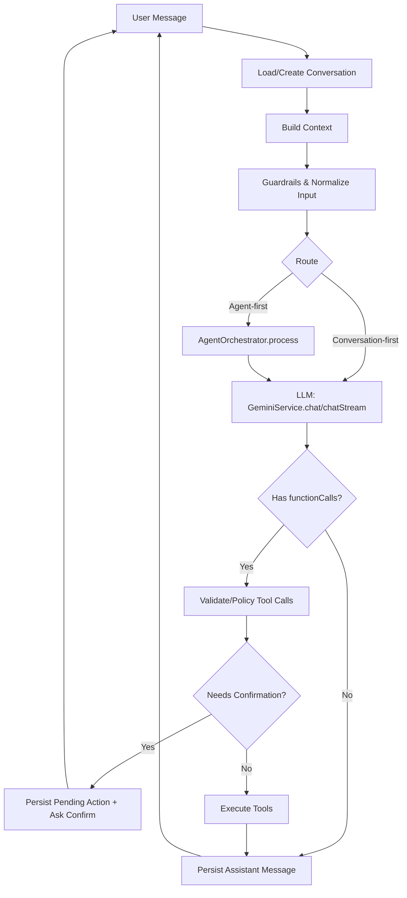
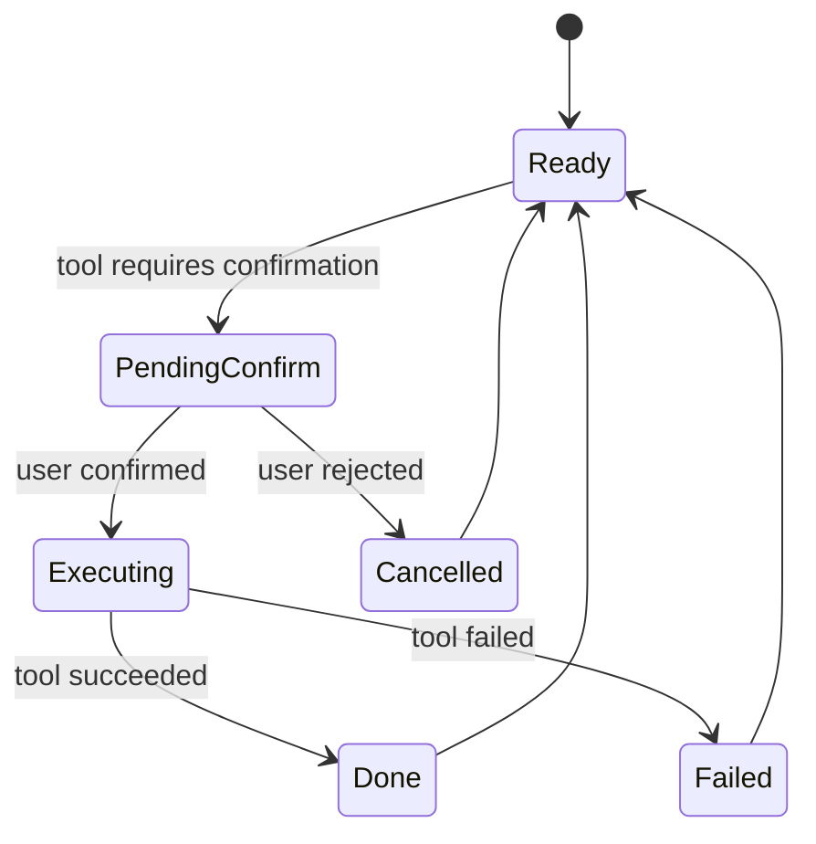
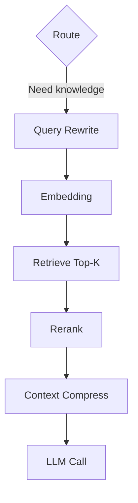

# AI Graph Report (Calento / tempra)

Tài liệu này mô tả:

- **Hiện trạng** `server/src/modules/ai`: cách Calento đang chat, function-calling, tools, agents, lưu conversation/actions.
- **Đề xuất “AI Graph”** (graph-based orchestration) để dễ mở rộng **Chatbot mới** (LLM, tools, guardrails, streaming, confirmation, và **RAG** nếu cần).

Mục tiêu là có một “graph” rõ ràng (node/edge + state) để:

- Dễ triển khai thêm intent/agent/tool.
- Dễ quan sát (logging/metrics) và kiểm soát rủi ro (tool safety/confirm).
- Dễ thêm RAG (policy/docs/knowledge) mà không làm rối luồng core.

---

## 1) Hiện trạng module AI trong project

### 1.1 Entry points (API)

- `POST /ai/chat`
  - Gọi `AIConversationService.chat(...)`
  - Trả `ChatResponseDto` gồm: `response`, `conversation_id`, `function_calls`, `actions`, `timestamp`

- `POST /ai/chat/stream`
  - Gọi `AIConversationService.chatStream(...)`
  - Trả stream SSE: `text`, `action_start`, `action_result`, `done`, `error`

- `POST /ai/actions/confirm`
  - Hiện tại có endpoint confirm nhưng logic đang “stub” (trả message cố định), chưa nối vào state machine thực.

### 1.2 Core services

- `GeminiService`
  - Model: `gemini-2.5-flash`
  - Có function calling dựa trên `FUNCTION_DESCRIPTIONS`
  - Có `systemInstruction` lấy từ `SYSTEM_PROMPTS.CALENTO_MAIN`
  - `chat()` / `chatStream()` trả về `text` + `functionCalls`

- `AIConversationService`
  - Tạo/đọc `conversation` qua `AIConversationRepository`
  - Lưu message user/assistant
  - Build context (timezone, current_date, upcoming_events)
  - Nếu có functionCalls → tạo action record (`AIActionRepository`) → execute bằng `AIFunctionCallingService`

- `AIFunctionCallingService`
  - Router thực thi function call theo `functionCall.name`
  - Gọi domain services:
    - `EventService`, `CalendarService`, `TaskService`, `AIAnalysisService`

### 1.3 Agents + Tools (đang có sẵn)

Trong `server/src/modules/ai/agents`:

- `AgentOrchestrator`: chọn agent theo keyword/confidence
- `CalendarAgent`, `TaskAgent`, `AnalysisAgent`: mỗi agent gọi `GeminiService.chat()` + thực thi tool bằng `ToolRegistry`

Trong `server/src/modules/ai/tools`:

- `ToolRegistry`: register tools lúc `AIModule.onModuleInit()` và execute tool theo tên
- Tools theo category: calendar/task/analysis

Nhận xét quan trọng:

- Hiện tại có **2 đường orchestration**:
  - **Conversation-first**: `AIConversationService` gọi `GeminiService` và chạy `AIFunctionCallingService`.
  - **Agent-first**: `AgentOrchestrator` → `XAgent` → `ToolRegistry`.
- Dễ mở rộng nhất là “Graph” nên **chọn 1 đường chủ đạo** rồi attach phần còn lại như adapter.

---

## 2) Vấn đề khi scale Chatbot (LLM/RAG) theo cách hiện tại

- **Luồng bị “ẩn” trong code**: nhiều if/try-catch rải rác; khó nhìn như state machine.
- **Confirm action** chưa thành flow thực (pending actions/state).
- **Tool safety & policy** chưa có node riêng (guardrails / allowlist / rate-limit / validation).
- **RAG** (nếu bổ sung) dễ bị nhét thẳng vào prompt và trở thành “monolithic prompt”.
- **Observability**: khó gắn tracing theo từng bước (node) → khó debug hallucination/tool mistakes.

---

## 3) Đề xuất kiến trúc “AI Graph” dễ triển khai

### 3.1 Tư tưởng

Tạo một “graph runner” chạy theo **state** (conversation state) và **node contracts**:

- Mỗi node:
  - Input: `GraphState`
  - Output: `GraphState` (updated)
  - Side effects rõ ràng (tool execution, db writes)
  - Logging/metrics theo node

- Các edge/transition dựa trên:
  - Intent/route decision
  - Có tool call hay không
  - Có pending confirmation hay không
  - Error type (retryable vs non-retryable)

### 3.2 Graph state (hợp với codebase hiện tại)

Đề xuất state tối thiểu (bám theo `AIConversationService` và tools):

- `conversationId: string`
- `userId: string`
- `input: { message: string }`
- `history: AIMessage[]` (hoặc reference từ repo)
- `context: Record<string, any>` (timezone, current_date, upcoming_events, preferences...)
- `route: { mode: 'conversation' | 'agent', agentType?: 'calendar'|'task'|'analysis' }`
- `llm: { text?: string, functionCalls?: AIFunctionCall[] }`
- `actions: Array<{ id?: string, name: string, args: any, status: 'pending'|'completed'|'failed', result?: any, error?: string }>`
- `output: { text: string }`
- `errors: Array<{ node: string, message: string, retryable?: boolean }>`

### 3.3 Mermaid: Graph tổng quan (đề xuất)

Ghi chú:

- `Validate/Policy Tool Calls` là nơi enforce allowlist, schema validation, rate-limit, “dangerous tool” confirm.
- `Needs Confirmation` gắn với endpoint `POST /ai/actions/confirm`.

---

## 4) Node/Edge chi tiết (đề xuất triển khai)

### 4.1 Node: Load/Create Conversation

- **Input**: `userId`, `conversationId?`
- **Output**:
  - đảm bảo có `conversationId`
  - load `history` (messages) và `context` base

Mapping code hiện tại:

- `AIConversationRepository.findById()`
- `AIConversationRepository.create()`
- `AIConversationRepository.addMessage()`

### 4.2 Node: Build Context

- Thu thập context có tính “grounding”:
  - timezone, current_date, preferences
  - upcoming events (`EventService.getEventsByDateRange`)

Mapping code hiện tại:

- `AIConversationService.buildCalendarContext()`

### 4.3 Node: Guardrails & Normalize Input

Mục tiêu:

- Chuẩn hoá text đầu vào (trim, length cap)
- Chặn prompt injection cơ bản
- Enforce “do not call non-allowed tool” (đã có một phần trong system prompt)
- Chuẩn hoá ISO datetime (UTC+7) nếu user dùng format mơ hồ

### 4.4 Node: Route

Route có thể dùng 2 kiểu:

1) **Heuristic** (như hiện tại): keyword/confidence (`AgentOrchestrator`)
2) **LLM router**: gọi 1 prompt ngắn trả về `{agentType, confidence}` (tối ưu khi scale domain)

Khuyến nghị rollout:

- Phase 1: giữ heuristic route (ít rủi ro)
- Phase 2: bổ sung LLM-router (fallback về heuristic)

### 4.5 Node: LLM Call

Thống nhất một interface gọi LLM:

- sync: `GeminiService.chat(message, history, context)`
- stream: `GeminiService.chatStream(...)`

Trong agent-based flow hiện tại, `XAgent` đang truyền `context` có `systemPrompt` và `tools`.

Khuyến nghị:

- Graph node “LLM Call” nên nhận `systemPrompt` + `tools` rõ ràng để không bị “ẩn” trong agent.

### 4.6 Node: Validate/Policy Tool Calls

Các rule nên có:

- **Allowlist**: tool name phải nằm trong `ToolRegistry.getAllTools()` hoặc `FUNCTION_DESCRIPTIONS`.
- **Schema validate**: args đúng schema (bằng JSON schema runtime).
- **Rate limit**: giới hạn tool calls/turn.
- **Dangerous tools**: các tool có side effects (create/update/delete) → require confirmation (tuỳ setting).

### 4.7 Node: Execute Tools

Thực thi tool nên thống nhất 1 đường:

- Ưu tiên: `ToolRegistry.execute(toolName, args, context)`
- Hoặc giữ `AIFunctionCallingService` như adapter (để không phá code domain).

Ý tưởng “tool result feedback”:

- Sau khi tool chạy xong, optionally gọi LLM thêm 1 lượt “post-process” để tóm tắt kết quả và tạo câu trả lời tự nhiên.

### 4.8 Node: Persist + Respond

- Lưu assistant message + tool calls + action statuses
- Trả response theo format API hiện tại:
  - non-stream: `ChatResponseDto`
  - stream: SSE events

---

## 5) Confirmation flow (kết nối với /ai/actions/confirm)

### 5.1 Mermaid: Confirm state machine

### 5.2 Data contract tối thiểu

- `AIActionRepository.create(conversationId, toolName, args)` tạo action id.
- Response của chat khi cần confirm:
  - `actions[]` có item status `pending` + `action_id`
  - `response` là câu hỏi confirm + hiển thị tham số

- `POST /ai/actions/confirm`:
  - Input: `action_id`, `confirmed`, `modified_parameters?`, `conversation_id?`
  - Graph tiếp tục từ node `Execute Tools` với args đã confirm.

---

## 6) RAG: thêm như 1 nhánh graph (không làm bẩn core)

Module AI hiện tại chủ yếu là tool-calling cho calendar/task. RAG nên được thêm khi:

- Cần trả lời theo knowledge base (policy, help docs, FAQ)
- Cần grounding theo dữ liệu text ngoài DB giao dịch

### 6.1 Nguyên tắc tích hợp RAG

- RAG là **node riêng**: `RetrieveContext`.
- Chỉ chạy khi route quyết định “knowledge needed” (ví dụ intent: FAQ/policy/how-to).
- Context đưa vào LLM phải có:
  - source ids
  - score
  - trích đoạn ngắn (context compression)

### 6.2 Mermaid: RAG branch (đề xuất)

Ghi chú:

- Ở Calento, data “ground truth” cho calendar/task vẫn là tools + DB; RAG chỉ nên hỗ trợ “giải thích/FAQ/policy”.

---

## 7) Observability (log/metrics) theo node

Khuyến nghị tối thiểu:

- `traceId`/`requestId` gắn vào toàn bộ node run
- Log theo node:
  - node name
  - duration
  - toolName
  - success/failure

SSE streaming:

- emit `node_start`, `node_end` (nếu cần debug)
- hiện tại đã có `text`, `action_start`, `action_result`, `done`

---

## 8) Lộ trình triển khai (không phá code hiện tại)

### Phase 1 (an toàn)

- Giữ API endpoints.
- Implement graph runner “mỏng” bên trong `AIConversationService`:
  - `Load/Create Conversation` → `Build Context` → `LLM Call` → `Execute Tool Calls`.
- Chuẩn hoá confirm: trả pending + execute khi user confirm.

### Phase 2 (mở rộng)

- Thay route logic bằng `AgentOrchestrator` (hoặc LLM-router) nhưng vẫn chạy trong graph.
- Thống nhất tool execution qua `ToolRegistry`.

### Phase 3 (RAG)

- Thêm `RetrieveContext` node cho intent FAQ/policy.
- Add vector store + ingestion pipeline.

---

## 9) Appendix: mapping nhanh với codebase

- **API**: `server/src/modules/ai/ai.controller.ts`
- **Conversation orchestration**: `server/src/modules/ai/services/ai-conversation.service.ts`
- **LLM**: `server/src/modules/ai/services/gemini.service.ts`
- **Function calling router**: `server/src/modules/ai/services/ai-function-calling.service.ts`
- **Agents**: `server/src/modules/ai/agents/*`
- **Tools**: `server/src/modules/ai/tools/*`
