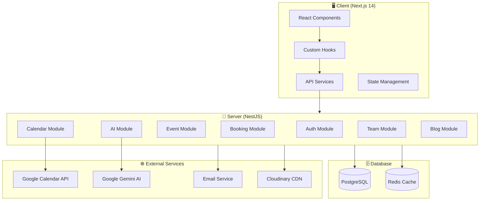
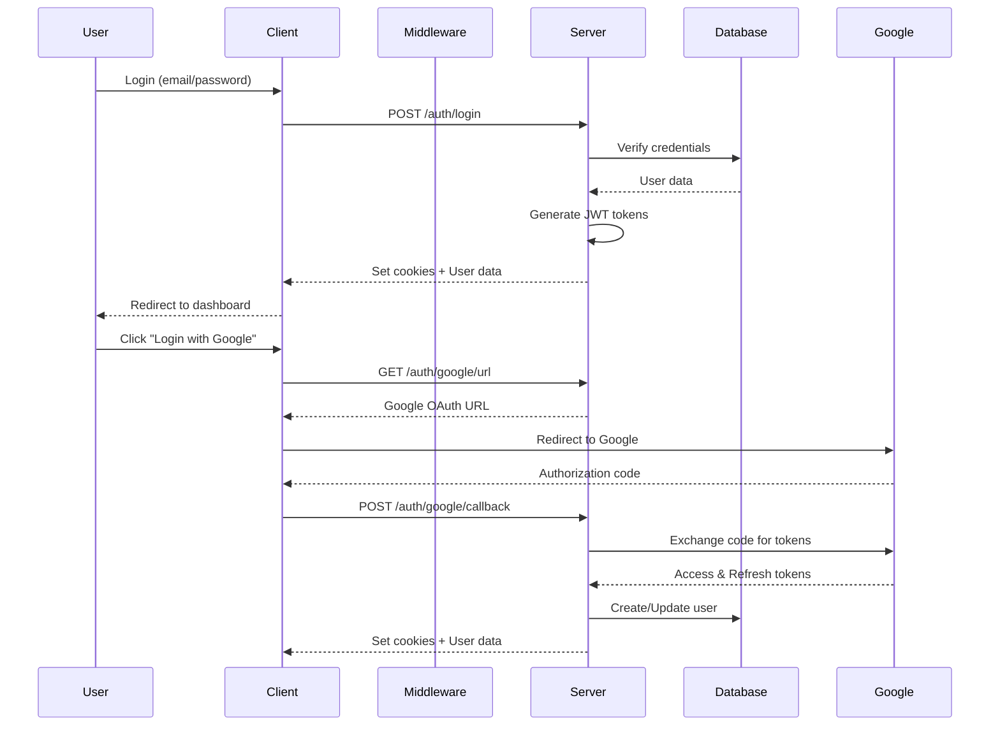
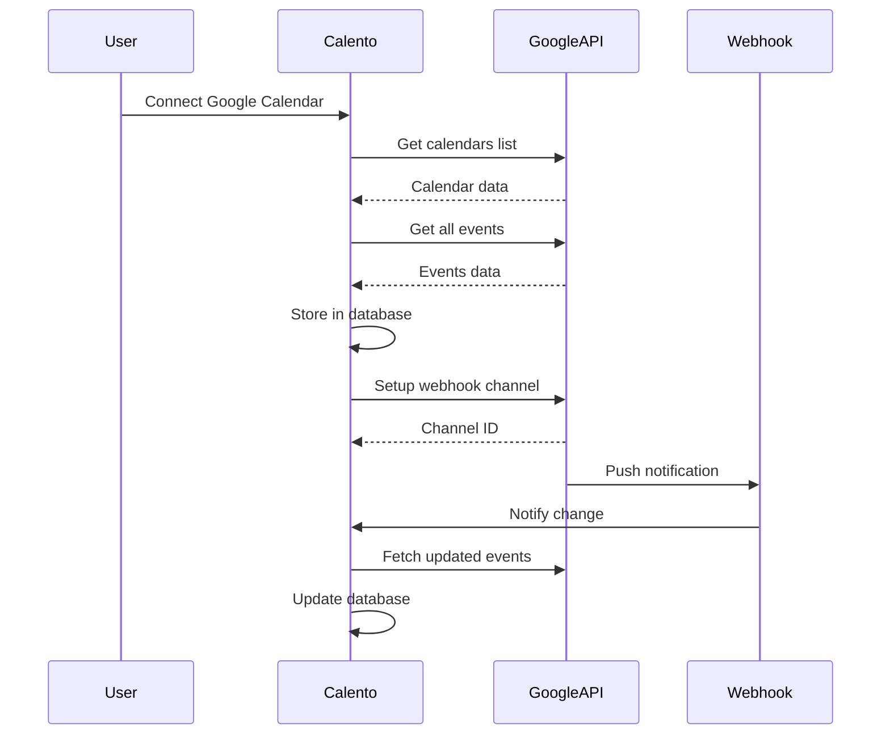
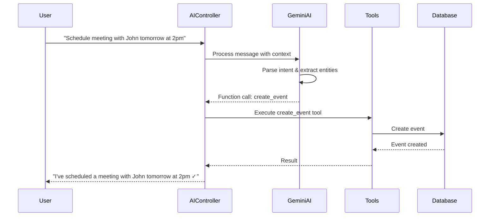
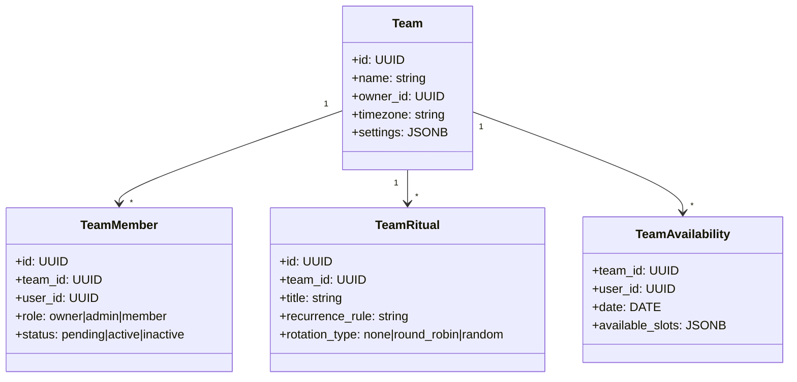
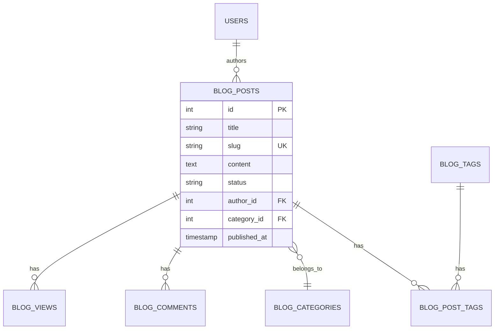
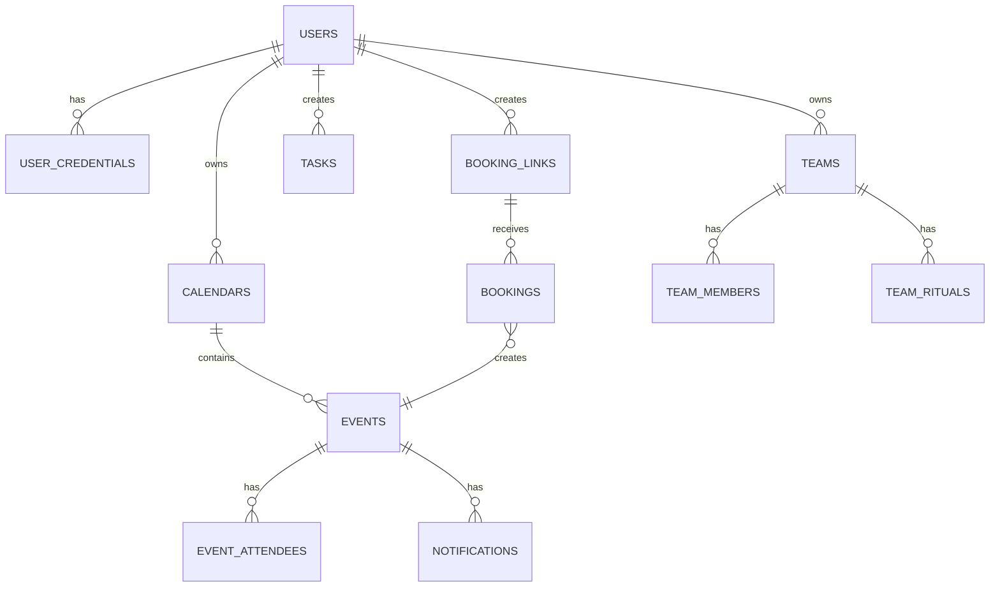

# 📅 Calento - Tổng Quan Hệ Thống

> **Calento.space** - Ứng dụng Calendar Assistant thông minh với tích hợp AI, Google Calendar sync, booking system, và team collaboration.

---

## 🏗️ Kiến Trúc Tổng Quan



---

## 📂 Cấu Trúc Thư Mục Dự Án

```
calento.space/
├── client/                 # Frontend Next.js 14
│   ├── app/               # App Router pages
│   │   ├── (dashboard)/   # Protected dashboard routes
│   │   ├── auth/          # Authentication pages
│   │   ├── blog/          # Blog public pages
│   │   └── book/          # Public booking pages
│   ├── components/        # React components (23 directories)
│   ├── hook/              # Custom hooks (19 directories)
│   ├── service/           # API service layer
│   ├── store/             # State management (Zustand)
│   └── utils/             # Utility functions
│
├── server/                 # Backend NestJS
│   ├── src/
│   │   ├── modules/       # Feature modules (18 modules)
│   │   ├── common/        # Shared utilities, guards, decorators
│   │   ├── database/      # Database connection
│   │   └── config/        # Configuration
│   └── migrations/        # Database schema
│
└── provision/             # Docker configuration
```

---

## 🔐 1. HỆ THỐNG AUTHENTICATION

### 1.1 Tổng Quan

Hệ thống xác thực hỗ trợ:
- **JWT Token-based authentication** với access/refresh token
- **Cookie-based session** cho bảo mật cao hơn
- **Google OAuth 2.0** cho đăng nhập nhanh
- **Password reset** qua email

### 1.2 Authentication Flow



### 1.3 API Endpoints

| Method | Endpoint | Mô tả |
|--------|----------|-------|
| POST | `/auth/register` | Đăng ký tài khoản mới |
| POST | `/auth/login` | Đăng nhập |
| POST | `/auth/logout` | Đăng xuất |
| GET | `/auth/me` | Lấy thông tin user hiện tại |
| POST | `/auth/refresh` | Refresh access token |
| GET | `/auth/verify` | Xác thực session |
| GET | `/auth/google/url` | Lấy URL đăng nhập Google |
| POST | `/auth/google/login` | Xử lý Google OAuth callback |
| POST | `/auth/password-reset/request` | Yêu cầu reset password |
| POST | `/auth/password-reset` | Reset password |

### 1.4 Middleware Protection

Client sử dụng Next.js Middleware để bảo vệ routes:

```typescript
// Protected routes
const protectedPrefixes = ['/dashboard', '/calendar', '/events', '/profile', '/settings'];

// Guest-only routes (redirect if authenticated)
const guestOnlyRoutes = ['/login', '/register', '/forgot-password'];
```

---

## 📆 2. HỆ THỐNG CALENDAR & EVENTS

### 2.1 Tổng Quan

Hệ thống calendar là core của ứng dụng với các tính năng:
- **Đồng bộ 2 chiều** với Google Calendar
- **Recurring events** (sự kiện lặp lại)
- **Event attendees** với hệ thống invitation
- **Multiple calendars** support
- **Timezone-aware** scheduling

### 2.2 Calendar Sync Flow



### 2.3 Event Management Features

| Feature | Mô tả |
|---------|-------|
| Create Event | Tạo sự kiện mới (local hoặc sync to Google) |
| Update Event | Cập nhật chi tiết sự kiện |
| Delete Event | Xóa sự kiện |
| Recurring Events | Hỗ trợ RRULE format (RFC 5545) |
| Event Invitations | Gửi email invitation đến attendees |
| RSVP Response | Accept/Decline/Tentative response |
| Color Coding | Phân loại events bằng màu sắc |
| Conference Data | Tích hợp Google Meet, Zoom links |

### 2.4 API Endpoints

| Method | Endpoint | Mô tả |
|--------|----------|-------|
| GET | `/events` | Lấy danh sách events (với filters) |
| POST | `/events` | Tạo event mới |
| GET | `/events/:id` | Lấy chi tiết event |
| PUT | `/events/:id` | Cập nhật toàn bộ event |
| PATCH | `/events/:id` | Cập nhật một phần event |
| DELETE | `/events/:id` | Xóa event |
| GET | `/events/recurring/expand` | Expand recurring events |
| POST | `/events/:id/invitations/send` | Gửi invitations |
| GET | `/invitation/:token` | Xem invitation details (public) |
| POST | `/invitation/:token/respond` | Respond to invitation |

---

## 📌 3. HỆ THỐNG BOOKING

### 3.1 Tổng Quan

Hệ thống booking cho phép:
- Tạo **public booking links** (như Calendly)
- **Availability-based scheduling**
- **Buffer time** giữa các meetings
- **Max bookings per day** limit
- **Email notifications** tự động

### 3.2 Booking Flow

```mermaid
flowchart LR
    subgraph Owner["📅 Owner Setup"]
        A[Create Booking Link] --> B[Set Duration]
        B --> C[Set Availability]
        C --> D[Get Public URL]
    end
    
    subgraph Guest["👤 Guest Booking"]
        E[Access Public Link] --> F[View Available Slots]
        F --> G[Select Time Slot]
        G --> H[Fill Contact Info]
        H --> I[Confirm Booking]
    end
    
    subgraph System["⚙️ System"]
        I --> J[Create Event]
        J --> K[Send Confirmation Email]
        K --> L[Sync to Calendar]
    end
    
    D --> E
```



### 3.3 Booking Link Configuration

| Setting | Mô tả |
|---------|-------|
| `title` | Tên loại meeting (VD: "30-min Consultation") |
| `slug` | URL-friendly identifier |
| `duration_minutes` | Thời lượng meeting |
| `buffer_time_minutes` | Thời gian nghỉ giữa meetings |
| `advance_notice_hours` | Thông báo trước tối thiểu |
| `booking_window_days` | Số ngày có thể đặt trước |
| `max_bookings_per_day` | Giới hạn bookings/ngày |
| `expires_at` | Ngày hết hạn booking link |

### 3.4 API Endpoints

| Method | Endpoint | Mô tả |
|--------|----------|-------|
| GET | `/booking-links` | Lấy tất cả booking links |
| POST | `/booking-links` | Tạo booking link mới |
| GET | `/booking-links/:id` | Chi tiết booking link |
| PATCH | `/booking-links/:id` | Cập nhật booking link |
| DELETE | `/booking-links/:id` | Xóa booking link |
| GET | `/book/:slug` | Lấy public booking info |
| GET | `/book/:slug/slots` | Lấy available time slots |
| POST | `/book/:slug` | Tạo booking mới |
| GET | `/bookings` | Lấy tất cả bookings của user |
| POST | `/bookings/:id/cancel` | Hủy booking |
| POST | `/bookings/:id/reschedule` | Đổi lịch booking |

---

## 🤖 4. HỆ THỐNG AI ASSISTANT

### 4.1 Tổng Quan

Tích hợp **Google Gemini AI** để:
- **Natural language scheduling** - Đặt lịch bằng ngôn ngữ tự nhiên
- **Smart time suggestions** - Gợi ý thời gian phù hợp
- **Meeting notes summary** - Tóm tắt notes cuộc họp
- **Action confirmation** - Xác nhận trước khi thực hiện actions

### 4.2 AI Conversation Flow



### 4.3 AI Tools (Function Calling)

| Tool | Mô tả |
|------|-------|
| `create_event` | Tạo sự kiện mới |
| `update_event` | Cập nhật sự kiện |
| `delete_event` | Xóa sự kiện |
| `list_events` | Liệt kê events |
| `find_free_time` | Tìm thời gian rảnh |
| `get_calendar_summary` | Tóm tắt lịch |

### 4.4 API Endpoints

| Method | Endpoint | Mô tả |
|--------|----------|-------|
| POST | `/ai/chat` | Gửi message đến AI |
| GET | `/ai/chat/stream` | Stream AI response (SSE) |
| GET | `/ai/conversations` | Lấy lịch sử conversations |
| GET | `/ai/conversations/:id` | Chi tiết conversation |
| DELETE | `/ai/conversations/:id` | Xóa conversation |
| POST | `/ai/actions/confirm` | Xác nhận pending action |

---

## 👥 5. HỆ THỐNG TEAM COLLABORATION

### 5.1 Tổng Quan

Hệ thống team cho phép:
- **Team creation** với owner/admin/member roles
- **Member invitations** qua email
- **Team Rituals** - Recurring team meetings với rotation
- **Availability heatmap** - Tìm thời gian chung
- **Optimal time finder** - AI-powered scheduling

### 5.2 Team Structure



### 5.3 API Endpoints

| Method | Endpoint | Mô tả |
|--------|----------|-------|
| POST | `/teams` | Tạo team mới |
| GET | `/teams` | Lấy teams của user |
| GET | `/teams/:id` | Chi tiết team |
| POST | `/teams/:id/invite` | Mời thành viên |
| POST | `/teams/:id/members/:mid/accept` | Chấp nhận invitation |
| POST | `/teams/:id/rituals` | Tạo ritual mới |
| POST | `/teams/:id/availability/heatmap` | Lấy availability heatmap |
| POST | `/teams/:id/availability/optimal` | Tìm optimal meeting time |

---

## ✅ 6. HỆ THỐNG TASKS & PRIORITIES

### 6.1 Tổng Quan

Quản lý công việc với:
- **Task management** - CRUD tasks với status tracking
- **Priority board** - Kanban-style priority management
- **Tags & Projects** - Tổ chức tasks
- **Recurring tasks** - Tasks lặp lại

### 6.2 Priority Levels

| Priority | Mô tả |
|----------|-------|
| `critical` | Quan trọng nhất, cần làm ngay |
| `high` | Ưu tiên cao |
| `medium` | Bình thường |
| `low` | Ưu tiên thấp |
| `disabled` | Tạm tắt |

### 6.3 Task Statuses

| Status | Mô tả |
|--------|-------|
| `todo` | Chưa bắt đầu |
| `in_progress` | Đang thực hiện |
| `completed` | Hoàn thành |
| `cancelled` | Đã hủy |

---

## 📝 7. HỆ THỐNG BLOG

### 7.1 Tổng Quan

Hệ thống blog với:
- **Posts management** - CRUD blog posts
- **Categories & Tags** - Phân loại bài viết
- **SEO optimization** - Meta tags, structured data
- **Comments system** - Với moderation
- **View analytics** - Tracking views

### 7.2 Database Schema



---

## 📧 8. HỆ THỐNG EMAIL & NOTIFICATIONS

### 8.1 Email Types

| Type | Trigger | Template |
|------|---------|----------|
| Welcome | User registers | `welcome.hbs` |
| Password Reset | User requests reset | `password-reset.hbs` |
| Event Invitation | Host invites attendee | `event-invitation.hbs` |
| Booking Confirmation | New booking created | `booking-confirmation.hbs` |
| Booking Reminder | 24h before booking | `booking-reminder.hbs` |
| Team Invitation | Team invite sent | `team-invitation.hbs` |

### 8.2 Notification Channels

| Channel | Status |
|---------|--------|
| Email | ✅ Implemented |
| Slack | 🔄 Planned |
| Push Notifications | 🔄 Planned |
| Zalo | 🔄 Planned |

---

## 🗄️ 9. DATABASE SCHEMA

### 9.1 Core Tables Overview



### 9.2 Tables by Module

| Module | Tables |
|--------|--------|
| **Core Auth** | `users`, `user_credentials` |
| **Calendar** | `calendars`, `events`, `event_attendees`, `availabilities` |
| **Booking** | `booking_links`, `bookings` |
| **Tasks** | `tasks`, `user_priorities` |
| **Team** | `teams`, `team_members`, `team_rituals`, `team_availability`, `team_meeting_rotations` |
| **Blog** | `blog_posts`, `blog_categories`, `blog_tags`, `blog_post_tags`, `blog_comments`, `blog_views` |
| **Sync** | `sync_logs`, `sync_log`, `sync_errors`, `event_conflicts`, `webhook_channels` |
| **Notifications** | `notifications`, `email_logs`, `meeting_notes` |
| **AI** | `ai_conversations`, `ai_actions` |
| **Contact** | `contacts` |
| **Integrations** | `integrations` |

---

## 🔧 10. TECHNOLOGY STACK

### 10.1 Backend (Server)

| Technology | Usage |
|------------|-------|
| **NestJS** | Framework chính |
| **TypeScript** | Language |
| **PostgreSQL** | Primary database |
| **Redis** | Caching & Sessions |
| **JWT** | Authentication |
| **Passport.js** | OAuth strategies |
| **BullMQ** | Job queues |
| **Swagger** | API documentation |

### 10.2 Frontend (Client)

| Technology | Usage |
|------------|-------|
| **Next.js 14** | Framework (App Router) |
| **React 18** | UI Library |
| **TypeScript** | Language |
| **TailwindCSS** | Styling |
| **ShadcnUI** | Component library |
| **Zustand** | State management |
| **React Query** | Server state |
| **FullCalendar** | Calendar component |

### 10.3 External Services

| Service | Purpose |
|---------|---------|
| **Google Calendar API** | Calendar sync |
| **Google OAuth 2.0** | Authentication |
| **Google Gemini AI** | AI Assistant |
| **Cloudinary** | Image hosting |
| **Email Service** | Transactional emails |

---

## 📊 11. CLIENT COMPONENTS ARCHITECTURE

### 11.1 Component Structure

```
components/
├── analytics/           # Dashboard analytics charts
├── auth/               # Login, Register, Password reset
├── availability/       # Availability management
├── booking/            # Booking system components
├── calendar/           # Calendar views (Day, Week, Month)
├── dashboard/          # Dashboard layout, sidebar
├── invitation/         # Event invitation handling
├── priorities/         # Priority board (Kanban)
├── scheduling-links/   # Booking links management
├── task/               # Task management
├── team/               # Team collaboration
└── ui/                 # ShadcnUI components
```

### 11.2 Hook Architecture

```
hook/
├── ai/                 # AI chat hooks
├── auth/               # Authentication hooks
├── availability/       # Availability hooks
├── booking/            # Booking hooks
├── calendar/           # Calendar hooks
├── event/              # Event CRUD hooks
├── google/             # Google sync hooks
├── priority/           # Priority board hooks
├── task/               # Task management hooks
└── team/               # Team hooks
```

---

## 🚀 12. DEPLOYMENT

### 12.1 Development

```bash
# Start services
cd provision && docker-compose up -d

# Server
cd server && npm run dev

# Client  
cd client && npm run dev
```

### 12.2 Production

```bash
# Build
npm run build

# Deploy with Docker
docker-compose -f docker-compose.prod.yml up -d
```

### 12.3 Environment Variables

| Variable | Description |
|----------|-------------|
| `DB_HOST`, `DB_PORT`, `DB_USER`, `DB_PASSWORD` | PostgreSQL |
| `REDIS_HOST`, `REDIS_PORT`, `REDIS_PASSWORD` | Redis |
| `JWT_SECRET`, `JWT_REFRESH_SECRET` | JWT tokens |
| `GOOGLE_CLIENT_ID`, `GOOGLE_CLIENT_SECRET` | Google OAuth |
| `GEMINI_API_KEY` | Google Gemini AI |
| `CLOUDINARY_*` | Cloudinary config |
| `SMTP_*` | Email service |

---

## 📈 13. ROADMAP & FUTURE FEATURES

| Feature | Status | Priority |
|---------|--------|----------|
| ✅ Core Calendar | Completed | - |
| ✅ Google Sync | Completed | - |
| ✅ Booking System | Completed | - |
| ✅ AI Assistant | Completed | - |
| ✅ Team Collaboration | Completed | - |
| ✅ Blog System | Completed | - |
| 🔄 Outlook Integration | In Progress | High |
| 📋 Mobile App | Planned | High |
| 📋 Slack/Zoom Integration | Planned | Medium |
| 📋 Advanced Analytics | Planned | Medium |
| 📋 Multi-language Support | Planned | Low |

---

> **Document Version**: 1.0  
> **Last Updated**: 2025-12-11  
> **Prepared for**: Project Progress Report
