# 📅 Calento - Tổng Quan Hệ Thống

> **Calento.space** - Ứng dụng Calendar Assistant thông minh với tích hợp AI, Google Calendar sync, booking system, và team collaboration.

---

## 🏗️ Kiến Trúc Tổng Quan

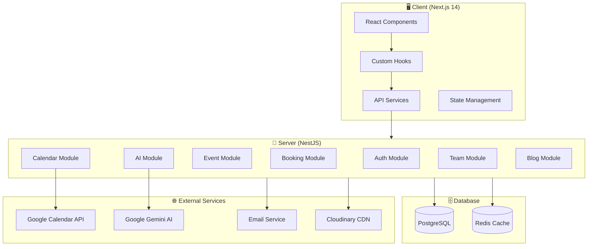

---

## 📂 Cấu Trúc Thư Mục Dự Án

```
calento.space/
├── client/                 # Frontend Next.js 14
│   ├── app/               # App Router pages
│   │   ├── (dashboard)/   # Protected dashboard routes
│   │   ├── auth/          # Authentication pages
│   │   ├── blog/          # Blog public pages
│   │   └── book/          # Public booking pages
│   ├── components/        # React components (23 directories)
│   ├── hook/              # Custom hooks (19 directories)
│   ├── service/           # API service layer
│   ├── store/             # State management (Zustand)
│   └── utils/             # Utility functions
│
├── server/                 # Backend NestJS
│   ├── src/
│   │   ├── modules/       # Feature modules (18 modules)
│   │   ├── common/        # Shared utilities, guards, decorators
│   │   ├── database/      # Database connection
│   │   └── config/        # Configuration
│   └── migrations/        # Database schema
│
└── provision/             # Docker configuration
```

---

## 🔐 1. HỆ THỐNG AUTHENTICATION

### 1.1 Tổng Quan

Hệ thống xác thực hỗ trợ:
- **JWT Token-based authentication** với access/refresh token
- **Cookie-based session** cho bảo mật cao hơn
- **Google OAuth 2.0** cho đăng nhập nhanh
- **Password reset** qua email

### 1.2 Authentication Flow

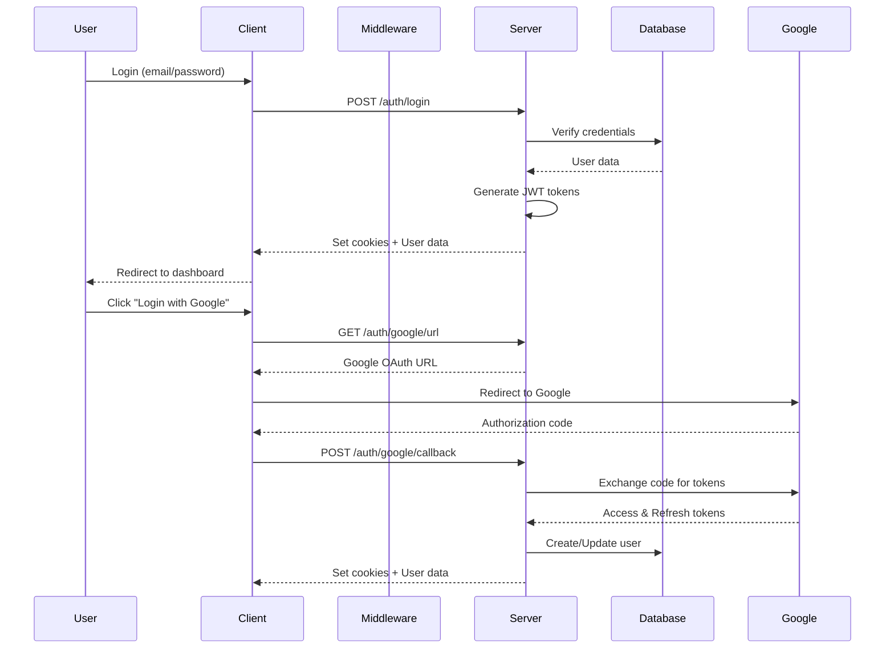

### 1.3 API Endpoints

| Method | Endpoint | Mô tả |
|--------|----------|-------|
| POST | `/auth/register` | Đăng ký tài khoản mới |
| POST | `/auth/login` | Đăng nhập |
| POST | `/auth/logout` | Đăng xuất |
| GET | `/auth/me` | Lấy thông tin user hiện tại |
| POST | `/auth/refresh` | Refresh access token |
| GET | `/auth/verify` | Xác thực session |
| GET | `/auth/google/url` | Lấy URL đăng nhập Google |
| POST | `/auth/google/login` | Xử lý Google OAuth callback |
| POST | `/auth/password-reset/request` | Yêu cầu reset password |
| POST | `/auth/password-reset` | Reset password |

### 1.4 Middleware Protection

Client sử dụng Next.js Middleware để bảo vệ routes:

```typescript
// Protected routes
const protectedPrefixes = ['/dashboard', '/calendar', '/events', '/profile', '/settings'];

// Guest-only routes (redirect if authenticated)
const guestOnlyRoutes = ['/login', '/register', '/forgot-password'];
```

---

## 📆 2. HỆ THỐNG CALENDAR & EVENTS

### 2.1 Tổng Quan

Hệ thống calendar là core của ứng dụng với các tính năng:
- **Đồng bộ 2 chiều** với Google Calendar
- **Recurring events** (sự kiện lặp lại)
- **Event attendees** với hệ thống invitation
- **Multiple calendars** support
- **Timezone-aware** scheduling

### 2.2 Calendar Sync Flow

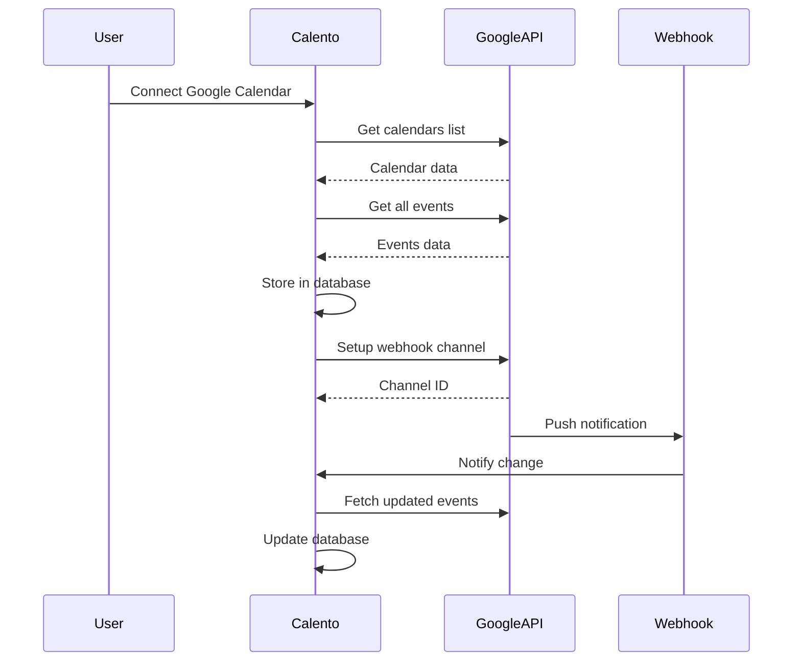

### 2.3 Event Management Features

| Feature | Mô tả |
|---------|-------|
| Create Event | Tạo sự kiện mới (local hoặc sync to Google) |
| Update Event | Cập nhật chi tiết sự kiện |
| Delete Event | Xóa sự kiện |
| Recurring Events | Hỗ trợ RRULE format (RFC 5545) |
| Event Invitations | Gửi email invitation đến attendees |
| RSVP Response | Accept/Decline/Tentative response |
| Color Coding | Phân loại events bằng màu sắc |
| Conference Data | Tích hợp Google Meet, Zoom links |

### 2.4 API Endpoints

| Method | Endpoint | Mô tả |
|--------|----------|-------|
| GET | `/events` | Lấy danh sách events (với filters) |
| POST | `/events` | Tạo event mới |
| GET | `/events/:id` | Lấy chi tiết event |
| PUT | `/events/:id` | Cập nhật toàn bộ event |
| PATCH | `/events/:id` | Cập nhật một phần event |
| DELETE | `/events/:id` | Xóa event |
| GET | `/events/recurring/expand` | Expand recurring events |
| POST | `/events/:id/invitations/send` | Gửi invitations |
| GET | `/invitation/:token` | Xem invitation details (public) |
| POST | `/invitation/:token/respond` | Respond to invitation |

---

## 📌 3. HỆ THỐNG BOOKING

### 3.1 Tổng Quan

Hệ thống booking cho phép:
- Tạo **public booking links** (như Calendly)
- **Availability-based scheduling**
- **Buffer time** giữa các meetings
- **Max bookings per day** limit
- **Email notifications** tự động

### 3.2 Booking Flow (Sequence Diagram)

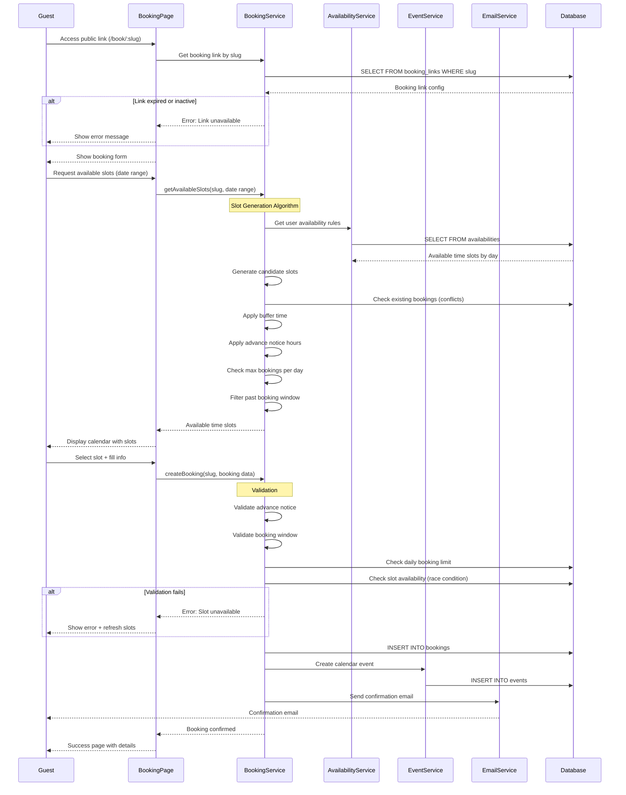

### 3.3 Booking Link Configuration

| Setting | Mô tả |
|---------|-------|
| `title` | Tên loại meeting (VD: "30-min Consultation") |
| `slug` | URL-friendly identifier |
| `duration_minutes` | Thời lượng meeting |
| `buffer_time_minutes` | Thời gian nghỉ giữa meetings |
| `advance_notice_hours` | Thông báo trước tối thiểu |
| `booking_window_days` | Số ngày có thể đặt trước |
| `max_bookings_per_day` | Giới hạn bookings/ngày |
| `location` | Meeting location (e.g., "Office", "Zoom") |
| `location_link` | Link to meeting location (e.g., Zoom URL) |
| `expires_at` | Ngày hết hạn booking link |

### 3.4 API Endpoints

| Method | Endpoint | Mô tả |
|--------|----------|-------|
| GET | `/booking-links` | Lấy tất cả booking links |
| POST | `/booking-links` | Tạo booking link mới |
| GET | `/booking-links/:id` | Chi tiết booking link |
| PATCH | `/booking-links/:id` | Cập nhật booking link |
| DELETE | `/booking-links/:id` | Xóa booking link |
| GET | `/book/:slug` | Lấy public booking info |
| GET | `/book/:slug/slots` | Lấy available time slots |
| POST | `/book/:slug` | Tạo booking mới |
| GET | `/bookings` | Lấy tất cả bookings của user |
| POST | `/bookings/:id/cancel` | Hủy booking |
| POST | `/bookings/:id/reschedule` | Đổi lịch booking |

---

## 🤖 4. HỆ THỐNG AI ASSISTANT

### 4.1 Tổng Quan

Tích hợp **Google Gemini AI** với kiến trúc RAG (Retrieval-Augmented Generation) để:
- **Natural language scheduling** - Đặt lịch bằng ngôn ngữ tự nhiên với AI
- **RAG-powered context** - Truy xuất ngữ cảnh người dùng qua vector search
- **Function calling** - 8 AI tools cho calendar, task, và analysis
- **Streaming responses** - SSE streaming cho trải nghiệm real-time
- **Long-term memory** - Lưu trữ và truy xuất ngữ cảnh hội thoại
- **Hybrid search** - Kết hợp vector similarity và full-text search

### 4.2 AI Architecture Overview

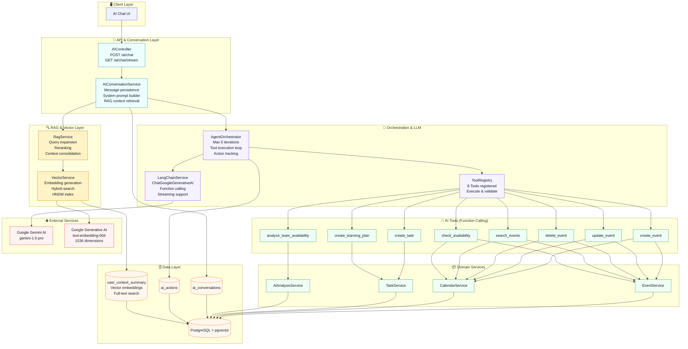

### 4.3 RAG Pipeline Flow

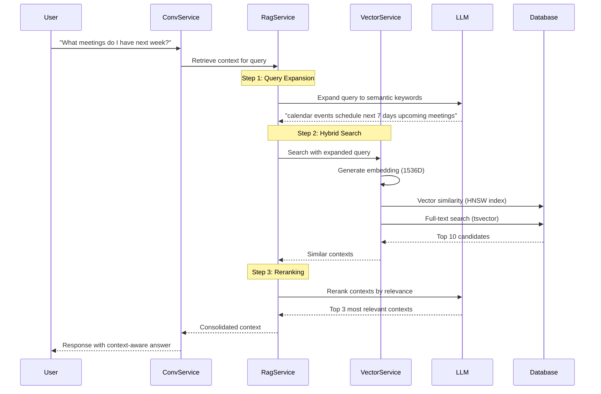

### 4.4 AI Conversation with Function Calling

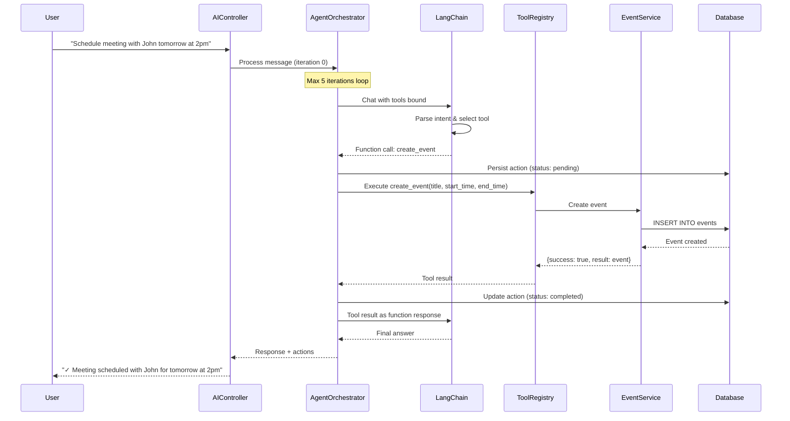

### 4.5 AI Tools (Function Calling)

Hệ thống có **8 AI tools** được đăng ký trong ToolRegistry:

**Calendar Tools (5 tools)**

| Tool | Mô tả | Service |
|------|-------|--------|
| `create_event` | Tạo sự kiện mới với title, time, attendees | EventService |
| `update_event` | Cập nhật thông tin sự kiện | EventService |
| `delete_event` | Xóa sự kiện theo ID | EventService |
| `search_events` | Tìm kiếm events theo thời gian, keyword | EventService |
| `check_availability` | Kiểm tra lịch rảnh trong khoảng thời gian | CalendarService |

**Task Tools (2 tools)**

| Tool | Mô tả | Service |
|------|-------|--------|
| `create_task` | Tạo task mới với priority, due date | TaskService |
| `create_learning_plan` | Tạo learning plan với AI suggestions | TaskService |

**Analysis Tools (1 tool)**

| Tool | Mô tả | Service |
|------|-------|--------|
| `analyze_team_availability` | Phân tích availability của team members | AIAnalysisService |

### 4.6 Vector Search & Embeddings

**VectorService** sử dụng **Google Generative AI Embeddings**:

| Feature | Implementation |
|---------|---------------|
| **Embedding Model** | `text-embedding-004` (Google) |
| **Dimension** | 1536 |
| **Storage** | PostgreSQL with pgvector extension |
| **Index Type** | HNSW (Hierarchical Navigable Small World) |
| **Similarity** | Cosine similarity (`vector_cosine_ops`) |
| **Hybrid Search** | Vector similarity + Full-text search (tsvector) |

**RagService Pipeline**:
1. **Query Expansion**: LLM rewrites query to be more keyword-rich
2. **Hybrid Search**: Top 10 results from vector + full-text
3. **Reranking**: LLM reranks to top 3 most relevant
4. **Timeout Protection**: 3s timeout with fallback

### 4.7 API Endpoints

**AI Chat**

| Method | Endpoint | Mô tả |
|--------|----------|-------|
| POST | `/ai/chat` | Gửi message đến AI (sync) |
| GET | `/ai/chat/stream` | Stream AI response (SSE) |
| GET | `/ai/conversations` | Lấy lịch sử conversations |
| GET | `/ai/conversations/:id` | Chi tiết conversation |
| DELETE | `/ai/conversations/:id` | Xóa conversation |
| GET | `/ai/actions` | Lấy AI actions history |

**RAG & Vector Search**

| Method | Endpoint | Mô tả |
|--------|----------|-------|
| POST | `/rag/context` | Thêm user context vào vector store |
| GET | `/rag/context` | Lấy user contexts |
| DELETE | `/rag/context/:id` | Xóa context |
| POST | `/vector/search` | Vector similarity search |
| POST | `/vector/hybrid-search` | Hybrid search (vector + full-text) |

---

## 👥 5. HỆ THỐNG TEAM COLLABORATION

### 5.1 Tổng Quan

Hệ thống team cho phép:
- **Team creation** với owner/admin/member roles
- **Member invitations** qua email
- **Team Rituals** - Recurring team meetings với rotation
- **Availability heatmap** - Tìm thời gian chung
- **Optimal time finder** - AI-powered scheduling

### 5.2 Team Structure

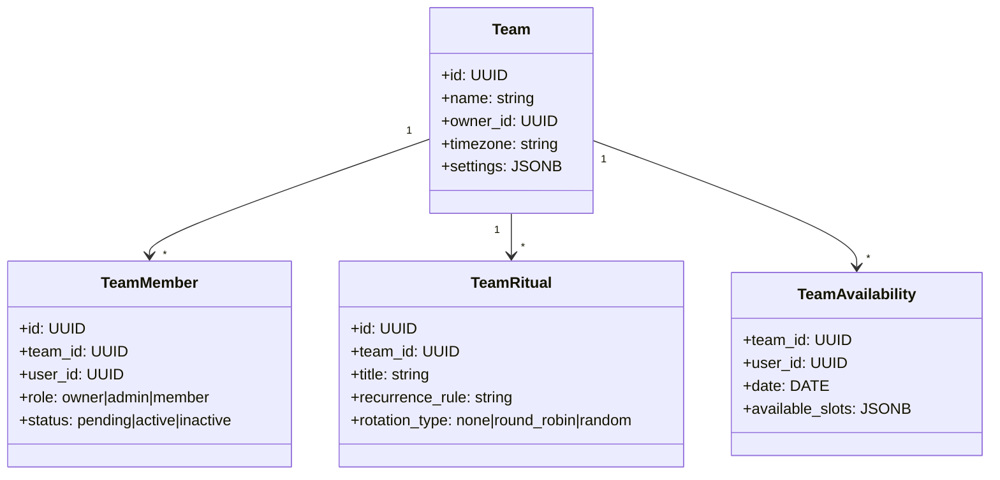

### 5.3 API Endpoints

| Method | Endpoint | Mô tả |
|--------|----------|-------|
| POST | `/teams` | Tạo team mới |
| GET | `/teams` | Lấy teams của user |
| GET | `/teams/:id` | Chi tiết team |
| POST | `/teams/:id/invite` | Mời thành viên |
| POST | `/teams/:id/members/:mid/accept` | Chấp nhận invitation |
| POST | `/teams/:id/rituals` | Tạo ritual mới |
| POST | `/teams/:id/availability/heatmap` | Lấy availability heatmap |
| POST | `/teams/:id/availability/optimal` | Tìm optimal meeting time |

---

## ✅ 6. HỆ THỐNG TASKS & PRIORITIES

### 6.1 Tổng Quan

Quản lý công việc với:
- **Task management** - CRUD tasks với status tracking
- **Priority board** - Kanban-style priority management
- **Tags & Projects** - Tổ chức tasks
- **Recurring tasks** - Tasks lặp lại

### 6.2 Priority Levels

| Priority | Mô tả |
|----------|-------|
| `critical` | Quan trọng nhất, cần làm ngay |
| `high` | Ưu tiên cao |
| `medium` | Bình thường |
| `low` | Ưu tiên thấp |
| `disabled` | Tạm tắt |

### 6.3 Task Statuses

| Status | Mô tả |
|--------|-------|
| `todo` | Chưa bắt đầu |
| `in_progress` | Đang thực hiện |
| `completed` | Hoàn thành |
| `cancelled` | Đã hủy |

---

## 📝 7. HỆ THỐNG BLOG

### 7.1 Tổng Quan

Hệ thống blog với:
- **Posts management** - CRUD blog posts
- **Categories & Tags** - Phân loại bài viết
- **SEO optimization** - Meta tags, structured data
- **Comments system** - Với moderation
- **View analytics** - Tracking views

### 7.2 Database Schema

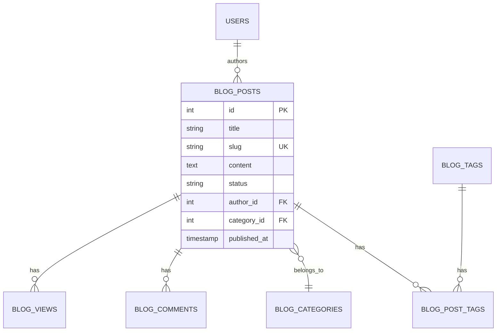

---

## 📧 8. HỆ THỐNG EMAIL & NOTIFICATIONS

### 8.1 Email Types

| Type | Trigger | Template |
|------|---------|----------|
| Welcome | User registers | `welcome.hbs` |
| Password Reset | User requests reset | `password-reset.hbs` |
| Event Invitation | Host invites attendee | `event-invitation.hbs` |
| Booking Confirmation | New booking created | `booking-confirmation.hbs` |
| Booking Reminder | 24h before booking | `booking-reminder.hbs` |
| Team Invitation | Team invite sent | `team-invitation.hbs` |

### 8.2 Notification Channels

| Channel | Status |
|---------|--------|
| Email | ✅ Implemented |
| Slack | 🔄 Planned |
| Push Notifications | 🔄 Planned |
| Zalo | 🔄 Planned |

---

## 🗄️ 9. DATABASE SCHEMA

### 9.1 Core Tables Overview

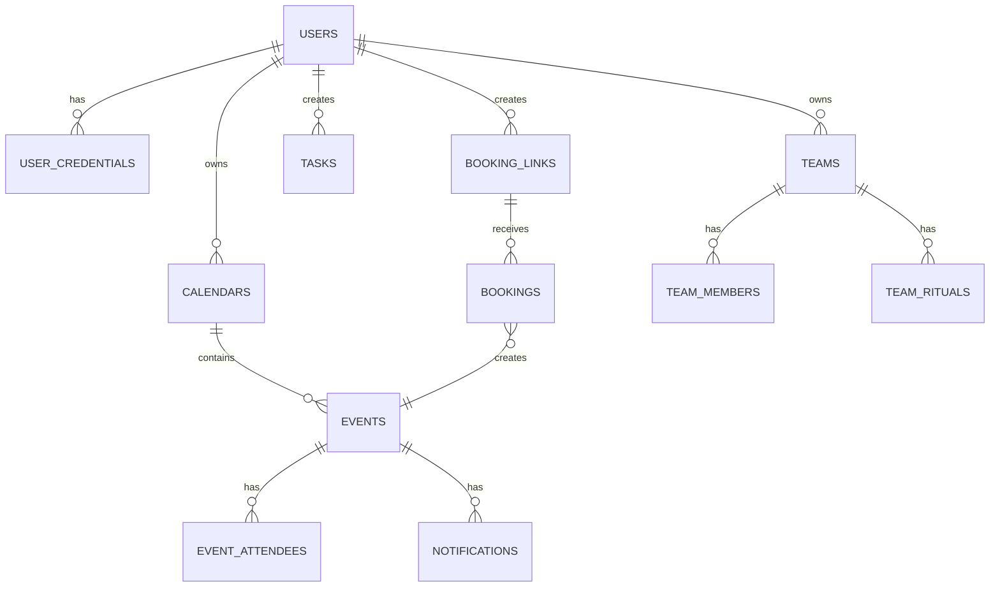

### 9.2 Complete Tables List (35 Tables)

| Module | Tables | Count |
|--------|--------|-------|
| **00_SETUP** | Extensions (`uuid-ossp`, `vector`), ENUMs, Functions | - |
| **01_AUTH** | `users`, `user_credentials`, `user_settings` | 3 |
| **02_CALENDAR** | `calendars`, `events`, `event_attendees`, `availabilities`, `event_conflicts` | 5 |
| **03_BOOKING** | `booking_links`, `bookings` | 2 |
| **04_TASKS** | `tasks`, `user_priorities` | 2 |
| **05_TEAMS** | `teams`, `team_members`, `team_rituals`, `team_availability`, `team_meeting_rotations` | 5 |
| **06_BLOG** | `blog_categories`, `blog_tags`, `blog_posts`, `blog_post_tags`, `blog_comments`, `blog_views` | 6 |
| **07_SYNC** | `sync_logs`, `sync_log`, `sync_errors`, `webhook_channels`, `integrations` | 5 |
| **08_NOTIFICATIONS** | `notifications`, `meeting_notes`, `email_logs` | 3 |
| **09_AI** | `ai_conversations`, `ai_actions` | 2 |
| **10_CONTACTS** | `contacts` | 1 |
| **11_CONTEXT** | `user_context_summary` | 1 |
| **12_HYBRID_SEARCH** | (extends `user_context_summary` with `text_search_vector`) | - |
| **TOTAL** | | **35 tables** |

---

### 9.3 AI & RAG Tables (Detailed Schema)

#### 9.3.1 ai_conversations

Stores AI conversation history for each user.

| Column | Type | Description |
|--------|------|-------------|
| `id` | UUID | Primary key |
| `user_id` | UUID | Foreign key to `users.id` |
| `messages` | JSONB | Array of conversation messages in chronological order |
| `context` | JSONB | Additional context (timezone, preferences, etc.) |
| `created_at` | TIMESTAMP | Creation timestamp |
| `updated_at` | TIMESTAMP | Last update timestamp |

**Indexes**:
- `idx_ai_conversations_user_id` on `user_id`
- `idx_ai_conversations_created_at` on `created_at DESC`

**Relationships**:
- `user_id` → `users.id` (ON DELETE CASCADE)
- Has many `ai_actions`

#### 9.3.2 ai_actions

Tracks AI function calls and their execution results.

| Column | Type | Description |
|--------|------|-------------|
| `id` | UUID | Primary key |
| `conversation_id` | UUID | Foreign key to `ai_conversations.id` |
| `action_type` | VARCHAR(100) | Tool name (e.g., "create_event") |
| `parameters` | JSONB | Tool parameters |
| `result` | JSONB | Execution result |
| `status` | VARCHAR(20) | Status: `pending`, `completed`, `failed` |
| `error` | TEXT | Error message (if failed) |
| `created_at` | TIMESTAMP | Creation timestamp |
| `updated_at` | TIMESTAMP | Last update timestamp |

**Indexes**:
- `idx_ai_actions_conversation_id` on `conversation_id`
- `idx_ai_actions_status` on `status`
- `idx_ai_actions_created_at` on `created_at DESC`

**Relationships**:
- `conversation_id` → `ai_conversations.id` (ON DELETE CASCADE)

#### 9.3.3 user_context_summary (RAG & Vector Store)

Stores user context information with vector embeddings for semantic search.

| Column | Type | Description |
|--------|------|-------------|
| `id` | UUID | Primary key |
| `user_id` | UUID | Foreign key to `users.id` |
| `context` | JSONB | Context data (events, tasks, preferences, etc.) |
| `embedding` | vector(1536) | Vector embedding (Google Generative AI) |
| `text_search_vector` | tsvector | Full-text search vector (auto-generated) |
| `created_at` | TIMESTAMP | Creation timestamp |
| `updated_at` | TIMESTAMP | Last update timestamp |

**Indexes**:
- `idx_user_context_summary_user_id` on `user_id`
- `idx_user_context_summary_created_at` on `created_at DESC`
- `idx_user_context_summary_embedding` HNSW index on `embedding` using `vector_cosine_ops`
- `idx_user_context_summary_text_search` GIN index on `text_search_vector`

**Special Features**:
- **pgvector extension**: Enables vector similarity search with HNSW index
- **Hybrid search**: Combines vector similarity + full-text search
- **Auto-trigger**: `text_search_vector` automatically updated from `context` JSONB
- **Embedding dimension**: 1536 (Google `text-embedding-004` model)

**Relationships**:
- `user_id` → `users.id` (ON DELETE CASCADE)

### 9.4 Enhanced ER Diagram (AI System)

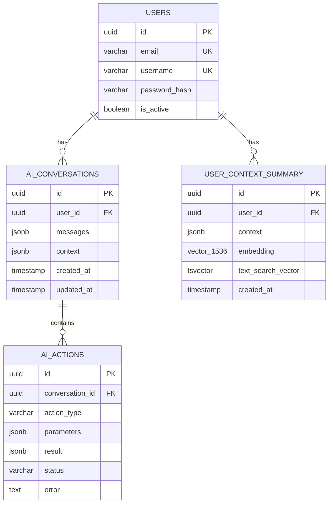

---

## 🔧 10. TECHNOLOGY STACK

### 10.1 Backend (Server)

| Technology | Usage |
|------------|-------|
| **NestJS** | Framework chính |
| **TypeScript** | Language |
| **PostgreSQL** | Primary database |
| **pgvector** | Vector embeddings extension |
| **Redis** | Caching & Sessions |
| **JWT** | Authentication |
| **Passport.js** | OAuth strategies |
| **BullMQ** | Job queues |
| **Swagger** | API documentation |
| **LangChain** | LLM orchestration framework |

### 10.2 Frontend (Client)

| Technology | Usage |
|------------|-------|
| **Next.js 14** | Framework (App Router) |
| **React 18** | UI Library |
| **TypeScript** | Language |
| **TailwindCSS** | Styling |
| **ShadcnUI** | Component library |
| **Zustand** | State management |
| **React Query** | Server state |
| **FullCalendar** | Calendar component |

### 10.3 External Services

| Service | Purpose |
|---------|---------|
| **Google Calendar API** | Calendar sync |
| **Google OAuth 2.0** | Authentication |
| **Google Gemini AI** | AI chat & function calling (gemini-1.5-pro) |
| **Google Generative AI Embeddings** | Vector embeddings (text-embedding-004, 1536D) |
| **Cloudinary** | Image hosting |
| **Email Service** | Transactional emails |

### 10.4 AI/RAG Stack

| Component | Technology | Description  |
|-----------|------------|-------------|
| **LLM** | Google Gemini 1.5 Pro | Main AI model for chat & function calling |
| **Embeddings** | Google text-embedding-004 | 1536-dimensional vector embeddings |
| **Vector DB** | PostgreSQL + pgvector | Vector storage with HNSW index |
| **Orchestration** | LangChain.js | Agent orchestration, tool binding |
| **RAG Pipeline** | Custom RagService | Query expansion, hybrid search, reranking |
| **Search** | Hybrid (Vector + FTS) | HNSW vector search + PostgreSQL tsvector |

---

## 📊 11. CLIENT COMPONENTS ARCHITECTURE

### 11.1 Component Structure

```
components/
├── analytics/           # Dashboard analytics charts
├── auth/               # Login, Register, Password reset
├── availability/       # Availability management
├── booking/            # Booking system components
├── calendar/           # Calendar views (Day, Week, Month)
├── dashboard/          # Dashboard layout, sidebar
├── invitation/         # Event invitation handling
├── priorities/         # Priority board (Kanban)
├── scheduling-links/   # Booking links management
├── task/               # Task management
├── team/               # Team collaboration
└── ui/                 # ShadcnUI components
```

### 11.2 Hook Architecture

```
hook/
├── ai/                 # AI chat hooks
├── auth/               # Authentication hooks
├── availability/       # Availability hooks
├── booking/            # Booking hooks
├── calendar/           # Calendar hooks
├── event/              # Event CRUD hooks
├── google/             # Google sync hooks
├── priority/           # Priority board hooks
├── task/               # Task management hooks
└── team/               # Team hooks
```

---

## 🚀 12. DEPLOYMENT

### 12.1 Development

```bash
# Start services
cd provision && docker-compose up -d

# Server
cd server && npm run dev

# Client  
cd client && npm run dev
```

### 12.2 Production

```bash
# Build
npm run build

# Deploy with Docker
docker-compose -f docker-compose.prod.yml up -d
```

### 12.3 Environment Variables

| Variable | Description |
|----------|-------------|
| `DB_HOST`, `DB_PORT`, `DB_USER`, `DB_PASSWORD` | PostgreSQL |
| `REDIS_HOST`, `REDIS_PORT`, `REDIS_PASSWORD` | Redis |
| `JWT_SECRET`, `JWT_REFRESH_SECRET` | JWT tokens |
| `GOOGLE_CLIENT_ID`, `GOOGLE_CLIENT_SECRET` | Google OAuth |
| `GEMINI_API_KEY` | Google Gemini AI |
| `CLOUDINARY_*` | Cloudinary config |
| `SMTP_*` | Email service |

---

## 📈 13. ROADMAP & FUTURE FEATURES

| Feature | Status | Priority |
|---------|--------|----------|
| ✅ Core Calendar | Completed | - |
| ✅ Google Sync | Completed | - |
| ✅ Booking System | Completed | - |
| ✅ AI Assistant | Completed | - |
| ✅ Team Collaboration | Completed | - |
| ✅ Blog System | Completed | - |
| 🔄 Outlook Integration | In Progress | High |
| 📋 Mobile App | Planned | High |
| 📋 Slack/Zoom Integration | Planned | Medium |
| 📋 Advanced Analytics | Planned | Medium |
| 📋 Multi-language Support | Planned | Low |

---

> **Document Version**: 2.0  
> **Last Updated**: 2026-01-04  
> **Prepared for**: Calento Progress Report - Enhanced AI & RAG Architecture
