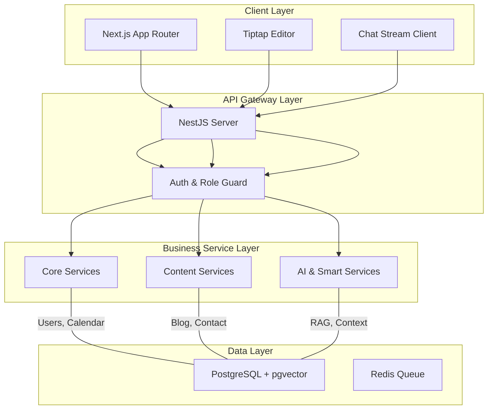

# **CHƯƠNG 3: PHÂN TÍCH VÀ THIẾT KẾ HỆ THỐNG**

## **3.1. Kiến trúc hệ thống**

Hệ thống Calento tuân thủ kiến trúc **Micro-modular Monolith**, giúp cân bằng giữa sự đơn giản của Monolith khi phát triển và khả năng tách module của Microservices khi mở rộng.

### **3.1.1. Sơ đồ kiến trúc tổng thể (Cập nhật)**

## **3.2. Mô tả các thành phần trong hệ thống**

Hệ thống được tổ chức thành 3 nhóm dịch vụ nghiệp vụ chính:

### **3.2.1. Core Operation Services**
Nhóm module vận hành cốt lõi, đảm bảo chức năng cơ bản của ứng dụng:
*   **Calendar Module:** Quản lý logic thời gian, xử lý xung đột lịch (Conflict Detection).
*   **Booking Module:** Tính toán `Available Slots` dựa trên lịch rảnh của user và settings của booking link.
*   **Sync Module:** Đồng bộ sự kiện từ Google Calendar thông qua cơ chế Push Notification (Webhooks) và Pull định kỳ.

### **3.2.2. Content & Growth Services (MỚI)**
Nhóm module phục vụ việc phát triển thương hiệu cá nhân của người dùng:
*   **Blog Module (CMS):** Cung cấp API cho việc tạo, chỉnh sửa bài viết Markdown. Quản lý metadata SEO (slug, description, tags).
*   **Contact Module:** Xử lý các form liên hệ từ trang public profile của người dùng, lưu trữ thông tin leads.

### **3.2.3. AI Intelligence Services**
Trái tim thông minh của hệ thống:
*   **RAG Module:** Orchestrator điều phối luồng dữ liệu giữa User query -> Vector Search -> LLM -> Response.
*   **Vector Service:** Wrapper cho `pgvector`, tối ưu hóa việc đánh index (IVFFlat) cho tốc độ tìm kiếm nhanh trên vector 768 chiều.

## **3.3. Thiết kế dữ liệu (Database Schema)**

Cơ sở dữ liệu PostgreSQL gồm **hơn 35 bảng**, được chuẩn hóa mức 3NF.

### **3.3.1. Nhóm bảng Content & CMS (MỚI)**
Phục vụ tính năng Blog và quản lý nội dung:

**Table: `blog_posts`**
*   `id`: UUID (PK)
*   `slug`: VARCHAR (Unique, Indexed) - Đường dẫn thân thiện SEO.
*   `title`, `content`: TEXT - Nội dung bài viết (Markdown).
*   `published_at`: TIMESTAMP - Thời gian xuất bản (Hỗ trợ lên lịch đăng bài).
*   `seo_metadata`: JSONB - Chứa meta title, description, keywords.

**Table: `contacts`**
*   `email`, `name`, `message`: Thôn tin người liên hệ.
*   `status`: ENUM ('new', 'read', 'replied').

### **3.3.2. Nhóm bảng AI & Context**

**Table: `user_context_summary`**
Bảng quan trọng nhất cho tính năng "Bộ nhớ AI":
*   `embedding`: **VECTOR(768)** - Chứa vector đại diện cho nội dung.
*   `text_search_vector`: **TSVECTOR** - Chứa token từ vựng phục vụ tìm kiếm từ khóa.
*   `metadata`: JSONB - Lưu nguồn gốc context (từ email, calendar, hay ghi chú thủ công).

### **3.3.3. Nhóm bảng Core (Event & Booking)**
*   **`events`**: Lưu trữ sự kiện lịch. Sử dụng cột `recurrence_rule` (TEXT) để lưu chuỗi RRULE chuẩn iCalendar cho sự kiện lặp lại.
*   **`availabilities`**: Lưu cấu hình giờ làm việc (Working hours) của user.
*   **`event_attendees`**: Tách riêng từ JSONB trước đây để dễ dàng query và join dữ liệu người tham dự.

## **3.4. Mô hình quan hệ (Key Relationships)**
*   **User --(1:n)--> BlogPosts:** Một user có thể viết nhiều bài blog.
*   **User --(1:n)--> ContextSummaries:** Một user có vector space riêng biệt (đảm bảo bảo mật dữ liệu AI).
*   **Calendar --(1:n)--> Events --(1:n)--> Attendees:** Cấu trúc phân cấp của dữ liệu lịch.
