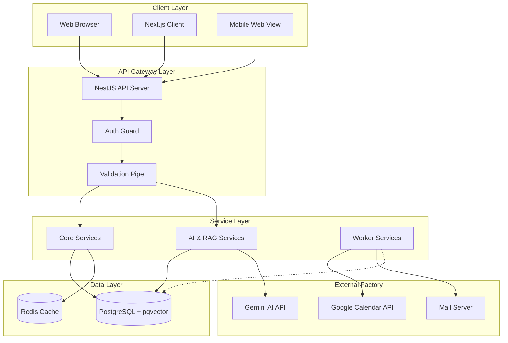

# **CHƯƠNG 3: PHÂN TÍCH VÀ THIẾT KẾ HỆ THỐNG**

## **3.1. Kiến trúc hệ thống**

Hệ thống Calento được thiết kế theo mô hình Micro-modular Monolith, chia tách rõ ràng giữa các tầng nhưng vẫn giữ được sự thống nhất trong triển khai.

### **3.1.1. Sơ đồ kiến trúc tổng thể**

## **3.2. Mô tả các thành phần trong hệ thống**

Hệ thống được chia thành các nhóm module chính sau:

### **3.2.1. Core Modules**
*   **Auth Module:** Xử lý đăng ký, đăng nhập, JWT management, Google OAuth strategy.
*   **User Module:** Quản lý thông tin người dùng, profile.
*   **Calendar & Event Module:** Core logic của hệ thống. Quản lý lịch, sự kiện, RRULE engine cho sự kiện lặp lại, đồng bộ dữ liệu.
*   **Booking Module:** Xử lý logic đặt lịch, tạo booking links, kiểm tra khung giờ rảnh (Availability checking).

### **3.2.2. AI & RAG Modules (Cập nhật mới)**
Đây là nhóm module mới được nâng cấp để hỗ trợ các tính năng thông minh:
*   **LLM Module:** Wrapper cho Google Gemini API, quản lý model config và prompts.
*   **Vector Module:**
    *   **VectorService:** Chịu trách nhiệm tương tác với `pgvector` trong PostgreSQL.
    *   **Functions:** `generateEmbedding` (tạo vector từ text), `searchSimilar` (tìm kiếm context tương đồng), `storeContext` (lưu trữ vector).
*   **RAG Module (Retrieval-Augmented Generation):**
    *   Kết hợp LLM và Vector Database.
    *   Khi user chat, module này sẽ tìm kiếm các ngữ cảnh liên quan (sự kiện quá khứ, ghi chú) từ Vector DB và gửi kèm vào prompt cho Gemini để câu trả lời chính xác hơn.

### **3.2.3. Worker & Infrastructure**
*   **Queue Module:** Cấu hình BullMQ.
*   **Email Module:** Worker xử lý việc gửi email notification bất đồng bộ.
*   **Sync Worker:** Worker chạy định kỳ để đồng bộ lịch từ Google Calendar về database nội bộ.

## **3.3. Thiết kế dữ liệu**

Cơ sở dữ liệu PostgreSQL được thiết kế chuẩn hóa và bổ sung khả năng lưu trữ Vector.

### **3.3.1. Schema cập nhật cho RAG**

Bên cạnh các bảng cơ bản như `users`, `events`, `calendars`, hệ thống bổ sung bảng phục vụ cho AI context.

**Table: `user_context_summary`**
Lưu trữ thông tin ngữ cảnh và vector embeddings của người dùng.

| Column | Type | Description |
| :--- | :--- | :--- |
| `id` | UUID (PK) | Unique Identifier |
| `user_id` | UUID (FK) | Liên kết với bảng Users |
| `context` | JSONB | Dữ liệu văn bản gốc hoặc metadata (VD: tóm tắt cuộc họp) |
| `embedding` | VECTOR(768) | **[MỚI]** Vector embedding 768 chiều (text-embedding-004) |
| `text_search_vector` | TSVECTOR | Hỗ trợ Full-text search cho tìm kiếm lai (Hybrid Search) |
| `created_at` | TIMESTAMP | Thời gian tạo |

*Ghi chú: Migration `z_fix-embedding-dimension.sql` đã cập nhật dimension từ 1536 xuống 768 để tối ưu và đồng bộ với model mới.*

### **3.3.2. Các bảng chính (Core Tables)**

**Table: `events`**
*   `id`: UUID
*   `title`: VARCHAR
*   `start_time`, `end_time`: TIMESTAMP
*   `recurrence_rule`: TEXT (Lưu chuỗi RRULE cho lịch lặp lại)
*   `description`: TEXT
*   `vector_id`: UUID (FK - Optional linkage to context)

**Table: `booking_links`**
*   `slug`: VARCHAR (Unique URL cho trang booking)
*   `availability_config`: JSONB (Cấu hình giờ rảnh chi tiết)

### **3.3.3. Mối quan hệ dữ liệu (ERD rút gọn)**

*   **1 User** có nhiều **Calendars**.
*   **1 Calendar** chứa nhiều **Events**.
*   **1 User** có nhiều **Context Summaries** (cho RAG).
*   **1 User** tạo nhiều **Booking Links**.
