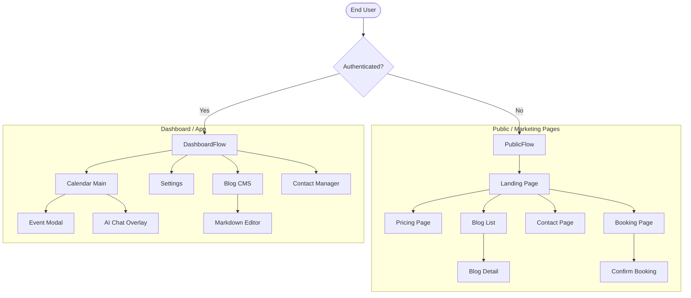

# **CHƯƠNG 4: THIẾT KẾ MÀN HÌNH**

## **4.1. Sơ đồ liên kết màn hình (Screen Flow)**

Luồng người dùng được chia thành 2 phân hệ rõ rệt: Dashboard (App) và Public Pages (Marketing).

## **4.2. Danh sách các màn hình chính**

### **4.2.1. Màn hình Dashboard (Trái tim của ứng dụng)**
Đây là nơi người dùng dành 80% thời gian sử dụng.
*   **Calendar View:**
    *   Hiển thị lịch dạng lưới (FullCalendar) với 4 chế độ: Ngày, Tuần, Tháng, Năm.
    *   Hỗ trợ Drag & Drop để dời lịch nhanh.
    *   Màu sắc sự kiện được mã hóa theo loại (Họp, Công việc, Cá nhân).
*   **Sidebar Navigation:** Menu điều hướng collapsible, tự động thu gọn trên Mobile.
*   **Quick Actions:** Nút Floating Action Button (+) để tạo sự kiện nhanh.

### **4.2.2. Màn hình AI Chatbot & RAG (Điểm nhấn)**
Giao diện không chỉ là Text Chat mà là "Interactive Canvas".
*   **Streaming UI:** Hiển thị từng từ (word-by-word) khi AI đang suy nghĩ, tạo cảm giác real-time.
*   **RAG Thinking Indicator:** Khi AI cần tra cứu ngữ cảnh, hiển thị badge *"Đang tìm kiếm trong ghi chú..."* hoặc *"Đang kiểm tra lịch tuần sau..."* để user hiểu hệ thống đang làm việc.
*   **Action Cards:**
    *   *Event Preview Card:* Hiển thị tóm tắt sự kiện trước khi tạo. Nút "Confirm" và "Edit" cho phép chốt lịch ngay trong khung chat.
    *   *Slot Suggestion Grid:* Hiển thị lưới các khung giờ rảnh khi user hỏi "Khi nào tôi rảnh?".

### **4.2.3. Phân hệ Blog & CMS (MỚI)**
Giao diện quản lý nội dung chuyên nghiệp cho người dùng.
*   **Màn hình Blog List (Admin):**
    *   Bảng danh sách bài viết với các cột: Tiêu đề, Trạng thái (Draft/Published), Lượt xem, Ngày đăng.
    *   Bộ lọc theo Category và Tag.
*   **Màn hình Editor (Soạn thảo):**
    *   Giao diện viết Markdown trực quan (WYSIWYG) sử dụng Tiptap.
    *   Thanh công cụ format nổi (Floating Menu).
    *   Panel bên phải để cài đặt SEO (Slug, Meta description, Featured Image).

### **4.2.4. Màn hình Public Pages (MỚI)**
Giao diện dành cho khách (Guest) truy cập profile của người dùng.
*   **Blog Public Page:** Thiết kế dạng lưới card hiện đại, tối ưu cho việc đọc (Typography focus).
*   **Contact Page:** Layout chia đôi: bên trái là thông tin liên hệ, bên phải là Form gửi tin nhắn với Validation real-time.
*   **Public Booking Page:** Giao diện tối giản, loại bỏ các yếu tố gây xao nhãng để tối ưu tỷ lệ chuyển đổi (Conversion rate). Chọn ngày -> Chọn giờ -> Điền tên -> Xong.

### **4.2.5. Màn hình Cài đặt (Settings)**
*   **Profile:** Cập nhật thông tin cá nhân.
*   **Integrations:** Quản lý kết nối Google Calendar (Connect/Disconnect button).
*   **AI Knowledge Base:** (Admin only) Giao diện xem và quản lý các "Context" đã được vector hóa. Cho phép xóa các ghi nhớ sai của AI.
