# **Chương III. PHÂN TÍCH VÀ THIẾT KẾ HỆ THỐNG** {#chương-iii.-phân-tích-và-thiết-kế-hệ-thống}

## **3.1. Danh sách các yêu cầu**

### **3.1.1. Yêu cầu nghiệp vụ (Business Requirements)**

Hệ thống Calento được xây dựng nhằm giải quyết các vấn đề quản lý thời gian trong bối cảnh hiện đại, với các yêu cầu nghiệp vụ chính được phân tích dựa trên nhu cầu thực tế của người dùng và xu hướng công nghệ.

#### **BR-01: Quản lý sự kiện và lịch trình cá nhân**

Hệ thống phải cho phép người dùng tạo, xem, sửa, xóa các sự kiện trong lịch cá nhân một cách linh hoạt. Mỗi sự kiện cần chứa đầy đủ thông tin bao gồm tiêu đề, thời gian bắt đầu/kết thúc, địa điểm, mô tả chi tiết, và danh sách người tham dự. Đặc biệt, hệ thống cần hỗ trợ các sự kiện lặp lại (recurring events) theo các pattern phức tạp như hàng ngày, hàng tuần, hàng tháng, hoặc theo quy tắc tùy chỉnh tuân theo chuẩn RRULE (RFC 5545).

Lịch cần được hiển thị ở nhiều chế độ xem khác nhau (ngày, tuần, tháng, năm) để phù hợp với nhu cầu khác nhau của người dùng. Tính năng kéo-thả (drag and drop) cần được tích hợp để người dùng có thể nhanh chóng thay đổi thời gian sự kiện mà không cần mở form chỉnh sửa. Hệ thống cũng phải hỗ trợ nhiều múi giờ (timezone) khác nhau, đặc biệt quan trọng cho người dùng làm việc quốc tế hoặc thường xuyên di chuyển giữa các khu vực địa lý.

#### **BR-02: Đồng bộ hóa với Google Calendar**

Do Google Calendar là dịch vụ lịch phổ biến nhất hiện nay với hơn 500 triệu người dùng, việc tích hợp đồng bộ là yêu cầu thiết yếu. Hệ thống phải thực hiện đồng bộ hai chiều (bi-directional sync): pull events từ Google Calendar về Calento và push các sự kiện được tạo trong Calento lên Google Calendar. Điều này đảm bảo người dùng có thể quản lý lịch từ bất kỳ nền tảng nào (Calento, Google Calendar mobile app, hoặc các ứng dụng khác tích hợp Google Calendar) và dữ liệu luôn được đồng nhất.

Quá trình đồng bộ cần được tự động hóa hoàn toàn thông qua background jobs, chạy định kỳ mà không làm gián đoạn trải nghiệm người dùng. Hệ thống phải có khả năng phát hiện và giải quyết conflicts (xung đột) khi cùng một sự kiện bị chỉnh sửa ở cả hai phía, cung cấp cho người dùng các tùy chọn resolution như ưu tiên phía Google, ưu tiên phía Calento, hoặc giữ cả hai phiên bản.

#### **BR-03: Hệ thống đặt lịch hẹn công khai (Booking System)**

Hệ thống cần cung cấp tính năng cho phép người dùng tạo các "booking links" - những trang đặt lịch công khai tương tự như Calendly hoặc Cal.com. Mỗi user có thể tạo nhiều booking links với các cấu hình khác nhau, phục vụ cho các mục đích khác nhau (ví dụ: "30-minute Meeting", "1-hour Consulting", "Quick Call").

Mỗi booking link cần cho phép cấu hình chi tiết bao gồm: thời lượng cuộc hẹn (duration), thời gian đệm trước và sau (buffer time), thời gian thông báo tối thiểu (advance notice), số lượng booking tối đa mỗi ngày, và múi giờ mặc định. Hệ thống phải tự động tính toán các khung giờ rảnh (available slots) dựa trên lịch availability đã được user thiết lập và các sự kiện hiện có, đảm bảo không có conflict.

Khi khách (guest) đặt lịch thành công, hệ thống cần tự động tạo sự kiện cho cả host và guest, gửi email xác nhận cho cả hai bên với thông tin đầy đủ (thời gian, địa điểm, link tham gia nếu là online meeting), và tùy chọn tự động đồng bộ lên Google Calendar của host.

#### **BR-04: Trợ lý ảo AI thông minh (AI Assistant)**

Đây là tính năng khác biệt hóa chính của Calento so với các ứng dụng lịch truyền thống. Hệ thống cần tích hợp một AI assistant có khả năng hiểu ngôn ngữ tự nhiên (tiếng Việt và tiếng Anh), cho phép người dùng tương tác bằng cách chat thay vì phải điền form hoặc nhấn nhiều nút.

AI assistant cần có khả năng thực hiện các tác vụ sau qua lệnh chat: (1) Truy vấn lịch trình - "Tôi có bận vào thứ 5 không?", "Cuộc họp tiếp theo của tôi là gì?"; (2) Tạo sự kiện mới - "Đặt lịch họp team vào 9h sáng thứ 2"; (3) Tìm khung giờ rảnh - "Khi nào tôi rảnh để gặp khách hàng?"; (4) Tóm tắt lịch trình - "Tóm tắt lịch tuần sau cho tôi".

Để đạt được độ chính xác cao, hệ thống cần triển khai RAG (Retrieval-Augmented Generation) pattern. Khi nhận câu hỏi từ user, AI sẽ: (1) Chuyển đổi câu hỏi thành vector embedding 768 chiều, (2) Tìm kiếm các sự kiện và ngữ cảnh liên quan trong database sử dụng pgvector với cosine similarity, (3) Đưa context này vào prompt gửi cho LLM model (Google Gemini), (4) LLM sinh ra câu trả lời dựa trên context cụ thể của user thay vì general knowledge.

AI cũng cần hỗ trợ function calling, nghĩa là có thể tự động xác định khi nào cần gọi các function nghiệp vụ (như createEvent, findAvailableSlots) và thực thi chúng sau khi confirm với user.

#### **BR-05: Quản lý công việc với hệ thống ưu tiên (Task Management)**

Ngoài sự kiện, người dùng cần quản lý các công việc (tasks) - những việc cần làm nhưng chưa có thời gian cụ thể hoặc deadline linh hoạt. Hệ thống cần cung cấp một priority board với 4 cấp độ ưu tiên: Critical (khẩn cấp phải làm ngay), High (quan trọng), Medium (trung bình), và Low (có thể làm sau).

Tasks cần hỗ trợ đầy đủ các thuộc tính như title, description, due date, tags, project/category, và quan hệ phân cấp (subtasks). Giao diện priority board phải có tính năng drag-and-drop để người dùng dễ dàng thay đổi mức độ ưu tiên hoặc thứ tự trong cùng một column. Hệ thống cũng cần hỗ trợ recurring tasks cho các công việc lặp lại định kỳ.

Một tính năng quan trọng là khả năng chuyển đổi task thành event và ngược lại. Ví dụ, khi user quyết định thời gian cụ thể để làm một task, họ có thể convert task đó thành event trên calendar để block time.

#### **BR-06: Cộng tác nhóm (Team Collaboration)**

Đối với các nhóm làm việc (team), hệ thống cần cung cấp không gian chia sẻ lịch. Mỗi team owner có thể tạo team, mời members (tối đa 5 người trong phiên bản hiện tại), và quản lý quyền truy cập. Team calendar cho phép tất cả members xem sự kiện chung, tránh việc book meeting vào thời gian conflict.

Tính năng Team Rituals đặc biệt hữu ích cho các cuộc họp định kỳ như Daily Standup, Weekly Planning, hoặc Monthly Review. Owner có thể setup ritual với recurrence rule và rotation schedule - ai sẽ là người lead/present trong mỗi lần meeting. Hệ thống tự động tạo events cho các instances của ritual và assign đúng người theo rotation order.

Team availability dashboard cho phép members xem được khung giờ rảnh của nhau, giúp việc sắp xếp meeting chung trở nên dễ dàng hơn mà không cần trao đổi qua lại nhiều lần.

#### **BR-07: Hệ thống thông báo đa kênh (Multi-channel Notifications)**

Để đảm bảo người dùng không bỏ lỡ sự kiện quan trọng, hệ thống cần gửi thông báo nhắc nhở qua nhiều kênh khác nhau. Email notification là kênh chính, được gửi tự động cho các sự kiện: (1) Xác nhận khi tạo/cập nhật sự kiện, (2) Nhắc nhở trước sự kiện (15 phút, 1 giờ, 1 ngày tùy theo cài đặt), (3) Thông báo khi có người RSVP lời mời, (4) Thông báo booking mới từ booking link.

Hệ thống cũng cần hỗ trợ webhook để tích hợp với các dịch vụ bên thứ ba như Slack, Telegram, hoặc Zapier. User có thể configure webhook URLs và chọn events nào sẽ trigger webhook. Trong tương lai, push notifications cho mobile app và SMS notifications cũng sẽ được bổ sung.

#### **BR-08: Content Management System (Blog CMS)**

Để xây dựng cộng đồng và chia sẻ kiến thức về quản lý thời gian, hệ thống cần có một blog platform tích hợp. Admin/content manager có thể tạo bài viết với rich text editor (hỗ trợ markdown, images, code blocks), phân loại theo categories, gắn tags, và schedule publish time.

Blog cần được tối ưu cho SEO với các features: custom meta title/description, friendly URLs (slugs), sitemap.xml tự động, và schema markup. Hệ thống comments cho phép readers tương tác, nhưng cần có moderation tools để admin kiểm duyệt trước khi publish. Analytics tracking giúp admin theo dõi views, popular posts, và engagement metrics.

### **3.1.2. Yêu cầu chức năng chi tiết (Functional Requirements)**

Dựa trên các yêu cầu nghiệp vụ trên, hệ thống được phân tích thành các yêu cầu chức năng cụ thể theo từng module:

| ID | Module | Chức năng | Độ ưu tiên | Trạng thái |
|----|--------|-----------|------------|------------|
| FR-01 | Auth | Đăng ký tài khoản với email/password | High | ✅ Completed |
| FR-02 | Auth | Đăng nhập với Google OAuth 2.0 | High | ✅ Completed |
| FR-03 | Auth | Reset password qua email | Medium | ✅ Completed |
| FR-04 | Auth | JWT token authentication | High | ✅ Completed |
| FR-05 | Calendar | Tạo/sửa/xóa event cơ bản | High | ✅ Completed |
| FR-06 | Calendar | View calendar (day/week/month) | High | ✅ Completed |
| FR-07 | Calendar | Recurring events (RRULE) | High | ✅ Completed |
| FR-08 | Calendar | Drag & drop events | Medium | ✅ Completed |
| FR-09 | Event | Mời attendees qua email | High | ✅ Completed |
| FR-10 | Event | RSVP invitations | Medium | ✅ Completed |
| FR-11 | Event | Event reminders | Medium | ✅ Completed |
| FR-12 | Google | OAuth connection | High | ✅ Completed |
| FR-13 | Google | Pull events from Google | High | ✅ Completed |
| FR-14 | Google | Push events to Google | High | ✅ Completed |
| FR-15 | Google | Conflict detection & resolution | Medium | ✅ Completed |
| FR-16 | Booking | Create booking links | High | ✅ Completed |
| FR-17 | Booking | Public booking page | High | ✅ Completed |
| FR-18 | Booking | Availability calculation | High | ✅ Completed |
| FR-19 | Booking | Email confirmations | High | ✅ Completed |
| FR-20 | Booking | Cancel/reschedule booking | Medium | ✅ Completed |
| FR-21 | Task | Create/edit/delete tasks | High | ✅ Completed |
| FR-22 | Task | Priority levels (4 levels) | High | ✅ Completed |
| FR-23 | Task | Drag & drop priority board | Medium | ✅ Completed |
| FR-24 | Task | Recurring tasks | Low | ✅ Completed |
| FR-25 | AI | Chat interface | High | ✅ Completed |
| FR-26 | AI | Semantic event search (RAG) | High | ✅ Completed |
| FR-27 | AI | Function calling (create/find) | Medium | ✅ Completed |
| FR-28 | AI | Streaming responses | Medium | ✅ Completed |
| FR-29 | Team | Create/manage team | Medium | ✅ Completed |
| FR-30 | Team | Invite team members | Medium | ✅ Completed |
| FR-31 | Team | Team rituals with rotation | Low | ✅ Completed |
| FR-32 | Team | Team availability view | Low | ✅ Completed |
| FR-33 | Blog | Create/edit blog posts | Medium | ✅ Completed |
| FR-34 | Blog | Categories & tags | Medium | ✅ Completed |
| FR-35 | Blog | Comments moderation | Low | ✅ Completed |
| FR-36 | Blog | SEO optimization | Medium | ✅ Completed |
| FR-37 | Email | Send transactional emails | High | ✅ Completed |
| FR-38 | Email | Email templates (Handlebars) | Medium | ✅ Completed |
| FR-39 | Webhook | Configure webhook URLs | Low | ✅ Completed |
| FR-40 | Analytics | Track user activities | Low | ✅ Completed |

## **3.2. Kiến trúc hệ thống**

Hệ thống Calento được thiết kế theo mô hình Micro-modular Monolith, chia tách rõ ràng giữa các tầng nhưng vẫn giữ được sự thống nhất trong triển khai.

## **3.1.1. Sơ đồ kiến trúc tổng thể**

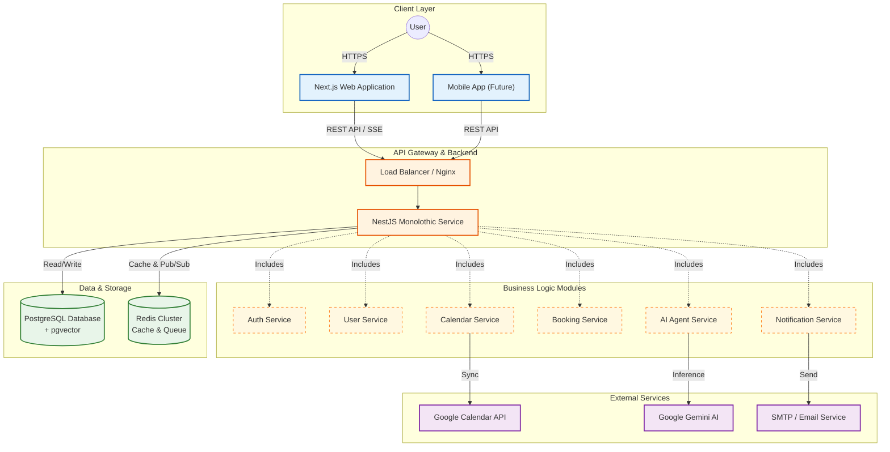

##### Hình 8: Kiến trúc tổng thể  {#hình-8:-kiến-trúc-tổng-thể}

## **3.2. Phân tích yêu cầu và Use Case**

### **3.2.1. Xác định Actors (Tác nhân)**

Hệ thống Calento phục vụ các actors sau:

| Actor | Mô tả | Quyền hạn |
|-------|-------|-----------|
| **Guest (Khách)** | Người dùng chưa đăng ký | Xem landing page, đặt lịch qua booking link public, đọc blog |
| **Registered User** | Người dùng đã đăng ký và đăng nhập | Quản lý lịch cá nhân, sự kiện, tasks, booking links, chat AI |
| **Team Member** | User thuộc một team | Xem lịch team, tham gia team rituals, view team availability |
| **Team Owner** | User tạo và sở hữu team | Quản lý team members, tạo team rituals, settings |
| **Admin/Content Manager** | Quản trị viên hệ thống | Quản lý blog posts, categories, user management, analytics |
| **Google Calendar API** | External system | Đồng bộ events qua OAuth 2.0 |
| **Gemini AI** | External AI service | Xử lý chat queries, function calling |

### **3.2.2. Sơ đồ Use Case tổng quan**

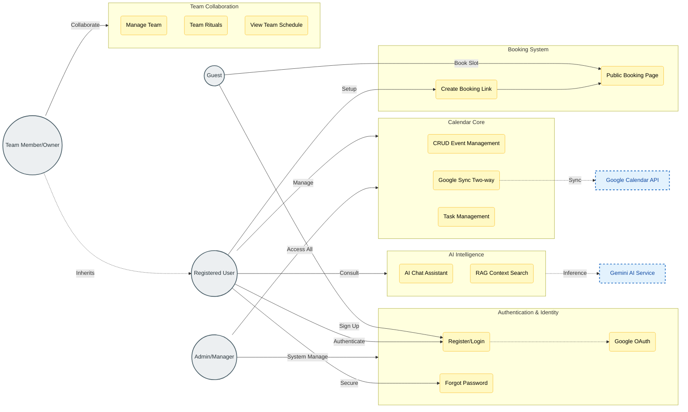

##### Hình 9: Sơ đồ Use Case tổng quan
{#hình-9:-sơ-đồ-use-case-tổng-quan}

**Mô tả các Actor:**
*   **Guest**: Người dùng vãng lai, có thể xem trang public và đặt lịch.
*   **Registered User**: Người dùng chính, sử dụng toàn bộ tính năng cá nhân.
*   **Team Member/Owner**: Người dùng tham gia vào các tính năng cộng tác nhóm.

### **3.2.3. Đặc tả Use Case chi tiết**

#### **UC-01: Đăng ký tài khoản (Register)**

| Thuộc tính | Nội dung |
|------------|----------|
| **Use Case ID** | UC-01 |
| **Tên** | Đăng ký tài khoản |
| **Actor** | Guest |
| **Mô tả** | Người dùng tạo tài khoản mới để sử dụng hệ thống |
| **Tiền điều kiện** | User chưa có tài khoản |
| **Hậu điều kiện** | User được tạo trong DB, có thể đăng nhập |
| **Luồng chính** | 1. User truy cập trang /auth/register<br>2. Nhập: email, username, password, confirm password<br>3. Hệ thống validate:<br>   - Email unique & format correct<br>   - Username unique (3-20 ký tự)<br>   - Password >= 8 ký tự, có chữ hoa, số<br>4. Hash password với bcrypt<br>5. Tạo user record (is_verified = false)<br>6. Gửi verification email<br>7. Redirect đến /dashboard |
| **Luồng thay thế** | **3a. Validation failed:**<br>   - Hiển thị error message cụ thể<br>   - User sửa và submit lại<br>**6a. Email gửi thất bại:**<br>   - Log error, user vẫn được tạo<br>   - User có thể resend verification sau |
| **Business Rules** | - Email phải unique trong hệ thống<br>- Username không chứa ký tự đặc biệt<br>- Mật khẩu phải đủ mạnh (entropy check) |

#### **UC-02: Đồng bộ Google Calendar**

| Thuộc tính | Nội dung |
|------------|----------|
| **Use Case ID** | UC-02 |
| **Tên** | Đồng bộ hai chiều với Google Calendar |
| **Actor** | Registered User, Google Calendar API |
| **Mô tả** | Tự động pull events từ Google và push local events lên Google |
| **Tiền điều kiện** | User đã kết nối Google account (OAuth) |
| **Hậu điều kiện** | Events được đồng bộ giữa Calento và Google Calendar |
| **Luồng chính** | **PULL (Google → Calento):**<br>1. Background job chạy mỗi 5 phút<br>2. Lấy access_token từ user_credentials<br>3. Gọi Google Calendar API: events.list()<br>4. So sánh với DB:<br>   - Dựa vào google_event_id, updated timestamp<br>5. Phát hiện changes:<br>   - New: Insert vào events table<br>   - Updated: Update existing event<br>   - Deleted: Soft delete hoặc mark cancelled<br>6. Detect conflicts (same time, different data)<br>7. Lưu conflicts vào event_conflicts table<br><br>**PUSH (Calento → Google):**<br>8. Tìm events có google_event_id = NULL<br>9. Gọi Google Calendar API: events.insert()<br>10. Lưu google_event_id vào DB |
| **Luồng thay thế** | **3a. Token expired:**<br>   - Refresh token tự động<br>   - Retry request<br>**3b. API rate limit:**<br>   - Exponential backoff<br>   - Retry sau 1-5-10 phút<br>**6a. Conflict detected:**<br>   - User nhận notification<br>   - User chọn resolution strategy |
| **Business Rules** | - Events recurring: Expand instances trước khi so sánh<br>- Chỉ sync calendars có sync_enabled = true<br>- Conflict priority: Manual user input > Auto sync |

#### **UC-03: Tạo Booking Link**

| Thuộc tính | Nội dung |
|------------|----------|
| **Use Case ID** | UC-03 |
| **Tên** | Tạo trang đặt lịch công khai |
| **Actor** | Registered User |
| **Mô tả** | User tạo booking link để người khác đặt lịch với mình |
| **Tiền điều kiện** | User đã đăng nhập, đã set availability |
| **Hậu điều kiện** | Booking link được tạo, public URL có thể share |
| **Luồng chính** | 1. User vào /dashboard/booking<br>2. Click "New Booking Link"<br>3. Nhập thông tin:<br>   - Title (VD: "30min Meeting")<br>   - Slug (unique, VD: "meeting-30min")<br>   - Duration (minutes)<br>   - Buffer time (trước/sau)<br>   - Advance notice (hours)<br>   - Max bookings per day<br>   - Location (Tùy chọn: Google Meet, Phone, In-person, Custom)<br>4. Validate:<br>   - Slug chưa tồn tại cho user này<br>   - Duration > 0<br>5. Tạo booking_link record<br>6. Generate public URL: calento.space/book/username/slug<br>7. Hiển thị preview và share options |
| **Luồng thay thế** | **4a. Slug đã tồn tại:**<br>   - Suggest alternative (append số)<br>**4b. User chưa set availability:**<br>   - Prompt user set availability trước |
| **Business Rules** | - 1 user có thể tạo nhiều booking links<br>- Slug unique per user (không global)<br>- Buffer time không tính vào duration |

#### **UC-04: Đặt lịch qua Booking Link (Public)**

| Thuộc tính | Nội dung |
|------------|----------|
| **Use Case ID** | UC-04 |
| **Tên** | Guest đặt lịch hẹn |
| **Actor** | Guest |
| **Mô tả** | Người ngoài đặt lịch với user qua public booking link |
| **Tiền điều kiện** | Booking link active, user đã set availability |
| **Hậu điều kiện** | Booking created, event created, emails sent |
| **Luồng chính** | 1. Guest truy cập: /book/username/slug<br>2. Hệ thống load booking link config<br>3. Query availability của user:<br>   - Lấy availabilities (weekly schedule)<br>   - Lấy existing events<br>   - Calculate available slots (next 60 days)<br>4. Hiển thị calendar với slots màu xanh<br>5. Guest chọn slot<br>6. Popup form: Name, Email, Phone, Notes<br>7. Guest submit<br>8. Validate:<br>   - Slot vẫn available (double-check)<br>   - Email format correct<br>   - Không vượt max_bookings/day<br>9. Transaction:<br>   - Tạo booking record<br>   - Tạo event cho user<br>   - Link booking.event_id = event.id<br>10. Send emails:<br>    - Confirmation to guest<br>    - Notification to host<br>11. [Optional] Push event to Google Calendar |
| **Luồng thay thế** | **8a. Slot đã bị book:**<br>   - Show error "Đã có người đặt"<br>   - Refresh calendar<br>**8b. Vượt max bookings:**<br>   - "Đã hết slot cho ngày này"<br>**10a. Email failed:**<br>   - Log error, queue retry<br>   - Booking vẫn được tạo |
| **Business Rules** | - Check advance_notice: Không cho book slot < X giờ<br>- Apply buffer_time khi tính slots<br>- Timezone: Hiển thị theo timezone của guest (auto-detect) |

#### **UC-05: Chat với AI Assistant (RAG)**

| Thuộc tính | Nội dung |
|------------|----------|
| **Use Case ID** | UC-05 |
| **Tên** | Tương tác với AI Assistant |
| **Actor** | Registered User, Gemini AI |
| **Mô tả** | User chat với AI để query lịch, tạo event, tìm slot rảnh |
| **Tiền điều kiện** | User đã đăng nhập |
| **Hậu điều kiện** | User nhận response từ AI, action được thực thi (nếu có) |
| **Luồng chính** | 1. User mở AI chat panel<br>2. Nhập câu hỏi (VD: "Tôi có bận vào thứ 5?")<br>3. Frontend gửi POST /api/v1/ai/chat<br>4. Backend - RAG Service:<br>   - Generate embedding cho câu hỏi (768-dim vector)<br>   - Vector search trong events table (pgvector)<br>   - Lấy top 5 relevant events (cosine similarity > 0.7)<br>5. Backend - LLM Service:<br>   - Construct prompt:<br>     * System: "Bạn là AI assistant..."<br>     * Context: JSON của 5 events<br>     * User question<br>   - Gọi Gemini API (streaming)<br>   - Parse response<br>6. [Optional] Function Calling:<br>   - AI return function: createEvent / findSlots<br>   - Execute function<br>   - Return result to AI<br>7. Stream response qua SSE về frontend<br>8. Frontend render markdown real-time |
| **Luồng thay thế** | **4a. Không tìm thấy relevant events:**<br>   - Context = empty<br>   - AI answer dựa vào general knowledge<br>**5a. Gemini API error:**<br>   - Fallback: "Xin lỗi, AI tạm thời không khả dụng"<br>**6a. Function execution failed:**<br>   - Return error to AI<br>   - AI explain lỗi cho user |
| **Business Rules** | - Chỉ search events của chính user (privacy)<br>- Vector search timeout: 3s max<br>- Function calling: Phải confirm với user trước khi execute |

#### **UC-06: Tạo Sự kiện (Create Event)**

| Thuộc tính | Nội dung |
|------------|----------|
| **Use Case ID** | UC-06 |
| **Tên** | Tạo sự kiện mới |
| **Actor** | Registered User |
| **Mô tả** | User tạo một sự kiện mới trên lịch, có thể mời người tham gia và đồng bộ với Google Calendar |
| **Tiền điều kiện** | User đã đăng nhập |
| **Hậu điều kiện** | Event được lưu vào DB, synced to Google (nếu linked), stored in Vector DB, invitations sent |
| **Luồng chính** | 1. User click nút "Create Event" hoặc click vào calendar grid<br>2. Nhập thông tin sự kiện:<br>   - Title, Description<br>   - Start Time, End Time<br>   - Location<br>   - Attendees (email list)<br>   - Color, Recurring rules (optional)<br>3. User click "Save"<br>4. Backend validate input (time range, email format)<br>5. Transaction:<br>   - Create Event record<br>   - Sync to Google Calendar (Use Case: Google Sync)<br>   - Generate embedding & Sync to Vector Database<br>   - Send Invitation Emails to attendees<br>6. Trả về thông tin event mới tạo<br>7. Frontend hiển thị event trên calendar grid |
| **Luồng thay thế** | **5a. Google Sync failed:**<br>   - Log warning, event vẫn tạo local<br>   - Flag `syncedToGoogle = false`<br>**5b. Invalid Attendees:**<br>   - Filter invalid emails<br>   - User notified about skipped emails |
| **Business Rules** | - Start Time < End Time<br>- Nếu chọn recurring, generate rule theo RFC 5545<br>- Vector embedding text format: "Title. When: Time. Where: Location. Desc: Description" |

#### **UC-07: Quản lý Công việc (Manage Tasks)**

| Thuộc tính | Nội dung |
|------------|----------|
| **Use Case ID** | UC-07 |
| **Tên** | Quản lý công việc (Tasks) |
| **Actor** | Registered User |
| **Mô tả** | User tạo, cập nhật trạng thái, và xóa các công việc cần làm |
| **Tiền điều kiện** | User đã đăng nhập |
| **Hậu điều kiện** | Task DB updated |
| **Luồng chính** | 1. User truy cập Task Dashboard<br>2. User thực hiện action:<br>   - **Create**: Nhập title, priority (Low/Medium/High/Critical), due_date. System create task with status TODO.<br>   - **Update Status**: Kéo thả task giữa các columns (Todo -> In Progress -> Done). System update status & completed_at.<br>   - **Edit**: Sửa title, description, tags.<br>   - **Delete**: Soft delete task.<br>3. Backend validate & execute update<br>4. Return updated task object |
| **Luồng thay thế** | **2a. Validation Fail:**<br>   - Title is required<br>   - Due date must be valid date |
| **Business Rules** | - Task đã complete tự động set `completed_at`<br>- Soft delete cho phép restore trong 30 ngày<br>- Priority defaults to MEDIUM |

#### **UC-08: Tạo Nhóm (Create Team)**

| Thuộc tính | Nội dung |
|------------|----------|
| **Use Case ID** | UC-08 |
| **Tên** | Tạo nhóm làm việc mới |
| **Actor** | Registered User (Team Owner) |
| **Mô tả** | User tạo một không gian làm việc chung (Team) |
| **Tiền điều kiện** | User đã đăng nhập |
| **Hậu điều kiện** | Team created, User becomes Owner |
| **Luồng chính** | 1. User truy cập Team section -> Click "Create Team"<br>2. Nhập: Team Name, Description<br>3. Submit<br>4. Backend:<br>   - Create Team record<br>   - Add User to Team_Members with role OWNER, status ACTIVE<br>5. Redirect user đến Team Dashboard |
| **Luồng thay thế** | **2a. Name conflict:**<br>   - Cho phép trùng tên, unique ID handle phân biệt |
| **Business Rules** | - User trở thành Owner mặc định<br>- Limits: User Free plan chỉ được tạo 1 team |

#### **UC-09: Mời thành viên (Invite Team Member)**

| Thuộc tính | Nội dung |
|------------|----------|
| **Use Case ID** | UC-09 |
| **Tên** | Mời thành viên vào nhóm |
| **Actor** | Team Owner / Admin |
| **Mô tả** | Gửi lời mời gia nhập nhóm qua email |
| **Tiền điều kiện** | User là Owner hoặc Admin của team |
| **Hậu điều kiện** | Member created (PENDING), Email sent |
| **Luồng chính** | 1. Admin vào "Team Members" -> Click "Invite"<br>2. Nhập email người được mời và role (Member/Admin)<br>3. Backend check:<br>   - User exists in system (by email)<br>   - User chưa phải là member của team<br>   - Team chưa đạt limit members<br>4. Create Team_Member record (status = PENDING)<br>5. Gửi email invitation chứa accept link<br>6. Notify success |
| **Luồng thay thế** | **3a. User not found:**<br>   - Return error "User chưa đăng ký Calento"<br>**3b. Already member:**<br>   - Return error "User đã trong team"<br>**3c. Limit reached:**<br>   - Error "Team đã đầy" |
| **Business Rules** | - Không thể mời trực tiếp Owner của team khác (phải user tự leave)<br>- Invite expires sau 7 ngày (tùy config) |

#### **UC-10: Xem Lịch Nhóm (View Team Calendar)**

| Thuộc tính | Nội dung |
|------------|----------|
| **Use Case ID** | UC-10 |
| **Tên** | Xem lịch rảnh bận của nhóm (Heatmap) |
| **Actor** | Team Member |
| **Mô tả** | Xem biểu đồ nhiệt (heatmap) hiển thị mức độ rảnh rỗi của toàn team |
| **Tiền điều kiện** | User là thành viên của team |
| **Hậu điều kiện** | Hiển thị availability grid |
| **Luồng chính** | 1. User truy cập Team Calendar view<br>2. Chọn Time Range (Tuần này/Tuần sau)<br>3. Backend `generateHeatmap`:<br>   - Iterate qua từng time slot (30 mins)<br>   - Với mỗi slot, check calendar của tất cả members<br>   - Calculate availability % (VD: 3/5 người rảnh = 60%)<br>4. Trả về JSON slots với percentage<br>5. Frontend render heatmap (Xanh đậm = Rảnh nhiều, Xanh nhạt = Bận nhiều) |
| **Luồng thay thế** | **3a. Member sync error:**<br>   - Bỏ qua member đó hoặc show warning |
| **Business Rules** | - Chỉ show thông tin Free/Busy, không show chi tiết event content (Privacy)<br>- Resolve timezone về timezone của người xem |

#### **UC-11: Tạo Bài viết (Create Blog Post)**

| Thuộc tính | Nội dung |
|------------|----------|
| **Use Case ID** | UC-11 |
| **Tên** | Viết bài blog mới |
| **Actor** | Admin / Content Manager |
| **Mô tả** | Tạo nội dung bài viết chia sẻ kiến thức |
| **Tiền điều kiện** | User có quyền Admin |
| **Hậu điều kiện** | Blog post created (Draft/Published) |
| **Luồng chính** | 1. User truy cập CMS -> Create Post<br>2. Nhập: Title, Slug, Content (Markdown), Excerpt, Category, Featured Image<br>3. Set SEO meta: Title, Description, Keywords<br>4. Chọn Status: Draft hoặc Published<br>5. Submit<br>6. Backend:<br>   - Calculate reading time<br>   - Save to DB<br>7. Return success |
| **Luồng thay thế** | **2a. Slug duplicate:**<br>   - Auto append suffix hoặc báo lỗi |
| **Business Rules** | - Slug phải unique<br>- Calculating reading time: 200 words/minute |

#### **UC-12: Kiểm duyệt Bình luận (Moderate Comments)**

| Thuộc tính | Nội dung |
|------------|----------|
| **Use Case ID** | UC-12 |
| **Tên** | Kiểm duyệt bình luận |
| **Actor** | Admin |
| **Mô tả** | Duyệt hoặc xóa các bình luận trên blog post |
| **Tiền điều kiện** | User là Admin |
| **Hậu điều kiện** | Comment status updated (Approved/Spam/Deleted) |
| **Luồng chính** | 1. User truy cập Comment Moderation Dashboard<br>2. System load list comments với status PENDING<br>3. Admin review content<br>4. Admin action:<br>   - **Approve**: Comment visible public<br>   - **Mark Spam**: Hide & flag user<br>   - **Delete**: Remove from DB<br>5. Backend update status<br>6. UI refresh list |
| **Luồng thay thế** | **2a. No pending comments:**<br>   - Show empty state "All caught up" |
| **Business Rules** | - Auto-filter bad words trước khi vào PENDING (Future)<br>- Admin actions are logged |

#### **UC-13: Xem Báo cáo Thống kê (View Analytics)**

| Thuộc tính | Nội dung |
|------------|----------|
| **Use Case ID** | UC-13 |
| **Tên** | Xem báo cáo hoạt động cá nhân |
| **Actor** | Registered User |
| **Mô tả** | Xem thống kê về sử dụng thời gian: số meeting, phân bổ thời gian |
| **Tiền điều kiện** | User đã đăng nhập |
| **Hậu điều kiện** | Charts & metrics hiển thị |
| **Luồng chính** | 1. User vào Analytics tab<br>2. Chọn Date Range<br>3. Backend aggregate metrics:<br>   - **Event Analytics**: Tổng số sự kiện, thời gian họp trung bình<br>   - **Time Utilization**: Tổng giờ họp vs Giờ rảnh<br>   - **Category Distribution**: Top categories (Họp, Deep work...)<br>   - **Time Distribution**: Phân bổ theo ngày/tuần<br>4. Return JSON analytics data<br>5. Frontend visualize bằng charts (Bar, Pie, Line) |
| **Luồng thay thế** | **3a. No data:**<br>   - Show empty state với suggestion tạo event |
| **Business Rules** | - Cache analytics result cho heavy queries<br>- Privacy: Chỉ thống kê data của chính user đó |

### **3.2.4. Ma trận Actor - Use Case**

| Use Case | Guest | Registered User | Team Member | Team Owner | Admin |
|----------|-------|----------------|-------------|-----------|-------|
| UC-01: Register | ✓ | - | - | - | - |
| UC-02: Google Sync | - | ✓ | ✓ | ✓ | - |
| UC-03: Create Booking Link | - | ✓ | ✓ | ✓ | - |
| UC-04: Book Appointment | ✓ | ✓ | - | - | - |
| UC-05: AI Chat | - | ✓ | ✓ | ✓ | - |
| UC-06: Create Event | - | ✓ | ✓ | ✓ | - |
| UC-07: Manage Tasks | - | ✓ | ✓ | ✓ | - |
| UC-08: Create Team | - | ✓ | - | ✓ | - |
| UC-09: Invite Team Member | - | - | - | ✓ | - |
| UC-10: View Team Calendar | - | - | ✓ | ✓ | - |
| UC-11: Create Blog Post | - | - | - | - | ✓ |
| UC-12: Moderate Comments | - | - | - | - | ✓ |
| UC-13: View Analytics | - | - | - | - | ✓ |

### **3.2.5. Yêu cầu phi chức năng (Non-functional Requirements)**

Bên cạnh các yêu cầu chức năng được mô tả trong Use Case, hệ thống Calento cần đáp ứng các yêu cầu phi chức năng quan trọng về hiệu năng, bảo mật, khả năng mở rộng, độ sẵn sàng và tính khả dụng.

#### **3.2.5.1. Yêu cầu về Hiệu năng (Performance Requirements)**

Hệ thống được thiết kế để đảm bảo trải nghiệm người dùng mượt mà với thời gian phản hồi nhanh chóng. Đối với các API endpoint, thời gian phản hồi trung bình phải đạt dưới 200 milliseconds ở percentile thứ 95, đảm bảo rằng 95% các request được xử lý trong khoảng thời gian này. Điều này đạt được thông qua việc tối ưu hóa các câu truy vấn database với indexes phù hợp, sử dụng connection pooling, và áp dụng chiến lược caching thông minh.

Về mặt giao diện người dùng, trang web cần đạt chỉ số First Contentful Paint (FCP) dưới 2 giây, là thời điểm nội dung đầu tiên được render trên màn hình. Điều này đảm bảo người dùng có phản hồi trực quan nhanh chóng khi truy cập ứng dụng. Để đạt được mục tiêu này, hệ thống sử dụng Server-Side Rendering (SSR) của Next.js, tối ưu hóa bundle size bằng code splitting, và lazy loading cho các component không quan trọng.

Hệ thống được thiết kế để hỗ trợ đồng thời hơn 1000 người dùng hoạt động cùng lúc mà không suy giảm hiệu năng đáng kể. Khả năng này được đảm bảo thông qua kiến trúc stateless backend, cho phép scale horizontal bằng cách thêm server instances khi cần thiết. Đối với các truy vấn database phức tạp trên tập dữ liệu lớn (100,000 events), thời gian thực thi trung bình phải dưới 50 milliseconds nhờ vào việc thiết kế indexes tối ưu và sử dụng covering indexes khi có thể.

#### **3.2.5.2. Yêu cầu về Bảo mật (Security Requirements)**

Bảo mật là một trong những ưu tiên hàng đầu của hệ thống. Về mặt xác thực (Authentication), hệ thống triển khai cơ chế JSON Web Token (JWT) với hai loại token: Access Token có thời hạn ngắn (1 giờ) và Refresh Token có thời hạn dài hơn (7 ngày). Cơ chế này cho phép cân bằng giữa bảo mật và trải nghiệm người dùng, giảm thiểu rủi ro khi Access Token bị lộ đồng thời tránh yêu cầu người dùng đăng nhập lại thường xuyên.

Mật khẩu người dùng được bảo vệ bằng thuật toán bcrypt với cost factor là 10 (tương đương 2^10 rounds), đảm bảo khả năng chống lại các cuộc tấn công brute-force và rainbow table. Mỗi mật khẩu được hash với một salt ngẫu nhiên duy nhất, đảm bảo rằng ngay cả khi hai người dùng có cùng mật khẩu, giá trị hash lưu trong database sẽ hoàn toàn khác nhau.

Để bảo vệ hệ thống khỏi các cuộc tấn công từ chối dịch vụ (DoS), API gateway triển khai cơ chế rate limiting với ngưỡng 100 requests mỗi phút cho mỗi địa chỉ IP. Các request vượt quá ngưỡng này sẽ nhận về HTTP status code 429 (Too Many Requests) và phải chờ trước khi thử lại. Đối với các endpoint nhạy cảm như đăng nhập và đăng ký, ngưỡng này còn được giảm xuống để tăng cường bảo mật.

Toàn bộ giao tiếp giữa client và server được mã hóa bằng giao thức HTTPS với TLS phiên bản 1.3, phiên bản mới nhất và an toàn nhất của giao thức bảo mật tầng vận chuyển. Điều này đảm bảo dữ liệu truyền tải không thể bị nghe lén hoặc can thiệp trong quá trình truyền qua mạng Internet. Về validation dữ liệu đầu vào, hệ thống sử dụng Zod schemas để định nghĩa và kiểm tra tất cả input từ client, ngăn chặn các lỗ hổng như SQL Injection, XSS (Cross-Site Scripting), và các dạng tấn công injection khác ngay từ tầng validation.

#### **3.2.5.3. Yêu cầu về Khả năng Mở rộng (Scalability Requirements)**

Kiến trúc hệ thống được thiết kế với khả năng mở rộng theo chiều ngang (horizontal scaling) làm trọng tâm. Backend được xây dựng theo mô hình stateless, nghĩa là không lưu trữ session state trên server instances. Thay vào đó, tất cả session data được lưu trữ tập trung trong Redis cluster, cho phép bất kỳ server instance nào cũng có thể xử lý request từ bất kỳ client nào. Điều này tạo điều kiện thuận lợi để thêm hoặc bớt server instances dựa trên tải hệ thống mà không ảnh hưởng đến trải nghiệm người dùng.

Đối với tầng cơ sở dữ liệu, chiến lược master-slave replication được triển khai với một primary database xử lý các thao tác ghi (write operations) và nhiều read replicas xử lý các truy vấn đọc (read operations). Kiến trúc này đặc biệt hiệu quả cho workload của ứng dụng lịch, nơi mà tỷ lệ đọc/ghi thường là 80/20 hoặc cao hơn. Các read replicas được phân phối địa lý để giảm độ trễ cho người dùng ở các khu vực khác nhau.

Hệ thống caching được thiết kế theo mô hình nhiều tầng (tiered caching) với Redis làm primary cache layer. Các dữ liệu được truy vấn thường xuyên (hot data) như thông tin user profile, availability rules, và events trong tuần hiện tại được cache với Time-To-Live (TTL) từ 5 đến 15 phút tùy thuộc vào tính chất dữ liệu. Chiến lược cache invalidation được triển khai cẩn thận để đảm bảo tính nhất quán dữ liệu (data consistency) trong khi vẫn tối đa hóa cache hit rate.

#### **3.2.5.4. Yêu cầu về Độ Sẵn sàng (Availability Requirements)**

Hệ thống cam kết đạt mức độ sẵn sàng (uptime) 99.5%, tương đương với khoảng 43.8 giờ downtime tối đa mỗi năm. Mức SLA (Service Level Agreement) này được tính toán dựa trên nhu cầu thực tế của người dùng và cân nhắc giữa chi phí vận hành với yêu cầu về độ tin cậy. Để đạt được mục tiêu này, hệ thống triển khai nhiều biện pháp như health check tự động, automatic failover, và monitoring 24/7.

Chiến lược backup được thiết kế theo mô hình 3-2-1: duy trì 3 bản sao dữ liệu, trên 2 loại phương tiện lưu trữ khác nhau, với 1 bản được lưu trữ off-site. PostgreSQL database được backup tự động hàng ngày bằng pg_dump với full backup. Các incremental backups được thực hiện mỗi 6 giờ để giảm thiểu dữ liệu mất mát trong trường hợp thảm họa. Tất cả backup files được mã hóa và lưu trữ trên cloud storage với versioning enabled.

Recovery Time Objective (RTO), chỉ số thời gian tối đa để khôi phục hệ thống sau sự cố, được đặt ở mức dưới 4 giờ. Điều này có nghĩa là trong trường hợp xấu nhất, hệ thống sẽ được đưa trở lại hoạt động trong vòng 4 giờ kể từ khi phát hiện sự cố. Recovery Point Objective (RPO), chỉ số lượng dữ liệu tối đa có thể mất mát, được thiết lập ở mức 6 giờ, tương ứng với khoảng cách giữa các incremental backups.

#### **3.2.5.5. Yêu cầu về Tính Khả dụng (Usability Requirements)**

Giao diện người dùng được thiết kế theo nguyên tắc Responsive Web Design, đảm bảo hoạt động mượt mà trên mọi kích thước màn hình từ điện thoại di động (viewport tối thiểu 320px) đến màn hình desktop lớn (4K resolution). Hệ thống hỗ trợ đầy đủ các trình duyệt phổ biến trên iOS (Safari) và Android (Chrome, Samsung Internet) với cùng một codebase, tận dụng các CSS features hiện đại như Flexbox, Grid, và CSS Custom Properties.

Về khả năng tiếp cận (Accessibility), ứng dụng tuân thủ WCAG 2.1 Level AA, bộ tiêu chuẩn quốc tế về khả năng tiếp cận web. Điều này bao gồm các yêu cầu như tỷ lệ tương phản màu sắc tối thiểu 4.5:1 cho văn bản thường và 3:1 cho văn bản lớn, hỗ trợ điều hướng bằng bàn phím hoàn toàn, semantic HTML cho screen readers, và ARIA attributes phù hợp. Các form inputs đều có labels rõ ràng, error messages mô tả cụ thể, và focus indicators dễ nhận biết.

Hệ thống được xây dựng với khả năng quốc tế hóa (Internationalization - i18n) ngay từ đầu, hiện tại hỗ trợ hai ngôn ngữ chính là Tiếng Việt và Tiếng Anh. Kiến trúc i18n cho phép dễ dàng thêm các ngôn ngữ mới trong tương lai mà không cần refactor code. Tất cả các văn bản hiển thị được quản lý thông qua translation keys, format ngày tháng và số tự động điều chỉnh theo locale của người dùng, và timezone được xử lý chính xác cho từng khu vực địa lý.

## **3.3. Mô tả các thành phần trong hệ thống**

Hệ thống Calento được xây dựng theo kiến trúc micro-modular monolith, trong đó các modules được tổ chức thành các nhóm chức năng rõ ràng. Mỗi module đảm nhiệm một domain nghiệp vụ cụ thể, có boundaries được định nghĩa rõ ràng, và giao tiếp với nhau thông qua well-defined interfaces. Cách tiếp cận này mang lại lợi ích của microservices (modularity, separation of concerns) nhưng vẫn giữ được sự đơn giản của monolithic deployment.

### **3.3.1. Core Modules - Nhóm Module Nền tảng**

Nhóm Core Modules bao gồm các module cơ bản nhất của hệ thống, cung cấp các chức năng thiết yếu mà hầu hết các modules khác đều phụ thuộc vào. Đây là foundation layer của toàn bộ application architecture.

#### **3.3.1.1. Auth Module (Authentication & Authorization)**

###### **Auth: Chức năng & trách nhiệm**

Auth Module là gatekeeper của toàn bộ hệ thống, đảm nhiệm việc xác thực danh tính người dùng và quản lý quyền truy cập. Module này được thiết kế với nhiều lớp bảo mật (defense in depth) để đảm bảo chỉ những người dùng hợp lệ mới có thể truy cập vào hệ thống và các tài nguyên của họ.

###### **Auth: Luồng xử lý chính**

**Registration Flow (Đăng ký tài khoản):**

Quy trình đăng ký được thiết kế để cân bằng giữa bảo mật và trải nghiệm người dùng. Khi người dùng mới truy cập trang đăng ký, họ cần cung cấp ba thông tin cơ bản: địa chỉ email (sẽ dùng làm primary identifier), username (hiển thị tên trong UI), và password. Hệ thống thực hiện validation nghiêm ngặt trên cả client-side và server-side: email phải theo đúng format RFC 5322 và unique trong database; username phải có độ dài từ 3-20 ký tự, chỉ chứa alphanumeric và underscores; password phải đạt độ mạnh tối thiểu - ít nhất 8 ký tự, bao gồm chữ hoa, chữ thường, số, và ký tự đặc biệt.

Sau khi validation thành công, password không được lưu trực tiếp mà phải hash bằng bcrypt algorithm với cost factor 10 (tương đương 2^10 = 1024 rounds). Bcrypt được chọn vì tính resistance cao với brute-force attacks nhờ slow hashing nature và built-in salting. Mỗi password được hash với một salt ngẫu nhiên unique, đảm bảo ngay cả khi hai users có cùng password, hash values hoàn toàn khác nhau.

User record được tạo với trạng thái `is_verified = false` và hệ thống gửi verification email chứa unique token. User cần click vào link trong email để verify account. Token được generate bằng cryptographically secure random generator và có thời hạn 24 giờ. Cơ chế này prevent spam registrations và đảm bảo email address belongs to người đăng ký.

**Login Flow với JWT:**

Hệ thống hỗ trợ hai phương thức đăng nhập: traditional email/password và Google OAuth 2.0. Đối với email/password login, user nhập credentials, server verify bằng cách hash input password với same salt và compare với stored hash. Nếu match, server generates hai JWT tokens: Access Token (short-lived, 1 giờ) và Refresh Token (long-lived, 7 ngày).

Access Token chứa user claims như `userId`, `email`, `role` và được sign bằng secret key. Token này được attach vào mọi API requests qua Authorization header (`Bearer <token>`). Khi token expires, client dùng Refresh Token để request Access Token mới mà không cần user login lại. Refresh Token được store trong httpOnly cookie để prevent XSS attacks.

**Google OAuth Integration:**

Calento tích hợp Google OAuth 2.0 để cho phép "Sign in with Google" - một tính năng crucial vì đây là calendar app sync với Google Calendar. OAuth flow bắt đầu khi user click "Continue with Google", được redirect đến Google consent screen. Sau khi user authorize, Google redirect về Calento callback URL với authorization code.

Backend exchange code này với Access Token và Refresh Token từ Google, cùng với user profile info (email, name, avatar). Nếu email đã tồn tại trong database, system perform login. Nếu chưa, tự động create account mới với info từ Google profile. OAuth tokens được lưu vào `user_credentials` table, sẽ được dùng sau này cho Google Calendar sync.

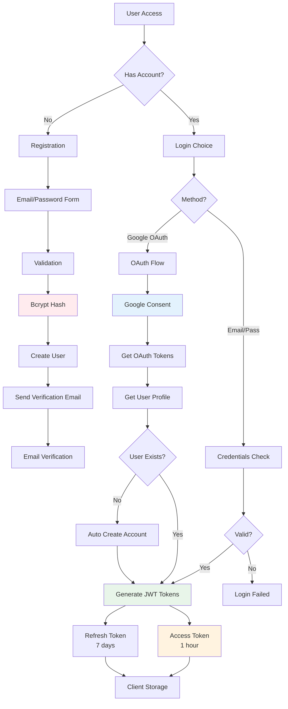


##### Hình 10: Auth Module {#hình-10:-auth-module}

**Password Reset Mechanism:**

Khi user quên password, họ có thể request reset qua email. System generate secure reset token (UUID), hash nó với SHA-256, và lưu cả identifier và secret vào user record với expiry timestamp (1 giờ). Email chứa link với token identifier được gửi đến user.

Khi user click link và nhập password mới, system verify token chưa expired và hash matches. Nếu valid, password mới được hash và update, reset tokens bị clear. Tất cả existing sessions bị invalidate để force re-login across devices, preventing unauthorized access nếu attacker có old tokens.

###### **Auth: API endpoints & bảo mật**

Các endpoints chính bao gồm `/auth/login`, `/auth/register`, `/auth/refresh`. Bảo mật được tăng cường thông qua HTTP-only cookies cho refresh tokens, short-lived access tokens, và rate limiting để chống brute-force.

#### **3.3.1.2. Users Module (User Profile Management)**

Users Module quản lý toàn bộ thông tin profile và preferences của người dùng. Module này cung cấp CRUD operations cho user data như first name, last name, avatar, timezone, và các settings cá nhân.

###### **Users: Dữ liệu & cài đặt**

Một tính năng quan trọng là User Settings management với JSONB storage trong PostgreSQL. Thay vì tạo nhiều columns riêng cho mỗi setting, hệ thống sử dụng JSONB column `settings` để store flexible configuration. Ví dụ, user có thể config notification preferences (email enabled/disabled cho từng loại notification), default calendar view (week/month), working hours, theme preference (light/dark), language...

JSONB được chọn vì khả năng query và index tốt - PostgreSQL có thể index vào specific keys trong JSON, cho phép fast lookups mà vẫn giữ flexibility. Module expose API endpoints như `PATCH /users/me/settings` để update partial settings mà không overwrite toàn bộ object.

###### **Users: API endpoints**

Module cung cấp các endpoints như `GET /users/me` (lấy thông tin cá nhân), `PATCH /users/me` (cập nhật thông tin cơ bản), `PATCH /users/me/settings` (cập nhật cấu hình JSONB), và `POST /users/avatar` (upload ảnh đại diện). Users Module cũng handle avatar upload và processing. Khi user upload avatar image, file được validate (max 5MB, only JPEG/PNG/WebP), resize về multiple sizes (32x32 thumbnail, 128x128 medium, 512x512 large) using sharp library, và upload lên cloud storage (hoặc local filesystem trong development). Avatar URLs được update vào user record.

#### **3.3.1.3. Calendar Module (Calendar Metadata Management)**

###### **Calendar: Khái niệm & dữ liệu**

Calendar Module khác với Event Module - nó quản lý calendars metadata chứ không phải individual events. Một user có thể có nhiều calendars, ví dụ: "Work", "Personal", "Family", mỗi calendar có màu sắc riêng để phân biệt trên UI.

Khi user connect Google Calendar, mỗi Google calendar được map với một Calento calendar record. Record này lưu `google_calendar_id`, `name`, `timezone`, `color`, và là `primary` calendar hay không. System duy trì sync relationship này để biết events nào thuộc calendar nào.

###### **Calendar: API endpoints**

Calendar Module cũng quản lý calendar sharing permissions (trong tương lai). Hiện tại mỗi user chỉ thấy calendars của chính họ, nhưng architecture đã chuẩn bị cho team calendars - permissions table có thể define ai có quyền view/edit calendar nào. Các API bao gồm `GET /calendars` (lấy danh sách), `POST /calendars` (tạo calendar phụ), `PATCH /calendars/:id` (sửa màu sắc/tên).

### **3.3.2. Event Management Modules**

Đây là nhóm module cốt lõi (Core Modules) chịu trách nhiệm về toàn bộ nghiệp vụ quản lý lịch trình và đặt hẹn.

#### **3.3.2.1. Calendar & Event Module**

Module này quản lý vòng đời của các đối tượng Calendar và Event, đóng vai trò là xương sống dữ liệu của hệ thống.

###### **Event: Chức năng chính**

*   **Quản lý sự kiện (Event Lifecycle)**: Hỗ trợ đầy đủ các thao tác CRUD cho sự kiện đơn (Single Events) và lặp lại (Recurring Events). Mỗi sự kiện lưu trữ thông tin chi tiết: thời gian, địa điểm, mô tả, màu sắc, và danh sách người tham dự (Attendees).

###### **Event: Luồng tạo/sửa/xóa & recurring**

*   **Recurrence Engine (RRULE)**: Tích hợp engine xử lý chuẩn RFC 5545 để quản lý các sự kiện lặp lại phức tạp (v.d: "Họp vào 9h sáng thứ Hai cách tuần"). Engine này tự động tính toán và generate các instances cụ thể (occurrences) từ quy tắc lặp, giúp user nhìn thấy đầy đủ lịch trình trong tương lai mà không cần lưu cứng hàng nghìn record vào DB.

###### **Event: Dữ liệu liên quan**

*   **Timezone & Localization**: Xử lý logic chuyển đổi múi giờ (Timezone Conversion) để ensuring thời gian hiển thị chính xác cho user ở bất kỳ đâu. Mọi thời gian đều được lưu trữ dưới dạng UTC trong database và chỉ convert sang local time khi hiển thị.

#### **3.3.2.2. Booking Module**

Module Booking giải quyết bài toán cốt lõi về "tìm giờ rảnh và đặt hẹn", giúp automate quy trình lên lịch họp.

###### **Booking: Slot/Availability engine**

*   **Availability Engine (Công cụ tính giờ rảnh)**: Đây là logic phức tạp nhất. Engine phân tích Availability Rules (khung giờ làm việc) của user, trừ đi các sự kiện bận (Busy Events) từ Calendar Module, tính toán cả Buffer Time (thời gian nghỉ giữa các cuộc họp) và Advance Notice (thời gian báo trước). Kết quả là danh sách các "Slots" khả dụng để guest có thể book.

###### **Booking: Luồng đặt lịch (guest)**

*   **Booking Link Flow**: Quản lý việc tạo và cấu hình các trang đặt lịch công khai (Public Booking Page). Mỗi link có thể tùy chỉnh thời lượng, câu hỏi khảo sát, và đặc biệt là **Location**. Nếu người dùng chọn "Google Meet", hệ thống sẽ tự động sinh đường dẫn cuộc họp (Google Meet Link) ngay khi booking được tạo, giúp tiết kiệm thao tác thủ công.
*   **Multi-step Booking Process**: Xử lý transaction đặt lịch an toàn: (1) Guest chọn slot -> (2) System hold slot tạm thời -> (3) Guest điền info -> (4) Confirm booking -> (5) Create Event & Send Emails. Quy trình này đảm bảo không bị double-booking (hai người đặt cùng lúc 1 giờ).

###### **Booking: Dữ liệu liên quan**

Dữ liệu booking liên kết chặt chẽ với bảng Availability (lịch rảnh), Events (sự kiện được tạo ra), và Google Calendar Sync (để block time). Trạng thái booking (confirmed, cancelled, rescheduled) được tracking chi tiết.

_(Xem chi tiết quy trình đặt lịch tại mục 3.3.5 - Sơ đồ tuần tự)_

### **3.3.2. AI & RAG Modules**

Đây là nhóm module cốt lõi tạo nên tính năng đặc trưng của Calento - trợ lý ảo AI thông minh. Kiến trúc được thiết kế theo mô hình RAG (Retrieval-Augmented Generation) để đảm bảo AI có thể trả lời chính xác dựa trên dữ liệu thực tế của người dùng.

#### **3.3.2.1. LLM Module (Large Language Model Service)**

Module LLM đóng vai trò là lớp trung gian (wrapper layer) giữa hệ thống Calento và Google Gemini API, cung cấp một interface thống nhất và dễ sử dụng cho các module khác. Việc thiết kế theo pattern này giúp tách biệt logic nghiệp vụ khỏi chi tiết triển khai của LLM provider cụ thể, cho phép dễ dàng thay đổi hoặc mở rộng trong tương lai.

**Kiến trúc và thành phần:**

Module được thiết kế với ba nhóm chức năng chính. Nhóm đầu tiên quản lý Model Configuration & Initialization, chịu trách nhiệm khởi tạo Gemini model với các tham số được điều chỉnh tối ưu cho domain quản lý lịch. Tham số `temperature` được thiết lập ở mức 0.7 để cân bằng giữa tính sáng tạo và nhất quán trong câu trả lời. Các tham số `topK` (40) và `topP` (0.95) điều chỉnh quá trình sampling để đảm bảo chất lượng output. Giới hạn `maxOutputTokens` ở 2048 tokens giúp kiểm soát độ dài phản hồi và chi phí API. Đặc biệt, `safetySettings` được cấu hình để lọc các nội dung có hại, đảm bảo an toàn cho người dùng.

Nhóm chức năng thứ hai là Prompt Engineering, quản lý system prompts được tối ưu hóa đặc biệt cho việc quản lý thời gian. System prompt định nghĩa rõ ràng vai trò của AI là "Calento AI Assistant - trợ lý thông minh chuyên về quản lý thời gian", với nhiệm vụ cụ thể là hỗ trợ người dùng quản lý lịch trình, tìm kiếm events, và đề xuất thời gian họp hợp lý. Phong cách giao tiếp được thiết kế thân thiện, ngắn gọn nhưng chính xác, có sử dụng emoji phù hợp để tăng tính tương tác. Module cũng hỗ trợ đa ngôn ngữ, tự động phát hiện và trả lời bằng tiếng Việt hoặc tiếng Anh tùy theo ngôn ngữ câu hỏi của người dùng.

Nhóm thứ ba triển khai Streaming Support thông qua Server-Sent Events (SSE), cho phép AI stream responses về client theo thời gian thực. Thay vì chờ đợi câu trả lời hoàn chỉnh, người dùng thấy từng phần của response xuất hiện dần, tạo trải nghiệm tương tác tốt hơn tương tự như ChatGPT. Điều này đặc biệt quan trọng với các câu trả lời dài hoặc phức tạp.

**Function Calling Integration:**

Một tính năng đặc biệt quan trọng của LLM Module là khả năng Function Calling - cho phép AI không chỉ trả lời câu hỏi mà còn thực hiện các hành động cụ thể trong hệ thống. Module định nghĩa bốn functions chính mà AI có thể gọi: `createEvent` để tạo sự kiện mới với đầy đủ thông tin về tiêu đề, thời gian bắt đầu/kết thúc và danh sách người tham dự; `findAvailableSlots` để tìm các khung giờ rảnh dựa trên ngày và thời lượng mong muốn; `searchEvents` để tìm kiếm events theo semantic meaning thay vì keyword matching truyền thống; và `getScheduleSummary` để tóm tắt lịch trình trong một khoảng thời gian cụ thể.

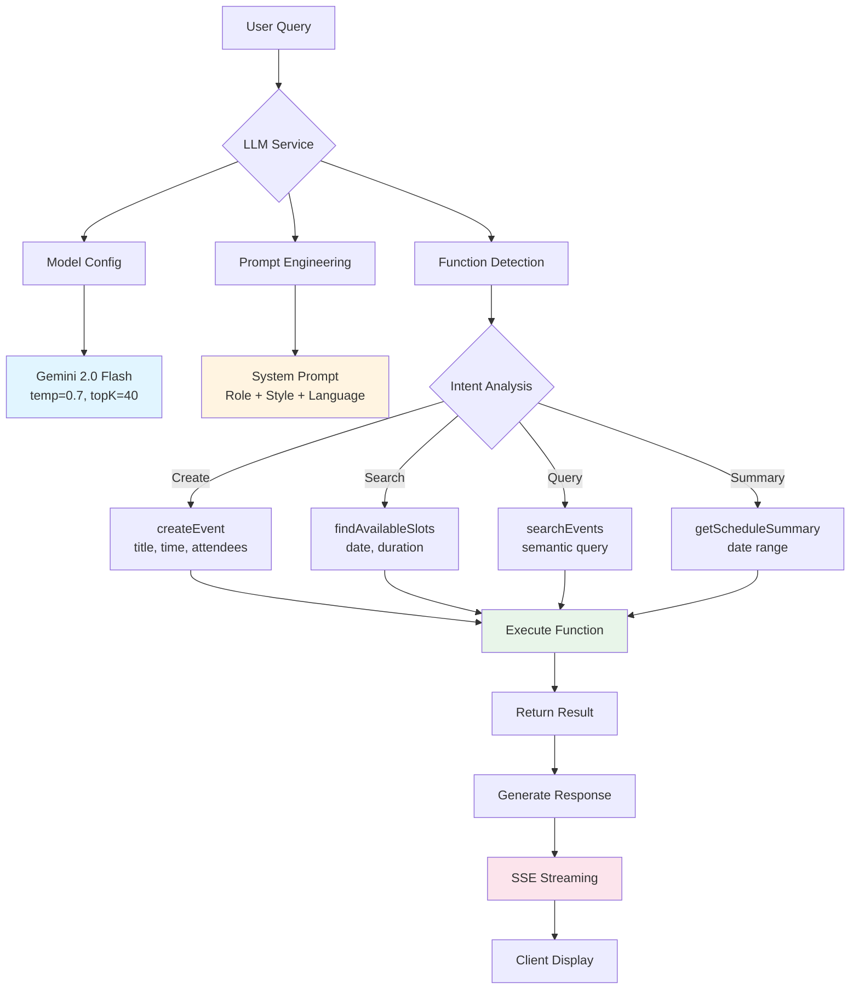


##### Hình 13: LLM Module Architecture {#hình-13:-llm-module-architecture}

**Luồng xử lý chi tiết:**

Khi nhận được một câu hỏi từ người dùng, LLM Service thực hiện chuỗi xử lý theo quy trình chặt chẽ. Đầu tiên, câu hỏi được đưa qua Intent Analysis để xác định người dùng muốn thực hiện hành động gì - tạo sự kiện mới, tìm kiếm thông tin, hay chỉ đơn giản là hỏi thông tin. Dựa trên kết quả phân tích, module có thể trigger function calling tương ứng hoặc chuyển sang generation mode thuần túy. Toàn bộ quá trình này được tối ưu hóa để đảm bảo thời gian phản hồi nhanh và độ chính xác cao.

#### **3.3.2.2. LangChain Integration Layer**

LangChain được tích hợp vào hệ thống như một orchestration framework, đóng vai trò điều phối luồng xử lý phức tạp giữa các components khác nhau bao gồm LLM, Vector Store, và Memory management. Framework này không thay thế mà bổ trợ cho LLM Module, cung cấp các abstractions và utilities giúp code dễ maintain và extend hơn.

**Memory Management với Chat Message History:**

Một trong những thách thức lớn nhất khi xây dựng chatbot là quản lý ngữ cảnh hội thoại (conversation context). LangChain giải quyết vấn đề này thông qua component ChatMessageHistory, tự động lưu trữ và retrieve lịch sử tin nhắn. Component này được cấu hình với `returnMessages: true` để trả về full message objects thay vì chỉ text, cho phép giữ metadata quan trọng như timestamps và roles. Memory key được đặt là "chat_history" và được map với input/output keys tương ứng, tạo ra một pipeline xử lý rõ ràng và dễ debug.

**Prompt Templates và Standardization:**

Thay vì concatenate strings thủ công để tạo prompts - một practice dễ gây lỗi và khó maintain - LangChain cung cấp ChatPromptTemplate system. Template này cho phép định nghĩa prompts dưới dạng structured messages với placeholders cho dynamic content. System message chứa instructions không đổi về vai trò và hành vi của AI, trong khi human message template chứa context từ RAG và câu hỏi thực tế của user. Cấu trúc này đảm bảo tính nhất quán trong cách prompts được format và dễ dàng A/B testing các phiên bản prompt khác nhau.

**LLM Chain và Composition Pattern:**

Một trong những điểm mạnh nhất của LangChain là khả năng compose các operations phức tạp từ simple components thông qua piping mechanism. Prompt template được pipe vào LLM, output của LLM được pipe vào parser, tạo thành một chain xử lý liền mạch. Pattern này mang lại nhiều lợi ích: code trở nên declarative và self-documenting; dễ dàng insert thêm processing steps vào giữa chain; và có thể reuse các sub-chains cho nhiều use cases khác nhau.

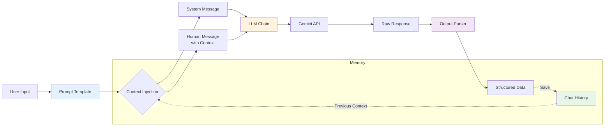


**Lợi ích của LangChain trong hệ thống:**

Việc tích hợp LangChain mang lại bốn lợi ích chính cho dự án Calento. Thứ nhất là Abstraction - khả năng trừu tượng hóa các LLM providers khác nhau. Nếu trong tương lai cần chuyển từ Gemini sang OpenAI GPT hoặc Anthropic Claude, chỉ cần thay đổi LLM initialization mà không ảnh hưởng đến business logic. Thứ hai là Memory Management với built-in conversation memory giúp AI nhớ ngữ cảnh các cuộc hội thoại trước đó. Thứ ba, Chaining pattern cho phép compose complex workflows từ simple, testable components. Cuối cùng là Observability - LangChain cung cấp built-in logging và debugging tools giúp track từng bước xử lý, vô cùng hữu ích khi troubleshoot issues trong production.


#### **3.3.2.3. Vector Module (Embedding & Similarity Search)**

Module Vector quản lý toàn bộ vòng đời (lifecycle) của vector embeddings, từ quá trình generate embeddings cho text, lưu trữ vào database, đến việc tìm kiếm semantic similarity. Đây là nền tảng kỹ thuật cho tính năng RAG - cho phép AI không chỉ dựa vào general knowledge mà còn truy xuất thông tin cụ thể từ dữ liệu người dùng.

**Embedding Generation Process:**

Hệ thống sử dụng model `text-embedding-004` của Google, một trong những embedding models tiên tiến nhất hiện nay với nhiều ưu điểm vượt trội. Model này tạo ra vectors có 768 chiều (dimensions), một kích thước đủ lớn để capture semantic meaning nhưng vẫn hiệu quả cho việc storage và retrieval. Điểm đặc biệt là khả năng hỗ trợ đa ngôn ngữ, bao gồm cả tiếng Việt và tiếng Anh, đảm bảo rằng người dùng Việt Nam có trải nghiệm tìm kiếm chất lượng tương đương với các ngôn ngữ phổ biến khác. Model được optimize đặc biệt cho short texts như event titles và descriptions - đúng với use case của ứng dụng lịch.

Quá trình generate embedding diễn ra như sau: khi nhận được một đoạn text (ví dụ: "Hop team về sprint planning tuần sau"), module gọi API của Google Generative AI với model embedding đã được khởi tạo sẵn. API trả về một array của 768 số thực (float numbers), mỗi số đại diện cho một dimension trong semantic space. Vector này sau đó được lưu trữ vào PostgreSQL database cùng với original text và metadata liên quan.

**Storage và Indexing với pgvector:**

PostgreSQL được mở rộng với extension pgvector, cho phép lưu trữ và query vector data một cách native. Extension này cung cấp data type `vector(768)` để store embeddings và các operators đặc biệt cho vector operations. Operator `<=>` (cosine distance) được sử dụng để đo độ tương đồng giữa hai vectors - giá trị càng nhỏ nghĩa là hai vectors càng giống nhau (tương tự về semantic meaning).

Để tối ưu hóa performance, hệ thống sử dụng HNSW index (Hierarchical Navigable Small World) - một loại approximate nearest neighbor index được thiết kế đặc biệt cho high-dimensional vectors. Index này cho phép search trong hàng trăm nghìn vectors với thời gian phản hồi dưới 10 milliseconds, đảm bảo trải nghiệm real-time cho người dùng.

**Similarity Search Workflow:**

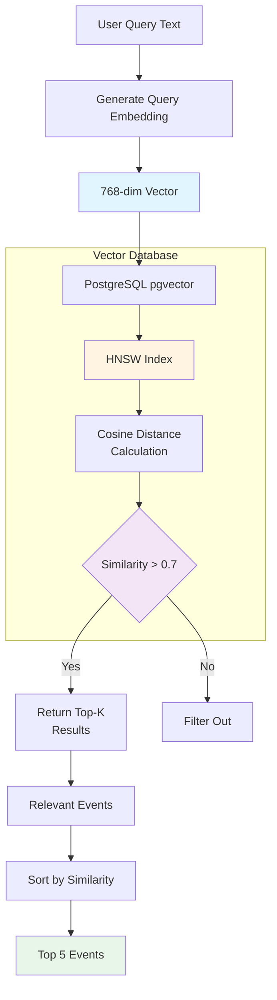


##### Hình 14: Vector Similarity Search Process {#hình-14:-vector-similarity-search-process}

Quá trình search diễn ra trong ba bước chính. Đầu tiên, user query được transform thành vector embedding sử dụng cùng model `text-embedding-004`. Thứ hai, vector này được so sánh với tất cả vectors đã lưu trong database sử dụng cosine distance, với HNSW index giúp tăng tốc computation đáng kể. Cuối cùng, kết quả được filter theo threshold (similarity > 0.7), sort theo độ tương đồng giảm dần, và trả về top 5 events most relevant với query.

#### **3.3.2.4. RAG Module (Retrieval-Augmented Generation)**

RAG Module là tầng integration cao nhất, kết hợp Vector Service và LLM Service theo RAG pattern để tạo ra một AI assistant context-aware và chính xác. Module này thực hiện vai trò cầu nối, orchestrate quá trình retrieval và generation thành một workflow liền mạch.

**Three-Phase RAG Workflow:**

Quy trình RAG được chia thành ba phases rõ ràng, mỗi phase có trách nhiệm riêng biệt. Phase 1 - Retrieval (Tìm kiếm) là bước đầu tiên khi user gửi câu hỏi. RAG Service nhận query text và chuyển ngay cho Vector Service để generate embedding. Embedding này được sử dụng để search trong database, tìm ra 5 events có semantic meaning gần nhất với câu hỏi. Ví dụ, nếu user hỏi "Tôi có gặp client nào tuần này không?", vector search sẽ tìm ra các events có keywords như "client", "meeting", "presentation" trong tuần hiện tại, ngay cả khi exact phrase "gặp client" không xuất hiện trong event title.

Phase 2 - Augmentation (Làm giàu) là bước format và inject context vào prompt. RAG Service lấy 5 events vừa retrieve được, transform chúng thành JSON format với các fields relevant (title, start_time, end_time, location, attendees). JSON này được concatenate với user query và system instructions để tạo thành một complete prompt. Prompt này rõ ràng chỉ dẫn LLM: "Dựa vào các events trong context, hãy trả lời câu hỏi của user một cách chính xác. Nếu thông tin không có trong context, hãy thành thật nói không biết thay vì đoán".

Phase 3 - Generation (Sinh câu trả lời) là bước cuối cùng khi augmented prompt được gửi đến Gemini LLM. Model phân tích context và question, generate response dựa trên factual information từ events thay vì hallucinate. Response được stream về client qua SSE, cho phép user thấy từng phần câu trả lời xuất hiện real-time, tạo trải nghiệm interactive tốt.

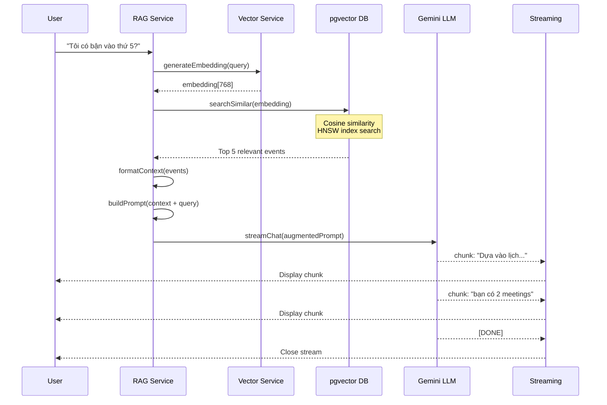


##### Hình 15: RAG Sequence Flow {#hình-15:-rag-sequence-flow}

**Context Quality và Relevance Filtering:**

Một thách thức quan trọng trong RAG là đảm bảo chất lượng context được inject vào prompt. Nếu retrieve quá nhiều irrelevant events, LLM có thể bị confused và đưa ra câu trả lời sai. Hệ thống giải quyết vấn đề này bằng similarity threshold - chỉ những events có similarity score > 0.7 mới được consider. Ngưỡng này được fine-tune qua testing để cân bằng giữa recall (không bỏ sót events quan trọng) và precision (không include events không liên quan).

Trong trường hợp không tìm thấy events nào đạt threshold, RAG Service sẽ truyền empty context cho LLM kèm instruction rõ ràng: "No relevant events found in user's calendar. Answer based on general knowledge or inform user you don't have specific information". Cơ chế này prevent hallucination - một vấn đề phổ biến với LLMs khi chúng "bịa" thông tin không có thật.

### **3.3.3. Google Calendar Sync Module**

Module Google Calendar Sync là một trong những components phức tạp nhất của hệ thống, chịu trách nhiệm đồng bộ dữ liệu hai chiều giữa Calento và Google Calendar. Thiết kế phải đảm bảo data consistency trong môi trường distributed system - một bài toán không hề đơn giản khi có hai sources of truth độc lập.

**OAuth Authentication Flow:**

Trước khi có thể đồng bộ, user phải authorize Calento truy cập Google Calendar của họ thông qua OAuth 2.0 flow. Quy trình bắt đầu khi user click nút "Connect Google Calendar" trên UI. Backend generate OAuth URL với các scopes cần thiết (`calendar.events`, `calendar.readonly`) và redirect user đến Google consent screen. Sau khi user chấp

 thuận, Google redirect về Calento callback URL kèm authorization code. Backend exchange code này lấy access token (valid 1 giờ) và refresh token (long-lived), lưu vào `user_credentials` table với encryption.

**Bi-directional Sync Architecture:**

Sync process được chia thành hai phases chạy độc lập: PULL (Google → Calento) và PUSH (Calento → Google). Cả hai phases được trigger bởi background job chạy định kỳ mỗi 5 phút, đảm bảo dữ liệu luôn gần như real-time nhưng không quá tải API quota của Google.

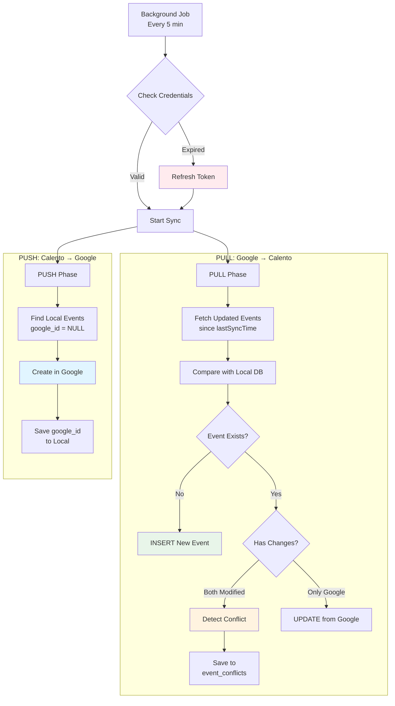


##### Hình 16: Google Calendar Sync Flow {#hình-16:-google-calendar-sync-flow}

PULL Phase sử dụng Google Calendar API endpoint `events.list()` với parameter `updatedMin` set to `lastSyncTime`, ensuring chỉ fetch events đã được modified từ lần sync cuối. Mỗi event từ Google được compare với local database dựa vào `google_event_id`. Nếu event chưa tồn tại locally, thực hiện INSERT. Nếu đã tồn tại, compare `updated_at` timestamps - nếu cả hai phía đều có changes (local modified_at > last_sync AND Google updated > last_sync), đây là conflict case cần user resolution.

PUSH Phase  query database tìm tất cả events có `google_event_id IS NULL` - đây là các events được tạo trong Calento chưa sync lên Google. Mỗi event được transform sang Google Calendar format (convert time zones, map fields) và call `events.insert()` API. Sau khi create thành công, `google_event_id` được update vào local database để track relationship.

**Conflict Resolution Mechanism:**

Conflict xảy ra khi cùng một event bị modify ở cả hai hệ thống trong cùng sync interval. Hệ thống detect conflict bằng cách compare `updated_at` timestamp của local event với `updated` timestamp từ Google response - nếu cả hai đều > `last_sync_at`, có conflict. Thay vì tự động overwrite (có thể mất dữ liệu), system lưu conflict vào table `event_conflicts` với full data từ cả hai phía và notify user.

User được present với conflict resolution UI, cho phép chọn một trong bốn strategies: `prefer_google` (giữ version từ Google, discard local changes); `prefer_calento` (push local changes lên Google, overwrite); `keep_both` (tạo hai events riêng biệt với suffixes); hoặc `manual` (user tự merge fields từ hai versions). Decision được execute và conflict record được mark resolved.

### **3.3.4. Notification System Module**

Notification System được thiết kế theo mô hình event-driven architecture với message queue, đảm bảo notifications được deliver reliably ngay cả khi có failures. Hệ thống hỗ trợ  nhiều kênh thông báo khác nhau, mỗi kênh phù hợp cho các use cases cụ thể.

**Multi-channel Architecture:**

Hệ thống hiện hỗ trợ hai kênh chính: Email (primary channel) và Webhook (cho integrations). Email channel xử lý các notifications quan trọng như event reminders, booking confirmations, team invitations. Webhook channel cho phép developers tích hợp Calento với external systems như Slack workspace notifications hoặc custom business logic.

Notification Service hoạt động như central coordinator. Khi một event trigger notification (ví dụ: user tạo sự kiện mới), service check user preferences trong database để xác định kênh nào enabled. Nếu email enabled, một job được add vào email queue. Nếu webhook enabled, job được add vào webhook queue. Queuing mechanism đảm bảo notifications không block main request thread và có thể retry nếu delivery fails.

**Email Worker Implementation:**

Email worker được implement với BullMQ - một robust Redis-based queue system. Worker subscribe vào `send-notification` queue và process jobs concurrently (configurable concurrency limit để avoid overwhelming SMTP server). Mỗi job chứa `userId`, `notificationType`, và `data` object with template variables.

Worker đầu tiên select email template tương ứng với notification type từ template storage. Templates được viết bằng Handlebars syntax, cho phép dynamic content injection. Ví dụ, template `event-reminder.hbs` có placeholders như `{{event.title}}`, `{{event.start_time}}`, `{{user.first_name}}`. Worker compile template với actual data, generate HTML email body, và gửi qua Nodemailer với SMTP configuration.

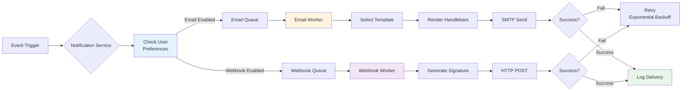


##### Hình 17: Notification Multi-channel System {#hình-17:-notification-multi-channel-system}

**Notification Types và Prioritization:**

Hệ thống định nghĩa bảy loại notifications với priority levels khác nhau. `event_reminder` notifications (15 phút trước event) có priority `High` và được process với higher concurrency. `booking_created` notifications cũng có priority `High` vì liên quan đến commitment giữa hai người - delay có thể gây hiểu lầm. `sync_conflict` và `team_invitation` có priority `Medium`, trong khi `event_created` có priority `Low` vì không time-sensitive.

Priority được implement thông qua separate queues với different worker  configurations. High-priority queue có concurrency 10 workers, Medium có 5, Low có 2. Cấu hình này đảm bảo critical notifications luôn được process nhanh chóng ngay cả khi system under load.

### **3.3.5. Webhook System Module (Outgoing Webhook)**

Chức năng "Báo ra bên ngoài" (Outgoing Webhook) được thiết kế đơn giản và hiệu quả, nhắm đến mục tiêu tích hợp với các nền tảng thứ ba như Slack, Zapier, hoặc CRM.

**Cơ chế hoạt động - "Lưu Cấu Hình":**

Tại sao cần chức năng "Tạo Webhook"? Thực chất đây không phải là một quy trình tạo mới tài nguyên phức tạp, mà đơn giản là hành động **Lưu Cấu Hình (Save Setting)**:
1.  **Cấu hình**: Người dùng (ví dụ: User A muốn bắn tin về Slack, User B muốn bắn về CRM) nhập URL đích (Endpoint) vào hệ thống và lưu lại. URL này được lưu trữ trong Database như một dữ liệu tĩnh.
2.  **Kích hoạt**: Khi sự kiện quan trọng xảy ra (điển hình là `Booking Created`), hệ thống sẽ truy xuất URL đã cấu hình của user đó.
3.  **Thực thi**: Một job được đẩy vào Queue. Worker sau đó lấy job và thực hiện gửi HTTP Request (POST) chứa payload dữ liệu đến URL đích.

Cơ chế này loại bỏ sự phức tạp không cần thiết, tập trung vào việc cho phép người dùng tự định nghĩa "kênh thông báo" của riêng họ thông qua việc lưu Webhook URL.

System enforce HTTPS-only policy - webhook URLs phải dùng `https://` protocol. HTTP endpoints bị reject để prevent man-in-the-middle attacks. Rate limiting cũng được apply: maximum 100 webhooks per minute per user để prevent abuse và protect both Calento infrastructure và receiving endpoints.

**Delivery và Retry Logic:**

Khi một webhook-eligible eventxảy ra (ví dụ: guest book appointment), Webhook Service construct payload theo predefined schema, generate HMAC signature, và attempt delivery qua HTTP POST request với 10-second timeout. Request headers include `X-Calento-Signature` (HMAC hash), `X-Calento-Event` (event type), và `Content-Type: application/json`.

Nếu request fails (network error, timeout, non-2xx response), retry mechanism kicks in với exponential backoff strategy. First retry sau 1 minute, second retry sau 5 minutes, third retry sau 15 minutes. Sau 3 failed attempts, webhook được mark failed và admin notification sent. Retry mechanism balance giữa reliability (not giving up too quickly) và efficiency (not hammering failing endpoints).

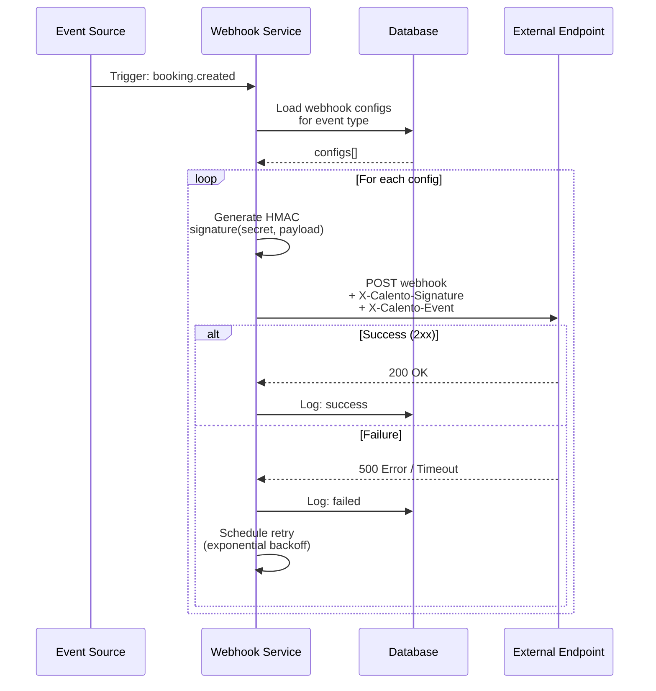


##### Hình 18: Webhook Delivery Flow {#hình-18:-webhook-delivery-flow}

**Payload Structure và Versioning:**

Webhook payloads follow consistent JSON schema với top-level fields: `event` (event type string), `timestamp` (ISO8601 UTC), và `data` (event-specific payload). Ví dụ, `booking.created` payload chứa booking details (ID, link slug), guest information (name, email, phone), scheduled time (start, end, timezone), và optionally event metadata.

System support API versioning để maintain backward compatibility. Header `X-Calento-API-Version: v1` allows receivers biết schema version. Khi introduce breaking changes trong future, version 2 sẽ được released với option cho users migrate at their own pace, avoiding sudden breakage của existing integrations.

* Queue Module: Cấu hình BullMQ.  
* Email Module: Worker xử lý việc gửi email notification bất đồng bộ.  
* Sync Worker: Worker chạy định kỳ để đồng bộ lịch từ Google Calendar về database nội bộ.

![][image15]

![][image16]

##### Hình 19: Worker & Infrastructure {#hình-19:-worker-&-infrastructure}

## **3.3. Thiết kế dữ liệu**

Cơ sở dữ liệu PostgreSQL được thiết kế tuân theo nguyên tắc chuẩn hóa (normalization) để đảm bảo data integrity, giảm redundancy, và optimize performance. Đặc biệt, database được mở rộng với extension `pgvector` để hỗ trợ việc lưu trữ và tìm kiếm vector embeddings - một công nghệ tiên tiến phục vụ cho tính năng AI Retrieval-Augmented Generation (RAG).

### **3.3.1. PostgreSQL Extensions & Custom Types**

**Extensions:**

Hệ thống sử dụng hai PostgreSQL extensions quan trọng. Extension `uuid-ossp` cung cấp functions để generate UUID (Universally Unique Identifiers) phiên bản 4, được sử dụng làm primary keys cho tất cả tables thay vì auto-increment integers. Lựa chọn này mang lại nhiều lợi ích: security cao hơn (không thể predict ID tiếp theo), support tốt cho distributed systems (có thể generate offline mà không lo collision), và thuận tiện khi merge data từ nhiều sources.

Extension `pgvector` là nền tảng cho AI capabilities, cho phép store và query high-dimensional vector embeddings. Extension này provide vector data type support dimensionality lên đến  16,000 dimensions (hệ thống dùng 768-dim), distance operators (cosine `<=>`, L2 `<->`, inner product `<#>`), và specialized indexes (HNSW, IVFFlat) cho approximate nearest neighbor search với performance cao.

**Custom ENUM Types:**

Database định nghĩa năm ENUM types để enforce data integrity tại database level:

- `event_status`: confirmed, cancelled, tentative (cho trạng thái events)
- `sync_status`: pull, push (tracking hướng đồng bộ Google Calendar)
- `sync_log_status`: success, failed, in_progress (monitor sync jobs)
- `provider_type`: google, outlook, apple (multi-provider support)
- `notification_channel`: email, slack, zalo, push (notification channels)

ENUM types giúp prevent invalid values, reduce storage (stored internally as integers), và improve query performance thông qua compile-time type checking.

### **3.3.2. Entity Relationship Diagram**

Hệ thống database bao gồm 18 core tables được tổ chức theo modules nghiệp vụ, với relationships được define rõ ràng qua foreign keys.

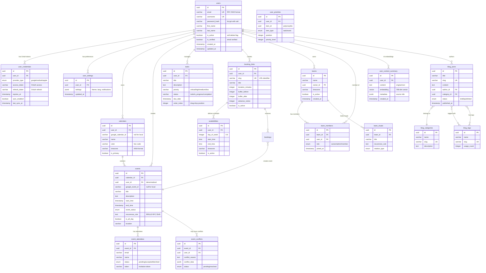


##### Hình 20: Database Entity Relationship Diagram
{#hình-20:-database-entity-relationship-diagram}

### **3.3.3. Database Migration Strategy: Raw SQL**

**Quyết định kiến trúc: Tại sao dùng Raw SQL thay vì Prisma?**

Hệ thống Calento sử dụng raw SQL migrations trong `server/migrations/schema.sql` thay vì ORM như Prisma, mặc dù Prisma  rất phổ biến trong NestJS ecosystem. Quyết định này dựa trên bốn lý do kỹ thuật quan trọng.

Hệ thống Calento sử dụng raw SQL migrations trong `server/migrations/schema.sql` thay vì ORM như Prisma vì bốn lý do chính. Thứ nhất, để tận dụng các tính năng nâng cao của PostgreSQL như extension `pgvector` và custom ENUM types mà Prisma chưa hỗ trợ đầy đủ. Thứ hai, raw SQL mang lại sự minh bạch và kiểm soát tuyệt đối, giúp developers dễ dàng review và tối ưu từng câu lệnh DDL. Thứ ba, việc tối ưu hóa hiệu năng được thực hiện chi tiết thông qua các index parameters như fill factors hay index types (HNSW) mà ORM thường ẩn đi. Cuối cùng, đội ngũ phát triển ưu tiên cách tiếp cận SQL-first để tận dụng tối đa kinh nghiệm về PostgreSQL, giúp việc debug và bảo trì trở nên dễ dàng hơn.

**Migration Execution:**

Migrations được run manual hoặc automated trong CI/CD pipeline:

```bash
# Development
psql -U postgres -d calento < server/migrations/schema.sql

# Production (với transaction safety)
psql -U postgres -d calento_prod -v ON_ERROR_STOP=1 -f schema.sql
```

Schema file được tổ chức theo modules với comments rõ ràng, shared functions (như `update_updated_at_column()`), và IF NOT EXISTS clauses để support idempotency.


#### **3.3.4. Chi tiết thiết kế Database (35 Tables)**

Hệ thống cơ sở dữ liệu bao gồm 35 bảng, được chia thành các nhóm chức năng chính. Dưới đây là schema chi tiết đầy đủ cho từng bảng, bao gồm toàn bộ các thuộc tính.

##### **1. Core & Auth (Identity Module)**

**1.1. Table: users**
| Column | Type | Constraints | Description |
| :--- | :--- | :--- | :--- |
| `id` | UUID | PK, DEFAULT `gen_random_uuid()` | Khóa chính |
| `email` | VARCHAR(255) | UNIQUE, NOT NULL | Email người dùng |
| `username` | VARCHAR(100) | UNIQUE, NOT NULL | Tên đăng nhập |
| `avatar` | VARCHAR(255) | DEFAULT NULL | URL ảnh đại diện |
| `password_hash` | VARCHAR(255) | NOT NULL | Mật khẩu đã mã hóa |
| `first_name` | VARCHAR(100) | | Tên |
| `last_name` | VARCHAR(100) | | Họ |
| `full_name` | VARCHAR(200) | | Tên đầy đủ |
| `is_active` | BOOLEAN | DEFAULT TRUE | Trạng thái hoạt động |
| `is_verified` | BOOLEAN | DEFAULT FALSE | Trạng thái xác thực |
| `reset_token_identifier` | VARCHAR(255) | | ID token reset mật khẩu |
| `reset_token_secret` | VARCHAR(255) | | Secret reset mật khẩu |
| `reset_token_expires_at` | TIMESTAMP | | Thời gian hết hạn reset |
| `created_at` | TIMESTAMP | DEFAULT NOW() | Thời điểm tạo |
| `updated_at` | TIMESTAMP | DEFAULT NOW() | Thời điểm cập nhật |

**1.2. Table: user_credentials**
| Column | Type | Constraints | Description |
| :--- | :--- | :--- | :--- |
| `id` | UUID | PK | Khóa chính |
| `user_id` | UUID | FK -> users.id | ID người dùng |
| `provider` | ENUM | 'google', 'outlook', 'apple' | Nhà cung cấp |
| `access_token` | VARCHAR(500) | | Token truy cập |
| `refresh_token` | VARCHAR(500) | | Token làm mới |
| `expires_at` | TIMESTAMP | | Thời gian hết hạn |
| `scope` | TEXT | | Phạm vi quyền |
| `sync_enabled` | BOOLEAN | DEFAULT TRUE | Bật/tắt đồng bộ |
| `last_sync_at` | TIMESTAMP | | Lần đồng bộ cuối |
| `is_active` | BOOLEAN | DEFAULT TRUE | Trạng thái |
| `created_at` | TIMESTAMP | DEFAULT NOW() | Thời điểm tạo |
| `updated_at` | TIMESTAMP | DEFAULT NOW() | Thời điểm cập nhật |

**1.3. Table: user_settings**
| Column | Type | Constraints | Description |
| :--- | :--- | :--- | :--- |
| `id` | UUID | PK | Khóa chính |
| `user_id` | UUID | FK -> users.id, UNIQUE | ID người dùng |
| `settings` | JSONB | DEFAULT '{}' | Cấu hình (JSON) |
| `created_at` | TIMESTAMP | DEFAULT NOW() | Thời điểm tạo |
| `updated_at` | TIMESTAMP | DEFAULT NOW() | Thời điểm cập nhật |

##### **2. Calendar & Events System**

**2.1. Table: calendars**
| Column | Type | Constraints | Description |
| :--- | :--- | :--- | :--- |
| `id` | UUID | PK | Khóa chính |
| `user_id` | UUID | FK -> users.id | Chủ sở hữu |
| `google_calendar_id` | VARCHAR(255) | NOT NULL | ID lịch Google |
| `name` | VARCHAR(255) | | Tên lịch |
| `description` | TEXT | | Mô tả |
| `timezone` | VARCHAR(100) | | Múi giờ |
| `is_primary` | BOOLEAN | DEFAULT FALSE | Là lịch chính |
| `created_at` | TIMESTAMP | DEFAULT NOW() | Thời điểm tạo |
| `updated_at` | TIMESTAMP | DEFAULT NOW() | Thời điểm cập nhật |

**2.2. Table: events**
| Column | Type | Constraints | Description |
| :--- | :--- | :--- | :--- |
| `id` | UUID | PK | Khóa chính |
| `calendar_id` | UUID | FK -> calendars.id | ID lịch |
| `team_id` | UUID | FK -> teams.id | ID nhóm (nếu có) |
| `google_event_id` | VARCHAR(255) | | ID sự kiện Google |
| `title` | VARCHAR(500) | | Tiêu đề |
| `description` | TEXT | | Mô tả |
| `location` | VARCHAR(500) | | Địa điểm |
| `timezone` | VARCHAR(100) | | Múi giờ |
| `start_time` | TIMESTAMP | | Bắt đầu |
| `end_time` | TIMESTAMP | | Kết thúc |
| `is_all_day` | BOOLEAN | DEFAULT FALSE | Cả ngày |
| `is_recurring` | BOOLEAN | DEFAULT FALSE | Lặp lại |
| `recurrence_rule` | TEXT | | Quy tắc lặp (RRULE) |
| `status` | ENUM | confirmed/cancelled | Trạng thái |
| `color` | VARCHAR(50) | DEFAULT 'blue' | Màu sắc |
| `attendees` | JSONB | | Danh sách tham dự (cũ) |
| `reminders` | JSONB | | Nhắc nhở |
| `synced_at` | TIMESTAMP | | Thời gian đồng bộ |
| `organizer_id` | UUID | FK -> users.id | Người tổ chức |
| `organizer_email` | VARCHAR(255) | | Email người tổ chức |
| `organizer_name` | VARCHAR(255) | | Tên người tổ chức |
| `conference_data` | JSONB | | Link họp online |
| `visibility` | VARCHAR(50) | DEFAULT 'default' | Quyền riêng tư |
| `response_status` | VARCHAR(50) | DEFAULT 'accepted' | Trạng thái phản hồi |
| `created_at` | TIMESTAMP | DEFAULT NOW() | Thời điểm tạo |
| `updated_at` | TIMESTAMP | DEFAULT NOW() | Thời điểm cập nhật |

**2.3. Table: event_attendees**
| Column | Type | Constraints | Description |
| :--- | :--- | :--- | :--- |
| `id` | UUID | PK | Khóa chính |
| `event_id` | UUID | FK -> events.id | ID sự kiện |
| `email` | VARCHAR(255) | NOT NULL | Email |
| `name` | VARCHAR(255) | | Tên hiển thị |
| `response_status` | VARCHAR(50) | DEFAULT 'needsAction' | Trạng thái RSVP |
| `is_optional` | BOOLEAN | DEFAULT FALSE | Không bắt buộc |
| `is_organizer` | BOOLEAN | DEFAULT FALSE | Là người tổ chức |
| `comment` | TEXT | | Bình luận |
| `invitation_token` | VARCHAR(255) | UNIQUE | Token mời |
| `invitation_sent_at` | TIMESTAMPTZ | | Thời gian gửi mời |
| `invitation_responded_at`| TIMESTAMPTZ | | Thời gian phản hồi |
| `invitation_remind_count`| INTEGER | DEFAULT 0 | Số lần nhắc |
| `can_modify_event` | BOOLEAN | DEFAULT FALSE | Quyền sửa sự kiện |
| `can_invite_others` | BOOLEAN | DEFAULT FALSE | Quyền mời người khác |
| `can_see_guest_list` | BOOLEAN | DEFAULT TRUE | Quyền xem DS khách |
| `google_calendar_synced` | BOOLEAN | DEFAULT FALSE | Đã đồng bộ Google |
| `google_event_id` | VARCHAR(255) | | ID sự kiện Google của khách |
| `created_at` | TIMESTAMPTZ | DEFAULT NOW() | Thời điểm tạo |
| `updated_at` | TIMESTAMPTZ | DEFAULT NOW() | Thời điểm cập nhật |

**2.4. Table: availabilities**
| Column | Type | Constraints | Description |
| :--- | :--- | :--- | :--- |
| `id` | UUID | PK | Khóa chính |
| `user_id` | UUID | FK -> users.id | ID người dùng |
| `day_of_week` | INTEGER | 0-6 | Thứ trong tuần |
| `start_time` | TIME | NOT NULL | Giờ bắt đầu |
| `end_time` | TIME | NOT NULL | Giờ kết thúc |
| `is_active` | BOOLEAN | DEFAULT TRUE | Đang kích hoạt |
| `timezone` | VARCHAR(50) | DEFAULT 'UTC' | Múi giờ |
| `created_at` | TIMESTAMP | DEFAULT NOW() | Thời điểm tạo |
| `updated_at` | TIMESTAMP | DEFAULT NOW() | Thời điểm cập nhật |

**2.5. Table: event_conflicts**
| Column | Type | Constraints | Description |
| :--- | :--- | :--- | :--- |
| `id` | UUID | PK | Khóa chính |
| `user_id` | UUID | FK -> users.id | ID người dùng |
| `calento_event_id` | UUID | FK -> events.id | ID sự kiện nội bộ |
| `google_event_id` | VARCHAR(255) | | ID sự kiện Google |
| `conflict_reason` | VARCHAR(100) | NOT NULL | Lý do xung đột |
| `resolution` | VARCHAR(100) | | Hướng giải quyết |
| `resolved` | BOOLEAN | DEFAULT FALSE | Đã giải quyết |
| `calento_event_data` | JSONB | | Dữ liệu sự kiện nội bộ |
| `google_event_data` | JSONB | | Dữ liệu sự kiện Google |
| `created_at` | TIMESTAMP | DEFAULT NOW() | Thời điểm tạo |
| `resolved_at` | TIMESTAMP | | Thời điểm giải quyết |

##### **3. Booking System**

**3.1. Table: booking_links**
| Column | Type | Constraints | Description |
| :--- | :--- | :--- | :--- |
| `id` | UUID | PK | Khóa chính |
| `user_id` | UUID | FK -> users.id | ID người dùng |
| `slug` | VARCHAR(100) | UNIQUE, NOT NULL | Đường dẫn định danh |
| `title` | VARCHAR(255) | NOT NULL | Tiêu đề trang |
| `description` | TEXT | | Mô tả |
| `location` | VARCHAR(100) | | Địa điểm |
| `location_link` | TEXT | | Link họp online |
| `duration_minutes` | INTEGER | NOT NULL | Thời lượng |
| `buffer_time_minutes` | INTEGER | DEFAULT 0 | Thời gian đệm |
| `max_bookings_per_day` | INTEGER | | Tối đa/ngày |
| `advance_notice_hours` | INTEGER | DEFAULT 24 | Đặt trước (giờ) |
| `booking_window_days` | INTEGER | DEFAULT 60 | Khoảng thời gian đặt |
| `is_active` | BOOLEAN | DEFAULT TRUE | Kích hoạt |
| `color` | VARCHAR(50) | | Màu sắc |
| `timezone` | VARCHAR(100) | DEFAULT 'UTC' | Múi giờ |
| `expires_at` | TIMESTAMPTZ | | Thời hạn |
| `created_at` | TIMESTAMPTZ | DEFAULT NOW() | Thời điểm tạo |
| `updated_at` | TIMESTAMPTZ | DEFAULT NOW() | Thời điểm cập nhật |

**3.2. Table: bookings**
| Column | Type | Constraints | Description |
| :--- | :--- | :--- | :--- |
| `id` | UUID | PK | Khóa chính |
| `booking_link_id` | UUID | FK -> booking_links.id | Trang đặt lịch |
| `user_id` | UUID | FK -> users.id | Người nhận lịch |
| `event_id` | UUID | FK -> events.id | Sự kiện liên quan |
| `booker_name` | VARCHAR(255) | NOT NULL | Tên người đặt |
| `booker_email` | VARCHAR(255) | NOT NULL | Email người đặt |
| `booker_phone` | VARCHAR(50) | | SĐT người đặt |
| `booker_notes` | TEXT | | Ghi chú |
| `start_time` | TIMESTAMPTZ | NOT NULL | Bắt đầu |
| `end_time` | TIMESTAMPTZ | NOT NULL | Kết thúc |
| `timezone` | VARCHAR(100) | NOT NULL | Múi giờ |
| `status` | VARCHAR(50) | DEFAULT 'confirmed' | Trạng thái |
| `cancellation_reason` | TEXT | | Lý do hủy |
| `cancelled_at` | TIMESTAMPTZ | | Thời gian hủy |
| `cancelled_by` | VARCHAR(50) | | Người hủy |
| `confirmation_token` | VARCHAR(255) | UNIQUE | Token xác nhận |
| `created_at` | TIMESTAMPTZ | DEFAULT NOW() | Thời điểm tạo |
| `updated_at` | TIMESTAMPTZ | DEFAULT NOW() | Thời điểm cập nhật |

##### **4. Task Management**

**4.1. Table: tasks**
| Column | Type | Constraints | Description |
| :--- | :--- | :--- | :--- |
| `id` | UUID | PK | Khóa chính |
| `user_id` | UUID | FK -> users.id | ID người dùng |
| `title` | VARCHAR(200) | NOT NULL | Tiêu đề |
| `description` | TEXT | | Mô tả |
| `status` | VARCHAR(50) | DEFAULT 'todo' | Trạng thái |
| `priority` | VARCHAR(50) | DEFAULT 'medium' | Độ ưu tiên |
| `due_date` | TIMESTAMPTZ | | Hạn chót |
| `completed_at` | TIMESTAMPTZ | | Thời gian hoàn thành |
| `tags` | TEXT[] | | Thẻ phân loại |
| `project_id` | UUID | | Dự án |
| `parent_task_id` | UUID | FK -> tasks.id | Task cha |
| `is_recurring` | BOOLEAN | DEFAULT FALSE | Lặp lại |
| `recurrence_rule` | TEXT | | Quy tắc lặp |
| `estimated_duration` | INTEGER | | Thời gian ước tính |
| `actual_duration` | INTEGER | | Thời gian thực tế |
| `is_deleted` | BOOLEAN | DEFAULT FALSE | Đã xóa |
| `deleted_at` | TIMESTAMPTZ | | Thời gian xóa |
| `created_at` | TIMESTAMPTZ | DEFAULT NOW() | Thời điểm tạo |
| `updated_at` | TIMESTAMPTZ | DEFAULT NOW() | Thời điểm cập nhật |

**4.2. Table: user_priorities**
| Column | Type | Constraints | Description |
| :--- | :--- | :--- | :--- |
| `id` | UUID | PK | Khóa chính |
| `user_id` | UUID | FK -> users.id | ID người dùng |
| `item_id` | VARCHAR(255) | NOT NULL | ID đối tượng |
| `item_type` | VARCHAR(50) | NOT NULL | Loại đối tượng |
| `priority` | VARCHAR(50) | NOT NULL | Mức ưu tiên |
| `position` | INTEGER | DEFAULT 0 | Vị trí sắp xếp |
| `created_at` | TIMESTAMPTZ | DEFAULT NOW() | Thời điểm tạo |
| `updated_at` | TIMESTAMPTZ | DEFAULT NOW() | Thời điểm cập nhật |

##### **5. Team Collaboration**

**5.1. Table: teams**
| Column | Type | Constraints | Description |
| :--- | :--- | :--- | :--- |
| `id` | UUID | PK | Khóa chính |
| `name` | VARCHAR(255) | NOT NULL | Tên nhóm |
| `description` | TEXT | | Mô tả |
| `owner_id` | UUID | FK -> users.id | Trưởng nhóm |
| `timezone` | VARCHAR(100) | DEFAULT 'UTC' | Múi giờ |
| `settings` | JSONB | DEFAULT '{}' | Cấu hình |
| `is_active` | BOOLEAN | DEFAULT TRUE | Trạng thái |
| `created_at` | TIMESTAMP | DEFAULT NOW() | Thời điểm tạo |
| `updated_at` | TIMESTAMP | DEFAULT NOW() | Thời điểm cập nhật |

**5.2. Table: team_members**
| Column | Type | Constraints | Description |
| :--- | :--- | :--- | :--- |
| `id` | UUID | PK | Khóa chính |
| `team_id` | UUID | FK -> teams.id | Nhóm |
| `user_id` | UUID | FK -> users.id | Thành viên |
| `role` | VARCHAR(50) | DEFAULT 'member' | Vai trò |
| `status` | VARCHAR(50) | DEFAULT 'pending' | Trạng thái tham gia |
| `joined_at` | TIMESTAMP | | Thời điểm tham gia |
| `created_at` | TIMESTAMP | DEFAULT NOW() | Thời điểm tạo |
| `updated_at` | TIMESTAMP | DEFAULT NOW() | Thời điểm cập nhật |

**5.3. Table: team_rituals**
| Column | Type | Constraints | Description |
| :--- | :--- | :--- | :--- |
| `id` | UUID | PK | Khóa chính |
| `team_id` | UUID | FK -> teams.id | Nhóm |
| `title` | VARCHAR(255) | NOT NULL | Tiêu đề |
| `description` | TEXT | | Mô tả |
| `recurrence_rule` | VARCHAR(500)| | Quy tắc lặp |
| `duration_minutes` | INTEGER | DEFAULT 30 | Thời lượng |
| `buffer_before` | INTEGER | DEFAULT 0 | Đệm trước |
| `buffer_after` | INTEGER | DEFAULT 0 | Đệm sau |
| `rotation_type` | VARCHAR(50) | DEFAULT 'none' | Kiểu xoay tua |
| `rotation_order` | JSONB | | Thứ tự xoay tua |
| `current_rotation_index`| INTEGER | DEFAULT 0 | Vị trí hiện tại |
| `is_active` | BOOLEAN | DEFAULT TRUE | Kích hoạt |
| `created_at` | TIMESTAMP | DEFAULT NOW() | Thời điểm tạo |
| `updated_at` | TIMESTAMP | DEFAULT NOW() | Thời điểm cập nhật |

**5.4. Table: team_availability**
| Column | Type | Constraints | Description |
| :--- | :--- | :--- | :--- |
| `id` | UUID | PK | Khóa chính |
| `team_id` | UUID | FK -> teams.id | Nhóm |
| `user_id` | UUID | FK -> users.id | Thành viên |
| `date` | DATE | NOT NULL | Ngày |
| `available_slots` | JSONB | | Các slot rảnh |
| `timezone` | VARCHAR(100) | | Múi giờ |
| `created_at` | TIMESTAMP | DEFAULT NOW() | Thời điểm tạo |
| `updated_at` | TIMESTAMP | DEFAULT NOW() | Thời điểm cập nhật |

**5.5. Table: team_meeting_rotations**
| Column | Type | Constraints | Description |
| :--- | :--- | :--- | :--- |
| `id` | UUID | PK | Khóa chính |
| `ritual_id` | UUID | FK -> team_rituals.id | Cuộc họp định kỳ |
| `user_id` | UUID | FK -> users.id | Người được chỉ định |
| `scheduled_at` | TIMESTAMP | NOT NULL | Thời gian họp |
| `event_id` | UUID | FK -> events.id | Sự kiện liên quan |
| `created_at` | TIMESTAMP | DEFAULT NOW() | Thời điểm tạo |

##### **6. Blog & CMS**

**6.1. Table: blog_categories**
| Column | Type | Constraints | Description |
| :--- | :--- | :--- | :--- |
| `id` | SERIAL | PK | Khóa chính |
| `name` | VARCHAR(100) | UNIQUE, NOT NULL | Tên danh mục |
| `slug` | VARCHAR(100) | UNIQUE, NOT NULL | Đường dẫn |
| `description` | TEXT | | Mô tả |
| `color` | VARCHAR(7) | DEFAULT '#6366f1' | Màu sắc |
| `sort_order` | INTEGER | DEFAULT 0 | Thứ tự |
| `is_active` | BOOLEAN | DEFAULT TRUE | Kích hoạt |
| `created_at` | TIMESTAMP | DEFAULT NOW() | Thời điểm tạo |
| `updated_at` | TIMESTAMP | DEFAULT NOW() | Thời điểm cập nhật |

**6.2. Table: blog_tags**
| Column | Type | Constraints | Description |
| :--- | :--- | :--- | :--- |
| `id` | SERIAL | PK | Khóa chính |
| `name` | VARCHAR(50) | UNIQUE, NOT NULL | Tên thẻ |
| `slug` | VARCHAR(50) | UNIQUE, NOT NULL | Đường dẫn |
| `usage_count` | INTEGER | DEFAULT 0 | Số lần sử dụng |
| `created_at` | TIMESTAMP | DEFAULT NOW() | Thời điểm tạo |

**6.3. Table: blog_posts**
| Column | Type | Constraints | Description |
| :--- | :--- | :--- | :--- |
| `id` | SERIAL | PK | Khóa chính |
| `title` | VARCHAR(255) | NOT NULL | Tiêu đề |
| `slug` | VARCHAR(255) | UNIQUE, NOT NULL | Đường dẫn |
| `excerpt` | TEXT | | Tóm tắt |
| `content` | TEXT | NOT NULL | Nội dung |
| `featured_image` | VARCHAR(500) | | Ảnh đại diện |
| `alt_text` | VARCHAR(255) | | Văn bản thay thế |
| `author_id` | UUID | FK -> users.id | Tác giả |
| `category_id` | INTEGER | FK -> blog_categories.id| Danh mục |
| `status` | VARCHAR(20) | DEFAULT 'draft' | Trạng thái |
| `is_featured` | BOOLEAN | DEFAULT FALSE | Nổi bật |
| `published_at` | TIMESTAMP | | Thời gian xuất bản |
| `views_count` | INTEGER | DEFAULT 0 | Lượt xem |
| `reading_time` | INTEGER | | Thời gian đọc |
| `seo_title` | VARCHAR(60) | | Tiêu đề SEO |
| `seo_description` | VARCHAR(160) | | Mô tả SEO |
| `seo_keywords` | TEXT | | Từ khóa SEO |
| `created_at` | TIMESTAMP | DEFAULT NOW() | Thời điểm tạo |
| `updated_at` | TIMESTAMP | DEFAULT NOW() | Thời điểm cập nhật |

**6.4. Table: blog_post_tags**
| Column | Type | Constraints | Description |
| :--- | :--- | :--- | :--- |
| `id` | SERIAL | PK | Khóa chính |
| `post_id` | INTEGER | FK -> blog_posts.id | Bài viết |
| `tag_id` | INTEGER | FK -> blog_tags.id | Thẻ |
| `created_at` | TIMESTAMP | DEFAULT NOW() | Thời điểm tạo |

**6.5. Table: blog_comments**
| Column | Type | Constraints | Description |
| :--- | :--- | :--- | :--- |
| `id` | SERIAL | PK | Khóa chính |
| `post_id` | INTEGER | FK -> blog_posts.id | Bài viết |
| `author_name` | VARCHAR(100) | NOT NULL | Tên người bình luận |
| `author_email` | VARCHAR(255) | NOT NULL | Email |
| `author_website` | VARCHAR(255) | | Website |
| `content` | TEXT | NOT NULL | Nội dung |
| `status` | VARCHAR(20) | DEFAULT 'pending' | Trạng thái |
| `parent_id` | INTEGER | FK -> blog_comments.id | Bình luận cha |
| `ip_address` | INET | | IP người gửi |
| `user_agent` | TEXT | | User Agent |
| `created_at` | TIMESTAMP | DEFAULT NOW() | Thời điểm tạo |
| `updated_at` | TIMESTAMP | DEFAULT NOW() | Thời điểm cập nhật |

**6.6. Table: blog_views**
| Column | Type | Constraints | Description |
| :--- | :--- | :--- | :--- |
| `id` | SERIAL | PK | Khóa chính |
| `post_id` | INTEGER | FK -> blog_posts.id | Bài viết |
| `ip_address` | INET | | IP người xem |
| `user_agent` | TEXT | | User Agent |
| `referrer` | VARCHAR(500) | | Nguồn giới thiệu |
| `viewed_at` | TIMESTAMP | DEFAULT NOW() | Thời điểm xem |

##### **7. Sync & Infrastructure**

**7.1. Table: sync_logs**
| Column | Type | Constraints | Description |
| :--- | :--- | :--- | :--- |
| `id` | UUID | PK | Khóa chính |
| `user_id` | UUID | FK -> users.id | ID người dùng |
| `sync_type` | ENUM | NOT NULL | Loại đồng bộ |
| `status` | ENUM | NOT NULL | Trạng thái |
| `error_message` | TEXT | | Chi tiết lỗi |
| `synced_items_count`| INTEGER | DEFAULT 0 | Số lượng mục synced |
| `created_at` | TIMESTAMP | DEFAULT NOW() | Thời điểm tạo |
| `updated_at` | TIMESTAMP | DEFAULT NOW() | Thời điểm cập nhật |

**7.2. Table: sync_log**
| Column | Type | Constraints | Description |
| :--- | :--- | :--- | :--- |
| `id` | UUID | PK | Khóa chính |
| `user_id` | UUID | FK -> users.id | ID người dùng |
| `provider` | VARCHAR(50) | DEFAULT 'google' | Nhà cung cấp |
| `status` | VARCHAR(50) | NOT NULL | Trạng thái |
| `details` | JSONB | | Chi tiết log |
| `created_at` | TIMESTAMP | DEFAULT NOW() | Thời điểm tạo |
| `updated_at` | TIMESTAMP | DEFAULT NOW() | Thời điểm cập nhật |

**7.3. Table: sync_errors**
| Column | Type | Constraints | Description |
| :--- | :--- | :--- | :--- |
| `id` | UUID | PK | Khóa chính |
| `user_id` | UUID | FK -> users.id | ID người dùng |
| `error_type` | VARCHAR(50) | NOT NULL | Loại lỗi |
| `error_message` | TEXT | NOT NULL | Thông báo lỗi |
| `retry_count` | INTEGER | DEFAULT 0 | Số lần thử lại |
| `max_retries` | INTEGER | DEFAULT 3 | Tối đa thử lại |
| `next_retry_at` | TIMESTAMPTZ | NOT NULL | Thời gian thử lại |
| `metadata` | JSONB | DEFAULT '{}' | Metadata |
| `resolved` | BOOLEAN | DEFAULT FALSE | Đã xử lý |
| `created_at` | TIMESTAMPTZ | DEFAULT NOW() | Thời điểm tạo |
| `updated_at` | TIMESTAMPTZ | DEFAULT NOW() | Thời điểm cập nhật |

**7.4. Table: webhook_channels**
| Column | Type | Constraints | Description |
| :--- | :--- | :--- | :--- |
| `id` | UUID | PK | Khóa chính |
| `user_id` | UUID | FK -> users.id | ID người dùng |
| `calendar_id` | VARCHAR(255) | NOT NULL | ID lịch |
| `channel_id` | VARCHAR(255) | UNIQUE, NOT NULL | ID kênh webhook |
| `resource_id` | VARCHAR(255) | NOT NULL | ID tài nguyên |
| `resource_uri` | TEXT | NOT NULL | URI tài nguyên |
| `token` | VARCHAR(500) | | Token xác thực |
| `expiration` | TIMESTAMP | NOT NULL | Thời gian hết hạn |
| `is_active` | BOOLEAN | DEFAULT TRUE | Trạng thái |
| `created_at` | TIMESTAMP | DEFAULT NOW() | Thời điểm tạo |
| `updated_at` | TIMESTAMP | DEFAULT NOW() | Thời điểm cập nhật |

**7.5. Table: integrations**
| Column | Type | Constraints | Description |
| :--- | :--- | :--- | :--- |
| `id` | UUID | PK | Khóa chính |
| `user_id` | UUID | FK -> users.id | ID người dùng |
| `provider` | ENUM | NOT NULL | Nhà cung cấp |
| `access_token` | VARCHAR(500) | NOT NULL | Token truy cập |
| `refresh_token` | VARCHAR(500) | NOT NULL | Token làm mới |
| `workspace_id` | VARCHAR(255) | | ID workspace |
| `created_at` | TIMESTAMP | DEFAULT NOW() | Thời điểm tạo |
| `updated_at` | TIMESTAMP | DEFAULT NOW() | Thời điểm cập nhật |

##### **8. Notification & AI**

**8.1. Table: notifications**
| Column | Type | Constraints | Description |
| :--- | :--- | :--- | :--- |
| `id` | UUID | PK | Khóa chính |
| `event_id` | UUID | FK -> events.id | Sự kiện |
| `channel` | ENUM | NOT NULL | Kênh (email/push) |
| `remind_at` | TIMESTAMP | | Thời gian nhắc |
| `is_sent` | BOOLEAN | DEFAULT FALSE | Đã gửi |
| `created_at` | TIMESTAMP | DEFAULT NOW() | Thời điểm tạo |
| `updated_at` | TIMESTAMP | DEFAULT NOW() | Thời điểm cập nhật |

**8.2. Table: meeting_notes**
| Column | Type | Constraints | Description |
| :--- | :--- | :--- | :--- |
| `id` | UUID | PK | Khóa chính |
| `event_id` | UUID | FK -> events.id | Sự kiện |
| `content` | TEXT | | Nội dung ghi chú |
| `ai_summary` | TEXT | | Tóm tắt AI |
| `created_at` | TIMESTAMP | DEFAULT NOW() | Thời điểm tạo |
| `updated_at` | TIMESTAMP | DEFAULT NOW() | Thời điểm cập nhật |

**8.3. Table: email_logs**
| Column | Type | Constraints | Description |
| :--- | :--- | :--- | :--- |
| `id` | UUID | PK | Khóa chính |
| `user_id` | UUID | FK -> users.id | Người dùng |
| `to` | VARCHAR(255) | NOT NULL | Người nhận |
| `subject` | VARCHAR(500) | NOT NULL | Tiêu đề |
| `template` | VARCHAR(100) | | Mẫu email |
| `status` | VARCHAR(20) | DEFAULT 'pending' | Trạng thái |
| `error_message` | TEXT | | Lỗi (nếu có) |
| `sent_at` | TIMESTAMPTZ | | Thời gian gửi |
| `created_at` | TIMESTAMPTZ | DEFAULT NOW() | Thời điểm tạo |
| `updated_at` | TIMESTAMPTZ | DEFAULT NOW() | Thời điểm cập nhật |

**8.4. Table: ai_conversations**
| Column | Type | Constraints | Description |
| :--- | :--- | :--- | :--- |
| `id` | UUID | PK | Khóa chính |
| `user_id` | UUID | FK -> users.id | Người dùng |
| `messages` | JSONB | DEFAULT '[]' | Lịch sử tin nhắn |
| `context` | JSONB | | Ngữ cảnh |
| `created_at` | TIMESTAMPTZ | DEFAULT NOW() | Thời điểm tạo |
| `updated_at` | TIMESTAMPTZ | DEFAULT NOW() | Thời điểm cập nhật |

**8.5. Table: ai_actions**
| Column | Type | Constraints | Description |
| :--- | :--- | :--- | :--- |
| `id` | UUID | PK | Khóa chính |
| `conversation_id`| UUID | FK -> ai_conversations.id| Hội thoại |
| `action_type` | VARCHAR(100) | NOT NULL | Loại hành động |
| `parameters` | JSONB | NOT NULL | Tham số |
| `result` | JSONB | | Kết quả |
| `status` | VARCHAR(20) | DEFAULT 'pending' | Trạng thái |
| `error` | TEXT | | Lỗi |
| `created_at` | TIMESTAMPTZ | DEFAULT NOW() | Thời điểm tạo |
| `updated_at` | TIMESTAMPTZ | DEFAULT NOW() | Thời điểm cập nhật |

**8.6. Table: contacts**
| Column | Type | Constraints | Description |
| :--- | :--- | :--- | :--- |
| `id` | UUID | PK | Khóa chính |
| `first_name` | VARCHAR(50) | NOT NULL | Tên |
| `last_name` | VARCHAR(50) | NOT NULL | Họ |
| `email` | VARCHAR(255) | NOT NULL | Email |
| `phone_number` | VARCHAR(20) | | SĐT |
| `country` | VARCHAR(100) | | Quốc gia |
| `inquiry_type` | VARCHAR(50) | NOT NULL | Loại yêu cầu |
| `message` | TEXT | NOT NULL | Nội dung |
| `subscribe_offers`| BOOLEAN | DEFAULT FALSE | Đăng ký nhận tin |
| `status` | VARCHAR(20) | DEFAULT 'new' | Trạng thái |
| `created_at` | TIMESTAMP | DEFAULT NOW() | Thời điểm tạo |
| `updated_at` | TIMESTAMP | DEFAULT NOW() | Thời điểm cập nhật |

**8.7. Table: user_context_summary**
| Column | Type | Constraints | Description |
| :--- | :--- | :--- | :--- |
| `id` | UUID | PK | Khóa chính |
| `user_id` | UUID | FK -> users.id | Người dùng |
| `context` | JSONB | DEFAULT '{}' | Dữ liệu ngữ cảnh |
| `embedding` | VECTOR(768) | | Vector embedding |
| `created_at` | TIMESTAMP | DEFAULT NOW() | Thời điểm tạo |
| `updated_at` | TIMESTAMP | DEFAULT NOW() | Thời điểm cập nhật |

### **3.3.4. Luồng xử lý nghiệp vụ chính**

Hệ thống được vận hành dựa trên 6 luồng nghiệp vụ cốt lõi, đảm bảo phục vụ đầy đủ nhu cầu quản lý thời gian và cộng tác của người dùng.

#### **Luồng 1: Xác thực & Phân quyền (Authentication)**
Quy trình đảm bảo tính bảo mật cho hệ thống, hỗ trợ đăng nhập đa phương thức và quản lý phiên làm việc.

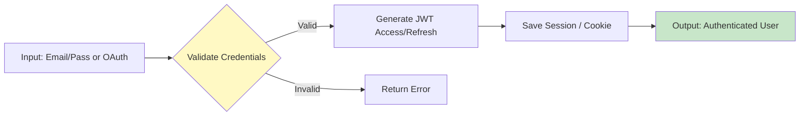

#### **Luồng 2: Quản lý Sự kiện & Đồng bộ (Event Management)**
Quy trình trung tâm xử lý dữ liệu lịch trình, đảm bảo tính nhất quán trên mọi nền tảng.

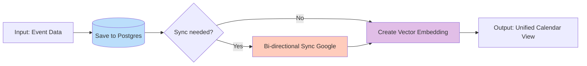

#### **Luồng 3: Hệ thống Đặt lịch (Booking System)**
Cho phép người dùng tạo trang đặt lịch cá nhân và nhận lịch hẹn từ người khác (Guest).

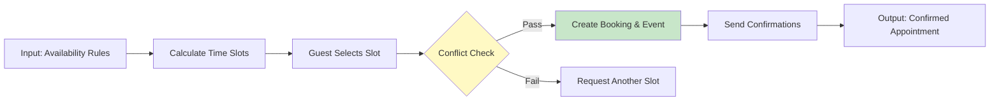

#### **Luồng 4: Trợ lý AI (AI Assistant)**
Hỗ trợ người dùng tra cứu thông tin và quản lý lịch trình thông qua ngôn ngữ tự nhiên.

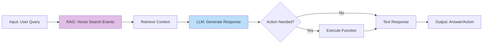

#### **Luồng 5: Quản lý Công việc (Task Management)**
Quản lý danh sách việc cần làm (To-do) tích hợp với lịch trình.

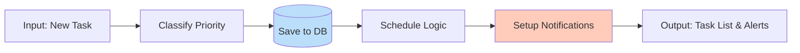

#### **Luồng 6: Hợp tác Nhóm (Team Collaboration)**
Cho phép làm việc nhóm, chia sẻ lịch và lên lịch họp chung.

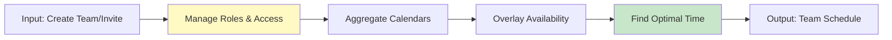

#### **Luồng 7: Khôi phục mật khẩu (Password Reset)**
Quy trình giúp người dùng lấy lại quyền truy cập khi quên mật khẩu thông qua bảo mật 2 lớp (Email Token).

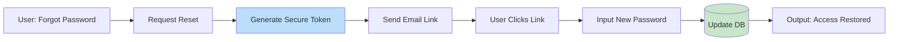

#### **Luồng 8: Email & Thông báo (Notification Delivery)**
Hệ thống xử lý thông báo bất đồng bộ qua hàng đợi để đảm bảo hiệu năng và độ tin cậy.

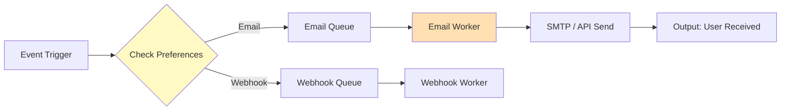

#### **Luồng 9: Webhook Outgoing (Webhook Delivery)**
Cơ chế gửi dữ liệu sang hệ thống bên thứ 3 (Slack, CRM) khi có sự kiện.

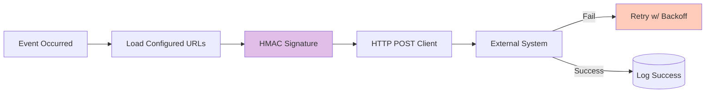

#### **Luồng 10: Blog CMS (Bài viết, tags, comments)**
Quy trình quản lý nội dung từ lúc soạn thảo đến khi xuất bản và tương tác.

```mermaid
graph LR
    Admin[Admin] --> Draft[Draft Post]
    Draft --> SEO[Optimize SEO]
    SEO --> Publish[(Publish to DB)]
    Publish --> Reader[Reader View]
    Reader --> Comment[Add Comment]
    Comment --> Mod{Moderation}
    Mod -- Approve --> Public[Comment Visible]

    style Draft fill:#bbdefb
    style Mod fill:#fff9c4
```

#### **Luồng 11: Analytics/Report (Tổng hợp số liệu)**
Quy trình tổng hợp dữ liệu thô thành biểu đồ báo cáo hiệu suất.

```mermaid
graph LR
    Request[View Dashboard] --> Agg[Aggregate Service]
    Agg --> Query[(Query DB)]
    Query --> Calc[Calculate Metrics]
    Calc --> Format[Format JSON Data]
    Format --> Chart[Render Charts]

    style Agg fill:#e1bee7
    style Calc fill:#c8e6c9
```

#### **Luồng 12: Xử lý xung đột đồng bộ (Sync Conflict Resolution)**
Cơ chế phát hiện và giải quyết mâu thuẫn dữ liệu giữa Calento và Google Calendar.

```mermaid
graph TD
    Sync[Sync Process] --> Detect{Conflict?}
    Detect -- No --> Update[(Update DB)]
    Detect -- Yes --> Log[Log Conflict]
    Log --> Notify[Notify User]
    Notify --> UserDecide[User Selects Strategy]
    UserDecide -- Keep Local --> OverwriteG[Overwrite Google]
    UserDecide -- Keep Google --> OverwriteL[Overwrite Local]
    UserDecide -- Keep Both --> Clone[Create Copy]

    style Detect fill:#ffccbc
    style UserDecide fill:#fff9c4
```

---

### **3.3.5. Sơ đồ tuần tự (Sequence Diagrams)**

Các biểu đồ sau đây mô tả chi tiết tương tác kỹ thuật giữa các thành phần hệ thống cho từng luồng nghiệp vụ nêu trên.

#### **Sequence Diagram 1: Đăng nhập & Xác thực (Authentication Flow)**

```mermaid
sequenceDiagram
    participant U as User
    participant C as Client
    participant A as Auth Service
    participant G as Google OAuth
    participant DB as Database
    participant J as JWT Service

    Note over U, DB: Login Flow (Hỗ trợ Local & Google)

    alt Google Login
        U->>C: Click "Login with Google"
        C->>G: Direction to Google Consent
        G-->>C: Auth Code
        C->>A: POST /auth/google/login {code}
        A->>G: Verify Code & Get Profile
        G-->>A: User Profile (Email, Name)
    else Local Login
        U->>C: Input Email/Pass
        C->>A: POST /auth/login
        A->>DB: Find User & Validate Hash
    end

    A->>DB: Sync User Record
    A->>J: Generate Tokens (Access + Refresh)
    J-->>A: {accessToken, refreshToken}
    
    A-->>C: Set HttpOnly Cookie (Refresh) + JSON (Access)
    C-->>U: Redirect to Dashboard
```

#### **Sequence Diagram 2: Quy trình Sự kiện (Event Process)**

```mermaid
sequenceDiagram
    participant U as User
    participant C as Client
    participant S as Event Controller
    participant ES as Event Service
    participant DB as Database
    participant G as Google Sync Service
    participant V as Vector Service (AI)

    Note over U, V: Quy trình CRUD Sự Kiện (Create - Read - Update - Delete)

    opt 1. Create / Update Flow
        U->>C: Create/Update Event
        C->>S: POST/PATCH /events
        S->>ES: createOrUpdate(dto)
        
        rect rgb(240, 248, 255)
            Note over ES, G: Core Data & Sync
            ES->>DB: UPSERT Event
            DB-->>ES: event data
            
            opt If Google Connected
                ES->>G: Sync to Google (Insert/Update)
                G-->>ES: googleId
            end
        end

        rect rgb(255, 248, 240)
            Note over ES, V: AI Context Sync
            ES->>V: syncEventToVector(event)
            Note right of V: Generate/Update Embedding
            V-->>ES: Success
        end
        
        ES-->>S: Return Event
        S-->>C: Success
    end

    opt 2. Read Flow (Get/List)
        U->>C: View Calendar/Event
        C->>S: GET /events
        S->>ES: findAll(filter)
        ES->>DB: SELECT * FROM events
        DB-->>ES: events[]
        ES-->>S: events[]
        S-->>C: Display Events
    end

    opt 3. Delete Flow
        U->>C: Delete Event
        C->>S: DELETE /events/:id
        S->>ES: delete(id)
        
        par Cleanup Data
            ES->>DB: DELETE FROM events
            and
            ES->>G: Delete from Google
            and
            ES->>V: Delete Vector Embedding
        end
        
        ES-->>S: Success
        S-->>C: Success
    end
```

#### **Sequence Diagram 3: Quy trình Đặt lịch (Booking Process)**

```mermaid
sequenceDiagram
    participant G as Guest
    participant C as Public Page
    participant S as Booking Controller
    participant BS as Booking Service
    participant AS as Availability Service
    participant DB as Database
    participant N as Notification

    G->>C: View Booking Link
    C->>S: GET /slots
    S->>AS: calculateAvailableSlots()
    AS->>DB: Fetch Events & Schedule
    AS-->>S: Available Slots []
    S-->>C: Show Slots
    
    G->>C: Select Slot & Confirm
    C->>S: POST /bookings
    S->>BS: createBooking()
    
    BS->>AS: validateSlot(Double-Check)
    
    alt Slot Available
        BS->>DB: Transaction: Create Booking + Event
        DB-->>BS: Success
        
        par Emails
            BS->>N: Send Confirmation to Guest
            BS->>N: Send Alert to Host
        end
        
        BS-->>S: Booking Confirmed
        S-->>C: Success Page
    else Slot Taken
        BS-->>S: Error (Conflict)
        S-->>C: Error Message
    end
```

#### **Sequence Diagram 4: AI Chatbot với RAG**

```mermaid
sequenceDiagram
    participant U as User (Frontend)
    participant API as API Gateway
    participant RAG as RAG Service
    participant VEC as Vector Service
    participant DB as PostgreSQL (pgvector)
    participant LLM as Gemini LLM Service
    participant SSE as SSE Stream

    U->>API: POST /chat "Tôi bận lúc nào?"
    
    Note over API,DB: Retrieval Phase
    API->>RAG: process(question)
    RAG->>VEC: Embed(question)
    VEC-->>RAG: vector
    RAG->>DB: Search Top-K Similar Events
    DB-->>RAG: Context Events []
    
    Note over RAG,LLM: Generation Phase
    RAG->>LLM: Prompt = Context + Question
    LLM-->>SSE: Stream Response
    SSE-->>U: "Bạn có cuộc họp lúc 9h..."
```

#### **Sequence Diagram 5: Quản lý Công việc (Task Flow)**

```mermaid
sequenceDiagram
    participant U as User
    participant TS as Task Service
    participant DB as Database
    participant SCH as Scheduler (BullMQ)
    participant N as Notification

    U->>TS: Create Task (Title, DueDate, Priority)
    TS->>DB: INSERT INTO tasks
    DB-->>TS: task_id
    
    opt Has Due Date
        TS->>SCH: scheduleReminder(task_id, due_date - 30m)
        SCH-->>TS: job_id
    end
    
    TS-->>U: Task Created
    
    Note over SCH,N: When Due Date Approaches
    SCH->>N: triggerReminder()
    N-->>U: Push Notification / Email
```

#### **Sequence Diagram 6: Hợp tác Nhóm (Team Collaboration)**

```mermaid
sequenceDiagram
    participant Owner
    participant Member
    participant TM as Team Service
    participant DB as Database
    participant Mail as Email Service

    Owner->>TM: Create Team "Marketing"
    TM->>DB: Insert Team
    
    Owner->>TM: Invite Member (email)
    TM->>DB: Create Invitation Token
    TM->>Mail: Send Invite Link
    Mail-->>Member: Email "Join Team"
    
    Member->>TM: Click Join Link
    TM->>DB: Verify Token & Add Member
    DB-->>TM: Success
    
    TM->>Owner: Notify "Member Joined"
```

#### **Sequence Diagram 7: Khôi phục Mật khẩu (Password Reset)**

```mermaid
sequenceDiagram
    participant User
    participant Client
    participant Server
    participant DB
    participant Email
    
    User->>Client: Click "Forgot Password"
    Client->>Server: POST /auth/forgot-password
    Server->>DB: Generate Token
    Server->>Email: Send Link
    Email-->>User: Email with Token
    
    User->>Client: Click Link & New Pass
    Client->>Server: POST /auth/reset-password
    Server->>DB: Validate & Update Pass
    Server-->>Client: Success
```

#### **Sequence Diagram 8: Gửi Email/Thông báo (Notification Delivery)**

```mermaid
sequenceDiagram
    participant S as Service
    participant Q as Redis Queue
    participant W as Worker
    participant T as Template Engine
    participant M as Mailer (SMTP)

    S->>Q: addJob('send-email', {userId, type})
    Q-->>S: jobId (Ack)
    
    Note right of Q: Async Process
    W->>Q: processJob()
    Q-->>W: jobData
    
    W->>T: render(template, data)
    T-->>W: htmlContent
    
    W->>M: sendMail(to, subject, html)
    M-->>W: Success
    
    W->>Q: jobCompleted()
```

#### **Sequence Diagram 9: Webhook Delivery (Outgoing Webhook)**

```mermaid
sequenceDiagram
    participant E as Event
    participant S as Webhook Service
    participant W as Webhook Worker
    participant EXT as External API

    E->>S: trigger('booking.created', payload)
    S->>W: enqueue(url, payload, secret)
    
    W->>W: sign = HMAC_SHA256(payload, secret)
    
    loop Retry Strategy (3 times)
        W->>EXT: POST /endpoint (headers: X-Signature)
        alt Success 200 OK
            EXT-->>W: 200 OK
            W->>W: Log Success
        else Failure
            EXT-->>W: 500 / Timeout
            W->>W: Wait (Backoff) & Retry
        end
    end
```

#### **Sequence Diagram 10: Xử lý xung đột đồng bộ (Sync Conflict Resolution)**

```mermaid
sequenceDiagram
    participant Job as Sync Job
    participant DB as Database
    participant U as User
    participant API as API

    Job->>DB: Fetch Local Event
    Job->>DB: Fetch Google Event (via API)
    
    Note over Job: Compare updated_at
    
    alt Both Modified
        Job->>DB: INSERT INTO conflicts (local_id, google_id, reason)
        Job->>U: Notify "Sync Conflict"
    end
    
    U->>API: Resolve Conflict (Selection: Use Google)
    API->>DB: UPDATE events SET ... (from Google Data)
    API->>DB: DELETE FROM conflicts
    API-->>U: Success
```

#### **Sequence Diagram 11: Blog CMS (Create Post / Moderate Comment)**

```mermaid
sequenceDiagram
    participant Admin
    participant Reader
    participant CMS as CMS Service
    participant DB as Database

    Note over Admin, DB: Create Post
    Admin->>CMS: Create Post (Markdown)
    CMS->>DB: Save (Status: Draft)
    Admin->>CMS: Publish
    CMS->>DB: Update Status: Published
    
    Note over Reader, DB: Comment Flow
    Reader->>CMS: Post Comment
    CMS->>DB: Save (Status: Pending)
    
    Admin->>CMS: Approve Comment
    CMS->>DB: Update Status: Approved
    CMS-->>Reader: Comment Visible
```

#### **Sequence Diagram 12: Analytics/Report (Aggregate Metrics)**

```mermaid
sequenceDiagram
    participant U as User
    participant A as Analytics Controller
    participant S as Aggregation Service
    participant DB as Database

    U->>A: View Dashboard (Last 30 Days)
    A->>S: getOverviewMetrics(userId, range)
    
    par Parallel Queries
        S->>DB: Count Events
        S->>DB: Sum Duration
        S->>DB: Group By Category
    end
    
    DB-->>S: Raw Data
    S->>S: Calculate Growth % (vs previous)
    S-->>A: JSON Metrics
    A-->>U: Render Charts
```

### **3.4.3 Progressive Web App (PWA)**

Hệ thống Calento được xây dựng theo chuẩn PWA (Progressive Web App) để mang lại trải nghiệm giống ứng dụng Native (Native-app-like experience) trên cả Mobile và Desktop.

#### **3.4.3.1 PWA: App Manifest (manifest.json)**
File cấu hình `manifest.json` giúp trình duyệt nhận diện ứng dụng, cho phép cài đặt vào màn hình Home và hiển thị splash screen.

*   **Name**: Calento - AI Calendar Assistant
*   **Icons**: Bộ icon đa kích thước (192x192, 512x512) phục vụ cho các thiết bị Android, iOS và Desktop.
*   **Theme Color**: `#6366f1` (Màu chủ đạo thương hiệu).
*   **Display Mode**: `standalone` (Ẩn thanh địa chỉ trình duyệt, chạy full màn hình).
*   **Start URL**: `/dashboard` (Trang đích khi mở app).

#### **3.4.3.2 PWA: Service Worker (sw.js)**
Service Worker đóng vai trò như một proxy mạng, xử lý các request nền và quản lý cache. Calento sử dụng Workbox (thư viện của Google) để tối ưu Service Worker.

*   **Precaching**: Tự động tải trước (preload) các tài nguyên tĩnh (JS bundles, CSS, Images, Fonts) ngay lần tải đầu tiên.
*   **Runtime Caching**: Cache động các API response ít thay đổi (Ví dụ: danh sách Calendar, cấu hình User Settings).
*   **Offline Fallback**: Hiển thị trang "You are offline" thân thiện khi mất kết nối mạng, thay vì lỗi trình duyệt mặc định.

#### **3.4.3.3 PWA: Caching strategy**
Chiến lược cache được áp dụng linh hoạt tùy theo loại dữ liệu:

*   **Cache First**: Áp dụng cho static assets (Ảnh, Fonts, JS). Luôn lấy từ cache để tải trang tức thì, chỉ tải lại từ mạng khi có version mới.
*   **Network First (có timeout)**: Áp dụng cho dữ liệu quan trọng như danh sách Event, Booking. Ưu tiên lấy dữ liệu mới nhất từ Server, nếu mạng chậm hoặc mất kết nối thì mới dùng cache cũ.
*   **Stale-While-Revalidate**: Áp dụng cho data ít quan trọng hơn (Ví dụ: Blog posts). Hiển thị data cũ ngay lập tức, sau đó ngầm tải data mới và cập nhật giao diện.

#### **3.4.3.4 PWA: Offline & Background Sync**
*   **Offline Access**: Người dùng có thể xem lại lịch trình đã tải khi không có mạng.
*   **Background Sync**: Khi người dùng thực hiện hành động (như Update Event) lúc offline, request sẽ được lưu vào IndexedDB. Khi có mạng trở lại, Service Worker sẽ tự động gửi request lên server (Background Sync API).

#### **3.4.3.5 PWA: Push Notifications**
Tận dụng Web Push API để gửi thông báo ngay cả khi người dùng không mở tab ứng dụng:
*   **Nhắc nhở lịch họp**: Gửi trước 15 phút.
*   **Thông báo Booking mới**: Gửi ngay khi có khách đặt lịch.
*   Yêu cầu quyền: Hiển thị popup `Notification.requestPermission()` tại thời điểm hợp lý (Contextual permission).

### **3.4.4 Hệ thống Email & Thông báo (Email Notification Service)**

Hệ thống thông báo là thành phần quan trọng để giữ tương tác và nhắc nhở người dùng. Calento sử dụng kiến trúc Message Queue để xử lý việc gửi email/thông báo một cách tin cậy và hiệu năng cao.

#### **3.4.4.1 Email: Chức năng chính**
*   **Transactional Email**: Gửi ngay lập tức theo hành động (Xác thực tài khoản, Quên mật khẩu, Xác nhận Booking).
*   **Reminder Email**: Gửi theo lịch trình (Nhắc lịch họp sắp tới).
*   **Digest/Report**: Email tổng hợp lịch trình ngày/tuần (Optional).

#### **3.4.4.2 Email: Transactional Emails**
Sử dụng cho các email quan trọng, yêu cầu độ trễ thấp và độ tin cậy tuyệt đối.
*   **Flow**: User Action -> API -> Queue (Priority High) -> Worker -> SendGrid/Mailgun -> User Inbox.
*   **Ví dụ**: Email xác thực đăng ký (Verify Account), Mã OTP, Thông báo đổi mật khẩu.

#### **3.4.4.3 Email: Scheduling Notifications**
Xử lý các thông báo được lên lịch trước (Scheduled Jobs).
*   Khi một Event được tạo, hệ thống tính toán thời điểm gửi nhắc nhở (Ví dụ: Event lúc 10:00, nhắc lúc 09:45).
*   Sử dụng Redis Delayed Queue để "treo" job cho đến đúng thời điểm mới đẩy vào hàng đợi xử lý.

#### **3.4.4.4 Email: Automated Reminders (Cron/Jobs)**
Ngoài các nhắc nhở theo từng event, hệ thống có các Cron Jobs định kỳ:
*   **Daily Briefing**: Chạy lúc 07:00 AM mỗi ngày, tổng hợp lịch trình trong ngày gửi cho user.
*   **Cleanup**: Xóa các log email cũ, retry các email thất bại quá hạn.

#### **3.4.4.5 Email: Nodemailer (SMTP/Transport)**
Module `Nodemailer` trong Backend đảm nhận việc kết nối với Mail Server.
*   **Transport Config**: Hỗ trợ SMTP (Gmail, AWS SES) hoặc API driver (SendGrid, Mailgun).
*   **Pool Connection**: Giữ kết nối SMTP để tái sử dụng, tăng tốc độ gửi hàng loạt.
*   **DKIM/SPF Signing**: Đảm bảo email gửi đi đạt độ uy tín cao, tránh vào Spam.

#### **3.4.4.6 Email: BullMQ & Redis (Queue/Worker)**
Sử dụng thư viện `BullMQ` trên nền `Redis` để quản lý hàng đợi gửi email.
*   **Decoupling**: API Server chỉ đẩy yêu cầu vào Queue và trả lời User ngay lập tức (Non-blocking). Việc gửi email (tốn 1-2s) được Worker xử lý nền.
*   **Retries**: Tự động thử lại (Exponential backoff) nếu gửi thất bại (lỗi mạng, server mail quá tải).
*   **Rate Limiting**: Giới hạn tốc độ gửi để tránh bị nhà cung cấp Email khóa tài khoản (Ví dụ: Max 100 email/giây).

#### **3.4.4.7 Email: Handlebars (HTML Templates)**
Email được thiết kế chuyên nghiệp, responsive trên mọi thiết bị di động/desktop.
*   **Template Engine**: Sử dụng `Handlebars (.hbs)` để tách biệt logic code và giao diện HTML email.
*   **Variables**: Inject dữ liệu động (Tên User, Link Booking, Thời gian họp) vào template.
*   **Styles**: Sử dụng CSS Inline (hoặc thư viện like Juice) để đảm bảo hiển thị đúng trên các trình đọc mail cũ (Outlook).

## **3.5 Deployment (Triển khai hệ thống)**

### **3.5.1. Yêu cầu hệ thống (Prerequisites)**

Để đảm bảo hệ thống hoạt động ổn định và đồng nhất, việc cài đặt đúng các phiên bản công cụ là bước tiên quyết. Dưới đây là danh sách các công cụ bắt buộc:

| Công cụ | Phiên bản yêu cầu | Mục đích sử dụng |
| :--- | :--- | :--- |
| **Node.js** | >= 18.x | Môi trường runtime cho Backend (NestJS) và Frontend (Next.js). |
| **npm** | >= 9.x | Trình quản lý gói (Package manager), cài đặt tự động cùng Node.js. |
| **PostgreSQL** | >= 14 | Hệ quản trị cơ sở dữ liệu chính, lưu trữ thông tin người dùng và sự kiện. |
| **Redis** | >= 6 | Hệ thống lưu trữ in-memory dùng cho caching và hàng đợi (background jobs). |
| **Docker** | >= 20.x | Nền tảng container hóa, giúp thiết lập môi trường nhanh chóng và đồng nhất. |
| **Git** | >= 2.x | Hệ thống quản lý phiên bản mã nguồn phân tán. |

**Môi trường phát triển tích hợp (IDE):**

Visual Studio Code là IDE được khuyến nghị cho dự án này nhờ khả năng tùy biến cao và hệ sinh thái extension phong phú. Để tối ưu hóa quy trình phát triển, các extensions sau nên được cài đặt:

| Extension | Mục đích | Lợi ích |
| :--- | :--- | :--- |
| **ESLint** | Phân tích tĩnh mã nguồn | Phát hiện lỗi cú pháp và logic sớm, đảm bảo tuân thủ chuẩn code. |
| **Prettier** | Định dạng code tự động | Giữ cho phong cách code đồng nhất, dễ đọc trong toàn bộ dự án. |
| **TypeScript** | Hỗ trợ ngôn ngữ TypeScript | Cung cấp tính năng kiểm tra kiểu mạnh mẽ và IntelliSense. |
| **Tailwind CSS** | Hỗ trợ Tailwind CSS | Gợi ý class thông minh, giúp viết CSS nhanh và chính xác hơn. |
| **Thunder Client** | Client kiểm thử API | Cho phép gửi request và kiểm tra API trực tiếp trong giao diện IDE. |
| **GitLens** | Mở rộng tính năng Git | Hiển thị lịch sử thay đổi chi tiết từng dòng code (blame annotations). |

### **3.5.2. Cấu hình Backend**

Quá trình thiết lập Backend bao gồm việc sao chép mã nguồn, cài đặt thư viện và quan trọng nhất là cấu hình biến môi trường.

**1. Biến môi trường (.env)**

File `.env` chứa các thông tin cấu hình nhạy cảm và quan trọng. Dưới đây là bảng chi tiết các biến môi trường cần thiết lập:

*Bảng 3.3: Cấu hình biến môi trường Backend*

| Nhóm cấu hình | Tên biến | Mô tả và Giá trị mẫu |
| :--- | :--- | :--- |
| **Application** | `NODE_ENV` | Môi trường chạy (`development`, `production`). |
| | `PORT` | Cổng hoạt động của server (VD: 8000). |
| | `APP_URL` | URL gốc của ứng dụng Backend. |
| **Database** | `DB_HOST`, `DB_PORT` | Địa chỉ và cổng kết nối PostgreSQL (`localhost`, 5432). |
| | `DB_NAME` | Tên cơ sở dữ liệu (`tempra`). |
| | `DB_USER`, `DB_PASSWORD` | Thông tin xác thực truy cập database. |
| **Redis** | `REDIS_HOST`, `REDIS_PORT` | Địa chỉ và cổng kết nối Redis (`localhost`, 6379). |
| **JWT** | `JWT_SECRET` | Khóa bí mật để ký Access Token (Chuỗi ngẫu nhiên mạnh). |
| | `JWT_EXPIRES_IN` | Thời gian hết hạn Access Token (VD: 1h). |
| | `JWT_REFRESH_SECRET` | Khóa bí mật để ký Refresh Token. |
| | `JWT_REFRESH_EXPIRES_IN` | Thời gian hết hạn Refresh Token (VD: 7d). |
| **Google OAuth** | `GOOGLE_CLIENT_ID` | Client ID từ Google Cloud Console. |
| | `GOOGLE_CLIENT_SECRET` | Client Secret từ Google Cloud Console. |
| | `GOOGLE_REDIRECT_URI` | URL callback sau khi đăng nhập (VD: `.../auth/google/callback`). |
| **Gemini AI** | `GEMINI_API_KEY` | API Key để truy cập dịch vụ Google Gemini. |
| **Email (SMTP)** | `SMTP_HOST`, `SMTP_PORT` | Cấu hình máy chủ gửi mail (VD: `smtp.gmail.com`, 587). |
| | `SMTP_USER`, `SMTP_PASSWORD` | Tài khoản và mật khẩu ứng dụng (App Password). |

**2. Khởi tạo Database**

Sau khi cấu hình kết nối trong file `.env` hoàn tất, cơ sở dữ liệu `tempra_dev` sẽ được khởi tạo cấu trúc tự động thông qua việc chạy lệnh `npm run migrate:up:dev`. Lệnh này kích hoạt công cụ migration, thực thi tuần tự các scripts SQL để kiến tạo toàn bộ schema, triggers và các extensions cần thiết (bao gồm `pgvector`).

**3. Khởi chạy Server**

Để bắt đầu quy trình phát triển, server backend được khởi động bằng lệnh `npm run start:dev`. Terminal sẽ hiển thị logs khởi động của NestJS, và khi hệ thống sẵn sàng, developers có thể truy cập Swagger UI để thử nghiệm API.

### **3.5.3 Cấu hình Frontend**

Việc thiết lập Frontend tương tự như Backend nhưng tập trung vào các biến môi trường phục vụ cho phía client.

**1. Cài đặt và Cấu hình**

Sau khi di chuyển vào thư mục `client` và cài đặt dependencies, file `.env.local` cần được tạo để chứa các biến môi trường công khai.

*Bảng cấu hình biến môi trường Frontend (.env.local)*

| Tên biến | Mô tả | Giá trị mẫu |
| :--- | :--- | :--- |
| `NEXT_PUBLIC_APP_NAME` | Tên hiển thị của ứng dụng. | Calento |
| `NEXT_PUBLIC_APP_FE_URL` | URL gốc của Frontend. | `http://localhost:3000` |
| `NEXT_PUBLIC_API_URL` | URL gốc của Backend API. | `http://localhost:8000` |
| `NEXT_PUBLIC_API_PREFIX` | Tiền tố đường dẫn API. | `api/v1` |

**2. Khởi chạy Ứng dụng**

Lệnh `npm run dev` sẽ khởi động Next.js development server. Ứng dụng sau đó có thể được truy cập tại `http://localhost:3000`. Nhờ tính năng Hot Module Replacement (HMR), mọi thay đổi trong mã nguồn Frontend sẽ được cập nhật tức thì trên trình duyệt mà không cần tải lại trang, giúp tăng tốc độ phát triển giao diện.

### **3.5.4 Deploy**

**Docker Compose & Containerization**

Hệ thống được container hóa toàn diện với Docker Compose. Chỉ với câu lệnh `docker-compose up -d` tại thư mục gốc, toàn bộ hệ sinh thái dịch vụ sẽ được khởi tạo và kết nối tự động trong mạng nội bộ Docker.

| Service | Mô tả |
| :--- | :--- |
| `frontend` | Ứng dụng frontend (Next.js / React), phục vụ giao diện người dùng |
| `backend` | API server (NestJS / Node.js), xử lý logic nghiệp vụ |
| `nginx` | Reverse proxy, xử lý HTTPS, routing và bảo mật |
| `database` | PostgreSQL (container hoặc managed service) |

### **3.5.5. Quản lý Tên miền và Hạ tầng mạng**

Quy trình thiết lập tên miền và hạ tầng mạng được thực hiện qua các bước sau để đảm bảo hiệu suất và bảo mật tối ưu.

**1. Sơ đồ triển khai (Deployment Architecture)**

```mermaid
graph LR
    User((User)) -->|HTTPS/443| CF[Cloudflare CDN]
    CF -->|Strict SSL| Nginx[Nginx Reverse Proxy]
    
    subgraph "VPS Server (Docker Network)"
        Nginx -->|Proxy :3000| FE[Frontend Container]
        Nginx -->|Proxy :8000| BE[Backend Container]
        BE -->|TCP :5432| DB[(PostgreSQL)]
        BE -->|TCP :6379| Redis[(Redis)]
    end
    
    style CF fill:#f38020,stroke:#f38020,color:white
    style Nginx fill:#009639,stroke:#009639,color:white
```

**2. Quản lý Tên miền (Domain Management)**

*   **Nhà đăng ký (Registrar)**: Tên miền `calento.space` được mua và đăng ký thông qua **GoDaddy** - nhà cung cấp tên miền uy tín hàng đầu.
*   **Nameservers**: Thay vì sử dụng DNS mặc định của GoDaddy, nameservers được trỏ về hệ thống của Cloudflare (`ns1.cloudflare.com` và `ns2.cloudflare.com`). Điều này cho phép tận dụng hạ tầng phân phối nội dung (CDN) và tường lửa ứng dụng web (WAF) miễn phí của Cloudflare.
*   **Quản lý DNS**: Toàn bộ các bản ghi DNS (A Records, CNAME, MX) được quản lý tập trung tại Cloudflare Dashboard. Việc này giúp cải thiện tốc độ phân giải tên miền (DNS lookup time) và cung cấp khả năng cập nhật bản ghi tức thì (instant propagation).

### **3.5.6. Cấu hình Máy chủ**

Máy chủ được cấu hình với thông số kỹ thuật tối ưu cho giai đoạn khởi chạy, đảm bảo cân bằng giữa hiệu năng và chi phí.

| Thành phần | Thông số kỹ thuật | Ghi chú |
| :--- | :--- | :--- |
| **Nhà cung cấp** | Digital Ocean, GCP | Basic Droplet Plan |
| **CPU** | 2 vCPUs (Intel) | Đủ khả năng xử lý các tác vụ đồng thời. |
| **RAM** | 4 GB | Đảm bảo đủ bộ nhớ cho Docker containers và cache. |
| **Lưu trữ** | 80 GB SSD | Tốc độ truy xuất cao cho Database. |
| **Hệ điều hành** | Ubuntu 22.04 LTS (x64) | Phiên bản ổn định, hỗ trợ lâu dài. |
| **Vị trí** | Singapore (SGP1) | Giảm độ trễ cho người dùng khu vực Đông Nam Á. |


##### Hình 21: VM Instance Google Cloud Platform {#hình-21:-vm-instance-google-cloud-platform}

**1. Nginx Reverse Proxy**

Nginx được cấu hình làm cổng vào duy nhất cho mọi traffic HTTP/HTTPS. Cấu hình server block cho `calento.space` xử lý traffic frontend, tự động chuyển hướng HTTP sang HTTPS và áp dụng các headers bảo mật như HSTS và X-Frame-Options. Server block cho `api.calento.space` xử lý traffic backend, hỗ trợ CORS và WebSocket upgrades.

*Cấu hình chính:*
- **Frontend Block**: Proxy pass tới `localhost:3000`. Cache static files 1 năm.
- **Backend Block**: Proxy pass tới `localhost:8000`. Rate limiting 10 req/s.
- **Headers**: `X-Forwarded-For`, `X-Real-IP`, `Upgrade` (cho WebSocket).

**2. Cloudflare CDN và Bảo mật**

Cloudflare quản lý DNS và cung cấp lớp bảo mật mạng.

| Loại | Tên | Nội dung | Trạng thái Proxy |
| :--- | :--- | :--- | :--- |
| A | @ | `<droplet_ip>` | Proxied |
| A | www | `<droplet_ip>` | Proxied |
| A | api | `<droplet_ip>` | Proxied |
| CNAME | cdn | `calento.space` | Proxied |


##### Hình 22: CloudFlare DNS Record {#hình-22:-cloudflare-dns-record}

**3. Google Search Console**

Google Search Console (GSC) được sử dụng để theo dõi hiệu suất SEO, kiểm soát khả năng index và phát hiện sớm các vấn đề ảnh hưởng đến khả năng hiển thị của website trên Google Search.

*Mục tiêu sử dụng Google Search Console:*
- Đảm bảo website `calento.space` được Google index chính xác
- Theo dõi lượng truy cập tìm kiếm tự nhiên (Organic Search)
- Phát hiện lỗi kỹ thuật ảnh hưởng SEO
- Tối ưu hiệu suất Core Web Vitals

**4. Cấu hình Google Search Console**

- **Property type**: Domain Property
- **Domain**: `calento.space`
- **Xác minh quyền sở hữu**: DNS Verification thông qua Cloudflare
- **Áp dụng cho**: `https://calento.space`, `https://www.calento.space`, `https://api.calento.space` (API không index)


##### Hình 23: Google Search Console {#hình-23:-google-search-console}

## **3.6 Thiết kế API**

Hệ thống Calento cung cấp một bộ RESTful API toàn diện, được thiết kế xoay quanh các tài nguyên (resources) và tuân thủ chặt chẽ các nguyên tắc kiến trúc REST. API đóng vai trò là xương sống giao tiếp giữa frontend (Next.js) và backend (NestJS), cũng như cho phép các integrations từ bên thứ ba trong tương lai.

### **3.6.1 Kiến trúc & nguyên lý thiết kế**

API của Calento được xây dựng dựa trên kiến trúc Layered Architecture của NestJS, đảm bảo tính separation of concerns. Mọi endpoint đều tuân theo quy tắc đặt tên danh từ số nhiều (plural nouns) để chỉ định tài nguyên (ví dụ: `/users`, `/events`) và sử dụng các HTTP verbs chuẩn (`GET`, `POST`, `PATCH`, `DELETE`) để định nghĩa hành động.

Dữ liệu trao đổi giữa client và server hoàn toàn sử dụng định dạng JSON (JavaScript Object Notation), đảm bảo tính lightweight và dễ dàng parsing trên mọi nền tảng. Mỗi response từ server đều có structure nhất quán, bao gồm `statusCode`, `message`, và `data` (đối với success response) hoặc `error` details (đối với failure), giúp frontend dễ dàng handle các trạng thái khác nhau của application.

### **3.6.2 Cơ chế xác thực & bảo mật**

Bảo mật là ưu tiên hàng đầu trong thiết kế API. Hệ thống sử dụng cơ chế xác thực dựa trên token (Token-based Authentication) với chuẩn JWT (JSON Web Tokens).

*   **Bearer Token Authentication:** Mọi request đến các protected endpoints đều bắt buộc phải đính kèm Access Token hợp lệ trong header `Authorization` dưới dạng `Bearer <token>`. Access Token này chứa các claims đã được ký (userId, email, role), cho phép server xác định danh tính user mà không cần tra cứu database liên tục (stateless authentication).

*   **Refresh Token Rotation:** Để cân bằng giữa UX và bảo mật, Access Token có thời gian sống ngắn (1 giờ). Khi hết hạn, client sử dụng Refresh Token (thời hạn 7 ngày, lưu trong HttpOnly cookie) để request cấp phát cặp token mới. Cơ chế rotation này giúp phát hiện lạm dụng token.

*   **Rate Limiting và Security Headers:** Áp dụng rate limiting cho các endpoints nhạy cảm như `/auth/login`. Sử dụng Helmet và CORS policies cấu hình chặt chẽ.

### **3.6.3 Chiến lược phiên bản hóa (Versioning)**

Để đảm bảo tính tương thích ngược (backward compatibility), Calento áp dụng chiến lược phiên bản hóa qua URL (URI Path Versioning). Tất cả các endpoints đều có prefix `/api/v1`. Chiến lược này cho phép deploy tính năng mới tại `/api/v2` mà không ảnh hưởng người dùng cũ.

### **3.6.4 Các nhóm tài nguyên chính**

Hệ thống API được tổ chức thành các nhóm module function-centric:

*   **Auth & Users Module:** Endpoints cho authentication (Login, Register, OAuth) và quản lý identity.
*   **Calendar & Events Module:** Xử lý logic nghiệp vụ cốt lõi, CRUD sự kiện, đồng bộ Google Calendar.
*   **Public Booking Module:** Phục vụ tính năng đặt lịch công khai, xử lý transaction booking.
*   **AI Integration Module:** Endpoints cho Chat AI (SSE Streaming) và RAG.

### **3.6.5 Danh sách API chi tiết (Endpoints)**

Dưới đây là bảng đặc tả các API endpoints quan trọng nhất:

| Module | Method | Endpoint | Mô tả chức năng | Auth |
| :--- | :---: | :--- | :--- | :---: |
| **Auth** | POST | `/api/v1/auth/register` | Đăng ký tài khoản mới | No |
| | POST | `/api/v1/auth/login` | Đăng nhập (Email/Password) | No |
| |POST | `/api/v1/auth/logout` | Đăng xuất (Clear cookie) | Yes |
| | POST | `/api/v1/auth/refresh` | Làm mới Access Token | No |
| | GET | `/api/v1/auth/me` | Lấy thông tin User hiện tại | Yes |
| | GET | `/api/v1/auth/verify` | Kiểm tra trạng thái đăng nhập | No |
| | GET | `/api/v1/auth/google/url` | Lấy URL đăng nhập Google | No |
| | POST | `/api/v1/auth/google/login` | Đăng nhập bằng Google Code | No |
| | POST | `/api/v1/auth/forgot-password` | Yêu cầu reset mật khẩu | No |
| | POST | `/api/v1/auth/reset-password` | Đặt lại mật khẩu mới | No |
| **Users** | POST | `/api/v1/users` | Tạo user (Admin) | No |
| | GET | `/api/v1/users` | Lấy danh sách users | Yes |
| | GET | `/api/v1/users/search` | Tìm kiếm users | Yes |
| | GET | `/api/v1/users/settings` | Lấy cài đặt cá nhân | Yes |
| | PATCH | `/api/v1/users/settings` | Cập nhật cài đặt cá nhân | Yes |
| | GET | `/api/v1/users/:id` | Lấy chi tiết user | Yes |
| | PUT | `/api/v1/users/:id` | Cập nhật thông tin user | Yes |
| | DELETE | `/api/v1/users/:id` | Xóa user (Admin) | Yes |
| **Events** | GET | `/api/v1/events` | Lấy danh sách sự kiện | Yes |
| | POST | `/api/v1/events` | Tạo sự kiện mới | Yes |
| | GET | `/api/v1/events/recurring/expand` | Mở rộng sự kiện lặp lại | Yes |
| | GET | `/api/v1/events/:id` | Lấy chi tiết sự kiện | Yes |
| | PUT | `/api/v1/events/:id` | Cập nhật toàn bộ sự kiện | Yes |
| | PATCH | `/api/v1/events/:id` | Cập nhật một phần sự kiện | Yes |
| | DELETE | `/api/v1/events/:id` | Xóa sự kiện | Yes |
| | POST | `/api/v1/events/sync-attendees` | Đồng bộ người tham gia | Yes |
| | POST | `/api/v1/events/:id/invitations/send`| Gửi email mời họp | Yes |
| | GET | `/api/v1/events/invitation/:token` | Xem chi tiết lời mời | No |
| | POST | `/api/v1/events/invitation/:token/respond` | Phản hồi lời mời | No |
| **Booking Links** | POST | `/api/v1/booking-links` | Tạo link đặt lịch cá nhân | Yes |
| | GET | `/api/v1/booking-links` | Danh sách link của tôi | Yes |
| | GET | `/api/v1/booking-links/active` | Danh sách link đang hoạt động | Yes |
| | GET | `/api/v1/booking-links/:id` | Chi tiết Booking Link | Yes |
| | PATCH | `/api/v1/booking-links/:id` | Cập nhật Booking Link | Yes |
| | DELETE | `/api/v1/booking-links/:id` | Xóa Booking Link | Yes |
| **Bookings** | GET | `/api/v1/bookings/public/:slug` | Lấy trang đặt lịch công khai| No |
| | GET | `/api/v1/bookings/public/:slug/slots`| Lấy khung giờ rảnh (Public)| No |
| | POST | `/api/v1/bookings/:slug` | Khách thực hiện đặt lịch | No |
| | GET | `/api/v1/bookings/stats` | Thống kê số lượng booking | Yes |
| | GET | `/api/v1/bookings/me` | Lịch sử booking của tôi | Yes |
| | GET | `/api/v1/bookings/me/upcoming` | Booking sắp tới của tôi | Yes |
| | POST | `/api/v1/bookings/:id/cancel` | Hủy lịch hẹn | Yes |
| | POST | `/api/v1/bookings/:id/reschedule`| Dời lịch hẹn | Yes |
| **Calendars** | GET | `/api/v1/calendars` | Danh sách lịch connected | Yes |
| | GET | `/api/v1/calendars/primary` | Lấy lịch chính (Primary) | Yes |
| | POST | `/api/v1/calendars` | Tạo lịch mới (Local) | Yes |
| | PUT | `/api/v1/calendars/:id` | Cập nhật lịch | Yes |
| | DELETE | `/api/v1/calendars/:id` | Xóa lịch | Yes |
| **Teams** | POST | `/api/v1/teams` | Tạo Team mới | Yes |
| | GET | `/api/v1/teams` | Team tôi tham gia | Yes |
| | GET | `/api/v1/teams/owned` | Team tôi sở hữu | Yes |
| | POST | `/api/v1/teams/:id/members` | Mời thành viên vào Team | Yes |
| | POST | `/api/v1/teams/invitations/:token/accept` | Chấp nhận lời mời | Yes |
| | POST | `/api/v1/teams/:id/rituals` | Tạo lịch hoạt động nhóm | Yes |
| | GET | `/api/v1/teams/:id/heatmap` | Biểu đồ nhiệt rảnh rỗi | Yes |
| | GET | `/api/v1/teams/:id/optimal-times`| Gợi ý giờ họp tối ưu | Yes |
| **Tasks** | POST | `/api/v1/tasks` | Tạo công việc mới | Yes |
| | GET | `/api/v1/tasks` | Lấy danh sách công việc | Yes |
| | GET | `/api/v1/tasks/overdue` | Công việc quá hạn | Yes |
| | PATCH | `/api/v1/tasks/:id/status` | Cập nhật trạng thái Task | Yes |
| **AI** | GET | `/api/v1/ai/health` | Kiểm tra dịch vụ AI | Yes |
| | POST | `/api/v1/ai/chat` | Chat với AI (Normal) | Yes |
| | POST | `/api/v1/ai/chat/stream` | Chat với AI (SSE Stream) | Yes |
| | GET | `/api/v1/ai/conversations` | Lịch sử hội thoại | Yes |
| | POST | `/api/v1/ai/actions/confirm` | Xác nhận hành động AI | Yes |
| **RAG** | POST | `/api/v1/rag/context` | Thêm context cho AI | Yes |
| | GET | `/api/v1/rag/contexts` | Lấy danh sách context | Yes |


