# **Chương IV. THIẾT KẾ MÀN HÌNH**

Chương này trình bày chi tiết về thiết kế giao diện người dùng (User Interface - UI) và trải nghiệm người dùng (User Experience - UX) của hệ thống Calento. Thiết kế tập trung vào sự tối giản, hiện đại và tính dễ sử dụng, tuân thủ các nguyên tắc của Material Design và Accessibility (WCAG).

## **4.1. Sơ đồ liên kết màn hình (Screen Flow)**

Hệ thống được tổ chức thành các luồng màn hình logic, giúp người dùng điều hướng dễ dàng giữa các chức năng. Sơ đồ dưới đây minh họa mối quan hệ và luồng di chuyển giữa các màn hình chính.

```mermaid
graph TD
    %% Public Area
    subgraph Public[Public Pages]
        Home[Landing Page]
        About[About Us]
        Pricing[Pricing]
        BlogList[Blog Listing] --> BlogDetail[Blog Detail]
        PublicBooking[Public Booking Page] --> BookingConfirm[Booking Confirmation]
    end

    %% Auth Area
    subgraph Auth[Authentication]
        Login[Login Screen] -->|Forgot Password| ForgotPwd[Forgot Password]
        Register[Register Screen] -->|Verify Email| OTP[OTP/Email Verification]
        OAuth[Google OAuth Callback]
    end

    %% Dashboard Area
    subgraph Dashboard[Dashboard Workspace]
        HomeDashboard[Home Dashboard]
        
        %% Calendar Group
        subgraph CalModule[Calendar Management]
            CalMonth[Calendar Month View]
            CalWeek[Calendar Week View]
            CalDay[Calendar Day View]
            EventCreate[Create Event Modal]
            EventDetail[Event View/Edit Modal]
        end

        %% Booking Group
        subgraph BookModule[Booking System]
            BookingList[Booking Links Manager]
            BookingCreate[Create Booking Type]
            BookingSettings[Booking Settings]
            AvailSettings[Availability Rules]
        end

        %% Task Group
        subgraph TaskModule[Task Management]
            TaskBoard[Kanban Board]
            TaskList[Task List View]
        end

        %% Team Group
        subgraph TeamModule[Team Collaboration]
            TeamList[Team List]
            TeamDetail[Team Dashboard]
            TeamSettings[Team Settings]
        end

        %% AI Group
        subgraph AIModule[Ai Assistant]
            AIChat[AI Sidebar/Panel]
        end

        %% Settings Group
        subgraph SettingModule[Settings]
            Profile[User Profile]
            Integ[Integrations]
            Pref[Preferences]
            Billing[Billing]
        end
    end

    %% Connections
    Home --> Login
    Home --> Register
    
    Login -->|Success| HomeDashboard
    Register -->|Success| HomeDashboard
    OAuth -->|Success| HomeDashboard
    
    HomeDashboard --> CalMonth
    HomeDashboard --> BookingList
    HomeDashboard --> TaskBoard
    HomeDashboard --> AIChat
    HomeDashboard --> Profile
    
    %% Calendar Flows
    CalMonth -->|Switch View| CalWeek
    CalWeek -->|Switch View| CalDay
    CalMonth -->|Click Slot| EventCreate
    CalMonth -->|Click Event| EventDetail
    
    %% Booking Flows
    BookingList -->|Create New| BookingCreate
    BookingList -->|Edit| BookingSettings
    BookingSettings --> AvailSettings
    
    %% Task Flows
    TaskBoard -->|Toggle View| TaskList
    
    %% Team Flows
    HomeDashboard --> TeamList
    TeamList -->|Select Team| TeamDetail
    TeamDetail -->|Manage| TeamSettings

    %% Navigation
    User((User)) --> Home
    Guest((Guest)) --> PublicBooking
    
    style HomeDashboard fill:#e3f2fd,stroke:#2196f3,stroke-width:2px
    style PublicBooking fill:#e8f5e9,stroke:#4caf50
    style AIChat fill:#f3e5f5,stroke:#9c27b0
```

## **4.2. Thiết kế UI/UX**

### **4.2.1. Triết lý thiết kế (Design Philosophy)**
Hệ thống Calento theo đuổi triết lý thiết kế **"User-Centric Minimalism"** (Tối giản lấy người dùng làm trung tâm). Nhóm tin rằng một công cụ quản lý thời gian hiệu quả phải là công cụ "vô hình" - không làm phiền người dùng với các chi tiết thừa thãi mà tập trung tối đa vào nội dung cốt lõi: Lịch trình và Công việc.

Các nguyên tắc chính:
1. **Clarity (Sự rõ ràng)**: Thông tin quan trọng nhất luôn được làm nổi bật. Sử dụng khoảng trắng (whitespace) hợp lý để giảm tải nhận thức (cognitive load).
2. **Efficiency (Sự hiệu quả)**: Giảm thiểu số lần click chuột để thực hiện một tác vụ. Các luồng nghiệp vụ chính như Tạo sự kiện hay Đặt lịch được tối ưu hóa để hoàn thành nhanh nhất có thể.
3. **Consistency (Sự nhất quán)**: Sử dụng hệ thống Design System đồng bộ giúp người dùng nhanh chóng làm quen và ghi nhớ cách sử dụng.

### **4.2.2. Design System & Typography**

**Màu sắc chủ đạo (Color Palette):**
*   **Primary Blue (#2563EB)**: Màu xanh dương hiện đại, tạo cảm giác tin cậy, chuyên nghiệp và năng động. Được sử dụng cho các nút hành động chính (CTA) và điểm nhấn.
*   **Slate Neutral (Slate-50 to Slate-900)**: Hệ màu trung tính dùng cho văn bản và đường viền, giúp giảm mỏi mắt khi làm việc lâu dài.
*   **Semantic Colors**: Green (Thành công), Red (Lỗi/Hủy bỏ), Amber (Cảnh báo/Pending) được sử dụng nhất quán để thông báo trạng thái.

**Typography:**
Hệ thống sử dụng bộ font **Inter**, một typeface sans-serif được thiết kế chuyên biệt cho giao diện người dùng trên màn hình máy tính. Inter có độ dễ đọc cao (legibility) ở cả kích thước nhỏ, hỗ trợ đa dạng weight từ Thin đến Black, giúp tạo nên ngữ nghĩa rõ ràng cho các tiêu đề và nội dung.

### **4.2.3. Trải nghiệm người dùng (UX) và Accessibility**
Calento cam kết tuân thủ chuẩn **WCAG 2.1 Level AA** về khả năng truy cập:
*   **Contrast Key**: Đảm bảo tỷ lệ tương phản màu sắc đủ lớn để người khiếm thị màu cũng có thể sử dụng dễ dàng.
*   **Keyboard Navigation**: Người dùng có thể điều hướng toàn bộ ứng dụng chỉ bằng bàn phím (Tab, Enter, Arrow keys), hỗ trợ tối đa cho power users và người khuyết tật.
*   **Responsive Mobile-First**: Giao diện được thiết kế ưu tiên cho mobile trước, đảm bảo mọi tính năng đều hoạt động tốt trên màn hình cảm ứng nhỏ gọn trước khi mở rộng lên desktop.

## **4.3. Chi tiết các màn hình chính**

### **4.3.1. Màn hình Đăng nhập & Đăng ký (Authentication)**

Màn hình Authentication là điểm chạm đầu tiên của người dùng với hệ thống. Thiết kế được chia thành hai cột: bên trái là form nhập liệu clean và minimalist, bên phải là artwork minh họa tính năng hoặc branding imagery. Form hỗ trợ toggle nhanh giữa Login và Register mode.

Điểm nhấn quan trọng là nút "Continue with Google" được đặt nổi bật, khuyến khích người dùng sử dụng Single Sign-On (SSO) để có trải nghiệm liền mạch nhất (tự động sync lịch sau khi login). Các thông báo lỗi (validation errors) được hiển thị inline ngay dưới trường nhập liệu giúp người dùng dễ dàng sửa lỗi.

### **4.3.2. Màn hình Dashboard & Calendar View**

Đây là "trái tim" của ứng dụng, nơi người dùng dành phần lớn thời gian làm việc. Giao diện Calendar sử dụng thư viện FullCalendar được customize mạnh mẽ với theme hiện đại. Main View hiển thị lịch theo các chế độ Month, Week, Day với sự kiện được phân loại bằng mã màu (color-code) giúp dễ dàng nhận biết (Work, Personal, Meeting). Sidebar bên trái tích hợp Mini Calendar hỗ trợ điều hướng nhanh và bộ lọc "My Calendars" để tùy chọn hiển thị. Header chứa các công cụ điều hướng thời gian (Prev/Next, Today), nút "New Event" nổi bật và avatar người dùng để truy cập menu cá nhân.

### **4.3.3. Màn hình AI Assistant Panel**

AI Assistant không phải là một trang riêng biệt mà là một slide-over panel (ngăn kéo trượt) từ bên phải màn hình, được tích hợp trực tiếp vào giao diện **Dashboard** và **Calendar**. Thiết kế này cho phép người dùng vừa chat với AI vừa quan sát lịch của mình (contextual multitasking) mà không cần chuyển ngữ cảnh. Hiện tại tính năng này chỉ khả dụng trong không gian làm việc chính (Workspace), chưa hỗ trợ ở các trang Admin hay Public.

Giao diện chat mô phỏng các ứng dụng nhắn tin hiện đại với bong bóng chat (chat bubbles). Điểm đặc biệt là khả năng hiển thị Rich UI Components trong stream chat: khi AI đề xuất một lịch họp, nó không chỉ hiện text mà hiện một "Event Card" nhỏ gọn có nút "Confirm" để người dùng thao tác ngay lập tức. Hiệu ứng "typing indicator" và response streaming tạo cảm giác phản hồi tự nhiên và nhanh chóng.

### **4.3.4. Màn hình Public Booking Page**

Đây là giao diện dành cho khách (guest) - những người không cần tài khoản Calento vẫn có thể đặt lịch. Vì vậy, thiết kế ưu tiên sự đơn giản tối đa và thân thiện (mobile-first).

Giao diện chia làm hai phần: bên trái hiển thị thông tin Host (Avatar, Tên, Mô tả cuộc họp, Thời lượng), bên phải là lưới lịch chọn ngày và giờ. Chỉ những khung giờ "Available" mới được hiển thị và có thể click. Sau khi chọn giờ, form điền thông tin khách hiện ra. Quy trình booking được rút gọn xuống tối thiểu số click để tăng conversion rate.

### **4.3.5. Modal Tạo & Chỉnh sửa Sự kiện**

Thay vì chuyển trang, thao tác tạo và sửa sự kiện diễn ra trong một Modal (Dialog) Overlay, giữ người dùng trong ngữ cảnh hiện tại.

Modal được thiết kế tối ưu với các tabs: "Event Details" (Tiêu đề, Giờ), "Guests" (Thêm người tham dự qua email), và "Options" (Lặp lại, Location, Mô tả). Tính năng "Find a Time" thông minh giúp highlight các khung giờ mà tất cả guests đều rảnh (nếu họ cũng dùng hệ thống). Một toggle "Google Meet" cho phép tự động tạo link họp trực tuyến và đính kèm vào event.

### **4.3.6. Màn hình User Settings**

Trung tâm quản lý cá nhân hóa của người dùng sử dụng layout Tabs trực quan để phân nhóm cấu hình. Tab Profile cho phép cập nhật avatar và tên hiển thị. Tab Preferences cung cấp các tùy chỉnh về ngôn ngữ (Việt/Anh), giao diện (Sáng/Tối), múi giờ và định dạng ngày tháng. Tab Integrations quản lý kết nối Google Calendar, cho phép kết nối hoặc ngắt kết nối và xem trạng thái đồng bộ. Cuối cùng, Tab Notifications giúp người dùng tùy chỉnh kênh nhận thông báo qua Email hoặc Webhook cho từng loại sự kiện cụ thể.

### **4.3.7. Màn hình Task Management (Priority Board)**

Giao diện quản lý công việc (To-do) được thiết kế theo phong cách Kanban đơn giản hoặc List view. Các tasks được phân loại rõ ràng theo mức độ ưu tiên (Critical, High, Medium, Low) bằng các tags màu sắc.

Tính năng Drag & Drop cho phép người dùng dễ dàng sắp xếp lại thứ tự hoàn thành công việc. Mỗi task item có checkbox hoàn thành, và khi check vào sẽ có hiệu ứng gạch ngang và mờ đi, mang lại cảm giác thỏa mãn (satisfaction) cho người dùng khi hoàn thành công việc.

### **4.3.8. Màn hình Quản lý Blog (Admin CMS)**

Giao diện quản trị (Admin Dashboard) đang trong giai đoạn phát triển hoàn thiện. Hiện tại, module **Content Management System (CMS)** đã được triển khai để phục vụ việc tạo và quản lý bài viết Blog.

Giao diện soạn thảo hỗ trợ Markdown Editor với chế độ xem trước (Preview) thời gian thực. Admin có thể đặt tiêu đề, chọn danh mục, gắn thẻ (tags) và tải lên ảnh bìa cho bài viết. Danh sách bài viết cho phép lọc theo trạng thái (Draft/Published) và thực hiện các thao tác chỉnh sửa nhanh. Các module quản trị khác (Quản lý User, Analytics) sẽ được cập nhật trong các phiên bản tiếp theo.

