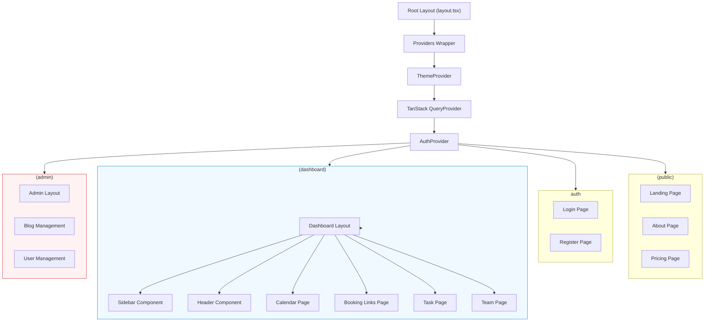

# **Chương IV. XÂY DỰNG ỨNG DỤNG**

Chương này đi sâu vào quá trình hiện thực hóa thiết kế hệ thống thành sản phẩm thực tế. Nội dung bao gồm chi tiết thiết kế giao diện (UI/UX), kiến trúc Frontend với Next.js, chi tiết hiện thực các tính năng chính, và cách thức tích hợp các module quan trọng như AI Assistant, Google Calendar và hệ thống Backend.

## **4.1 Thiết kế giao diện (UI/UX)**

Giao diện người dùng của Calento được thiết kế theo phong cách Minimalist, tối ưu hóa cho sự tập trung và hiệu suất. Hệ thống màu sắc sử dụng tông xanh dương (Brand Color) kết hợp với grayscale trung tính, đảm bảo tính thẩm mỹ và dễ đọc.

### **4.1.1 Public pages (Guest)**
Đây là bộ mặt của ứng dụng dành cho khách vãng lai, bao gồm:
- **Landing Page**: Giới thiệu tính năng, lợi ích và lời kêu gọi hành động (CTA). Thiết kế sử dụng các section rõ ràng, minh họa trực quan.
- **Pricing Page**: Bảng giá so sánh các gói dịch vụ (Free, Pro, Team, Enterprise) với highlighting cho gói phổ biến nhất.
- **About / Contact**: Thông tin về đội ngũ và form liên hệ.
- **Blog Listing & Detail**: Khu vực chia sẻ kiến thức, hỗ trợ SEO với nội dung rich-text và mục lục tự động.

### **4.1.2 Auth pages**
Giao diện xác thực an toàn và thân thiện:
- **Login / Register**: Form nhập liệu tinh gọn, hỗ trợ Social Login (Google) nổi bật để khuyến khích SSO.
- **Forgot Password flow**: Quy trình từng bước (Step-by-step) để khôi phục tài khoản.
- **Onboarding**: Sau khi đăng ký, người dùng được dẫn dắt qua các bước thiết lập ban đầu (Timezone, Availability, Connect Calendar) để đảm bảo tài khoản sẵn sàng sử dụng ngay.

### **4.1.3 Public Booking pages**
Giao diện cốt lõi dành cho người muốn đặt lịch hẹn:
- **Booking Page**: Hiển thị thông tin Host (Avatar, Tên), mô tả cuộc họp và thời lượng.
- **Slot Picker**: Lịch chọn ngày/giờ trực quan. Chỉ hiển thị các khung giờ "Available" (đã trừ đi các lịch bận từ Google Calendar).
- **Guest Form**: Form điền thông tin khách (Tên, Email, Ghi chú) sau khi chọn giờ.
- **Confirmation**: Trang xác nhận thành công, cung cấp nút "Add to Calendar" và chi tiết cuộc họp.

### **4.1.4 Dashboard (Registered User/Host)**
Không gian làm việc chính của người dùng:
- **Calendar View**: Giao diện lịch đầy đủ chức năng (Tháng/Tuần/Ngày) sử dụng FullCalendar. Cho phép kéo thả sự kiện, xem nhanh chi tiết khi hover (Hover Card).
- **Sidebar**: Mini calendar để điều hướng nhanh, danh sách "My Calendars" để bật/tắt hiển thị các nguồn lịch khác nhau.
- **Action Bar**: Nút "New Event" nổi bật, thanh tìm kiếm và các công cụ lọc.

### **4.1.5 Teams (Team Member/Owner)**
Khu vực cộng tác nhóm:
- **Team List**: Danh sách các nhóm tham gia.
- **Team Dashboard**: Xem lịch chung của cả nhóm (Team Availability), quản lý thành viên (Members) và vai trò (Roles).
- **Team Rituals**: Giao diện thiết lập các cuộc họp định kỳ của nhóm, tự động xoay tua người chủ trì (Rotation).

### **4.1.6 Settings / Integrations / Profile / Billing**
Trung tâm cấu hình cá nhân:
- **Profile**: Cập nhật thông tin cá nhân, Avatar.
- **Integrations**: Quản lý kết nối Google Calendar (Connect/Disconnect), xem trạng thái đồng bộ.
- **Billing**: Quản lý gói cước, xem lịch sử thanh toán (tích hợp Stripe/LemonSqueezy UI).
- **Settings**: Tùy chỉnh Timezone, Ngôn ngữ, và Theme (Light/Dark mode).

### **4.1.7 Admin / CMS (Blog/Comments/Contacts)**
Giao diện quản trị dành cho Admin:
- **Blog CMS**: Trình soạn thảo Markdown cho bài viết, quản lý trạng thái (Draft/Published), Tags và Categories.
- **User Management**: Danh sách người dùng, công cụ hỗ trợ (Impersonate, Deactivate).
- **System Health**: Dashboard theo dõi metric hệ thống (CPU, Memory, Active Users).

### **4.1.8 Sơ đồ luồng Frontend (Frontend Architecture)**

Frontend của ứng dụng được tổ chức theo kiến trúc App Router của Next.js 14, tối ưu hóa cho Server Components và Client Interactivity.

##### Hình 24: Kiến trúc Frontend Next.js App Router {#hình-24:-kiến-trúc-frontend-next.js-app-router}

## **4.2 Xây dựng Frontend (Next.js App)**

Frontend của Calento được xây dựng trên nền tảng **Next.js 14** (App Router), tận dụng sức mạnh của Server Components để tối ưu hiệu năng và SEO.

### **4.2.1 Routing & Layouts (App Router)**
Cấu trúc thư mục `client/app` được tổ chức theo các Route Groups để tách biệt logic layout:
- `(public)`: Layout chung cho trang chủ, blog, pricing (Header/Footer đơn giản).
- `(dashboard)`: Layout cho ứng dụng chính với Sidebar, Header phức tạp và Auth Guard (yêu cầu đăng nhập).
- `(admin)`: Layout riêng cho trang quản trị.
- `auth`: Các trang login/register không có layout chung.
- `book`: Layout tối giản cho trang Public Booking.

### **4.2.2 Data fetching & State (TanStack Query / Zustand)**
- **Server State (TanStack Query)**: Quản lý dữ liệu từ API (User, Events, Bookings). Sử dụng `useQuery` để fetch data và `useMutation` để thực hiện hành động (Create, Update, Delete). Tự động caching và re-validation giúp UI luôn đồng bộ.
- **Client State (Zustand)**: Quản lý trạng thái giao diện cục bộ (Sidebar open/close, Modal visibility, Theme settings) một cách nhẹ nhàng và hiệu quả.
- **Form Handling (React Hook Form + Zod)**: Quản lý form phức tạp với validation schema chặt chẽ từ Zod, đảm bảo dữ liệu đầu vào luôn hợp lệ.

### **4.2.3 UI Components (Calendar, Booking, Team, Blog)**
Hệ thống Component được xây dựng dựa trên **Shadcn UI** (Radix Primitives + Tailwind CSS), đảm bảo tính tiếp cận (Accessibility) và dễ dàng tùy biến:
- **Calendar Component**: Wrapper quanh FullCalendar, xử lý render event custom, drag-and-drop logic.
- **Booking Flow**: Wizard component đa bước (Step 1: Pick Date, Step 2: Pick Time, Step 3: Info) giúp trải nghiệm đặt lịch mượt mà.
- **Data Table**: Bảng dữ liệu mạnh mẽ cho danh sách User, Booking, Task với tính năng sort, filter, pagination (TanStack Table).
- **Dialogs/Modals**: Sử dụng triệt để cho các thao tác nhanh (Quick Edit, View Detail) để giữ người dùng trong ngữ cảnh.

## **4.3 Chi tiết Hiện thực Tính năng (Feature Implementation)**

Phần này mô tả chi tiết cách các tính năng chính được hiện thực hóa trong code và tương tác UI.

### **4.3.1 Dashboard & Calendar**
Khi đăng nhập thành công, người dùng được chuyển đến Dashboard, nơi tập trung mọi hoạt động quản lý thời gian.

**Chức năng chi tiết:**
*   **Calendar View**:
    *   **Thao tác**: Kéo thả (Drag & Drop) để dời lịch, kéo cạnh dưới để thay đổi thời lượng (Resize).
    *   **Chế độ xem**: Toggle nhanh giữa Tháng (tổng quan), Tuần (chi tiết giờ) và Ngày (lịch trình cụ thể).
    *   **Quick Add**: Click vào bất kỳ ô trống nào để mở nhanh modal tạo lịch.
*   **Mini Calendar**:
    *   **Date Navigation**: Click chọn ngày để nhảy lịch chính đến ngày đó ngay lập tức.
*   **Filter My Calendars**:
    *   Checkbox để bật/tắt hiển thị các lớp lịch (ví dụ: Tắt lịch "Holidays" để đỡ rối mắt).

**Thành phần Component (Source Code Map):**
*   `client/components/calendar/Calendar.tsx`: Component chính bọc FullCalendar.
*   `client/components/dashboard/Sidebar.tsx`: Chứa MiniCalendar và Filters.
*   `client/components/calendar/EventHoverCard.tsx`: Tooltip hiển thị tin vắn tắt khi rê chuột vào sự kiện.

### **4.3.2 Booking System (Đặt lịch hẹn)**
Hệ thống Booking cho phép người dùng tạo các trang đặt lịch cá nhân để gửi cho khách hàng.

**Chức năng chi tiết:**
*   **Booking Link Management**:
    *   **Create Link**: Định nghĩa loại cuộc họp (15 phút, 30 phút, 1 giờ).
    *   **Availability**: Thiết lập giờ rảnh "Working Hours" (ví dụ: chỉ nhận khách từ 9h-17h, trừ T7-CN).
    *   **Copy Link**: Nút copy nhanh URL để gửi qua chat/email.
*   **Public Booking Flow (Góc nhìn của Khách)**:
    *   **Timezone Detection**: Tự động phát hiện múi giờ của khách và chuyển đổi khung giờ hiển thị tương ứng.
    *   **Slot Selection**: Chỉ hiện các slot còn trống. Tránh double-booking tuyệt đối.

**Thành phần Component:**
*   `client/components/booking/BookingKanbanBoard.tsx`: Quản lý các loại booking dưới dạng thẻ.
*   `client/components/booking/CreateBookingLinkDialog.tsx`: Form wizard tạo link mới.
*   `client/components/booking/TimeSelectionStep.tsx`: Component chọn giờ cho trang Public.

### **4.3.3 Team Collaboration**
Tính năng làm việc nhóm cho phép chia sẻ lịch và đặt lịch họp chung.

**Chức năng chi tiết:**
*   **Team Availability (Heatmap)**:
    *   Hiển thị biểu đồ nhiệt: Màu càng đậm nghĩa là càng nhiều thành viên rảnh vào giờ đó. Giúp Team Lead chọn giờ họp Daily Scrum nhanh chóng mà không cần hỏi từng người.
*   **Optimal Time Finder**:
    *   Thuật toán gợi ý "Top 3 khung giờ vàng" mà tất cả thành viên (hoặc các thành viên bắt buộc) đều rảnh.

**Thành phần Component:**
*   `client/components/team/AvailabilityHeatmap.tsx`: Render biểu đồ Canvas/SVG.
*   `client/components/team/TeamJobList.tsx`: Danh sách thành viên và trạng thái.

### **4.3.4 Blog CMS (Admin)**
Khu vực dành cho Content Creator quản lý nội dung.

**Chức năng chi tiết:**
*   **Markdown Editor**:
    *   Soạn thảo văn bản với cú pháp Markdown. Có Split View (một bên gõ code, một bên hiện Preview).
    *   **Upload Image**: Kéo thả ảnh vào trình soạn thảo để upload lên Cloudinary và chèn link tự động.

**Thành phần Component:**
*   `client/components/admin/blog/PostEditor.tsx`: Trình soạn thảo chính.
*   `client/components/ui/markdown-preview.tsx`: Component render markdown ra HTML an toàn.

## **4.4 Tích hợp AI Assistant**

AI Assistant là điểm nhấn công nghệ của Calento, mang lại trải nghiệm tương tác thông minh.

- **Interface**: Chat Panel trượt từ bên phải, cho phép người dùng hội thoại với AI mọi lúc.
- **SSE Streaming**: Sử dụng Server-Sent Events để hiển thị phản hồi của AI từng chữ (typewriter effect), giảm độ trễ nhận thức.
- **RAG (Retrieval-Augmented Generation)**: Khi người dùng hỏi "Tôi rảnh lúc nào?", hệ thống sẽ tìm kiếm (Retrieve) các sự kiện liên quan trong Vector Database, kẹp vào prompt (Augment) và gửi cho LLM để tạo câu trả lời (Generate) chính xác dựa trên dữ liệu thật.
- **Function Calling**: AI có thể đề xuất hành động thực thi (ví dụ: "Tạo lịch họp lúc 9h") thông qua các UI Card tương tác trong khung chat.

## **4.5 Tích hợp Google Calendar/Meet**

Tích hợp sâu với hệ sinh thái Google là tính năng cốt lõi giúp Calento đồng bộ dữ liệu:

- **OAuth 2.0 Flow**: Sử dụng `passport-google-oauth20` để ủy quyền truy cập an toàn. Scope bao gồm `calendar` và `calendar.events`.
- **Two-way Sync**:
    - *Import*: Webhook từ Google báo hiệu thay đổi -> Server fetch event mới -> Cập nhật Database.
    - *Export*: Khi tạo event trên Calento, server gọi Google API để tạo event tương ứng trên Google Calendar.
- **Google Meet**: Tự động thêm link Google Meet vào sự kiện khi tùy chọn "Video Conferencing" được bật. Link họp được lưu và hiển thị trong chi tiết sự kiện và email mời.

## **4.6 Notification/Email/Webhook/Jobs**

Hệ thống thông báo đảm bảo người dùng không bỏ lỡ thông tin quan trọng:

- **Architecture**: Sử dụng mô hình Producer-Consumer với **BullMQ** và **Redis**.
- **Email Service**:
    - *Transactional*: Gửi xác nhận đăng ký, reset password ngay lập tức (High priority queue).
    - *Reminders*: Email nhắc lịch được lên lịch (Scheduled Jobs) gửi trước giờ họp 15 phút.
    - Templates được viết bằng **Handlebars**, hỗ trợ dark mode và responsive email.
- **Webhooks**: Hệ thống bắn webhook ra bên ngoài (Outgoing Webhooks) khi có sự kiện `booking.created` hoặc `event.cancelled`, cho phép tích hợp với Zapier, Slack.
- **In-app Notifications**: Thông báo thời gian thực trên giao diện web (chuông thông báo) sử dụng Socket.IO (hoặc Polling nhẹ) để cập nhật trạng thái mới nhất.

