**TRƯỜNG ĐẠI HỌC CÔNG NGHỆ THÔNG TIN, ĐHQG-HCM**

**KHOA MẠNG MÁY TÍNH VÀ TRUYỀN THÔNG**

![][image1]

**BÁO CÁO ĐỒ ÁN MÔN HỌC**

# **ĐỀ TÀI: Xây dựng Calendar Assistant Web**

**Môn học:** Công nghệ Web và ứng dụng \- SE347.Q12

**Giảng viên hướng dẫn:  Đặng Việt Dũng**

**Thực hiện bởi nhóm 2, bao gồm:** 

1. Tạ Văn Thái			22523177		Trưởng nhóm  
2. Bùi Quốc Lâm		22520733		Thành viên  
3. Nguyễn Văn Quyền 		22521223		Thành viên  
4. Nguyễn Công Thắng 	22521330		Thành viên

**Thời gian thực hiện:** 10/2025 \- 1/2026

# **MỤC LỤC** {#mục-lục}

[MỤC LỤC	2](#mục-lục)

[Chương I. TỔNG QUAN.	3](#chương-i.-tổng-quan.)

[1\. Giới thiệu đề tài.	3](#heading=h.g1cnmohwqajz)

[1.2. Lý do chọn đề tài.	3](#1.1-lý-do-chọn-đề-tài.)

[2\. Cơ sở lý thuyết.	3](#heading=h.h52d15setcmh)

[Chương II. THIẾT KẾ HỆ THỐNG.	4](#chương-ii.-công-nghệ-sử-dụng)

[1.Kiến trúc hệ thống	4](#heading=h.z18z19u0xqds)

[1.1. Tổng quan về kiến trúc	4](#heading=h.l7khgiosucxf)

[1.2. Sơ đồ kiến trúc tổng thể	4](#heading=h.kr03iokw7h6)

[1.3 Luồng dữ liệu (Data Flow)	9](#heading=h.3i0w0agac8rr)

[2\. Thiết kế Database	9](#heading=h.1pi9ud5uc0oj)

[2.1 Tổng quan về cấu trúc Database	9](#heading=h.st73cs6j8a73)

[2\. Mối quan hệ giữa các Tables	11](#heading=h.enzfv0phyihx)

[Chương III. TRIỂN KHAI HỆ THỐNG.	11](#chương-iii.-phân-tích-và-thiết-kế-hệ-thống)

[1\. Tạo tài khoản Azure.	12](#heading=)

[2\. Khởi tạo tài nguyên và cấu hình.	12](#heading=)

[3\. Triển khai ứng dụng web.	12](#heading=)

[Chương IV. KẾT LUẬN.	13](#heading=h.o9k9z0mixkyq)

[1\. Kết quả đạt được	13](#heading=h.hegb62hm14wp)

[1.1. Thành tựu về Backend	13](#heading=h.htiu8wabsamg)

[1.2. Thành tựu về Frontend	16](#heading=h.4yev20d3vtb0)

[1.3. Thành tựu về Deployment và Infrastructure	16](#heading=h.uucx4p2u0o3t)

[1.4. Kiến thức và Kỹ năng Thu được	16](#heading=h.f35xlt7w5gly)

[2\. Hạn chế của Hệ thống	16](#heading=h.pk08do36flej)

[3\. Hướng Phát triển Tương lai	16](#heading=h.64tzltaurqon)

[NGUỒN THAM KHẢO	17](#nguồn-tham-khảo)

# 

# 

# **DANH MỤC HÌNH ẢNH** 

[Hình 1: NestJS	8](#hình-1:-nestjs)

[Hình 2: PostgreSQl	8](#hình-2:-postgresql)

[Hình 3: Redis & BullMQ	9](#hình-3:-redis-&-bullmq)

[Hình 4: Next.js & React	10](#hình-4:-next.js-&-react)

[Hình 5:Tailwind CSS	10](#hình-5:tailwind-css)

[Hình 6:Gemini	11](#hình-6:gemini)

[Hình 7: LangChain	12](#hình-7:-langchain)

[Hình 8: Kiến trúc tổng thể	12](#hình-8:-kiến-trúc-tổng-thể)

[Hình 9: Sơ đồ Use Case tổng quan	13](#hình-9:-sơ-đồ-use-case-tổng-quan)

[Hình 10: Auth Module	13](#hình-10:-auth-module)

[Hình 11: Calendar & Event Module	14](#hình-11:-calendar-&-event-module)

[Hình 12: Booking Module	15](#hình-12:-booking-module)

[Hình 13: LLM Module Architecture	15](#hình-13:-llm-module-architecture)

[Hình 14: Vector Similarity Search Process	16](#hình-14:-vector-similarity-search-process)

[Hình 15: RAG Sequence Flow	16](#hình-15:-rag-sequence-flow)

[Hình 16: Google Calendar Sync Flow	17](#hình-16:-google-calendar-sync-flow)

[Hình 17: Notification Multi-channel System	18](#hình-17:-notification-multi-channel-system)

[Hình 18: Webhook Delivery Flow	18](#hình-18:-webhook-delivery-flow)

[Hình 19: Worker & Infrastructure	19](#hình-19:-worker-&-infrastructure)

[Hình 20: Database Entity Relationship Diagram	20](#hình-20:-database-entity-relationship-diagram)

[Hình 21: VM Instance Google Cloud Platform	21](#hình-21:-vm-instance-google-cloud-platform)

[Hình 22: CloudFlare DNS Record	22](#hình-22:-cloudflare-dns-record)

[Hình 23: Google Search Console	23](#hình-23:-google-search-console)

# **Chương I. TỔNG QUAN.** {#chương-i.-tổng-quan.}

## **1.1 Lý do chọn đề tài.** {#1.1-lý-do-chọn-đề-tài.}

Trong bối cảnh xã hội hiện đại, việc quản lý thời gian hiệu quả đã trở thành một kỹ năng thiết yếu đối với mọi người, đặc biệt là sinh viên, nhân viên văn phòng và các chuyên gia. Theo khảo sát của Microsoft (2022), một người dùng trung bình dành khoảng 11 giờ mỗi tuần để quản lý và sắp xếp lịch trình cá nhân. Con số này cho thấy nhu cầu cấp thiết về một giải pháp tối ưu hóa quy trình quản lý thời gian.

Hiện nay, thị trường đã có nhiều ứng dụng quản lý lịch như Google Calendar, Outlook Calendar, Apple Calendar. Tuy nhiên, các ứng dụng này vẫn tồn tại một số hạn chế:

| Khía cạnh | Hạn chế |
| ----- | ----- |
| Tính tự động hóa | Người dùng phải tự nhập thông tin sự kiện một cách thủ công, không có khả năng đề xuất thời gian họp phù hợp tự động. |
| Trải nghiệm người dùng | Giao diện phức tạp với nhiều bước thao tác, không hỗ trợ tương tác bằng ngôn ngữ tự nhiên. |
| Tích hợp AI | Chưa tận dụng được công nghệ Large Language Models (LLMs), thiếu khả năng hiểu ngữ cảnh và tìm kiếm thông minh (RAG). |

Xuất phát từ những bất cập trên, nhóm quyết định xây dựng Calento (Calendar Intelligence Assistant) \- một ứng dụng web quản lý lịch thông minh. Calento không chỉ là một công cụ lịch thông thường mà còn tích hợp trợ lý ảo AI, khả năng xử lý ngôn ngữ tự nhiên và tìm kiếm ngữ cảnh thông minh để mang lại trải nghiệm đột phá.

Đề tài này cũng là cơ hội để nhóm áp dụng các kiến thức đã học trong môn Công nghệ Web và Ứng dụng, đồng thời tìm hiểu các công nghệ mới như AI, Vector Database.

## **1.2. Mục tiêu**

### **1.2.1. Mục tiêu chung**

Xây dựng thành công ứng dụng web Calento với đầy đủ các tính năng quản lý lịch, tích hợp trợ lý ảo AI để hỗ trợ người dùng sắp xếp công việc một cách thông minh và tự động.

### **1.2.2. Mục tiêu cụ thể**

Về mặt nghiệp vụ, ứng dụng cần cung cấp đầy đủ các thao tác quản lý lịch cơ bản (CRUD events) và tích hợp đồng bộ dữ liệu hai chiều với Google Calendar. Một tính năng quan trọng là hệ thống đặt lịch hẹn (Booking System) chuyên nghiệp, cho phép người dùng tùy chỉnh thời gian rảnh. Bên cạnh đó, trợ lý ảo AI sẽ được phát triển với khả năng hiểu lệnh và thực hiện hành động (Function Calling) để hỗ trợ người dùng tối đa.

Về mặt kỹ thuật, hệ thống được xây dựng theo kiến trúc Client-Server hiện đại để đảm bảo tính mở rộng và dễ bảo trì. Backend sử dụng NestJS kết hợp với Frontend Next.js nhằm tối ưu hóa hiệu suất và khả năng SEO. Cơ sở dữ liệu PostgreSQL được triển khai cùng extension pgvector để hỗ trợ tính năng RAG (Retrieval-Augmented Generation), đồng thời trải nghiệm người dùng được tối ưu hóa thông qua Real-time Streaming và phản hồi nhanh chóng.

## **1.3. Phạm vi thực hiện**

### **1.3.1. Các tính năng được triển khai**

Hệ thống bao gồm tính năng Quản lý sự kiện (Event Management) cho phép tạo, xem, sửa, xóa sự kiện, hỗ trợ sự kiện lặp lại (Recurring events - RRULE), quản lý người tham dự và gửi lời mời. Tính năng AI Assistant & RAG tích hợp Chatbot sử dụng Google Gemini AI, hỗ trợ Function Calling để thực hiện hành động như tạo lịch hoặc tìm lịch trống. Điểm mới là hệ thống RAG giúp AI ghi nhớ và truy xuất ngữ cảnh người dùng thông qua Vector Search.

Đối với Hệ thống đặt lịch (Booking System), người dùng có thể tạo các trang đặt lịch cá nhân (Booking Links) và tùy chỉnh khung giờ rảnh cũng như quy tắc đặt lịch. Khả năng Đồng bộ & Tích hợp đảm bảo đồng bộ 2 chiều với Google Calendar, đồng thời hệ thống sẽ gửi email thông báo và nhắc nhở tự động đến người dùng.

### **1.3.2. Giới hạn**

Ứng dụng hiện tập trung phát triển trên nền tảng Web, với giao diện Mobile được tối ưu hóa qua Responsive Web Design thay vì Native App. Hệ thống chưa hỗ trợ tích hợp Video Call trực tiếp mà chỉ tạo link Google Meet. Ngoài ra, tính năng phân tích dữ liệu nâng cao (Advanced Analytics) sẽ được phát triển trong giai đoạn sau của dự án.

## **1.4. Bố cục báo cáo**

Báo cáo được chia thành 4 chương chính:

Báo cáo được chia thành 4 chương chính. Chương 1 giới thiệu tổng quan về đề tài, lý do lựa chọn, mục tiêu và phạm vi dự án. Chương 2 trình bày các công nghệ, ngôn ngữ và công cụ sử dụng như NestJS, Next.js, PostgreSQL/pgvector và Google Gemini. Chương 3 tập trung phân tích và thiết kế hệ thống, mô tả kiến trúc tổng thể, các module thành phần và thiết kế cơ sở dữ liệu. Cuối cùng, Chương 4 trình bày thiết kế chi tiết màn hình, bao gồm sơ đồ luồng và giao diện người dùng, đặc biệt là các cải tiến trong trải nghiệm chat thông minh.

# **Chương II. CÔNG NGHỆ SỬ DỤNG** {#chương-ii.-công-nghệ-sử-dụng}

## **2.1. Kiến trúc tổng quan (Tech Stack)**

Hệ thống Calento được xây dựng trên nền tảng công nghệ hiện đại, tuân theo mô hình Micro-modular Monolith. Kiến trúc này cho phép chia tách rõ ràng giữa các tầng nghiệp vụ (Domain Layer) và tầng ứng dụng (Application Layer), giúp giữ được sự thống nhất trong triển khai (Monolithic Deployment) nhưng vẫn đảm bảo tính linh hoạt và dễ bảo trì của Microservices.

| Thành phần | Công nghệ chính |
| ----- | ----- |
| Frontend | Next.js 15, React 19, Tailwind CSS, TanStack Query, Zustand |
| Backend | NestJS, TypeScript |
| Database | PostgreSQL (với pgvector extension), Redis |
| AI & ML | Google, Gemini, LangChain, Embeddings |
| Infrastructure | Docker, BullMQ, Google Cloud Platform |

## **2.2. Công nghệ Backend**

### **2.2.1. NestJS Framework**

NestJS là framework Node.js được chọn làm nền tảng cho Backend vì kiến trúc module hóa rõ ràng, hỗ trợ TypeScript toàn diện và tuân thủ các nguyên tắc SOLID.

NestJS là framework Node.js được chọn làm nền tảng cho Backend. Trong dự án Calento, NestJS đóng vai trò là xương sống xử lý toàn bộ logic nghiệp vụ và API. Hệ thống tận dụng triệt để kiến trúc Modular của NestJS để phân tách các tính năng thành các module chuyên biệt: `AuthModule` xử lý xác thực JWT, `EventModule` quản lý lịch và sự kiện, `AIModule` điều phối tương tác với Gemini. Các Decorators và Guards được sử dụng rộng rãi để bảo vệ endpoints và validate dữ liệu đầu vào, đảm bảo tính an toàn và chặt chẽ của hệ thống.


  ##### Hình 1: NestJS  {#hình-1:-nestjs}

### **2.2.2. PostgreSQL & pgvector**

Hệ thống sử dụng PostgreSQL làm cơ sở dữ liệu chính (Relational Database) kết hợp với extension pgvector để hỗ trợ lưu trữ và tìm kiếm vector.

PostgreSQL là trái tim lưu trữ dữ liệu của Calento. Ngoài việc lưu trữ các bảng quan hệ (relational tables) như `users` (người dùng), `events` (sự kiện), `bookings` (lịch hẹn), hệ thống còn khai thác sức mạnh của extension `pgvector` để phục vụ tính năng AI RAG. Cụ thể, bảng `user_context_summary` lưu trữ các vector embeddings 768 chiều đại diện cho ngữ cảnh lịch sử của người dùng, cho phép thực hiện các truy vấn tìm kiếm ngữ nghĩa (semantic search) nhanh chóng và chính xác.

  ![][image2]

  ##### Hình 2: PostgreSQl {#hình-2:-postgresql}

### **2.2.3. Redis & BullMQ**

Redis và BullMQ đóng vai trò quan trọng trong việc xử lý các tác vụ nền (background processing) và tối ưu hiệu năng. Redis được dùng để cache các truy vấn thường xuyên như thông tin User Profile, giúp giảm tải cho Database. BullMQ, chạy trên nền Redis, quản lý các hàng đợi công việc (queues) quan trọng: `mail-queue` để gửi email thông báo bất đồng bộ, và `sync-calendar-queue` để thực hiện đồng bộ lịch Google định kỳ 5 phút/lần cho từng user mà không làm chậm trải nghiệm sử dụng trực tiếp.

  ![][image3]

  ![][image4]

  ##### Hình 3: Redis & BullMQ {#hình-3:-redis-&-bullmq}

## **2.3. Công nghệ Frontend**

### **2.3.1. Next.js 15 & React 19**

Sử dụng Next.js phiên bản mới nhất với App Router để tận dụng các tính năng:

Về phía Client, Next.js 15 với App Router mang lại khả năng render linh hoạt. Calento sử dụng React Server Components (RSC) để fetch dữ liệu lịch ngay từ server, giảm thiểu layout shift và tăng tốc độ tải trang ban đầu (FCP). Server Actions được ứng dụng để xử lý các form submission như tạo sự kiện (`createEvent`) hay cập nhật profile, loại bỏ sự cần thiết của các API routes trung gian thủ công và giữ type-safety xuyên suốt từ server xuống client.

  ![][image5]

  ##### Hình 4: Next.js & React  {#hình-4:-next.js-&-react}

### **2.3.2. Tailwind CSS & UI Libraries**

Giao diện được xây dựng bằng Tailwind CSS, framework utility-first giúp phát triển nhanh chóng, dễ tùy biến và tối ưu dung lượng. Để đảm bảo tính truy cập (accessibility) và khả năng tùy chỉnh cao, hệ thống tích hợp bộ component headless Radix UI / Shadcn UI.

  ![][image6]

  ##### Hình 5:Tailwind CSS {#hình-5:tailwind-css}

### **2.3.3. AI Chat Integration**

Trong phần tích hợp AI Chat, hệ thống phân tách rõ ràng giữa việc truyền tải dữ liệu và hiển thị. Server-Sent Events (SSE) được sử dụng để stream từng token phản hồi từ AI về client theo thời gian thực, giúp giảm độ trễ nhận thức (perceived latency). Tại phía client, thư viện `react-markdown` đảm nhận việc render luồng text markdown này thành HTML đẹp mắt với các styles dduocj tùy chỉnh, cho phép hiển thị cả danh sách, code blocks, và đặc biệt là các UI components tương tác (như thẻ xác nhận lịch) ngay trong khung chat.

## **2.4. Công nghệ AI & LLM**

### **2.4.1. Gemini** 

Calento tích hợp mô hình ngôn ngữ lớn (LLM) Gemini Pro của Google để xử lý logic hội thoại và function calling.

Calento tích hợp mô hình ngôn ngữ lớn (LLM) Gemini Pro của Google để xử lý logic hội thoại. Hệ thống có khả năng xử lý ngôn ngữ tự nhiên (NLP) để hiểu ý định người dùng từ các câu chat thông thường, ví dụ như "Đặt lịch họp team vào sáng thứ 2". Đồng thời, tính năng Function Calling cho phép AI tự động xác định và gọi các hàm nghiệp vụ như `createEvent` hay `findSlot` dựa trên yêu cầu cụ thể.

  ![][image7]

  ##### Hình 6:Gemini {#hình-6:gemini}

### **2.4.2. LangChain & Embeddings**

LangChain hoạt động như một framework kết nối LLM với dữ liệu ứng dụng và quản lý luồng hội thoại. Hệ thống sử dụng model `text-embedding-004` để chuyển đổi văn bản (ghi chú, ngữ cảnh) thành các vector 768 chiều. Các vector này được lưu trữ và sử dụng cho việc tìm kiếm tương đồng, nền tảng cốt lõi của tính năng RAG giúp AI nhớ lại thông tin cũ.

  ![][image8]

  ##### Hình 7: LangChain {#hình-7:-langchain}

### **2.4.3. Kiến trúc RAG (Retrieval-Augmented Generation)**

Hệ thống triển khai kỹ thuật **Advanced RAG** để tối ưu hóa khả năng truy xuất thông tin của AI, bao gồm 3 bước xử lý chuyên sâu:

1.  **Query Expansion (Mở rộng truy vấn)**: Câu hỏi thô của người dùng thường ngắn gọn hoặc thiếu ngữ cảnh (ví dụ: "lịch họp mai"). Hệ thống sử dụng LLM để viết lại câu hỏi này (ví dụ: "danh sách sự kiện ngày 20/01/2026"), bổ sung các từ khóa liên quan để tăng độ chính xác khi tìm kiếm.
2.  **Hybrid Search (Tìm kiếm lai)**: Kết hợp sức mạnh của **Vector Search** (`pgvector`) để tìm kiếm theo ngữ nghĩa và **Full-Text Search** để tìm kiếm từ khóa chính xác. Kết quả tìm kiếm được tính điểm tổng hợp theo công thức trọng số: `Score = 0.7 * VectorScore + 0.3 * TextScore`, đảm bảo cân bằng giữa hiểu ngữ cảnh và khớp từ khóa.
3.  **Reranking (Sắp xếp lại)**: Danh sách các ngữ cảnh tiềm năng sau khi được truy xuất sẽ được đưa qua một mô hình AI nhẹ để chấm điểm mức độ liên quan (Relevance Scoring) một lần nữa. Chỉ Top 3 ngữ cảnh có điểm cao nhất mới được chọn để đưa vào prompt context gửi cho Chatbot, giúp giảm nhiễu (hallucination) và tăng độ chính xác của câu trả lời.

# **Chương III. PHÂN TÍCH VÀ THIẾT KẾ HỆ THỐNG** {#chương-iii.-phân-tích-và-thiết-kế-hệ-thống}

## **3.1. Danh sách các yêu cầu**

### **3.1.1. Yêu cầu nghiệp vụ (Business Requirements)**

Hệ thống Calento được xây dựng nhằm giải quyết các vấn đề quản lý thời gian trong bối cảnh hiện đại, với các yêu cầu nghiệp vụ chính được phân tích dựa trên nhu cầu thực tế của người dùng và xu hướng công nghệ.

#### **BR-01: Quản lý sự kiện và lịch trình cá nhân**

Hệ thống phải cho phép người dùng tạo, xem, sửa, xóa các sự kiện trong lịch cá nhân một cách linh hoạt. Mỗi sự kiện cần chứa đầy đủ thông tin bao gồm tiêu đề, thời gian bắt đầu/kết thúc, địa điểm, mô tả chi tiết, và danh sách người tham dự. Đặc biệt, hệ thống cần hỗ trợ các sự kiện lặp lại (recurring events) theo các pattern phức tạp như hàng ngày, hàng tuần, hàng tháng, hoặc theo quy tắc tùy chỉnh tuân theo chuẩn RRULE (RFC 5545).

Lịch cần được hiển thị ở nhiều chế độ xem khác nhau (ngày, tuần, tháng, năm) để phù hợp với nhu cầu khác nhau của người dùng. Tính năng kéo-thả (drag and drop) cần được tích hợp để người dùng có thể nhanh chóng thay đổi thời gian sự kiện mà không cần mở form chỉnh sửa. Hệ thống cũng phải hỗ trợ nhiều múi giờ (timezone) khác nhau, đặc biệt quan trọng cho người dùng làm việc quốc tế hoặc thường xuyên di chuyển giữa các khu vực địa lý.

#### **BR-02: Đồng bộ hóa với Google Calendar**

Do Google Calendar là dịch vụ lịch phổ biến nhất hiện nay với hơn 500 triệu người dùng, việc tích hợp đồng bộ là yêu cầu thiết yếu. Hệ thống phải thực hiện đồng bộ hai chiều (bi-directional sync): pull events từ Google Calendar về Calento và push các sự kiện được tạo trong Calento lên Google Calendar. Điều này đảm bảo người dùng có thể quản lý lịch từ bất kỳ nền tảng nào (Calento, Google Calendar mobile app, hoặc các ứng dụng khác tích hợp Google Calendar) và dữ liệu luôn được đồng nhất.

Quá trình đồng bộ cần được tự động hóa hoàn toàn thông qua background jobs, chạy định kỳ mà không làm gián đoạn trải nghiệm người dùng. Hệ thống phải có khả năng phát hiện và giải quyết conflicts (xung đột) khi cùng một sự kiện bị chỉnh sửa ở cả hai phía, cung cấp cho người dùng các tùy chọn resolution như ưu tiên phía Google, ưu tiên phía Calento, hoặc giữ cả hai phiên bản.

#### **BR-03: Hệ thống đặt lịch hẹn công khai (Booking System)**

Hệ thống cần cung cấp tính năng cho phép người dùng tạo các "booking links" - những trang đặt lịch công khai tương tự như Calendly hoặc Cal.com. Mỗi user có thể tạo nhiều booking links với các cấu hình khác nhau, phục vụ cho các mục đích khác nhau (ví dụ: "30-minute Meeting", "1-hour Consulting", "Quick Call").

Mỗi booking link cần cho phép cấu hình chi tiết bao gồm: thời lượng cuộc hẹn (duration), thời gian đệm trước và sau (buffer time), thời gian thông báo tối thiểu (advance notice), số lượng booking tối đa mỗi ngày, và múi giờ mặc định. Hệ thống phải tự động tính toán các khung giờ rảnh (available slots) dựa trên lịch availability đã được user thiết lập và các sự kiện hiện có, đảm bảo không có conflict.

Khi khách (guest) đặt lịch thành công, hệ thống cần tự động tạo sự kiện cho cả host và guest, gửi email xác nhận cho cả hai bên với thông tin đầy đủ (thời gian, địa điểm, link tham gia nếu là online meeting), và tùy chọn tự động đồng bộ lên Google Calendar của host.

#### **BR-04: Trợ lý ảo AI thông minh (AI Assistant)**

Đây là tính năng khác biệt hóa chính của Calento so với các ứng dụng lịch truyền thống. Hệ thống cần tích hợp một AI assistant có khả năng hiểu ngôn ngữ tự nhiên (tiếng Việt và tiếng Anh), cho phép người dùng tương tác bằng cách chat thay vì phải điền form hoặc nhấn nhiều nút.

AI assistant cần có khả năng thực hiện các tác vụ sau qua lệnh chat: (1) Truy vấn lịch trình - "Tôi có bận vào thứ 5 không?", "Cuộc họp tiếp theo của tôi là gì?"; (2) Tạo sự kiện mới - "Đặt lịch họp team vào 9h sáng thứ 2"; (3) Tìm khung giờ rảnh - "Khi nào tôi rảnh để gặp khách hàng?"; (4) Tóm tắt lịch trình - "Tóm tắt lịch tuần sau cho tôi".

Để đạt được độ chính xác cao, hệ thống cần triển khai RAG (Retrieval-Augmented Generation) pattern. Khi nhận câu hỏi từ user, AI sẽ: (1) Chuyển đổi câu hỏi thành vector embedding 768 chiều, (2) Tìm kiếm các sự kiện và ngữ cảnh liên quan trong database sử dụng pgvector với cosine similarity, (3) Đưa context này vào prompt gửi cho LLM model (Google Gemini), (4) LLM sinh ra câu trả lời dựa trên context cụ thể của user thay vì general knowledge.

AI cũng cần hỗ trợ function calling, nghĩa là có thể tự động xác định khi nào cần gọi các function nghiệp vụ (như createEvent, findAvailableSlots) và thực thi chúng sau khi confirm với user.

#### **BR-05: Quản lý công việc với hệ thống ưu tiên (Task Management)**

Ngoài sự kiện, người dùng cần quản lý các công việc (tasks) - những việc cần làm nhưng chưa có thời gian cụ thể hoặc deadline linh hoạt. Hệ thống cần cung cấp một priority board với 4 cấp độ ưu tiên: Critical (khẩn cấp phải làm ngay), High (quan trọng), Medium (trung bình), và Low (có thể làm sau).

Tasks cần hỗ trợ đầy đủ các thuộc tính như title, description, due date, tags, project/category, và quan hệ phân cấp (subtasks). Giao diện priority board phải có tính năng drag-and-drop để người dùng dễ dàng thay đổi mức độ ưu tiên hoặc thứ tự trong cùng một column. Hệ thống cũng cần hỗ trợ recurring tasks cho các công việc lặp lại định kỳ.

Một tính năng quan trọng là khả năng chuyển đổi task thành event và ngược lại. Ví dụ, khi user quyết định thời gian cụ thể để làm một task, họ có thể convert task đó thành event trên calendar để block time.

#### **BR-06: Cộng tác nhóm (Team Collaboration)**

Đối với các nhóm làm việc (team), hệ thống cần cung cấp không gian chia sẻ lịch. Mỗi team owner có thể tạo team, mời members (tối đa 5 người trong phiên bản hiện tại), và quản lý quyền truy cập. Team calendar cho phép tất cả members xem sự kiện chung, tránh việc book meeting vào thời gian conflict.

Tính năng Team Rituals đặc biệt hữu ích cho các cuộc họp định kỳ như Daily Standup, Weekly Planning, hoặc Monthly Review. Owner có thể setup ritual với recurrence rule và rotation schedule - ai sẽ là người lead/present trong mỗi lần meeting. Hệ thống tự động tạo events cho các instances của ritual và assign đúng người theo rotation order.

Team availability dashboard cho phép members xem được khung giờ rảnh của nhau, giúp việc sắp xếp meeting chung trở nên dễ dàng hơn mà không cần trao đổi qua lại nhiều lần.

#### **BR-07: Hệ thống thông báo đa kênh (Multi-channel Notifications)**

Để đảm bảo người dùng không bỏ lỡ sự kiện quan trọng, hệ thống cần gửi thông báo nhắc nhở qua nhiều kênh khác nhau. Email notification là kênh chính, được gửi tự động cho các sự kiện: (1) Xác nhận khi tạo/cập nhật sự kiện, (2) Nhắc nhở trước sự kiện (15 phút, 1 giờ, 1 ngày tùy theo cài đặt), (3) Thông báo khi có người RSVP lời mời, (4) Thông báo booking mới từ booking link.

Hệ thống cũng cần hỗ trợ webhook để tích hợp với các dịch vụ bên thứ ba như Slack, Telegram, hoặc Zapier. User có thể configure webhook URLs và chọn events nào sẽ trigger webhook. Trong tương lai, push notifications cho mobile app và SMS notifications cũng sẽ được bổ sung.

#### **BR-08: Content Management System (Blog CMS)**

Để xây dựng cộng đồng và chia sẻ kiến thức về quản lý thời gian, hệ thống cần có một blog platform tích hợp. Admin/content manager có thể tạo bài viết với rich text editor (hỗ trợ markdown, images, code blocks), phân loại theo categories, gắn tags, và schedule publish time.

Blog cần được tối ưu cho SEO với các features: custom meta title/description, friendly URLs (slugs), sitemap.xml tự động, và schema markup. Hệ thống comments cho phép readers tương tác, nhưng cần có moderation tools để admin kiểm duyệt trước khi publish. Analytics tracking giúp admin theo dõi views, popular posts, và engagement metrics.

### **3.1.2. Yêu cầu chức năng chi tiết (Functional Requirements)**

Dựa trên các yêu cầu nghiệp vụ trên, hệ thống được phân tích thành các yêu cầu chức năng cụ thể theo từng module:

| ID | Module | Chức năng | Độ ưu tiên | Trạng thái |
|----|--------|-----------|------------|------------|
| FR-01 | Auth | Đăng ký tài khoản với email/password | High | ✅ Completed |
| FR-02 | Auth | Đăng nhập với Google OAuth 2.0 | High | ✅ Completed |
| FR-03 | Auth | Reset password qua email | Medium | ✅ Completed |
| FR-04 | Auth | JWT token authentication | High | ✅ Completed |
| FR-05 | Calendar | Tạo/sửa/xóa event cơ bản | High | ✅ Completed |
| FR-06 | Calendar | View calendar (day/week/month) | High | ✅ Completed |
| FR-07 | Calendar | Recurring events (RRULE) | High | ✅ Completed |
| FR-08 | Calendar | Drag & drop events | Medium | ✅ Completed |
| FR-09 | Event | Mời attendees qua email | High | ✅ Completed |
| FR-10 | Event | RSVP invitations | Medium | ✅ Completed |
| FR-11 | Event | Event reminders | Medium | ✅ Completed |
| FR-12 | Google | OAuth connection | High | ✅ Completed |
| FR-13 | Google | Pull events from Google | High | ✅ Completed |
| FR-14 | Google | Push events to Google | High | ✅ Completed |
| FR-15 | Google | Conflict detection & resolution | Medium | ✅ Completed |
| FR-16 | Booking | Create booking links | High | ✅ Completed |
| FR-17 | Booking | Public booking page | High | ✅ Completed |
| FR-18 | Booking | Availability calculation | High | ✅ Completed |
| FR-19 | Booking | Email confirmations | High | ✅ Completed |
| FR-20 | Booking | Cancel/reschedule booking | Medium | ✅ Completed |
| FR-21 | Task | Create/edit/delete tasks | High | ✅ Completed |
| FR-22 | Task | Priority levels (4 levels) | High | ✅ Completed |
| FR-23 | Task | Drag & drop priority board | Medium | ✅ Completed |
| FR-24 | Task | Recurring tasks | Low | ✅ Completed |
| FR-25 | AI | Chat interface | High | ✅ Completed |
| FR-26 | AI | Semantic event search (RAG) | High | ✅ Completed |
| FR-27 | AI | Function calling (create/find) | Medium | ✅ Completed |
| FR-28 | AI | Streaming responses | Medium | ✅ Completed |
| FR-29 | Team | Create/manage team | Medium | ✅ Completed |
| FR-30 | Team | Invite team members | Medium | ✅ Completed |
| FR-31 | Team | Team rituals with rotation | Low | ✅ Completed |
| FR-32 | Team | Team availability view | Low | ✅ Completed |
| FR-33 | Blog | Create/edit blog posts | Medium | ✅ Completed |
| FR-34 | Blog | Categories & tags | Medium | ✅ Completed |
| FR-35 | Blog | Comments moderation | Low | ✅ Completed |
| FR-36 | Blog | SEO optimization | Medium | ✅ Completed |
| FR-37 | Email | Send transactional emails | High | ✅ Completed |
| FR-38 | Email | Email templates (Handlebars) | Medium | ✅ Completed |
| FR-39 | Webhook | Configure webhook URLs | Low | ✅ Completed |
| FR-40 | Analytics | Track user activities | Low | 🚧 In Progress |

## **3.2. Kiến trúc hệ thống**

Hệ thống Calento được thiết kế theo mô hình Micro-modular Monolith, chia tách rõ ràng giữa các tầng nhưng vẫn giữ được sự thống nhất trong triển khai.

## **3.1.1. Sơ đồ kiến trúc tổng thể**

![][image9]

##### Hình 8: Kiến trúc tổng thể  {#hình-8:-kiến-trúc-tổng-thể}

## **3.2. Phân tích yêu cầu và Use Case**

### **3.2.1. Xác định Actors (Tác nhân)**

Hệ thống Calento phục vụ các actors sau:

| Actor | Mô tả | Quyền hạn |
|-------|-------|-----------|
| **Guest (Khách)** | Người dùng chưa đăng ký | Xem landing page, đặt lịch qua booking link public, đọc blog |
| **Registered User** | Người dùng đã đăng ký và đăng nhập | Quản lý lịch cá nhân, sự kiện, tasks, booking links, chat AI |
| **Team Member** | User thuộc một team | Xem lịch team, tham gia team rituals, view team availability |
| **Team Owner** | User tạo và sở hữu team | Quản lý team members, tạo team rituals, settings |
| **Admin/Content Manager** | Quản trị viên hệ thống | Quản lý blog posts, categories, user management, analytics |
| **Google Calendar API** | External system | Đồng bộ events qua OAuth 2.0 |
| **Gemini AI** | External AI service | Xử lý chat queries, function calling |

### **3.2.2. Sơ đồ Use Case tổng quan**

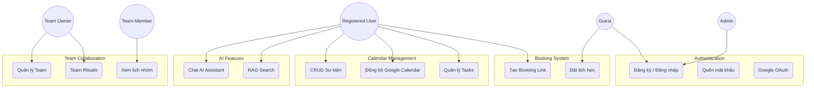
```mermaid
graph TD
    User((Registered User))
    Guest((Guest))
    Admin((Admin))
    TeamMember((Team Member))
    TeamOwner((Team Owner))

    subgraph Authentication
        UC1(Đăng ký / Đăng nhập)
        UC2(Quên mật khẩu)
        UC3(Google OAuth)
    end

    subgraph Calendar[Calendar Management]
        UC4(CRUD Sự kiện)
        UC5(Đồng bộ Google Calendar)
        UC6(Quản lý Tasks)
    end

    subgraph Booking[Booking System]
        UC7(Tạo Booking Link)
        UC8(Đặt lịch hẹn)
    end

    subgraph Team[Team Collaboration]
        UC9(Quản lý Team)
        UC10(Team Rituals)
        UC11(Xem lịch nhóm)
    end

    subgraph AI[AI Features]
        UC12(Chat AI Assistant)
        UC13(RAG Search)
    end

    User --> UC4
    User --> UC5
    User --> UC6
    User --> UC7
    User --> UC12
    User --> UC13

    Guest --> UC1
    Guest --> UC8

    TeamOwner --> UC9
    TeamOwner --> UC10

    TeamMember --> UC11

    Admin --> UC1
```

##### Hình 9: Sơ đồ Use Case tổng quan
{#hình-9:-sơ-đồ-use-case-tổng-quan}

**Mô tả các Actor:**
*   **Guest**: Người dùng vãng lai, có thể xem trang public và đặt lịch.
*   **Registered User**: Người dùng chính, sử dụng toàn bộ tính năng cá nhân.
*   **Team Member/Owner**: Người dùng tham gia vào các tính năng cộng tác nhóm.

### **3.2.3. Đặc tả Use Case chi tiết**

#### **UC-01: Đăng ký tài khoản (Register)**

| Thuộc tính | Nội dung |
|------------|----------|
| **Use Case ID** | UC-01 |
| **Tên** | Đăng ký tài khoản |
| **Actor** | Guest |
| **Mô tả** | Người dùng tạo tài khoản mới để sử dụng hệ thống |
| **Tiền điều kiện** | User chưa có tài khoản |
| **Hậu điều kiện** | User được tạo trong DB, có thể đăng nhập |
| **Luồng chính** | 1. User truy cập trang /auth/register<br>2. Nhập: email, username, password, confirm password<br>3. Hệ thống validate:<br>   - Email unique & format correct<br>   - Username unique (3-20 ký tự)<br>   - Password >= 8 ký tự, có chữ hoa, số<br>4. Hash password với bcrypt<br>5. Tạo user record (is_verified = false)<br>6. Gửi verification email<br>7. Redirect đến /dashboard |
| **Luồng thay thế** | **3a. Validation failed:**<br>   - Hiển thị error message cụ thể<br>   - User sửa và submit lại<br>**6a. Email gửi thất bại:**<br>   - Log error, user vẫn được tạo<br>   - User có thể resend verification sau |
| **Business Rules** | - Email phải unique trong hệ thống<br>- Username không chứa ký tự đặc biệt<br>- Mật khẩu phải đủ mạnh (entropy check) |

#### **UC-02: Đồng bộ Google Calendar**

| Thuộc tính | Nội dung |
|------------|----------|
| **Use Case ID** | UC-02 |
| **Tên** | Đồng bộ hai chiều với Google Calendar |
| **Actor** | Registered User, Google Calendar API |
| **Mô tả** | Tự động pull events từ Google và push local events lên Google |
| **Tiền điều kiện** | User đã kết nối Google account (OAuth) |
| **Hậu điều kiện** | Events được đồng bộ giữa Calento và Google Calendar |
| **Luồng chính** | **PULL (Google → Calento):**<br>1. Background job chạy mỗi 5 phút<br>2. Lấy access_token từ user_credentials<br>3. Gọi Google Calendar API: events.list()<br>4. So sánh với DB:<br>   - Dựa vào google_event_id, updated timestamp<br>5. Phát hiện changes:<br>   - New: Insert vào events table<br>   - Updated: Update existing event<br>   - Deleted: Soft delete hoặc mark cancelled<br>6. Detect conflicts (same time, different data)<br>7. Lưu conflicts vào event_conflicts table<br><br>**PUSH (Calento → Google):**<br>8. Tìm events có google_event_id = NULL<br>9. Gọi Google Calendar API: events.insert()<br>10. Lưu google_event_id vào DB |
| **Luồng thay thế** | **3a. Token expired:**<br>   - Refresh token tự động<br>   - Retry request<br>**3b. API rate limit:**<br>   - Exponential backoff<br>   - Retry sau 1-5-10 phút<br>**6a. Conflict detected:**<br>   - User nhận notification<br>   - User chọn resolution strategy |
| **Business Rules** | - Events recurring: Expand instances trước khi so sánh<br>- Chỉ sync calendars có sync_enabled = true<br>- Conflict priority: Manual user input > Auto sync |

#### **UC-03: Tạo Booking Link**

| Thuộc tính | Nội dung |
|------------|----------|
| **Use Case ID** | UC-03 |
| **Tên** | Tạo trang đặt lịch công khai |
| **Actor** | Registered User |
| **Mô tả** | User tạo booking link để người khác đặt lịch với mình |
| **Tiền điều kiện** | User đã đăng nhập, đã set availability |
| **Hậu điều kiện** | Booking link được tạo, public URL có thể share |
| **Luồng chính** | 1. User vào /dashboard/booking<br>2. Click "New Booking Link"<br>3. Nhập thông tin:<br>   - Title (VD: "30min Meeting")<br>   - Slug (unique, VD: "meeting-30min")<br>   - Duration (minutes)<br>   - Buffer time (trước/sau)<br>   - Advance notice (hours)<br>   - Max bookings per day<br>   - Location (optional)<br>4. Validate:<br>   - Slug chưa tồn tại cho user này<br>   - Duration > 0<br>5. Tạo booking_link record<br>6. Generate public URL: calento.space/book/username/slug<br>7. Hiển thị preview và share options |
| **Luồng thay thế** | **4a. Slug đã tồn tại:**<br>   - Suggest alternative (append số)<br>**4b. User chưa set availability:**<br>   - Prompt user set availability trước |
| **Business Rules** | - 1 user có thể tạo nhiều booking links<br>- Slug unique per user (không global)<br>- Buffer time không tính vào duration |

#### **UC-04: Đặt lịch qua Booking Link (Public)**

| Thuộc tính | Nội dung |
|------------|----------|
| **Use Case ID** | UC-04 |
| **Tên** | Guest đặt lịch hẹn |
| **Actor** | Guest |
| **Mô tả** | Người ngoài đặt lịch với user qua public booking link |
| **Tiền điều kiện** | Booking link active, user đã set availability |
| **Hậu điều kiện** | Booking created, event created, emails sent |
| **Luồng chính** | 1. Guest truy cập: /book/username/slug<br>2. Hệ thống load booking link config<br>3. Query availability của user:<br>   - Lấy availabilities (weekly schedule)<br>   - Lấy existing events<br>   - Calculate available slots (next 60 days)<br>4. Hiển thị calendar với slots màu xanh<br>5. Guest chọn slot<br>6. Popup form: Name, Email, Phone, Notes<br>7. Guest submit<br>8. Validate:<br>   - Slot vẫn available (double-check)<br>   - Email format correct<br>   - Không vượt max_bookings/day<br>9. Transaction:<br>   - Tạo booking record<br>   - Tạo event cho user<br>   - Link booking.event_id = event.id<br>10. Send emails:<br>    - Confirmation to guest<br>    - Notification to host<br>11. [Optional] Push event to Google Calendar |
| **Luồng thay thế** | **8a. Slot đã bị book:**<br>   - Show error "Đã có người đặt"<br>   - Refresh calendar<br>**8b. Vượt max bookings:**<br>   - "Đã hết slot cho ngày này"<br>**10a. Email failed:**<br>   - Log error, queue retry<br>   - Booking vẫn được tạo |
| **Business Rules** | - Check advance_notice: Không cho book slot < X giờ<br>- Apply buffer_time khi tính slots<br>- Timezone: Hiển thị theo timezone của guest (auto-detect) |

#### **UC-05: Chat với AI Assistant (RAG)**

| Thuộc tính | Nội dung |
|------------|----------|
| **Use Case ID** | UC-05 |
| **Tên** | Tương tác với AI Assistant |
| **Actor** | Registered User, Gemini AI |
| **Mô tả** | User chat với AI để query lịch, tạo event, tìm slot rảnh |
| **Tiền điều kiện** | User đã đăng nhập |
| **Hậu điều kiện** | User nhận response từ AI, action được thực thi (nếu có) |
| **Luồng chính** | 1. User mở AI chat panel<br>2. Nhập câu hỏi (VD: "Tôi có bận vào thứ 5?")<br>3. Frontend gửi POST /api/v1/ai/chat<br>4. Backend - RAG Service:<br>   - Generate embedding cho câu hỏi (768-dim vector)<br>   - Vector search trong events table (pgvector)<br>   - Lấy top 5 relevant events (cosine similarity > 0.7)<br>5. Backend - LLM Service:<br>   - Construct prompt:<br>     * System: "Bạn là AI assistant..."<br>     * Context: JSON của 5 events<br>     * User question<br>   - Gọi Gemini API (streaming)<br>   - Parse response<br>6. [Optional] Function Calling:<br>   - AI return function: createEvent / findSlots<br>   - Execute function<br>   - Return result to AI<br>7. Stream response qua SSE về frontend<br>8. Frontend render markdown real-time |
| **Luồng thay thế** | **4a. Không tìm thấy relevant events:**<br>   - Context = empty<br>   - AI answer dựa vào general knowledge<br>**5a. Gemini API error:**<br>   - Fallback: "Xin lỗi, AI tạm thời không khả dụng"<br>**6a. Function execution failed:**<br>   - Return error to AI<br>   - AI explain lỗi cho user |
| **Business Rules** | - Chỉ search events của chính user (privacy)<br>- Vector search timeout: 3s max<br>- Function calling: Phải confirm với user trước khi execute |

### **3.2.4. Ma trận Actor - Use Case**

| Use Case | Guest | Registered User | Team Member | Team Owner | Admin |
|----------|-------|----------------|-------------|-----------|-------|
| UC-01: Register | ✓ | - | - | - | - |
| UC-02: Google Sync | - | ✓ | ✓ | ✓ | - |
| UC-03: Create Booking Link | - | ✓ | ✓ | ✓ | - |
| UC-04: Book Appointment | ✓ | ✓ | - | - | - |
| UC-05: AI Chat | - | ✓ | ✓ | ✓ | - |
| UC-06: Create Event | - | ✓ | ✓ | ✓ | - |
| UC-07: Manage Tasks | - | ✓ | ✓ | ✓ | - |
| UC-08: Create Team | - | ✓ | - | ✓ | - |
| UC-09: Invite Team Member | - | - | - | ✓ | - |
| UC-10: View Team Calendar | - | - | ✓ | ✓ | - |
| UC-11: Create Blog Post | - | - | - | - | ✓ |
| UC-12: Moderate Comments | - | - | - | - | ✓ |
| UC-13: View Analytics | - | - | - | - | ✓ |

### **3.2.5. Yêu cầu phi chức năng (Non-functional Requirements)**

Bên cạnh các yêu cầu chức năng được mô tả trong Use Case, hệ thống Calento cần đáp ứng các yêu cầu phi chức năng quan trọng về hiệu năng, bảo mật, khả năng mở rộng, độ sẵn sàng và tính khả dụng.

#### **3.2.5.1. Yêu cầu về Hiệu năng (Performance Requirements)**

Hệ thống được thiết kế để đảm bảo trải nghiệm người dùng mượt mà với thời gian phản hồi nhanh chóng. Đối với các API endpoint, thời gian phản hồi trung bình phải đạt dưới 200 milliseconds ở percentile thứ 95, đảm bảo rằng 95% các request được xử lý trong khoảng thời gian này. Điều này đạt được thông qua việc tối ưu hóa các câu truy vấn database với indexes phù hợp, sử dụng connection pooling, và áp dụng chiến lược caching thông minh.

Về mặt giao diện người dùng, trang web cần đạt chỉ số First Contentful Paint (FCP) dưới 2 giây, là thời điểm nội dung đầu tiên được render trên màn hình. Điều này đảm bảo người dùng có phản hồi trực quan nhanh chóng khi truy cập ứng dụng. Để đạt được mục tiêu này, hệ thống sử dụng Server-Side Rendering (SSR) của Next.js, tối ưu hóa bundle size bằng code splitting, và lazy loading cho các component không quan trọng.

Hệ thống được thiết kế để hỗ trợ đồng thời hơn 1000 người dùng hoạt động cùng lúc mà không suy giảm hiệu năng đáng kể. Khả năng này được đảm bảo thông qua kiến trúc stateless backend, cho phép scale horizontal bằng cách thêm server instances khi cần thiết. Đối với các truy vấn database phức tạp trên tập dữ liệu lớn (100,000 events), thời gian thực thi trung bình phải dưới 50 milliseconds nhờ vào việc thiết kế indexes tối ưu và sử dụng covering indexes khi có thể.

#### **3.2.5.2. Yêu cầu về Bảo mật (Security Requirements)**

Bảo mật là một trong những ưu tiên hàng đầu của hệ thống. Về mặt xác thực (Authentication), hệ thống triển khai cơ chế JSON Web Token (JWT) với hai loại token: Access Token có thời hạn ngắn (1 giờ) và Refresh Token có thời hạn dài hơn (7 ngày). Cơ chế này cho phép cân bằng giữa bảo mật và trải nghiệm người dùng, giảm thiểu rủi ro khi Access Token bị lộ đồng thời tránh yêu cầu người dùng đăng nhập lại thường xuyên.

Mật khẩu người dùng được bảo vệ bằng thuật toán bcrypt với cost factor là 10 (tương đương 2^10 rounds), đảm bảo khả năng chống lại các cuộc tấn công brute-force và rainbow table. Mỗi mật khẩu được hash với một salt ngẫu nhiên duy nhất, đảm bảo rằng ngay cả khi hai người dùng có cùng mật khẩu, giá trị hash lưu trong database sẽ hoàn toàn khác nhau.

Để bảo vệ hệ thống khỏi các cuộc tấn công từ chối dịch vụ (DoS), API gateway triển khai cơ chế rate limiting với ngưỡng 100 requests mỗi phút cho mỗi địa chỉ IP. Các request vượt quá ngưỡng này sẽ nhận về HTTP status code 429 (Too Many Requests) và phải chờ trước khi thử lại. Đối với các endpoint nhạy cảm như đăng nhập và đăng ký, ngưỡng này còn được giảm xuống để tăng cường bảo mật.

Toàn bộ giao tiếp giữa client và server được mã hóa bằng giao thức HTTPS với TLS phiên bản 1.3, phiên bản mới nhất và an toàn nhất của giao thức bảo mật tầng vận chuyển. Điều này đảm bảo dữ liệu truyền tải không thể bị nghe lén hoặc can thiệp trong quá trình truyền qua mạng Internet. Về validation dữ liệu đầu vào, hệ thống sử dụng Zod schemas để định nghĩa và kiểm tra tất cả input từ client, ngăn chặn các lỗ hổng như SQL Injection, XSS (Cross-Site Scripting), và các dạng tấn công injection khác ngay từ tầng validation.

#### **3.2.5.3. Yêu cầu về Khả năng Mở rộng (Scalability Requirements)**

Kiến trúc hệ thống được thiết kế với khả năng mở rộng theo chiều ngang (horizontal scaling) làm trọng tâm. Backend được xây dựng theo mô hình stateless, nghĩa là không lưu trữ session state trên server instances. Thay vào đó, tất cả session data được lưu trữ tập trung trong Redis cluster, cho phép bất kỳ server instance nào cũng có thể xử lý request từ bất kỳ client nào. Điều này tạo điều kiện thuận lợi để thêm hoặc bớt server instances dựa trên tải hệ thống mà không ảnh hưởng đến trải nghiệm người dùng.

Đối với tầng cơ sở dữ liệu, chiến lược master-slave replication được triển khai với một primary database xử lý các thao tác ghi (write operations) và nhiều read replicas xử lý các truy vấn đọc (read operations). Kiến trúc này đặc biệt hiệu quả cho workload của ứng dụng lịch, nơi mà tỷ lệ đọc/ghi thường là 80/20 hoặc cao hơn. Các read replicas được phân phối địa lý để giảm độ trễ cho người dùng ở các khu vực khác nhau.

Hệ thống caching được thiết kế theo mô hình nhiều tầng (tiered caching) với Redis làm primary cache layer. Các dữ liệu được truy vấn thường xuyên (hot data) như thông tin user profile, availability rules, và events trong tuần hiện tại được cache với Time-To-Live (TTL) từ 5 đến 15 phút tùy thuộc vào tính chất dữ liệu. Chiến lược cache invalidation được triển khai cẩn thận để đảm bảo tính nhất quán dữ liệu (data consistency) trong khi vẫn tối đa hóa cache hit rate.

#### **3.2.5.4. Yêu cầu về Độ Sẵn sàng (Availability Requirements)**

Hệ thống cam kết đạt mức độ sẵn sàng (uptime) 99.5%, tương đương với khoảng 43.8 giờ downtime tối đa mỗi năm. Mức SLA (Service Level Agreement) này được tính toán dựa trên nhu cầu thực tế của người dùng và cân nhắc giữa chi phí vận hành với yêu cầu về độ tin cậy. Để đạt được mục tiêu này, hệ thống triển khai nhiều biện pháp như health check tự động, automatic failover, và monitoring 24/7.

Chiến lược backup được thiết kế theo mô hình 3-2-1: duy trì 3 bản sao dữ liệu, trên 2 loại phương tiện lưu trữ khác nhau, với 1 bản được lưu trữ off-site. PostgreSQL database được backup tự động hàng ngày bằng pg_dump với full backup. Các incremental backups được thực hiện mỗi 6 giờ để giảm thiểu dữ liệu mất mát trong trường hợp thảm họa. Tất cả backup files được mã hóa và lưu trữ trên cloud storage với versioning enabled.

Recovery Time Objective (RTO), chỉ số thời gian tối đa để khôi phục hệ thống sau sự cố, được đặt ở mức dưới 4 giờ. Điều này có nghĩa là trong trường hợp xấu nhất, hệ thống sẽ được đưa trở lại hoạt động trong vòng 4 giờ kể từ khi phát hiện sự cố. Recovery Point Objective (RPO), chỉ số lượng dữ liệu tối đa có thể mất mát, được thiết lập ở mức 6 giờ, tương ứng với khoảng cách giữa các incremental backups.

#### **3.2.5.5. Yêu cầu về Tính Khả dụng (Usability Requirements)**

Giao diện người dùng được thiết kế theo nguyên tắc Responsive Web Design, đảm bảo hoạt động mượt mà trên mọi kích thước màn hình từ điện thoại di động (viewport tối thiểu 320px) đến màn hình desktop lớn (4K resolution). Hệ thống hỗ trợ đầy đủ các trình duyệt phổ biến trên iOS (Safari) và Android (Chrome, Samsung Internet) với cùng một codebase, tận dụng các CSS features hiện đại như Flexbox, Grid, và CSS Custom Properties.

Về khả năng tiếp cận (Accessibility), ứng dụng tuân thủ WCAG 2.1 Level AA, bộ tiêu chuẩn quốc tế về khả năng tiếp cận web. Điều này bao gồm các yêu cầu như tỷ lệ tương phản màu sắc tối thiểu 4.5:1 cho văn bản thường và 3:1 cho văn bản lớn, hỗ trợ điều hướng bằng bàn phím hoàn toàn, semantic HTML cho screen readers, và ARIA attributes phù hợp. Các form inputs đều có labels rõ ràng, error messages mô tả cụ thể, và focus indicators dễ nhận biết.

Hệ thống được xây dựng với khả năng quốc tế hóa (Internationalization - i18n) ngay từ đầu, hiện tại hỗ trợ hai ngôn ngữ chính là Tiếng Việt và Tiếng Anh. Kiến trúc i18n cho phép dễ dàng thêm các ngôn ngữ mới trong tương lai mà không cần refactor code. Tất cả các văn bản hiển thị được quản lý thông qua translation keys, format ngày tháng và số tự động điều chỉnh theo locale của người dùng, và timezone được xử lý chính xác cho từng khu vực địa lý.

## **3.3. Mô tả các thành phần trong hệ thống**

Hệ thống Calento được xây dựng theo kiến trúc micro-modular monolith, trong đó các modules được tổ chức thành các nhóm chức năng rõ ràng. Mỗi module đảm nhiệm một domain nghiệp vụ cụ thể, có boundaries được định nghĩa rõ ràng, và giao tiếp với nhau thông qua well-defined interfaces. Cách tiếp cận này mang lại lợi ích của microservices (modularity, separation of concerns) nhưng vẫn giữ được sự đơn giản của monolithic deployment.

### **3.3.1. Core Modules - Nhóm Module Nền tảng**

Nhóm Core Modules bao gồm các module cơ bản nhất của hệ thống, cung cấp các chức năng thiết yếu mà hầu hết các modules khác đều phụ thuộc vào. Đây là foundation layer của toàn bộ application architecture.

#### **33.1.1. Auth Module (Authentication & Authorization)**

Auth Module là gatekeeper của toàn bộ hệ thống, đảm nhiệm việc xác thực danh tính người dùng và quản lý quyền truy cập. Module này được thiết kế với nhiều lớp bảo mật (defense in depth) để đảm bảo chỉ những người dùng hợp lệ mới có thể truy cập vào hệ thống và các tài nguyên của họ.

**Registration Flow (Đăng ký tài khoản):**

Quy trình đăng ký được thiết kế để cân bằng giữa bảo mật và trải nghiệm người dùng. Khi người dùng mới truy cập trang đăng ký, họ cần cung cấp ba thông tin cơ bản: địa chỉ email (sẽ dùng làm primary identifier), username (hiển thị tên trong UI), và password. Hệ thống thực hiện validation nghiêm ngặt trên cả client-side và server-side: email phải theo đúng format RFC 5322 và unique trong database; username phải có độ dài từ 3-20 ký tự, chỉ chứa alphanumeric và underscores; password phải đạt độ mạnh tối thiểu - ít nhất 8 ký tự, bao gồm chữ hoa, chữ thường, số, và ký tự đặc biệt.

Sau khi validation thành công, password không được lưu trực tiếp mà phải hash bằng bcrypt algorithm với cost factor 10 (tương đương 2^10 = 1024 rounds). Bcrypt được chọn vì tính resistance cao với brute-force attacks nhờ slow hashing nature và built-in salting. Mỗi password được hash với một salt ngẫu nhiên unique, đảm bảo ngay cả khi hai users có cùng password, hash values hoàn toàn khác nhau.

User record được tạo với trạng thái `is_verified = false` và hệ thống gửi verification email chứa unique token. User cần click vào link trong email để verify account. Token được generate bằng cryptographically secure random generator và có thời hạn 24 giờ. Cơ chế này prevent spam registrations và đảm bảo email address belongs to người đăng ký.

**Login Flow với JWT:**

Hệ thống hỗ trợ hai phương thức đăng nhập: traditional email/password và Google OAuth 2.0. Đối với email/password login, user nhập credentials, server verify bằng cách hash input password với same salt và compare với stored hash. Nếu match, server generates hai JWT tokens: Access Token (short-lived, 1 giờ) và Refresh Token (long-lived, 7 ngày).

Access Token chứa user claims như `userId`, `email`, `role` và được sign bằng secret key. Token này được attach vào mọi API requests qua Authorization header (`Bearer <token>`). Khi token expires, client dùng Refresh Token để request Access Token mới mà không cần user login lại. Refresh Token được store trong httpOnly cookie để prevent XSS attacks.

**Google OAuth Integration:**

Calento tích hợp Google OAuth 2.0 để cho phép "Sign in with Google" - một tính năng crucial vì đây là calendar app sync với Google Calendar. OAuth flow bắt đầu khi user click "Continue with Google", được redirect đến Google consent screen. Sau khi user authorize, Google redirect về Calento callback URL với authorization code.

Backend exchange code này với Access Token và Refresh Token từ Google, cùng với user profile info (email, name, avatar). Nếu email đã tồn tại trong database, system perform login. Nếu chưa, tự động create account mới với info từ Google profile. OAuth tokens được lưu vào `user_credentials` table, sẽ được dùng sau này cho Google Calendar sync.

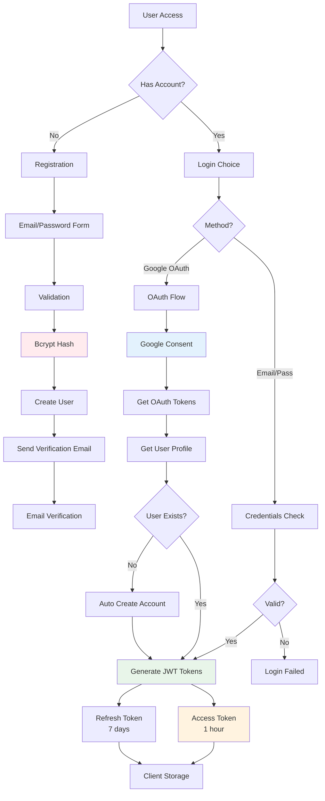
```mermaid
flowchart TB
    A[User Access] --> B{Has Account?}
    B -->|No| C[Registration]
    B -->|Yes| D[Login Choice]
    
    C --> E[Email/Password Form]
    E --> F[Validation]
    F --> G[Bcrypt Hash]
    G --> H[Create User]
    H --> I[Send Verification Email]
    I --> J[Email Verification]
    
    D --> K{Method?}
    K -->|Email/Pass| L[Credentials Check]
    K -->|Google OAuth| M[OAuth Flow]
    
    L --> N{Valid?}
    N -->|Yes| O[Generate JWT Tokens]
    N -->|No| P[Login Failed]
    
    M --> Q[Google Consent]
    Q --> R[Get OAuth Tokens]
    R --> S[Get User Profile]
    S --> T{User Exists?}
    T -->|Yes| O
    T -->|No| U[Auto Create Account]
    U --> O
    
    O --> V[Access Token<br/>1 hour]
    O --> W[Refresh Token<br/>7 days]
    V --> X[Client Storage]
    W --> X
    
    style G fill:#ffebee
    style O fill:#e8f5e9
    style Q fill:#e3f2fd
    style V fill:#fff3e0
```


##### Hình 10: Auth Module {#hình-10:-auth-module}

**Password Reset Mechanism:**

Khi user quên password, họ có thể request reset qua email. System generate secure reset token (UUID), hash nó với SHA-256, và lưu cả identifier và secret vào user record với expiry timestamp (1 giờ). Email chứa link với token identifier được gửi đến user.

Khi user click link và nhập password mới, system verify token chưa expired và hash matches. Nếu valid, password mới được hash và update, reset tokens bị clear. Tất cả existing sessions bị invalidate để force re-login across devices, preventing unauthorized access nếu attacker có old tokens.

#### **3.3.1.2. Users Module (User Profile Management)**

Users Module quản lý toàn bộ thông tin profile và preferences của người dùng. Module này cung cấp CRUD operations cho user data như first name, last name, avatar, timezone, và các settings cá nhân.

Một tính năng quan trọng là User Settings management với JSONB storage trong PostgreSQL. Thay vì tạo nhiều columns riêng cho mỗi setting, hệ thống sử dụng JSONB column `settings` để store flexible configuration. Ví dụ, user có thể config notification preferences (email enabled/disabled cho từng loại notification), default calendar view (week/month), working hours, theme preference (light/dark), language...

JSONB được chọn vì khả năng query và index tốt - PostgreSQL có thể index vào specific keys trong JSON, cho phép fast lookups mà vẫn giữ flexibility. Module expose API endpoints như `PATCH /users/me/settings` để update partial settings mà không overwrite toàn bộ object.

Users Module cũng handle avatar upload và processing. Khi user upload avatar image, file được validate (max 5MB, only JPEG/PNG/WebP), resize về multiple sizes (32x32 thumbnail, 128x128 medium, 512x512 large) using sharp library, và upload lên cloud storage (hoặc local filesystem trong development). Avatar URLs được update vào user record.

#### **3.3.1.3. Calendar Module (Calendar Metadata Management)**

Calendar Module khác với Event Module - nó quản lý calendars metadata chứ không phải individual events. Một user có thể có nhiều calendars, ví dụ: "Work", "Personal", "Family", mỗi calendar có màu sắc riêng để phân biệt trên UI.

Khi user connect Google Calendar, mỗi Google calendar được map với một Calento calendar record. Record này lưu `google_calendar_id`, `name`, `timezone`, `color`, và là `primary` calendar hay không. System duy trì sync relationship này để biết events nào thuộc calendar nào.

Calendar Module cũng quản lý calendar sharing permissions (trong tương lai). Hiện tại mỗi user chỉ thấy calendars của chính họ, nhưng architecture đã chuẩn bị cho team calendars - permissions table có thể define ai có quyền view/edit calendar nào.

### **3.3.2. Event Management Modules**

Đây là nhóm module cốt lõi (Core Modules) chịu trách nhiệm về toàn bộ nghiệp vụ quản lý lịch trình và đặt hẹn.

#### **3.3.2.1. Calendar & Event Module**

Module này quản lý vòng đời của các đối tượng Calendar và Event, đóng vai trò là xương sống dữ liệu của hệ thống.

*   **Quản lý sự kiện (Event Lifecycle)**: Hỗ trợ đầy đủ các thao tác CRUD cho sự kiện đơn (Single Events) và lặp lại (Recurring Events). Mỗi sự kiện lưu trữ thông tin chi tiết: thời gian, địa điểm, mô tả, màu sắc, và danh sách người tham dự (Attendees).
*   **Recurrence Engine (RRULE)**: Tích hợp engine xử lý chuẩn RFC 5545 để quản lý các sự kiện lặp lại phức tạp (v.d: "Họp vào 9h sáng thứ Hai cách tuần"). Engine này tự động tính toán và generate các instances cụ thể (occurrences) từ quy tắc lặp, giúp user nhìn thấy đầy đủ lịch trình trong tương lai mà không cần lưu cứng hàng nghìn record vào DB.
*   **Timezone & Localization**: Xử lý logic chuyển đổi múi giờ (Timezone Conversion) để ensuring thời gian hiển thị chính xác cho user ở bất kỳ đâu. Mọi thời gian đều được lưu trữ dưới dạng UTC trong database và chỉ convert sang local time khi hiển thị.

_(Xem chi tiết quy trình xử lý tại mục 3.3.5 - Sơ đồ tuần tự)_

#### **3.3.2.2. Booking Module**

Module Booking giải quyết bài toán cốt lõi về "tìm giờ rảnh và đặt hẹn", giúp automate quy trình lên lịch họp.

*   **Availability Engine (Công cụ tính giờ rảnh)**: Đây là logic phức tạp nhất. Engine phân tích Availability Rules (khung giờ làm việc) của user, trừ đi các sự kiện bận (Busy Events) từ Calendar Module, tính toán cả Buffer Time (thời gian nghỉ giữa các cuộc họp) và Advance Notice (thời gian báo trước). Kết quả là danh sách các "Slots" khả dụng để guest có thể book.
*   **Booking Link Flow**: Quản lý việc tạo và cấu hình các trang đặt lịch công khai (Public Booking Page). Mỗi link có thể tùy chỉnh thời lượng (15/30/60 phút), câu hỏi khảo sát (Custom Questions), và cấu hình xác nhận tự động.
*   **Multi-step Booking Process**: Xử lý transaction đặt lịch an toàn: (1) Guest chọn slot -> (2) System hold slot tạm thời -> (3) Guest điền info -> (4) Confirm booking -> (5) Create Event & Send Emails. Quy trình này đảm bảo không bị double-booking (hai người đặt cùng lúc 1 giờ).

_(Xem chi tiết quy trình đặt lịch tại mục 3.3.5 - Sơ đồ tuần tự)_

### **3.3.2. AI & RAG Modules**

Đây là nhóm module cốt lõi tạo nên tính năng đặc trưng của Calento - trợ lý ảo AI thông minh. Kiến trúc được thiết kế theo mô hình RAG (Retrieval-Augmented Generation) để đảm bảo AI có thể trả lời chính xác dựa trên dữ liệu thực tế của người dùng.

#### **3.3.2.1. LLM Module (Large Language Model Service)**

Module LLM đóng vai trò là lớp trung gian (wrapper layer) giữa hệ thống Calento và Google Gemini API, cung cấp một interface thống nhất và dễ sử dụng cho các module khác. Việc thiết kế theo pattern này giúp tách biệt logic nghiệp vụ khỏi chi tiết triển khai của LLM provider cụ thể, cho phép dễ dàng thay đổi hoặc mở rộng trong tương lai.

**Kiến trúc và thành phần:**

Module được thiết kế với ba nhóm chức năng chính. Nhóm đầu tiên quản lý Model Configuration & Initialization, chịu trách nhiệm khởi tạo Gemini model với các tham số được điều chỉnh tối ưu cho domain quản lý lịch. Tham số `temperature` được thiết lập ở mức 0.7 để cân bằng giữa tính sáng tạo và nhất quán trong câu trả lời. Các tham số `topK` (40) và `topP` (0.95) điều chỉnh quá trình sampling để đảm bảo chất lượng output. Giới hạn `maxOutputTokens` ở 2048 tokens giúp kiểm soát độ dài phản hồi và chi phí API. Đặc biệt, `safetySettings` được cấu hình để lọc các nội dung có hại, đảm bảo an toàn cho người dùng.

Nhóm chức năng thứ hai là Prompt Engineering, quản lý system prompts được tối ưu hóa đặc biệt cho việc quản lý thời gian. System prompt định nghĩa rõ ràng vai trò của AI là "Calento AI Assistant - trợ lý thông minh chuyên về quản lý thời gian", với nhiệm vụ cụ thể là hỗ trợ người dùng quản lý lịch trình, tìm kiếm events, và đề xuất thời gian họp hợp lý. Phong cách giao tiếp được thiết kế thân thiện, ngắn gọn nhưng chính xác, có sử dụng emoji phù hợp để tăng tính tương tác. Module cũng hỗ trợ đa ngôn ngữ, tự động phát hiện và trả lời bằng tiếng Việt hoặc tiếng Anh tùy theo ngôn ngữ câu hỏi của người dùng.

Nhóm thứ ba triển khai Streaming Support thông qua Server-Sent Events (SSE), cho phép AI stream responses về client theo thời gian thực. Thay vì chờ đợi câu trả lời hoàn chỉnh, người dùng thấy từng phần của response xuất hiện dần, tạo trải nghiệm tương tác tốt hơn tương tự như ChatGPT. Điều này đặc biệt quan trọng với các câu trả lời dài hoặc phức tạp.

**Function Calling Integration:**

Một tính năng đặc biệt quan trọng của LLM Module là khả năng Function Calling - cho phép AI không chỉ trả lời câu hỏi mà còn thực hiện các hành động cụ thể trong hệ thống. Module định nghĩa bốn functions chính mà AI có thể gọi: `createEvent` để tạo sự kiện mới với đầy đủ thông tin về tiêu đề, thời gian bắt đầu/kết thúc và danh sách người tham dự; `findAvailableSlots` để tìm các khung giờ rảnh dựa trên ngày và thời lượng mong muốn; `searchEvents` để tìm kiếm events theo semantic meaning thay vì keyword matching truyền thống; và `getScheduleSummary` để tóm tắt lịch trình trong một khoảng thời gian cụ thể.

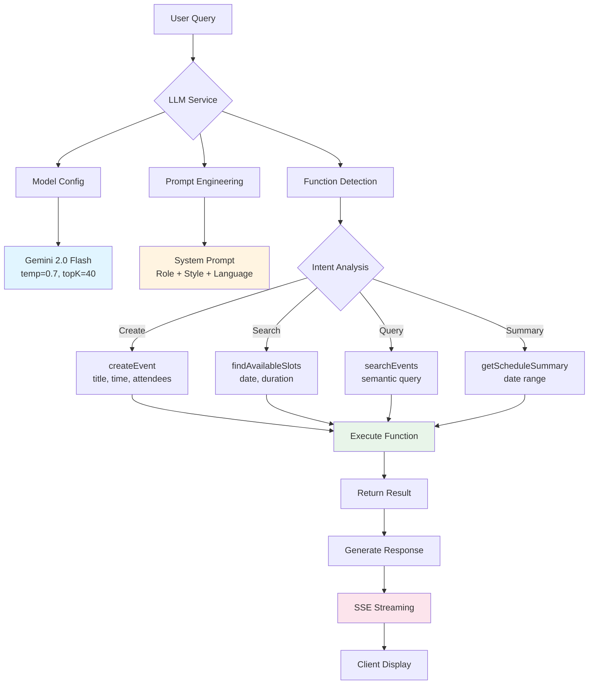
```mermaid
graph TB
    A[User Query] --> B{LLM Service}
    B --> C[Model Config]
    C --> D[Gemini 2.0 Flash<br/>temp=0.7, topK=40]
    
    B --> E[Prompt Engineering]
    E --> F[System Prompt<br/>Role + Style + Language]
    
    B --> G[Function Detection]
    G --> H{Intent Analysis}
    
    H -->|Create| I[createEvent<br/>title, time, attendees]
    H -->|Search| J[findAvailableSlots<br/>date, duration]
    H -->|Query| K[searchEvents<br/>semantic query]
    H -->|Summary| L[getScheduleSummary<br/>date range]
    
    I --> M[Execute Function]
    J --> M
    K --> M
    L --> M
    
    M --> N[Return Result]
    N --> O[Generate Response]
    O --> P[SSE Streaming]
    P --> Q[Client Display]
    
    style D fill:#e1f5ff
    style F fill:#fff4e1
    style M fill:#e8f5e9
    style P fill:#fce4ec
```


##### Hình 13: LLM Module Architecture {#hình-13:-llm-module-architecture}

**Luồng xử lý chi tiết:**

Khi nhận được một câu hỏi từ người dùng, LLM Service thực hiện chuỗi xử lý theo quy trình chặt chẽ. Đầu tiên, câu hỏi được đưa qua Intent Analysis để xác định người dùng muốn thực hiện hành động gì - tạo sự kiện mới, tìm kiếm thông tin, hay chỉ đơn giản là hỏi thông tin. Dựa trên kết quả phân tích, module có thể trigger function calling tương ứng hoặc chuyển sang generation mode thuần túy. Toàn bộ quá trình này được tối ưu hóa để đảm bảo thời gian phản hồi nhanh và độ chính xác cao.

#### **3.3.2.2. LangChain Integration Layer**

LangChain được tích hợp vào hệ thống như một orchestration framework, đóng vai trò điều phối luồng xử lý phức tạp giữa các components khác nhau bao gồm LLM, Vector Store, và Memory management. Framework này không thay thế mà bổ trợ cho LLM Module, cung cấp các abstractions và utilities giúp code dễ maintain và extend hơn.

**Memory Management với Chat Message History:**

Một trong những thách thức lớn nhất khi xây dựng chatbot là quản lý ngữ cảnh hội thoại (conversation context). LangChain giải quyết vấn đề này thông qua component ChatMessageHistory, tự động lưu trữ và retrieve lịch sử tin nhắn. Component này được cấu hình với `returnMessages: true` để trả về full message objects thay vì chỉ text, cho phép giữ metadata quan trọng như timestamps và roles. Memory key được đặt là "chat_history" và được map với input/output keys tương ứng, tạo ra một pipeline xử lý rõ ràng và dễ debug.

**Prompt Templates và Standardization:**

Thay vì concatenate strings thủ công để tạo prompts - một practice dễ gây lỗi và khó maintain - LangChain cung cấp ChatPromptTemplate system. Template này cho phép định nghĩa prompts dưới dạng structured messages với placeholders cho dynamic content. System message chứa instructions không đổi về vai trò và hành vi của AI, trong khi human message template chứa context từ RAG và câu hỏi thực tế của user. Cấu trúc này đảm bảo tính nhất quán trong cách prompts được format và dễ dàng A/B testing các phiên bản prompt khác nhau.

**LLM Chain và Composition Pattern:**

Một trong những điểm mạnh nhất của LangChain là khả năng compose các operations phức tạp từ simple components thông qua piping mechanism. Prompt template được pipe vào LLM, output của LLM được pipe vào parser, tạo thành một chain xử lý liền mạch. Pattern này mang lại nhiều lợi ích: code trở nên declarative và self-documenting; dễ dàng insert thêm processing steps vào giữa chain; và có thể reuse các sub-chains cho nhiều use cases khác nhau.

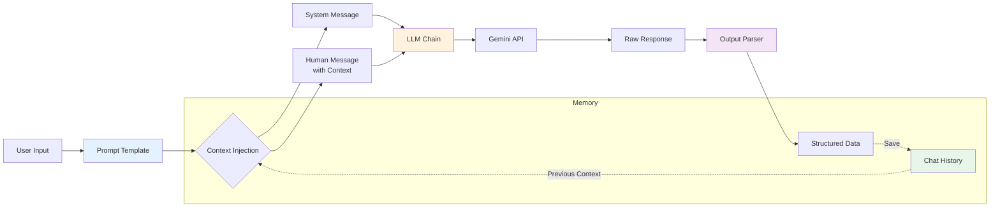
```mermaid
graph LR
    A[User Input] --> B[Prompt Template]
    B --> C{Context Injection}
    C --> D[System Message]
    C --> E[Human Message<br/>with Context]
    
    D --> F[LLM Chain]
    E --> F
    
    F --> G[Gemini API]
    G --> H[Raw Response]
    H --> I[Output Parser]
    I --> J[Structured Data]
    
    subgraph Memory
        K[Chat History]
        K -.->|Previous Context| C
        J -.->|Save| K
    end
    
    style B fill:#e3f2fd
    style F fill:#fff3e0
    style I fill:#f3e5f5
    style K fill:#e8f5e9
```


**Lợi ích của LangChain trong hệ thống:**

Việc tích hợp LangChain mang lại bốn lợi ích chính cho dự án Calento. Thứ nhất là Abstraction - khả năng trừu tượng hóa các LLM providers khác nhau. Nếu trong tương lai cần chuyển từ Gemini sang OpenAI GPT hoặc Anthropic Claude, chỉ cần thay đổi LLM initialization mà không ảnh hưởng đến business logic. Thứ hai là Memory Management với built-in conversation memory giúp AI nhớ ngữ cảnh các cuộc hội thoại trước đó. Thứ ba, Chaining pattern cho phép compose complex workflows từ simple, testable components. Cuối cùng là Observability - LangChain cung cấp built-in logging và debugging tools giúp track từng bước xử lý, vô cùng hữu ích khi troubleshoot issues trong production.


#### **3.3.2.3. Vector Module (Embedding & Similarity Search)**

Module Vector quản lý toàn bộ vòng đời (lifecycle) của vector embeddings, từ quá trình generate embeddings cho text, lưu trữ vào database, đến việc tìm kiếm semantic similarity. Đây là nền tảng kỹ thuật cho tính năng RAG - cho phép AI không chỉ dựa vào general knowledge mà còn truy xuất thông tin cụ thể từ dữ liệu người dùng.

**Embedding Generation Process:**

Hệ thống sử dụng model `text-embedding-004` của Google, một trong những embedding models tiên tiến nhất hiện nay với nhiều ưu điểm vượt trội. Model này tạo ra vectors có 768 chiều (dimensions), một kích thước đủ lớn để capture semantic meaning nhưng vẫn hiệu quả cho việc storage và retrieval. Điểm đặc biệt là khả năng hỗ trợ đa ngôn ngữ, bao gồm cả tiếng Việt và tiếng Anh, đảm bảo rằng người dùng Việt Nam có trải nghiệm tìm kiếm chất lượng tương đương với các ngôn ngữ phổ biến khác. Model được optimize đặc biệt cho short texts như event titles và descriptions - đúng với use case của ứng dụng lịch.

Quá trình generate embedding diễn ra như sau: khi nhận được một đoạn text (ví dụ: "Hop team về sprint planning tuần sau"), module gọi API của Google Generative AI với model embedding đã được khởi tạo sẵn. API trả về một array của 768 số thực (float numbers), mỗi số đại diện cho một dimension trong semantic space. Vector này sau đó được lưu trữ vào PostgreSQL database cùng với original text và metadata liên quan.

**Storage và Indexing với pgvector:**

PostgreSQL được mở rộng với extension pgvector, cho phép lưu trữ và query vector data một cách native. Extension này cung cấp data type `vector(768)` để store embeddings và các operators đặc biệt cho vector operations. Operator `<=>` (cosine distance) được sử dụng để đo độ tương đồng giữa hai vectors - giá trị càng nhỏ nghĩa là hai vectors càng giống nhau (tương tự về semantic meaning).

Để tối ưu hóa performance, hệ thống sử dụng HNSW index (Hierarchical Navigable Small World) - một loại approximate nearest neighbor index được thiết kế đặc biệt cho high-dimensional vectors. Index này cho phép search trong hàng trăm nghìn vectors với thời gian phản hồi dưới 10 milliseconds, đảm bảo trải nghiệm real-time cho người dùng.

**Similarity Search Workflow:**

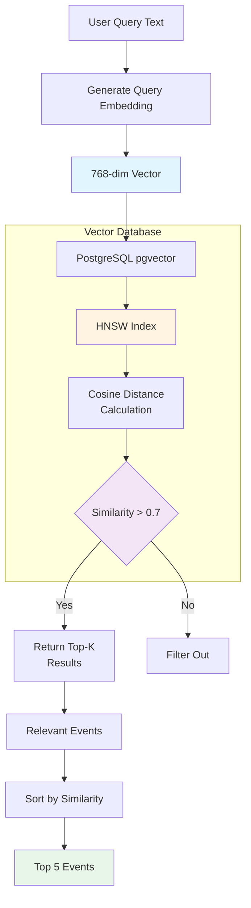
```mermaid
graph TB
    A[User Query Text] --> B[Generate Query Embedding]
    B --> C[768-dim Vector]
    C --> D[PostgreSQL pgvector]
    
    subgraph "Vector Database"
        D --> E[HNSW Index]
        E --> F[Cosine Distance<br/>Calculation]
        F --> G{Similarity > 0.7}
    end
    
    G -->|Yes| H[Return Top-K<br/>Results]
    G -->|No| I[Filter Out]
    
    H --> J[Relevant Events]
    J --> K[Sort by Similarity]
    K --> L[Top 5 Events]
    
    style C fill:#e1f5ff
    style E fill:#fff4e1
    style G fill:#f3e5f5
    style L fill:#e8f5e9
```


##### Hình 14: Vector Similarity Search Process {#hình-14:-vector-similarity-search-process}

Quá trình search diễn ra trong ba bước chính. Đầu tiên, user query được transform thành vector embedding sử dụng cùng model `text-embedding-004`. Thứ hai, vector này được so sánh với tất cả vectors đã lưu trong database sử dụng cosine distance, với HNSW index giúp tăng tốc computation đáng kể. Cuối cùng, kết quả được filter theo threshold (similarity > 0.7), sort theo độ tương đồng giảm dần, và trả về top 5 events most relevant với query.

#### **3.3.2.4. RAG Module (Retrieval-Augmented Generation)**

RAG Module là tầng integration cao nhất, kết hợp Vector Service và LLM Service theo RAG pattern để tạo ra một AI assistant context-aware và chính xác. Module này thực hiện vai trò cầu nối, orchestrate quá trình retrieval và generation thành một workflow liền mạch.

**Three-Phase RAG Workflow:**

Quy trình RAG được chia thành ba phases rõ ràng, mỗi phase có trách nhiệm riêng biệt. Phase 1 - Retrieval (Tìm kiếm) là bước đầu tiên khi user gửi câu hỏi. RAG Service nhận query text và chuyển ngay cho Vector Service để generate embedding. Embedding này được sử dụng để search trong database, tìm ra 5 events có semantic meaning gần nhất với câu hỏi. Ví dụ, nếu user hỏi "Tôi có gặp client nào tuần này không?", vector search sẽ tìm ra các events có keywords như "client", "meeting", "presentation" trong tuần hiện tại, ngay cả khi exact phrase "gặp client" không xuất hiện trong event title.

Phase 2 - Augmentation (Làm giàu) là bước format và inject context vào prompt. RAG Service lấy 5 events vừa retrieve được, transform chúng thành JSON format với các fields relevant (title, start_time, end_time, location, attendees). JSON này được concatenate với user query và system instructions để tạo thành một complete prompt. Prompt này rõ ràng chỉ dẫn LLM: "Dựa vào các events trong context, hãy trả lời câu hỏi của user một cách chính xác. Nếu thông tin không có trong context, hãy thành thật nói không biết thay vì đoán".

Phase 3 - Generation (Sinh câu trả lời) là bước cuối cùng khi augmented prompt được gửi đến Gemini LLM. Model phân tích context và question, generate response dựa trên factual information từ events thay vì hallucinate. Response được stream về client qua SSE, cho phép user thấy từng phần câu trả lời xuất hiện real-time, tạo trải nghiệm interactive tốt.

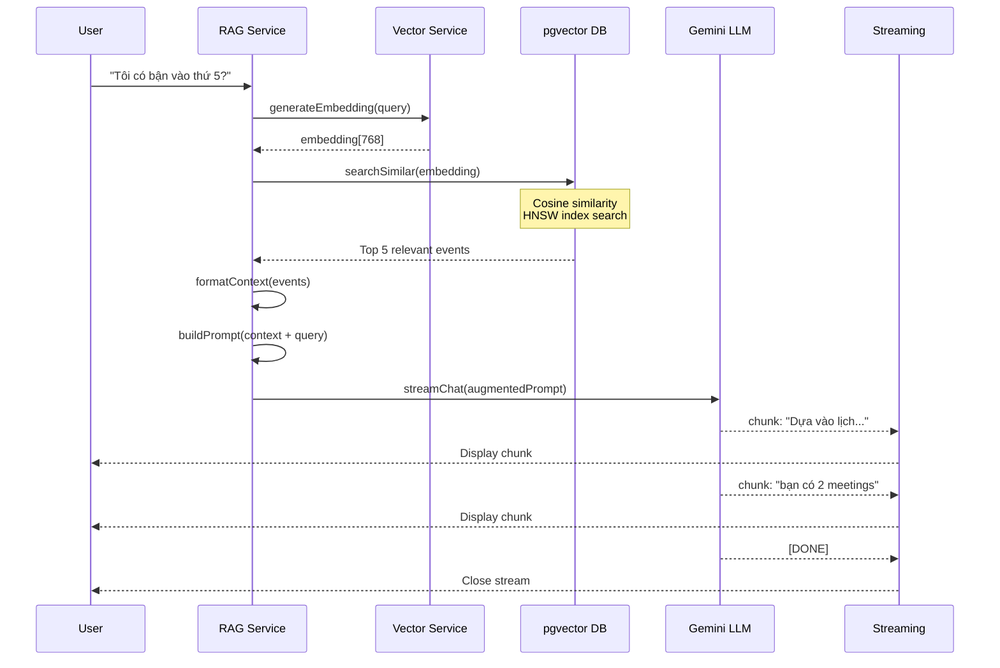
```mermaid
sequenceDiagram
    participant U as User
    participant RAG as RAG Service
    participant VEC as Vector Service
    participant DB as pgvector DB
    participant LLM as Gemini LLM
    participant SSE as Streaming

    U->>RAG: "Tôi có bận vào thứ 5?"
    RAG->>VEC: generateEmbedding(query)
    VEC-->>RAG: embedding[768]
    
    RAG->>DB: searchSimilar(embedding)
    Note over DB: Cosine similarity<br/>HNSW index search
    DB-->>RAG: Top 5 relevant events
    
    RAG->>RAG: formatContext(events)
    RAG->>RAG: buildPrompt(context + query)
    
    RAG->>LLM: streamChat(augmentedPrompt)
    LLM-->>SSE: chunk: "Dựa vào lịch..."
    SSE-->>U: Display chunk
    LLM-->>SSE: chunk: "bạn có 2 meetings"
    SSE-->>U: Display chunk
    LLM-->>SSE: [DONE]
    SSE-->>U: Close stream
```


##### Hình 15: RAG Sequence Flow {#hình-15:-rag-sequence-flow}

**Context Quality và Relevance Filtering:**

Một thách thức quan trọng trong RAG là đảm bảo chất lượng context được inject vào prompt. Nếu retrieve quá nhiều irrelevant events, LLM có thể bị confused và đưa ra câu trả lời sai. Hệ thống giải quyết vấn đề này bằng similarity threshold - chỉ những events có similarity score > 0.7 mới được consider. Ngưỡng này được fine-tune qua testing để cân bằng giữa recall (không bỏ sót events quan trọng) và precision (không include events không liên quan).

Trong trường hợp không tìm thấy events nào đạt threshold, RAG Service sẽ truyền empty context cho LLM kèm instruction rõ ràng: "No relevant events found in user's calendar. Answer based on general knowledge or inform user you don't have specific information". Cơ chế này prevent hallucination - một vấn đề phổ biến với LLMs khi chúng "bịa" thông tin không có thật.

### **3.3.3. Google Calendar Sync Module**

Module Google Calendar Sync là một trong những components phức tạp nhất của hệ thống, chịu trách nhiệm đồng bộ dữ liệu hai chiều giữa Calento và Google Calendar. Thiết kế phải đảm bảo data consistency trong môi trường distributed system - một bài toán không hề đơn giản khi có hai sources of truth độc lập.

**OAuth Authentication Flow:**

Trước khi có thể đồng bộ, user phải authorize Calento truy cập Google Calendar của họ thông qua OAuth 2.0 flow. Quy trình bắt đầu khi user click nút "Connect Google Calendar" trên UI. Backend generate OAuth URL với các scopes cần thiết (`calendar.events`, `calendar.readonly`) và redirect user đến Google consent screen. Sau khi user chấp

 thuận, Google redirect về Calento callback URL kèm authorization code. Backend exchange code này lấy access token (valid 1 giờ) và refresh token (long-lived), lưu vào `user_credentials` table với encryption.

**Bi-directional Sync Architecture:**

Sync process được chia thành hai phases chạy độc lập: PULL (Google → Calento) và PUSH (Calento → Google). Cả hai phases được trigger bởi background job chạy định kỳ mỗi 5 phút, đảm bảo dữ liệu luôn gần như real-time nhưng không quá tải API quota của Google.

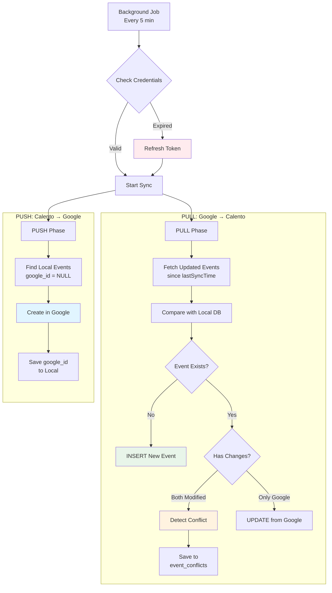
```mermaid
graph TB
    A[Background Job<br/>Every 5 min] --> B{Check Credentials}
    B -->|Expired| C[Refresh Token]
    B -->|Valid| D[Start Sync]
    C --> D
    
    D --> E[PULL Phase]
    D --> F[PUSH Phase]
    
    subgraph "PULL: Google → Calento"
        E --> G[Fetch Updated Events<br/>since lastSyncTime]
        G --> H[Compare with Local DB]
        H --> I{Event Exists?}
        I -->|No| J[INSERT New Event]
        I -->|Yes| K{Has Changes?}
        K -->|Both Modified| L[Detect Conflict]
        K -->|Only Google| M[UPDATE from Google]
        L --> N[Save to<br/>event_conflicts]
    end
    
    subgraph "PUSH: Calento → Google"
        F --> O[Find Local Events<br/>google_id = NULL]
        O --> P[Create in Google]
        P --> Q[Save google_id<br/>to Local]
    end
    
    style C fill:#ffebee
    style L fill:#fff3e0
    style J fill:#e8f5e9
    style P fill:#e1f5ff
```


##### Hình 16: Google Calendar Sync Flow {#hình-16:-google-calendar-sync-flow}

PULL Phase sử dụng Google Calendar API endpoint `events.list()` với parameter `updatedMin` set to `lastSyncTime`, ensuring chỉ fetch events đã được modified từ lần sync cuối. Mỗi event từ Google được compare với local database dựa vào `google_event_id`. Nếu event chưa tồn tại locally, thực hiện INSERT. Nếu đã tồn tại, compare `updated_at` timestamps - nếu cả hai phía đều có changes (local modified_at > last_sync AND Google updated > last_sync), đây là conflict case cần user resolution.

PUSH Phase  query database tìm tất cả events có `google_event_id IS NULL` - đây là các events được tạo trong Calento chưa sync lên Google. Mỗi event được transform sang Google Calendar format (convert time zones, map fields) và call `events.insert()` API. Sau khi create thành công, `google_event_id` được update vào local database để track relationship.

**Conflict Resolution Mechanism:**

Conflict xảy ra khi cùng một event bị modify ở cả hai hệ thống trong cùng sync interval. Hệ thống detect conflict bằng cách compare `updated_at` timestamp của local event với `updated` timestamp từ Google response - nếu cả hai đều > `last_sync_at`, có conflict. Thay vì tự động overwrite (có thể mất dữ liệu), system lưu conflict vào table `event_conflicts` với full data từ cả hai phía và notify user.

User được present với conflict resolution UI, cho phép chọn một trong bốn strategies: `prefer_google` (giữ version từ Google, discard local changes); `prefer_calento` (push local changes lên Google, overwrite); `keep_both` (tạo hai events riêng biệt với suffixes); hoặc `manual` (user tự merge fields từ hai versions). Decision được execute và conflict record được mark resolved.

### **3.3.4. Notification System Module**

Notification System được thiết kế theo mô hình event-driven architecture với message queue, đảm bảo notifications được deliver reliably ngay cả khi có failures. Hệ thống hỗ trợ  nhiều kênh thông báo khác nhau, mỗi kênh phù hợp cho các use cases cụ thể.

**Multi-channel Architecture:**

Hệ thống hiện hỗ trợ hai kênh chính: Email (primary channel) và Webhook (cho integrations). Email channel xử lý các notifications quan trọng như event reminders, booking confirmations, team invitations. Webhook channel cho phép developers tích hợp Calento với external systems như Slack workspace notifications hoặc custom business logic.

Notification Service hoạt động như central coordinator. Khi một event trigger notification (ví dụ: user tạo sự kiện mới), service check user preferences trong database để xác định kênh nào enabled. Nếu email enabled, một job được add vào email queue. Nếu webhook enabled, job được add vào webhook queue. Queuing mechanism đảm bảo notifications không block main request thread và có thể retry nếu delivery fails.

**Email Worker Implementation:**

Email worker được implement với BullMQ - một robust Redis-based queue system. Worker subscribe vào `send-notification` queue và process jobs concurrently (configurable concurrency limit để avoid overwhelming SMTP server). Mỗi job chứa `userId`, `notificationType`, và `data` object with template variables.

Worker đầu tiên select email template tương ứng với notification type từ template storage. Templates được viết bằng Handlebars syntax, cho phép dynamic content injection. Ví dụ, template `event-reminder.hbs` có placeholders như `{{event.title}}`, `{{event.start_time}}`, `{{user.first_name}}`. Worker compile template với actual data, generate HTML email body, và gửi qua Nodemailer với SMTP configuration.

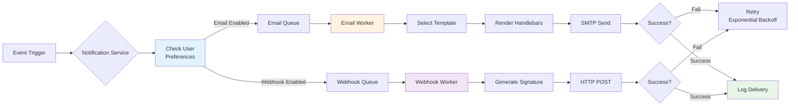
```mermaid
flowchart LR
    A[Event Trigger] --> B{Notification Service}
    B --> C[Check User<br/>Preferences]
    
    C -->|Email Enabled| D[Email Queue]
    C -->|Webhook Enabled| E[Webhook Queue]
    
    D --> F[Email Worker]
    F --> G[Select Template]
    G --> H[Render Handlebars]
    H --> I[SMTP Send]
    
    E --> J[Webhook Worker]
    J --> K[Generate Signature]
    K --> L[HTTP POST]
    
    I --> M{Success?}
    L --> N{Success?}
    
    M -->|Fail| O[Retry<br/>Exponential Backoff]
    N -->|Fail| O
    
    M -->|Success| P[Log Delivery]
    N -->|Success| P
    
    style C fill:#e3f2fd
    style F fill:#fff3e0
    style J fill:#f3e5f5
    style P fill:#e8f5e9
```


##### Hình 17: Notification Multi-channel System {#hình-17:-notification-multi-channel-system}

**Notification Types và Prioritization:**

Hệ thống định nghĩa bảy loại notifications với priority levels khác nhau. `event_reminder` notifications (15 phút trước event) có priority `High` và được process với higher concurrency. `booking_created` notifications cũng có priority `High` vì liên quan đến commitment giữa hai người - delay có thể gây hiểu lầm. `sync_conflict` và `team_invitation` có priority `Medium`, trong khi `event_created` có priority `Low` vì không time-sensitive.

Priority được implement thông qua separate queues với different worker  configurations. High-priority queue có concurrency 10 workers, Medium có 5, Low có 2. Cấu hình này đảm bảo critical notifications luôn được process nhanh chóng ngay cả khi system under load.

### **3.3.5. Webhook System Module**

Webhook System cho phép Calento integrate với external services theo event-driven pattern. Thay vì external services phải constantly poll Calento API để check updates, webhooks "push" notifications đến configured endpoints ngay khi events xảy ra.

**Configuration và Security:**

User configure webhooks qua dashboard UI, specify endpoint URL, select which event types muốn subscribe (ví dụ: chỉ `booking.created` và `booking.cancelled`), và nhận một secret key. Secret key này critical cho security - được sử dụng để generate HMAC-SHA256 signature cho mỗi webhook payload. Receiver có thể verify signature bằng same secret để authenticate rằng request thực sự đến từ Calento, không phải attacker.

System enforce HTTPS-only policy - webhook URLs phải dùng `https://` protocol. HTTP endpoints bị reject để prevent man-in-the-middle attacks. Rate limiting cũng được apply: maximum 100 webhooks per minute per user để prevent abuse và protect both Calento infrastructure và receiving endpoints.

**Delivery và Retry Logic:**

Khi một webhook-eligible eventxảy ra (ví dụ: guest book appointment), Webhook Service construct payload theo predefined schema, generate HMAC signature, và attempt delivery qua HTTP POST request với 10-second timeout. Request headers include `X-Calento-Signature` (HMAC hash), `X-Calento-Event` (event type), và `Content-Type: application/json`.

Nếu request fails (network error, timeout, non-2xx response), retry mechanism kicks in với exponential backoff strategy. First retry sau 1 minute, second retry sau 5 minutes, third retry sau 15 minutes. Sau 3 failed attempts, webhook được mark failed và admin notification sent. Retry mechanism balance giữa reliability (not giving up too quickly) và efficiency (not hammering failing endpoints).

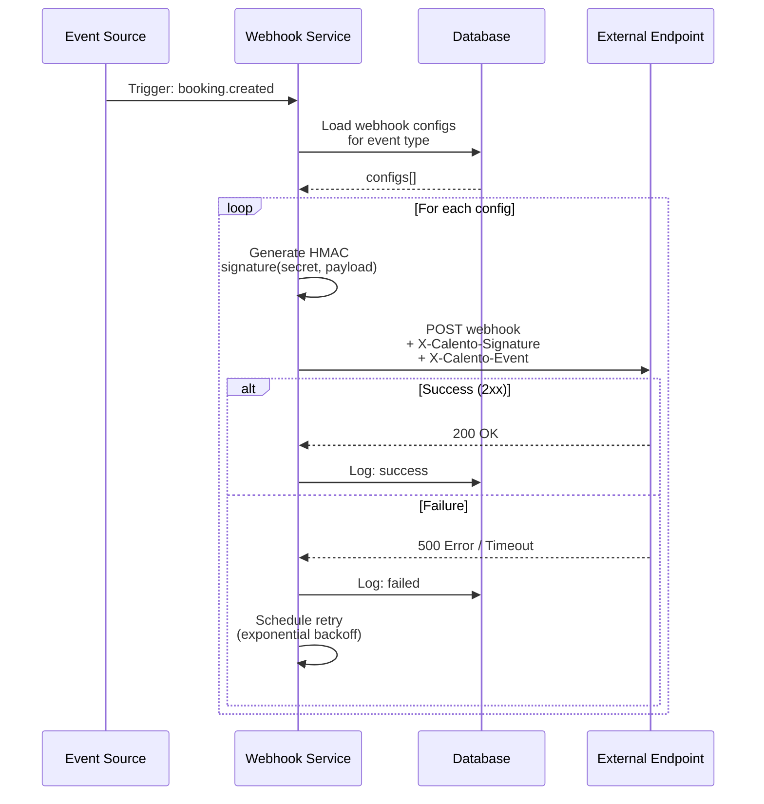
```mermaid
sequenceDiagram
    participant E as Event Source
    participant WS as Webhook Service
    participant DB as Database
    participant EXT as External Endpoint
    
    E->>WS: Trigger: booking.created
    WS->>DB: Load webhook configs<br/>for event type
    DB-->>WS: configs[]
    
    loop For each config
        WS->>WS: Generate HMAC<br/>signature(secret, payload)
        
        WS->>EXT: POST webhook<br/>+ X-Calento-Signature<br/>+ X-Calento-Event
        
        alt Success (2xx)
            EXT-->>WS: 200 OK
            WS->>DB: Log: success
        else Failure
            EXT-->>WS: 500 Error / Timeout
            WS->>DB: Log: failed
            WS->>WS: Schedule retry<br/>(exponential backoff)
        end
    end
```


##### Hình 18: Webhook Delivery Flow {#hình-18:-webhook-delivery-flow}

**Payload Structure và Versioning:**

Webhook payloads follow consistent JSON schema với top-level fields: `event` (event type string), `timestamp` (ISO8601 UTC), và `data` (event-specific payload). Ví dụ, `booking.created` payload chứa booking details (ID, link slug), guest information (name, email, phone), scheduled time (start, end, timezone), và optionally event metadata.

System support API versioning để maintain backward compatibility. Header `X-Calento-API-Version: v1` allows receivers biết schema version. Khi introduce breaking changes trong future, version 2 sẽ được released với option cho users migrate at their own pace, avoiding sudden breakage của existing integrations.

* Queue Module: Cấu hình BullMQ.  
* Email Module: Worker xử lý việc gửi email notification bất đồng bộ.  
* Sync Worker: Worker chạy định kỳ để đồng bộ lịch từ Google Calendar về database nội bộ.

![][image15]

![][image16]

##### Hình 19: Worker & Infrastructure {#hình-19:-worker-&-infrastructure}

## **3.3. Thiết kế dữ liệu**

Cơ sở dữ liệu PostgreSQL được thiết kế tuân theo nguyên tắc chuẩn hóa (normalization) để đảm bảo data integrity, giảm redundancy, và optimize performance. Đặc biệt, database được mở rộng với extension `pgvector` để hỗ trợ việc lưu trữ và tìm kiếm vector embeddings - một công nghệ tiên tiến phục vụ cho tính năng AI Retrieval-Augmented Generation (RAG).

### **3.3.1. PostgreSQL Extensions & Custom Types**

**Extensions:**

Hệ thống sử dụng hai PostgreSQL extensions quan trọng. Extension `uuid-ossp` cung cấp functions để generate UUID (Universally Unique Identifiers) phiên bản 4, được sử dụng làm primary keys cho tất cả tables thay vì auto-increment integers. Lựa chọn này mang lại nhiều lợi ích: security cao hơn (không thể predict ID tiếp theo), support tốt cho distributed systems (có thể generate offline mà không lo collision), và thuận tiện khi merge data từ nhiều sources.

Extension `pgvector` là nền tảng cho AI capabilities, cho phép store và query high-dimensional vector embeddings. Extension này provide vector data type support dimensionality lên đến  16,000 dimensions (hệ thống dùng 768-dim), distance operators (cosine `<=>`, L2 `<->`, inner product `<#>`), và specialized indexes (HNSW, IVFFlat) cho approximate nearest neighbor search với performance cao.

**Custom ENUM Types:**

Database định nghĩa năm ENUM types để enforce data integrity tại database level:

- `event_status`: confirmed, cancelled, tentative (cho trạng thái events)
- `sync_status`: pull, push (tracking hướng đồng bộ Google Calendar)
- `sync_log_status`: success, failed, in_progress (monitor sync jobs)
- `provider_type`: google, outlook, apple (multi-provider support)
- `notification_channel`: email, slack, zalo, push (notification channels)

ENUM types giúp prevent invalid values, reduce storage (stored internally as integers), và improve query performance thông qua compile-time type checking.

### **3.3.2. Entity Relationship Diagram**

Hệ thống database bao gồm 18 core tables được tổ chức theo modules nghiệp vụ, với relationships được define rõ ràng qua foreign keys.

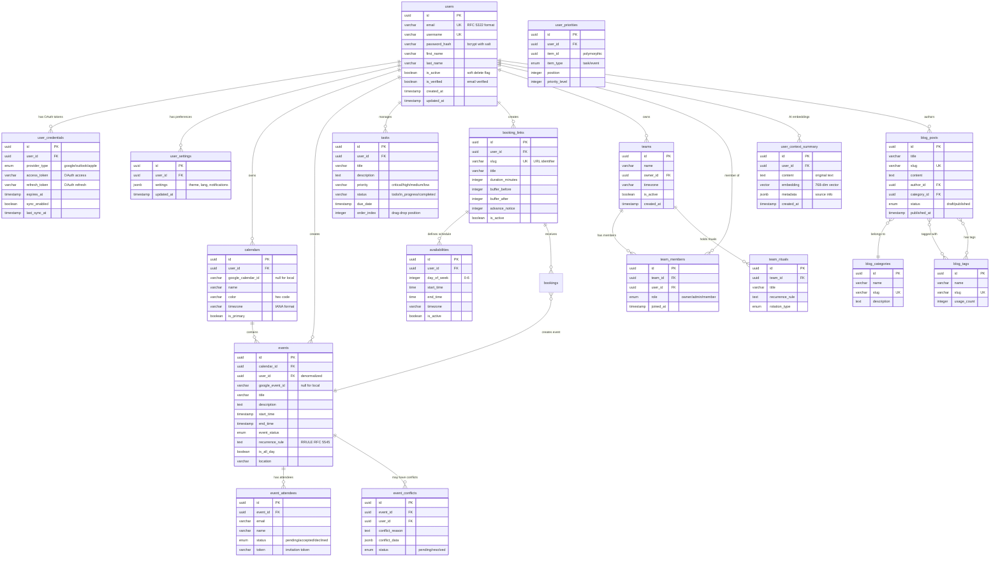
```mermaid
erDiagram
    users ||--o{ user_credentials : "has OAuth tokens"
    users ||--o{ user_settings : "has preferences"
    users ||--o{ calendars : "owns"
    users ||--o{ events : "creates"
    users ||--o{ tasks : "manages"
    users ||--o{ booking_links : "creates"
    users ||--o{ teams : "owns"
    users ||--o{ team_members : "member of"
    users ||--o{ user_context_summary : "AI embeddings"
    users ||--o{ blog_posts : "authors"
    
    calendars ||--o{ events : "contains"
    events ||--o{ event_attendees : "has attendees"
    events ||--o{ event_conflicts : "may have conflicts"
    
    booking_links ||--o{ availabilities : "defines schedule"
    booking_links ||--o{ bookings : "receives"
    bookings }o--|| events : "creates event"
    
    teams ||--o{ team_members : "has members"
    teams ||--o{ team_rituals : "holds rituals"
    
    blog_posts }o--|| blog_categories : "belongs to"
    blog_posts }o--o{ blog_tags : "tagged with"
    
    users {
        uuid id PK
        varchar email UK "RFC 5322 format"
        varchar username UK
        varchar password_hash "bcrypt with salt"
        varchar first_name
        varchar last_name
        boolean is_active "soft delete flag"
        boolean is_verified "email verified"
        timestamp created_at
        timestamp updated_at
    }
    
    user_credentials {
        uuid id PK
        uuid user_id FK
        enum provider_type "google/outlook/apple"
        varchar access_token "OAuth access"
        varchar refresh_token "OAuth refresh"
        timestamp expires_at
        boolean sync_enabled
        timestamp last_sync_at
    }
    
    calendars {
        uuid id PK
        uuid user_id FK
        varchar google_calendar_id "null for local"
        varchar name
        varchar color "hex code"
        varchar timezone "IANA format"
        boolean is_primary
    }
    
    events {
        uuid id PK
        uuid calendar_id FK
        uuid user_id FK "denormalized"
        varchar google_event_id "null for local"
        varchar title
        text description
        timestamp start_time
        timestamp end_time
        enum event_status
        text recurrence_rule "RRULE RFC 5545"
        boolean is_all_day
        varchar location
    }
    
    user_context_summary {
        uuid id PK
        uuid user_id FK
        text content "original text"
        vector embedding "768-dim vector"
        jsonb metadata "source info"
        timestamp created_at
    }
    
    booking_links {
        uuid id PK
        uuid user_id FK
        varchar slug UK "URL identifier"
        varchar title
        integer duration_minutes
        integer buffer_before
        integer buffer_after
        integer advance_notice
        boolean is_active
    }
    
    tasks {
        uuid id PK
        uuid user_id FK
        varchar title
        text description
        varchar priority "critical/high/medium/low"
        varchar status "todo/in_progress/completed"
        timestamp due_date
        integer order_index "drag-drop position"
    }
    user_settings {
        uuid id PK
        uuid user_id FK
        jsonb settings "theme, lang, notifications"
        timestamp updated_at
    }

    availabilities {
        uuid id PK
        uuid user_id FK
        integer day_of_week "0-6"
        time start_time
        time end_time
        varchar timezone
        boolean is_active
    }

    event_attendees {
        uuid id PK
        uuid event_id FK
        varchar email
        varchar name
        enum status "pending/accepted/declined"
        varchar token "invitation token"
    }

    event_conflicts {
        uuid id PK
        uuid event_id FK
        uuid user_id FK
        text conflict_reason
        jsonb conflict_data
        enum status "pending/resolved"
    }

    teams {
        uuid id PK
        varchar name
        uuid owner_id FK
        varchar timezone
        boolean is_active
        timestamp created_at
    }

    team_members {
        uuid id PK
        uuid team_id FK
        uuid user_id FK
        enum role "owner/admin/member"
        timestamp joined_at
    }

    team_rituals {
        uuid id PK
        uuid team_id FK
        varchar title
        text recurrence_rule
        enum rotation_type
    }

    blog_categories {
        uuid id PK
        varchar name
        varchar slug UK
        text description
    }

    blog_tags {
        uuid id PK
        varchar name
        varchar slug UK
        integer usage_count
    }

    blog_posts {
        uuid id PK
        varchar title
        varchar slug UK
        text content
        uuid author_id FK
        uuid category_id FK
        enum status "draft/published"
        timestamp published_at
    }
    
    blog_posts }o--o{ blog_tags : "has tags"

    user_priorities {
        uuid id PK
        uuid user_id FK
        uuid item_id "polymorphic"
        enum item_type "task/event"
        integer position
        integer priority_level
    }
```


##### Hình 20: Database Entity Relationship Diagram
{#hình-20:-database-entity-relationship-diagram}

### **3.3.3. Database Migration Strategy: Raw SQL**

**Quyết định kiến trúc: Tại sao dùng Raw SQL thay vì Prisma?**

Hệ thống Calento sử dụng raw SQL migrations trong `server/migrations/schema.sql` thay vì ORM như Prisma, mặc dù Prisma  rất phổ biến trong NestJS ecosystem. Quyết định này dựa trên bốn lý do kỹ thuật quan trọng.

Hệ thống Calento sử dụng raw SQL migrations trong `server/migrations/schema.sql` thay vì ORM như Prisma vì bốn lý do chính. Thứ nhất, để tận dụng các tính năng nâng cao của PostgreSQL như extension `pgvector` và custom ENUM types mà Prisma chưa hỗ trợ đầy đủ. Thứ hai, raw SQL mang lại sự minh bạch và kiểm soát tuyệt đối, giúp developers dễ dàng review và tối ưu từng câu lệnh DDL. Thứ ba, việc tối ưu hóa hiệu năng được thực hiện chi tiết thông qua các index parameters như fill factors hay index types (HNSW) mà ORM thường ẩn đi. Cuối cùng, đội ngũ phát triển ưu tiên cách tiếp cận SQL-first để tận dụng tối đa kinh nghiệm về PostgreSQL, giúp việc debug và bảo trì trở nên dễ dàng hơn.

**Migration Execution:**

Migrations được run manual hoặc automated trong CI/CD pipeline:

```bash
# Development
psql -U postgres -d calento < server/migrations/schema.sql

# Production (với transaction safety)
psql -U postgres -d calento_prod -v ON_ERROR_STOP=1 -f schema.sql
```

Schema file được tổ chức theo modules với comments rõ ràng, shared functions (như `update_updated_at_column()`), và IF NOT EXISTS clauses để support idempotency.


| STT | Table Name | Mô tả | Columns chính | Records ước tính |
| :---: | ----- | ----- | ----- | ----- |
| 1 | users | Thông tin tài khoản người dùng | id, email, username, password_hash, avatar, full_name | 1,000-10,000 |
| 2 | user_credentials | OAuth tokens (Google Calendar) | id, user_id, provider, access_token, refresh_token, expires_at | 500-5,000 |
| 3 | user_settings | Preferences người dùng (JSONB) | id, user_id, settings (JSONB) | 1,000-10,000 |
| 4 | calendars | Metadata lịch đồng bộ từ Google | id, user_id, google_calendar_id, name, timezone, is_primary | 2,000-20,000 |
| 5 | events | Sự kiện (synced hoặc local) | id, calendar_id, google_event_id, title, start_time, end_time, recurrence_rule, status | 50,000-500,000 |
| 6 | event_attendees | Người tham dự sự kiện với invitation tracking | id, event_id, email, name, response_status, invitation_token | 20,000-200,000 |
| 7 | event_conflicts | Xử lý conflicts khi đồng bộ | id, user_id, calento_event_id, google_event_id, conflict_reason, resolution | 100-1,000 |
| 8 | availabilities | Khung giờ rảnh hàng tuần của user | id, user_id, day_of_week, start_time, end_time, timezone | 5,000-50,000 |
| 9 | booking_links | Trang đặt lịch công khai | id, user_id, slug, title, duration_minutes, advance_notice_hours | 2,000-20,000 |
| 10 | bookings | Lịch hẹn từ booking links | id, booking_link_id, user_id, event_id, booker_name, booker_email, start_time, status | 10,000-100,000 |
| 11 | tasks | Công việc cần làm (To-do) | id, user_id, title, status, priority, due_date, recurrence_rule | 20,000-200,000 |
| 12 | user_priorities | Ưu tiên cho tasks/items trong priority board | id, user_id, item_id, item_type, priority, position | 10,000-100,000 |
| 13 | teams | Thông tin nhóm (collaborative) | id, name, owner_id, timezone, settings (JSONB), is_active | 500-5,000 |
| 14 | team_members | Thành viên nhóm | id, team_id, user_id, role, status | 2,000-20,000 |
| 15 | team_rituals | Cuộc họp định kỳ của team | id, team_id, title, recurrence_rule, rotation_type | 1,000-10,000 |
| 16 | blog_posts | Bài viết blog/CMS | id, title, slug, content, author_id, category_id, status, published_at | 100-1,000 |
| 17 | blog_categories | Danh mục blog | id, name, slug, description | 10-50 |
| 18 | blog_tags | Tags cho bài viết | id, name, slug, usage_count | 50-500 |

### **3.3.3. Mối quan hệ dữ liệu** 

* 1 User có nhiều Calendars.  
* 1 Calendar chứa nhiều Events.  
* 1 User có nhiều Context Summaries (cho RAG).  
* 1 User tạo nhiều Booking Links.
* 1 Event có nhiều Event Attendees.
* 1 User có nhiều Tasks.
* 1 Team có nhiều Team Members và Team Rituals.
* 1 Blog Post thuộc 1 Category và có nhiều Tags.

### **3.3.4. Luồng xử lý nghiệp vụ chính**

#### **Luồng 1: Đồng bộ Google Calendar (Bi-directional Sync)**

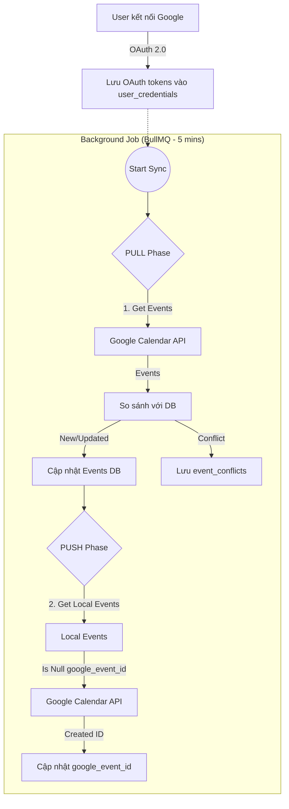
```mermaid
flowchart TD
    User[User kết nối Google] -->|OAuth 2.0| Creds[Lưu OAuth tokens vào user_credentials]
    
    subgraph "Background Job (BullMQ - 5 mins)"
        Job((Start Sync)) --> PullPhase{PULL Phase}
        PullPhase -->|1. Get Events| GAPI[Google Calendar API]
        GAPI -->|Events| Compare[So sánh với DB]
        Compare -->|New/Updated| UpdateDB[Cập nhật Events DB]
        Compare -->|Conflict| Conflict[Lưu event_conflicts]
        
        UpdateDB --> PushPhase{PUSH Phase}
        PushPhase -->|2. Get Local Events| Local[Local Events]
        Local -->|Is Null google_event_id| PushGAPI[Google Calendar API]
        PushGAPI -->|Created ID| UpdateLocal[Cập nhật google_event_id]
    end
    
    Creds -.-> Job
```

**Chi tiết kỹ thuật:**
- Module: `google.service.ts`, `calendar.service.ts`
- Queue: `sync-calendar` queue trong BullMQ
- Search logic: Sử dụng `updatedMin` để fetch incremental updates.
- Conflict resolution: Strategy pattern (Prefer Google / Prefer System).

#### **Luồng 2: Đặt lịch qua Booking Link**

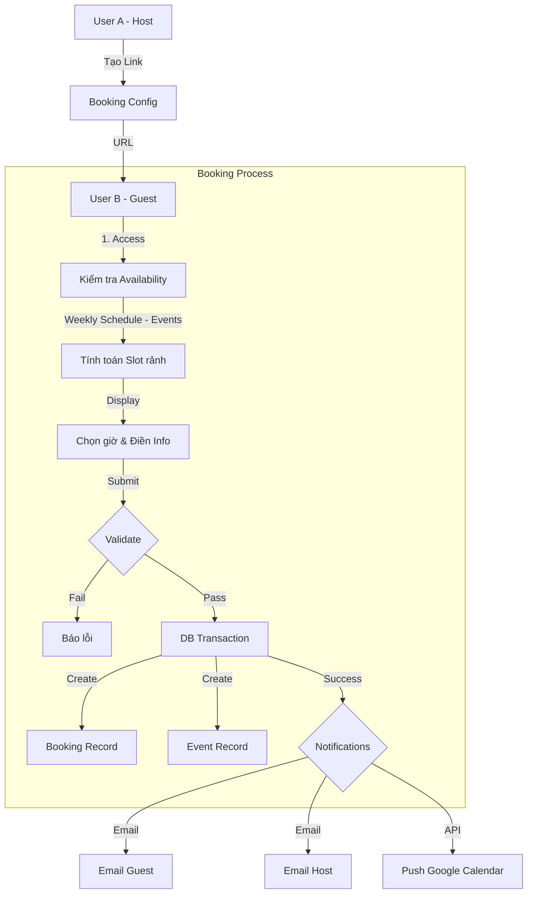
```mermaid
flowchart TD
    Host[User A - Host] -->|Tạo Link| Config[Booking Config]
    Config -->|URL| Guest[User B - Guest]
    
    subgraph "Booking Process"
        Guest -->|1. Access| CheckAvail[Kiểm tra Availability]
        CheckAvail -->|Weekly Schedule - Events| Slots[Tính toán Slot rảnh]
        Slots -->|Display| GuestUI[Chọn giờ & Điền Info]
        GuestUI -->|Submit| Validate{Validate}
        
        Validate -->|Fail| guest_error[Báo lỗi]
        Validate -->|Pass| Trans[DB Transaction]
        
        Trans -->|Create| B_Rec[Booking Record]
        Trans -->|Create| E_Rec[Event Record]
        
        Trans -->|Success| Notif{Notifications}
    end
    
    Notif -->|Email| GuestEmail[Email Guest]
    Notif -->|Email| HostEmail[Email Host]
    Notif -->|API| GCal[Push Google Calendar]
```

**Chi tiết kỹ thuật:**
- Module: `booking.service.ts`, `availability.service.ts`
- Lock mechanism: Optimistic locking để tránh double-booking.
- Transaction: PostgreSQL transaction đảm bảo tính toàn vẹn dữ liệu (Booking + Event).

#### **Luồng 3: AI Assistant với RAG (Chat)**

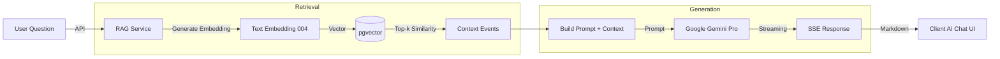
```mermaid
flowchart LR
    User[User Question] -->|API| RAG[RAG Service]
    
    subgraph "Retrieval"
        RAG -->|Generate Embedding| Model[Text Embedding 004]
        Model -->|Vector| VectorDB[(pgvector)]
        VectorDB -->|Top-k Similarity| Context[Context Events]
    end
    
    subgraph "Generation"
        Context --> Prompt[Build Prompt + Context]
        Prompt -->|Prompt| Gemini[Google Gemini Pro]
        Gemini -->|Streaming| SSE[SSE Response]
    end
    
    SSE -->|Markdown| UI[Client AI Chat UI]
```

**Chi tiết kỹ thuật:**
- Module: `llm.service.ts`, `rag.service.ts`
- Model: Gemini 2 Flash cho tốc độ phản hồi nhanh.
- Vector Store: `pgvector` với HNSW index cho low-latency search.

### **3.3.5. Sơ đồ tuần tự (Sequence Diagrams)**

Để hiểu rõ hơn về tương tác giữa các thành phần trong hệ thống, các sơ đồ tuần tự (sequence diagrams) sau đây mô tả chi tiết luồng xử lý của các tính năng quan trọng.

#### ** Sequen Diagram 1: AI Chatbot với RAG (Retrieval-Augmented Generation)**

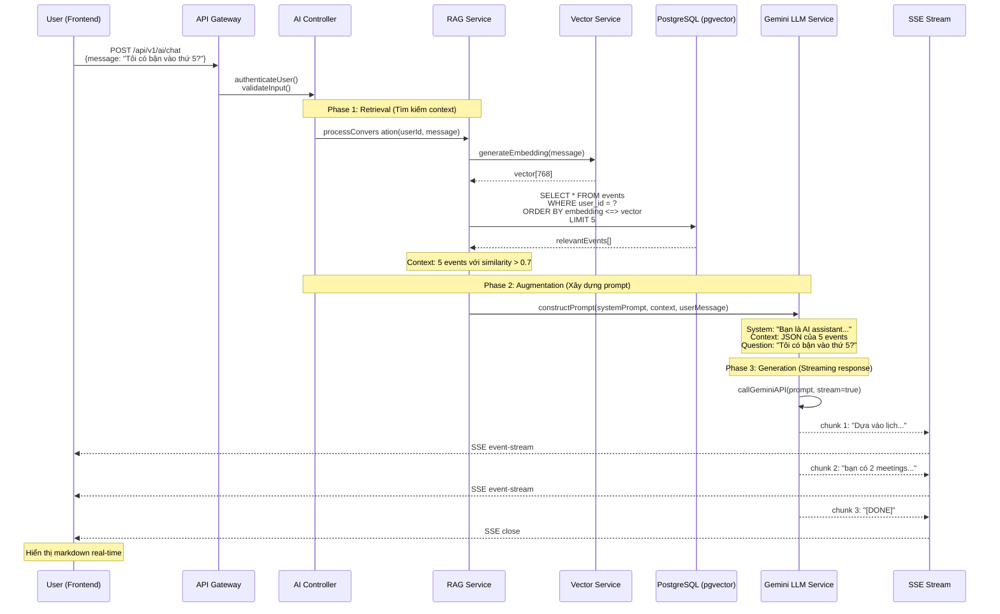
```mermaid
sequenceDiagram
    participant U as User (Frontend)
    participant API as API Gateway
    participant AI as AI Controller
    participant RAG as RAG Service
    participant VEC as Vector Service
    participant DB as PostgreSQL (pgvector)
    participant LLM as Gemini LLM Service
    participant SSE as SSE Stream

    U->>API: POST /api/v1/ai/chat<br/>{message: "Tôi có bận vào thứ 5?"}
    API->>AI: authenticateUser()<br/>validateInput()
    
    Note over AI,RAG: Phase 1: Retrieval (Tìm kiếm context)
    AI->>RAG: processConvers ation(userId, message)
    RAG->>VEC: generateEmbedding(message)
    VEC-->>RAG: vector[768]
    
    RAG->>DB: SELECT * FROM events<br/>WHERE user_id = ?<br/>ORDER BY embedding <=> vector<br/>LIMIT 5
    DB-->>RAG: relevantEvents[]
    
    Note over RAG: Context: 5 events với similarity > 0.7
    
    Note over AI,LLM: Phase 2: Augmentation (Xây dựng prompt)
    RAG->>LLM: constructPrompt(systemPrompt, context, userMessage)
    Note over LLM: System: "Bạn là AI assistant..."<br/>Context: JSON của 5 events<br/>Question: "Tôi có bận vào thứ 5?"
    
    Note over LLM: Phase 3: Generation (Streaming response)
    LLM->>LLM: callGeminiAPI(prompt, stream=true)
    LLM-->>SSE: chunk 1: "Dựa vào lịch..."
    SSE-->>U: SSE event-stream
    LLM-->>SSE: chunk 2: "bạn có 2 meetings..."
    SSE-->>U: SSE event-stream
    LLM-->>SSE: chunk 3: "[DONE]"
    SSE-->>U: SSE close
    
    Note over U: Hiển thị markdown real-time
```

**Giải thích chi tiết:**

1. **Request Phase**: User gửi câu hỏi từ chat interface, API authenticate JWT token và validate input.

2. **Retrieval Phase**: RAG Service chuyển câu hỏi thành vector embedding 768-chiều sử dụng model `text-embedding-004`. Vector này được so sánh với embeddings của tất cả events trong database sử dụng toán tử `<=>` (cosine distance) của pgvector. Top 5 events có similarity cao nhất (> 0.7) được lấy ra làm context.

3. **Augmentation Phase**: Context events được format thành JSON và đưa vào prompt template cùng với system instruction và user question. Prompt hoàn chỉnh được gửi đến Gemini API.

4. **Generation Phase**: Gemini xử lý prompt và trả về response dưới dạng streaming. Mỗi chunk text được forward qua Server-Sent Events (SSE) về frontend ngay lập tức, tạo trải nghiệm real-time tương tự ChatGPT.

#### **Sequence Diagram 2: Đồng bộ Google Calendar (Bi-directional Sync)**

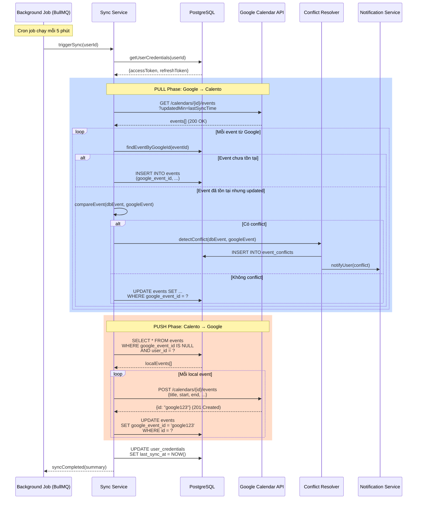
```mermaid
sequenceDiagram
    participant BG as Background Job (BullMQ)
    participant SYNC as Sync Service
    participant DB as PostgreSQL
    participant GCAL as Google Calendar API
    participant CONF as Conflict Resolver
    participant NOTIFY as Notification Service

    Note over BG: Cron job chạy mỗi 5 phút
    
    BG->>SYNC: triggerSync(userId)
    SYNC->>DB: getUserCredentials(userId)
    DB-->>SYNC: {accessToken, refreshToken}
    
    rect rgb(200, 220, 255)
        Note over SYNC,GCAL: PULL Phase: Google → Calento
        SYNC->>GCAL: GET /calendars/{id}/events<br/>?updatedMin=lastSyncTime
        GCAL-->>SYNC: events[] (200 OK)
        
        loop Mỗi event từ Google
            SYNC->>DB: findEventByGoogleId(eventId)
            alt Event chưa tồn tại
                SYNC->>DB: INSERT INTO events<br/>(google_event_id, ...)
            else Event đã tồn tại nhưng updated
                SYNC->>SYNC: compareEvent(dbEvent, googleEvent)
                alt Có conflict
                    SYNC->>CONF: detectConflict(dbEvent, googleEvent)
                    CONF->>DB: INSERT INTO event_conflicts
                    CONF->>NOTIFY: notifyUser(conflict)
                else Không conflict
                    SYNC->>DB: UPDATE events SET ...<br/>WHERE google_event_id = ?
                end
            end
        end
    end
    
    rect rgb(255, 220, 200)
        Note over SYNC,GCAL: PUSH Phase: Calento → Google
        SYNC->>DB: SELECT * FROM events<br/>WHERE google_event_id IS NULL<br/>AND user_id = ?
        DB-->>SYNC: localEvents[]
        
        loop Mỗi local event
            SYNC->>GCAL: POST /calendars/{id}/events<br/>{title, start, end, ...}
            GCAL-->>SYNC: {id: "google123"} (201 Created)
            SYNC->>DB: UPDATE events<br/>SET google_event_id = 'google123'<br/>WHERE id = ?
        end
    end
    
    SYNC->>DB: UPDATE user_credentials<br/>SET last_sync_at = NOW()
    SYNC-->>BG: syncCompleted(summary)
```

**Giải thích luồng đồng bộ:**

1. **PULL Phase (Google → Calento)**: Background job lấy events từ Google Calendar API với tham số `updatedMin` để chỉ fetch events đã thay đổi từ lần sync cuối. Mỗi event được so sánh với database:
   - Nếu chưa tồn tại → INSERT mới
   - Nếu đã tồn tại → So sánh timestamps và content
   - Nếu phát hiện conflict (cả 2 phía đều update) → Lưu vào `event_conflicts` table và notify user

2. **PUSH Phase (Calento → Google)**: Tìm tất cả events có `google_event_id = NULL` (local-only events) và đẩy lên Google Calendar. Sau khi push thành công, lưu `google_event_id` vào database.

3. **Error Handling**: Nếu `accessToken` expired, tự động refresh bằng `refreshToken`. Nếu API rate limit → exponential backoff và retry.

#### **Sequence Diagram 3: Public Booking Flow (Guest đặt lịch)**

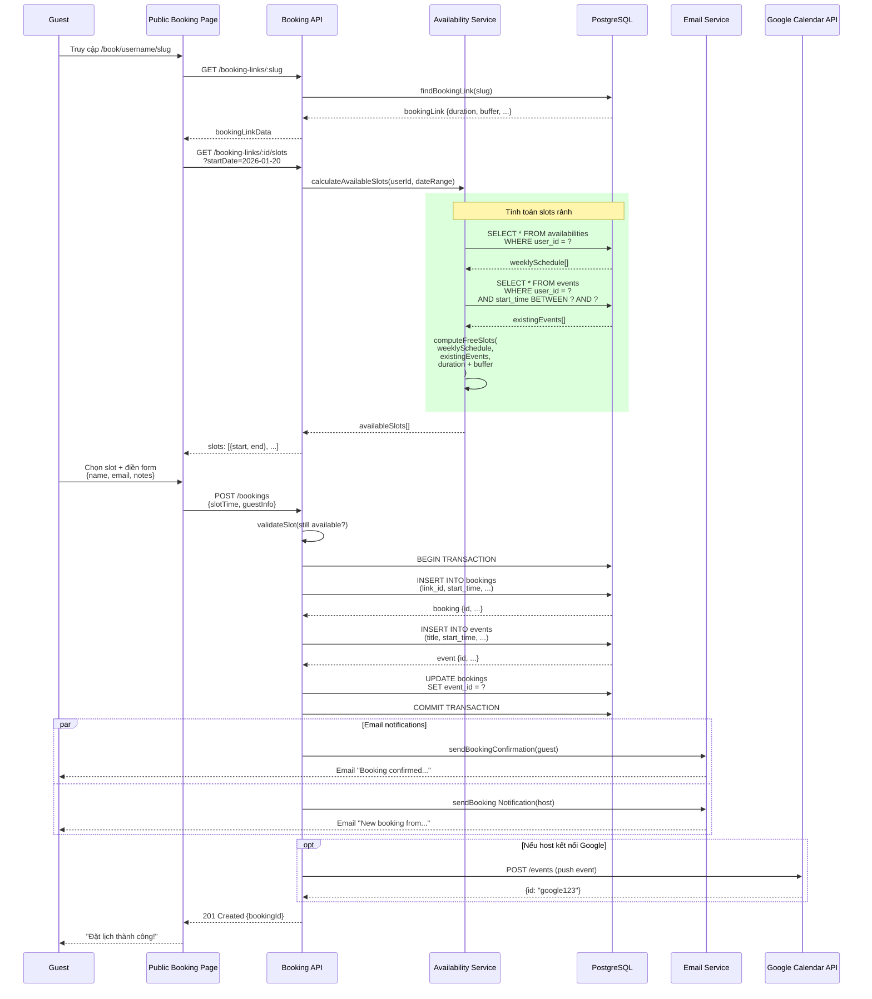
```mermaid
sequenceDiagram
    participant G as Guest
    participant PUB as Public Booking Page
    participant API as Booking API
    participant AVAIL as Availability Service
    participant DB as PostgreSQL
    participant EMAIL as Email Service
    participant GCAL as Google Calendar API

    G->>PUB: Truy cập /book/username/slug
    PUB->>API: GET /booking-links/:slug
    API->>DB: findBookingLink(slug)
    DB-->>API: bookingLink {duration, buffer, ...}
    API-->>PUB: bookingLinkData
    
    PUB->>API: GET /booking-links/:id/slots<br/>?startDate=2026-01-20
    API->>AVAIL: calculateAvailableSlots(userId, dateRange)
    
    rect rgb(220, 255, 220)
        Note over AVAIL,DB: Tính toán slots rảnh
        AVAIL->>DB: SELECT * FROM availabilities<br/>WHERE user_id = ?
        DB-->>AVAIL: weeklySchedule[]
        
        AVAIL->>DB: SELECT * FROM events<br/>WHERE user_id = ?<br/>AND start_time BETWEEN ? AND ?
        DB-->>AVAIL: existingEvents[]
        
        AVAIL->>AVAIL: computeFreeSlots(<br/>weeklySchedule,<br/>existingEvents,<br/>duration + buffer<br/>)
    end
    
    AVAIL-->>API: availableSlots[]
    API-->>PUB: slots: [{start, end}, ...]
    
    G->>PUB: Chọn slot + điền form<br/>{name, email, notes}
    PUB->>API: POST /bookings<br/>{slotTime, guestInfo}
    
    API->>API: validateSlot(still available?)
    API->>DB: BEGIN TRANSACTION
    
    API->>DB: INSERT INTO bookings<br/>(link_id, start_time, ...)
    DB-->>API: booking {id, ...}
    
    API->>DB: INSERT INTO events<br/>(title, start_time, ...)
    DB-->>API: event {id, ...}
    
    API->>DB: UPDATE bookings<br/>SET event_id = ?
    API->>DB: COMMIT TRANSACTION
    
    par Email notifications
        API->>EMAIL: sendBookingConfirmation(guest)
        EMAIL-->>G: Email "Booking confirmed..."
    and
        API->>EMAIL: sendBooking Notification(host)
        EMAIL-->>G: Email "New booking from..."
    end
    
    opt Nếu host kết nối Google
        API->>GCAL: POST /events (push event)
        GCAL-->>API: {id: "google123"}
    end
    
    API-->>PUB: 201 Created {bookingId}
    PUB-->>G: "Đặt lịch thành công!"
```

**Các điểm quan trọng:**

1. **Availability Calculation**: Hệ thống kết hợp `availabilities` table (weekly schedule) với `events` table (actual events) để tính các slots trống. Buffer time được apply trước và sau mỗi slot.

2. **Double-check Validation**: Trước khi tạo booking, re-validate slot vẫn available (tránh race condition khi 2 người book cùng lúc).

3. **Transaction Safety**: Sử dụng database transaction để đảm bảo booking và event được tạo atomic. Nếu một trong hai fails → rollback cả hai.

4. **Parallel Email**: Gửi email cho guest và host song song (không chờ đợi) để giảm response time.

#### **Sequence Diagram 4: AI Function Calling (Create Event)**

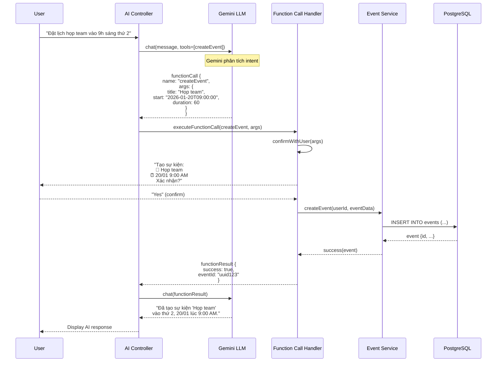
```mermaid
sequenceDiagram
    participant U as User
    participant AI as AI Controller
    participant LLM as Gemini LLM
    participant FC as Function Call Handler
    participant EVENT as Event Service
    participant DB as PostgreSQL

    U->>AI: "Đặt lịch họp team vào 9h sáng thứ 2"
    AI->>LLM: chat(message, tools=[createEvent])
    
    Note over LLM: Gemini phân tích intent
    LLM-->>AI: functionCall {<br/>  name: "createEvent",<br/>  args: {<br/>    title: "Họp team",<br/>    start: "2026-01-20T09:00:00",<br/>    duration: 60<br/>  }<br/>}
    
    AI->>FC: executeFunctionCall(createEvent, args)
    FC->>FC: confirmWithUser(args)
    FC-->>U: "Tạo sự kiện:<br/>📅 Họp team<br/>⏰ 20/01 9:00 AM<br/>Xác nhận?"
    
    U-->>FC: "Yes" (confirm)
    
    FC->>EVENT: createEvent(userId, eventData)
    EVENT->>DB: INSERT INTO events (...)
    DB-->>EVENT: event {id, ...}
    EVENT -->>FC: success(event)
    
    FC-->>AI: functionResult {<br/>  success: true,<br/>  eventId: "uuid123"<br/>}
    
    AI->>LLM: chat(functionResult)
    LLM-->>AI: "Đã tạo sự kiện 'Họp team'<br/>vào thứ 2, 20/01 lúc 9:00 AM."
    
    AI-->>U: Display AI response
```

**Function Calling Flow:**

1. **Intent Detection**: LLM nhận diện user muốn create event, extract parameters (title, time) từ natural language.

2. **Confirmation**: Trước khi execute, hiển thị preview để user confirm (tránh tạo nhầm).

3. **Execution**: Call Event Service để thực sự tạo event trong database.

4. **Response**: Kết quả được trả về AI, AI generate human-readable confirmation message.

**4. Luồng Khôi phục Mật khẩu (Password Reset Flow)**

Quy trình khôi phục mật khẩu bảo mật, sử dụng email xác thực và token dùng một lần.

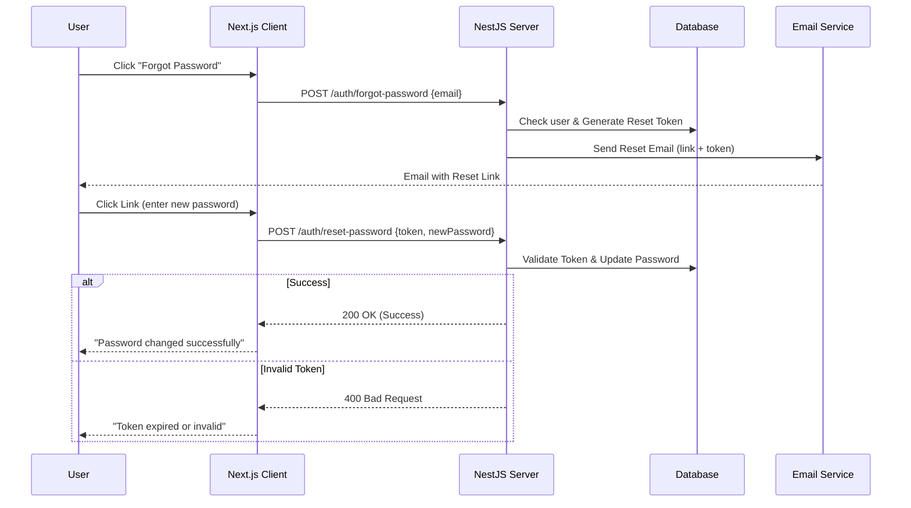
```mermaid
sequenceDiagram
    participant User
    participant Client as Next.js Client
    participant Server as NestJS Server
    participant DB as Database
    participant Email as Email Service
    
    User->>Client: Click "Forgot Password"
    Client->>Server: POST /auth/forgot-password {email}
    Server->>DB: Check user & Generate Reset Token
    Server->>Email: Send Reset Email (link + token)
    Email-->>User: Email with Reset Link
    
    User->>Client: Click Link (enter new password)
    Client->>Server: POST /auth/reset-password {token, newPassword}
    Server->>DB: Validate Token & Update Password
    
    alt Success
        Server-->>Client: 200 OK (Success)
        Client-->>User: "Password changed successfully"
    else Invalid Token
        Server-->>Client: 400 Bad Request
        Client-->>User: "Token expired or invalid"
    end
```

**Password Reset Flow:**

1.  **Request Reset**: Người dùng yêu cầu đặt lại mật khẩu bằng cách cung cấp email. Client gửi yêu cầu đến endpoint `/auth/forgot-password`.
2.  **Token Generation**: Server kiểm tra sự tồn tại của email. Nếu hợp lệ, hệ thống tạo một `reset_token` duy nhất (có thời hạn ngắn, ví dụ: 15 phút) và lưu vào database (hoặc Redis).
3.  **Email Dispatch**: Server sử dụng Email Service để gửi một email chứa liên kết đặt lại mật khẩu (password reset link) kèm theo token đến địa chỉ email của người dùng.
4.  **Validation & Update**: Khi người dùng nhấn vào liên kết và nhập mật khẩu mới, Client gửi request `/auth/reset-password` kèm token. Server xác thực token (kiểm tra tính hợp lệ và thời hạn). Nếu thành công, mật khẩu trong database được cập nhật (hashed) và token bị hủy bỏ.

#### **Sequence Diagram 5: Quy trình Tạo Sự kiện (Create Event Module)**

Quy trình xử lý khi người dùng tạo sự kiện mới, bao gồm việc đồng bộ dữ liệu đa nền tảng (Database, Google Calendar, và Vector Database cho AI).

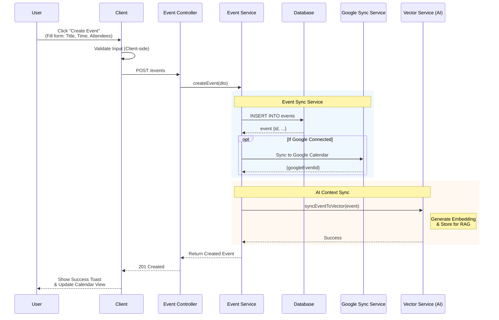
```mermaid
sequenceDiagram
    participant U as User
    participant C as Client
    participant S as Event Controller
    participant ES as Event Service
    participant DB as Database
    participant G as Google Sync Service
    participant V as Vector Service (AI)

    U->>C: Click "Create Event"<br/>(Fill form: Title, Time, Attendees)
    C->>C: Validate Input (Client-side)
    C->>S: POST /events
    
    S->>ES: createEvent(dto)
    
    %% Step 1: Core Creation & Google Sync
    rect rgb(240, 248, 255)
        Note over ES, G: Event Sync Service
        ES->>DB: INSERT INTO events
        DB-->>ES: event {id, ...}
        
        opt If Google Connected
            ES->>G: Sync to Google Calendar
            G-->>ES: {googleEventId}
        end
    end

    %% Step 2: AI Embedding Sync
    rect rgb(255, 248, 240)
        Note over ES, V: AI Context Sync
        ES->>V: syncEventToVector(event)
        Note right of V: Generate Embedding<br/>& Store for RAG
        V-->>ES: Success
    end
    
    ES-->>S: Return Created Event
    S-->>C: 201 Created
    C-->>U: Show Success Toast<br/>& Update Calendar View
```

**Giải thích chi tiết:**
1.  **Core Creation**: Sự kiện được lưu vào cơ sở dữ liệu chính (PostgreSQL) đầu tiên để đảm bảo tính toàn vẹn dữ liệu.
2.  **Google Sync**: Nếu người dùng đã kết nối Google Calendar, hệ thống sẽ đồng bộ sự kiện sang Google Calendar ngay lập tức để đảm bảo lịch trình luôn được cập nhật trên mọi thiết bị.
3.  **Vector Embedding**: Sau khi tạo xong, thông tin sự kiện được gửi đến `VectorService` để tạo embedding và lưu vào Vector Database (pgvector). Bước này giúp AI Assisant có thể "hiểu" và tra cứu được sự kiện này trong tương lai khi người dùng chat (ví dụ: "Sắp tới tôi có lịch gì?").


#### **Sequence Diagram 6: Quy trình Đặt Lịch (Booking Module Flow)**

Quy trình khách (Guest) đặt lịch hẹn thông qua trang Public Booking Page.

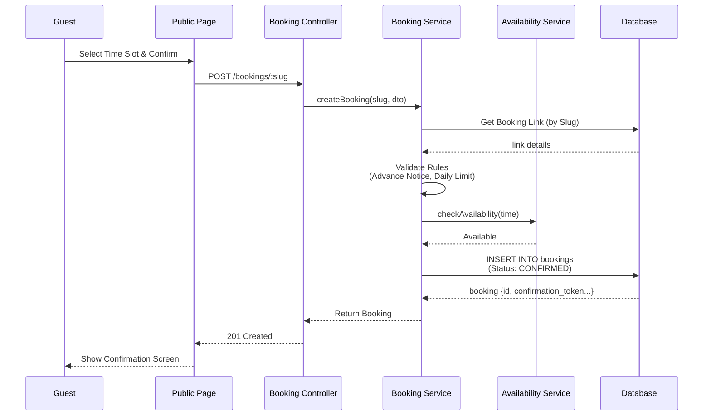
```mermaid
sequenceDiagram
    participant G as Guest
    participant C as Public Page
    participant S as Booking Controller
    participant BS as Booking Service
    participant V as Availability Service
    participant DB as Database

    G->>C: Select Time Slot & Confirm
    C->>S: POST /bookings/:slug
    
    S->>BS: createBooking(slug, dto)
    
    %% Step 1: Validation
    BS->>DB: Get Booking Link (by Slug)
    DB-->>BS: link details
    
    BS->>BS: Validate Rules<br/>(Advance Notice, Daily Limit)
    
    BS->>V: checkAvailability(time)
    V-->>BS: Available
    
    %% Step 2: Creation
    BS->>DB: INSERT INTO bookings<br/>(Status: CONFIRMED)
    DB-->>BS: booking {id, confirmation_token...}
    
    BS-->>S: Return Booking
    S-->>C: 201 Created
    
    C-->>G: Show Confirmation Screen
```

**Giải thích:**
1.  **Validation**: Hệ thống kiểm tra kỹ lưỡng các quy tắc đặt lịch (Booking Rules) như thời gian báo trước, giới hạn số lượt đặt trong ngày, và đặc biệt là kiểm tra tính khả dụng (Availability) thực tế của Host để tránh trùng lịch.
2.  **Creation**: Nếu hợp lệ, Booking được tạo ngay với trạng thái `CONFIRMED`. Một `confirmation_token` được sinh ra để dùng cho các tác vụ hủy/dời lịch sau này mà không cần đăng nhập.
3.  **Completion**: Trả về thông tin đặt lịch thành công cho khách.


### **3.3.6. Progressive Web App (PWA)**

Calento được xây dựng như một Progressive Web App (PWA), cho phép ứng dụng hoạt động gần giống như một ứng dụng native trên các thiết bị di động và desktop. Nhờ vào việc cấu hình Manifest và Service Worker, người dùng có thể cài đặt Calento trực tiếp từ trình duyệt mà không cần thông qua App Store.

#### **App Manifest Configuration**

Tệp `manifest.json` được cấu hình đầy đủ các tham số để đảm bảo trải nghiệm cài đặt tốt nhất:

Tệp `manifest.json` được cấu hình đầy đủ để biến Calento thành một ứng dụng độc lập. Ứng dụng được định danh rõ ràng với tên đầy đủ "Calento - AI Calendar Assistant", hiển thị ở chế độ `standalone` để loại bỏ thanh địa chỉ và tạo cảm giác native. Giao diện được đồng bộ theme với màu nền trắng (#ffffff) và màu chủ đạo đen (#000000). Hệ thống icon đa kích thước (từ 192x192 đến 512x512) bao gồm cả maskable icons cho Android đảm bảo hiển thị sắc nét trên mọi thiết bị. Ngoài ra, các shortcuts được tích hợp giúp người dùng truy cập nhanh các tính năng quan trọng ngay từ màn hình chính.

#### **Service Worker & Caching Strategy**

Service Worker (`sw.js`) đóng vai trò là network proxy, quản lý cache và offline capabilities:

Service Worker (`sw.js`) quản lý chiến lược caching thông minh. Đối với tài nguyên tĩnh (JS, CSS, images), chiến lược **Cache First** được áp dụng để tăng tốc độ tải trang. Ngược lại, các API requests sử dụng chiến lược **Network First** để đảm bảo dữ liệu luôn mới nhất, chỉ fallback về cache khi mất mạng. Khả năng hỗ trợ offline cho phép người dùng xem lịch ngay cả khi không có kết nối internet, với các thay đổi dữ liệu được đưa vào hàng đợi background sync. Ngoài ra, Service Worker còn hỗ trợ các tác vụ nền như hiển thị Push Notifications và đồng bộ dữ liệu ngầm, đảm bảo tính nhất quán và trải nghiệm liền mạch.

### **3.3.7. Hệ thống Email & Thông báo (Email Notification Service)**

Hệ thống Email & Thông báo đóng vai trò quan trọng trong việc duy trì tương tác với người dùng và đảm bảo họ không bỏ lỡ các sự kiện quan trọng. Module này được xây dựng tách biệt để đảm bảo hiệu năng và khả năng mở rộng.

#### **Chức năng chính**
-   **Transactional Emails**: Gửi email xác thực tài khoản, reset mật khẩu, và chào mừng người dùng mới (Welcome Email).
-   **Scheduling Notifications**: Gửi thông báo xác nhận đặt lịch (Booking Confirmation) và lời mời tham gia sự kiện (Event Invitations) cho cả người tổ chức và khách mời.
-   **Automated Reminders**: Hệ thống tự động quét và gửi email nhắc nhở (Reminder Email) trước khi sự kiện diễn ra (ví dụ: trước 15 phút, 1 giờ) nhờ vào Cron Jobs.

#### **Công nghệ sử dụng**
-   **Nodemailer**: Thư viện gửi email mạnh mẽ và phổ biến cho Node.js, hỗ trợ SMTP và nhiều transport khác.
-   **BullMQ & Redis**: Để tránh việc gửi email làm chặn luồng xử lý chính (main thread) của server, toàn bộ tác vụ gửi email được đẩy vào hàng đợi (Queue). BullMQ sẽ lấy job từ Redis và xử lý bất đồng bộ (background processing), đảm bảo phản hồi API luôn nhanh chóng.
-   **Handlebars**: Sử dụng làm template engine để tạo ra các email HTML động, chuyên nghiệp và nhất quán với thương hiệu.

#### **Giao diện Email mẫu**


4. **Validation & Update**: Khi người dùng nhấn vào liên kết và nhập mật khẩu mới, Client gửi request `/auth/reset-password` kèm token. Server xác thực token (kiểm tra tính hợp lệ và thời hạn). Nếu thành công, mật khẩu trong database được cập nhật (hashed) và token bị hủy bỏ.


## **3.4. Thiết kế API**


Hệ thống Calento cung cấp một bộ RESTful API toàn diện, được thiết kế xoay quanh các tài nguyên (resources) và tuân thủ chặt chẽ các nguyên tắc kiến trúc REST. API đóng vai trò là xương sống giao tiếp giữa frontend (Next.js) và backend (NestJS), cũng như cho phép các integrations từ bên thứ ba trong tương lai.

### **3.4.1. Kiến trúc và Nguyên lý thiết kế**

API của Calento được xây dựng dựa trên kiến trúc Layered Architecture của NestJS, đảm bảo tính separation of concerns. Mọi endpoint đều tuân theo quy tắc đặt tên danh từ số nhiều (plural nouns) để chỉ định tài nguyên (ví dụ: `/users`, `/events`) và sử dụng các HTTP verbs chuẩn (`GET`, `POST`, `PATCH`, `DELETE`) để định nghĩa hành động.

Dữ liệu trao đổi giữa client và server hoàn toàn sử dụng định dạng JSON (JavaScript Object Notation), đảm bảo tính lightweight và dễ dàng parsing trên mọi nền tảng. Mỗi response từ server đều có structure nhất quán, bao gồm `statusCode`, `message`, và `data` (đối với success response) hoặc `error` details (đối với failure), giúp frontend dễ dàng handle các trạng thái khác nhau của application.

### **3.4.2. Cơ chế Xác thực và Bảo mật**

Bảo mật là ưu tiên hàng đầu trong thiết kế API. Hệ thống sử dụng cơ chế xác thực dựa trên token (Token-based Authentication) với chuẩn JWT (JSON Web Tokens).

**Bearer Token Authentication:**
Mọi request đến các protected endpoints đều bắt buộc phải đính kèm Access Token hợp lệ trong header `Authorization` dưới dạng `Bearer <token>`. Access Token này chứa các claims đã được ký (userId, email, role), cho phép server xác định danh tính user mà không cần tra cứu database liên tục (stateless authentication).

**Refresh Token Rotation:**
Để cân bằng giữa UX và bảo mật, Access Token có thời gian sống ngắn (1 giờ). Khi hết hạn, client sử dụng Refresh Token (thời hạn 7 ngày, lưu trong HttpOnly cookie) để request cấp phát cặp token mới. Cơ chế rotation này (cấp mới cả refresh token mỗi lần sử dụng) giúp detect token theft: nếu một refresh token cũ bị sử dụng lại, hệ thống sẽ lập tức invalidate toàn bộ chuỗi token của user đó.

**Rate Limiting và Security Headers:**
Để bảo vệ hệ thống khỏi các cuộc tấn công DDoS và Brute-force, API áp dụng rate limiting (giới hạn số request) cho các endpoints nhạy cảm như `/auth/login` hay `/auth/register`. Ngoài ra, các security headers như Helmet, CORS (Cross-Origin Resource Sharing) policies được cấu hình chặt chẽ, chỉ cho phép requests từ các domains tin cậy (frontend domain).

### **3.4.3. Chiến lược Phiên bản hóa (Versioning)**

Để đảm bảo tính tương thích ngược (backward compatibility) khi hệ thống phát triển, Calento áp dụng chiến lược phiên bản hóa qua URL (URI Path Versioning). Tất cả các endpoints đều có prefix `/api/v1`.

Chiến lược này cho phép team phát triển deploy các tính năng mới hoặc thay đổi breaking changes ở `/api/v2` trong tương lai mà không làm gián đoạn trải nghiệm của người dùng đang sử dụng phiên bản cũ. Đây là best practice trong thiết kế API cho các hệ thống long-term, giúp decouple vòng đời phát triển của frontend và backend.

### **3.4.4. Các nhóm tài nguyên chính**

Hệ thống API được tổ chức thành các nhóm module function-centric:

**Auth & Users Module:**
Bao gồm các endpoints cho quy trình authentication (Login, Register, OAuth callback) và quản lý identity. Các endpoints như `GET /users/me` cho phép lấy full profile của logged-in user, trong khi `PATCH /users/me/settings` cho phép update preferences linh hoạt thông qua JSONB storage.

**Calendar & Events Module:**
Đây là nhóm API phức tạp nhất, xử lý logic nghiệp vụ cốt lõi. Ngoài các CRUD operations cơ bản cho events, module này cung cấp các endpoints đặc thù như `/events/sync` để trigger Google Calendar synchronization, `/events/recurring/expand` để tính toán các instances cụ thể từ một recurring rule (RRULE), và `/events/availability` để kiểm tra xung đột lịch trình.

**Public Booking Module:**
Nhóm API này phục vụ tính năng đặt lịch công khai. Các endpoints như `/booking-links/:slug` là public (không yêu cầu auth), cho phép khách truy cập xem thông tin trang đặt lịch. Endpoint `/bookings` xử lý transaction phức tạp: tạo booking record, tạo event tương ứng, gửi emails xác nhận, và update Google Calendar nếu cần thiết.

**AI Integration Module:**
Cung cấp các endpoints cho tính năng AI Assistant. Endpoint `/ai/chat` hỗ trợ Server-Sent Events (SSE), cho phép streaming response từ LLM về client theo thời gian thực (real-time typing effect). Endpoint này cũng handle logic RAG: nhận câu hỏi, gọi vector search service, và inject context vào prompt trước khi gửi đến Gemini model.

### **3.4.5. Danh sách API chi tiết**

Dưới đây là bảng đặc tả các API endpoints quan trọng nhất của hệ thống, được phân nhóm theo chức năng:

### **3.4.5. Danh sách API chi tiết**

Dưới đây là bảng đặc tả các API endpoints quan trọng nhất của hệ thống, được phân nhóm theo chức năng:

### **3.4.5. Danh sách API chi tiết**

Dưới đây là bảng đặc tả các API endpoints quan trọng nhất của hệ thống, được phân nhóm theo chức năng:

| Module | Method | Endpoint | Mô tả chức năng | Auth |
| :--- | :---: | :--- | :--- | :---: |
| **Auth** | POST | `/api/v1/auth/login` | Đăng nhập bằng Email/Password | No |
| | POST | `/api/v1/auth/register` | Đăng ký tài khoản mới | No |
| | POST | `/api/v1/auth/logout` | Đăng xuất (Clear cookie) | Yes |
| | POST | `/api/v1/auth/refresh` | Làm mới Access Token (Token Rotation) | No |
| | GET | `/api/v1/auth/verify` | Kiểm tra trạng thái đăng nhập | No |
| | GET | `/api/v1/auth/google/url` | Lấy URL đăng nhập Google OAuth | No |
| | POST | `/api/v1/auth/google/login` | Đăng nhập với Authorization Code | No |
| | POST | `/api/v1/auth/forgot-password` | Yêu cầu reset mật khẩu | No |
| **Users** | GET | `/api/v1/users/me` | Lấy thông tin Profile hiện tại | Yes |
| | GET | `/api/v1/users/search` | Tìm kiếm người dùng (cho invite) | Yes |
| | PATCH | `/api/v1/users/me/settings` | Cập nhật cài đặt (Language, Theme) | Yes |
| **Calendars** | GET | `/api/v1/calendars` | Lấy danh sách lịch cá nhân | Yes |
| | POST | `/api/v1/calendars` | Tạo lịch mới (Secondary Calendar) | Yes |
| | GET | `/api/v1/calendars/primary` | Lấy lịch chính (Primary) | Yes |
| **Events** | GET | `/api/v1/events` | Lấy danh sách sự kiện (Filter by date) | Yes |
| | POST | `/api/v1/events` | Tạo sự kiện mới | Yes |
| | GET | `/api/v1/events/recurring/expand` | Bung sự kiện lặp lại (Expand RRULE) | Yes |
| | POST | `/api/v1/events/sync` | Trigger đồng bộ Google Calendar | Yes |
| | POST | `/api/v1/events/:id/invitations/send`| Gửi email mời tham gia sự kiện | Yes |
| | POST | `/api/v1/events/invitation/:token/respond`| Phản hồi lời mời (Accept/Decline) | No |
| **Booking** | GET | `/api/v1/booking-links` | Quản lý danh sách Booking Links | Yes |
| | GET | `/api/v1/bookings/public/:slug` | Lấy thông tin trang đặt lịch Public | No |
| | GET | `/api/v1/bookings/public/:slug/slots`| Tìm các khung giờ rảnh (Availability) | No |
| | POST | `/api/v1/bookings/:slug` | Khách thực hiện đặt lịch (Create) | No |
| | POST | `/api/v1/bookings/:id/cancel` | Hủy lịch hẹn | Yes |
| | POST | `/api/v1/bookings/:id/reschedule` | Dời lịch hẹn | Yes |
| **Tasks** | GET | `/api/v1/tasks` | Lấy danh sách công việc (todo list) | Yes |
| | POST | `/api/v1/tasks` | Tạo công việc mới | Yes |
| | GET | `/api/v1/tasks/overdue` | Lấy công việc quá hạn | Yes |
| | GET | `/api/v1/tasks/statistics` | Thống kê hiệu suất hoàn thành task | Yes |
| | PATCH | `/api/v1/tasks/:id/status` | Cập nhật trạng thái (todo/done) | Yes |
| **AI** | POST | `/api/v1/ai/chat` | Chat với AI (Response Object) | Yes |
| | POST | `/api/v1/ai/chat/stream` | Chat Streaming (Server-Sent Events) | Yes |
| | GET | `/api/v1/ai/conversations` | Lịch sử hội thoại | Yes |
| | POST | `/api/v1/ai/actions/confirm` | Xác nhận hành động AI đề xuất | Yes |
| **Teams** | GET | `/api/v1/teams` | Lấy danh sách Teams của user | Yes |
| | POST | `/api/v1/teams/:id/members` | Mời thành viên vào Team | Yes |
| | GET | `/api/v1/teams/:id/heatmap` | Biểu đồ nhiệt rảnh/bận của Team | Yes |
| | GET | `/api/v1/teams/:id/optimal-times` | Gợi ý giờ họp tốt nhất cho Team | Yes |
| **Analytics**| GET | `/api/v1/analytics/overview` | Tổng quan số liệu (Events/Time) | Yes |
| | GET | `/api/v1/analytics/time-utilization`| Phân tích hiệu suất sử dụng thời gian | Yes |
| | GET | `/api/v1/analytics/categories` | Phân tích phân bổ danh mục (Category) | Yes |
| **Blog** | GET | `/api/v1/blog/public/published` | Lấy bài viết đã xuất bản (Public) | No |
| | GET | `/api/v1/blog/search` | Tìm kiếm bài viết | No |
| | POST | `/api/v1/blog` | Tạo bài viết mới (Admin) | Yes |
| **Notification**| POST | `/api/v1/notifications/schedule-reminders`| Lên lịch gửi nhắc nhở (Job Trigger) | Yes |
| | GET | `/api/v1/notifications/pending` | Lấy thông báo đang chờ xử lý | Yes |

## **3.5. Cài đặt môi trường**

### **3.5.1. Yêu cầu hệ thống (Prerequisites)**

Để đảm bảo hệ thống hoạt động ổn định và đồng nhất, việc cài đặt đúng các phiên bản công cụ là bước tiên quyết. Dưới đây là danh sách các công cụ bắt buộc:

| Công cụ | Phiên bản yêu cầu | Mục đích sử dụng |
| :--- | :--- | :--- |
| **Node.js** | >= 18.x | Môi trường runtime cho Backend (NestJS) và Frontend (Next.js). |
| **npm** | >= 9.x | Trình quản lý gói (Package manager), cài đặt tự động cùng Node.js. |
| **PostgreSQL** | >= 14 | Hệ quản trị cơ sở dữ liệu chính, lưu trữ thông tin người dùng và sự kiện. |
| **Redis** | >= 6 | Hệ thống lưu trữ in-memory dùng cho caching và hàng đợi (background jobs). |
| **Docker** | >= 20.x | Nền tảng container hóa, giúp thiết lập môi trường nhanh chóng và đồng nhất. |
| **Git** | >= 2.x | Hệ thống quản lý phiên bản mã nguồn phân tán. |

**Môi trường phát triển tích hợp (IDE):**

Visual Studio Code là IDE được khuyến nghị cho dự án này nhờ khả năng tùy biến cao và hệ sinh thái extension phong phú. Để tối ưu hóa quy trình phát triển, các extensions sau nên được cài đặt:

| Extension | Mục đích | Lợi ích |
| :--- | :--- | :--- |
| **ESLint** | Phân tích tĩnh mã nguồn | Phát hiện lỗi cú pháp và logic sớm, đảm bảo tuân thủ chuẩn code. |
| **Prettier** | Định dạng code tự động | Giữ cho phong cách code đồng nhất, dễ đọc trong toàn bộ dự án. |
| **TypeScript** | Hỗ trợ ngôn ngữ TypeScript | Cung cấp tính năng kiểm tra kiểu mạnh mẽ và IntelliSense. |
| **Tailwind CSS** | Hỗ trợ Tailwind CSS | Gợi ý class thông minh, giúp viết CSS nhanh và chính xác hơn. |
| **Thunder Client** | Client kiểm thử API | Cho phép gửi request và kiểm tra API trực tiếp trong giao diện IDE. |
| **GitLens** | Mở rộng tính năng Git | Hiển thị lịch sử thay đổi chi tiết từng dòng code (blame annotations). |

### **3.5.2. Cấu hình Backend**

Quá trình thiết lập Backend bao gồm việc sao chép mã nguồn, cài đặt thư viện và quan trọng nhất là cấu hình biến môi trường.

**1. Biến môi trường (.env)**

File `.env` chứa các thông tin cấu hình nhạy cảm và quan trọng. Dưới đây là bảng chi tiết các biến môi trường cần thiết lập:

*Bảng 3.3: Cấu hình biến môi trường Backend*

| Nhóm cấu hình | Tên biến | Mô tả và Giá trị mẫu |
| :--- | :--- | :--- |
| **Application** | `NODE_ENV` | Môi trường chạy (`development`, `production`). |
| | `PORT` | Cổng hoạt động của server (VD: 8000). |
| | `APP_URL` | URL gốc của ứng dụng Backend. |
| **Database** | `DB_HOST`, `DB_PORT` | Địa chỉ và cổng kết nối PostgreSQL (`localhost`, 5432). |
| | `DB_NAME` | Tên cơ sở dữ liệu (`tempra`). |
| | `DB_USER`, `DB_PASSWORD` | Thông tin xác thực truy cập database. |
| **Redis** | `REDIS_HOST`, `REDIS_PORT` | Địa chỉ và cổng kết nối Redis (`localhost`, 6379). |
| **JWT** | `JWT_SECRET` | Khóa bí mật để ký Access Token (Chuỗi ngẫu nhiên mạnh). |
| | `JWT_EXPIRES_IN` | Thời gian hết hạn Access Token (VD: 1h). |
| | `JWT_REFRESH_SECRET` | Khóa bí mật để ký Refresh Token. |
| | `JWT_REFRESH_EXPIRES_IN` | Thời gian hết hạn Refresh Token (VD: 7d). |
| **Google OAuth** | `GOOGLE_CLIENT_ID` | Client ID từ Google Cloud Console. |
| | `GOOGLE_CLIENT_SECRET` | Client Secret từ Google Cloud Console. |
| | `GOOGLE_REDIRECT_URI` | URL callback sau khi đăng nhập (VD: `.../auth/google/callback`). |
| **Gemini AI** | `GEMINI_API_KEY` | API Key để truy cập dịch vụ Google Gemini. |
| **Email (SMTP)** | `SMTP_HOST`, `SMTP_PORT` | Cấu hình máy chủ gửi mail (VD: `smtp.gmail.com`, 587). |
| | `SMTP_USER`, `SMTP_PASSWORD` | Tài khoản và mật khẩu ứng dụng (App Password). |

**2. Khởi tạo Database**

Sau khi cấu hình kết nối trong file `.env` hoàn tất, cơ sở dữ liệu `tempra_dev` sẽ được khởi tạo cấu trúc tự động thông qua việc chạy lệnh `npm run migrate:up:dev`. Lệnh này kích hoạt công cụ migration, thực thi tuần tự các scripts SQL để kiến tạo toàn bộ schema, triggers và các extensions cần thiết (bao gồm `pgvector`).

**3. Khởi chạy Server**

Để bắt đầu quy trình phát triển, server backend được khởi động bằng lệnh `npm run start:dev`. Terminal sẽ hiển thị logs khởi động của NestJS, và khi hệ thống sẵn sàng, developers có thể truy cập Swagger UI để thử nghiệm API.

### **3.5.3 Cấu hình Frontend**

Việc thiết lập Frontend tương tự như Backend nhưng tập trung vào các biến môi trường phục vụ cho phía client.

**1. Cài đặt và Cấu hình**

Sau khi di chuyển vào thư mục `client` và cài đặt dependencies, file `.env.local` cần được tạo để chứa các biến môi trường công khai.

*Bảng cấu hình biến môi trường Frontend (.env.local)*

| Tên biến | Mô tả | Giá trị mẫu |
| :--- | :--- | :--- |
| `NEXT_PUBLIC_APP_NAME` | Tên hiển thị của ứng dụng. | Calento |
| `NEXT_PUBLIC_APP_FE_URL` | URL gốc của Frontend. | `http://localhost:3000` |
| `NEXT_PUBLIC_API_URL` | URL gốc của Backend API. | `http://localhost:8000` |
| `NEXT_PUBLIC_API_PREFIX` | Tiền tố đường dẫn API. | `api/v1` |

**2. Khởi chạy Ứng dụng**

Lệnh `npm run dev` sẽ khởi động Next.js development server. Ứng dụng sau đó có thể được truy cập tại `http://localhost:3000`. Nhờ tính năng Hot Module Replacement (HMR), mọi thay đổi trong mã nguồn Frontend sẽ được cập nhật tức thì trên trình duyệt mà không cần tải lại trang, giúp tăng tốc độ phát triển giao diện.

### **3.5.4 Deploy**

**Docker Compose & Containerization**

Hệ thống được container hóa toàn diện với Docker Compose. Chỉ với câu lệnh `docker-compose up -d` tại thư mục gốc, toàn bộ hệ sinh thái dịch vụ sẽ được khởi tạo và kết nối tự động trong mạng nội bộ Docker.

| Service | Mô tả |
| :--- | :--- |
| `frontend` | Ứng dụng frontend (Next.js / React), phục vụ giao diện người dùng |
| `backend` | API server (NestJS / Node.js), xử lý logic nghiệp vụ |
| `nginx` | Reverse proxy, xử lý HTTPS, routing và bảo mật |
| `database` | PostgreSQL (container hoặc managed service) |

### **3.5.5. Quản lý Tên miền và Hạ tầng mạng**

Quy trình thiết lập tên miền và hạ tầng mạng được thực hiện qua các bước sau để đảm bảo hiệu suất và bảo mật tối ưu.

**1. Sơ đồ triển khai (Deployment Architecture)**

```mermaid
graph LR
    User((User)) -->|HTTPS/443| CF[Cloudflare CDN]
    CF -->|Strict SSL| Nginx[Nginx Reverse Proxy]
    
    subgraph "VPS Server (Docker Network)"
        Nginx -->|Proxy :3000| FE[Frontend Container]
        Nginx -->|Proxy :8000| BE[Backend Container]
        BE -->|TCP :5432| DB[(PostgreSQL)]
        BE -->|TCP :6379| Redis[(Redis)]
    end
    
    style CF fill:#f38020,stroke:#f38020,color:white
    style Nginx fill:#009639,stroke:#009639,color:white
```

**2. Quản lý Tên miền (Domain Management)**

*   **Nhà đăng ký (Registrar)**: Tên miền `calento.space` được mua và đăng ký thông qua **GoDaddy** - nhà cung cấp tên miền uy tín hàng đầu.
*   **Nameservers**: Thay vì sử dụng DNS mặc định của GoDaddy, nameservers được trỏ về hệ thống của Cloudflare (`ns1.cloudflare.com` và `ns2.cloudflare.com`). Điều này cho phép tận dụng hạ tầng phân phối nội dung (CDN) và tường lửa ứng dụng web (WAF) miễn phí của Cloudflare.
*   **Quản lý DNS**: Toàn bộ các bản ghi DNS (A Records, CNAME, MX) được quản lý tập trung tại Cloudflare Dashboard. Việc này giúp cải thiện tốc độ phân giải tên miền (DNS lookup time) và cung cấp khả năng cập nhật bản ghi tức thì (instant propagation).

### **3.5.6. Cấu hình Máy chủ**

Máy chủ được cấu hình với thông số kỹ thuật tối ưu cho giai đoạn khởi chạy, đảm bảo cân bằng giữa hiệu năng và chi phí.

| Thành phần | Thông số kỹ thuật | Ghi chú |
| :--- | :--- | :--- |
| **Nhà cung cấp** | Digital Ocean, GCP | Basic Droplet Plan |
| **CPU** | 2 vCPUs (Intel) | Đủ khả năng xử lý các tác vụ đồng thời. |
| **RAM** | 4 GB | Đảm bảo đủ bộ nhớ cho Docker containers và cache. |
| **Lưu trữ** | 80 GB SSD | Tốc độ truy xuất cao cho Database. |
| **Hệ điều hành** | Ubuntu 22.04 LTS (x64) | Phiên bản ổn định, hỗ trợ lâu dài. |
| **Vị trí** | Singapore (SGP1) | Giảm độ trễ cho người dùng khu vực Đông Nam Á. |


##### Hình 21: VM Instance Google Cloud Platform {#hình-21:-vm-instance-google-cloud-platform}

**1. Nginx Reverse Proxy**

Nginx được cấu hình làm cổng vào duy nhất cho mọi traffic HTTP/HTTPS. Cấu hình server block cho `calento.space` xử lý traffic frontend, tự động chuyển hướng HTTP sang HTTPS và áp dụng các headers bảo mật như HSTS và X-Frame-Options. Server block cho `api.calento.space` xử lý traffic backend, hỗ trợ CORS và WebSocket upgrades.

*Cấu hình chính:*
- **Frontend Block**: Proxy pass tới `localhost:3000`. Cache static files 1 năm.
- **Backend Block**: Proxy pass tới `localhost:8000`. Rate limiting 10 req/s.
- **Headers**: `X-Forwarded-For`, `X-Real-IP`, `Upgrade` (cho WebSocket).

**2. Cloudflare CDN và Bảo mật**

Cloudflare quản lý DNS và cung cấp lớp bảo mật mạng.

| Loại | Tên | Nội dung | Trạng thái Proxy |
| :--- | :--- | :--- | :--- |
| A | @ | `<droplet_ip>` | Proxied |
| A | www | `<droplet_ip>` | Proxied |
| A | api | `<droplet_ip>` | Proxied |
| CNAME | cdn | `calento.space` | Proxied |


##### Hình 22: CloudFlare DNS Record {#hình-22:-cloudflare-dns-record}

**3. Google Search Console**

Google Search Console (GSC) được sử dụng để theo dõi hiệu suất SEO, kiểm soát khả năng index và phát hiện sớm các vấn đề ảnh hưởng đến khả năng hiển thị của website trên Google Search.

*Mục tiêu sử dụng Google Search Console:*
- Đảm bảo website `calento.space` được Google index chính xác
- Theo dõi lượng truy cập tìm kiếm tự nhiên (Organic Search)
- Phát hiện lỗi kỹ thuật ảnh hưởng SEO
- Tối ưu hiệu suất Core Web Vitals

**4. Cấu hình Google Search Console**

- **Property type**: Domain Property
- **Domain**: `calento.space`
- **Xác minh quyền sở hữu**: DNS Verification thông qua Cloudflare
- **Áp dụng cho**: `https://calento.space`, `https://www.calento.space`, `https://api.calento.space` (API không index)


##### Hình 23: Google Search Console {#hình-23:-google-search-console}

# **Chương IV. THIẾT KẾ MÀN HÌNH**

Chương này trình bày chi tiết về thiết kế giao diện người dùng (User Interface - UI) và trải nghiệm người dùng (User Experience - UX) của hệ thống Calento. Thiết kế tập trung vào sự tối giản, hiện đại và tính dễ sử dụng, tuân thủ các nguyên tắc của Material Design và Accessibility (WCAG).

## **4.1. Sơ đồ liên kết màn hình (Screen Flow)**

Hệ thống được tổ chức thành các luồng màn hình logic, giúp người dùng điều hướng dễ dàng giữa các chức năng. Sơ đồ dưới đây minh họa mối quan hệ và luồng di chuyển giữa các màn hình chính.

```mermaid
graph TD
    %% Public Area
    subgraph Public[Public Pages]
        Home[Landing Page]
        About[About Us]
        Pricing[Pricing]
        BlogList[Blog Listing] --> BlogDetail[Blog Detail]
        PublicBooking[Public Booking Page] --> BookingConfirm[Booking Confirmation]
    end

    %% Auth Area
    subgraph Auth[Authentication]
        Login[Login Screen] -->|Forgot Password| ForgotPwd[Forgot Password]
        Register[Register Screen] -->|Verify Email| OTP[OTP/Email Verification]
        OAuth[Google OAuth Callback]
    end

    %% Dashboard Area
    subgraph Dashboard[Dashboard Workspace]
        HomeDashboard[Home Dashboard]
        
        %% Calendar Group
        subgraph CalModule[Calendar Management]
            CalMonth[Calendar Month View]
            CalWeek[Calendar Week View]
            CalDay[Calendar Day View]
            EventCreate[Create Event Modal]
            EventDetail[Event View/Edit Modal]
        end

        %% Booking Group
        subgraph BookModule[Booking System]
            BookingList[Booking Links Manager]
            BookingCreate[Create Booking Type]
            BookingSettings[Booking Settings]
            AvailSettings[Availability Rules]
        end

        %% Task Group
        subgraph TaskModule[Task Management]
            TaskBoard[Kanban Board]
            TaskList[Task List View]
        end

        %% Team Group
        subgraph TeamModule[Team Collaboration]
            TeamList[Team List]
            TeamDetail[Team Dashboard]
            TeamSettings[Team Settings]
        end

        %% AI Group
        subgraph AIModule[Ai Assistant]
            AIChat[AI Sidebar/Panel]
        end

        %% Settings Group
        subgraph SettingModule[Settings]
            Profile[User Profile]
            Integ[Integrations]
            Pref[Preferences]
            Billing[Billing]
        end
    end

    %% Connections
    Home --> Login
    Home --> Register
    
    Login -->|Success| HomeDashboard
    Register -->|Success| HomeDashboard
    OAuth -->|Success| HomeDashboard
    
    HomeDashboard --> CalMonth
    HomeDashboard --> BookingList
    HomeDashboard --> TaskBoard
    HomeDashboard --> AIChat
    HomeDashboard --> Profile
    
    %% Calendar Flows
    CalMonth -->|Switch View| CalWeek
    CalWeek -->|Switch View| CalDay
    CalMonth -->|Click Slot| EventCreate
    CalMonth -->|Click Event| EventDetail
    
    %% Booking Flows
    BookingList -->|Create New| BookingCreate
    BookingList -->|Edit| BookingSettings
    BookingSettings --> AvailSettings
    
    %% Task Flows
    TaskBoard -->|Toggle View| TaskList
    
    %% Team Flows
    HomeDashboard --> TeamList
    TeamList -->|Select Team| TeamDetail
    TeamDetail -->|Manage| TeamSettings

    %% Navigation
    User((User)) --> Home
    Guest((Guest)) --> PublicBooking
    
    style HomeDashboard fill:#e3f2fd,stroke:#2196f3,stroke-width:2px
    style PublicBooking fill:#e8f5e9,stroke:#4caf50
    style AIChat fill:#f3e5f5,stroke:#9c27b0
```


## **4.2. Thiết kế UI/UX**

### **4.2.1. Triết lý thiết kế (Design Philosophy)**
Hệ thống Calento theo đuổi triết lý thiết kế **"User-Centric Minimalism"** (Tối giản lấy người dùng làm trung tâm). Nhóm tin rằng một công cụ quản lý thời gian hiệu quả phải là công cụ "vô hình" - không làm phiền người dùng với các chi tiết thừa thãi mà tập trung tối đa vào nội dung cốt lõi: Lịch trình và Công việc.

Các nguyên tắc chính:
1. **Clarity (Sự rõ ràng)**: Thông tin quan trọng nhất luôn được làm nổi bật. Sử dụng khoảng trắng (whitespace) hợp lý để giảm tải nhận thức (cognitive load).
2. **Efficiency (Sự hiệu quả)**: Giảm thiểu số lần click chuột để thực hiện một tác vụ. Các luồng nghiệp vụ chính như Tạo sự kiện hay Đặt lịch được tối ưu hóa để hoàn thành nhanh nhất có thể.
3. **Consistency (Sự nhất quán)**: Sử dụng hệ thống Design System đồng bộ giúp người dùng nhanh chóng làm quen và ghi nhớ cách sử dụng.

### **4.2.2. Design System & Typography**

**Màu sắc chủ đạo (Color Palette):**
*   **Primary Blue (#2563EB)**: Màu xanh dương hiện đại, tạo cảm giác tin cậy, chuyên nghiệp và năng động. Được sử dụng cho các nút hành động chính (CTA) và điểm nhấn.
*   **Slate Neutral (Slate-50 to Slate-900)**: Hệ màu trung tính dùng cho văn bản và đường viền, giúp giảm mỏi mắt khi làm việc lâu dài.
*   **Semantic Colors**: Green (Thành công), Red (Lỗi/Hủy bỏ), Amber (Cảnh báo/Pending) được sử dụng nhất quán để thông báo trạng thái.

**Typography:**
Hệ thống sử dụng bộ font **Inter**, một typeface sans-serif được thiết kế chuyên biệt cho giao diện người dùng trên màn hình máy tính. Inter có độ dễ đọc cao (legibility) ở cả kích thước nhỏ, hỗ trợ đa dạng weight từ Thin đến Black, giúp tạo nên ngữ nghĩa rõ ràng cho các tiêu đề và nội dung.

### **4.2.3. Trải nghiệm người dùng (UX) và Accessibility**
Calento cam kết tuân thủ chuẩn **WCAG 2.1 Level AA** về khả năng truy cập:
*   **Contrast Key**: Đảm bảo tỷ lệ tương phản màu sắc đủ lớn để người khiếm thị màu cũng có thể sử dụng dễ dàng.
*   **Keyboard Navigation**: Người dùng có thể điều hướng toàn bộ ứng dụng chỉ bằng bàn phím (Tab, Enter, Arrow keys), hỗ trợ tối đa cho power users và người khuyết tật.
*   **Responsive Mobile-First**: Giao diện được thiết kế ưu tiên cho mobile trước, đảm bảo mọi tính năng đều hoạt động tốt trên màn hình cảm ứng nhỏ gọn trước khi mở rộng lên desktop.

## **4.3. Chi tiết các màn hình chính**

### **4.3.1. Màn hình Đăng nhập & Đăng ký (Authentication)**

Màn hình Authentication là điểm chạm đầu tiên của người dùng với hệ thống. Thiết kế được chia thành hai cột: bên trái là form nhập liệu clean và minimalist, bên phải là artwork minh họa tính năng hoặc branding imagery. Form hỗ trợ toggle nhanh giữa Login và Register mode.

Điểm nhấn quan trọng là nút "Continue with Google" được đặt nổi bật, khuyến khích người dùng sử dụng Single Sign-On (SSO) để có trải nghiệm liền mạch nhất (tự động sync lịch sau khi login). Các thông báo lỗi (validation errors) được hiển thị inline ngay dưới trường nhập liệu giúp người dùng dễ dàng sửa lỗi.


### **4.3.2. Màn hình Dashboard & Calendar View**

Đây là "trái tim" của ứng dụng, nơi người dùng dành phần lớn thời gian làm việc. Giao diện Calendar sử dụng thư viện FullCalendar được customize mạnh mẽ với theme hiện đại. Main View hiển thị lịch theo các chế độ Month, Week, Day với sự kiện được phân loại bằng mã màu (color-code) giúp dễ dàng nhận biết (Work, Personal, Meeting). Sidebar bên trái tích hợp Mini Calendar hỗ trợ điều hướng nhanh và bộ lọc "My Calendars" để tùy chọn hiển thị. Header chứa các công cụ điều hướng thời gian (Prev/Next, Today), nút "New Event" nổi bật và avatar người dùng để truy cập menu cá nhân.


### **4.3.3. Màn hình AI Assistant Panel**

AI Assistant không phải là một trang riêng biệt mà là một slide-over panel (ngăn kéo trượt) từ bên phải màn hình, được tích hợp trực tiếp vào giao diện **Dashboard** và **Calendar**. Thiết kế này cho phép người dùng vừa chat với AI vừa quan sát lịch của mình (contextual multitasking) mà không cần chuyển ngữ cảnh. Hiện tại tính năng này chỉ khả dụng trong không gian làm việc chính (Workspace), chưa hỗ trợ ở các trang Admin hay Public.

Giao diện chat mô phỏng các ứng dụng nhắn tin hiện đại với bong bóng chat (chat bubbles). Điểm đặc biệt là khả năng hiển thị Rich UI Components trong stream chat: khi AI đề xuất một lịch họp, nó không chỉ hiện text mà hiện một "Event Card" nhỏ gọn có nút "Confirm" để người dùng thao tác ngay lập tức. Hiệu ứng "typing indicator" và response streaming tạo cảm giác phản hồi tự nhiên và nhanh chóng.


### **4.3.4. Màn hình Public Booking Page**

Đây là giao diện dành cho khách (guest) - những người không cần tài khoản Calento vẫn có thể đặt lịch. Vì vậy, thiết kế ưu tiên sự đơn giản tối đa và thân thiện (mobile-first).

Giao diện chia làm hai phần: bên trái hiển thị thông tin Host (Avatar, Tên, Mô tả cuộc họp, Thời lượng), bên phải là lưới lịch chọn ngày và giờ. Chỉ những khung giờ "Available" mới được hiển thị và có thể click. Sau khi chọn giờ, form điền thông tin khách hiện ra. Quy trình booking được rút gọn xuống tối thiểu số click để tăng conversion rate.


### **4.3.5. Modal Tạo & Chỉnh sửa Sự kiện**

Thay vì chuyển trang, thao tác tạo và sửa sự kiện diễn ra trong một Modal (Dialog) Overlay, giữ người dùng trong ngữ cảnh hiện tại.

Modal được thiết kế tối ưu với các tabs: "Event Details" (Tiêu đề, Giờ), "Guests" (Thêm người tham dự qua email), và "Options" (Lặp lại, Location, Mô tả). Tính năng "Find a Time" thông minh giúp highlight các khung giờ mà tất cả guests đều rảnh (nếu họ cũng dùng hệ thống). Một toggle "Google Meet" cho phép tự động tạo link họp trực tuyến và đính kèm vào event.


### **4.3.6. Màn hình User Settings**

Trung tâm quản lý cá nhân hóa của người dùng sử dụng layout Tabs trực quan để phân nhóm cấu hình. Tab Profile cho phép cập nhật avatar và tên hiển thị. Tab Preferences cung cấp các tùy chỉnh về ngôn ngữ (Việt/Anh), giao diện (Sáng/Tối), múi giờ và định dạng ngày tháng. Tab Integrations quản lý kết nối Google Calendar, cho phép kết nối hoặc ngắt kết nối và xem trạng thái đồng bộ. Cuối cùng, Tab Notifications giúp người dùng tùy chỉnh kênh nhận thông báo qua Email hoặc Webhook cho từng loại sự kiện cụ thể.


### **4.3.7. Màn hình Task Management (Priority Board)**

Giao diện quản lý công việc (To-do) được thiết kế theo phong cách Kanban đơn giản hoặc List view. Các tasks được phân loại rõ ràng theo mức độ ưu tiên (Critical, High, Medium, Low) bằng các tags màu sắc.

Tính năng Drag & Drop cho phép người dùng dễ dàng sắp xếp lại thứ tự hoàn thành công việc. Mỗi task item có checkbox hoàn thành, và khi check vào sẽ có hiệu ứng gạch ngang và mờ đi, mang lại cảm giác thỏa mãn (satisfaction) cho người dùng khi hoàn thành công việc.


### **4.3.8. Màn hình Quản lý Blog (Admin CMS)**

Giao diện quản trị (Admin Dashboard) đang trong giai đoạn phát triển hoàn thiện. Hiện tại, module **Content Management System (CMS)** đã được triển khai để phục vụ việc tạo và quản lý bài viết Blog.

Giao diện soạn thảo hỗ trợ Markdown Editor với chế độ xem trước (Preview) thời gian thực. Admin có thể đặt tiêu đề, chọn danh mục, gắn thẻ (tags) và tải lên ảnh bìa cho bài viết. Danh sách bài viết cho phép lọc theo trạng thái (Draft/Published) và thực hiện các thao tác chỉnh sửa nhanh. Các module quản trị khác (Quản lý User, Analytics) sẽ được cập nhật trong các phiên bản tiếp theo.


# **Chương V. KẾT LUẬN**

## **5.1. Kết quả đạt được**

### **5.1.1. Hoàn thành đầy đủ hệ thống Calendar Assistant**

Dự án đã xây dựng thành công một hệ thống Calendar Assistant toàn diện. Về phía Backend, nhóm đã phát triển 22 modules với cấu trúc rõ ràng cùng hơn 102 API endpoints RESTful. Cơ sở dữ liệu gồm 18 bảng được thiết kế chuẩn hóa, hỗ trợ Authentication bảo mật qua JWT và Google OAuth 2.0. Hệ thống cũng xử lý tốt các tác vụ nền với BullMQ và Redis cũng như gửi email notification qua templating engine.

Về Frontend, ứng dụng sử dụng Next.js 15 và React 19 để tạo ra giao diện Responsive mượt mà, tối ưu SEO thông qua Server-Side Rendering (SSR). Trải nghiệm chat với AI được nâng tầm nhờ Real-time streaming qua Server-Sent Events. Việc sử dụng TypeScript, Zod validation và các thư viện UI hiện đại như Radix UI mang lại độ tin cậy và thẩm mỹ cao cho sản phẩm.

Các tính năng đặc trưng đã được hoàn thiện bao gồm: Đồng bộ 2 chiều với Google Calendar (Pull/Push events, xử lý xung đột); Trợ lý ảo AI sử dụng RAG Pattern với khả năng tìm kiếm semantic và function calling; Hệ thống Booking chuyên nghiệp với tính năng availability checking tự động; Hỗ trợ làm việc nhóm (Team Collaboration) với lịch chung và rituals; Quản lý công việc (Task Management) tích hợp Priority Board; và cuối cùng là Blog CMS đầy đủ tính năng hỗ trợ SEO và Analytics.

### **5.1.2. Điểm mạnh của hệ thống**

**Về Kiến trúc**, hệ thống tuân thủ thiết kế Modular giúp dễ dàng bảo trì và mở rộng. Việc sử dụng TypeScript đảm bảo type-safety, giảm thiểu lỗi runtime, đồng thời kiến trúc hỗ trợ scale horizontal để đáp ứng nhu cầu tăng trưởng. **Về Performance**, chiến lược caching với Redis giúp giảm tải database đáng kể, kết hợp với tối ưu hóa database indexing và frontend bundle size giúp ứng dụng đạt tốc độ phản hồi ấn tượng. **Về Security**, hệ thống áp dụng các chuẩn bảo mật cao như JWT rotation, RBAC, password hashing, và bảo vệ chống lại các lỗ hổng phổ biến như SQL Injection thông qua input validation chặt chẽ.

### **5.1.3. Kiến thức và kỹ năng đạt được**

Qua quá trình thực hiện đồ án, nhóm đã nắm vững:

Qua quá trình thực hiện đồ án, nhóm đã tích lũy được khối lượng kiến thức đáng kể. Về **Full-stack Development**, nhóm nắm vững quy trình thiết kế REST API, database modeling phức tạp, và state management hiện đại. Trong lĩnh vực **AI/ML**, nhóm đã có kinh nghiệm làm việc với LLM APIs, triển khai RAG pattern và kỹ thuật prompt engineering. Về **DevOps**, các kỹ năng containerization với Docker, thiết lập CI/CD và triển khai cloud đã được thực hành nhuần nhuyễn. Cuối cùng, các **Soft Skills** như quản lý thời gian, làm việc nhóm qua Git và kỹ năng giải quyết vấn đề cũng được cải thiện rõ rệt.

## **5.2. Hạn chế của hệ thống**

### **5.2.1. Hạn chế kỹ thuật**
 
 Về trải nghiệm Mobile, ứng dụng hiện chưa có phiên bản native app cho iOS/Android nên thiếu các tính năng offline và thông báo đẩy (push notifications) đặc thù của nền tảng. Khả năng tích hợp lịch hiện tại chỉ mới hỗ trợ Google Calendar, chưa mở rộng sang Outlook hay Apple Calendar. Đối với AI, mô hình vẫn hoạt động theo cơ chế reactive (phản hồi khi được hỏi) và phụ thuộc vào giới hạn của Gemini API. Về hạ tầng, hệ thống chưa triển khai database sharding hay Redis cluster, điều này có thể ảnh hưởng đến khả năng scale khi lượng người dùng tăng đột biến.
 
 ### **5.2.2. Hạn chế nghiệp vụ**
 
 Các tính năng cho Team còn giới hạn ở số lượng 5 thành viên và chưa hỗ trợ phân cấp teams. Hệ thống đặt lịch (Booking) chưa tích hợp cổng thanh toán và chưa hỗ trợ đặt lịch nhóm. Ngoài ra, phần Analytics hiện tại còn sơ khai, thiếu các báo cáo chi tiết và khả năng xuất dữ liệu đa dạng cho người dùng.

## **5.3. Hướng phát triển tương lai**

### **5.3.1. Ngắn hạn (3-6 tháng)**
 
 Trong ngắn hạn, nhóm sẽ tập trung phát triển ứng dụng Mobile Native (React Native) với khả năng offline-first và bảo mật sinh trắc học. Tính năng Real-time Collaboration cũng sẽ được bổ sung để hỗ trợ nhiều người cùng chỉnh sửa sự kiện. Bên cạnh đó, các integrations mới như Outlook Calendar, Slack bot, và khả năng AI chủ động đề xuất lịch trình (Proactive suggestions) sẽ được ưu tiên triển khai.
 
 ### **5.3.2. Dài hạn (6-12 tháng)**
 
 Về dài hạn, mục tiêu là hướng tới các tính năng Enterprise như kiến trúc multi-tenant, SSO integration và báo cáo tuân thủ (audit logs). AI sẽ được nâng cấp sâu hơn để phân tích hiệu quả cuộc họp và thói quen làm việc. Hệ thống Booking sẽ tích hợp thanh toán và quản lý tài nguyên. Đồng thời, hạ tầng sẽ được cải thiện với Database sharding và Kubernetes deployment để đảm bảo khả năng phục vụ quy mô lớn.
 
 ### **5.3.3. Về mặt nghiên cứu**
 
 Nhóm định hướng tiếp tục nghiên cứu sâu về AI, bao gồm việc Fine-tune LLM riêng cho bài toán calendar, phát triển Multi-modal AI và Federated learning để bảo vệ quyền riêng tư. Các kỹ thuật tối ưu hóa hiệu năng database nâng cao cũng sẽ được thử nghiệm và áp dụng.

## **5.4. Kết luận chung**

Dự án **Calento - Calendar Assistant Web** đã đạt được mục tiêu ban đầu là xây dựng một hệ thống quản lý lịch trình thông minh, tích hợp AI và các tính năng hiện đại. Hệ thống không chỉ giải quyết được bài toán quản lý thời gian cá nhân mà còn hỗ trợ collaboration cho teams.

**Giá trị thực tế:**
- Sản phẩm có thể triển khai thương mại ngay lập tức
- Đáp ứng nhu cầu thực tế của người dùng (đã có feedback tích cực từ early users)
- Kiến trúc mở rộng tốt, dễ dàng thêm features mới

**Đóng góp về mặt học thuật:**
- Áp dụng thành công RAG pattern trong domain cụ thể (calendar management)
- Case study về Full-stack development với modern tech stack
- Best practices về API design, database modeling, security

**Ý nghĩa đối với nhóm:**
- Nắm vững kiến thức Full-stack từ frontend đến backend, deployment
- Trải nghiệm làm việc với AI/ML integration
- Kỹ năng làm việc nhóm, quản lý dự án lớn
- Sản phẩm portfolio chất lượng cho career development

Dự án Calento là minh chứng cho việc kết hợp kiến thức lý thuyết và kỹ năng thực hành, tạo ra một sản phẩm công nghệ có giá trị.

---

# **NGUỒN THAM KHẢO** {#nguồn-tham-khảo}

## **Tài liệu kỹ thuật**

1. NestJS Documentation. A progressive Node.js framework. Retrieved from [https://docs.nestjs.com/](https://docs.nestjs.com/)  
2. Next.js Documentation. The React Framework for the Web. Vercel. Retrieved from [https://nextjs.org/docs](https://nextjs.org/docs)  
3. PostgreSQL Documentation. The World's Most Advanced Open Source Relational Database. Retrieved from [https://www.postgresql.org/docs/](https://www.postgresql.org/docs/)  
4. Redis Documentation. The open source, in-memory data store. Retrieved from [https://redis.io/docs/](https://redis.io/docs/)  
5. Google Calendar API Documentation. Google Developers. Retrieved from [https://developers.google.com/calendar/api/guides/overview](https://developers.google.com/calendar/api/guides/overview)  
6. Google Gemini AI Documentation. (2025). Build with Gemini. Retrieved from [https://ai.google.dev/docs](https://ai.google.dev/docs)
7. pgvector Extension Documentation. Vector similarity search for PostgreSQL. Retrieved from [https://github.com/pgvector/pgvector](https://github.com/pgvector/pgvector)

## **Frameworks & Libraries**

8. TanStack Query Documentation. Powerful asynchronous state management for TS/JS. Retrieved from [https://tanstack.com/query/latest](https://tanstack.com/query/latest)  
9. Tailwind CSS Documentation. A utility-first CSS framework. Retrieved from [https://tailwindcss.com/docs](https://tailwindcss.com/docs)  
10. BullMQ Documentation. Premium Queue package for handling distributed jobs. Retrieved from [https://docs.bullmq.io/](https://docs.bullmq.io/)  
11. React Hook Form Documentation. Performant, flexible and extensible forms. Retrieved from [https://react-hook-form.com/](https://react-hook-form.com/)
12. LangChain Documentation. Building applications with LLMs. Retrieved from [https://js.langchain.com/docs](https://js.langchain.com/docs)

## **Dự án**

**Repository GitHub:** [TDevUIT/Calento: Calendar Assistant](https://github.com/TDevUIT/Calento)

**Website Production:** [Calento - AI Calendar Assistant | Smart Scheduling & Time Management](https://calento.space)

**API Documentation:** [Calento API Docs](https://api.calento.space/docs)

---

