**TRƯỜNG ĐẠI HỌC CÔNG NGHỆ THÔNG TIN, ĐHQG-HCM**

**KHOA MẠNG MÁY TÍNH VÀ TRUYỀN THÔNG**

![][image1]

**BÁO CÁO ĐỒ ÁN MÔN HỌC**

# **ĐỀ TÀI: Xây dựng Calendar Assistant Web**

**Môn học:** Công nghệ Web và ứng dụng \- SE347.Q12

**Giảng viên hướng dẫn:  Đặng Việt Dũng**

**Thực hiện bởi nhóm 2, bao gồm:** 

1. Tạ Văn Thái			22523177		Trưởng nhóm  
2. Bùi Quốc Lâm		22520733		Thành viên  
3. Nguyễn Văn Quyền 		22521223		Thành viên  
4. Nguyễn Công Thắng 	22521330		Thành viên

**Thời gian thực hiện:** 10/2025 \- 1/2026

# **MỤC LỤC** {#mục-lục}

[MỤC LỤC	2](#mục-lục)

[Chương I. TỔNG QUAN.	3](#chương-i.-tổng-quan.)

[1\. Giới thiệu đề tài.	3](#heading=h.g1cnmohwqajz)

[1.2. Lý do chọn đề tài.	3](#1.1-lý-do-chọn-đề-tài.)

[2\. Cơ sở lý thuyết.	3](#heading=h.h52d15setcmh)

[Chương II. THIẾT KẾ HỆ THỐNG.	4](#chương-ii.-công-nghệ-sử-dụng)

[1.Kiến trúc hệ thống	4](#heading=h.z18z19u0xqds)

[1.1. Tổng quan về kiến trúc	4](#heading=h.l7khgiosucxf)

[1.2. Sơ đồ kiến trúc tổng thể	4](#heading=h.kr03iokw7h6)

[1.3 Luồng dữ liệu (Data Flow)	9](#heading=h.3i0w0agac8rr)

[2\. Thiết kế Database	9](#heading=h.1pi9ud5uc0oj)

[2.1 Tổng quan về cấu trúc Database	9](#heading=h.st73cs6j8a73)

[2\. Mối quan hệ giữa các Tables	11](#heading=h.enzfv0phyihx)

[Chương III. TRIỂN KHAI HỆ THỐNG.	11](#chương-iii.-phân-tích-và-thiết-kế-hệ-thống)

[1\. Tạo tài khoản Azure.	12](#heading=)

[2\. Khởi tạo tài nguyên và cấu hình.	12](#heading=)

[3\. Triển khai ứng dụng web.	12](#heading=)

[Chương IV. KẾT LUẬN.	13](#heading=h.o9k9z0mixkyq)

[1\. Kết quả đạt được	13](#heading=h.hegb62hm14wp)

[1.1. Thành tựu về Backend	13](#heading=h.htiu8wabsamg)

[1.2. Thành tựu về Frontend	16](#heading=h.4yev20d3vtb0)

[1.3. Thành tựu về Deployment và Infrastructure	16](#heading=h.uucx4p2u0o3t)

[1.4. Kiến thức và Kỹ năng Thu được	16](#heading=h.f35xlt7w5gly)

[2\. Hạn chế của Hệ thống	16](#heading=h.pk08do36flej)

[3\. Hướng Phát triển Tương lai	16](#heading=h.64tzltaurqon)

[NGUỒN THAM KHẢO	17](#nguồn-tham-khảo)

# 

# 

# **DANH MỤC HÌNH ẢNH** 

[Hình 1: NestJS	8](#hình-1:-nestjs)

[Hình 2: PostgreSQl	8](#hình-2:-postgresql)

[Hình 3: Redis & BullMQ	9](#hình-3:-redis-&-bullmq)

[Hình 4: Next.js & React	10](#hình-4:-next.js-&-react)

[Hình 5:Tailwind CSS	10](#hình-5:tailwind-css)

[Hình 6:Gemini	11](#hình-6:gemini)

[Hình 7: LangChain	12](#hình-7:-langchain)

[Hình 8: Kiến trúc tổng thể	12](#hình-8:-kiến-trúc-tổng-thể)

[Hình 9: Auth Module	13](#hình-9:-auth-module)

[Hình 10: Calendar & Event Module	14](#hình-10:-calendar-&-event-module)

[Hình 11: Booking Module	15](#hình-11:-booking-module)

[Hình 12: LLM Module	15](#hình-12:-llm-module)

[Hình 13: RAG Module	16](#hình-13:-rag-module)

[Hình 14: Worker & Infrastructure	17](#hình-14:-worker-&-infrastructure)

# **Chương I. TỔNG QUAN.** {#chương-i.-tổng-quan.}

## **1.1 Lý do chọn đề tài.** {#1.1-lý-do-chọn-đề-tài.}

Trong bối cảnh xã hội hiện đại, việc quản lý thời gian hiệu quả đã trở thành một kỹ năng thiết yếu đối với mọi người, đặc biệt là sinh viên, nhân viên văn phòng và các chuyên gia. Theo khảo sát của Microsoft (2022), một người dùng trung bình dành khoảng 11 giờ mỗi tuần để quản lý và sắp xếp lịch trình cá nhân. Con số này cho thấy nhu cầu cấp thiết về một giải pháp tối ưu hóa quy trình quản lý thời gian.

Hiện nay, thị trường đã có nhiều ứng dụng quản lý lịch như Google Calendar, Outlook Calendar, Apple Calendar. Tuy nhiên, các ứng dụng này vẫn tồn tại một số hạn chế:

| Khía cạnh | Hạn chế |
| ----- | ----- |
| Tính tự động hóa | Người dùng phải tự nhập thông tin sự kiện một cách thủ công, không có khả năng đề xuất thời gian họp phù hợp tự động. |
| Trải nghiệm người dùng | Giao diện phức tạp với nhiều bước thao tác, không hỗ trợ tương tác bằng ngôn ngữ tự nhiên. |
| Tích hợp AI | Chưa tận dụng được công nghệ Large Language Models (LLMs), thiếu khả năng hiểu ngữ cảnh và tìm kiếm thông minh (RAG). |

Xuất phát từ những bất cập trên, nhóm quyết định xây dựng Calento (Calendar Intelligence Assistant) \- một ứng dụng web quản lý lịch thông minh. Calento không chỉ là một công cụ lịch thông thường mà còn tích hợp trợ lý ảo AI, khả năng xử lý ngôn ngữ tự nhiên và tìm kiếm ngữ cảnh thông minh để mang lại trải nghiệm đột phá.

Đề tài này cũng là cơ hội để nhóm áp dụng các kiến thức đã học trong môn Công nghệ Web và Ứng dụng, đồng thời tìm hiểu các công nghệ mới như AI, Vector Database.

## **1.2. Mục tiêu**

### **1.2.1. Mục tiêu chung**

Xây dựng thành công ứng dụng web Calento với đầy đủ các tính năng quản lý lịch, tích hợp trợ lý ảo AI để hỗ trợ người dùng sắp xếp công việc một cách thông minh và tự động.

### **1.2.2. Mục tiêu cụ thể**

1. Về nghiệp vụ:  
   * Cung cấp đầy đủ các thao tác quản lý lịch cơ bản (CRUD events).  
   * Tích hợp Google Calendar để đồng bộ dữ liệu hai chiều.  
   * Xây dựng hệ thống đặt lịch hẹn (Booking System) chuyên nghiệp.  
   * Phát triển trợ lý ảo AI có khả năng hiểu lệnh và thực hiện hành động (Function Calling).  
2. Về kỹ thuật:  
   * Xây dựng hệ thống theo kiến trúc Client-Server hiện đại, đảm bảo tính mở rộng và bảo trì.  
   * Sử dụng NestJS cho Backend và Next.js cho Frontend để tối ưu hiệu suất và SEO.  
   * Triển khai PostgreSQL với pgvector để hỗ trợ tính năng RAG (Retrieval-Augmented Generation).  
   * Tối ưu hóa trải nghiệm người dùng với Real-time Streaming và phản hồi nhanh chóng.

## **1.3. Phạm vi thực hiện**

### **1.3.1. Các tính năng được triển khai**

1. Quản lý sự kiện (Event Management):  
   * Tạo, xem, sửa, xóa sự kiện.  
   * Hỗ trợ sự kiện lặp lại (Recurring events \- RRULE).  
   * Quản lý người tham dự và gửi lời mời.  
2. AI Assistant & RAG (Retrieval-Augmented Generation):  
   * Chatbot tích hợp Google Gemini AI.  
   * Hỗ trợ Function Calling để thực hiện hành động (tạo lịch, tìm lịch trống).  
   * MỚI: Hệ thống RAG giúp AI ghi nhớ và truy xuất ngữ cảnh người dùng thông qua Vector Search.  
3. Hệ thống đặt lịch (Booking System):  
   * Tạo trang đặt lịch cá nhân (Booking Links).  
   * Tùy chỉnh khung giờ rảnh và quy tắc đặt lịch.  
4. Đồng bộ & Tích hợp:  
   * Đồng bộ 2 chiều với Google Calendar.  
   * Gửi email thông báo và nhắc nhở tự động.

### **1.3.2. Giới hạn**

* Ứng dụng tập trung vào nền tảng Web, giao diện Mobile được tối ưu qua Responsive Web Design (không phải Native App).  
* Chưa hỗ trợ tích hợp Video Call trực tiếp (chỉ tạo link Google Meet).  
* Tính năng phân tích dữ liệu nâng cao (Advanced Analytics) sẽ được phát triển trong giai đoạn sau.

## **1.4. Bố cục báo cáo**

Báo cáo được chia thành 4 chương chính:

* Chương 1: Giới thiệu đề tài: Trình bày lý do chọn đề tài, mục tiêu và phạm vi của dự án.  
* Chương 2: Công nghệ sử dụng: Giới thiệu các công nghệ, ngôn ngữ và công cụ được sử dụng để xây dựng hệ thống (NestJS, Next.js, PostgreSQL/pgvector, Google Gemini).  
* Chương 3: Phân tích và thiết kế hệ thống: Mô tả kiến trúc tổng thể, các thành phần module (bao gồm module Vector/RAG mới), và thiết kế cơ sở dữ liệu chi tiết.  
* Chương 4: Thiết kế màn hình: Trình bày sơ đồ luồng màn hình và chi tiết thiết kế giao diện người dùng, bao gồm các cải tiến về trải nghiệm chat thông minh

# **Chương II. CÔNG NGHỆ SỬ DỤNG** {#chương-ii.-công-nghệ-sử-dụng}

## **2.1. Kiến trúc tổng quan (Tech Stack)**

Hệ thống Calento được xây dựng trên nền tảng công nghệ hiện đại, đảm bảo hiệu năng cao, khả năng mở rộng tốt và trải nghiệm người dùng mượt mà.

| Thành phần | Công nghệ chính |
| ----- | ----- |
| Frontend | Next.js 15, React 19, Tailwind CSS, TanStack Query, Zustand |
| Backend | NestJS, TypeScript |
| Database | PostgreSQL (với pgvector extension), Redis |
| AI & ML | Google, Gemini, LangChain, Embeddings |
| Infrastructure | Docker, BullMQ, Google Cloud Platform |

## **2.2. Công nghệ Backend**

### **2.2.1. NestJS Framework**

NestJS là framework Node.js được chọn làm nền tảng cho Backend vì kiến trúc module hóa rõ ràng, hỗ trợ TypeScript toàn diện và tuân thủ các nguyên tắc SOLID.

* Module System: Giúp tổ chức code thành các khối độc lập (AuthModule, UserModule, AIModule, VectorModule...), dễ bảo trì và mở rộng.  
* Dependency Injection: Quản lý sự phụ thuộc giữa các thành phần hiệu quả.  
* Decorators: Đơn giản hóa việc khai báo route, middleware và validation.


  ##### Hình 1: NestJS  {#hình-1:-nestjs}

### **2.2.2. PostgreSQL & pgvector**

Hệ thống sử dụng PostgreSQL làm cơ sở dữ liệu chính (Relational Database) kết hợp với extension pgvector để hỗ trợ lưu trữ và tìm kiếm vector.

* Relational Data: Lưu trữ thông tin structured như User, Event, Calendar, Booking.  
* Vector Data: Lưu trữ embeddings của ngữ cảnh người dùng và lịch sử hội thoại trong bảng user\_context\_summary với kích thước 768 chiều (tương thích với model embedding mới của Google).  
* Hybrid Search: Kết hợp tìm kiếm từ khóa (Full-text search) và tìm kiếm ngữ nghĩa (Vector similarity search) để tăng độ chính xác.

  ![][image2]

  ##### Hình 2: PostgreSQl {#hình-2:-postgresql}

### **2.2.3. Redis & BullMQ**

* Redis: Sử dụng làm bộ nhớ đệm (Caching) để tăng tốc độ truy xuất dữ liệu thường dùng và lưu trữ session/temp data.  
* BullMQ: Thư viện quản lý hàng đợi (Message Queue) dựa trên Redis, dùng để xử lý các tác vụ nền (background jobs) như gửi email, đồng bộ lịch Google, xử lý embeddings mà không làm chặn luồng chính của ứng dụng.

  ![][image3]

  ![][image4]

  ##### Hình 3: Redis & BullMQ {#hình-3:-redis-&-bullmq}

## **2.3. Công nghệ Frontend**

### **2.3.1. Next.js 15 & React 19**

Sử dụng Next.js phiên bản mới nhất với App Router để tận dụng các tính năng:

* Server Components (RSC): Render giao diện trên server, giảm dung lượng JavaScript gửi xuống client.  
* Server Actions: Xử lý logic form và mutation trực tiếp trên server mà không cần tạo API route riêng biệt.  
* Streaming & Suspense: Hiển thị từng phần của trang web ngay khi sẵn sàng, đặc biệt hữu ích cho tính năng AI Chat streaming.

  ![][image5]

  ##### Hình 4: Next.js & React  {#hình-4:-next.js-&-react}

### **2.3.2. Tailwind CSS & UI Libraries**

* Tailwind CSS: Framework CSS utility-first giúp xây dựng giao diện nhanh chóng, dễ tùy biến và tối ưu dung lượng.  
* Radix UI / Shadcn UI: Bộ component headless đảm bảo tính truy cập (accessibility) và dễ dàng tùy chỉnh style.

  ![][image6]

  ##### Hình 5:Tailwind CSS {#hình-5:tailwind-css}

### **2.3.3. AI Chat Integration**

* React Markdown: Hỗ trợ render nội dung phản hồi từ AI (Markdown) thành HTML đẹp mắt.  
* Event Source API: Sử dụng Server-Sent Events (SSE) để nhận phản hồi từ AI theo thời gian thực (streaming response), mang lại cảm giác hội thoại tự nhiên.

## **2.4. Công nghệ AI & LLM**

### **2.4.1. Gemini** 

Calento tích hợp mô hình ngôn ngữ lớn (LLM) Gemini Pro của Google để xử lý logic hội thoại và function calling.

* Natural Language Processing: Hiểu ý định người dùng từ câu chat tự nhiên (VD: "Đặt lịch họp team vào sáng thứ 2").  
* Function Calling: AI tự động xác định và gọi các hàm nghiệp vụ (createEvent, findSlot, summary) dựa trên yêu cầu.

  ![][image7]

  ##### Hình 6:Gemini {#hình-6:gemini}

### **2.4.2. LangChain & Embeddings**

* LangChain: Framework giúp kết nối LLM với dữ liệu của ứng dụng và quản lý luồng hội thoại.  
* Embeddings (text-embedding-004): Chuyển đổi văn bản (ghi chú, ngữ cảnh) thành các vector 768 chiều để lưu trữ và tìm kiếm tương đồng, phục vụ cho tính năng RAG (nhớ lại thông tin cũ).

  ![][image8]

  ##### Hình 7: LangChain {#hình-7:-langchain}

# **Chương III. PHÂN TÍCH VÀ THIẾT KẾ HỆ THỐNG** {#chương-iii.-phân-tích-và-thiết-kế-hệ-thống}

## **3.1. Danh sách các yêu cầu**

### **3.1.1. Yêu cầu nghiệp vụ (Business Requirements)**

Hệ thống Calento được xây dựng nhằm giải quyết các vấn đề quản lý thời gian trong bối cảnh hiện đại, với các yêu cầu nghiệp vụ chính được phân tích dựa trên nhu cầu thực tế của người dùng và xu hướng công nghệ.

#### **BR-01: Quản lý sự kiện và lịch trình cá nhân**

Hệ thống phải cho phép người dùng tạo, xem, sửa, xóa các sự kiện trong lịch cá nhân một cách linh hoạt. Mỗi sự kiện cần chứa đầy đủ thông tin bao gồm tiêu đề, thời gian bắt đầu/kết thúc, địa điểm, mô tả chi tiết, và danh sách người tham dự. Đặc biệt, hệ thống cần hỗ trợ các sự kiện lặp lại (recurring events) theo các pattern phức tạp như hàng ngày, hàng tuần, hàng tháng, hoặc theo quy tắc tùy chỉnh tuân theo chuẩn RRULE (RFC 5545).

Lịch cần được hiển thị ở nhiều chế độ xem khác nhau (ngày, tuần, tháng, năm) để phù hợp với nhu cầu khác nhau của người dùng. Tính năng kéo-thả (drag and drop) cần được tích hợp để người dùng có thể nhanh chóng thay đổi thời gian sự kiện mà không cần mở form chỉnh sửa. Hệ thống cũng phải hỗ trợ nhiều múi giờ (timezone) khác nhau, đặc biệt quan trọng cho người dùng làm việc quốc tế hoặc thường xuyên di chuyển giữa các khu vực địa lý.

#### **BR-02: Đồng bộ hóa với Google Calendar**

Do Google Calendar là dịch vụ lịch phổ biến nhất hiện nay với hơn 500 triệu người dùng, việc tích hợp đồng bộ là yêu cầu thiết yếu. Hệ thống phải thực hiện đồng bộ hai chiều (bi-directional sync): pull events từ Google Calendar về Calento và push các sự kiện được tạo trong Calento lên Google Calendar. Điều này đảm bảo người dùng có thể quản lý lịch từ bất kỳ nền tảng nào (Calento, Google Calendar mobile app, hoặc các ứng dụng khác tích hợp Google Calendar) và dữ liệu luôn được đồng nhất.

Quá trình đồng bộ cần được tự động hóa hoàn toàn thông qua background jobs, chạy định kỳ mà không làm gián đoạn trải nghiệm người dùng. Hệ thống phải có khả năng phát hiện và giải quyết conflicts (xung đột) khi cùng một sự kiện bị chỉnh sửa ở cả hai phía, cung cấp cho người dùng các tùy chọn resolution như ưu tiên phía Google, ưu tiên phía Calento, hoặc giữ cả hai phiên bản.

#### **BR-03: Hệ thống đặt lịch hẹn công khai (Booking System)**

Hệ thống cần cung cấp tính năng cho phép người dùng tạo các "booking links" - những trang đặt lịch công khai tương tự như Calendly hoặc Cal.com. Mỗi user có thể tạo nhiều booking links với các cấu hình khác nhau, phục vụ cho các mục đích khác nhau (ví dụ: "30-minute Meeting", "1-hour Consulting", "Quick Call").

Mỗi booking link cần cho phép cấu hình chi tiết bao gồm: thời lượng cuộc hẹn (duration), thời gian đệm trước và sau (buffer time), thời gian thông báo tối thiểu (advance notice), số lượng booking tối đa mỗi ngày, và múi giờ mặc định. Hệ thống phải tự động tính toán các khung giờ rảnh (available slots) dựa trên lịch availability đã được user thiết lập và các sự kiện hiện có, đảm bảo không có conflict.

Khi khách (guest) đặt lịch thành công, hệ thống cần tự động tạo sự kiện cho cả host và guest, gửi email xác nhận cho cả hai bên với thông tin đầy đủ (thời gian, địa điểm, link tham gia nếu là online meeting), và tùy chọn tự động đồng bộ lên Google Calendar của host.

#### **BR-04: Trợ lý ảo AI thông minh (AI Assistant)**

Đây là tính năng khác biệt hóa chính của Calento so với các ứng dụng lịch truyền thống. Hệ thống cần tích hợp một AI assistant có khả năng hiểu ngôn ngữ tự nhiên (tiếng Việt và tiếng Anh), cho phép người dùng tương tác bằng cách chat thay vì phải điền form hoặc nhấn nhiều nút.

AI assistant cần có khả năng thực hiện các tác vụ sau qua lệnh chat: (1) Truy vấn lịch trình - "Tôi có bận vào thứ 5 không?", "Cuộc họp tiếp theo của tôi là gì?"; (2) Tạo sự kiện mới - "Đặt lịch họp team vào 9h sáng thứ 2"; (3) Tìm khung giờ rảnh - "Khi nào tôi rảnh để gặp khách hàng?"; (4) Tóm tắt lịch trình - "Tóm tắt lịch tuần sau cho tôi".

Để đạt được độ chính xác cao, hệ thống cần triển khai RAG (Retrieval-Augmented Generation) pattern. Khi nhận câu hỏi từ user, AI sẽ: (1) Chuyển đổi câu hỏi thành vector embedding 768 chiều, (2) Tìm kiếm các sự kiện và ngữ cảnh liên quan trong database sử dụng pgvector với cosine similarity, (3) Đưa context này vào prompt gửi cho LLM model (Google Gemini), (4) LLM sinh ra câu trả lời dựa trên context cụ thể của user thay vì general knowledge.

AI cũng cần hỗ trợ function calling, nghĩa là có thể tự động xác định khi nào cần gọi các function nghiệp vụ (như createEvent, findAvailableSlots) và thực thi chúng sau khi confirm với user.

#### **BR-05: Quản lý công việc với hệ thống ưu tiên (Task Management)**

Ngoài sự kiện, người dùng cần quản lý các công việc (tasks) - những việc cần làm nhưng chưa có thời gian cụ thể hoặc deadline linh hoạt. Hệ thống cần cung cấp một priority board với 4 cấp độ ưu tiên: Critical (khẩn cấp phải làm ngay), High (quan trọng), Medium (trung bình), và Low (có thể làm sau).

Tasks cần hỗ trợ đầy đủ các thuộc tính như title, description, due date, tags, project/category, và quan hệ phân cấp (subtasks). Giao diện priority board phải có tính năng drag-and-drop để người dùng dễ dàng thay đổi mức độ ưu tiên hoặc thứ tự trong cùng một column. Hệ thống cũng cần hỗ trợ recurring tasks cho các công việc lặp lại định kỳ.

Một tính năng quan trọng là khả năng chuyển đổi task thành event và ngược lại. Ví dụ, khi user quyết định thời gian cụ thể để làm một task, họ có thể convert task đó thành event trên calendar để block time.

#### **BR-06: Cộng tác nhóm (Team Collaboration)**

Đối với các nhóm làm việc (team), hệ thống cần cung cấp không gian chia sẻ lịch. Mỗi team owner có thể tạo team, mời members (tối đa 5 người trong phiên bản hiện tại), và quản lý quyền truy cập. Team calendar cho phép tất cả members xem sự kiện chung, tránh việc book meeting vào thời gian conflict.

Tính năng Team Rituals đặc biệt hữu ích cho các cuộc họp định kỳ như Daily Standup, Weekly Planning, hoặc Monthly Review. Owner có thể setup ritual với recurrence rule và rotation schedule - ai sẽ là người lead/present trong mỗi lần meeting. Hệ thống tự động tạo events cho các instances của ritual và assign đúng người theo rotation order.

Team availability dashboard cho phép members xem được khung giờ rảnh của nhau, giúp việc sắp xếp meeting chung trở nên dễ dàng hơn mà không cần trao đổi qua lại nhiều lần.

#### **BR-07: Hệ thống thông báo đa kênh (Multi-channel Notifications)**

Để đảm bảo người dùng không bỏ lỡ sự kiện quan trọng, hệ thống cần gửi thông báo nhắc nhở qua nhiều kênh khác nhau. Email notification là kênh chính, được gửi tự động cho các sự kiện: (1) Xác nhận khi tạo/cập nhật sự kiện, (2) Nhắc nhở trước sự kiện (15 phút, 1 giờ, 1 ngày tùy theo cài đặt), (3) Thông báo khi có người RSVP lời mời, (4) Thông báo booking mới từ booking link.

Hệ thống cũng cần hỗ trợ webhook để tích hợp với các dịch vụ bên thứ ba như Slack, Telegram, hoặc Zapier. User có thể configure webhook URLs và chọn events nào sẽ trigger webhook. Trong tương lai, push notifications cho mobile app và SMS notifications cũng sẽ được bổ sung.

#### **BR-08: Content Management System (Blog CMS)**

Để xây dựng cộng đồng và chia sẻ kiến thức về quản lý thời gian, hệ thống cần có một blog platform tích hợp. Admin/content manager có thể tạo bài viết với rich text editor (hỗ trợ markdown, images, code blocks), phân loại theo categories, gắn tags, và schedule publish time.

Blog cần được tối ưu cho SEO với các features: custom meta title/description, friendly URLs (slugs), sitemap.xml tự động, và schema markup. Hệ thống comments cho phép readers tương tác, nhưng cần có moderation tools để admin kiểm duyệt trước khi publish. Analytics tracking giúp admin theo dõi views, popular posts, và engagement metrics.

### **3.1.2. Yêu cầu chức năng chi tiết (Functional Requirements)**

Dựa trên các yêu cầu nghiệp vụ trên, hệ thống được phân tích thành các yêu cầu chức năng cụ thể theo từng module:

| ID | Module | Chức năng | Độ ưu tiên | Trạng thái |
|----|--------|-----------|------------|------------|
| FR-01 | Auth | Đăng ký tài khoản với email/password | High | ✅ Completed |
| FR-02 | Auth | Đăng nhập với Google OAuth 2.0 | High | ✅ Completed |
| FR-03 | Auth | Reset password qua email | Medium | ✅ Completed |
| FR-04 | Auth | JWT token authentication | High | ✅ Completed |
| FR-05 | Calendar | Tạo/sửa/xóa event cơ bản | High | ✅ Completed |
| FR-06 | Calendar | View calendar (day/week/month) | High | ✅ Completed |
| FR-07 | Calendar | Recurring events (RRULE) | High | ✅ Completed |
| FR-08 | Calendar | Drag & drop events | Medium | ✅ Completed |
| FR-09 | Event | Mời attendees qua email | High | ✅ Completed |
| FR-10 | Event | RSVP invitations | Medium | ✅ Completed |
| FR-11 | Event | Event reminders | Medium | ✅ Completed |
| FR-12 | Google | OAuth connection | High | ✅ Completed |
| FR-13 | Google | Pull events from Google | High | ✅ Completed |
| FR-14 | Google | Push events to Google | High | ✅ Completed |
| FR-15 | Google | Conflict detection & resolution | Medium | ✅ Completed |
| FR-16 | Booking | Create booking links | High | ✅ Completed |
| FR-17 | Booking | Public booking page | High | ✅ Completed |
| FR-18 | Booking | Availability calculation | High | ✅ Completed |
| FR-19 | Booking | Email confirmations | High | ✅ Completed |
| FR-20 | Booking | Cancel/reschedule booking | Medium | ✅ Completed |
| FR-21 | Task | Create/edit/delete tasks | High | ✅ Completed |
| FR-22 | Task | Priority levels (4 levels) | High | ✅ Completed |
| FR-23 | Task | Drag & drop priority board | Medium | ✅ Completed |
| FR-24 | Task | Recurring tasks | Low | ✅ Completed |
| FR-25 | AI | Chat interface | High | ✅ Completed |
| FR-26 | AI | Semantic event search (RAG) | High | ✅ Completed |
| FR-27 | AI | Function calling (create/find) | Medium | ✅ Completed |
| FR-28 | AI | Streaming responses | Medium | ✅ Completed |
| FR-29 | Team | Create/manage team | Medium | ✅ Completed |
| FR-30 | Team | Invite team members | Medium | ✅ Completed |
| FR-31 | Team | Team rituals with rotation | Low | ✅ Completed |
| FR-32 | Team | Team availability view | Low | ✅ Completed |
| FR-33 | Blog | Create/edit blog posts | Medium | ✅ Completed |
| FR-34 | Blog | Categories & tags | Medium | ✅ Completed |
| FR-35 | Blog | Comments moderation | Low | ✅ Completed |
| FR-36 | Blog | SEO optimization | Medium | ✅ Completed |
| FR-37 | Email | Send transactional emails | High | ✅ Completed |
| FR-38 | Email | Email templates (Handlebars) | Medium | ✅ Completed |
| FR-39 | Webhook | Configure webhook URLs | Low | ✅ Completed |
| FR-40 | Analytics | Track user activities | Low | 🚧 In Progress |

## **3.2. Kiến trúc hệ thống**

Hệ thống Calento được thiết kế theo mô hình Micro-modular Monolith, chia tách rõ ràng giữa các tầng nhưng vẫn giữ được sự thống nhất trong triển khai.

## **3.1.1. Sơ đồ kiến trúc tổng thể**

![][image9]

##### Hình 8: Kiến trúc tổng thể  {#hình-8:-kiến-trúc-tổng-thể}

## **3.2. Phân tích yêu cầu và Use Case**

### **3.2.1. Xác định Actors (Tác nhân)**

Hệ thống Calento phục vụ các actors sau:

| Actor | Mô tả | Quyền hạn |
|-------|-------|-----------|
| **Guest (Khách)** | Người dùng chưa đăng ký | Xem landing page, đặt lịch qua booking link public, đọc blog |
| **Registered User** | Người dùng đã đăng ký và đăng nhập | Quản lý lịch cá nhân, sự kiện, tasks, booking links, chat AI |
| **Team Member** | User thuộc một team | Xem lịch team, tham gia team rituals, view team availability |
| **Team Owner** | User tạo và sở hữu team | Quản lý team members, tạo team rituals, settings |
| **Admin/Content Manager** | Quản trị viên hệ thống | Quản lý blog posts, categories, user management, analytics |
| **Google Calendar API** | External system | Đồng bộ events qua OAuth 2.0 |
| **Gemini AI** | External AI service | Xử lý chat queries, function calling |

### **3.2.2. Sơ đồ Use Case tổng quan**

```
                              Calento System
┌─────────────────────────────────────────────────────────────────┐
│                                                                 │
│  ┌── Authentication ──────────────────────────────┐            │
│  │  • Register                                    │            │
│  │  • Login (Email/Google OAuth)                  │            │
│  │  • Reset Password                              │            │
│  └────────────────────────────────────────────────┘            │
│                                                                 │
│  ┌── Calendar & Events ────────────────────────────┐           │
│  │  • Create/Edit/Delete Event                     │           │
│  │  • View Calendar (Day/Week/Month)               │           │
│  │  • Manage Recurring Events (RRULE)              │           │
│  │  • Invite Attendees                              │           │
│  │  • RSVP to Invitations                          │           │
│  │  • Sync with Google Calendar                    │           │
│  │  • Resolve Sync Conflicts                       │           │
│  └─────────────────────────────────────────────────┘           │
│                                                                 │
│  ┌── Booking System ────────────────────────────────┐          │
│  │  • Create Booking Link                           │          │
│  │  • Set Availability Rules                        │          │
│  │  • Public: Book Appointment                      │          │
│  │  • Confirm/Cancel Booking                        │          │
│  └──────────────────────────────────────────────────┘          │
│                                                                 │
│  ┌── Task Management ──────────────────────────────┐           │
│  │  • Create/Edit/Delete Task                      │           │
│  │  • Set Priority (Critical/High/Med/Low)         │           │
│  │  • Drag & Drop in Priority Board                │           │
│  │  • Mark Task Complete                            │           │
│  └─────────────────────────────────────────────────┘           │
│                                                                 │
│  ┌── Team Collaboration ───────────────────────────┐           │
│  │  • Create Team                                   │           │
│  │  • Invite Team Members                           │           │
│  │  • Create Team Rituals (Recurring Meetings)     │           │
│  │  • View Team Availability                        │           │
│  │  • Manage Rotation Schedule                      │           │
│  └─────────────────────────────────────────────────┘           │
│                                                                 │
│  ┌── AI Assistant ─────────────────────────────────┐           │
│  │  • Chat with AI                                  │           │
│  │  • Search Events (Semantic)                      │           │
│  │  • Get Schedule Summary                          │           │
│  │  • Find Free Slots                               │           │
│  │  • AI Create Event (Function Calling)            │           │
│  └─────────────────────────────────────────────────┘           │
│                                                                 │
│  ┌── Blog CMS (Admin) ─────────────────────────────┐           │
│  │  • Create/Edit Blog Post                         │           │
│  │  • Manage Categories & Tags                      │           │
│  │  • Publish/Unpublish Posts                       │           │
│  │  • Moderate Comments                             │           │
│  └─────────────────────────────────────────────────┘           │
│                                                                 │
└─────────────────────────────────────────────────────────────────┘

Actor Relationships:
[Guest] ──────────────→ Authentication, Public Booking, Blog Read
[Registered User] ────→ All Calendar, Tasks, Booking, AI Features
[Team Member] ────────→ Team Collaboration (Read)
[Team Owner] ─────────→ Team Collaboration (Full Control)
[Admin] ──────────────→ Blog CMS, User Management
```

### **3.2.3. Đặc tả Use Case chi tiết**

#### **UC-01: Đăng ký tài khoản (Register)**

| Thuộc tính | Nội dung |
|------------|----------|
| **Use Case ID** | UC-01 |
| **Tên** | Đăng ký tài khoản |
| **Actor** | Guest |
| **Mô tả** | Người dùng tạo tài khoản mới để sử dụng hệ thống |
| **Tiền điều kiện** | User chưa có tài khoản |
| **Hậu điều kiện** | User được tạo trong DB, có thể đăng nhập |
| **Luồng chính** | 1. User truy cập trang /auth/register<br>2. Nhập: email, username, password, confirm password<br>3. Hệ thống validate:<br>   - Email unique & format correct<br>   - Username unique (3-20 ký tự)<br>   - Password >= 8 ký tự, có chữ hoa, số<br>4. Hash password với bcrypt<br>5. Tạo user record (is_verified = false)<br>6. Gửi verification email<br>7. Redirect đến /dashboard |
| **Luồng thay thế** | **3a. Validation failed:**<br>   - Hiển thị error message cụ thể<br>   - User sửa và submit lại<br>**6a. Email gửi thất bại:**<br>   - Log error, user vẫn được tạo<br>   - User có thể resend verification sau |
| **Business Rules** | - Email phải unique trong hệ thống<br>- Username không chứa ký tự đặc biệt<br>- Mật khẩu phải đủ mạnh (entropy check) |

#### **UC-02: Đồng bộ Google Calendar**

| Thuộc tính | Nội dung |
|------------|----------|
| **Use Case ID** | UC-02 |
| **Tên** | Đồng bộ hai chiều với Google Calendar |
| **Actor** | Registered User, Google Calendar API |
| **Mô tả** | Tự động pull events từ Google và push local events lên Google |
| **Tiền điều kiện** | User đã kết nối Google account (OAuth) |
| **Hậu điều kiện** | Events được đồng bộ giữa Calento và Google Calendar |
| **Luồng chính** | **PULL (Google → Calento):**<br>1. Background job chạy mỗi 5 phút<br>2. Lấy access_token từ user_credentials<br>3. Gọi Google Calendar API: events.list()<br>4. So sánh với DB:<br>   - Dựa vào google_event_id, updated timestamp<br>5. Phát hiện changes:<br>   - New: Insert vào events table<br>   - Updated: Update existing event<br>   - Deleted: Soft delete hoặc mark cancelled<br>6. Detect conflicts (same time, different data)<br>7. Lưu conflicts vào event_conflicts table<br><br>**PUSH (Calento → Google):**<br>8. Tìm events có google_event_id = NULL<br>9. Gọi Google Calendar API: events.insert()<br>10. Lưu google_event_id vào DB |
| **Luồng thay thế** | **3a. Token expired:**<br>   - Refresh token tự động<br>   - Retry request<br>**3b. API rate limit:**<br>   - Exponential backoff<br>   - Retry sau 1-5-10 phút<br>**6a. Conflict detected:**<br>   - User nhận notification<br>   - User chọn resolution strategy |
| **Business Rules** | - Events recurring: Expand instances trước khi so sánh<br>- Chỉ sync calendars có sync_enabled = true<br>- Conflict priority: Manual user input > Auto sync |

#### **UC-03: Tạo Booking Link**

| Thuộc tính | Nội dung |
|------------|----------|
| **Use Case ID** | UC-03 |
| **Tên** | Tạo trang đặt lịch công khai |
| **Actor** | Registered User |
| **Mô tả** | User tạo booking link để người khác đặt lịch với mình |
| **Tiền điều kiện** | User đã đăng nhập, đã set availability |
| **Hậu điều kiện** | Booking link được tạo, public URL có thể share |
| **Luồng chính** | 1. User vào /dashboard/booking<br>2. Click "New Booking Link"<br>3. Nhập thông tin:<br>   - Title (VD: "30min Meeting")<br>   - Slug (unique, VD: "meeting-30min")<br>   - Duration (minutes)<br>   - Buffer time (trước/sau)<br>   - Advance notice (hours)<br>   - Max bookings per day<br>   - Location (optional)<br>4. Validate:<br>   - Slug chưa tồn tại cho user này<br>   - Duration > 0<br>5. Tạo booking_link record<br>6. Generate public URL: calento.space/book/username/slug<br>7. Hiển thị preview và share options |
| **Luồng thay thế** | **4a. Slug đã tồn tại:**<br>   - Suggest alternative (append số)<br>**4b. User chưa set availability:**<br>   - Prompt user set availability trước |
| **Business Rules** | - 1 user có thể tạo nhiều booking links<br>- Slug unique per user (không global)<br>- Buffer time không tính vào duration |

#### **UC-04: Đặt lịch qua Booking Link (Public)**

| Thuộc tính | Nội dung |
|------------|----------|
| **Use Case ID** | UC-04 |
| **Tên** | Guest đặt lịch hẹn |
| **Actor** | Guest |
| **Mô tả** | Người ngoài đặt lịch với user qua public booking link |
| **Tiền điều kiện** | Booking link active, user đã set availability |
| **Hậu điều kiện** | Booking created, event created, emails sent |
| **Luồng chính** | 1. Guest truy cập: /book/username/slug<br>2. Hệ thống load booking link config<br>3. Query availability của user:<br>   - Lấy availabilities (weekly schedule)<br>   - Lấy existing events<br>   - Calculate available slots (next 60 days)<br>4. Hiển thị calendar với slots màu xanh<br>5. Guest chọn slot<br>6. Popup form: Name, Email, Phone, Notes<br>7. Guest submit<br>8. Validate:<br>   - Slot vẫn available (double-check)<br>   - Email format correct<br>   - Không vượt max_bookings/day<br>9. Transaction:<br>   - Tạo booking record<br>   - Tạo event cho user<br>   - Link booking.event_id = event.id<br>10. Send emails:<br>    - Confirmation to guest<br>    - Notification to host<br>11. [Optional] Push event to Google Calendar |
| **Luồng thay thế** | **8a. Slot đã bị book:**<br>   - Show error "Đã có người đặt"<br>   - Refresh calendar<br>**8b. Vượt max bookings:**<br>   - "Đã hết slot cho ngày này"<br>**10a. Email failed:**<br>   - Log error, queue retry<br>   - Booking vẫn được tạo |
| **Business Rules** | - Check advance_notice: Không cho book slot < X giờ<br>- Apply buffer_time khi tính slots<br>- Timezone: Hiển thị theo timezone của guest (auto-detect) |

#### **UC-05: Chat với AI Assistant (RAG)**

| Thuộc tính | Nội dung |
|------------|----------|
| **Use Case ID** | UC-05 |
| **Tên** | Tương tác với AI Assistant |
| **Actor** | Registered User, Gemini AI |
| **Mô tả** | User chat với AI để query lịch, tạo event, tìm slot rảnh |
| **Tiền điều kiện** | User đã đăng nhập |
| **Hậu điều kiện** | User nhận response từ AI, action được thực thi (nếu có) |
| **Luồng chính** | 1. User mở AI chat panel<br>2. Nhập câu hỏi (VD: "Tôi có bận vào thứ 5?")<br>3. Frontend gửi POST /api/v1/ai/chat<br>4. Backend - RAG Service:<br>   - Generate embedding cho câu hỏi (768-dim vector)<br>   - Vector search trong events table (pgvector)<br>   - Lấy top 5 relevant events (cosine similarity > 0.7)<br>5. Backend - LLM Service:<br>   - Construct prompt:<br>     * System: "Bạn là AI assistant..."<br>     * Context: JSON của 5 events<br>     * User question<br>   - Gọi Gemini API (streaming)<br>   - Parse response<br>6. [Optional] Function Calling:<br>   - AI return function: createEvent / findSlots<br>   - Execute function<br>   - Return result to AI<br>7. Stream response qua SSE về frontend<br>8. Frontend render markdown real-time |
| **Luồng thay thế** | **4a. Không tìm thấy relevant events:**<br>   - Context = empty<br>   - AI answer dựa vào general knowledge<br>**5a. Gemini API error:**<br>   - Fallback: "Xin lỗi, AI tạm thời không khả dụng"<br>**6a. Function execution failed:**<br>   - Return error to AI<br>   - AI explain lỗi cho user |
| **Business Rules** | - Chỉ search events của chính user (privacy)<br>- Vector search timeout: 3s max<br>- Function calling: Phải confirm với user trước khi execute |

### **3.2.4. Ma trận Actor - Use Case**

| Use Case | Guest | Registered User | Team Member | Team Owner | Admin |
|----------|-------|----------------|-------------|-----------|-------|
| UC-01: Register | ✓ | - | - | - | - |
| UC-02: Google Sync | - | ✓ | ✓ | ✓ | - |
| UC-03: Create Booking Link | - | ✓ | ✓ | ✓ | - |
| UC-04: Book Appointment | ✓ | ✓ | - | - | - |
| UC-05: AI Chat | - | ✓ | ✓ | ✓ | - |
| UC-06: Create Event | - | ✓ | ✓ | ✓ | - |
| UC-07: Manage Tasks | - | ✓ | ✓ | ✓ | - |
| UC-08: Create Team | - | ✓ | - | ✓ | - |
| UC-09: Invite Team Member | - | - | - | ✓ | - |
| UC-10: View Team Calendar | - | - | ✓ | ✓ | - |
| UC-11: Create Blog Post | - | - | - | - | ✓ |
| UC-12: Moderate Comments | - | - | - | - | ✓ |
| UC-13: View Analytics | - | - | - | - | ✓ |

### **3.2.5. Yêu cầu phi chức năng (Non-functional Requirements)**

Bên cạnh các yêu cầu chức năng được mô tả trong Use Case, hệ thống Calento cần đáp ứng các yêu cầu phi chức năng quan trọng về hiệu năng, bảo mật, khả năng mở rộng, độ sẵn sàng và tính khả dụng.

#### **3.2.5.1. Yêu cầu về Hiệu năng (Performance Requirements)**

Hệ thống được thiết kế để đảm bảo trải nghiệm người dùng mượt mà với thời gian phản hồi nhanh chóng. Đối với các API endpoint, thời gian phản hồi trung bình phải đạt dưới 200 milliseconds ở percentile thứ 95, đảm bảo rằng 95% các request được xử lý trong khoảng thời gian này. Điều này đạt được thông qua việc tối ưu hóa các câu truy vấn database với indexes phù hợp, sử dụng connection pooling, và áp dụng chiến lược caching thông minh.

Về mặt giao diện người dùng, trang web cần đạt chỉ số First Contentful Paint (FCP) dưới 2 giây, là thời điểm nội dung đầu tiên được render trên màn hình. Điều này đảm bảo người dùng có phản hồi trực quan nhanh chóng khi truy cập ứng dụng. Để đạt được mục tiêu này, hệ thống sử dụng Server-Side Rendering (SSR) của Next.js, tối ưu hóa bundle size bằng code splitting, và lazy loading cho các component không quan trọng.

Hệ thống được thiết kế để hỗ trợ đồng thời hơn 1000 người dùng hoạt động cùng lúc mà không suy giảm hiệu năng đáng kể. Khả năng này được đảm bảo thông qua kiến trúc stateless backend, cho phép scale horizontal bằng cách thêm server instances khi cần thiết. Đối với các truy vấn database phức tạp trên tập dữ liệu lớn (100,000 events), thời gian thực thi trung bình phải dưới 50 milliseconds nhờ vào việc thiết kế indexes tối ưu và sử dụng covering indexes khi có thể.

#### **3.2.5.2. Yêu cầu về Bảo mật (Security Requirements)**

Bảo mật là một trong những ưu tiên hàng đầu của hệ thống. Về mặt xác thực (Authentication), hệ thống triển khai cơ chế JSON Web Token (JWT) với hai loại token: Access Token có thời hạn ngắn (1 giờ) và Refresh Token có thời hạn dài hơn (7 ngày). Cơ chế này cho phép cân bằng giữa bảo mật và trải nghiệm người dùng, giảm thiểu rủi ro khi Access Token bị lộ đồng thời tránh yêu cầu người dùng đăng nhập lại thường xuyên.

Mật khẩu người dùng được bảo vệ bằng thuật toán bcrypt với cost factor là 10 (tương đương 2^10 rounds), đảm bảo khả năng chống lại các cuộc tấn công brute-force và rainbow table. Mỗi mật khẩu được hash với một salt ngẫu nhiên duy nhất, đảm bảo rằng ngay cả khi hai người dùng có cùng mật khẩu, giá trị hash lưu trong database sẽ hoàn toàn khác nhau.

Để bảo vệ hệ thống khỏi các cuộc tấn công từ chối dịch vụ (DoS), API gateway triển khai cơ chế rate limiting với ngưỡng 100 requests mỗi phút cho mỗi địa chỉ IP. Các request vượt quá ngưỡng này sẽ nhận về HTTP status code 429 (Too Many Requests) và phải chờ trước khi thử lại. Đối với các endpoint nhạy cảm như đăng nhập và đăng ký, ngưỡng này còn được giảm xuống để tăng cường bảo mật.

Toàn bộ giao tiếp giữa client và server được mã hóa bằng giao thức HTTPS với TLS phiên bản 1.3, phiên bản mới nhất và an toàn nhất của giao thức bảo mật tầng vận chuyển. Điều này đảm bảo dữ liệu truyền tải không thể bị nghe lén hoặc can thiệp trong quá trình truyền qua mạng Internet. Về validation dữ liệu đầu vào, hệ thống sử dụng Zod schemas để định nghĩa và kiểm tra tất cả input từ client, ngăn chặn các lỗ hổng như SQL Injection, XSS (Cross-Site Scripting), và các dạng tấn công injection khác ngay từ tầng validation.

#### **3.2.5.3. Yêu cầu về Khả năng Mở rộng (Scalability Requirements)**

Kiến trúc hệ thống được thiết kế với khả năng mở rộng theo chiều ngang (horizontal scaling) làm trọng tâm. Backend được xây dựng theo mô hình stateless, nghĩa là không lưu trữ session state trên server instances. Thay vào đó, tất cả session data được lưu trữ tập trung trong Redis cluster, cho phép bất kỳ server instance nào cũng có thể xử lý request từ bất kỳ client nào. Điều này tạo điều kiện thuận lợi để thêm hoặc bớt server instances dựa trên tải hệ thống mà không ảnh hưởng đến trải nghiệm người dùng.

Đối với tầng cơ sở dữ liệu, chiến lược master-slave replication được triển khai với một primary database xử lý các thao tác ghi (write operations) và nhiều read replicas xử lý các truy vấn đọc (read operations). Kiến trúc này đặc biệt hiệu quả cho workload của ứng dụng lịch, nơi mà tỷ lệ đọc/ghi thường là 80/20 hoặc cao hơn. Các read replicas được phân phối địa lý để giảm độ trễ cho người dùng ở các khu vực khác nhau.

Hệ thống caching được thiết kế theo mô hình nhiều tầng (tiered caching) với Redis làm primary cache layer. Các dữ liệu được truy vấn thường xuyên (hot data) như thông tin user profile, availability rules, và events trong tuần hiện tại được cache với Time-To-Live (TTL) từ 5 đến 15 phút tùy thuộc vào tính chất dữ liệu. Chiến lược cache invalidation được triển khai cẩn thận để đảm bảo tính nhất quán dữ liệu (data consistency) trong khi vẫn tối đa hóa cache hit rate.

#### **3.2.5.4. Yêu cầu về Độ Sẵn sàng (Availability Requirements)**

Hệ thống cam kết đạt mức độ sẵn sàng (uptime) 99.5%, tương đương với khoảng 43.8 giờ downtime tối đa mỗi năm. Mức SLA (Service Level Agreement) này được tính toán dựa trên nhu cầu thực tế của người dùng và cân nhắc giữa chi phí vận hành với yêu cầu về độ tin cậy. Để đạt được mục tiêu này, hệ thống triển khai nhiều biện pháp như health check tự động, automatic failover, và monitoring 24/7.

Chiến lược backup được thiết kế theo mô hình 3-2-1: duy trì 3 bản sao dữ liệu, trên 2 loại phương tiện lưu trữ khác nhau, với 1 bản được lưu trữ off-site. PostgreSQL database được backup tự động hàng ngày bằng pg_dump với full backup. Các incremental backups được thực hiện mỗi 6 giờ để giảm thiểu dữ liệu mất mát trong trường hợp thảm họa. Tất cả backup files được mã hóa và lưu trữ trên cloud storage với versioning enabled.

Recovery Time Objective (RTO), chỉ số thời gian tối đa để khôi phục hệ thống sau sự cố, được đặt ở mức dưới 4 giờ. Điều này có nghĩa là trong trường hợp xấu nhất, hệ thống sẽ được đưa trở lại hoạt động trong vòng 4 giờ kể từ khi phát hiện sự cố. Recovery Point Objective (RPO), chỉ số lượng dữ liệu tối đa có thể mất mát, được thiết lập ở mức 6 giờ, tương ứng với khoảng cách giữa các incremental backups.

#### **3.2.5.5. Yêu cầu về Tính Khả dụng (Usability Requirements)**

Giao diện người dùng được thiết kế theo nguyên tắc Responsive Web Design, đảm bảo hoạt động mượt mà trên mọi kích thước màn hình từ điện thoại di động (viewport tối thiểu 320px) đến màn hình desktop lớn (4K resolution). Hệ thống hỗ trợ đầy đủ các trình duyệt phổ biến trên iOS (Safari) và Android (Chrome, Samsung Internet) với cùng một codebase, tận dụng các CSS features hiện đại như Flexbox, Grid, và CSS Custom Properties.

Về khả năng tiếp cận (Accessibility), ứng dụng tuân thủ WCAG 2.1 Level AA, bộ tiêu chuẩn quốc tế về khả năng tiếp cận web. Điều này bao gồm các yêu cầu như tỷ lệ tương phản màu sắc tối thiểu 4.5:1 cho văn bản thường và 3:1 cho văn bản lớn, hỗ trợ điều hướng bằng bàn phím hoàn toàn, semantic HTML cho screen readers, và ARIA attributes phù hợp. Các form inputs đều có labels rõ ràng, error messages mô tả cụ thể, và focus indicators dễ nhận biết.

Hệ thống được xây dựng với khả năng quốc tế hóa (Internationalization - i18n) ngay từ đầu, hiện tại hỗ trợ hai ngôn ngữ chính là Tiếng Việt và Tiếng Anh. Kiến trúc i18n cho phép dễ dàng thêm các ngôn ngữ mới trong tương lai mà không cần refactor code. Tất cả các văn bản hiển thị được quản lý thông qua translation keys, format ngày tháng và số tự động điều chỉnh theo locale của người dùng, và timezone được xử lý chính xác cho từng khu vực địa lý.

## **3.3. Mô tả các thành phần trong hệ thống**

Hệ thống được chia thành các nhóm module chính sau:

### **3.2.1. Core Modules**

* Auth Module: Xử lý đăng ký, đăng nhập, JWT management, Google OAuth strategy.

![][image10]

##### Hình 9: Auth Module {#hình-9:-auth-module}

* User Module: Quản lý thông tin người dùng, profile.  
* Calendar & Event Module: Core logic của hệ thống. Quản lý lịch, sự kiện, RRULE engine cho sự kiện lặp lại, đồng bộ dữ liệu.

![][image11]

##### Hình 10: Calendar & Event Module {#hình-10:-calendar-&-event-module}

* Booking Module: Xử lý logic đặt lịch, tạo booking links, kiểm tra khung giờ rảnh (Availability checking).

![][image12]

##### Hình 11: Booking Module {#hình-11:-booking-module}

### **3.3.2. AI & RAG Modules**

Đây là nhóm module cốt lõi tạo nên tính năng đặc trưng của Calento - trợ lý ảo AI thông minh. Kiến trúc được thiết kế theo mô hình RAG (Retrieval-Augmented Generation) để đảm bảo AI có thể trả lời chính xác dựa trên dữ liệu thực tế của người dùng.

#### **3.3.2.1. LLM Module (Large Language Model Service)**

Module LLM đóng vai trò là lớp trung gian (wrapper layer) giữa hệ thống Calento và Google Gemini API, cung cấp một interface thống nhất và dễ sử dụng cho các module khác. Việc thiết kế theo pattern này giúp tách biệt logic nghiệp vụ khỏi chi tiết triển khai của LLM provider cụ thể, cho phép dễ dàng thay đổi hoặc mở rộng trong tương lai.

**Kiến trúc và thành phần:**

Module được thiết kế với ba nhóm chức năng chính. Nhóm đầu tiên quản lý Model Configuration & Initialization, chịu trách nhiệm khởi tạo Gemini model với các tham số được điều chỉnh tối ưu cho domain quản lý lịch. Tham số `temperature` được thiết lập ở mức 0.7 để cân bằng giữa tính sáng tạo và nhất quán trong câu trả lời. Các tham số `topK` (40) và `topP` (0.95) điều chỉnh quá trình sampling để đảm bảo chất lượng output. Giới hạn `maxOutputTokens` ở 2048 tokens giúp kiểm soát độ dài phản hồi và chi phí API. Đặc biệt, `safetySettings` được cấu hình để lọc các nội dung có hại, đảm bảo an toàn cho người dùng.

Nhóm chức năng thứ hai là Prompt Engineering, quản lý system prompts được tối ưu hóa đặc biệt cho việc quản lý thời gian. System prompt định nghĩa rõ ràng vai trò của AI là "Calento AI Assistant - trợ lý thông minh chuyên về quản lý thời gian", với nhiệm vụ cụ thể là hỗ trợ người dùng quản lý lịch trình, tìm kiếm events, và đề xuất thời gian họp hợp lý. Phong cách giao tiếp được thiết kế thân thiện, ngắn gọn nhưng chính xác, có sử dụng emoji phù hợp để tăng tính tương tác. Module cũng hỗ trợ đa ngôn ngữ, tự động phát hiện và trả lời bằng tiếng Việt hoặc tiếng Anh tùy theo ngôn ngữ câu hỏi của người dùng.

Nhóm thứ ba triển khai Streaming Support thông qua Server-Sent Events (SSE), cho phép AI stream responses về client theo thời gian thực. Thay vì chờ đợi câu trả lời hoàn chỉnh, người dùng thấy từng phần của response xuất hiện dần, tạo trải nghiệm tương tác tốt hơn tương tự như ChatGPT. Điều này đặc biệt quan trọng với các câu trả lời dài hoặc phức tạp.

**Function Calling Integration:**

Một tính năng đặc biệt quan trọng của LLM Module là khả năng Function Calling - cho phép AI không chỉ trả lời câu hỏi mà còn thực hiện các hành động cụ thể trong hệ thống. Module định nghĩa bốn functions chính mà AI có thể gọi: `createEvent` để tạo sự kiện mới với đầy đủ thông tin về tiêu đề, thời gian bắt đầu/kết thúc và danh sách người tham dự; `findAvailableSlots` để tìm các khung giờ rảnh dựa trên ngày và thời lượng mong muốn; `searchEvents` để tìm kiếm events theo semantic meaning thay vì keyword matching truyền thống; và `getScheduleSummary` để tóm tắt lịch trình trong một khoảng thời gian cụ thể.


##### Hình 12: LLM Module Architecture {#hình-12:-llm-module}

**Luồng xử lý chi tiết:**

Khi nhận được một câu hỏi từ người dùng, LLM Service thực hiện chuỗi xử lý theo quy trình chặt chẽ. Đầu tiên, câu hỏi được đưa qua Intent Analysis để xác định người dùng muốn thực hiện hành động gì - tạo sự kiện mới, tìm kiếm thông tin, hay chỉ đơn giản là hỏi thông tin. Dựa trên kết quả phân tích, module có thể trigger function calling tương ứng hoặc chuyển sang generation mode thuần túy. Toàn bộ quá trình này được tối ưu hóa để đảm bảo thời gian phản hồi nhanh và độ chính xác cao.

#### **3.3.2.2. LangChain Integration Layer**

LangChain được tích hợp vào hệ thống như một orchestration framework, đóng vai trò điều phối luồng xử lý phức tạp giữa các components khác nhau bao gồm LLM, Vector Store, và Memory management. Framework này không thay thế mà bổ trợ cho LLM Module, cung cấp các abstractions và utilities giúp code dễ maintain và extend hơn.

**Memory Management với Chat Message History:**

Một trong những thách thức lớn nhất khi xây dựng chatbot là quản lý ngữ cảnh hội thoại (conversation context). LangChain giải quyết vấn đề này thông qua component ChatMessageHistory, tự động lưu trữ và retrieve lịch sử tin nhắn. Component này được cấu hình với `returnMessages: true` để trả về full message objects thay vì chỉ text, cho phép giữ metadata quan trọng như timestamps và roles. Memory key được đặt là "chat_history" và được map với input/output keys tương ứng, tạo ra một pipeline xử lý rõ ràng và dễ debug.

**Prompt Templates và Standardization:**

Thay vì concatenate strings thủ công để tạo prompts - một practice dễ gây lỗi và khó maintain - LangChain cung cấp ChatPromptTemplate system. Template này cho phép định nghĩa prompts dưới dạng structured messages với placeholders cho dynamic content. System message chứa instructions không đổi về vai trò và hành vi của AI, trong khi human message template chứa context từ RAG và câu hỏi thực tế của user. Cấu trúc này đảm bảo tính nhất quán trong cách prompts được format và dễ dàng A/B testing các phiên bản prompt khác nhau.

**LLM Chain và Composition Pattern:**

Một trong những điểm mạnh nhất của LangChain là khả năng compose các operations phức tạp từ simple components thông qua piping mechanism. Prompt template được pipe vào LLM, output của LLM được pipe vào parser, tạo thành một chain xử lý liền mạch. Pattern này mang lại nhiều lợi ích: code trở nên declarative và self-documenting; dễ dàng insert thêm processing steps vào giữa chain; và có thể reuse các sub-chains cho nhiều use cases khác nhau.


**Lợi ích của LangChain trong hệ thống:**

Việc tích hợp LangChain mang lại bốn lợi ích chính cho dự án Calento. Thứ nhất là Abstraction - khả năng trừu tượng hóa các LLM providers khác nhau. Nếu trong tương lai cần chuyển từ Gemini sang OpenAI GPT hoặc Anthropic Claude, chỉ cần thay đổi LLM initialization mà không ảnh hưởng đến business logic. Thứ hai là Memory Management với built-in conversation memory giúp AI nhớ ngữ cảnh các cuộc hội thoại trước đó. Thứ ba, Chaining pattern cho phép compose complex workflows từ simple, testable components. Cuối cùng là Observability - LangChain cung cấp built-in logging và debugging tools giúp track từng bước xử lý, vô cùng hữu ích khi troubleshoot issues trong production.


#### **3.3.2.3. Vector Module (Embedding & Similarity Search)**

Module Vector quản lý toàn bộ vòng đời (lifecycle) của vector embeddings, từ quá trình generate embeddings cho text, lưu trữ vào database, đến việc tìm kiếm semantic similarity. Đây là nền tảng kỹ thuật cho tính năng RAG - cho phép AI không chỉ dựa vào general knowledge mà còn truy xuất thông tin cụ thể từ dữ liệu người dùng.

**Embedding Generation Process:**

Hệ thống sử dụng model `text-embedding-004` của Google, một trong những embedding models tiên tiến nhất hiện nay với nhiều ưu điểm vượt trội. Model này tạo ra vectors có 768 chiều (dimensions), một kích thước đủ lớn để capture semantic meaning nhưng vẫn hiệu quả cho việc storage và retrieval. Điểm đặc biệt là khả năng hỗ trợ đa ngôn ngữ, bao gồm cả tiếng Việt và tiếng Anh, đảm bảo rằng người dùng Việt Nam có trải nghiệm tìm kiếm chất lượng tương đương với các ngôn ngữ phổ biến khác. Model được optimize đặc biệt cho short texts như event titles và descriptions - đúng với use case của ứng dụng lịch.

Quá trình generate embedding diễn ra như sau: khi nhận được một đoạn text (ví dụ: "Hop team về sprint planning tuần sau"), module gọi API của Google Generative AI với model embedding đã được khởi tạo sẵn. API trả về một array của 768 số thực (float numbers), mỗi số đại diện cho một dimension trong semantic space. Vector này sau đó được lưu trữ vào PostgreSQL database cùng với original text và metadata liên quan.

**Storage và Indexing với pgvector:**

PostgreSQL được mở rộng với extension pgvector, cho phép lưu trữ và query vector data một cách native. Extension này cung cấp data type `vector(768)` để store embeddings và các operators đặc biệt cho vector operations. Operator `<=>` (cosine distance) được sử dụng để đo độ tương đồng giữa hai vectors - giá trị càng nhỏ nghĩa là hai vectors càng giống nhau (tương tự về semantic meaning).

Để tối ưu hóa performance, hệ thống sử dụng HNSW index (Hierarchical Navigable Small World) - một loại approximate nearest neighbor index được thiết kế đặc biệt cho high-dimensional vectors. Index này cho phép search trong hàng trăm nghìn vectors với thời gian phản hồi dưới 10 milliseconds, đảm bảo trải nghiệm real-time cho người dùng.

**Similarity Search Workflow:**


Quá trình search diễn ra trong ba bước chính. Đầu tiên, user query được transform thành vector embedding sử dụng cùng model `text-embedding-004`. Thứ hai, vector này được so sánh với tất cả vectors đã lưu trong database sử dụng cosine distance, với HNSW index giúp tăng tốc computation đáng kể. Cuối cùng, kết quả được filter theo threshold (similarity > 0.7), sort theo độ tương đồng giảm dần, và trả về top 5 events most relevant với query.

#### **3.3.2.4. RAG Module (Retrieval-Augmented Generation)**

RAG Module là tầng integration cao nhất, kết hợp Vector Service và LLM Service theo RAG pattern để tạo ra một AI assistant context-aware và chính xác. Module này thực hiện vai trò cầu nối, orchestrate quá trình retrieval và generation thành một workflow liền mạch.

**Three-Phase RAG Workflow:**

Quy trình RAG được chia thành ba phases rõ ràng, mỗi phase có trách nhiệm riêng biệt. Phase 1 - Retrieval (Tìm kiếm) là bước đầu tiên khi user gửi câu hỏi. RAG Service nhận query text và chuyển ngay cho Vector Service để generate embedding. Embedding này được sử dụng để search trong database, tìm ra 5 events có semantic meaning gần nhất với câu hỏi. Ví dụ, nếu user hỏi "Tôi có gặp client nào tuần này không?", vector search sẽ tìm ra các events có keywords như "client", "meeting", "presentation" trong tuần hiện tại, ngay cả khi exact phrase "gặp client" không xuất hiện trong event title.

Phase 2 - Augmentation (Làm giàu) là bước format và inject context vào prompt. RAG Service lấy 5 events vừa retrieve được, transform chúng thành JSON format với các fields relevant (title, start_time, end_time, location, attendees). JSON này được concatenate với user query và system instructions để tạo thành một complete prompt. Prompt này rõ ràng chỉ dẫn LLM: "Dựa vào các events trong context, hãy trả lời câu hỏi của user một cách chính xác. Nếu thông tin không có trong context, hãy thành thật nói không biết thay vì đoán".

Phase 3 - Generation (Sinh câu trả lời) là bước cuối cùng khi augmented prompt được gửi đến Gemini LLM. Model phân tích context và question, generate response dựa trên factual information từ events thay vì hallucinate. Response được stream về client qua SSE, cho phép user thấy từng phần câu trả lời xuất hiện real-time, tạo trải nghiệm interactive tốt.

```mermaid
sequenceDiagram
    participant U as User
    participant RAG as RAG Service
    participant VEC as Vector Service
    participant DB as pgvector DB
    participant LLM as Gemini LLM
    participant SSE as Streaming

    U->>RAG: "Tôi có bận vào thứ 5?"
    RAG->>VEC: generateEmbedding(query)
    VEC-->>RAG: embedding[768]
    
    RAG->>DB: searchSimilar(embedding)
    Note over DB: Cosine similarity<br/>HNSW index search
    DB-->>RAG: Top 5 relevant events
    
    RAG->>RAG: formatContext(events)
    RAG->>RAG: buildPrompt(context + query)
    
    RAG->>LLM: streamChat(augmentedPrompt)
    LLM-->>SSE: chunk: "Dựa vào lịch..."
    SSE-->>U: Display chunk
    LLM-->>SSE: chunk: "bạn có 2 meetings"
    SSE-->>U: Display chunk
    LLM-->>SSE: [DONE]
    SSE-->>U: Close stream
```




**Context Quality và Relevance Filtering:**

Một thách thức quan trọng trong RAG là đảm bảo chất lượng context được inject vào prompt. Nếu retrieve quá nhiều irrelevant events, LLM có thể bị confused và đưa ra câu trả lời sai. Hệ thống giải quyết vấn đề này bằng similarity threshold - chỉ những events có similarity score > 0.7 mới được consider. Ngưỡng này được fine-tune qua testing để cân bằng giữa recall (không bỏ sót events quan trọng) và precision (không include events không liên quan).

Trong trường hợp không tìm thấy events nào đạt threshold, RAG Service sẽ truyền empty context cho LLM kèm instruction rõ ràng: "No relevant events found in user's calendar. Answer based on general knowledge or inform user you don't have specific information". Cơ chế này prevent hallucination - một vấn đề phổ biến với LLMs khi chúng "bịa" thông tin không có thật.

### **3.3.3. Google Calendar Sync Module**

Module Google Calendar Sync là một trong những components phức tạp nhất của hệ thống, chịu trách nhiệm đồng bộ dữ liệu hai chiều giữa Calento và Google Calendar. Thiết kế phải đảm bảo data consistency trong môi trường distributed system - một bài toán không hề đơn giản khi có hai sources of truth độc lập.

**OAuth Authentication Flow:**

Trước khi có thể đồng bộ, user phải authorize Calento truy cập Google Calendar của họ thông qua OAuth 2.0 flow. Quy trình bắt đầu khi user click nút "Connect Google Calendar" trên UI. Backend generate OAuth URL với các scopes cần thiết (`calendar.events`, `calendar.readonly`) và redirect user đến Google consent screen. Sau khi user chấp

 thuận, Google redirect về Calento callback URL kèm authorization code. Backend exchange code này lấy access token (valid 1 giờ) và refresh token (long-lived), lưu vào `user_credentials` table với encryption.

**Bi-directional Sync Architecture:**

Sync process được chia thành hai phases chạy độc lập: PULL (Google → Calento) và PUSH (Calento → Google). Cả hai phases được trigger bởi background job chạy định kỳ mỗi 5 phút, đảm bảo dữ liệu luôn gần như real-time nhưng không quá tải API quota của Google.

```mermaid
graph TB
    A[Background Job<br/>Every 5 min] --> B{Check Credentials}
    B -->|Expired| C[Refresh Token]
    B -->|Valid| D[Start Sync]
    C --> D
    
    D --> E[PULL Phase]
    D --> F[PUSH Phase]
    
    subgraph "PULL: Google → Calento"
        E --> G[Fetch Updated Events<br/>since lastSyncTime]
        G --> H[Compare with Local DB]
        H --> I{Event Exists?}
        I -->|No| J[INSERT New Event]
        I -->|Yes| K{Has Changes?}
        K -->|Both Modified| L[Detect Conflict]
        K -->|Only Google| M[UPDATE from Google]
        L --> N[Save to<br/>event_conflicts]
    end
    
    subgraph "PUSH: Calento → Google"
        F --> O[Find Local Events<br/>google_id = NULL]
        O --> P[Create in Google]
        P --> Q[Save google_id<br/>to Local]
    end
    
    style C fill:#ffebee
    style L fill:#fff3e0
    style J fill:#e8f5e9
    style P fill:#e1f5ff
```




PULL Phase sử dụng Google Calendar API endpoint `events.list()` với parameter `updatedMin` set to `lastSyncTime`, ensuring chỉ fetch events đã được modified từ lần sync cuối. Mỗi event từ Google được compare với local database dựa vào `google_event_id`. Nếu event chưa tồn tại locally, thực hiện INSERT. Nếu đã tồn tại, compare `updated_at` timestamps - nếu cả hai phía đều có changes (local modified_at > last_sync AND Google updated > last_sync), đây là conflict case cần user resolution.

PUSH Phase  query database tìm tất cả events có `google_event_id IS NULL` - đây là các events được tạo trong Calento chưa sync lên Google. Mỗi event được transform sang Google Calendar format (convert time zones, map fields) và call `events.insert()` API. Sau khi create thành công, `google_event_id` được update vào local database để track relationship.

**Conflict Resolution Mechanism:**

Conflict xảy ra khi cùng một event bị modify ở cả hai hệ thống trong cùng sync interval. Hệ thống detect conflict bằng cách compare `updated_at` timestamp của local event với `updated` timestamp từ Google response - nếu cả hai đều > `last_sync_at`, có conflict. Thay vì tự động overwrite (có thể mất dữ liệu), system lưu conflict vào table `event_conflicts` với full data từ cả hai phía và notify user.

User được present với conflict resolution UI, cho phép chọn một trong bốn strategies: `prefer_google` (giữ version từ Google, discard local changes); `prefer_calento` (push local changes lên Google, overwrite); `keep_both` (tạo hai events riêng biệt với suffixes); hoặc `manual` (user tự merge fields từ hai versions). Decision được execute và conflict record được mark resolved.

### **3.3.4. Notification System Module**

Notification System được thiết kế theo mô hình event-driven architecture với message queue, đảm bảo notifications được deliver reliably ngay cả khi có failures. Hệ thống hỗ trợ  nhiều kênh thông báo khác nhau, mỗi kênh phù hợp cho các use cases cụ thể.

**Multi-channel Architecture:**

Hệ thống hiện hỗ trợ hai kênh chính: Email (primary channel) và Webhook (cho integrations). Email channel xử lý các notifications quan trọng như event reminders, booking confirmations, team invitations. Webhook channel cho phép developers tích hợp Calento với external systems như Slack workspace notifications hoặc custom business logic.

Notification Service hoạt động như central coordinator. Khi một event trigger notification (ví dụ: user tạo sự kiện mới), service check user preferences trong database để xác định kênh nào enabled. Nếu email enabled, một job được add vào email queue. Nếu webhook enabled, job được add vào webhook queue. Queuing mechanism đảm bảo notifications không block main request thread và có thể retry nếu delivery fails.

**Email Worker Implementation:**

Email worker được implement với BullMQ - một robust Redis-based queue system. Worker subscribe vào `send-notification` queue và process jobs concurrently (configurable concurrency limit để avoid overwhelming SMTP server). Mỗi job chứa `userId`, `notificationType`, và `data` object with template variables.

Worker đầu tiên select email template tương ứng với notification type từ template storage. Templates được viết bằng Handlebars syntax, cho phép dynamic content injection. Ví dụ, template `event-reminder.hbs` có placeholders như `{{event.title}}`, `{{event.start_time}}`, `{{user.first_name}}`. Worker compile template với actual data, generate HTML email body, và gửi qua Nodemailer với SMTP configuration.


**Notification Types và Prioritization:**

Hệ thống định nghĩa bảy loại notifications với priority levels khác nhau. `event_reminder` notifications (15 phút trước event) có priority `High` và được process với higher concurrency. `booking_created` notifications cũng có priority `High` vì liên quan đến commitment giữa hai người - delay có thể gây hiểu lầm. `sync_conflict` và `team_invitation` có priority `Medium`, trong khi `event_created` có priority `Low` vì không time-sensitive.

Priority được implement thông qua separate queues với different worker  configurations. High-priority queue có concurrency 10 workers, Medium có 5, Low có 2. Cấu hình này đảm bảo critical notifications luôn được process nhanh chóng ngay cả khi system under load.

### **3.3.5. Webhook System Module**

Webhook System cho phép Calento integrate với external services theo event-driven pattern. Thay vì external services phải constantly poll Calento API để check updates, webhooks "push" notifications đến configured endpoints ngay khi events xảy ra.

**Configuration và Security:**

User configure webhooks qua dashboard UI, specify endpoint URL, select which event types muốn subscribe (ví dụ: chỉ `booking.created` và `booking.cancelled`), và nhận một secret key. Secret key này critical cho security - được sử dụng để generate HMAC-SHA256 signature cho mỗi webhook payload. Receiver có thể verify signature bằng same secret để authenticate rằng request thực sự đến từ Calento, không phải attacker.

System enforce HTTPS-only policy - webhook URLs phải dùng `https://` protocol. HTTP endpoints bị reject để prevent man-in-the-middle attacks. Rate limiting cũng được apply: maximum 100 webhooks per minute per user để prevent abuse và protect both Calento infrastructure và receiving endpoints.

**Delivery và Retry Logic:**

Khi một webhook-eligible eventxảy ra (ví dụ: guest book appointment), Webhook Service construct payload theo predefined schema, generate HMAC signature, và attempt delivery qua HTTP POST request với 10-second timeout. Request headers include `X-Calento-Signature` (HMAC hash), `X-Calento-Event` (event type), và `Content-Type: application/json`.

Nếu request fails (network error, timeout, non-2xx response), retry mechanism kicks in với exponential backoff strategy. First retry sau 1 minute, second retry sau 5 minutes, third retry sau 15 minutes. Sau 3 failed attempts, webhook được mark failed và admin notification sent. Retry mechanism balance giữa reliability (not giving up too quickly) và efficiency (not hammering failing endpoints).


**Payload Structure và Versioning:**

Webhook payloads follow consistent JSON schema với top-level fields: `event` (event type string), `timestamp` (ISO8601 UTC), và `data` (event-specific payload). Ví dụ, `booking.created` payload chứa booking details (ID, link slug), guest information (name, email, phone), scheduled time (start, end, timezone), và optionally event metadata.

System support API versioning để maintain backward compatibility. Header `X-Calento-API-Version: v1` allows receivers biết schema version. Khi introduce breaking changes trong future, version 2 sẽ được released với option cho users migrate at their own pace, avoiding sudden breakage của existing integrations.

* Queue Module: Cấu hình BullMQ.  
* Email Module: Worker xử lý việc gửi email notification bất đồng bộ.  
* Sync Worker: Worker chạy định kỳ để đồng bộ lịch từ Google Calendar về database nội bộ.

![][image15]

![][image16]

##### Hình 14: Worker & Infrastructure {#hình-14:-worker-&-infrastructure}

## **3.3. Thiết kế dữ liệu**

Cơ sở dữ liệu PostgreSQL được thiết kế chuẩn hóa và bổ sung khả năng lưu trữ Vector.

| STT | Table Name | Mô tả | Columns chính | Records ước tính |
| :---: | ----- | ----- | ----- | ----- |
| 1 | users | Thông tin tài khoản người dùng | id, email, username, password_hash, avatar, full_name | 1,000-10,000 |
| 2 | user_credentials | OAuth tokens (Google Calendar) | id, user_id, provider, access_token, refresh_token, expires_at | 500-5,000 |
| 3 | user_settings | Preferences người dùng (JSONB) | id, user_id, settings (JSONB) | 1,000-10,000 |
| 4 | calendars | Metadata lịch đồng bộ từ Google | id, user_id, google_calendar_id, name, timezone, is_primary | 2,000-20,000 |
| 5 | events | Sự kiện (synced hoặc local) | id, calendar_id, google_event_id, title, start_time, end_time, recurrence_rule, status | 50,000-500,000 |
| 6 | event_attendees | Người tham dự sự kiện với invitation tracking | id, event_id, email, name, response_status, invitation_token | 20,000-200,000 |
| 7 | event_conflicts | Xử lý conflicts khi đồng bộ | id, user_id, calento_event_id, google_event_id, conflict_reason, resolution | 100-1,000 |
| 8 | availabilities | Khung giờ rảnh hàng tuần của user | id, user_id, day_of_week, start_time, end_time, timezone | 5,000-50,000 |
| 9 | booking_links | Trang đặt lịch công khai | id, user_id, slug, title, duration_minutes, advance_notice_hours | 2,000-20,000 |
| 10 | bookings | Lịch hẹn từ booking links | id, booking_link_id, user_id, event_id, booker_name, booker_email, start_time, status | 10,000-100,000 |
| 11 | tasks | Công việc cần làm (To-do) | id, user_id, title, status, priority, due_date, recurrence_rule | 20,000-200,000 |
| 12 | user_priorities | Ưu tiên cho tasks/items trong priority board | id, user_id, item_id, item_type, priority, position | 10,000-100,000 |
| 13 | teams | Thông tin nhóm (collaborative) | id, name, owner_id, timezone, settings (JSONB), is_active | 500-5,000 |
| 14 | team_members | Thành viên nhóm | id, team_id, user_id, role, status | 2,000-20,000 |
| 15 | team_rituals | Cuộc họp định kỳ của team | id, team_id, title, recurrence_rule, rotation_type | 1,000-10,000 |
| 16 | blog_posts | Bài viết blog/CMS | id, title, slug, content, author_id, category_id, status, published_at | 100-1,000 |
| 17 | blog_categories | Danh mục blog | id, name, slug, description | 10-50 |
| 18 | blog_tags | Tags cho bài viết | id, name, slug, usage_count | 50-500 |

### **3.3.3. Mối quan hệ dữ liệu** 

* 1 User có nhiều Calendars.  
* 1 Calendar chứa nhiều Events.  
* 1 User có nhiều Context Summaries (cho RAG).  
* 1 User tạo nhiều Booking Links.
* 1 Event có nhiều Event Attendees.
* 1 User có nhiều Tasks.
* 1 Team có nhiều Team Members và Team Rituals.
* 1 Blog Post thuộc 1 Category và có nhiều Tags.

### **3.3.4. Luồng xử lý nghiệp vụ chính**

#### **Luồng 1: Đồng bộ Google Calendar (Bi-directional Sync)**

```
[User kết nối Google] 
   ↓
[Lưu OAuth tokens vào user_credentials]
   ↓
[Background Job - BullMQ] (Chạy định kỳ 5 phút)
   ├─→ PULL: Google Calendar API → Lấy events mới/updated
   │     ├─→ So sánh với DB (dựa google_event_id, synced_at)
   │     ├─→ Phát hiện conflicts → Lưu event_conflicts
   │     └─→ Tạo/cập nhật events trong DB
   │
   └─→ PUSH: Lấy events local (google_event_id = NULL)
         └─→ Đẩy lên Google Calendar → Cập nhật google_event_id
```

**Chi tiết kỹ thuật:**
- Module: `google.service.ts`, `calendar.service.ts`
- Queue: `sync-calendar` queue trong BullMQ
- Error handling: Retry mechanism (3 lần), exponential backoff
- Conflict resolution: User chọn prefer_google/prefer_calento/keep_both

#### **Luồng 2: Đặt lịch qua Booking Link**

```
[User A tạo booking link] → /dashboard/booking
   ├─→ Thiết lập: duration, buffer_time, max_bookings/day
   └─→ Public URL: calento.space/book/username/slug

[User B truy cập link]
   ↓
[Query availabilities của User A] + [Lọc events đã có]
   ↓
[Tính available slots] → Hiển thị calendar
   ↓
[User B chọn slot + điền info] → Submit
   ↓
[Server xử lý]
   ├─→ Tạo booking record (status: confirmed)
   ├─→ Tạo event cho User A
   ├─→ Gửi email confirmation (2 bên)
   └─→ [Nếu Google connected] → Push event lên Google Calendar
```

**Chi tiết kỹ thuật:**
- Module: `booking.service.ts`, `availability.service.ts`
- Email template: `booking-confirmation.hbs` (Handlebars)
- Validation: Kiểm tra overlap, advance_notice, max_bookings
- Transaction: Sử dụng PostgreSQL transaction để đảm bảo atomic

#### **Luồng 3: AI Assistant với RAG (Chat)**

```
[User hỏi: "Tôi có meeting nào tuần sau?"]
   ↓
POST /api/v1/ai/chat
   ↓
[RAG Service]
   ├─→ Vector search: Tìm relevant events (pgvector similarity)
   ├─→ Lấy top 5 events (score > 0.7)
   └─→ Construct context: events data + user profile

[LLM Service - Gemini]
   ├─→ System prompt + User question + Context
   ├─→ Function calling: Xác định intent (search/create/summary)
   └─→ Generate response (streaming)

[Server-Sent Events (SSE)]
   └─→ Stream response về frontend → Real-time display
```

**Chi tiết kỹ thuật:**
- Module: `llm.service.ts`, `rag.service.ts`, `vector.service.ts`
- Model: Gemini 1.5 Pro với function calling
- Embeddings: text-embedding-004 (768 dimensions)
- Similarity search: Cosine similarity trong pgvector

### **3.3.5. Sơ đồ tuần tự (Sequence Diagrams)**

Để hiểu rõ hơn về tương tác giữa các thành phần trong hệ thống, các sơ đồ tuần tự (sequence diagrams) sau đây mô tả chi tiết luồng xử lý của các tính năng quan trọng.

#### ** Sequen Diagram 1: AI Chatbot với RAG (Retrieval-Augmented Generation)**

```mermaid
sequenceDiagram
    participant U as User (Frontend)
    participant API as API Gateway
    participant AI as AI Controller
    participant RAG as RAG Service
    participant VEC as Vector Service
    participant DB as PostgreSQL (pgvector)
    participant LLM as Gemini LLM Service
    participant SSE as SSE Stream

    U->>API: POST /api/v1/ai/chat<br/>{message: "Tôi có bận vào thứ 5?"}
    API->>AI: authenticateUser()<br/>validateInput()
    
    Note over AI,RAG: Phase 1: Retrieval (Tìm kiếm context)
    AI->>RAG: processConvers ation(userId, message)
    RAG->>VEC: generateEmbedding(message)
    VEC-->>RAG: vector[768]
    
    RAG->>DB: SELECT * FROM events<br/>WHERE user_id = ?<br/>ORDER BY embedding <=> vector<br/>LIMIT 5
    DB-->>RAG: relevantEvents[]
    
    Note over RAG: Context: 5 events với similarity > 0.7
    
    Note over AI,LLM: Phase 2: Augmentation (Xây dựng prompt)
    RAG->>LLM: constructPrompt(systemPrompt, context, userMessage)
    Note over LLM: System: "Bạn là AI assistant..."<br/>Context: JSON của 5 events<br/>Question: "Tôi có bận vào thứ 5?"
    
    Note over LLM: Phase 3: Generation (Streaming response)
    LLM->>LLM: callGeminiAPI(prompt, stream=true)
    LLM-->>SSE: chunk 1: "Dựa vào lịch..."
    SSE-->>U: SSE event-stream
    LLM-->>SSE: chunk 2: "bạn có 2 meetings..."
    SSE-->>U: SSE event-stream
    LLM-->>SSE: chunk 3: "[DONE]"
    SSE-->>U: SSE close
    
    Note over U: Hiển thị markdown real-time
```



**Giải thích chi tiết:**

1. **Request Phase**: User gửi câu hỏi từ chat interface, API authenticate JWT token và validate input.

2. **Retrieval Phase**: RAG Service chuyển câu hỏi thành vector embedding 768-chiều sử dụng model `text-embedding-004`. Vector này được so sánh với embeddings của tất cả events trong database sử dụng toán tử `<=>` (cosine distance) của pgvector. Top 5 events có similarity cao nhất (> 0.7) được lấy ra làm context.

3. **Augmentation Phase**: Context events được format thành JSON và đưa vào prompt template cùng với system instruction và user question. Prompt hoàn chỉnh được gửi đến Gemini API.

4. **Generation Phase**: Gemini xử lý prompt và trả về response dưới dạng streaming. Mỗi chunk text được forward qua Server-Sent Events (SSE) về frontend ngay lập tức, tạo trải nghiệm real-time tương tự ChatGPT.

#### **Sequence Diagram 2: Đồng bộ Google Calendar (Bi-directional Sync)**

```mermaid
sequenceDiagram
    participant BG as Background Job (BullMQ)
    participant SYNC as Sync Service
    participant DB as PostgreSQL
    participant GCAL as Google Calendar API
    participant CONF as Conflict Resolver
    participant NOTIFY as Notification Service

    Note over BG: Cron job chạy mỗi 5 phút
    
    BG->>SYNC: triggerSync(userId)
    SYNC->>DB: getUserCredentials(userId)
    DB-->>SYNC: {accessToken, refreshToken}
    
    rect rgb(200, 220, 255)
        Note over SYNC,GCAL: PULL Phase: Google → Calento
        SYNC->>GCAL: GET /calendars/{id}/events<br/>?updatedMin=lastSyncTime
        GCAL-->>SYNC: events[] (200 OK)
        
        loop Mỗi event từ Google
            SYNC->>DB: findEventByGoogleId(eventId)
            alt Event chưa tồn tại
                SYNC->>DB: INSERT INTO events<br/>(google_event_id, ...)
            else Event đã tồn tại nhưng updated
                SYNC->>SYNC: compareEvent(dbEvent, googleEvent)
                alt Có conflict
                    SYNC->>CONF: detectConflict(dbEvent, googleEvent)
                    CONF->>DB: INSERT INTO event_conflicts
                    CONF->>NOTIFY: notifyUser(conflict)
                else Không conflict
                    SYNC->>DB: UPDATE events SET ...<br/>WHERE google_event_id = ?
                end
            end
        end
    end
    
    rect rgb(255, 220, 200)
        Note over SYNC,GCAL: PUSH Phase: Calento → Google
        SYNC->>DB: SELECT * FROM events<br/>WHERE google_event_id IS NULL<br/>AND user_id = ?
        DB-->>SYNC: localEvents[]
        
        loop Mỗi local event
            SYNC->>GCAL: POST /calendars/{id}/events<br/>{title, start, end, ...}
            GCAL-->>SYNC: {id: "google123"} (201 Created)
            SYNC->>DB: UPDATE events<br/>SET google_event_id = 'google123'<br/>WHERE id = ?
        end
    end
    
    SYNC->>DB: UPDATE user_credentials<br/>SET last_sync_at = NOW()
    SYNC-->>BG: syncCompleted(summary)
```



**Giải thích luồng đồng bộ:**

1. **PULL Phase (Google → Calento)**: Background job lấy events từ Google Calendar API với tham số `updatedMin` để chỉ fetch events đã thay đổi từ lần sync cuối. Mỗi event được so sánh với database:
   - Nếu chưa tồn tại → INSERT mới
   - Nếu đã tồn tại → So sánh timestamps và content
   - Nếu phát hiện conflict (cả 2 phía đều update) → Lưu vào `event_conflicts` table và notify user

2. **PUSH Phase (Calento → Google)**: Tìm tất cả events có `google_event_id = NULL` (local-only events) và đẩy lên Google Calendar. Sau khi push thành công, lưu `google_event_id` vào database.

3. **Error Handling**: Nếu `accessToken` expired, tự động refresh bằng `refreshToken`. Nếu API rate limit → exponential backoff và retry.

#### **Sequence Diagram 3: Public Booking Flow (Guest đặt lịch)**

```mermaid
sequenceDiagram
    participant G as Guest
    participant PUB as Public Booking Page
    participant API as Booking API
    participant AVAIL as Availability Service
    participant DB as PostgreSQL
    participant EMAIL as Email Service
    participant GCAL as Google Calendar API

    G->>PUB: Truy cập /book/username/slug
    PUB->>API: GET /booking-links/:slug
    API->>DB: findBookingLink(slug)
    DB-->>API: bookingLink {duration, buffer, ...}
    API-->>PUB: bookingLinkData
    
    PUB->>API: GET /booking-links/:id/slots<br/>?startDate=2026-01-20
    API->>AVAIL: calculateAvailableSlots(userId, dateRange)
    
    rect rgb(220, 255, 220)
        Note over AVAIL,DB: Tính toán slots rảnh
        AVAIL->>DB: SELECT * FROM availabilities<br/>WHERE user_id = ?
        DB-->>AVAIL: weeklySchedule[]
        
        AVAIL->>DB: SELECT * FROM events<br/>WHERE user_id = ?<br/>AND start_time BETWEEN ? AND ?
        DB-->>AVAIL: existingEvents[]
        
        AVAIL->>AVAIL: computeFreeSlots(<br/>weeklySchedule,<br/>existingEvents,<br/>duration + buffer<br/>)
    end
    
    AVAIL-->>API: availableSlots[]
    API-->>PUB: slots: [{start, end}, ...]
    
    G->>PUB: Chọn slot + điền form<br/>{name, email, notes}
    PUB->>API: POST /bookings<br/>{slotTime, guestInfo}
    
    API->>API: validateSlot(still available?)
    API->>DB: BEGIN TRANSACTION
    
    API->>DB: INSERT INTO bookings<br/>(link_id, start_time, ...)
    DB-->>API: booking {id, ...}
    
    API->>DB: INSERT INTO events<br/>(title, start_time, ...)
    DB-->>API: event {id, ...}
    
    API->>DB: UPDATE bookings<br/>SET event_id = ?
    API->>DB: COMMIT TRANSACTION
    
    par Email notifications
        API->>EMAIL: sendBookingConfirmation(guest)
        EMAIL-->>G: Email "Booking confirmed..."
    and
        API->>EMAIL: sendBooking Notification(host)
        EMAIL-->>G: Email "New booking from..."
    end
    
    opt Nếu host kết nối Google
        API->>GCAL: POST /events (push event)
        GCAL-->>API: {id: "google123"}
    end
    
    API-->>PUB: 201 Created {bookingId}
    PUB-->>G: "Đặt lịch thành công!"
```



**Các điểm quan trọng:**

1. **Availability Calculation**: Hệ thống kết hợp `availabilities` table (weekly schedule) với `events` table (actual events) để tính các slots trống. Buffer time được apply trước và sau mỗi slot.

2. **Double-check Validation**: Trước khi tạo booking, re-validate slot vẫn available (tránh race condition khi 2 người book cùng lúc).

3. **Transaction Safety**: Sử dụng database transaction để đảm bảo booking và event được tạo atomic. Nếu một trong hai fails → rollback cả hai.

4. **Parallel Email**: Gửi email cho guest và host song song (không chờ đợi) để giảm response time.

#### **Sequence Diagram 4: AI Function Calling (Create Event)**

```mermaid
sequenceDiagram
    participant U as User
    participant AI as AI Controller
    participant LLM as Gemini LLM
    participant FC as Function Call Handler
    participant EVENT as Event Service
    participant DB as PostgreSQL

    U->>AI: "Đặt lịch họp team vào 9h sáng thứ 2"
    AI->>LLM: chat(message, tools=[createEvent])
    
    Note over LLM: Gemini phân tích intent
    LLM-->>AI: functionCall {<br/>  name: "createEvent",<br/>  args: {<br/>    title: "Họp team",<br/>    start: "2026-01-20T09:00:00",<br/>    duration: 60<br/>  }<br/>}
    
    AI->>FC: executeFunctionCall(createEvent, args)
    FC->>FC: confirmWithUser(args)
    FC-->>U: "Tạo sự kiện:<br/>📅 Họp team<br/>⏰ 20/01 9:00 AM<br/>Xác nhận?"
    
    U-->>FC: "Yes" (confirm)
    
    FC->>EVENT: createEvent(userId, eventData)
    EVENT->>DB: INSERT INTO events (...)
    DB-->>EVENT: event {id, ...}
    EVENT -->>FC: success(event)
    
    FC-->>AI: functionResult {<br/>  success: true,<br/>  eventId: "uuid123"<br/>}
    
    AI->>LLM: chat(functionResult)
    LLM-->>AI: "Đã tạo sự kiện 'Họp team'<br/>vào thứ 2, 20/01 lúc 9:00 AM."
    
    AI-->>U: Display AI response
```



**Function Calling Flow:**

1. **Intent Detection**: LLM nhận diện user muốn create event, extract parameters (title, time) từ natural language.

2. **Confirmation**: Trước khi execute, hiển thị preview để user confirm (tránh tạo nhầm).

3. **Execution**: Call Event Service để thực sự tạo event trong database.

4. **Response**: Kết quả được trả về AI, AI generate human-readable confirmation message.


## **3.4. Thiết kế API**

### **3.4.1. Tổng quan API Endpoints**

Base URL: [`Calento.space API Documentation`](https://api.calento.space/docs)

Tổng số endpoints: \~102 endpoints

Prefix: api/v1

| Module | Số endpoints | Mô tả |
| ----- | ----- | ----- |
| Authentication | 10 | Đăng ký, đăng nhập, OAuth |
| Users | 8 | Quản lý user profile |
| Events | 15 | CRUD events, recurring, search |
| Calendars | 7 | Quản lý calendars |
| Booking Links | 8 | Scheduling links system |
| Bookings | 6 | Guest bookings |
| AI Chatbot | 6 | AI conversations |
| Blog (CMS) | 16 | Quản lý bài viết, categories |
| Contact | 3 | Form liên hệ |
| RAG/Context | 3 | Quản lý context AI |
| Google Calendar | 8 | Sync, webhooks |
| Email | 10 | Email notifications |

### **3.4.2 Chi tiết API Endpoints**

Authentication Endpoints (10)

| Method | Endpoint | Mô tả | Auth Required |
| ----- | ----- | ----- | ----- |
| POST | /auth/register | Register new user | No |
| POST | /auth/login | Login with email/password | No |
| POST | /auth/logout | Logout user | Yes |
| POST | /auth/refresh | Refresh access token | Yes |
| GET | /auth/me | Get current user | Yes |
| PATCH | /auth/me | Update current user | Yes |
| POST | /auth/forgot-password | Request password reset | No |
| POST | /auth/reset-password | Reset password with token | No |
| GET | /auth/google/url | Get Google OAuth URL | No |
| POST | /auth/google/login | Complete Google OAuth login | No |

User Endpoints (8)

| Method | Endpoint | Mô tả | Auth Required |
| ----- | ----- | ----- | ----- |
| GET | /users | List users (admin) | Yes |
| GET | /users/:id | Get user by ID | Yes |
| PATCH | /users/:id | Update user | Yes |
| DELETE | /users/:id | Delete user (soft delete) | Yes |
| GET | /users/search | Search users | Yes |
| GET | /users/:id/calendars | Get user's calendars | Yes |
| GET | /users/:id/events | Get user's events | Yes |
| GET | /users/:id/stats | Get user statistics | Yes |

Event Endpoints (15)

| Method | Endpoint | Mô tả | Auth Required |
| ----- | ----- | ----- | ----- |
| GET | /events | List events (paginated) | Yes |
| POST | /events | Create new event | Yes |
| GET | /events/:id | Get event detail | Yes |
| PATCH | /events/:id | Update event (partial) | Yes |
| PUT | /events/:id | Replace event (full) | Yes |
| DELETE | /events/:id | Delete event | Yes |
| GET | /events/calendar | Get events by date range | Yes |
| GET | /events/search | Search events | Yes |
| GET | /events/recurring | List recurring events | Yes |
| GET | /events/recurring/expand | Expand recurring events | Yes |
| POST | /events/:id/duplicate | Duplicate event | Yes |
| GET | /events/upcoming | Get upcoming events | Yes |
| GET | /events/past | Get past events | Yes |
| GET | /events/today | Get today's events | Yes |
| GET | /events/stats | Get event statistics | Yes |

Calendar Endpoints (7)

| Method | Endpoint | Mô tả | Auth Required |
| ----- | ----- | ----- | ----- |
| GET | /calendars | List user's calendars | Yes |
| POST | /calendars | Create calendar | Yes |
| GET | /calendars/:id | Get calendar detail | Yes |
| PATCH | /calendars/:id | Update calendar | Yes |
| DELETE | /calendars/:id | Delete calendar | Yes |
| POST | /calendars/:id/share | Share calendar | Yes |
| GET | /calendars/:id/events | Get calendar's events | Yes |

Booking Link Endpoints (8)

| Method | Endpoint | Mô tả | Auth Required |
| ----- | ----- | ----- | ----- |
| GET | /booking-links | List user's booking links | Yes |
| POST | /booking-links | Create booking link | Yes |
| GET | /booking-links/:id | Get booking link detail | Yes |
| PATCH | /booking-links/:id | Update booking link | Yes |
| DELETE | /booking-links/:id | Delete booking link | Yes |
| POST | /booking-links/:id/toggle | Enable/disable link | Yes |
| GET | /booking-links/:id/bookings | Get link's bookings | Yes |
| GET | /booking-links/:id/stats | Get link statistics | Yes |

Public Booking Endpoints

| Method | Endpoint | Mô tả | Auth Required |
| ----- | ----- | ----- | ----- |
| GET | /book/:username/:slug | Public booking page | No |
| GET | /book/:username/:slug/slots | Get available slots | No |
| POST | /book/:username/:slug | Create booking | No |
| GET | /bookings/:id | Get booking detail | No |
| POST | /bookings/:id/cancel | Cancel booking | No |
| POST | /bookings/:id/reschedule | Reschedule booking | No |

AI Chatbot Endpoints (6)

| Method | Endpoint | Mô tả | Auth Required |
| ----- | ----- | ----- | ----- |
| POST | /ai/chat | Send chat message | Yes |
| GET | /ai/conversations | List conversations | Yes |
| GET | /ai/conversations/:id | Get conversation | Yes |
| DELETE | /ai/conversations/:id | Delete conversation | Yes |
| GET | /ai/conversations/:id/actions | Get conversation actions | Yes |
| POST | /ai/conversations/:id/clear | Clear conversation | Yes |

Blog CMS Endpoints (16)

| Method | Endpoint | Mô tả | Auth Required |
| ----- | ----- | ----- | ----- |
| POST | /blog | Create blog post | Yes |
| GET | /blog | List/Filter posts (Admin) | Yes |
| GET | /blog/:id | Get post details (Admin) | Yes |
| PUT | /blog/:id | Update blog post | Yes |
| DELETE | /blog/:id | Delete blog post | Yes |
| POST | /blog/:id/publish | Publish post | Yes |
| POST | /blog/:id/unpublish | Unpublish post | Yes |
| GET | /blog/public/published | List published posts | No |
| GET | /blog/public/featured | Get featured posts | No |
| GET | /blog/public/popular | Get popular posts | No |
| GET | /blog/search | Search posts | No |
| GET | /blog/slug/:slug | Get post by slug | No |
| GET | /blog/category/:categoryId | Get posts by category | No |
| GET | /blog/tag/:tagId | Get posts by tag | No |
| GET | /blog/author/:authorId | Get posts by author | No |
| GET | /blog/:id/related | Get related posts | No |

Contact & RAG Endpoints (6)

| Method | Endpoint | Mô tả | Auth Required |
| ----- | ----- | ----- | ----- |
| POST | /contact | Submit contact form | No |
| GET | /contact | List all submissions (Admin) | Yes |
| GET | /contact/:id | Get submission detail (Admin) | Yes |
| POST | /rag/context | Add user context (RAG) | Yes |
| GET | /rag/contexts | Get user contexts | Yes |
| DELETE | /rag/context/:id | Delete context | Yes |

Google Calendar Endpoints (8)

| Method | Endpoint | Mô tả | Auth Required |
| ----- | ----- | ----- | ----- |
| GET | /google/calendars | List Google calendars | Yes |
| POST | /google/sync | Sync with Google | Yes |
| POST | /google/sync/pull | Pull from Google | Yes |
| POST | /google/sync/push | Push to Google | Yes |
| GET | /google/status | Get sync status | Yes |
| POST | /google/disconnect | Disconnect Google | Yes |
| POST | /webhook/google | Google webhook callback | No |
| POST | /webhook/google/watch | Setup webhook | Yes |

Email Endpoints (10)

| Method | Endpoint | Mô tả | Auth Required |
| ----- | ----- | ----- | ----- |
| POST | /email/send | Send email | Yes |
| POST | /email/send/bulk | Send bulk emails | Yes |
| GET | /email/logs | Get email logs | Yes |
| GET | /email/logs/:id | Get email log detail | Yes |
| POST | /email/retry/:id | Retry failed email | Yes |
| GET | /email/templates | List email templates | Yes |
| POST | /email/templates | Create template | Yes |
| PATCH | /email/templates/:id | Update template | Yes |
| DELETE | /email/templates/:id | Delete template | Yes |
| GET | /email/analytics | Get email analytics | Yes |

## **3.5 Cài đặt môi trường**

### **3.5.1. Yêu cầu hệ thống (Prerequisites)**

1. **Các công cụ thiết yếu**

Để đảm bảo hệ thống hoạt động ổn định và đồng nhất, việc cài đặt đúng các phiên bản công cụ là bước tiên quyết. Dưới đây là danh sách các công cụ bắt buộc:

| Công cụ | Phiên bản yêu cầu | Mục đích sử dụng |
| ----- | ----- | ----- |
| Node.js | \>= 18.x | Môi trường runtime cho Backend (NestJS) và Frontend (Next.js). |
| npm | \>= 9.x | Trình quản lý gói (Package manager), cài đặt tự động cùng Node.js. |
| PostgreSQL | \>= 14 | Hệ quản trị cơ sở dữ liệu chính, lưu trữ thông tin người dùng và sự kiện. |
| Redis | \>= 6 | Hệ thống lưu trữ in-memory dùng cho caching và hàng đợi (background jobs). |
| Docker | \>= 20.x | Nền tảng container hóa, giúp thiết lập môi trường nhanh chóng và đồng nhất. |
| Git | \>= 2.x | Hệ thống quản lý phiên bản mã nguồn phân tán. |

2. **Môi trường phát triển tích hợp (IDE)**

Visual Studio Code là IDE được khuyến nghị cho dự án này nhờ khả năng tùy biến cao và hệ sinh thái extension phong phú. Để tối ưu hóa quy trình phát triển, các extensions sau nên được cài đặt:

| Extension | Mục đích | Lợi ích |
| ----- | ----- | ----- |
| ESLint | Phân tích tĩnh mã nguồn | Phát hiện lỗi cú pháp và logic sớm, đảm bảo tuân thủ chuẩn code. |
| Prettier | Định dạng code tự động | Giữ cho phong cách code đồng nhất, dễ đọc trong toàn bộ dự án. |
| TypeScript | Hỗ trợ ngôn ngữ TypeScript | Cung cấp tính năng kiểm tra kiểu mạnh mẽ và IntelliSense. |
| Tailwind CSS | Hỗ trợ Tailwind CSS | Gợi ý class thông minh, giúp viết CSS nhanh và chính xác hơn. |
| Thunder Client | Client kiểm thử API | Cho phép gửi request và kiểm tra API trực tiếp trong giao diện IDE. |
| GitLens | Mở rộng tính năng Git | Hiển thị lịch sử thay đổi chi tiết từng dòng code (blame annotations). |

### **3.5.2. Cấu hình Backend**

Quá trình thiết lập Backend bao gồm việc sao chép mã nguồn, cài đặt thư viện và quan trọng nhất là cấu hình biến môi trường.

#### *1\. Biến môi trường (.env)*

File `.env` chứa các thông tin cấu hình nhạy cảm và quan trọng. Dưới đây là bảng chi tiết các biến môi trường cần thiết lập:

Bảng 3.3: Cấu hình biến môi trường Backend

| Nhóm cấu hình | Tên biến | Mô tả và Giá trị mẫu |
| ----- | ----- | ----- |
| Application | NODE\_ENV | Môi trường chạy (development, production). |
|  | PORT | Cổng hoạt động của server (VD: 8000). |
|  | APP\_URL | URL gốc của ứng dụng Backend. |
| Database | DB\_HOST, DB\_PORT | Địa chỉ và cổng kết nối PostgreSQL (localhost, 5432). |
|  | DB\_NAME | Tên cơ sở dữ liệu (tempra). |
|  | DB\_USER, DB\_PASSWORD | Thông tin xác thực truy cập database. |
| Redis | REDIS\_HOST, REDIS\_PORT | Địa chỉ và cổng kết nối Redis (localhost, 6379). |
| JWT | JWT\_SECRET | Khóa bí mật để ký Access Token (Chuỗi ngẫu nhiên mạnh). |
|  | JWT\_EXPIRES\_IN | Thời gian hết hạn Access Token (VD: 1h). |
|  | JWT\_REFRESH\_SECRET | Khóa bí mật để ký Refresh Token. |
|  | JWT\_REFRESH\_EXPIRES\_IN | Thời gian hết hạn Refresh Token (VD: 7d). |
| Google OAuth | GOOGLE\_CLIENT\_ID | Client ID từ Google Cloud Console. |
|  | GOOGLE\_CLIENT\_SECRET | Client Secret từ Google Cloud Console. |
|  | GOOGLE\_REDIRECT\_URI | URL callback sau khi đăng nhập (VD: .../auth/google/callback). |
| Gemini AI | GEMINI\_API\_KEY | API Key để truy cập dịch vụ Google Gemini. |
| Email (SMTP) | SMTP\_HOST, SMTP\_PORT | Cấu hình máy chủ gửi mail (VD: smtp.gmail.com, 587). |
|  | SMTP\_USER, SMTP\_PASSWORD | Tài khoản và mật khẩu ứng dụng (App Password). |

#### *2\. Khởi tạo Database*

Sau khi cấu hình kết nối, cơ sở dữ liệu `tempra_dev` cần được tạo mới. Tiếp theo, lệnh `npm run migration:run` sẽ thực thi các file migration để tạo cấu trúc bảng. Dữ liệu mẫu có thể được thêm vào thông qua lệnh `npm run seed` để phục vụ cho quá trình phát triển và kiểm thử ban đầu.

#### *3\. Khởi chạy Server*

Server có thể được khởi chạy ở chế độ development thông qua lệnh `npm run start:dev`. Khi khởi chạy thành công, API sẽ hoạt động tại `http://localhost:8000` và tài liệu Swagger UI sẽ có sẵn tại `http://localhost:8000/api-docs`, cung cấp giao diện trực quan để tương tác với các API endpoints.

### **3.5.3 Cấu hình Frontend**

Việc thiết lập Frontend tương tự như Backend nhưng tập trung vào các biến môi trường phục vụ cho phía client.

#### *1\. Cài đặt và Cấu hình*

Sau khi di chuyển vào thư mục `client` và cài đặt dependencies, file `.env.local` cần được tạo để chứa các biến môi trường công khai.

Bảng cấu hình biến môi trường Frontend (.env.local)

| Tên biến | Mô tả | Giá trị mẫu |
| ----- | ----- | ----- |
| NEXT\_PUBLIC\_APP\_NAME | Tên hiển thị của ứng dụng. | Calento |
| NEXT\_PUBLIC\_APP\_FE\_URL | URL gốc của Frontend. | http://localhost:3000 |
| NEXT\_PUBLIC\_API\_URL | URL gốc của Backend API. | http://localhost:8000 |
| NEXT\_PUBLIC\_API\_PREFIX | Tiền tố đường dẫn API. | api/v1 |
| NEXT\_PUBLIC\_GOOGLE\_CLIENT\_ID | Client ID cho Google OAuth (giống Backend). | ...apps.googleusercontent.com |
| NEXT\_PUBLIC\_ENABLE\_AI\_CHAT | Bật/tắt tính năng AI Chatbot. | true hoặc false |

#### 

#### *2\. Khởi chạy Ứng dụng*

Lệnh `npm run dev` sẽ khởi động Next.js development server. Ứng dụng sau đó có thể được truy cập tại `http://localhost:3000`. Nhờ tính năng Hot Module Replacement (HMR), mọi thay đổi trong mã nguồn Frontend sẽ được cập nhật tức thì trên trình duyệt mà không cần tải lại trang, giúp tăng tốc độ phát triển giao diện.

#### *3\. Deploy*

Docker Compose & Containerization

Hệ thống được triển khai theo kiến trúc **Docker Compose**, giúp tiêu chuẩn hóa môi trường chạy, dễ dàng triển khai, mở rộng và bảo trì. Mỗi thành phần chính của hệ thống được đóng gói trong một container riêng biệt, đảm bảo tính độc lập và khả năng scale linh hoạt.

| Service | Mô tả |
| ----- | ----- |
| frontend | Ứng dụng frontend (Next.js / React), phục vụ giao diện người dùng |
| backend | API server (NestJS / Node.js), xử lý logic nghiệp vụ |
| nginx | Reverse proxy, xử lý HTTPS, routing và bảo mật |
| database | PostgreSQL (container hoặc managed service) |

![][image17]

### **3.5.4 Cấu hình Máy chủ** 

Máy chủ được cấu hình với thông số kỹ thuật tối ưu cho giai đoạn khởi chạy, đảm bảo cân bằng giữa hiệu năng và chi phí.

| Thành phần | Thông số kỹ thuật | Ghi chú |
| ----- | ----- | ----- |
| Nhà cung cấp | Digital Ocean, GCP | Basic Droplet Plan |
| CPU | 2 vCPUs (Intel) | Đủ khả năng xử lý các tác vụ đồng thời. |
| RAM | 4 GB | Đảm bảo đủ bộ nhớ cho Docker containers và cache. |
| Lưu trữ | 80 GB SSD | Tốc độ truy xuất cao cho Database. |
| Hệ điều hành | Ubuntu 22.04 LTS (x64) | Phiên bản ổn định, hỗ trợ lâu dài. |
| Vị trí | Singapore (SGP1) | Giảm độ trễ cho người dùng khu vực Đông Nam Á. |

![][image18]

#### *Hình 17: VM Instance Google Cloud Platform* 

#### *1\. Nginx Reverse Proxy*

Nginx được cấu hình làm cổng vào duy nhất cho mọi traffic HTTP/HTTPS. Cấu hình server block cho `calento.space` xử lý traffic frontend, tự động chuyển hướng HTTP sang HTTPS và áp dụng các headers bảo mật như HSTS và X-Frame-Options. Server block cho `api.calento.space` xử lý traffic backend, hỗ trợ CORS và WebSocket upgrades.

Cấu hình chính:

* Frontend Block: Proxy pass tới `localhost:3000`. Cache static files 1 năm.  
* Backend Block: Proxy pass tới `localhost:8000`. Rate limiting 10 req/s.  
* Headers: `X-Forwarded-For`, `X-Real-IP`, `Upgrade` (cho WebSocket).

#### *2\. Cloudflare CDN và Bảo mật* 

Cloudflare quản lý DNS và cung cấp lớp bảo mật mạng.

| Loại | Tên | Nội dung | Trạng thái Proxy |
| ----- | ----- | ----- | ----- |
| A | @ | \<droplet\_ip\> | Proxied (Đám mây cam) |
| A | www | \<droplet\_ip\> | Proxied |
| A | api | \<droplet\_ip\> | Proxied |
| CNAME | cdn | calento.space | Proxied |

![][image19]

##### Hình 18: CloudFlare DNS Record 

#### *3\. Google Search Console* 

Google Search Console (GSC) được sử dụng để theo dõi hiệu suất SEO, kiểm soát khả năng index và phát hiện sớm các vấn đề ảnh hưởng đến khả năng hiển thị của website trên Google Search.

Mục tiêu sử dụng Google Search Console

* Đảm bảo website calento.space được Google index chính xác  
* Theo dõi lượng truy cập tìm kiếm tự nhiên (Organic Search)  
* Phát hiện lỗi kỹ thuật ảnh hưởng SEO  
* Tối ưu hiệu suất Core Web Vitals

#### *4.Cấu hình Google Search Console*

* Property type: Domain Property  
* Domain: `calento.space`  
* Xác minh quyền sở hữu: DNS Verification thông qua Cloudflare  
* Áp dụng cho:  
  * https://calento.space

  * https://www.calento.space

  * https://api.calento.space (API không index)

![][image20]

##### Hình 19: Google Search Console 

# **Chương IV. THIẾT KẾ MÀN HÌNH**

## **4.1. Sơ đồ liên kết màn hình (Screen Flow)**

Thiết Flow 

### **4.1.1. Sơ đồ liên kết màn hình Landing Page**

Sơ đồ mô tả cấu trúc điều hướng của trang Landing Page, bao gồm các phần giới thiệu sản phẩm, tính năng, bảng giá, đánh giá người dùng và các hành động chuyển đổi (đăng ký, đăng nhập). Sơ đồ đảm bảo luồng tương tác tự nhiên, hỗ trợ người dùng từ nhận biết đến quyết định sử dụng sản phẩm.

\-\> Lỗi HÌnh 

### **4.1.2. Sơ đồ liên kết màn hình Dashboard**

Sơ đồ mô tả cấu trúc điều hướng từ Dashboard đến các phân hệ chính: quản lý dữ liệu, phân tích, lập lịch, cài đặt và hỗ trợ. Sơ đồ đảm bảo luồng tương tác linh hoạt, cho phép người dùng di chuyển giữa các chức năng thuận tiện và là cơ sở cho thiết kế giao diện, phát triển và kiểm thử hệ thống.

![][image21]

##### Hình : Sơ  đồ liên kết Dashboard

 

## **4.2. Danh sách các màn hình chính**

### **4.2.1. Màn hình Dashboard & Calendar (Chính)**

Đây là màn hình trung tâm nơi người dùng quản lý thời gian của mình.

* Thành phần:  
  * Sidebar: Điều hướng nhanh giữa các module (Lịch, Tasks, Booking).  
  * Main Calendar: Hiển thị lịch dạng lưới (FullCalendar), hỗ trợ Drag & Drop.  
  * Mini Calendar: Chọn ngày nhanh.  
  * Upcoming List: Danh sách sự kiện sắp tới bên phải (có thể thu gọn).  
* Cải thiện: Tối ưu hóa hiệu năng render khi có nhiều sự kiện, load dữ liệu theo range ngày.

![][image22]

#### *Hình : Cadendar*

### **4.2.2. Màn hình AI Assistant Chat** 

Giao diện giao tiếp với trợ lý ảo, được thiết kế lại để hỗ trợ rich content.

* Vị trí: Panel trượt từ bên phải (Drawer) hoặc Popover, có thể mở từ bất kỳ đâu.  
* Tính năng UI mới:  
  * Streaming Typography: Hiệu ứng chữ chạy khi AI đang trả lời (giống Chat GPT) giúp giảm cảm giác chờ đợi.  
  * Markdown Rendering: Hiển thị văn bản định dạng đậm, nghiêng, list, và code block đẹp mắt thay vì plain text.  
  * Action Cards: Khi AI đề xuất tạo lịch hay tìm thấy lịch trống, hiển thị dưới dạng thẻ tương tác (Card) thay vì chỉ văn bản. Người dùng có thể bấm "Confirm" hoặc "Edit" ngay trên đoạn chat.  
  * Thinking State: Hiển thị trạng thái "AI đang suy nghĩ..." hoặc "Đang tra cứu dữ liệu..." khi RAG đang hoạt động.

![][image23]

##### Hình: AI Assistant Chat 

### **4.2.3. Màn hình Quản lý Booking Link**

* Cho phép người dùng tạo các trang đặt lịch (tương tự Calendly).  
* Form Config: Cài đặt thời lượng, thời gian đệm (buffer time), và giới hạn số booking trong ngày.  
* Preview: Xem trước giao diện mà khách sẽ thấy.

![][image24]

##### Hình: Booking Linking

### **4.2.4. Màn hình Public Booking (Cho khách)**

* Giao diện tối giản, tập trung vào việc chọn giờ.  
* Flow: Chọn Ngày \-\> Chọn Giờ \-\> Nhập Info \-\> Hoàn tất.

  ![][image25]

  #### *Hình : Public Booking*


### **4.2.5. Modal Tạo/Sửa Sự kiện**

* Form nhập liệu chi tiết: Tiêu đề, Thời gian, Location, Description.  
* Attendees: Input autocomplete để thêm email người tham dự.  
* Recurrence: Giao diện tùy chỉnh lặp lại (Hàng ngày, Hàng tuần, Tùy chỉnh).  
* AI Suggestion: (Tính năng mới) Button "Suggest Time" bên cạnh ô chọn giờ để AI đề xuất giờ rảnh của cả team.

![][image26]

#### *Hình : Model tạo/sửa sự kiện* 

# **Chương V. KẾT LUẬN**

## **5.1. Kết quả đạt được**

### **5.1.1. Hoàn thành đầy đủ hệ thống Calendar Assistant**

Dự án đã xây dựng thành công một hệ thống Calendar Assistant toàn diện với các thành tựu chính:

**Backend (NestJS + PostgreSQL):**
- ✅ **22 modules** được phát triển với cấu trúc rõ ràng, dễ bảo trì
- ✅ **102+ API endpoints** RESTful hoàn chỉnh với Swagger documentation
- ✅ **18 bảng database** được thiết kế chuẩn hóa với indexes và triggers tối ưu
- ✅ **Authentication system** bảo mật với JWT và OAuth 2.0 (Google)
- ✅ **Background job processing** với BullMQ và Redis
- ✅ **Email notification system** với templating engine (Handlebars)

**Frontend (Next.js 15 + React 19):**
- ✅ **Responsive UI** hoạt động mượt mà trên mọi thiết bị
- ✅ **Server-Side Rendering (SSR)** tối ưu SEO và performance
- ✅ **Real-time streaming** cho AI chat với Server-Sent Events
- ✅ **Type-safe development** với TypeScript và Zod validation
- ✅ **Modern UI components** từ Radix UI và TailwindCSS
- ✅ **State management** hiệu quả với Zustand và TanStack Query

**Tính năng đặc trưng:**

1. **Google Calendar Integration (Đồng bộ 2 chiều):**
   - Pull events từ Google Calendar tự động
   - Push local events lên Google Calendar
   - Conflict detection và resolution
   - Real-time webhook notifications

2. **AI Assistant với RAG Pattern:**
   - Chat interface thông minh với ngôn ngữ tự nhiên
   - Vector search (pgvector) để tìm kiếm semantic
   - Function calling với Gemini để thực hiện actions
   - Context-aware responses dựa trên lịch sử người dùng

3. **Booking System chuyên nghiệp:**
   - Public booking pages với slug tùy chỉnh
   - Availability checking tự động
   - Email confirmations cho host và guest
   - Buffer time và advance notice rules

4. **Team Collaboration:**
   - Team management (max 5 members)
   - Recurring team rituals với rotation
   - Shared team calendar
   - Team availability overview

5. **Task Management với Priority Board:**
   - Drag & drop interface
   - 4 cấp độ ưu tiên (Critical, High, Medium, Low)
   - Recurring tasks với RRULE
   - Integration với calendar view

6. **Blog CMS:**
   - Full-featured content management
   - Categories, tags, comments
   - SEO optimization (meta tags, sitemap)
   - Analytics tracking (views, popular posts)

### **5.1.2. Điểm mạnh của hệ thống**

**Về Kiến trúc:**
- **Modular design**: Dễ dàng thêm/sửa/xóa modules mà không ảnh hưởng toàn bộ hệ thống
- **Type-safety**: TypeScript giúp phát hiện lỗi sớm, giảm bugs trong production
- **Scalability**: Architecture cho phép scale horizontal (thêm server instances)
- **Maintainability**: Code structure rõ ràng, documentation đầy đủ

**Về Performance:**
- **Caching strategy**: Redis cache giảm 70% database queries cho hot data
- **Database indexing**: Query time trung bình < 50ms cho 100K events
- **Frontend optimization**: Bundle size < 200KB (gzipped), First Contentful Paint < 1.5s
- **Background processing**: Heavy tasks không block main thread

**Về Security:**
- **Authentication**: JWT với refresh token rotation, session management
- **Authorization**: Role-based access control (RBAC)
- **Data protection**: Password hashing (bcrypt), SQL injection prevention
- **HTTPS**: SSL/TLS certificates từ Cloudflare
- **Input validation**: Zod schemas trên cả frontend và backend

### **5.1.3. Kiến thức và kỹ năng đạt được**

Qua quá trình thực hiện đồ án, nhóm đã nắm vững:

**Về Full-stack Development:**
- Thiết kế và triển khai REST API chuẩn
- Database modeling cho ứng dụng phức tạp (relationships, constraints, transactions)
- Frontend state management và component architecture
- Authentication/Authorization flows (OAuth 2.0, JWT)

**Về AI/ML Integration:**
- Làm việc với LLM APIs (Google Gemini)
- Implement RAG pattern với vector database
- Embeddings và similarity search
- Prompt engineering và function calling

**Về DevOps:**
- Docker containerization
- CI/CD setup (GitHub Actions)
- Cloud deployment (Digital Ocean, GCP)
- Reverse proxy configuration (Nginx)
- DNS management (Cloudflare)

**Về Soft Skills:**
- Làm việc nhóm với Git workflow (branching, PR, code review)
- Technical documentation writing
- Time management và task breakdown
- Problem-solving với debugging tools

## **5.2. Hạn chế của hệ thống**

### **5.2.1. Hạn chế kỹ thuật**

**Mobile Experience:**
- Chưa có native mobile app (iOS/Android)
- Web responsive tốt nhưng thiếu offline capabilities
- Không tận dụng được platform-specific features (biometric, push notifications native)

**Calendar Integration:**
- Chỉ hỗ trợ Google Calendar (chưa có Outlook, Apple Calendar)
- Webhook notifications phụ thuộc vào Google (không chủ động)
- Không sync được attachments/files từ Google

**AI Limitations:**
- AI chỉ reactive (phản hồi khi hỏi), chưa proactive (suggest tự động)
- Phụ thuộc vào Gemini API (có rate limits và cost)
- RAG context window giới hạn (chỉ lưu 30 ngày gần nhất)

**Performance:**
- Chưa implement database sharding (single PostgreSQL instance)
- Redis single node (chưa có cluster mode)
- Không có CDN cho static assets (chỉ dùng Nginx)

### **5.2.2. Hạn chế nghiệp vụ**

**Team Features:**
- Giới hạn 5 members/team (business rule)
- Không hỗ trợ team hierarchy (sub-teams)
- Chưa có resource booking (meeting rooms, equipment)

**Booking System:**
- Không có payment integration (chưa support paid bookings)
- Chưa hỗ trợ group bookings (multi-person events)
- Không có waitlist khi slots đầy

**Analytics:**
- Chưa có dashboard analytics chi tiết
- Không track productivity metrics
- Thiếu reports exports (PDF, CSV)

## **5.3. Hướng phát triển tương lai**

### **5.3.1. Ngắn hạn (3-6 tháng)**

**Mobile Native App:**
- Phát triển React Native app cho iOS và Android
- Implement offline-first architecture với local database sync
- Push notifications native
- Biometric authentication (Touch ID, Face ID)

**Real-time Collaboration:**
- WebSocket integration cho live updates
- Collaborative editing (multiple users edit same event)
- Presence indicators (who's viewing what)

**Additional Integrations:**
- Microsoft Outlook Calendar sync
- Apple Calendar sync
- Slack integration (bot commands, notifications)
- Zoom/Meet auto-create links

**AI Enhancements:**
- Proactive suggestions: "Bạn có 3 meetings liên tiếp, cần break?"
- Smart scheduling: AI suggests best meeting times for teams
- Email parsing: Auto-create events from email invitations
- Voice input: Speech-to-text cho faster event creation

### **5.3.2. Dài hạn (6-12 tháng)**

**Enterprise Features:**
- Multi-tenant architecture
- Company-wide calendars và policies
- Advanced role-based permissions
- SSO integration (SAML, LDAP)
- Audit logs và compliance reports

**AI-Powered Productivity:**
- Meeting effectiveness scoring
- Time allocation analysis (work vs personal)
- Focus time protection (block distractions)
- Habit tracking và productivity insights
- Auto-categorization of events

**Advanced Booking:**
- Payment processing (Stripe, PayPal)
- Subscription-based bookings
- Dynamic pricing
- Multi-person/group bookings
- Resources management (rooms, equipment)

**Analytics & Insights Dashboard:**
- Time tracking per project/category
- Team productivity heatmaps
- Meeting cost calculator
- Custom reports builder
- Data export (PDF, Excel, Google Sheets)

**Infrastructure Improvements:**
- Database sharding cho horizontal scaling
- Redis cluster mode cho high availability
- CDN integration (CloudFlare, AWS CloudFront)
- Microservices migration (tách AI service riêng)
- Kubernetes deployment

### **5.3.3. Về mặt nghiên cứu**

**AI Research:**
- Fine-tune LLM riêng cho calendar domain
- Multi-modal AI (voice, image recognition)
- Federated learning để protect user privacy
- Graph neural networks cho relationship analysis

**Performance Optimization:**
- Query optimization với materialized views
- Caching strategies (tiered caching)
- Lazy loading và pagination best practices

## **5.4. Kết luận chung**

Dự án **Calento - Calendar Assistant Web** đã đạt được mục tiêu ban đầu là xây dựng một hệ thống quản lý lịch trình thông minh, tích hợp AI và các tính năng hiện đại. Hệ thống không chỉ giải quyết được bài toán quản lý thời gian cá nhân mà còn hỗ trợ collaboration cho teams.

**Giá trị thực tế:**
- Sản phẩm có thể triển khai thương mại ngay lập tức
- Đáp ứng nhu cầu thực tế của người dùng (đã có feedback tích cực từ early users)
- Kiến trúc mở rộng tốt, dễ dàng thêm features mới

**Đóng góp về mặt học thuật:**
- Áp dụng thành công RAG pattern trong domain cụ thể (calendar management)
- Case study về Full-stack development với modern tech stack
- Best practices về API design, database modeling, security

**Ý nghĩa đối với nhóm:**
- Nắm vững kiến thức Full-stack từ frontend đến backend, deployment
- Trải nghiệm làm việc với AI/ML integration
- Kỹ năng làm việc nhóm, quản lý dự án lớn
- Sản phẩm portfolio chất lượng cho career development

Dự án Calento là minh chứng cho việc kết hợp kiến thức lý thuyết và kỹ năng thực hành, tạo ra một sản phẩm công nghệ có giá trị. Nhóm cam kết tiếp tục phát triển và hoàn thiện hệ thống trong tương lai.

---

# **NGUỒN THAM KHẢO** {#nguồn-tham-khảo}

## **Tài liệu kỹ thuật**

1. NestJS Documentation. A progressive Node.js framework. Retrieved from [https://docs.nestjs.com/](https://docs.nestjs.com/)  
2. Next.js Documentation. The React Framework for the Web. Vercel. Retrieved from [https://nextjs.org/docs](https://nextjs.org/docs)  
3. PostgreSQL Documentation. The World's Most Advanced Open Source Relational Database. Retrieved from [https://www.postgresql.org/docs/](https://www.postgresql.org/docs/)  
4. Redis Documentation. The open source, in-memory data store. Retrieved from [https://redis.io/docs/](https://redis.io/docs/)  
5. Google Calendar API Documentation. Google Developers. Retrieved from [https://developers.google.com/calendar/api/guides/overview](https://developers.google.com/calendar/api/guides/overview)  
6. Google Gemini AI Documentation. (2025). Build with Gemini. Retrieved from [https://ai.google.dev/docs](https://ai.google.dev/docs)
7. pgvector Extension Documentation. Vector similarity search for PostgreSQL. Retrieved from [https://github.com/pgvector/pgvector](https://github.com/pgvector/pgvector)

## **Frameworks & Libraries**

8. TanStack Query Documentation. Powerful asynchronous state management for TS/JS. Retrieved from [https://tanstack.com/query/latest](https://tanstack.com/query/latest)  
9. Tailwind CSS Documentation. A utility-first CSS framework. Retrieved from [https://tailwindcss.com/docs](https://tailwindcss.com/docs)  
10. BullMQ Documentation. Premium Queue package for handling distributed jobs. Retrieved from [https://docs.bullmq.io/](https://docs.bullmq.io/)  
11. React Hook Form Documentation. Performant, flexible and extensible forms. Retrieved from [https://react-hook-form.com/](https://react-hook-form.com/)
12. LangChain Documentation. Building applications with LLMs. Retrieved from [https://js.langchain.com/docs](https://js.langchain.com/docs)

## **Dự án**

**Repository GitHub:** [TDevUIT/Calento: Calendar Assistant](https://github.com/TDevUIT/Calento)

**Website Production:** [Calento - AI Calendar Assistant | Smart Scheduling & Time Management](https://calento.space)

**API Documentation:** [Calento API Docs](https://api.calento.space/docs)

---

