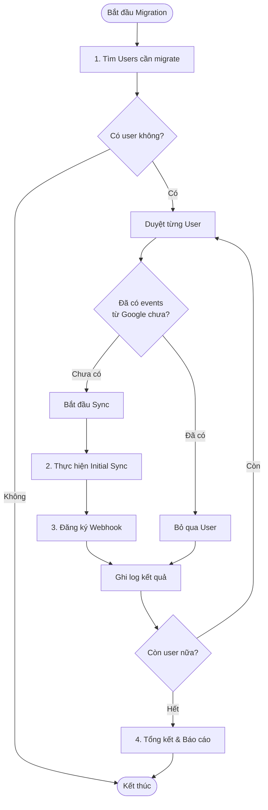

# Giải Thích Kỹ Thuật: Migrate Google Sync

## 1. Tổng Quan
Script `migrate-google-sync.ts` là một công cụ migration được thiết kế để chuyển đổi và kích hoạt tính năng đồng bộ hai chiều (Two-Way Sync) cho những người dùng hiện tại đã kết nối Google Calendar nhưng chưa được kích hoạt tính năng này.

## 2. Vấn đề Cần Giải Quyết
Trong quá trình phát triển hệ thống Calento, tính năng tích hợp Google Calendar được phát triển qua hai giai đoạn:
- **Giai đoạn 1 (Cũ):** Chỉ lưu access token để xác thực, chưa đồng bộ sự kiện.
- **Giai đoạn 2 (Mới):** Đồng bộ hai chiều real-time giữa Calento và Google Calendar.

**Vấn đề:** Những người dùng đã kết nối ở Giai đoạn 1 sẽ không có dữ liệu sự kiện được import và không có `webhook` để nhận thông báo thay đổi từ Google, dẫn đến trải nghiệm không đồng nhất.

## 3. Quy Trình Migration

Quy trình được tự động hóa hoàn toàn với luồng xử lý như sau:



## 4. Chi Tiết Kỹ Thuật Các Bước

### Bước 1: Tìm kiếm Users (`DatabaseService`)
Truy vấn SQL tìm các user thỏa mãn điều kiện:
- Provider là `google`
- Có `access_token` hợp lệ
- Tài khoản chưa bị xóa (`deleted_at IS NULL`)

```sql
SELECT DISTINCT user_id 
FROM user_credentials 
WHERE provider = 'google' 
AND access_token IS NOT NULL
AND deleted_at IS NULL
```

### Bước 2: Initial Sync (`CalendarSyncManagerService`)
Thực hiện đồng bộ dữ liệu lần đầu (Pull & Merge).
- **Hàm gọi:** `performInitialSync(userId, SyncStrategy.KEEP_BOTH)`
- **Chiến lược (Strategy):** `KEEP_BOTH`
  - Nếu sự kiện có ở Google nhưng chưa có ở Calento -> **Tạo mới ở Calento**
  - Nếu sự kiện có ở Calento nhưng chưa có ở Google -> **Đẩy lên Google**
  - Nếu trùng thời gian -> **Giữ cả hai** (để đảm bảo an toàn dữ liệu, tránh xóa nhầm)

### Bước 3: Setup Webhook (`WebhookService`)
Đăng ký nhận thông báo real-time từ Google (Push Notifications).
- **Hàm gọi:** `watchCalendar(userId, options)`
- **Config:**
  - `calendar_id`: 'primary' (Lịch chính của user)
  - `expiration`: 7 ngày (Google giới hạn tối đa, hệ thống có job tự động renew)
- **Tác dụng:** Khi user thay đổi lịch trên Google Calendar (web/mobile), Calento sẽ nhận được tín hiệu ngay lập tức để cập nhật.

## 5. Các Service Liên Quan
Hệ thống sử dụng kiến trúc module, tách biệt trách nhiệm:

| Service | Vai trò chính |
|---------|---------------|
| `CalendarSyncManagerService` | **Điều phối chính**: Quản lý quy trình sync, xử lý xung đột (conflict resolution). |
| `EventSyncService` | **Xử lý dữ liệu**: CRUD events, chuyển đổi dữ liệu giữa Google và Calento DTO. |
| `GoogleCalendarService` | **Gateway**: Wrapper gọi Google Calendar API v3 (List, Get, Watch...). |
| `WebhookService` | **Real-time**: Đăng ký và xử lý callback từ Google. |

## 6. Kết Quả Mong Đợi
Sau khi chạy script:
1. **Dữ liệu đồng nhất:** User cũ sẽ thấy toàn bộ lịch Google của họ xuất hiện trên Calento.
2. **Real-time:** Mọi thay đổi trong tương lai sẽ được đồng bộ tức thời.
3. **Minh bạch:** Script in ra báo cáo chi tiết số lượng thành công/thất bại để dev theo dõi.

---
*Tài liệu này dùng để giải thích cơ chế kỹ thuật trong báo cáo đồ án.*
