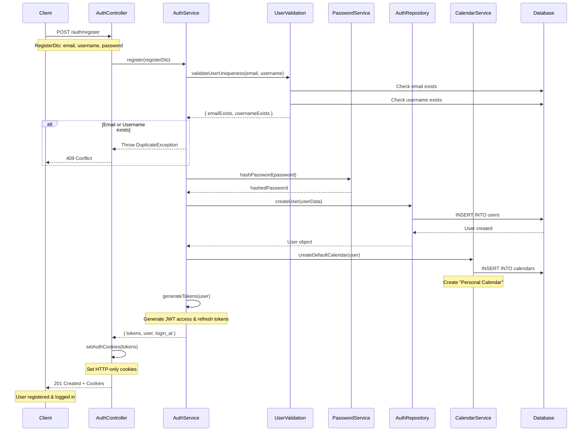
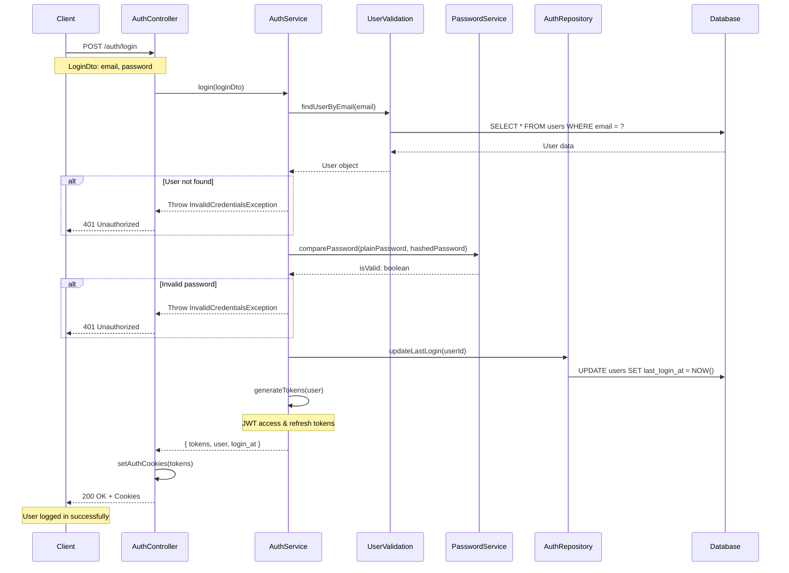
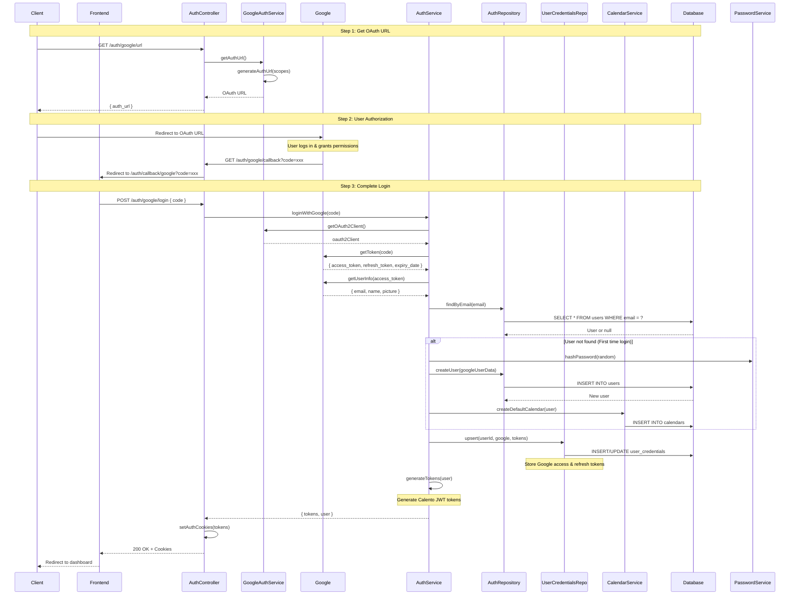
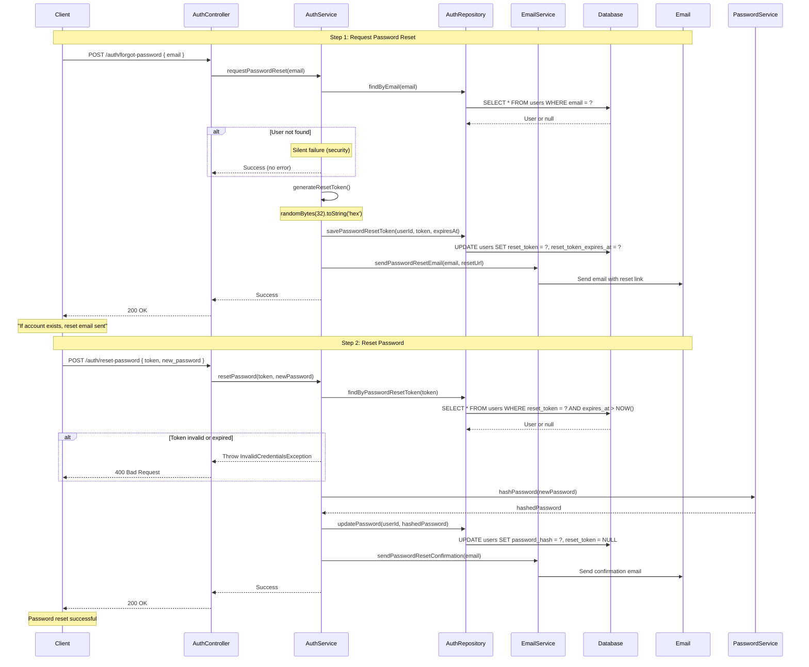
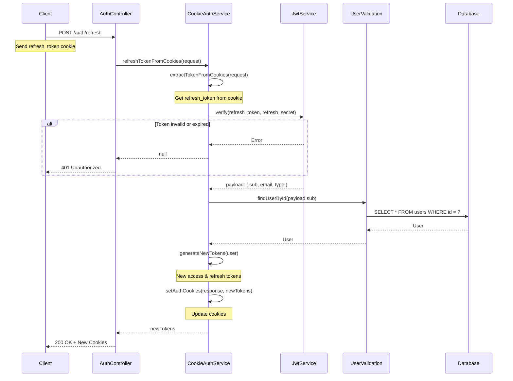
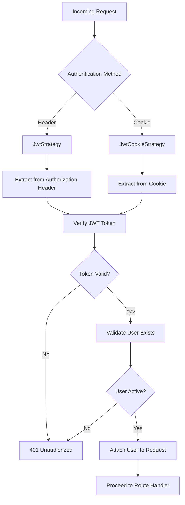

# 🔐 Authentication Flows Documentation

## Table of Contents
- [Overview](#overview)
- [Register Flow](#register-flow)
- [Login Flow](#login-flow)
- [Google OAuth Flow](#google-oauth-flow)
- [Password Reset Flow](#password-reset-flow)
- [Token Refresh Flow](#token-refresh-flow)
- [JWT Strategy](#jwt-strategy)

---

## Overview

Hệ thống Authentication của Calento hỗ trợ nhiều phương thức xác thực:
- **Email/Password Authentication**: Đăng ký và đăng nhập truyền thống
- **Google OAuth 2.0**: Đăng nhập qua tài khoản Google
- **JWT Token-based**: Access token và Refresh token
- **Cookie-based Session**: HTTP-only cookies cho bảo mật tốt hơn

### Core Components

```
modules/auth/
├── auth.controller.ts      # API endpoints
├── auth.service.ts         # Business logic
├── auth.repository.ts      # Database operations
├── services/
│   └── cookie-auth.service.ts  # Cookie management
├── strategies/
│   ├── jwt.strategy.ts          # JWT validation
│   └── jwt-cookie.strategy.ts  # Cookie + JWT validation
└── dto/                    # Data Transfer Objects
```

---

## Register Flow

### Flow Diagram



### API Endpoint

**POST** `/api/auth/register`

**Request:** Email, username, password, first_name, last_name

**Response:** User object + JWT tokens (access_token, refresh_token)

**Cookies:** HTTP-only, Secure, SameSite=Strict

### Key Features

1. **Email/Username Uniqueness**: Kiểm tra trùng lặp trước khi tạo user
2. **Password Hashing**: Sử dụng bcrypt với salt rounds
3. **Default Calendar**: Tự động tạo calendar "Personal" cho user mới
4. **JWT Tokens**: Generate cả access và refresh token
5. **Secure Cookies**: Set HTTP-only cookies tự động

---

## Login Flow

### Flow Diagram



### API Endpoint

**POST** `/api/auth/login`

**Request:** Email, password

**Response:** User object + JWT tokens + last_login_at

---

## Google OAuth Flow

### Flow Diagram



### API Endpoints

**1. Get OAuth URL:** `GET /api/auth/google/url`
- Returns: Google OAuth authorization URL

**2. OAuth Callback:** `GET /api/auth/google/callback?code=xxx`
- Redirect user về frontend với code

**3. Complete Login:** `POST /api/auth/google/login`
- Request: Authorization code từ Google
- Response: User object + Calento JWT tokens

### Google Scopes

```typescript
GOOGLE_API_CONSTANTS.SCOPE_SETS.FULL_CALENDAR_ACCESS = [
  'https://www.googleapis.com/auth/calendar',
  'https://www.googleapis.com/auth/calendar.events',
  'https://www.googleapis.com/auth/userinfo.email',
  'https://www.googleapis.com/auth/userinfo.profile',
]
```

### Key Features

1. **OAuth 2.0 Flow**: Chuẩn OAuth 2.0 với authorization code
2. **Automatic User Creation**: Tạo user mới nếu chưa tồn tại
3. **Token Storage**: Lưu Google tokens vào `user_credentials`
4. **Calendar Access**: Có quyền truy cập Google Calendar ngay lập tức
5. **Dual Token System**: Google tokens + Calento JWT tokens

---

## Password Reset Flow

### Flow Diagram



### API Endpoints

**1. Request Reset:** `POST /api/auth/forgot-password`
- Request: Email
- Response: Success message (không tiết lộ email có tồn tại)
- Action: Gửi email với reset token (expires sau 1 giờ)

**2. Reset Password:** `POST /api/auth/reset-password`
- Request: Reset token + new password
- Response: Success hoặc invalid/expired token error

### Security Features

1. **Silent Failure**: Không tiết lộ email có tồn tại hay không
2. **Token Expiry**: Reset token hết hạn sau 1 giờ
3. **Single Use**: Token bị xóa sau khi sử dụng
4. **Secure Random**: Sử dụng crypto.randomBytes
5. **Email Confirmation**: Gửi email xác nhận sau khi reset

---

## Token Refresh Flow

### Flow Diagram



### API Endpoint

**POST** `/api/auth/refresh`

**Request:** Refresh token trong cookie

**Response:** New access token + new refresh token

**Cookies:** Updated tokens được set tự động

---

## JWT Strategy

### Dual Strategy Support



### JWT Payload Structure

```typescript
interface JwtPayload {
  sub: string;        // User ID
  email: string;      // User email
  username: string;   // Username
  type: 'access' | 'refresh';  // Token type
  iat?: number;       // Issued at
  exp?: number;       // Expiration time
}
```

### Token Configuration

```typescript
// Access Token
{
  secret: process.env.JWT_SECRET,
  expiresIn: '1h',  // 1 hour
}

// Refresh Token
{
  secret: process.env.JWT_REFRESH_SECRET,
  expiresIn: '7d',  // 7 days
}
```

### Cookie Configuration

```typescript
// Cookie Options
{
  httpOnly: true,           // Prevent XSS attacks
  secure: NODE_ENV === 'production',  // HTTPS only in production
  sameSite: 'strict',       // CSRF protection
  path: '/',
  maxAge: {
    access_token: 3600 * 1000,      // 1 hour
    refresh_token: 7 * 24 * 3600 * 1000  // 7 days
  }
}
```

---

## Authentication Guards

### JwtAuthGuard

```typescript
@UseGuards(JwtAuthGuard)
@Get('protected-route')
async protectedRoute(@Request() req) {
  // req.user is available
  return { user: req.user };
}
```

### Public Routes

```typescript
@Public()  // Decorator to bypass authentication
@Get('public-route')
async publicRoute() {
  return { message: 'This is public' };
}
```

---

## Error Handling

### Custom Exceptions

```typescript
// 401 Unauthorized
throw new InvalidCredentialsException();

// 409 Conflict
throw new DuplicateEmailException(email);
throw new DuplicateUsernameException(username);

// 500 Internal Server Error
throw new AuthenticationFailedException(message);
```

### Error Response Format

```typescript
{
  "statusCode": 401,
  "message": "Invalid credentials",
  "error": "Unauthorized"
}
```

---

## Best Practices

1. **Password Security**
   - Bcrypt hashing with salt rounds
   - Minimum password strength requirements
   - Password never returned in responses

2. **Token Security**
   - HTTP-only cookies
   - Secure flag in production
   - SameSite strict for CSRF protection
   - Short-lived access tokens
   - Long-lived refresh tokens

3. **Error Messages**
   - Generic messages for security
   - No information leakage
   - Detailed logging for debugging

4. **Database Security**
   - Prepared statements (prevent SQL injection)
   - Password hash never exposed
   - Token expiry validation

---

## Environment Variables

```env
# JWT Configuration
JWT_SECRET=your-super-secret-jwt-key-min-32-chars
JWT_REFRESH_SECRET=your-refresh-secret-key-min-32-chars
JWT_EXPIRES_IN=1h
JWT_REFRESH_EXPIRES_IN=7d

# Google OAuth
GOOGLE_CLIENT_ID=your-google-client-id
GOOGLE_CLIENT_SECRET=your-google-client-secret
GOOGLE_REDIRECT_URI=http://localhost:8000/api/auth/google/callback

# Frontend URL (for redirects)
FRONTEND_URL=http://localhost:3000

# Cookie Security
NODE_ENV=production  # Enables secure cookies
```

---

## Testing

### Test User Registration

```bash
curl -X POST http://localhost:8000/api/auth/register \
  -H "Content-Type: application/json" \
  -d '{
    "email": "test@example.com",
    "username": "testuser",
    "password": "SecurePass123!",
    "first_name": "Test",
    "last_name": "User"
  }'
```

### Test Login

```bash
curl -X POST http://localhost:8000/api/auth/login \
  -H "Content-Type: application/json" \
  -d '{
    "email": "test@example.com",
    "password": "SecurePass123!"
  }' \
  -c cookies.txt  # Save cookies
```

### Test Protected Route

```bash
curl -X GET http://localhost:8000/api/auth/me \
  -b cookies.txt  # Use saved cookies
```

---

## Migration Scripts

### Create Users Table

```sql
CREATE TABLE users (
  id UUID PRIMARY KEY DEFAULT uuid_generate_v4(),
  email VARCHAR(255) UNIQUE NOT NULL,
  username VARCHAR(255) UNIQUE NOT NULL,
  password_hash TEXT NOT NULL,
  first_name VARCHAR(100),
  last_name VARCHAR(100),
  avatar TEXT,
  last_login_at TIMESTAMP,
  reset_token VARCHAR(255),
  reset_token_expires_at TIMESTAMP,
  created_at TIMESTAMP DEFAULT NOW(),
  updated_at TIMESTAMP DEFAULT NOW()
);

CREATE INDEX idx_users_email ON users(email);
CREATE INDEX idx_users_username ON users(username);
CREATE INDEX idx_users_reset_token ON users(reset_token);
```

### Create User Credentials Table

```sql
CREATE TABLE user_credentials (
  id UUID PRIMARY KEY DEFAULT uuid_generate_v4(),
  user_id UUID NOT NULL REFERENCES users(id) ON DELETE CASCADE,
  provider VARCHAR(50) NOT NULL,
  access_token TEXT NOT NULL,
  refresh_token TEXT,
  expires_at TIMESTAMP,
  scope TEXT,
  created_at TIMESTAMP DEFAULT NOW(),
  updated_at TIMESTAMP DEFAULT NOW(),
  UNIQUE(user_id, provider)
);

CREATE INDEX idx_user_credentials_user_provider ON user_credentials(user_id, provider);
```

---

## Troubleshooting

### Issue: Token expired

**Solution**: Use refresh token endpoint to get new tokens

```typescript
POST /api/auth/refresh
Cookie: refresh_token=...
```

### Issue: Google OAuth redirect fails

**Solution**: Check GOOGLE_REDIRECT_URI matches Google Console configuration

### Issue: Cookies not set

**Solution**: 
- Check CORS configuration allows credentials
- Frontend must send `credentials: 'include'`
- Check cookie domain matches

### Issue: JWT verification fails

**Solution**:
- Verify JWT_SECRET is consistent across restarts
- Check token expiration time
- Ensure token type matches (access vs refresh)

---

## Related Documentation

- [Google Calendar Integration](./02-GOOGLE-CALENDAR-INTEGRATION.md)
- [Event Management](./03-EVENT-MANAGEMENT.md)
- [API Reference](./API-REFERENCE.md)
