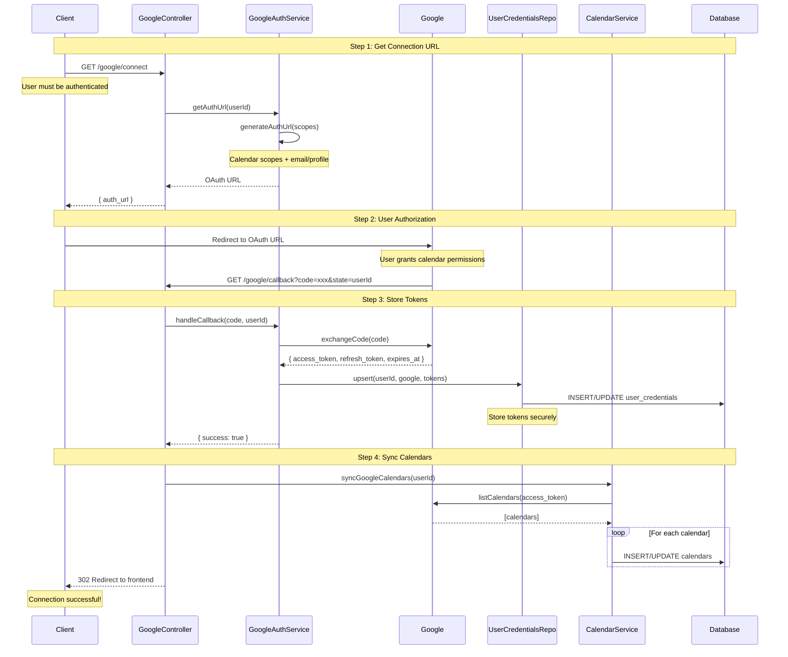
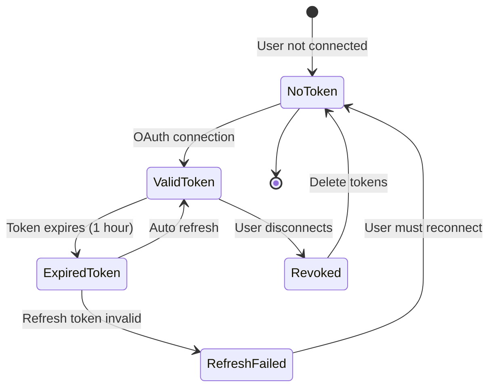
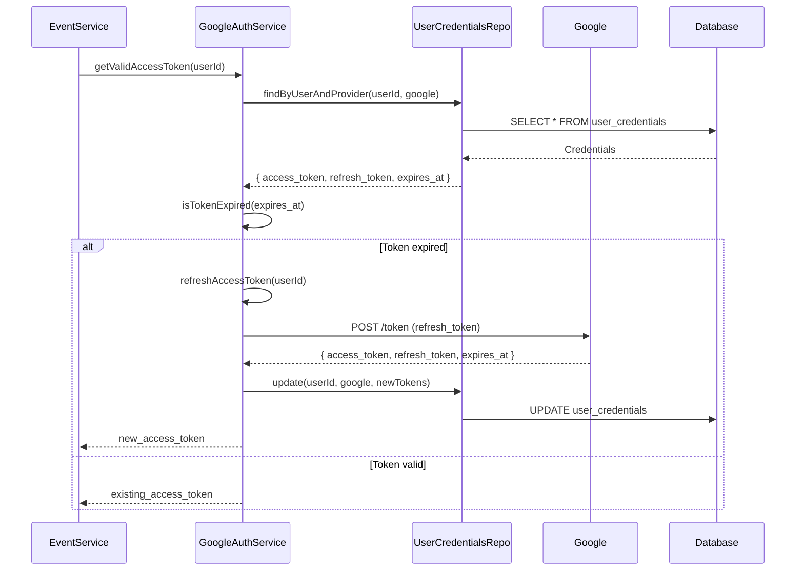
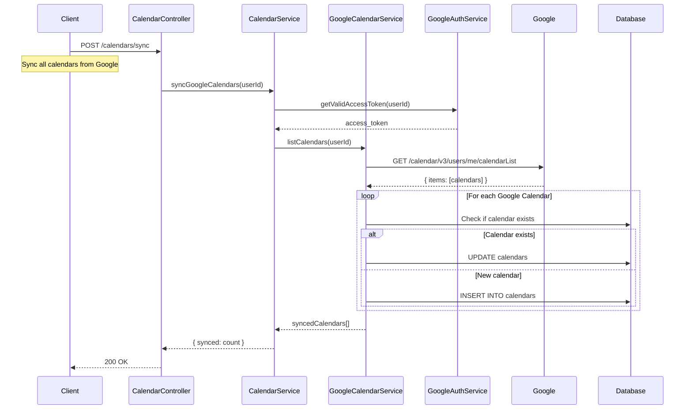
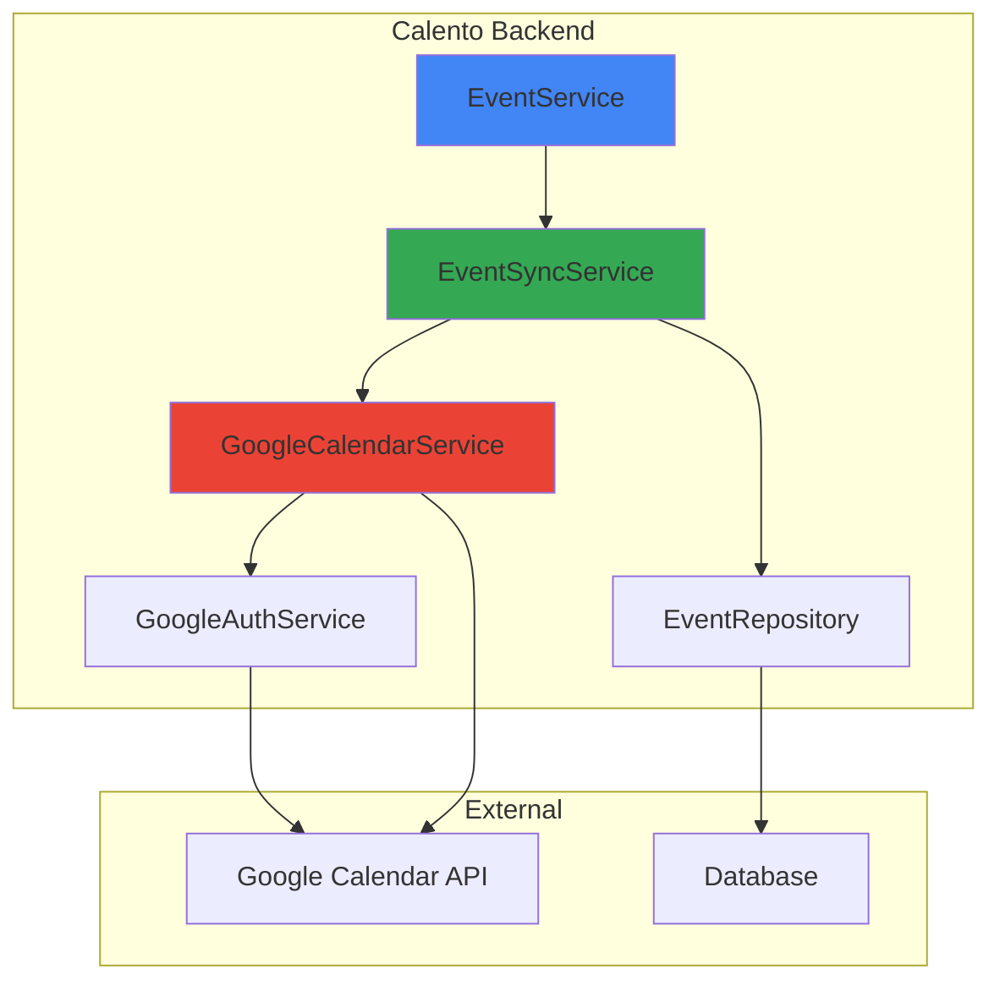
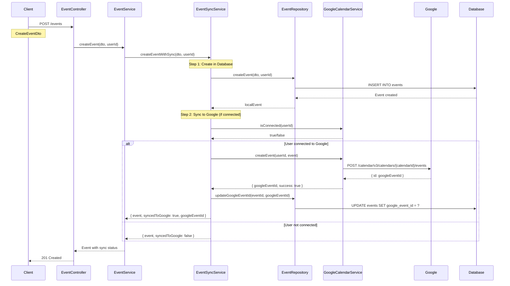
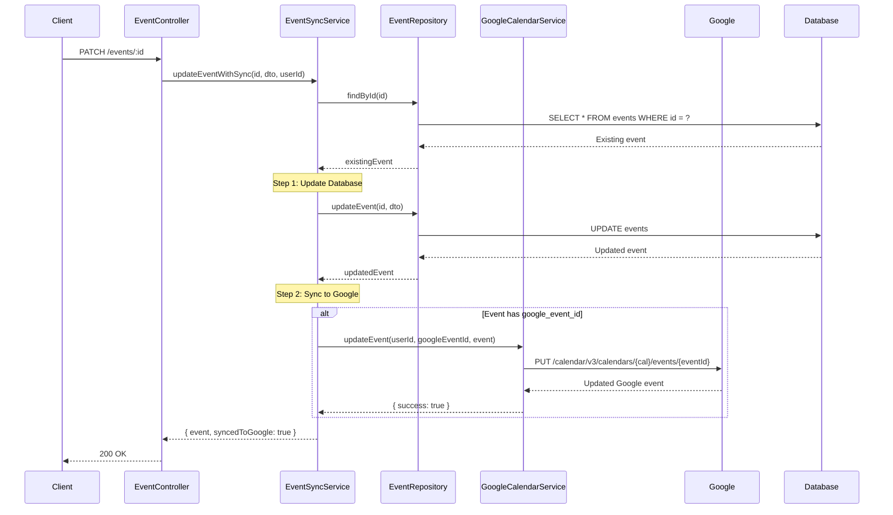
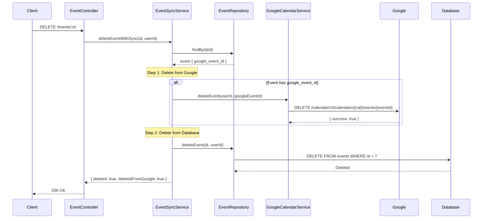
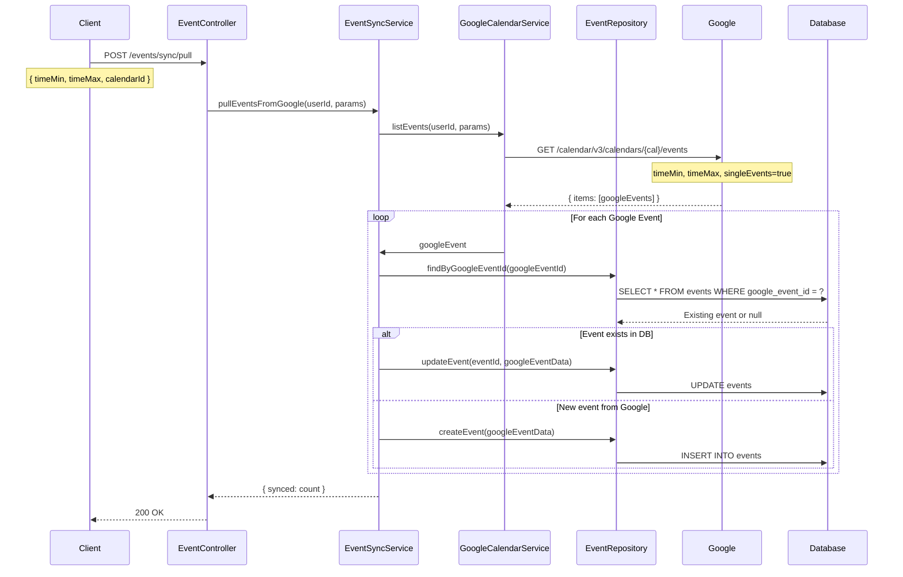
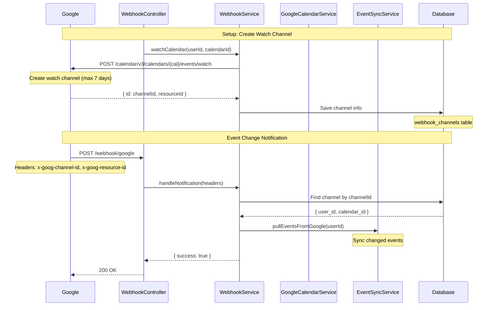

# 📅 Google Calendar Integration Documentation

## Table of Contents
- [Overview](#overview)
- [Connection Flow](#connection-flow)
- [Token Management](#token-management)
- [Calendar Sync](#calendar-sync)
- [Event Synchronization](#event-synchronization)
- [Webhook Integration](#webhook-integration)

---

## Overview

Calento tích hợp với Google Calendar để đồng bộ events hai chiều:
- **Pull**: Lấy events từ Google Calendar về Calento
- **Push**: Tạo/cập nhật events từ Calento lên Google Calendar
- **Real-time Sync**: Webhook notifications từ Google
- **Token Refresh**: Tự động refresh expired tokens

### Core Components

```
modules/google/
├── google.controller.ts        # API endpoints
├── services/
│   ├── google-auth.service.ts  # OAuth & token management
│   └── google-calendar.service.ts  # Calendar operations
└── repositories/
    └── user-credentials.repository.ts  # Token storage

modules/event/
└── services/
    └── event-sync.service.ts   # Event synchronization
```

---

## Connection Flow

### Flow Diagram



### API Endpoints

**1. Get Connection URL:** `GET /api/google/connect`
- Returns: Google OAuth URL với calendar scopes

**2. OAuth Callback:** `GET /api/google/callback?code=xxx`
- Exchange code for tokens
- Store tokens trong user_credentials
- Redirect về frontend

**3. Check Status:** `GET /api/google/status`
- Returns: connected status, expires_at, scopes

**4. Disconnect:** `DELETE /api/google/disconnect`
- Xóa tokens khỏi database
- Revoke access trên Google

---

## Token Management

### Token Lifecycle



### Token Refresh Flow



### Token Management Logic

**getValidAccessToken:**
1. Tìm credentials từ database
2. Check token đã expired chưa
3. Nếu expired: Gọi refreshAccessToken()
4. Return valid access token

**refreshAccessToken:**
1. Lấy refresh_token từ database
2. Gọi Google API để refresh
3. Nhận new access_token và refresh_token
4. Update vào database
5. Return success/failure

---

## Calendar Sync

### Sync Calendars Flow



### Calendar Data Mapping

```typescript
// Google Calendar → Calento Calendar

{
  // Google Calendar API Response
  id: "primary",
  summary: "John Doe",
  description: "Personal calendar",
  timeZone: "Asia/Ho_Chi_Minh",
  backgroundColor: "#9fc6e7",
  primary: true
}

↓ Mapped to ↓

{
  // Calento Calendar Object
  google_calendar_id: "primary",
  name: "John Doe",
  description: "Personal calendar",
  timezone: "Asia/Ho_Chi_Minh",
  color: "#9fc6e7",
  is_primary: true,
  user_id: "uuid",
  is_active: true
}
```

---

## Event Synchronization

### Architecture Overview



### Create Event with Sync



### Update Event with Sync



### Delete Event with Sync



### Pull Events from Google



---

## Webhook Integration

### Webhook Flow



### Webhook Setup

```typescript
POST /api/webhook/google/watch
Authorization: Bearer {access_token}
Content-Type: application/json

Request Body:
{
  "calendar_id": "primary",
  "expiration": "2024-12-31T23:59:59Z"  // Optional, max 7 days
}

Response (200 OK):
{
  "status": 200,
  "message": "Webhook channel created",
  "data": {
    "channel_id": "uuid",
    "resource_id": "google-resource-id",
    "expiration": "2024-12-31T23:59:59Z"
  }
}
```

### Stop Webhook

```typescript
DELETE /api/webhook/google/watch/:channelId
Authorization: Bearer {access_token}

Response (200 OK):
{
  "status": 200,
  "message": "Webhook channel stopped",
  "data": {
    "success": true
  }
}
```

---

## Event Data Mapping

### Google Event → Calento Event

```typescript
// Google Calendar Event
{
  id: "google-event-id",
  summary: "Team Meeting",
  description: "Weekly team sync",
  start: { dateTime: "2024-01-01T10:00:00Z", timeZone: "Asia/Ho_Chi_Minh" },
  end: { dateTime: "2024-01-01T11:00:00Z", timeZone: "Asia/Ho_Chi_Minh" },
  location: "Conference Room A",
  attendees: [
    { email: "user@example.com", responseStatus: "accepted" }
  ],
  recurrence: ["RRULE:FREQ=WEEKLY;BYDAY=MO"],
  conferenceData: {
    entryPoints: [
      { entryPointType: "video", uri: "https://meet.google.com/abc-defg-hij" }
    ]
  }
}

↓ Mapped to ↓

// Calento Event
{
  id: "uuid",
  google_event_id: "google-event-id",
  title: "Team Meeting",
  description: "Weekly team sync",
  start_time: "2024-01-01T10:00:00Z",
  end_time: "2024-01-01T11:00:00Z",
  timezone: "Asia/Ho_Chi_Minh",
  location: "Conference Room A",
  attendees: [
    { email: "user@example.com", response_status: "accepted" }
  ],
  recurrence_rule: "FREQ=WEEKLY;BYDAY=MO",
  conference_data: {
    type: "google_meet",
    url: "https://meet.google.com/abc-defg-hij"
  },
  user_id: "uuid",
  calendar_id: "uuid",
  is_all_day: false,
  color: "#4285f4"
}
```

---

## Error Handling

### Common Errors

```typescript
// 1. Token Expired
{
  "code": "TOKEN_EXPIRED",
  "message": "Access token has expired",
  "action": "REFRESH_TOKEN"
}

// 2. Insufficient Permissions
{
  "code": "INSUFFICIENT_PERMISSIONS",
  "message": "Missing calendar scope",
  "action": "RECONNECT"
}

// 3. Calendar Not Found
{
  "code": "CALENDAR_NOT_FOUND",
  "message": "Calendar does not exist",
  "action": "SYNC_CALENDARS"
}

// 4. Rate Limit
{
  "code": "RATE_LIMIT_EXCEEDED",
  "message": "Too many requests to Google API",
  "action": "RETRY_LATER"
}
```

### Retry Strategy

```typescript
// Exponential backoff for transient errors
const retryDelays = [1000, 2000, 4000, 8000];  // milliseconds

async function retryWithBackoff(fn: () => Promise<any>, maxRetries = 3) {
  for (let i = 0; i < maxRetries; i++) {
    try {
      return await fn();
    } catch (error) {
      if (i === maxRetries - 1) throw error;
      
      const delay = retryDelays[i];
      await new Promise(resolve => setTimeout(resolve, delay));
    }
  }
}
```

---

## Best Practices

1. **Token Management**
   - Always check token expiry before API calls
   - Auto-refresh expired tokens
   - Handle refresh token expiry gracefully
   - Store tokens securely (encrypted at rest)

2. **API Rate Limits**
   - Implement exponential backoff
   - Use batch requests when possible
   - Cache calendar lists
   - Monitor quota usage

3. **Data Consistency**
   - Always sync bidirectionally
   - Handle conflicts (last-write-wins)
   - Log all sync operations
   - Implement retry logic

4. **Security**
   - Request minimum required scopes
   - Validate webhook signatures
   - Use HTTPS for webhook endpoint
   - Sanitize event data

---

## Environment Variables

```env
# Google OAuth Configuration
GOOGLE_CLIENT_ID=your-google-client-id.apps.googleusercontent.com
GOOGLE_CLIENT_SECRET=your-google-client-secret
GOOGLE_REDIRECT_URI=http://localhost:8000/api/google/callback

# Webhook Configuration
WEBHOOK_URL=https://your-domain.com/api/webhook/google
```

---

## Database Schema

### user_credentials Table

```sql
CREATE TABLE user_credentials (
  id UUID PRIMARY KEY DEFAULT uuid_generate_v4(),
  user_id UUID NOT NULL REFERENCES users(id) ON DELETE CASCADE,
  provider VARCHAR(50) NOT NULL,  -- 'google'
  access_token TEXT NOT NULL,
  refresh_token TEXT,
  expires_at TIMESTAMP NOT NULL,
  scope TEXT,
  created_at TIMESTAMP DEFAULT NOW(),
  updated_at TIMESTAMP DEFAULT NOW(),
  UNIQUE(user_id, provider)
);

CREATE INDEX idx_credentials_user_provider ON user_credentials(user_id, provider);
CREATE INDEX idx_credentials_expires ON user_credentials(expires_at);
```

### webhook_channels Table

```sql
CREATE TABLE webhook_channels (
  id UUID PRIMARY KEY DEFAULT uuid_generate_v4(),
  user_id UUID NOT NULL REFERENCES users(id) ON DELETE CASCADE,
  calendar_id VARCHAR(255) NOT NULL,
  channel_id VARCHAR(255) NOT NULL UNIQUE,
  resource_id VARCHAR(255) NOT NULL,
  expiration TIMESTAMP NOT NULL,
  is_active BOOLEAN DEFAULT true,
  created_at TIMESTAMP DEFAULT NOW(),
  updated_at TIMESTAMP DEFAULT NOW()
);

CREATE INDEX idx_webhook_channels_user ON webhook_channels(user_id);
CREATE INDEX idx_webhook_channels_channel ON webhook_channels(channel_id);
```

---

## Testing

### Test Connection

```bash
# 1. Get connection URL
curl -X GET http://localhost:8000/api/google/connect \
  -H "Authorization: Bearer {token}"

# 2. Complete OAuth (manually open URL in browser)

# 3. Check connection status
curl -X GET http://localhost:8000/api/google/status \
  -H "Authorization: Bearer {token}"
```

### Test Event Sync

```bash
# Pull events from Google
curl -X POST http://localhost:8000/api/events/sync/pull \
  -H "Authorization: Bearer {token}" \
  -H "Content-Type: application/json" \
  -d '{
    "calendar_id": "primary",
    "time_min": "2024-01-01T00:00:00Z",
    "time_max": "2024-12-31T23:59:59Z"
  }'
```

---

## Troubleshooting

### Issue: Token refresh fails

**Cause**: Refresh token invalid or revoked

**Solution**: User must reconnect Google Calendar

```typescript
DELETE /api/google/disconnect
GET /api/google/connect
```

### Issue: Events not syncing

**Cause**: Calendar not synced or webhook expired

**Solution**: Resync calendars and setup new webhook

```typescript
POST /api/calendars/sync
POST /api/webhook/google/watch
```

### Issue: Webhook stopped working

**Cause**: Webhook channel expired (max 7 days)

**Solution**: Implement auto-renewal cron job

```typescript
// Run daily
async function renewWebhooks() {
  const expiringSoon = await getWebhooksExpiringIn24Hours();
  
  for (const channel of expiringSoon) {
    await stopWebhook(channel.id);
    await createWebhook(channel.user_id, channel.calendar_id);
  }
}
```

---

## Related Documentation

- [Authentication](./01-AUTHENTICATION-FLOWS.md)
- [Event Management](./03-EVENT-MANAGEMENT.md)
- [Webhook System](./04-WEBHOOK-SYSTEM.md)
