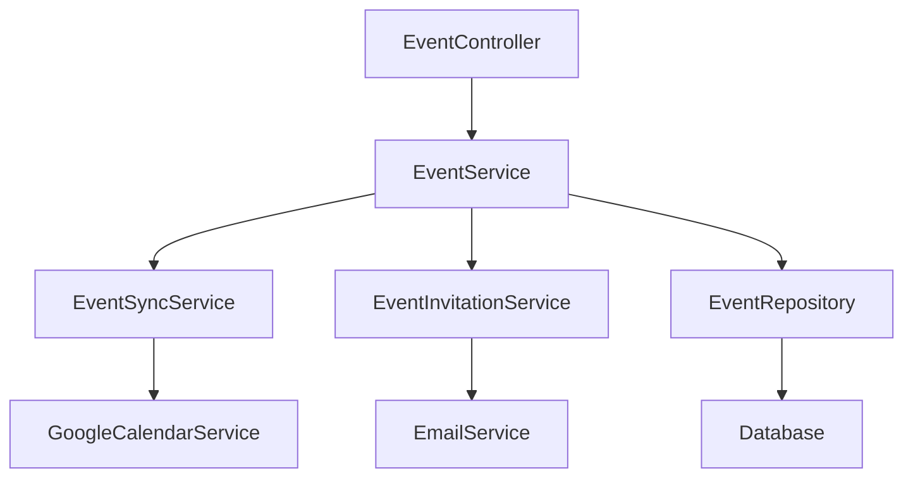
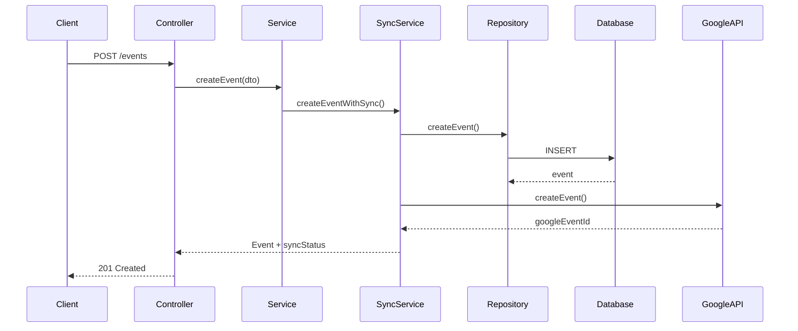
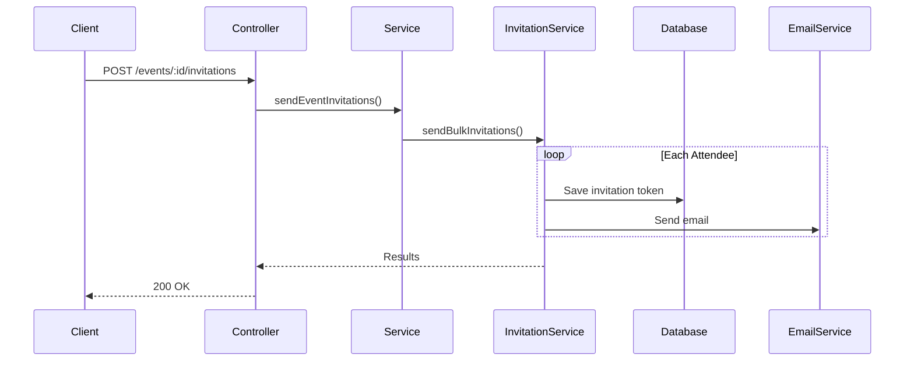

# 📆 Event Management Documentation

## Table of Contents
- [Overview](#overview)
- [Architecture](#architecture)
- [CRUD Operations](#crud-operations)
- [Recurring Events](#recurring-events)
- [Event Invitations](#event-invitations)
- [Attendee Management](#attendee-management)

---

## Overview

Event Management là core feature của Calento:
- ✅ Tạo, cập nhật, xóa events
- 🔁 Recurring events (RRULE)
- 📧 Email invitations
- 🔄 Google Calendar sync
- 🔍 Search và filter

### Core Components

```
modules/event/
├── event.controller.ts
├── event.service.ts
├── event.repository.ts
├── services/
│   ├── event-sync.service.ts
│   └── event-invitation.service.ts
└── dto/events.dto.ts
```

---

## Architecture



---

## CRUD Operations

### Create Event Flow



### API Endpoints

**CRUD Operations:**
- `POST /api/events` - Create event
- `PATCH /api/events/:id` - Update partial
- `PUT /api/events/:id` - Replace full
- `DELETE /api/events/:id` - Delete event
- `GET /api/events/:id` - Get single event

**List & Search:**
- `GET /api/events?page=1&limit=20` - List với pagination
- `GET /api/events/search?q=team` - Full-text search

---

## Recurring Events

### RRULE Examples

```typescript
"FREQ=DAILY"                    // Daily
"FREQ=WEEKLY;BYDAY=MO"         // Every Monday
"FREQ=MONTHLY;BYMONTHDAY=15"   // 15th each month
"FREQ=YEARLY;BYMONTH=1;BYMONTHDAY=1" // Every Jan 1st
```

### Expand Occurrences

```typescript
GET /api/events/recurring/expand?start_date=2024-01-01&end_date=2024-12-31

Response:
{
  "data": [
    {
      "id": "uuid_occurrence_0",
      "original_event_id": "uuid",
      "occurrence_index": 0,
      "start_time": "2024-01-08T10:00:00Z",
      "is_recurring_instance": true
    }
  ]
}
```

---

## Event Invitations

### Send Invitations Flow



### RSVP Endpoints

```typescript
// Get invitation
GET /api/events/invitations/:token

// Respond
POST /api/events/invitations/:token/respond
{
  "action": "accept",  // accept, decline, tentative
  "comment": "Looking forward!"
}
```

---

## Attendee Management

### Data Structure

```typescript
interface EventAttendee {
  email: string;
  display_name?: string;
  is_organizer: boolean;
  response_status: 'needs_action' | 'accepted' | 'declined' | 'tentative';
  invitation_token?: string;
}
```

### Database Schema

```sql
CREATE TABLE event_attendees (
  id UUID PRIMARY KEY,
  event_id UUID REFERENCES events(id),
  email VARCHAR(255) NOT NULL,
  display_name VARCHAR(255),
  response_status VARCHAR(20),
  invitation_token VARCHAR(255) UNIQUE,
  UNIQUE(event_id, email)
);
```

---

## Validation

```typescript
class CreateEventDto {
  @IsString()
  @MinLength(1)
  title: string;

  @IsISO8601()
  start_time: string;

  @IsISO8601()
  @IsAfterStartTime('start_time')
  end_time: string;

  @IsOptional()
  @Matches(/^FREQ=(DAILY|WEEKLY|MONTHLY|YEARLY)/)
  recurrence_rule?: string;
}
```

---

## Error Handling

```typescript
// Custom Exceptions
EventNotFoundException
EventCreationFailedException
EventValidationException
CalendarSyncException

// Error Response
{
  "statusCode": 404,
  "message": "Event not found",
  "error": "Not Found"
}
```

---

## Testing

```bash
# Create event
curl -X POST http://localhost:8000/api/events \
  -H "Authorization: Bearer {token}" \
  -d '{"title": "Test", "start_time": "2024-01-01T10:00:00Z", "end_time": "2024-01-01T11:00:00Z"}'

# Get events
curl -X GET http://localhost:8000/api/events \
  -H "Authorization: Bearer {token}"
```

---

## Related Documentation

- [Google Calendar Integration](./02-GOOGLE-CALENDAR-INTEGRATION.md)
- [Recurring Events](./RECURRING_EVENTS.md)
