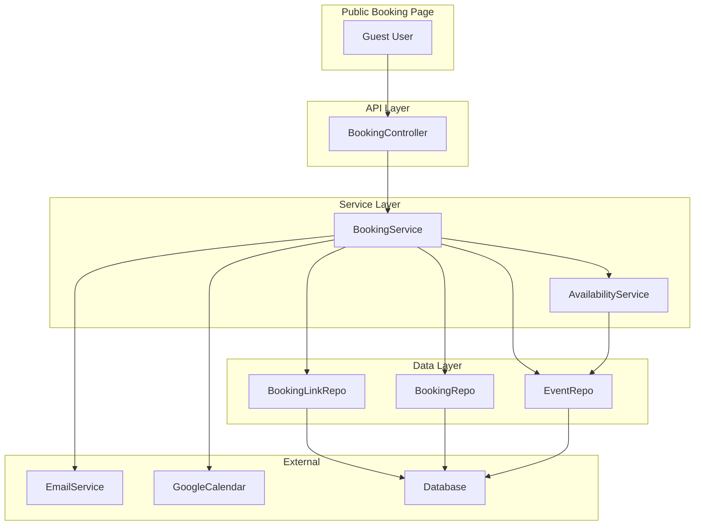
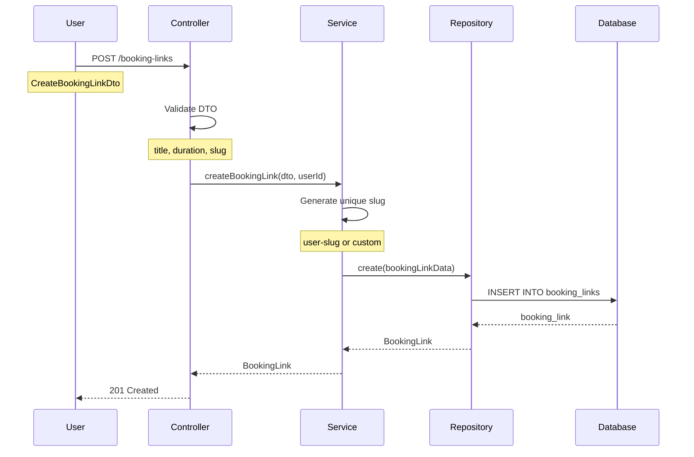
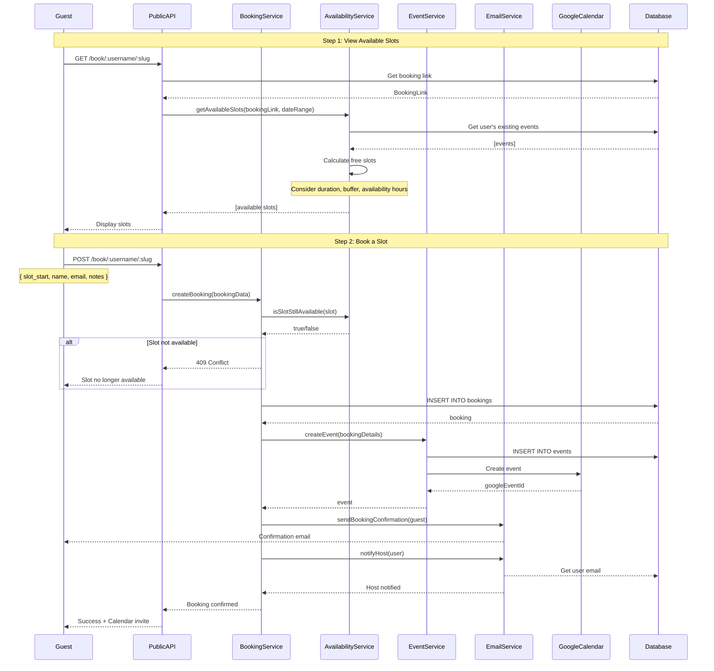
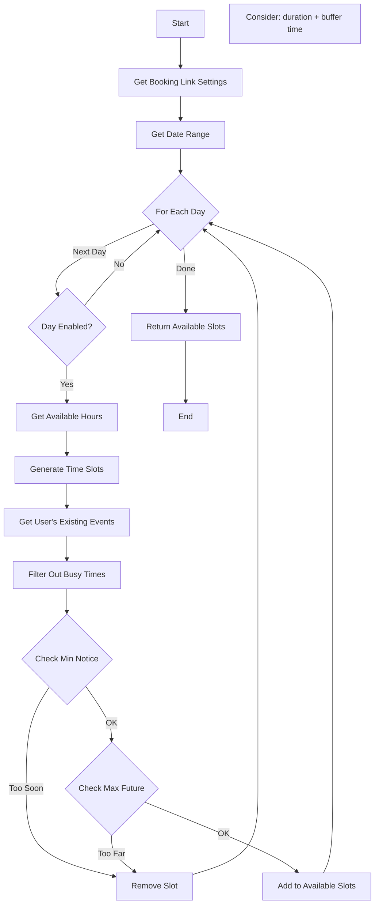
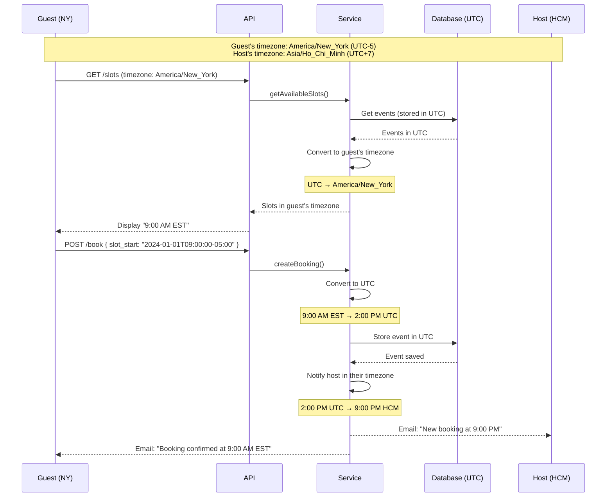

# 📅 Booking System Documentation

## Table of Contents
- [Overview](#overview)
- [Architecture](#architecture)
- [Booking Link Management](#booking-link-management)
- [Booking Flow](#booking-flow)
- [Availability Calculation](#availability-calculation)
- [Time Zone Handling](#time-zone-handling)

---

## Overview

Booking System cho phép users tạo booking links để người khác có thể đặt lịch:
- 🔗 Tạo customizable booking links
- ⏰ Set duration, buffer time, availability
- 📧 Automatic email confirmations
- 🔄 Google Calendar integration
- 🌍 Multi-timezone support

### Core Components

```
modules/booking/
├── booking.controller.ts
├── booking.service.ts
└── repositories/
    ├── booking-link.repository.ts
    └── booking.repository.ts
```

---

## Architecture



---

## Booking Link Management

### Create Booking Link Flow



### Booking Link Data Structure

```typescript
interface BookingLink {
  id: string;
  user_id: string;
  title: string;
  slug: string;  // Unique URL identifier
  description?: string;
  duration_minutes: number;
  buffer_before_minutes: number;
  buffer_after_minutes: number;
  
  // Availability
  availability_type: 'specific_hours' | 'calendar_sync';
  availability_hours?: {
    monday: { start: '09:00', end: '17:00', enabled: true },
    tuesday: { start: '09:00', end: '17:00', enabled: true },
    // ... other days
  };
  
  // Booking Settings
  min_booking_notice_minutes: number;  // e.g., 24 hours
  max_booking_days_future: number;     // e.g., 60 days
  
  // Customization
  color?: string;
  location?: string;
  meeting_type: 'in_person' | 'phone' | 'google_meet' | 'zoom';
  
  // Status
  is_active: boolean;
  bookings_count: number;
  
  created_at: Date;
  updated_at: Date;
}
```

### API Endpoints

```typescript
// Create Booking Link
POST /api/booking-links
Authorization: Bearer {token}
{
  "title": "30 Min Meeting",
  "slug": "30-min-meeting",
  "duration_minutes": 30,
  "buffer_before_minutes": 5,
  "buffer_after_minutes": 5,
  "availability_type": "specific_hours",
  "availability_hours": {
    "monday": { "start": "09:00", "end": "17:00", "enabled": true }
  },
  "min_booking_notice_minutes": 1440,
  "max_booking_days_future": 60,
  "meeting_type": "google_meet"
}

// Get User's Booking Links
GET /api/booking-links
Authorization: Bearer {token}

Response:
{
  "status": 200,
  "data": [
    {
      "id": "uuid",
      "title": "30 Min Meeting",
      "slug": "30-min-meeting",
      "public_url": "https://app.tempra.com/book/username/30-min-meeting",
      "bookings_count": 15,
      "is_active": true
    }
  ]
}

// Update Booking Link
PATCH /api/booking-links/:id
Authorization: Bearer {token}
{
  "is_active": false
}

// Delete Booking Link
DELETE /api/booking-links/:id
Authorization: Bearer {token}
```

---

## Booking Flow

### Complete Booking Process



### API Endpoints

```typescript
// Get Booking Link (Public)
GET /api/book/:username/:slug

Response:
{
  "status": 200,
  "data": {
    "id": "uuid",
    "title": "30 Min Meeting",
    "description": "Quick chat",
    "duration_minutes": 30,
    "host": {
      "name": "John Doe",
      "avatar": "https://..."
    }
  }
}

// Get Available Slots (Public)
GET /api/book/:username/:slug/slots?start_date=2024-01-01&end_date=2024-01-07

Response:
{
  "status": 200,
  "data": {
    "slots": [
      {
        "start": "2024-01-01T09:00:00Z",
        "end": "2024-01-01T09:30:00Z"
      },
      {
        "start": "2024-01-01T10:00:00Z",
        "end": "2024-01-01T10:30:00Z"
      }
    ],
    "timezone": "Asia/Ho_Chi_Minh"
  }
}

// Create Booking (Public)
POST /api/book/:username/:slug
{
  "slot_start": "2024-01-01T09:00:00Z",
  "guest_name": "Jane Smith",
  "guest_email": "jane@example.com",
  "guest_notes": "Looking forward to meeting",
  "guest_timezone": "America/New_York"
}

Response:
{
  "status": 201,
  "message": "Booking confirmed",
  "data": {
    "booking_id": "uuid",
    "event_id": "uuid",
    "confirmation_url": "https://app.tempra.com/booking/confirmation/uuid"
  }
}
```

---

## Availability Calculation

### Algorithm Flow



### Implementation Logic

**getAvailableSlots():**
1. Loop qua từng ngày trong date range
2. Kiểm tra ngày được enable trong availability_hours
3. Generate slots cho ngày (dựa vào start/end time và duration)
4. Lấy busy slots (existing events) của user
5. Filter ra free slots (không conflict với busy)
6. Apply buffer time (before/after)
7. Apply booking window constraints (min notice, max future)
8. Return danh sách available slots

**generateDaySlots():**
- Chia ngày thành các slots theo duration
- Ví dụ: 9AM-5PM, duration 30min → 16 slots

**filterBusySlots():**
- Check overlap giữa slot và existing events
- Bao gồm buffer time trước và sau

**isWithinBookingWindow():**
- Check slot >= (now + min_notice)
- Check slot <= (now + max_future_days)

---

## Time Zone Handling

### Multi-Timezone Support



### Timezone Conversion

**Sử dụng moment-timezone library:**

**Key Functions:**
- `toUserTimezone()` - Convert UTC → User's timezone
- `toUTC()` - Convert user's timezone → UTC  
- `formatForDisplay()` - Format date cho display
- `getTimezoneOffset()` - Lấy UTC offset (e.g., UTC+07:00)

**Best Practices:**
- Luôn lưu UTC trong database
- Convert sang user timezone khi display
- Guest và Host có thể ở timezone khác nhau

---

## Booking Confirmation

### Email Templates

```html
<!-- Guest Confirmation -->
<h1>Booking Confirmed! 🎉</h1>
<p>Your meeting with {{host_name}} has been confirmed.</p>

<div class="booking-details">
  <h2>{{event_title}}</h2>
  <p>📅 {{event_date}}</p>
  <p>🕐 {{event_time}} {{guest_timezone}}</p>
  <p>⏱️ Duration: {{duration}} minutes</p>
  <p>📍 {{location_or_meeting_link}}</p>
</div>

<a href="{{add_to_calendar_url}}" class="button">Add to Calendar</a>
<a href="{{reschedule_url}}" class="button-secondary">Reschedule</a>
<a href="{{cancel_url}}" class="button-danger">Cancel</a>

<!-- Host Notification -->
<h1>New Booking! 📅</h1>
<p>{{guest_name}} has booked a meeting with you.</p>

<div class="booking-details">
  <p><strong>Guest:</strong> {{guest_name}} ({{guest_email}})</p>
  <p><strong>Time:</strong> {{event_time}} {{host_timezone}}</p>
  <p><strong>Notes:</strong> {{guest_notes}}</p>
</div>

<a href="{{view_booking_url}}" class="button">View Details</a>
```

---

## Database Schema

```sql
-- Booking Links
CREATE TABLE booking_links (
  id UUID PRIMARY KEY DEFAULT uuid_generate_v4(),
  user_id UUID NOT NULL REFERENCES users(id) ON DELETE CASCADE,
  title VARCHAR(255) NOT NULL,
  slug VARCHAR(255) NOT NULL,
  description TEXT,
  duration_minutes INT NOT NULL,
  buffer_before_minutes INT DEFAULT 0,
  buffer_after_minutes INT DEFAULT 0,
  availability_type VARCHAR(50) NOT NULL,
  availability_hours JSONB,
  min_booking_notice_minutes INT DEFAULT 0,
  max_booking_days_future INT DEFAULT 60,
  color VARCHAR(7),
  location TEXT,
  meeting_type VARCHAR(50),
  is_active BOOLEAN DEFAULT true,
  bookings_count INT DEFAULT 0,
  created_at TIMESTAMP DEFAULT NOW(),
  updated_at TIMESTAMP DEFAULT NOW(),
  UNIQUE(user_id, slug)
);

-- Bookings
CREATE TABLE bookings (
  id UUID PRIMARY KEY DEFAULT uuid_generate_v4(),
  booking_link_id UUID NOT NULL REFERENCES booking_links(id) ON DELETE CASCADE,
  event_id UUID REFERENCES events(id) ON DELETE SET NULL,
  guest_name VARCHAR(255) NOT NULL,
  guest_email VARCHAR(255) NOT NULL,
  guest_phone VARCHAR(50),
  guest_notes TEXT,
  guest_timezone VARCHAR(50),
  slot_start TIMESTAMP NOT NULL,
  slot_end TIMESTAMP NOT NULL,
  status VARCHAR(50) DEFAULT 'confirmed',
  cancellation_reason TEXT,
  created_at TIMESTAMP DEFAULT NOW(),
  updated_at TIMESTAMP DEFAULT NOW()
);

CREATE INDEX idx_booking_links_user_slug ON booking_links(user_id, slug);
CREATE INDEX idx_bookings_link ON bookings(booking_link_id);
CREATE INDEX idx_bookings_slot ON bookings(slot_start, slot_end);
```

---

## Error Handling

```typescript
// Slot not available
{
  "statusCode": 409,
  "message": "Selected time slot is no longer available",
  "error": "Conflict"
}

// Invalid booking link
{
  "statusCode": 404,
  "message": "Booking link not found or inactive",
  "error": "Not Found"
}

// Outside booking window
{
  "statusCode": 400,
  "message": "Booking must be at least 24 hours in advance",
  "error": "Bad Request"
}
```

---

## Testing

```bash
# Create booking link
curl -X POST http://localhost:8000/api/booking-links \
  -H "Authorization: Bearer {token}" \
  -d '{"title": "30 Min", "slug": "30-min", "duration_minutes": 30}'

# Get available slots (public)
curl -X GET "http://localhost:8000/api/book/johndoe/30-min/slots?start_date=2024-01-01&end_date=2024-01-07"

# Create booking (public)
curl -X POST http://localhost:8000/api/book/johndoe/30-min \
  -d '{"slot_start": "2024-01-01T09:00:00Z", "guest_name": "Jane", "guest_email": "jane@example.com"}'
```

---

## Related Documentation

- [Event Management](./03-EVENT-MANAGEMENT.md)
- [Email Notifications](./05-EMAIL-SYSTEM.md)
