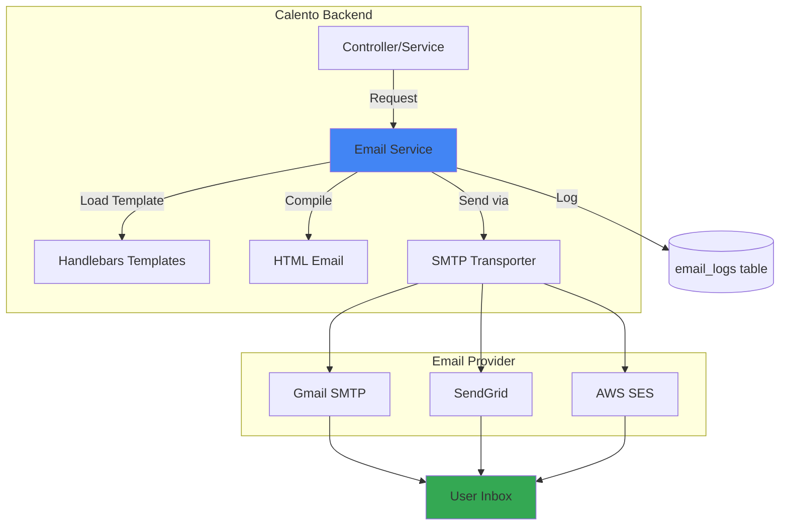

# 📧 Email System Documentation

## 📋 Tổng Quan

Email System của Calento xử lý tất cả transactional emails: welcome messages, event invitations, password resets, và reminders.

## 🏗️ Architecture



## 📂 Structure

```
server/src/modules/email/
├── email.service.ts          # Core email logic
├── email.controller.ts       # API endpoints (admin)
├── email.module.ts
├── interfaces/
│   └── email.interface.ts    # TypeScript interfaces
├── dto/
│   └── send-email.dto.ts     # Validation DTOs
└── templates/
    ├── welcome.hbs
    ├── event-invitation.hbs
    ├── event-reminder.hbs
    ├── password-reset.hbs
    └── password-reset-confirmation.hbs
```

---

## ⚙️ Configuration

### Environment Variables

```env
# SMTP Configuration
SMTP_HOST=smtp.gmail.com
SMTP_PORT=587
SMTP_SECURE=false
SMTP_USER=your-email@gmail.com
SMTP_PASSWORD=your-app-password

# From Address
SMTP_FROM=Calento <noreply@calento.space>

# App URL (for email links)
FRONTEND_URL=https://calento.space
```

### Supported Providers

**1. Gmail SMTP**
```env
SMTP_HOST=smtp.gmail.com
SMTP_PORT=587
SMTP_USER=your-email@gmail.com
SMTP_PASSWORD=app-specific-password  # NOT regular password
```

**Setup Steps:**
1. Enable 2-Factor Authentication
2. Generate App Password in Google Account settings
3. Use App Password in `SMTP_PASSWORD`

**2. SendGrid**
```env
SMTP_HOST=smtp.sendgrid.net
SMTP_PORT=587
SMTP_USER=apikey
SMTP_PASSWORD=your-sendgrid-api-key
```

**3. AWS SES**
```env
SMTP_HOST=email-smtp.us-east-1.amazonaws.com
SMTP_PORT=587
SMTP_USER=your-smtp-username
SMTP_PASSWORD=your-smtp-password
```

---

## 📨 Email Templates

### Available Templates

#### 1. Welcome Email
**Template:** `welcome.hbs`  
**Trigger:** User registers  
**Variables:**
- `user_name`: User's first name
- `app_url`: Frontend URL

#### 2. Event Invitation
**Template:** `event-invitation.hbs`  
**Trigger:** User invited to event  
**Variables:**
- `event_title`: Event name
- `event_start`: Start time
- `event_end`: End time
- `event_location`: Location
- `organizer_name`: Host name
- `accept_url`: RSVP accept link
- `decline_url`: RSVP decline link

#### 3. Event Reminder
**Template:** `event-reminder.hbs`  
**Trigger:** 1 hour before event  
**Variables:**
- `event_title`
- `event_start`
- `event_location`
- `event_url`: View event link

#### 4. Password Reset
**Template:** `password-reset.hbs`  
**Trigger:** User requests password reset  
**Variables:**
- `reset_url`: Reset link with token
- `expiry_hours`: Token expiry (1 hour)

#### 5. Password Reset Confirmation
**Template:** `password-reset-confirmation.hbs`  
**Trigger:** Password successfully reset  
**Variables:**
- `user_name`
- `login_url`

### Template Engine

**Handlebars** với custom helpers:

**formatDate:**
```handlebars
{{formatDate event_start}}
<!-- Output: Monday, January 1, 2024, 10:00 AM -->
```

**formatTime:**
```handlebars
{{formatTime event_start}}
<!-- Output: 10:00 AM -->
```

---

## 🔧 Usage

### Send Welcome Email

```typescript
await emailService.sendWelcomeEmail(user);
```

### Send Event Invitation

```typescript
await emailService.sendEventInvitation(
  attendee.email,
  event,
  organizer,
  attendee.id
);
```

### Send Password Reset

```typescript
await emailService.sendPasswordReset(
  user.email,
  resetToken
);
```

### Custom Email

```typescript
const result = await emailService.sendEmail({
  to: 'user@example.com',
  subject: 'Custom Subject',
  template: 'custom-template',
  context: {
    variable1: 'value1',
    variable2: 'value2'
  }
});

if (result.success) {
  console.log('Email sent!', result.messageId);
} else {
  console.error('Email failed:', result.error);
}
```

---

## 📊 Email Logging

### Database Schema

```sql
CREATE TABLE email_logs (
  id UUID PRIMARY KEY,
  recipient VARCHAR(255) NOT NULL,
  subject VARCHAR(255) NOT NULL,
  template VARCHAR(100),
  status VARCHAR(20), -- 'sent', 'failed', 'pending'
  error_message TEXT,
  message_id VARCHAR(255),
  sent_at TIMESTAMP,
  created_at TIMESTAMP DEFAULT NOW()
);
```

### Log Entry Example

```json
{
  "id": "uuid",
  "recipient": "user@example.com",
  "subject": "Welcome to Calento",
  "template": "welcome",
  "status": "sent",
  "message_id": "<xxxxx@gmail.com>",
  "sent_at": "2024-01-01T10:00:00Z"
}
```

---

## 🎨 Email Design

### Best Practices

✅ **Responsive Design**
- Mobile-friendly layout
- Minimum 600px width
- Safe font sizes (14px+)

✅ **Brand Consistency**
- Calento logo
- Brand colors (Purple gradient)
- Consistent typography

✅ **Clear CTAs**
- Prominent action buttons
- Descriptive button text
- Accessible contrast ratios

✅ **Plain Text Fallback**
- Always include text version
- Auto-generated from HTML

### Template Structure

```handlebars
<!DOCTYPE html>
<html>
<head>
  <meta charset="UTF-8">
  <meta name="viewport" content="width=device-width, initial-scale=1.0">
  <style>
    /* Inline CSS for email clients */
  </style>
</head>
<body>
  <div class="container">
    <div class="header">
      
    </div>
    
    <div class="content">
      <!-- Email content -->
    </div>
    
    <div class="footer">
      <p>&copy; 2024 Calento. All rights reserved.</p>
    </div>
  </div>
</body>
</html>
```

---

## 🐛 Troubleshooting

### Email not sending

**Check SMTP configuration:**
```bash
# Test SMTP connection
curl -v telnet://smtp.gmail.com:587
```

**Check logs:**
```typescript
// Email service logs
[EmailService] Email transporter verification failed
[EmailService] Gmail SMTP Debug Tips:
```

**Common issues:**
- ❌ Wrong password → Use App Password for Gmail
- ❌ Port blocked → Check firewall
- ❌ 2FA not enabled → Enable for Gmail
- ❌ "Less secure apps" → Use App Password instead

### Template not found

**Check template path:**
```
server/src/modules/email/templates/template-name.hbs
```

**Verify template name:**
```typescript
await emailService.sendEmail({
  template: 'welcome',  // Must match filename
  //...
});
```

### Variables not rendering

**Check context object:**
```typescript
context: {
  user_name: 'John',  // Must match {{user_name}} in template
  app_url: process.env.FRONTEND_URL
}
```

---

## 📈 Monitoring

### Email Metrics

Query email logs:
```sql
-- Email success rate
SELECT 
  status,
  COUNT(*) as count,
  ROUND(COUNT(*) * 100.0 / SUM(COUNT(*)) OVER(), 2) as percentage
FROM email_logs
WHERE created_at >= NOW() - INTERVAL '7 days'
GROUP BY status;

-- Most sent templates
SELECT 
  template,
  COUNT(*) as count
FROM email_logs
WHERE status = 'sent'
  AND created_at >= NOW() - INTERVAL '30 days'
GROUP BY template
ORDER BY count DESC;
```

### Health Check

```typescript
// Check if transporter is ready
const isReady = await emailService.verifyConnection();

if (!isReady) {
  // Alert: Email service down
}
```

---

## 🚀 Future Enhancements

### Planned Features

- [ ] **Queue System** - BullMQ for async sending
- [ ] **Email Templates UI** - WYSIWYG editor
- [ ] **A/B Testing** - Test email variations
- [ ] **Analytics** - Open rates, click rates
- [ ] **Unsubscribe Management** - Preference center
- [ ] **Multi-language** - i18n email templates
- [ ] **Rich Attachments** - ICS files, PDFs

---

## 📝 Summary

**Email System Features:**

✅ **Multi-provider support** - Gmail, SendGrid, AWS SES  
✅ **Template engine** - Handlebars với custom helpers  
✅ **5 transactional templates** - Welcome, invites, reminders, resets  
✅ **Logging** - Track all email activities  
✅ **Error handling** - Graceful failures với retry logic  
✅ **Responsive design** - Mobile-friendly emails  

Email system reliable và scalable cho Calento! 📧
