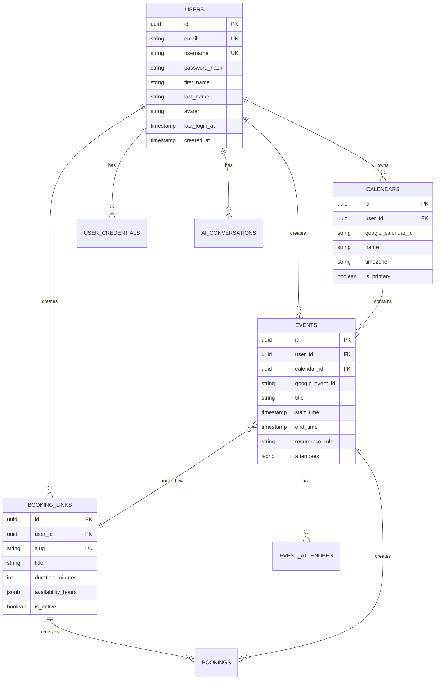

# 🗄️ Database Schema Documentation

## Table of Contents
- [Overview](#overview)
- [ER Diagram](#er-diagram)
- [Core Tables](#core-tables)
- [Indexes & Performance](#indexes--performance)
- [Migrations](#migrations)

---

## Overview

Calento sử dụng **PostgreSQL** làm primary database với các features:
- UUID primary keys
- Timestamps (created_at, updated_at)
- Soft deletes (deleted_at)
- Foreign key constraints
- JSON/JSONB columns
- Full-text search indexes

---

## ER Diagram

### Core Entities Relationship



---

## Core Tables

### Users & Authentication

#### users

Lưu trữ user accounts và authentication data.

```sql
CREATE TABLE users (
  id UUID PRIMARY KEY DEFAULT uuid_generate_v4(),
  email VARCHAR(255) UNIQUE NOT NULL,
  username VARCHAR(255) UNIQUE NOT NULL,
  password_hash TEXT NOT NULL,
  
  -- Profile
  first_name VARCHAR(100),
  last_name VARCHAR(100),
  avatar TEXT,
  bio TEXT,
  timezone VARCHAR(50) DEFAULT 'Asia/Ho_Chi_Minh',
  
  -- Status
  status VARCHAR(20) DEFAULT 'active',
  email_verified BOOLEAN DEFAULT false,
  
  -- Password Reset
  reset_token VARCHAR(255),
  reset_token_expires_at TIMESTAMP,
  
  -- Tracking
  last_login_at TIMESTAMP,
  created_at TIMESTAMP DEFAULT NOW(),
  updated_at TIMESTAMP DEFAULT NOW(),
  deleted_at TIMESTAMP
);

-- Indexes
CREATE INDEX idx_users_email ON users(email) WHERE deleted_at IS NULL;
CREATE INDEX idx_users_username ON users(username) WHERE deleted_at IS NULL;
CREATE INDEX idx_users_reset_token ON users(reset_token);
CREATE INDEX idx_users_status ON users(status);

-- Trigger for updated_at
CREATE TRIGGER update_users_updated_at
  BEFORE UPDATE ON users
  FOR EACH ROW
  EXECUTE FUNCTION update_updated_at_column();
```

#### user_credentials

Lưu OAuth tokens (Google, etc.).

```sql
CREATE TABLE user_credentials (
  id UUID PRIMARY KEY DEFAULT uuid_generate_v4(),
  user_id UUID NOT NULL REFERENCES users(id) ON DELETE CASCADE,
  provider VARCHAR(50) NOT NULL, -- 'google', 'microsoft', etc.
  
  -- Tokens
  access_token TEXT NOT NULL,
  refresh_token TEXT,
  expires_at TIMESTAMP NOT NULL,
  scope TEXT,
  
  -- Metadata
  created_at TIMESTAMP DEFAULT NOW(),
  updated_at TIMESTAMP DEFAULT NOW(),
  
  UNIQUE(user_id, provider)
);

CREATE INDEX idx_credentials_user_provider ON user_credentials(user_id, provider);
CREATE INDEX idx_credentials_expires ON user_credentials(expires_at);
```

---

### Calendar & Events

#### calendars

Multiple calendars per user (Personal, Work, etc.).

```sql
CREATE TABLE calendars (
  id UUID PRIMARY KEY DEFAULT uuid_generate_v4(),
  user_id UUID NOT NULL REFERENCES users(id) ON DELETE CASCADE,
  
  -- Calendar Info
  google_calendar_id VARCHAR(255),
  name VARCHAR(255) NOT NULL,
  description TEXT,
  color VARCHAR(7) DEFAULT '#4285f4',
  timezone VARCHAR(50) DEFAULT 'Asia/Ho_Chi_Minh',
  
  -- Settings
  is_primary BOOLEAN DEFAULT false,
  is_active BOOLEAN DEFAULT true,
  is_visible BOOLEAN DEFAULT true,
  
  -- Timestamps
  created_at TIMESTAMP DEFAULT NOW(),
  updated_at TIMESTAMP DEFAULT NOW(),
  deleted_at TIMESTAMP
);

CREATE INDEX idx_calendars_user ON calendars(user_id);
CREATE INDEX idx_calendars_google_id ON calendars(google_calendar_id);
CREATE UNIQUE INDEX idx_calendars_user_primary ON calendars(user_id) 
  WHERE is_primary = true AND deleted_at IS NULL;
```

#### events

Core event data with Google Calendar sync support.

```sql
CREATE TABLE events (
  id UUID PRIMARY KEY DEFAULT uuid_generate_v4(),
  user_id UUID NOT NULL REFERENCES users(id) ON DELETE CASCADE,
  calendar_id UUID REFERENCES calendars(id) ON DELETE SET NULL,
  google_event_id VARCHAR(255),
  
  -- Event Details
  title VARCHAR(255) NOT NULL,
  description TEXT,
  location TEXT,
  
  -- Time
  start_time TIMESTAMP NOT NULL,
  end_time TIMESTAMP NOT NULL,
  timezone VARCHAR(50) DEFAULT 'Asia/Ho_Chi_Minh',
  is_all_day BOOLEAN DEFAULT false,
  
  -- Recurrence
  recurrence_rule TEXT, -- RRULE format
  recurrence_exception_dates JSONB, -- Array of dates to exclude
  
  -- Visual
  color VARCHAR(7),
  
  -- Attendees & Invitations
  attendees JSONB, -- Array of attendee objects
  organizer_name VARCHAR(255),
  organizer_email VARCHAR(255),
  
  -- Meeting Info
  conference_data JSONB, -- Google Meet, Zoom, etc.
  
  -- Reminders
  reminders JSONB, -- Array of reminder objects
  
  -- Status
  status VARCHAR(20) DEFAULT 'confirmed', -- confirmed, cancelled, tentative
  visibility VARCHAR(20) DEFAULT 'default', -- default, public, private
  
  -- Timestamps
  created_at TIMESTAMP DEFAULT NOW(),
  updated_at TIMESTAMP DEFAULT NOW(),
  deleted_at TIMESTAMP
);

-- Indexes for performance
CREATE INDEX idx_events_user ON events(user_id);
CREATE INDEX idx_events_calendar ON events(calendar_id);
CREATE INDEX idx_events_google_id ON events(google_event_id);
CREATE INDEX idx_events_time_range ON events(start_time, end_time);
CREATE INDEX idx_events_user_time ON events(user_id, start_time, end_time);
CREATE INDEX idx_events_recurring ON events(recurrence_rule) WHERE recurrence_rule IS NOT NULL;

-- Full-text search
CREATE INDEX idx_events_search ON events USING gin(
  to_tsvector('english', coalesce(title, '') || ' ' || coalesce(description, ''))
);
```

#### event_attendees

Separate table for attendee management and invitation tracking.

```sql
CREATE TABLE event_attendees (
  id UUID PRIMARY KEY DEFAULT uuid_generate_v4(),
  event_id UUID NOT NULL REFERENCES events(id) ON DELETE CASCADE,
  
  -- Attendee Info
  email VARCHAR(255) NOT NULL,
  display_name VARCHAR(255),
  
  -- Status
  is_organizer BOOLEAN DEFAULT false,
  response_status VARCHAR(20) DEFAULT 'needs_action',
    -- 'needs_action', 'accepted', 'declined', 'tentative'
  comment TEXT,
  
  -- Invitation
  invitation_token VARCHAR(255) UNIQUE NOT NULL,
  invitation_sent_at TIMESTAMP,
  responded_at TIMESTAMP,
  
  -- Timestamps
  created_at TIMESTAMP DEFAULT NOW(),
  updated_at TIMESTAMP DEFAULT NOW(),
  
  UNIQUE(event_id, email)
);

CREATE INDEX idx_attendees_event ON event_attendees(event_id);
CREATE INDEX idx_attendees_email ON event_attendees(email);
CREATE INDEX idx_attendees_token ON event_attendees(invitation_token);
CREATE INDEX idx_attendees_response ON event_attendees(response_status);
```

---

### Booking System

#### booking_links

Customizable scheduling links.

```sql
CREATE TABLE booking_links (
  id UUID PRIMARY KEY DEFAULT uuid_generate_v4(),
  user_id UUID NOT NULL REFERENCES users(id) ON DELETE CASCADE,
  
  -- Link Info
  title VARCHAR(255) NOT NULL,
  slug VARCHAR(255) NOT NULL, -- URL-friendly identifier
  description TEXT,
  
  -- Duration & Buffer
  duration_minutes INT NOT NULL,
  buffer_before_minutes INT DEFAULT 0,
  buffer_after_minutes INT DEFAULT 0,
  
  -- Availability
  availability_type VARCHAR(50) NOT NULL, -- 'specific_hours', 'calendar_sync'
  availability_hours JSONB, -- Week schedule
  
  -- Booking Window
  min_booking_notice_minutes INT DEFAULT 0,
  max_booking_days_future INT DEFAULT 60,
  
  -- Customization
  color VARCHAR(7),
  location TEXT,
  meeting_type VARCHAR(50), -- 'in_person', 'phone', 'google_meet', 'zoom'
  
  -- Questions for guests
  custom_questions JSONB,
  
  -- Status & Stats
  is_active BOOLEAN DEFAULT true,
  bookings_count INT DEFAULT 0,
  
  -- Timestamps
  created_at TIMESTAMP DEFAULT NOW(),
  updated_at TIMESTAMP DEFAULT NOW(),
  deleted_at TIMESTAMP,
  
  UNIQUE(user_id, slug)
);

CREATE INDEX idx_booking_links_user ON booking_links(user_id);
CREATE INDEX idx_booking_links_slug ON booking_links(user_id, slug);
CREATE INDEX idx_booking_links_active ON booking_links(is_active);
```

#### bookings

Individual booking records.

```sql
CREATE TABLE bookings (
  id UUID PRIMARY KEY DEFAULT uuid_generate_v4(),
  booking_link_id UUID NOT NULL REFERENCES booking_links(id) ON DELETE CASCADE,
  event_id UUID REFERENCES events(id) ON DELETE SET NULL,
  
  -- Guest Info
  guest_name VARCHAR(255) NOT NULL,
  guest_email VARCHAR(255) NOT NULL,
  guest_phone VARCHAR(50),
  guest_notes TEXT,
  guest_timezone VARCHAR(50),
  
  -- Custom Questions Answers
  custom_answers JSONB,
  
  -- Booking Time
  slot_start TIMESTAMP NOT NULL,
  slot_end TIMESTAMP NOT NULL,
  
  -- Status
  status VARCHAR(50) DEFAULT 'confirmed',
    -- 'confirmed', 'cancelled', 'completed', 'no_show'
  cancellation_reason TEXT,
  cancelled_at TIMESTAMP,
  
  -- Timestamps
  created_at TIMESTAMP DEFAULT NOW(),
  updated_at TIMESTAMP DEFAULT NOW(),
  
  CONSTRAINT valid_slot CHECK (slot_end > slot_start)
);

CREATE INDEX idx_bookings_link ON bookings(booking_link_id);
CREATE INDEX idx_bookings_event ON bookings(event_id);
CREATE INDEX idx_bookings_guest_email ON bookings(guest_email);
CREATE INDEX idx_bookings_slot ON bookings(slot_start, slot_end);
CREATE INDEX idx_bookings_status ON bookings(status);
```

---

### Background Jobs & Webhooks

#### webhook_channels

Google Calendar webhook subscriptions.

```sql
CREATE TABLE webhook_channels (
  id UUID PRIMARY KEY DEFAULT uuid_generate_v4(),
  user_id UUID NOT NULL REFERENCES users(id) ON DELETE CASCADE,
  
  -- Channel Info
  calendar_id VARCHAR(255) NOT NULL,
  channel_id VARCHAR(255) NOT NULL UNIQUE,
  resource_id VARCHAR(255) NOT NULL,
  
  -- Expiration
  expiration TIMESTAMP NOT NULL,
  
  -- Status
  is_active BOOLEAN DEFAULT true,
  
  -- Timestamps
  created_at TIMESTAMP DEFAULT NOW(),
  updated_at TIMESTAMP DEFAULT NOW()
);

CREATE INDEX idx_webhook_user ON webhook_channels(user_id);
CREATE INDEX idx_webhook_channel ON webhook_channels(channel_id);
CREATE INDEX idx_webhook_expiration ON webhook_channels(expiration);
```

#### email_logs

Track email sending for analytics and debugging.

```sql
CREATE TABLE email_logs (
  id UUID PRIMARY KEY DEFAULT uuid_generate_v4(),
  user_id UUID REFERENCES users(id) ON DELETE SET NULL,
  
  -- Email Info
  recipient_email VARCHAR(255) NOT NULL,
  subject VARCHAR(500),
  template_name VARCHAR(100),
  
  -- Provider
  provider VARCHAR(50), -- 'smtp', 'sendgrid', 'ses', etc.
  provider_message_id VARCHAR(255),
  
  -- Status
  status VARCHAR(50) DEFAULT 'queued',
    -- 'queued', 'sent', 'delivered', 'opened', 'clicked', 'bounced', 'failed'
  error_message TEXT,
  
  -- Analytics
  sent_at TIMESTAMP,
  delivered_at TIMESTAMP,
  opened_at TIMESTAMP,
  clicked_at TIMESTAMP,
  failed_at TIMESTAMP,
  
  -- Timestamps
  created_at TIMESTAMP DEFAULT NOW(),
  updated_at TIMESTAMP DEFAULT NOW()
);

CREATE INDEX idx_email_logs_user ON email_logs(user_id);
CREATE INDEX idx_email_logs_recipient ON email_logs(recipient_email);
CREATE INDEX idx_email_logs_status ON email_logs(status);
CREATE INDEX idx_email_logs_sent_at ON email_logs(sent_at);
```

---

### AI & Analytics

#### ai_conversations

AI chatbot conversation sessions.

```sql
CREATE TABLE ai_conversations (
  id UUID PRIMARY KEY DEFAULT uuid_generate_v4(),
  user_id UUID NOT NULL REFERENCES users(id) ON DELETE CASCADE,
  
  -- Conversation Info
  title VARCHAR(255),
  context JSONB, -- User context, preferences, etc.
  
  -- Metadata
  message_count INT DEFAULT 0,
  last_message_at TIMESTAMP,
  
  -- Timestamps
  created_at TIMESTAMP DEFAULT NOW(),
  updated_at TIMESTAMP DEFAULT NOW()
);

CREATE INDEX idx_conversations_user ON ai_conversations(user_id);
CREATE INDEX idx_conversations_last_message ON ai_conversations(last_message_at);
```

#### ai_messages

Individual messages in conversations.

```sql
CREATE TABLE ai_messages (
  id UUID PRIMARY KEY DEFAULT uuid_generate_v4(),
  conversation_id UUID NOT NULL REFERENCES ai_conversations(id) ON DELETE CASCADE,
  
  -- Message Info
  role VARCHAR(20) NOT NULL, -- 'user', 'assistant', 'system'
  content TEXT NOT NULL,
  
  -- Function Calling
  function_calls JSONB, -- Array of function calls
  function_results JSONB, -- Array of results
  
  -- Timestamps
  created_at TIMESTAMP DEFAULT NOW()
);

CREATE INDEX idx_messages_conversation ON ai_messages(conversation_id, created_at);
CREATE INDEX idx_messages_role ON ai_messages(role);
```

---

## Indexes & Performance

### Composite Indexes

```sql
-- Events by user and date range (most common query)
CREATE INDEX idx_events_user_date_range 
  ON events(user_id, start_time, end_time)
  WHERE deleted_at IS NULL;

-- Bookings by link and date
CREATE INDEX idx_bookings_link_date 
  ON bookings(booking_link_id, slot_start)
  WHERE status = 'confirmed';

-- Available slots calculation
CREATE INDEX idx_events_availability 
  ON events(user_id, start_time, end_time, status)
  WHERE deleted_at IS NULL AND status != 'cancelled';
```

### Partial Indexes

```sql
-- Active users only
CREATE INDEX idx_users_active 
  ON users(id, email) 
  WHERE status = 'active' AND deleted_at IS NULL;

-- Primary calendars
CREATE INDEX idx_calendars_primary 
  ON calendars(user_id, id) 
  WHERE is_primary = true AND deleted_at IS NULL;

-- Recurring events
CREATE INDEX idx_events_recurring 
  ON events(id, user_id, recurrence_rule) 
  WHERE recurrence_rule IS NOT NULL AND deleted_at IS NULL;
```

### JSONB Indexes

```sql
-- Search within event attendees
CREATE INDEX idx_events_attendees_gin 
  ON events USING gin(attendees);

-- Search within booking availability hours
CREATE INDEX idx_booking_links_availability_gin 
  ON booking_links USING gin(availability_hours);
```

---

## Migrations

### Running Migrations

```bash
# Run all pending migrations
npm run migration:run

# Revert last migration
npm run migration:revert

# Generate new migration
npm run migration:generate -- -n CreateUsersTable

# Create empty migration
npm run migration:create -- -n AddUserPreferences
```

### Migration Example

```sql
-- migrations/20240101_001_create_users_table.sql

-- UP
CREATE TABLE users (
  id UUID PRIMARY KEY DEFAULT uuid_generate_v4(),
  email VARCHAR(255) UNIQUE NOT NULL,
  password_hash TEXT NOT NULL,
  created_at TIMESTAMP DEFAULT NOW()
);

CREATE INDEX idx_users_email ON users(email);

-- DOWN
DROP INDEX IF EXISTS idx_users_email;
DROP TABLE IF EXISTS users CASCADE;
```

### Migration Best Practices

1. **Always provide DOWN migration** for rollback
2. **Use transactions** when possible
3. **Test on staging** before production
4. **Backup database** before running
5. **Monitor execution time** for large tables
6. **Use batch updates** for data migrations

---

## Constraints & Validations

### Foreign Keys

```sql
-- Cascade deletes
ON DELETE CASCADE  -- Delete related records
ON DELETE SET NULL -- Set foreign key to NULL
ON DELETE RESTRICT -- Prevent deletion

-- Example
ALTER TABLE events
  ADD CONSTRAINT fk_events_user
  FOREIGN KEY (user_id) 
  REFERENCES users(id) 
  ON DELETE CASCADE;
```

### Check Constraints

```sql
-- Validate time range
ALTER TABLE events
  ADD CONSTRAINT valid_time_range
  CHECK (end_time > start_time);

-- Validate duration
ALTER TABLE booking_links
  ADD CONSTRAINT valid_duration
  CHECK (duration_minutes > 0 AND duration_minutes <= 1440);

-- Validate email format
ALTER TABLE users
  ADD CONSTRAINT valid_email
  CHECK (email ~* '^[A-Za-z0-9._%+-]+@[A-Za-z0-9.-]+\.[A-Z|a-z]{2,}$');
```

---

## Backup & Restore

### Backup Commands

```bash
# Full database backup
pg_dump -U postgres tempra_prod > backup_$(date +%Y%m%d).sql

# Backup specific tables
pg_dump -U postgres -t users -t events tempra_prod > users_events_backup.sql

# Backup with compression
pg_dump -U postgres -Fc tempra_prod > backup.dump
```

### Restore Commands

```bash
# Restore from SQL file
psql -U postgres tempra_prod < backup.sql

# Restore from compressed dump
pg_restore -U postgres -d tempra_prod backup.dump
```

---

## Related Documentation

- [API Reference](./API-REFERENCE.md)
- [Event Management](./03-EVENT-MANAGEMENT.md)
- [Booking System](./04-BOOKING-SYSTEM.md)
