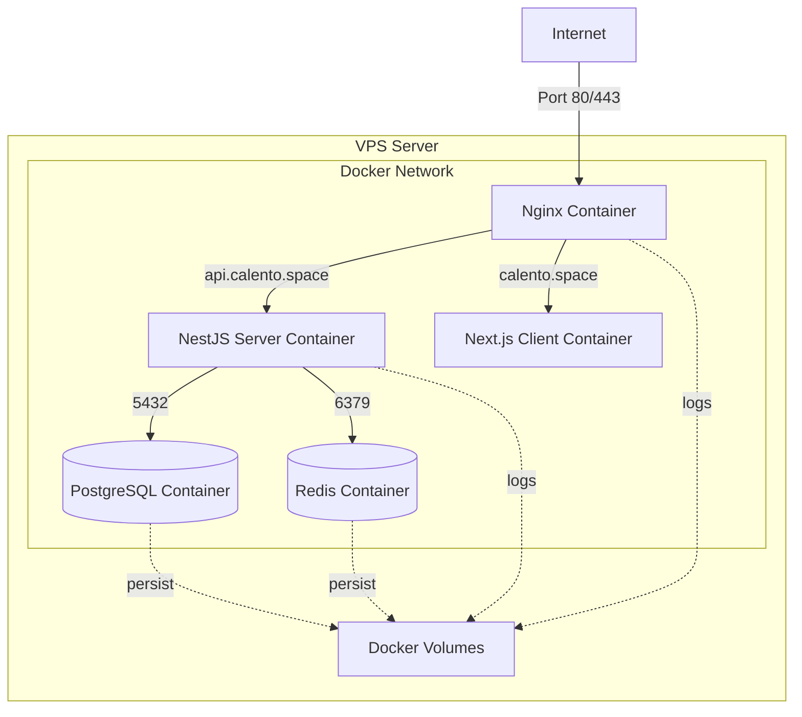
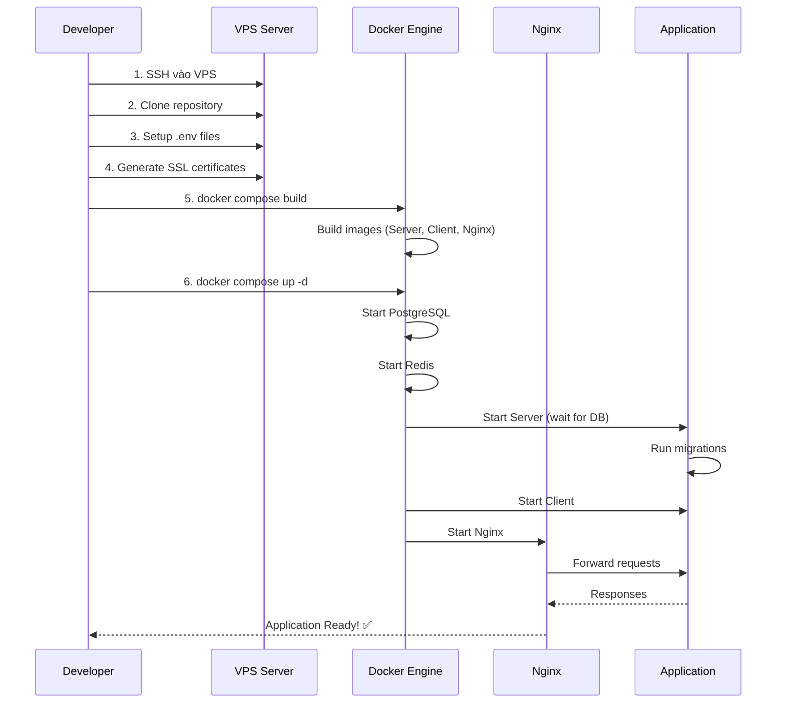

# 🚀 Docker Deployment Guide - VPS với Nginx

## 📋 Tổng Quan

Tài liệu này hướng dẫn chi tiết luồng deploy Calento lên VPS sử dụng Docker, Docker Compose và Nginx reverse proxy.

## 🏗️ Kiến Trúc Deployment



## 📦 Cấu Trúc Containers

### 1. **Nginx Container** (Reverse Proxy & SSL)
- **Image:** nginx:alpine
- **Ports:** 80, 443
- **Vai trò:**
  - SSL termination
  - Reverse proxy cho client và server
  - HTTP → HTTPS redirect
  - Load balancing (nếu scale)

### 2. **Server Container** (Backend API)
- **Image:** Built from `server/Dockerfile`
- **Port:** 8000
- **Tech Stack:** NestJS + Node.js 22
- **Features:**
  - Multi-stage build (builder + runner)
  - Auto migrations on startup
  - Health checks
  - Non-root user security

### 3. **Client Container** (Frontend)
- **Image:** Built from `client/Dockerfile`
- **Port:** 3000
- **Tech Stack:** Next.js 14 + Node.js 22
- **Features:**
  - Standalone output mode
  - Static optimization
  - Non-root user security

### 4. **PostgreSQL Container** (Database)
- **Image:** postgres:15-alpine
- **Port:** 5432
- **Features:**
  - Persistent volume
  - Health checks
  - Auto backup ready

### 5. **Redis Container** (Cache & Queue)
- **Image:** redis:alpine
- **Port:** 6379
- **Features:**
  - AOF persistence
  - Health checks

---

## 🔧 Chuẩn Bị VPS

### Yêu Cầu Tối Thiểu

- **OS:** Ubuntu 22.04 LTS (recommended)
- **RAM:** 2GB (minimum), 4GB (recommended)
- **CPU:** 2 cores
- **Storage:** 20GB SSD
- **Network:** Public IP address

### Bước 1: Setup VPS

```bash
# Update system
sudo apt update && sudo apt upgrade -y

# Install Docker
curl -fsSL https://get.docker.com -o get-docker.sh
sudo sh get-docker.sh

# Install Docker Compose
sudo apt install docker-compose-plugin -y

# Add user to docker group
sudo usermod -aG docker $USER
newgrp docker

# Verify installation
docker --version
docker compose version
```

### Bước 2: Setup Firewall

```bash
# Install UFW
sudo apt install ufw -y

# Allow SSH (IMPORTANT: Do this first!)
sudo ufw allow 22/tcp

# Allow HTTP and HTTPS
sudo ufw allow 80/tcp
sudo ufw allow 443/tcp

# Enable firewall
sudo ufw enable

# Check status
sudo ufw status
```

### Bước 3: Setup Domain & DNS

Trỏ DNS records về IP của VPS:

- **A Record:** `calento.space` → `VPS_IP`
- **A Record:** `api.calento.space` → `VPS_IP`

Verify DNS propagation:
```bash
dig calento.space
dig api.calento.space
```

---

## 🔐 SSL Certificate Setup

### Option 1: Self-Signed Certificate (Development)

```bash
# Tạo thư mục ssl
mkdir -p client/ssl

# Generate certificate
openssl req -x509 -nodes -days 365 -newkey rsa:2048 \
  -keyout client/ssl/calento.key \
  -out client/ssl/calento.crt \
  -subj "/C=VN/ST=HCM/L=HCMC/O=Calento/CN=calento.space"
```

### Option 2: Let's Encrypt (Production)

**Sử dụng Certbot trên VPS:**

```bash
# Install certbot
sudo apt install certbot -y

# Stop nginx nếu đang chạy
docker compose down nginx

# Generate certificate
sudo certbot certonly --standalone \
  -d calento.space \
  -d api.calento.space \
  --email your-email@example.com \
  --agree-tos

# Copy certificates
sudo cp /etc/letsencrypt/live/calento.space/fullchain.pem client/ssl/calento.crt
sudo cp /etc/letsencrypt/live/calento.space/privkey.pem client/ssl/calento.key

# Set permissions
sudo chmod 644 client/ssl/calento.crt
sudo chmod 600 client/ssl/calento.key
```

**Auto-renewal setup:**

```bash
# Add cron job
sudo crontab -e

# Thêm dòng này (renew every 3 months)
0 0 1 */3 * certbot renew --quiet && docker compose restart nginx
```

---

## ⚙️ Environment Configuration

### Server Environment (.env)

```env
# App
NODE_ENV=production
PORT=8000
APP_NAME=Calento
APP_URL=https://calento.space

# Database
DB_HOST=postgres
DB_PORT=5432
DB_NAME=calento_db
DB_USER=postgres
DB_PASSWORD=your_strong_password_here

# Redis
REDIS_HOST=redis
REDIS_PORT=6379
REDIS_PASSWORD=your_redis_password_here

# JWT
JWT_SECRET=your_jwt_secret_min_32_chars
JWT_REFRESH_SECRET=your_refresh_secret_min_32_chars
JWT_EXPIRES_IN=1h
JWT_REFRESH_EXPIRES_IN=7d

# Google OAuth
GOOGLE_CLIENT_ID=your_google_client_id
GOOGLE_CLIENT_SECRET=your_google_client_secret
GOOGLE_REDIRECT_URI=https://api.calento.space/api/auth/google/callback

# Email (SendGrid hoặc SMTP)
EMAIL_FROM=noreply@calento.space
SENDGRID_API_KEY=your_sendgrid_key

# Frontend URL
CLIENT_URL=https://calento.space

# Gemini AI
GEMINI_API_KEY=your_gemini_api_key
```

### Client Environment (.env)

```env
NODE_ENV=production
NEXT_PUBLIC_API_URL=https://api.calento.space
NEXT_PUBLIC_APP_URL=https://calento.space
NEXT_PUBLIC_GOOGLE_CLIENT_ID=your_google_client_id
```

---

## 🚀 Deployment Process

### Quy Trình Deploy Lần Đầu



### Các Bước Chi Tiết

#### 1. Clone Repository

```bash
# SSH vào VPS
ssh user@your-vps-ip

# Clone project
git clone https://github.com/yourusername/tempra.git
cd tempra
```

#### 2. Setup Environment Files

```bash
# Server .env
cd server
cp .env.example .env
nano .env  # Edit với production values

# Client .env
cd ../client
cp .env.example .env
nano .env  # Edit với production values

cd ..
```

#### 3. Generate SSL Certificates

```bash
# Chọn một trong hai options ở phần SSL Certificate Setup
```

#### 4. Build Images

```bash
cd provision

# Build tất cả images
docker compose build

# Hoặc build từng service
docker compose build server
docker compose build client
docker compose build nginx
```

**Build Process:**
- **Server:** Multi-stage build → Builder stage (compile TS) → Runner stage (production)
- **Client:** Multi-stage build → Deps → Builder → Runner (standalone)
- **Nginx:** Copy SSL certs + nginx.conf

#### 5. Start Services

```bash
# Start tất cả services
docker compose up -d

# Xem logs
docker compose logs -f

# Check status
docker compose ps
```

**Startup Sequence:**

1. **PostgreSQL** starts first
   - Health check: `pg_isready`
   - Wait until healthy

2. **Redis** starts
   - Health check: `redis-cli ping`
   - Wait until healthy

3. **Server** starts (depends on DB & Redis)
   - Wait for PostgreSQL connection
   - Wait for Redis connection
   - Run migrations automatically
   - Start NestJS app
   - Health check: `/api/v1/health`

4. **Client** starts (depends on Server)
   - Start Next.js standalone server
   - Health check: `/api/health`

5. **Nginx** starts last
   - Reverse proxy ready
   - SSL enabled

---

## 🔍 Health Checks & Monitoring

### Check Container Status

```bash
# All containers
docker compose ps

# Specific service
docker compose ps server

# Logs
docker compose logs -f server
docker compose logs -f client
docker compose logs -f nginx
```

### Health Check Endpoints

**Server:** `http://localhost:8000/api/v1/health`
```bash
curl http://localhost:8000/api/v1/health
```

**Client:** `http://localhost:3000/api/health`
```bash
curl http://localhost:3000/api/health
```

**Nginx:** `http://localhost`
```bash
curl http://localhost
```

### Health Check Configuration

Tất cả containers đều có health checks:
- **Interval:** 30s
- **Timeout:** 10s (3s cho server)
- **Retries:** 3
- **Start Period:** 40s (server & client), 5s (postgres & redis)

---

## 🔄 Updates & Maintenance

### Update Application

```bash
# 1. Pull latest code
git pull origin main

# 2. Rebuild images
docker compose build

# 3. Restart services (zero-downtime)
docker compose up -d --force-recreate
```

### Database Migrations

Migrations chạy tự động khi server container start.

**Manual migration:**
```bash
# Vào container
docker compose exec server sh

# Run migration
node dist/cli/migrate-standalone.js
```

### Backup Database

```bash
# Backup PostgreSQL
docker compose exec postgres pg_dump -U postgres calento_db > backup_$(date +%Y%m%d).sql

# Restore
docker compose exec -T postgres psql -U postgres calento_db < backup_20240101.sql
```

### Logs Management

```bash
# View logs
docker compose logs -f --tail=100 server

# Clear logs
docker compose logs --no-log-prefix > /dev/null

# Log rotation (setup in VPS)
sudo nano /etc/docker/daemon.json
```

```json
{
  "log-driver": "json-file",
  "log-opts": {
    "max-size": "10m",
    "max-file": "3"
  }
}
```

---

## 🛡️ Security Best Practices

### 1. Container Security

✅ **Non-root users:** Tất cả containers chạy với non-root user
✅ **Minimal base images:** Sử dụng Alpine Linux
✅ **No secrets in images:** Secrets qua environment variables
✅ **Regular updates:** Update base images thường xuyên

### 2. Network Security

✅ **Private network:** Containers communicate qua `calento-network`
✅ **Firewall:** Chỉ mở ports 22, 80, 443
✅ **SSL/TLS:** HTTPS enforced
✅ **HSTS headers:** Strict-Transport-Security enabled

### 3. Data Security

✅ **Encrypted connections:** PostgreSQL SSL, Redis password
✅ **Persistent volumes:** Data không mất khi restart
✅ **Regular backups:** Automated backup scripts
✅ **Environment secrets:** Stored securely, never committed

### 4. Application Security

✅ **JWT tokens:** Secure authentication
✅ **CORS:** Configured properly in backend
✅ **Rate limiting:** API rate limits
✅ **Input validation:** DTO validation với class-validator

---

## 📊 Nginx Configuration

### Routing Strategy

**HTTP (Port 80):**
- Redirect tất cả → HTTPS (except localhost)
- Localhost → proxy to client:3000

**HTTPS (Port 443):**

**api.calento.space:**
```
/ → proxy_pass http://server:8000
```
- All API requests
- Backend handles CORS
- WebSocket support

**calento.space:**
```
/ → proxy_pass http://client:3000
```
- Frontend application
- Static files
- WebSocket support (dev mode)

### SSL Configuration

- **Protocols:** TLSv1.2, TLSv1.3
- **Ciphers:** ECDHE-RSA-AES (strong encryption)
- **Session cache:** 10m
- **HSTS:** max-age=31536000

### Security Headers

```
Strict-Transport-Security: max-age=31536000
X-Frame-Options: SAMEORIGIN
X-Content-Type-Options: nosniff
X-XSS-Protection: 1; mode=block
Referrer-Policy: strict-origin-when-cross-origin
```

---

## 🐛 Troubleshooting

### Container không start

```bash
# Check logs
docker compose logs [service-name]

# Check resource usage
docker stats

# Restart specific service
docker compose restart [service-name]
```

### Database connection failed

```bash
# Check PostgreSQL is running
docker compose ps postgres

# Check logs
docker compose logs postgres

# Test connection
docker compose exec postgres psql -U postgres -d calento_db
```

### Nginx 502 Bad Gateway

**Nguyên nhân:**
- Backend container chưa ready
- Health check failed
- Network issues

**Fix:**
```bash
# Check backend status
docker compose ps server client

# Check logs
docker compose logs nginx
docker compose logs server

# Restart nginx
docker compose restart nginx
```

### SSL Certificate Issues

```bash
# Check certificate expiry
openssl x509 -in client/ssl/calento.crt -noout -dates

# Renew Let's Encrypt
sudo certbot renew

# Restart nginx
docker compose restart nginx
```

### Port conflicts

```bash
# Check what's using port
sudo lsof -i :80
sudo lsof -i :443

# Kill process if needed
sudo kill -9 [PID]
```

---

## 📈 Performance Optimization

### 1. Docker Image Optimization

✅ Multi-stage builds (giảm image size)
✅ Layer caching (faster rebuilds)
✅ Alpine base images (minimal size)
✅ Clean npm cache

### 2. Application Optimization

✅ **Server:**
- Production build với optimizations
- Only production dependencies
- Compiled TypeScript

✅ **Client:**
- Next.js standalone output
- Static optimization
- Image optimization

### 3. Nginx Optimization

```nginx
# Enable gzip
gzip on;
gzip_types text/plain text/css application/json application/javascript;

# Browser caching
location ~* \.(jpg|jpeg|png|gif|ico|css|js)$ {
    expires 1y;
    add_header Cache-Control "public, immutable";
}
```

### 4. Resource Limits

Thêm vào `docker-compose.yml`:

```yaml
services:
  server:
    deploy:
      resources:
        limits:
          cpus: '1'
          memory: 1G
        reservations:
          cpus: '0.5'
          memory: 512M
```

---

## 🔧 Useful Commands

### Docker Compose Commands

```bash
# Start services
docker compose up -d

# Stop services
docker compose down

# Restart service
docker compose restart [service]

# View logs
docker compose logs -f [service]

# Execute command in container
docker compose exec [service] [command]

# Rebuild and restart
docker compose up -d --build

# Remove all (including volumes)
docker compose down -v
```

### Container Management

```bash
# List containers
docker ps

# Enter container shell
docker exec -it calento-server sh
docker exec -it calento-client sh

# Copy files from/to container
docker cp local_file calento-server:/path
docker cp calento-server:/path local_file

# View container stats
docker stats
```

### Volume Management

```bash
# List volumes
docker volume ls

# Inspect volume
docker volume inspect postgres_data

# Backup volume
docker run --rm -v postgres_data:/data -v $(pwd):/backup alpine tar czf /backup/postgres_backup.tar.gz /data

# Clean unused volumes
docker volume prune
```

---

## 📋 Deployment Checklist

### Pre-deployment

- [ ] VPS đã setup (Docker, UFW, SSH)
- [ ] Domain đã trỏ về VPS IP
- [ ] SSL certificates đã generate
- [ ] `.env` files đã configure đúng
- [ ] Secrets đã generate (JWT, passwords)
- [ ] Database credentials secured
- [ ] Google OAuth credentials setup

### Deployment

- [ ] Repository cloned
- [ ] Environment files created
- [ ] SSL certificates copied
- [ ] Images built successfully
- [ ] Containers started
- [ ] Health checks passing
- [ ] Migrations ran successfully

### Post-deployment

- [ ] Application accessible via HTTPS
- [ ] API endpoints working
- [ ] Frontend rendering correctly
- [ ] Database connected
- [ ] Redis working
- [ ] Email sending working
- [ ] Google OAuth working
- [ ] SSL certificate valid
- [ ] Logs monitoring setup
- [ ] Backup strategy implemented

---

## 🆘 Support & Resources

### Documentation Links

- [Docker Documentation](https://docs.docker.com/)
- [Docker Compose](https://docs.docker.com/compose/)
- [Nginx Documentation](https://nginx.org/en/docs/)
- [Let's Encrypt](https://letsencrypt.org/docs/)

### Monitoring Tools

- **Docker stats:** `docker stats`
- **ctop:** `docker run --rm -ti -v /var/run/docker.sock:/var/run/docker.sock quay.io/vektorlab/ctop:latest`
- **Portainer:** Web-based Docker management UI

---

## 📝 Summary

**Deployment Flow:**
1. ✅ Setup VPS (Docker, Firewall, DNS)
2. ✅ Generate SSL certificates
3. ✅ Configure environment files
4. ✅ Build Docker images
5. ✅ Start containers với docker compose
6. ✅ Verify health checks
7. ✅ Monitor logs & performance

**Key Services:**
- **Nginx:** Reverse proxy + SSL termination
- **Server:** NestJS API (port 8000)
- **Client:** Next.js Frontend (port 3000)
- **PostgreSQL:** Database (port 5432)
- **Redis:** Cache & Queue (port 6379)

**Security:**
- Non-root containers
- SSL/TLS encryption
- Firewall configured
- Secrets via environment variables
- Regular backups

Deployment với Docker Compose đơn giản hóa việc quản lý microservices, đảm bảo consistency giữa environments và dễ dàng scale khi cần! 🚀
