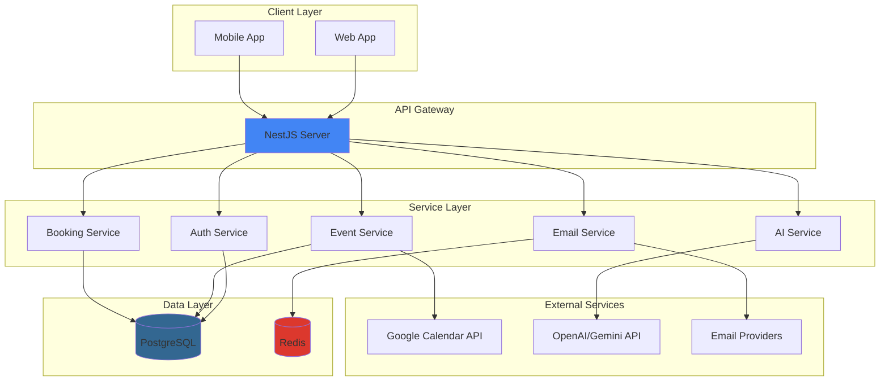

# 📚 Calento Server Documentation

> Comprehensive documentation for Calento Backend API & Services

## 🎯 Overview

Calento là một AI-powered calendar và scheduling application được xây dựng với:

- **Backend Framework**: NestJS (TypeScript)
- **Database**: PostgreSQL
- **Cache/Queue**: Redis + BullMQ
- **External APIs**: Google Calendar, OpenAI/Gemini
- **Authentication**: JWT + OAuth 2.0
- **Email**: Multi-provider support (SMTP, SendGrid, SES, etc.)

---

## 📖 Documentation Index

### Core Features

1. **[Authentication Flows](./01-AUTHENTICATION-FLOWS.md)** 🔐

   - Email/Password registration & login
   - Google OAuth 2.0 integration
   - JWT token management
   - Password reset flow
   - Cookie-based sessions
2. **[Google Calendar Integration](./02-GOOGLE-CALENDAR-INTEGRATION.md)** 📅

   - OAuth connection flow
   - Token management & auto-refresh
   - Calendar synchronization
   - Event sync (pull/push)
   - Webhook notifications
3. **[Event Management](./03-EVENT-MANAGEMENT.md)** 📆

   - CRUD operations
   - Recurring events (RRULE)
   - Event invitations & RSVP
   - Attendee management
   - Search & filtering
4. **[Booking System](./04-BOOKING-SYSTEM.md)** 🗓️

   - Booking link creation
   - Availability calculation
   - Time zone handling
   - Guest booking flow
   - Email confirmations

5. **[Email System](./05-EMAIL-SYSTEM.md)** 📧

   - SMTP configuration
   - Email templates
   - Transactional emails
   - Multi-provider support

### Additional Documentation

- **[AI Flow Architecture](./AI_FLOW_ARCHITECTURE.md)** - AI Assistant flow & functions
- **[API Reference](./API-REFERENCE.md)** - Complete API endpoints
- **[Database Schema](./DATABASE-SCHEMA.md)** - Database structure

### Client Documentation

- **[SEO Implementation](../../client/docs/SEO-IMPLEMENTATION.md)** 🔍 - SEO best practices & setup

### Deployment Guides

- **[Docker Deployment - VPS](./DEPLOYMENT-DOCKER-VPS.md)** 🐳 - Chi tiết deploy với Docker + Nginx
- **[Quick Start Guide](./DEPLOYMENT-QUICK-START.md)** ⚡ - Deploy nhanh trong 10 phút

---

## 🏗️ Architecture Overview

### High-Level Architecture



### Module Structure

```
server/src/
├── common/                    # Shared utilities
│   ├── decorators/           # Custom decorators
│   ├── filters/              # Exception filters
│   ├── guards/               # Auth guards
│   ├── interceptors/         # Response interceptors
│   ├── pipes/                # Validation pipes
│   ├── services/             # Shared services
│   └── queue/                # Queue configuration
│
├── config/                    # Configuration
│   ├── config.service.ts     # Environment variables
│   └── config.module.ts
│
├── database/                  # Database setup
│   ├── database.service.ts   # PostgreSQL connection
│   └── migrations/           # SQL migrations
│
├── modules/                   # Feature modules
│   ├── auth/                 # Authentication
│   ├── users/                # User management
│   ├── event/                # Events & calendar
│   ├── booking/              # Booking system
│   ├── google/               # Google integration
│   ├── email/                # Email service
│   ├── ai/                   # AI chatbot
│   ├── analytics/            # Analytics
│   ├── team/                 # Team features
│   └── webhook/              # Webhook handlers
│
└── main.ts                    # Application entry point
```

---

## 🚀 Quick Start

### Prerequisites

```bash
# Required
Node.js >= 18.x
PostgreSQL >= 14
Redis >= 6

# Optional
Docker & Docker Compose
```

### Installation

```bash
# Clone repository
git clone https://github.com/your-org/tempra.git
cd tempra/server

# Install dependencies
npm install

# Copy environment file
cp .env.example .env

# Edit .env with your configuration
nano .env
```

### Database Setup

```bash
# Create database
createdb tempra_dev

# Run migrations
npm run migration:run

# Seed data (optional)
npm run seed
```

### Development

```bash
# Start development server
npm run dev

# Server runs on http://localhost:8000

# Watch mode with auto-reload
npm run start:dev
```

### Testing

```bash
# Unit tests
npm test

# E2E tests
npm run test:e2e

# Test coverage
npm run test:cov
```

---

## 🔑 Key Features

### Authentication & Authorization

- ✅ JWT-based authentication
- ✅ OAuth 2.0 (Google)
- ✅ Role-based access control (RBAC)
- ✅ Password reset flow
- ✅ HTTP-only cookies for security

### Calendar & Events

- ✅ Full CRUD operations
- ✅ Recurring events (RRULE)
- ✅ Google Calendar sync (bidirectional)
- ✅ Event invitations & RSVP
- ✅ Attendee management
- ✅ Multiple calendars per user

### Booking & Scheduling

- ✅ Customizable booking links
- ✅ Availability calculation
- ✅ Multi-timezone support
- ✅ Buffer time between meetings
- ✅ Automatic email confirmations

### AI Integration

- ✅ Natural language processing
- ✅ Smart scheduling suggestions
- ✅ Event creation via chat
- ✅ Availability queries
- ✅ Context-aware responses

### Email System

- ✅ Multi-provider support
- ✅ Template engine (Handlebars)
- ✅ Transactional emails
- ✅ Email tracking
- ✅ Queue-based sending

### Background Jobs

- ✅ BullMQ queue system
- ✅ Event synchronization
- ✅ Email sending
- ✅ Webhook processing
- ✅ Analytics aggregation

---

## 🔧 Configuration

### Environment Variables

```env
# Server
NODE_ENV=development
PORT=8000
FRONTEND_URL=http://localhost:3000

# Database
DATABASE_HOST=localhost
DATABASE_PORT=5432
DATABASE_NAME=tempra_dev
DATABASE_USER=postgres
DATABASE_PASSWORD=postgres

# Redis
REDIS_HOST=localhost
REDIS_PORT=6379

# JWT
JWT_SECRET=your-secret-key-min-32-chars
JWT_REFRESH_SECRET=your-refresh-secret-key
JWT_EXPIRES_IN=1h
JWT_REFRESH_EXPIRES_IN=7d

# Google OAuth
GOOGLE_CLIENT_ID=your-google-client-id
GOOGLE_CLIENT_SECRET=your-google-client-secret
GOOGLE_REDIRECT_URI=http://localhost:8000/api/auth/google/callback

# AI (Gemini)
GEMINI_API_KEY=your-gemini-api-key

# Email
EMAIL_PROVIDER=smtp
SMTP_HOST=smtp.gmail.com
SMTP_PORT=587
SMTP_USER=your-email@gmail.com
SMTP_PASSWORD=your-app-password
```

---

## 📊 Database Schema

### Core Tables

```sql
-- Users & Authentication
users
user_credentials

-- Calendar & Events
calendars
events
event_attendees

-- Booking System
booking_links
bookings

-- Background Jobs
webhook_channels
email_logs
queue_jobs

-- AI & Analytics
ai_conversations
ai_messages
analytics_events
```

See [Database Schema Documentation](./DATABASE-SCHEMA.md) for details.

---

## 🔐 API Authentication

### Header-based (Recommended)

```bash
curl -X GET http://localhost:8000/api/events \
  -H "Authorization: Bearer {access_token}"
```

### Cookie-based

```bash
curl -X GET http://localhost:8000/api/events \
  -b "access_token={token}" \
  --cookie "refresh_token={refresh_token}"
```

### Public Endpoints

No authentication required:

- `POST /auth/register`
- `POST /auth/login`
- `POST /auth/google/login`
- `GET /book/:username/:slug`

---

## 📡 API Endpoints

### Authentication

```
POST   /api/auth/register          # Register new user
POST   /api/auth/login             # Login with email/password
POST   /api/auth/logout            # Logout
POST   /api/auth/refresh           # Refresh access token
GET    /api/auth/me                # Get current user
POST   /api/auth/forgot-password   # Request password reset
POST   /api/auth/reset-password    # Reset password
GET    /api/auth/google/url        # Get Google OAuth URL
POST   /api/auth/google/login      # Complete Google login
```

### Events

```
GET    /api/events                 # List events (paginated)
POST   /api/events                 # Create event
GET    /api/events/:id             # Get event
PATCH  /api/events/:id             # Update event
DELETE /api/events/:id             # Delete event
GET    /api/events/calendar        # Get events by date range
GET    /api/events/search          # Search events
GET    /api/events/recurring/expand # Expand recurring events
POST   /api/events/:id/invitations # Send invitations
```

### Booking

```
GET    /api/booking-links          # List booking links
POST   /api/booking-links          # Create booking link
PATCH  /api/booking-links/:id      # Update booking link
DELETE /api/booking-links/:id      # Delete booking link
GET    /api/book/:username/:slug   # Get booking page (public)
GET    /api/book/:username/:slug/slots # Get available slots (public)
POST   /api/book/:username/:slug   # Create booking (public)
```

### Google Calendar

```
GET    /api/google/connect         # Get OAuth URL
GET    /api/google/callback        # OAuth callback
GET    /api/google/status          # Check connection
DELETE /api/google/disconnect      # Disconnect
POST   /api/google/sync            # Sync calendars
```

See [API Reference](./API-REFERENCE.md) for complete documentation.

---

## 🧪 Testing

### Unit Tests

```bash
# Run all tests
npm test

# Run specific module
npm test -- auth.service

# Watch mode
npm test -- --watch
```

### Integration Tests

```bash
# Run E2E tests
npm run test:e2e

# Specific test file
npm run test:e2e -- auth.e2e-spec
```

### API Testing with curl

```bash
# Register user
curl -X POST http://localhost:8000/api/auth/register \
  -H "Content-Type: application/json" \
  -d '{"email": "test@example.com", "password": "Test123!"}'

# Login
curl -X POST http://localhost:8000/api/auth/login \
  -H "Content-Type: application/json" \
  -d '{"email": "test@example.com", "password": "Test123!"}' \
  -c cookies.txt

# Get events
curl -X GET http://localhost:8000/api/events \
  -b cookies.txt
```

---

## 🐛 Troubleshooting

### Common Issues

#### Database Connection Failed

```bash
# Check PostgreSQL is running
pg_isready

# Verify credentials
psql -U postgres -d tempra_dev

# Reset database
npm run migration:reset
npm run migration:run
```

#### Redis Connection Failed

```bash
# Check Redis is running
redis-cli ping

# Start Redis
redis-server

# Or with Docker
docker run -d -p 6379:6379 redis:alpine
```

#### JWT Token Invalid

```
Error: "Token expired" or "Invalid token"

Solution:
1. Use refresh token endpoint: POST /api/auth/refresh
2. Clear cookies and login again
3. Check JWT_SECRET is consistent
```

#### Google OAuth Redirect Failed

```
Error: "Redirect URI mismatch"

Solution:
1. Check GOOGLE_REDIRECT_URI in .env matches Google Console
2. Update authorized redirect URIs in Google Console
3. Ensure using correct domain (localhost vs production)
```

---

## 📈 Performance Optimization

### Database

```sql
-- Add indexes for frequently queried columns
CREATE INDEX idx_events_user_date ON events(user_id, start_time);
CREATE INDEX idx_bookings_link_date ON bookings(booking_link_id, slot_start);

-- Use materialized views for analytics
CREATE MATERIALIZED VIEW user_statistics AS
SELECT user_id, COUNT(*) as event_count, ...
FROM events GROUP BY user_id;
```

### Caching

```typescript
// Cache frequently accessed data
@Injectable()
export class CacheService {
  async cacheUserEvents(userId: string, events: Event[]) {
    await this.redis.setex(
      `user:${userId}:events`,
      3600, // 1 hour
      JSON.stringify(events)
    );
  }
}
```

### Queue Optimization

```typescript
// Use priority queues for important tasks
await eventSyncQueue.add('sync-event', data, {
  priority: 1, // High priority
  attempts: 3,
  backoff: { type: 'exponential', delay: 2000 }
});
```

---

## 🚀 Deployment

### Production Build

```bash
# Build application
npm run build

# Start production server
npm run start:prod
```

### Docker Deployment

**Quick Start:**
```bash
cd provision
docker compose up -d
```

**Chi tiết deployment:**

Xem [Docker Deployment Guide](./DEPLOYMENT-DOCKER-VPS.md) cho:

- ✅ VPS setup (Ubuntu, Docker, Firewall)
- ✅ SSL certificate configuration (Let's Encrypt)
- ✅ Nginx reverse proxy setup
- ✅ Docker Compose orchestration
- ✅ Health checks & monitoring
- ✅ Backup & maintenance strategies
- ✅ Troubleshooting guide

Hoặc [Quick Start Guide](./DEPLOYMENT-QUICK-START.md) để deploy nhanh trong 10 phút!

---

## 🤝 Contributing

### Development Workflow

1. Create feature branch: `git checkout -b feature/new-feature`
2. Make changes and write tests
3. Run linter: `npm run lint`
4. Run tests: `npm test`
5. Commit: `git commit -m "feat: add new feature"`
6. Push: `git push origin feature/new-feature`
7. Create Pull Request

### Code Style

```bash
# Format code
npm run format

# Lint code
npm run lint

# Type check
npm run type-check
```

### Commit Convention

Follow [Conventional Commits](https://www.conventionalcommits.org/):

```
feat: add new feature
fix: fix bug
docs: update documentation
style: formatting changes
refactor: code refactoring
test: add tests
chore: maintenance tasks
```

---

## 📞 Support & Resources

### Documentation

- [NestJS Docs](https://docs.nestjs.com/)
- [PostgreSQL Docs](https://www.postgresql.org/docs/)
- [BullMQ Docs](https://docs.bullmq.io/)
- [Google Calendar API](https://developers.google.com/calendar)

### Community

- GitHub Issues: [Report bugs](https://github.com/your-org/tempra/issues)
- Discussions: [Ask questions](https://github.com/your-org/tempra/discussions)
- Discord: [Join community](https://discord.gg/tempra)

### Team

- **Backend Lead**: backend@tempra.com
- **DevOps**: devops@tempra.com
- **Support**: support@tempra.com

---

## 📄 License

MIT License - see [LICENSE](../LICENSE) file for details.

---

## 🎉 Acknowledgments

Built with:

- [NestJS](https://nestjs.com/) - Progressive Node.js framework
- [PostgreSQL](https://www.postgresql.org/) - Advanced database
- [BullMQ](https://bullmq.io/) - Premium queue system
- [Google APIs](https://developers.google.com/) - Calendar integration
- [OpenAI/Gemini](https://openai.com/) - AI capabilities

---

**Happy Coding! 🚀**

For questions or support, please open an issue or contact the team.
